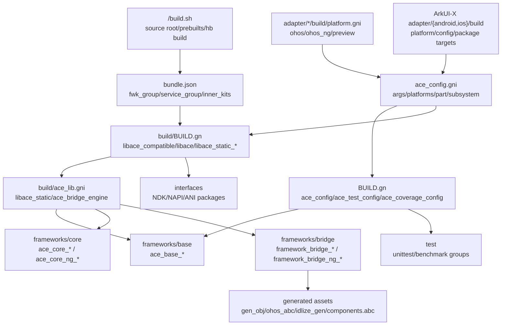
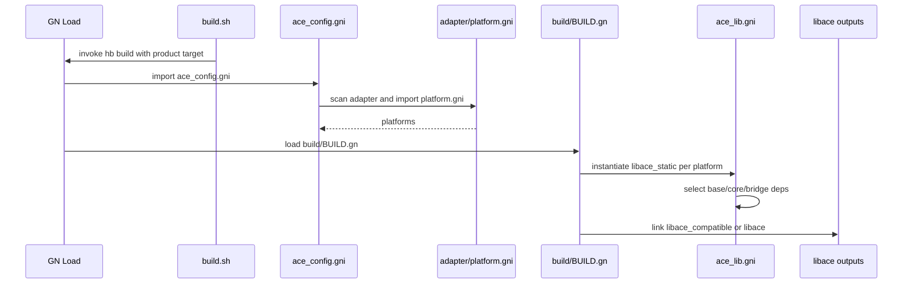
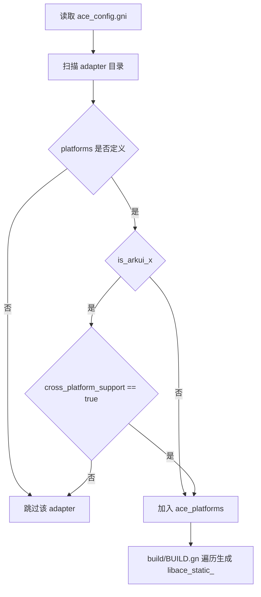
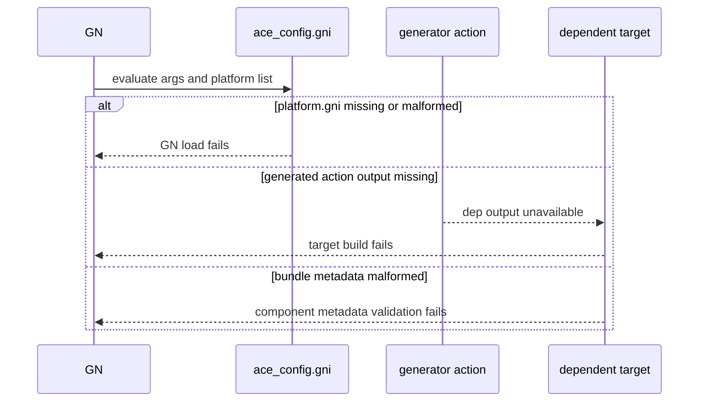

# 架构设计
> 编译构建功能域描述 ace_engine 从 OpenHarmony 根构建入口到 BUILD.gn、gni 模板、bundle.json 部件入口，以及 ArkUI-X adapter 参考构建之间的现有构建图组织方式。

## 设计元数据

| Field | Content |
|-------|---------|
| Design ID | DESIGN-Func-01-01-01 |
| 关联需求 | 已有能力补录（无独立 requirement.md） |
| 关联 Epic | 无 |
| 目标 Feature | Feat-01 BUILD.gn 结构 |
| 复杂度 | 复杂 |
| 目标版本 | N/A（内部构建结构，不对应 ArkTS API 版本） |
| Owner | ArkUI SIG |
| 状态 | Baselined（已有实现补录） |

## 需求基线

> 需求基线详见已有构建实现。以下仅列出设计阶段需要额外强调的要点。

| 项 | 补充说明（如需） |
|----|------------------|
| 根构建入口 | OpenHarmony 根目录 `build.sh` 负责定位源码根、配置 prebuilts Python/Node/OHPM，并转入 `build/hb/main.py build`，见 `<OH_ROOT>/build.sh:47-55`、`<OH_ROOT>/build.sh:100-123`、`<OH_ROOT>/build.sh:208-214`。 |
| 平台发现 | `ace_platforms` 由 `ace_config.gni` 扫描 `adapter/` 并导入各 adapter 的 `build/platform.gni` 形成，而不是在主构建入口硬编码，见 `ace_config.gni:336-353`。 |
| 主库聚合 | `build/BUILD.gn` 遍历 `ace_platforms` 生成 `libace_static_<platform>`，再由 `libace_compatible` 和可选 `libace` 聚合为共享库，见 `build/BUILD.gn:20-37`、`build/BUILD.gn:142-184`、`build/BUILD.gn:201-228`。 |
| 前端与生成物 | declarative 前端通过 `action`、`gen_obj`、`ohos_abc` 和 source_set 模板混合生成 JS/ABC/native 依赖，见 `frameworks/bridge/declarative_frontend/BUILD.gn:111-187`、`frameworks/bridge/declarative_frontend/BUILD.gn:211-248`。 |
| 部件入口 | `bundle.json` 将 `adapter/ohos/build:ace_packages`、CJ frontend、ANI 包作为 fwk_group 入口，见 `bundle.json:137-144`。 |
| ArkUI-X adapter 参考 | ArkUI-X 在同相对目录 `adapter/android/build` 与 `adapter/ios/build` 声明 Android/iOS 平台、config 和产物 target，并通过 `cross_platform_support = true` 接入 `ace_platforms`，见 `<ARKUI_X_ROOT>/foundation/arkui/ace_engine/adapter/android/build/platform.gni:16-28`、`<ARKUI_X_ROOT>/foundation/arkui/ace_engine/adapter/ios/build/platform.gni:16-28`。 |

## 上下文和现状

### 涉及仓和模块

| 仓库 | 模块路径 | 当前职责 | 本 Feature 影响 |
|------|----------|----------|-----------------|
| ace_engine | `ace_config.gni` | 声明构建参数、平台判定、全局路径、part/subsystem、平台列表发现，见 `ace_config.gni:19-104`、`ace_config.gni:186-202`、`ace_config.gni:336-353`。 | 作为 BUILD.gn 结构规格的全局入口。 |
| OpenHarmony | `<OH_ROOT>/build.sh` | 定位包含 `.gn` 的源码根，设置 Python/Node/OHPM prebuilts，并调用 `build/hb/main.py build`，见 `<OH_ROOT>/build.sh:47-55`、`<OH_ROOT>/build.sh:100-123`、`<OH_ROOT>/build.sh:208-214`。 | 作为从产品构建命令进入 ace_engine part 构建图的根入口。 |
| ace_engine | `BUILD.gn` | 提供全局 `ace_config`、`ace_test_config`、`ace_coverage_config`，见 `BUILD.gn:18-121`、`BUILD.gn:123-186`。 | 作为各 source_set 和测试目标共享的编译配置。 |
| ace_engine | `build/BUILD.gn`、`build/ace_lib.gni` | 生成 `libace_static_*`、分离引擎库、`libace_compatible` 和可选 `libace`，见 `build/BUILD.gn:20-84`、`build/ace_lib.gni:20-100`、`build/ace_lib.gni:104-131`。 | 作为主库聚合规则。 |
| ace_engine | `adapter/ohos/build/platform.gni`、`adapter/ohos/build/config.gni`、`adapter/ohos/build/BUILD.gn` | 声明 `ohos` 和条件性 `ohos_ng` 平台，选择 `libace_target`，并聚合 OHOS `ace_packages` 与 `libarkui_*` 组件库，见 `adapter/ohos/build/platform.gni:17-38`、`adapter/ohos/build/config.gni:25-34`、`adapter/ohos/build/BUILD.gn:18-109`。 | 作为 OpenHarmony 标准系统 adapter 构建边界。 |
| ace_engine | `frameworks/base/BUILD.gn` | 以 `ace_base_source_set` 模板生成各平台基础库 source_set，见 `frameworks/base/BUILD.gn:17-45`、`frameworks/base/BUILD.gn:135-140`。 | 作为主库底层依赖。 |
| ace_engine | `frameworks/core/BUILD.gn` | 分别提供旧框架 `ace_core_source_set` 和 NG `ace_core_ng_source_set` 模板，见 `frameworks/core/BUILD.gn:70-107`、`frameworks/core/BUILD.gn:705-722`。 | 作为核心框架构建分支。 |
| ace_engine | `frameworks/bridge/BUILD.gn` | 提供旧框架 bridge 与 NG bridge 模板，按平台实例化，见 `frameworks/bridge/BUILD.gn:18-56`、`frameworks/bridge/BUILD.gn:60-91`、`frameworks/bridge/BUILD.gn:94-114`。 | 作为前端桥接构建分支。 |
| ace_engine | `frameworks/bridge/arkts_frontend/arkoala_generator/BUILD.gn` | 定义 SDK patch、IDL 生成、安装和 `idlize_gen` source_set，见 `frameworks/bridge/arkts_frontend/arkoala_generator/BUILD.gn:70-92`、`frameworks/bridge/arkts_frontend/arkoala_generator/BUILD.gn:94-143`、`frameworks/bridge/arkts_frontend/arkoala_generator/BUILD.gn:181-185`。 | 作为静态 ArkTS 生成物入口。 |
| ace_engine | `interfaces/native/BUILD.gn`、`interfaces/napi/kits/BUILD.gn`、`interfaces/ets/BUILD.gn` | 构建 NDK、NAPI、ANI 包，见 `interfaces/native/BUILD.gn:17-30`、`interfaces/native/BUILD.gn:37-155`、`interfaces/napi/kits/BUILD.gn:53-101`、`interfaces/ets/BUILD.gn:18-59`。 | 作为接口与包输出边界。 |
| ace_engine | `test/unittest/BUILD.gn`、`test/benchmark/BUILD.gn` | 聚合单测、C API 单测和 benchmark，见 `test/unittest/BUILD.gn:20-68`、`test/benchmark/BUILD.gn:17-40`。 | 作为构建结构验证入口。 |
| ArkUI-X | `<ARKUI_X_ROOT>/foundation/arkui/ace_engine/adapter/android/build/` | Android 平台描述、宏配置、`libarkui_android` 和 Android 组件/插件/package 聚合，见 `<ARKUI_X_ROOT>/foundation/arkui/ace_engine/adapter/android/build/platform.gni:16-28`、`<ARKUI_X_ROOT>/foundation/arkui/ace_engine/adapter/android/build/config.gni:14-64`、`<ARKUI_X_ROOT>/foundation/arkui/ace_engine/adapter/android/build/BUILD.gn:25-55`、`<ARKUI_X_ROOT>/foundation/arkui/ace_engine/adapter/android/build/BUILD.gn:140-202`。 | 作为 ArkUI-X Android adapter 参考。 |
| ArkUI-X | `<ARKUI_X_ROOT>/foundation/arkui/ace_engine/adapter/ios/build/` | iOS 平台描述、宏配置、`arkui_ios`、`libarkui_ios.framework` 和组件 framework 聚合，见 `<ARKUI_X_ROOT>/foundation/arkui/ace_engine/adapter/ios/build/platform.gni:16-28`、`<ARKUI_X_ROOT>/foundation/arkui/ace_engine/adapter/ios/build/config.gni:14-80`、`<ARKUI_X_ROOT>/foundation/arkui/ace_engine/adapter/ios/build/BUILD.gn:26-97`、`<ARKUI_X_ROOT>/foundation/arkui/ace_engine/adapter/ios/build/BUILD.gn:256-320`。 | 作为 ArkUI-X iOS adapter 参考。 |

### 调用链层级分析

| 层 | 模块 | 职责 | 修改类型 |
|----|------|------|----------|
| 根构建入口 | `<OH_ROOT>/build.sh` | 定位源码根、配置 prebuilts（Python/Node/OHPM），调用 `build/hb/main.py build` | 无修改（规格补录） |
| 部件入口 | `bundle.json` | fwk_group/service_group/inner_kits 声明，part 分组和 inner kit 暴露 | 无修改（规格补录） |
| 全局配置 | `ace_config.gni` | 构建参数声明、平台判定、全局路径、part/subsystem 定义、`ace_platforms` 列表发现 | 无修改（规格补录） |
| 全局编译 config | `BUILD.gn`（根） | 提供 `ace_config`/`ace_test_config`/`ace_coverage_config` 共享编译配置 | 无修改（规格补录） |
| 平台选择 | `adapter/ohos/build/platform.gni`, `adapter/ohos/build/config.gni` | 声明 `ohos`/`ohos_ng` 平台，选择 `libace_target`，设置平台宏 | 无修改（规格补录） |
| 主库聚合 | `build/BUILD.gn`, `build/ace_lib.gni` | 遍历 `ace_platforms` 生成 `libace_static_*`，聚合为 `libace_compatible`/`libace` 共享库 | 无修改（规格补录） |
| 框架 source_set | `frameworks/base/BUILD.gn`, `frameworks/core/BUILD.gn`, `frameworks/bridge/BUILD.gn` | base/core/bridge 模板化 source_set，按平台实例化 | 无修改（规格补录） |
| 接口与包输出 | `interfaces/native/BUILD.gn`, `interfaces/napi/kits/BUILD.gn`, `interfaces/ets/BUILD.gn` | NDK 头和库、NAPI 模块、ANI 包构建 | 无修改（规格补录） |
| 平台产物 | `adapter/ohos/build/BUILD.gn` | OHOS `ace_packages` 聚合 + `libarkui_*` 组件库输出 | 无修改（规格补录） |
| 测试入口 | `test/unittest/BUILD.gn`, `test/benchmark/BUILD.gn` | 聚合单测（unittest/linux_unittest_capi）和 benchmark | 无修改（规格补录） |

### 适用架构规则

| Rule ID | 适用原因 | 设计结论 | 验证方式 |
|---------|----------|----------|----------|
| OH-ARCH-LAYERING | BUILD.gn 图跨配置、平台、框架、接口、测试多层。 | 上层聚合 target 依赖下层 source_set/生成物；`build/ace_lib.gni` 从 base、bridge、core 聚合主库，见 `build/ace_lib.gni:32-75`。 | GN 图评审、目标构建。 |
| OH-ARCH-SUBSYSTEM | 所有主要 target 需要落在 arkui/ace_engine 部件。 | 全局使用 `ace_engine_subsystem` 和 `ace_engine_part`，分别定义于 `ace_config.gni:186-202`，主库和接口 target 设置这些字段，见 `build/BUILD.gn:181-183`、`interfaces/native/BUILD.gn:153-154`。 | 代码评审、部件构建。 |
| OH-ARCH-IPC-SAF | 构建结构本身不定义 IPC/SAF 行为。 | 不新增 IPC/SAF 目标；只记录已有 `bundle.json` service_group 入口，见 `bundle.json:145-151`。 | 架构评审。 |
| OH-ARCH-API-LEVEL | 本 Feature 不新增 ArkTS/C API。 | API 表为空；接口构建 target 已存在，NDK 头和库定义见 `interfaces/native/BUILD.gn:17-30`。 | API 评审 N/A。 |
| OH-ARCH-COMPONENT-BUILD | 本 Feature 的对象就是 BUILD.gn 结构。 | 不修改现有 BUILD.gn；规格记录现有 `build/BUILD.gn`、`frameworks/*/BUILD.gn`、`interfaces/*/BUILD.gn`、`test/*/BUILD.gn` 构建图。 | `python3 -m json.tool bundle.json`、目标构建。 |
| OH-ARCH-ERROR-LOG | 构建结构不定义运行时错误码。 | 编译参数和日志宏通过 `ace_config` 注入，如 `USE_HILOG` 见 `BUILD.gn:26-33`、`ace_config.gni:208-212`。 | 构建配置评审。 |

## 不涉及项承接

> 本文档是已有构建能力补录，无独立 proposal.md。以下记录本设计明确不展开的维度。

| 维度 | 设计结论 |
|------|----------|
| 运行时 UI 行为 | 不涉及组件布局、渲染、事件等运行时语义。 |
| 公共 API | 不新增、不变更、不废弃 ArkTS、C API、NAPI 或 ABI。 |
| 依赖新增 | 不新增 BUILD.gn deps/public_deps/data_deps，不修改 bundle.json 依赖。 |
| 生成文件 | 不手工编辑 `generated/` 文件；仅记录 `idlize_gen` 现有构建路径。 |

## 关键设计决策

| 决策 ID | 问题 | 推荐方案 | 探索过的替代方案 | 取舍理由 | 影响 |
|---------|------|----------|------------------|----------|------|
| ADR-1 | 平台矩阵如何维护 | 由 `ace_config.gni` 扫描 `adapter/` 并导入 `platform.gni` 生成 `ace_platforms`，见 `ace_config.gni:336-353`。 | 在 `build/BUILD.gn` 硬编码平台列表。 | adapter 自声明平台能让主构建入口避免频繁修改。 | 新平台必须提供 adapter/build/platform.gni；ArkUI-X 还受 `cross_platform_support` 过滤。 |
| ADR-2 | 主库如何聚合旧框架与 NG 框架 | `libace_static` 模板按 `platform == "ohos_ng" || is_arkui_x` 选择 NG bridge/core，否则选择旧 bridge/core，见 `build/ace_lib.gni:41-75`。 | 每个共享库直接枚举所有 bridge/core 源文件。 | source_set 分层复用更高，平台条件集中在模板。 | 旧模式、NG 模式、ArkUI-X 共享同一聚合模板但依赖路径不同。 |
| ADR-3 | 分离 JS engine 库何时生成 | `build/BUILD.gn` 只在 `current_os == "ohos"` 且未 build-in engine 时按 `js_engines` 生成分离引擎库，见 `build/BUILD.gn:40-71`。 | 对所有平台都生成分离引擎库。 | 分离引擎库与 OHOS 动态加载模型绑定，非 OHOS 平台走静态/内建依赖。 | 预览/跨平台构建不可假设存在 `libace_engine_*`。 |
| ADR-4 | 生成物是否进入构建图 | declarative 前端 JS 资源通过 `action` 和 `gen_obj` 进入 native deps，静态 ArkTS 通过 `idlize_gen` 与 `components_compile_abc` 进入构建图，见 `frameworks/bridge/declarative_frontend/BUILD.gn:111-187`、`frameworks/bridge/arkts_frontend/arkoala_generator/BUILD.gn:181-185`、`frameworks/bridge/arkts_frontend/koala_projects/arkoala-arkts/BUILD.gn:176-195`。 | 生成后手工提交产物或在外部脚本中隐式生成。 | GN 显式依赖能让增量构建和 CI 追踪输入输出。 | 修改生成链必须同步维护 action 输入、输出和 deps。 |
| ADR-5 | 部件级入口如何声明 | `bundle.json` 的 `fwk_group`、`service_group`、`inner_kits` 作为部件入口，见 `bundle.json:137-151`、`bundle.json:153-220`。 | 仅靠 BUILD.gn target 暴露部件。 | OpenHarmony 部件构建需要 bundle 元数据参与分组和 inner kit 暴露。 | 新增包输出时必须同时评估 bundle.json，但本补录不做变更。 |
| ADR-6 | ArkUI-X Android/iOS 如何复用 ace_engine 构建图 | ArkUI-X adapter 在 `platform.gni` 中按 `target_os` 注入 `android`/`ios` 平台并声明 `cross_platform_support = true`，在 `config.gni` 中设置跨平台宏和 `libace_target`，再由平台 BUILD.gn 输出 `libarkui_android` 或 `arkui_ios`/`libarkui_ios.framework`，见 `<ARKUI_X_ROOT>/foundation/arkui/ace_engine/adapter/android/build/platform.gni:18-28`、`<ARKUI_X_ROOT>/foundation/arkui/ace_engine/adapter/android/build/config.gni:14-64`、`<ARKUI_X_ROOT>/foundation/arkui/ace_engine/adapter/android/build/BUILD.gn:25-55`、`<ARKUI_X_ROOT>/foundation/arkui/ace_engine/adapter/ios/build/platform.gni:18-28`、`<ARKUI_X_ROOT>/foundation/arkui/ace_engine/adapter/ios/build/config.gni:14-80`、`<ARKUI_X_ROOT>/foundation/arkui/ace_engine/adapter/ios/build/BUILD.gn:26-97`。 | 在 OpenHarmony 仓内为 Android/iOS 增加硬编码分支。 | adapter 自描述方式保持主构建图复用；平台差异留在 adapter config 和平台 package target 中。 | ArkUI-X 平台分析必须同时查看 ArkUI-X 仓下同相对目录的 adapter，而不能只看 OpenHarmony 仓内 adapter。 |

## 设计骨架

### 骨架范围

| 骨架项 | 目标 | 不包含 | 验证方式 |
|--------|------|--------|----------|
| 全局配置骨架 | 描述 `ace_config.gni`、顶层 `BUILD.gn` 的全局变量和 config。 | 不修改编译参数。 | 读取 `ace_config.gni`、`BUILD.gn`。 |
| 主库聚合骨架 | 描述 `build/BUILD.gn` 与 `build/ace_lib.gni` 的主库生成流程。 | 不新增库 target。 | 读取 `build/BUILD.gn`、`build/ace_lib.gni`。 |
| 平台 adapter 骨架 | 描述 OpenHarmony OHOS adapter 与 ArkUI-X Android/iOS adapter 的平台注入、config 和产物 target。 | 不把 ArkUI-X 参考文件复制到 OpenHarmony 仓。 | 读取 `adapter/ohos/build/*` 与 `<ARKUI_X_ROOT>/foundation/arkui/ace_engine/adapter/{android,ios}/build/*`。 |
| 框架 source_set 骨架 | 描述 base/core/bridge 的模板化 source_set。 | 不枚举每一个源文件语义。 | 读取 `frameworks/base/BUILD.gn`、`frameworks/core/BUILD.gn`、`frameworks/bridge/BUILD.gn`。 |
| 接口与包骨架 | 描述 NDK/NAPI/ANI、扩展组件、测试入口。 | 不新增 API 或测试。 | 读取 `interfaces/*/BUILD.gn`、`advanced_ui_component/BUILD.gn`、`test/*/BUILD.gn`。 |

### 骨架 Spec 拆分

| Task ID | 目标 | 受影响文件 | AC |
|---------|------|------------|----|
| TASK-SKELETON-1 | 补录 BUILD.gn 结构规格 | `specs/01-architecture/01-architecture-design/01-build-system/Feat-01-build-gn-structure-spec.md` | AC-1.1, AC-2.1, AC-3.1, AC-4.1 |

## 后续 Task 拆分

| Task ID | 目标 | 受影响文件 | 依赖 |
|---------|------|------------|------|
| TASK-BUILD-STRUCTURE-1 | 建立编译构建功能域基线设计与 Feat-01 规格 | `design.md`, `Feat-01-build-gn-structure-spec.md`, `specs/index.md` | 已有 BUILD.gn 实现 |
| TASK-BUILD-STRUCTURE-2 | 补充根构建入口、ArkUI-X adapter 参考和跨平台产物形态 | `design.md`, `Feat-01-build-gn-structure-spec.md` | 当前新增编译架构知识库与 ArkUI-X adapter 参考 |

## API 签名、Kit 与权限

### 新增 API

| API 签名 | 类型 | d.ts 位置 | 权限要求 | SysCap |
|----------|------|-----------|----------|--------|
| 无 | N/A | N/A | N/A | N/A |

### 变更/废弃 API

| 原有 API | 变更类型 | 新 API | 迁移说明 |
|----------|----------|--------|----------|
| 无 | N/A | N/A | N/A |

## 构建系统影响

### BUILD.gn 变更

```text
无 BUILD.gn 变更。
本 Feature 是现有 BUILD.gn/gni 结构补录，证据来自 OpenHarmony build.sh、ace_config.gni、BUILD.gn、build/、adapter/ohos/build/、frameworks/、interfaces/、test/ 下的现有构建文件，以及 ArkUI-X adapter/android、adapter/ios 参考构建文件。
```

### bundle.json 变更

无 `bundle.json` 变更。当前部件入口已由 `bundle.json` 声明，`fwk_group` 包含 `adapter/ohos/build:ace_packages`、`frameworks/bridge/cj_frontend:cj_frontend_ohos`、`interfaces/ets:ace_ani_package`，见 `bundle.json:137-144`。

## 可选设计扩展

### 架构图
<!-- 展开 -->



### 数据流/控制流
<!-- 展开 -->

| 步骤 | 调用方 | 被调用方 | 数据/接口 | 说明 |
|------|--------|----------|-----------|------|
| 1 | `<OH_ROOT>/build.sh` | `build/hb/main.py` | `args_list`、prebuilts PATH | 根脚本定位源码根、配置 Python/Node/OHPM，并调用 hb build，见 `<OH_ROOT>/build.sh:47-55`、`<OH_ROOT>/build.sh:100-123`、`<OH_ROOT>/build.sh:208-214`。 |
| 2 | `bundle.json` | `adapter/ohos/build:ace_packages` | `fwk_group` | OpenHarmony part 构建入口通过 `fwk_group` 进入 OHOS adapter package，见 `bundle.json:137-144`。 |
| 3 | `ace_config.gni` | `build/search.py` | adapter 目录列表 | 通过 `exec_script` 扫描 adapter，见 `ace_config.gni:338-340`。 |
| 4 | `ace_config.gni` | `adapter/<platform>/build/platform.gni` | `platforms` 列表 | 导入平台定义并过滤 ArkUI-X，见 `ace_config.gni:341-353`。 |
| 5 | ArkUI-X `platform.gni` | ArkUI-X `config.gni` | `android`/`ios` platform scope | Android/iOS 按 `target_os` 注入平台并设置 `cross_platform_support = true`，见 `<ARKUI_X_ROOT>/foundation/arkui/ace_engine/adapter/android/build/platform.gni:18-28`、`<ARKUI_X_ROOT>/foundation/arkui/ace_engine/adapter/ios/build/platform.gni:18-28`。 |
| 6 | `build/BUILD.gn` | `libace_static` 模板 | `ace_platforms`、`item.config` | 遍历平台生成静态聚合 target，见 `build/BUILD.gn:20-37`。 |
| 7 | `libace_static` | base/core/bridge target | `platform`、`config` | 按平台和模式选择 NG 或旧框架依赖，见 `build/ace_lib.gni:32-75`。 |
| 8 | 平台 adapter BUILD.gn | 平台主产物 target | `libace_target`、package deps | OHOS 聚合 `ace_packages`，ArkUI-X Android 输出 `libarkui_android`，iOS 输出 `arkui_ios`/`libarkui_ios.framework`，见 `adapter/ohos/build/BUILD.gn:80-109`、`<ARKUI_X_ROOT>/foundation/arkui/ace_engine/adapter/android/build/BUILD.gn:25-55`、`<ARKUI_X_ROOT>/foundation/arkui/ace_engine/adapter/ios/build/BUILD.gn:26-97`。 |

### 时序设计
<!-- 展开 -->



### 数据模型设计
<!-- 展开 -->

| 模型 | 字段/形态 | 位置 | 说明 |
|------|-----------|------|------|
| `platform` GN scope | `name`、`config`、可选 `cross_platform_support` | `ace_config.gni:347-353` 读取 adapter 导出的 platform。 | 平台 target 命名和依赖选择的输入。 |
| ArkUI-X Android platform | `name = "android"`、`cross_platform_support = true`、`config = import("config.gni")` | `<ARKUI_X_ROOT>/foundation/arkui/ace_engine/adapter/android/build/platform.gni:18-28`。 | ArkUI-X Android 接入 `ace_platforms` 的平台描述。 |
| ArkUI-X iOS platform | `name = "ios"`、`cross_platform_support = true`、`config = import("config.gni")` | `<ARKUI_X_ROOT>/foundation/arkui/ace_engine/adapter/ios/build/platform.gni:18-28`。 | ArkUI-X iOS 接入 `ace_platforms` 的平台描述。 |
| `libace_target` | GN target label | OHOS `adapter/ohos/build/config.gni:30-34`；ArkUI-X Android `<ARKUI_X_ROOT>/foundation/arkui/ace_engine/adapter/android/build/config.gni:63-64`；ArkUI-X iOS `<ARKUI_X_ROOT>/foundation/arkui/ace_engine/adapter/ios/build/config.gni:80`。 | 平台 package 或组件库依赖的主库输出选择。 |
| `engine_config` GN scope | `js_engines`、`use_build_in_js_engine`、`js_pa_support`、`pa_engine_path` | `build/BUILD.gn:22-27`、`build/BUILD.gn:41-80`。 | 分离引擎库生成的输入。 |
| `common_napi_libs` | NAPI 模块字符串数组 | `interfaces/napi/kits/napi_lib.gni:17-54`。 | NAPI 独立模块和旧 libace 静态并入路径共用的模块清单。 |
| `bundle.json component.build` | `group_type`、`inner_kits` | `bundle.json:137-220`。 | 部件构建入口和 inner kit 暴露元数据。 |

### 算法与状态机
<!-- 展开 -->



### 测试性设计
<!-- 展开 -->

| 测试层级 | 测试目标 | Mock 策略 | 验证方式 |
|----------|----------|-----------|----------|
| JSON 校验 | `bundle.json` 语法有效。 | 不需要 mock。 | `python3 -m json.tool bundle.json`。 |
| GN 目标构建 | 主库、单测、benchmark 入口可解析。 | OpenHarmony 构建系统提供平台和工具链。 | `./build.sh --product-name rk3568 --build-target ace_engine`、`./build.sh --product-name rk3568 --build-target unittest`。 |
| 源码静态检查 | 关键 target 和模板存在。 | 不需要 mock。 | `rg`/代码评审核对引用路径和行号。 |

### 异常传播时序图
<!-- 展开 -->



### 资源所有权矩阵
<!-- 展开 -->

| 资源 | 创建方 | 持有方 | 销毁触发 | 实际释放 | 异常回收 |
|------|--------|--------|----------|----------|----------|
| `ace_platforms` GN scope | `ace_config.gni` | GN evaluation context | 构建配置结束 | GN 内存释放 | GN load 失败终止构建。 |
| 生成 JS/ABC/IDL 输出 | 对应 `action`/`generate_static_abc` | GN out/gen 目录 | clean 或重新构建 | 构建系统清理 | 输出缺失导致依赖 target 构建失败。 |
| shared library 输出 | `ohos_shared_library` target | out 目录和打包系统 | clean 或重新链接 | 构建系统清理 | 链接失败终止对应 target。 |

### 接口参数规约
<!-- 展开 -->

| 接口 | 参数 | 类型 | 合法范围 | 非法处理 | 边界说明 |
|------|------|------|----------|----------|----------|
| `libace_static` 模板 | `platform` | GN string | `ace_platforms` 中的 `name` | GN 目标依赖解析失败 | `platform == "ohos_ng" || is_arkui_x` 进入 NG 分支，见 `build/ace_lib.gni:41-45`。 |
| `ace_bridge_engine` 模板 | `platform` | GN string | `ohos` 或 `ohos_ng` | `assert` 失败 | 模板显式断言，见 `build/ace_lib.gni:111-112`。 |
| `ace_napi_lib` 模板 | `target_name` | GN target name | `common_napi_libs` 中模块路径 | 目录或 target 不存在时构建失败 | 通过 `string_split` 与 `string_replace` 得到模块名，见 `interfaces/napi/kits/napi_lib.gni:56-79`。 |

### 线程与并发模型
<!-- 展开 -->

| 操作 | 发起线程 | 回调线程 | 跨进程边界 | 线程安全 | 重入约束 |
|------|----------|----------|------------|----------|----------|
| GN 文件解析 | 构建工具进程 | N/A | 无 | 由 GN/Ninja 保证 | BUILD.gn 不应依赖运行时可变状态。 |
| `action` 生成 | Ninja worker | N/A | 子进程执行脚本 | 输出由 declared outputs 管理 | 同一 output 不应由多个 target 生成。 |
| native 链接 | Ninja worker | N/A | 编译/链接子进程 | 构建系统调度 | 依赖图必须完整声明 inputs/deps。 |

## 详细设计

### 根构建入口与部件入口

OpenHarmony 根目录 `build.sh` 是产品构建进入 GN 图之前的 shell 入口。脚本从当前路径向上查找包含 `.gn` 的源码根，找不到则报错退出，见 `<OH_ROOT>/build.sh:47-55`。随后脚本按 host CPU/OS 选择 prebuilts 目录，配置 Python、Node.js、OHPM 和命令行工具 PATH，见 `<OH_ROOT>/build.sh:62-123`。当 `using_hb_new == "true"` 时，脚本调用 `python3 "${SOURCE_ROOT_DIR}/build/hb/main.py" build "${args_list[@]}"`，非 `ohos-sdk` 参数还会追加 `--prebuilt-sdk=true`，见 `<OH_ROOT>/build.sh:208-214`。

ace_engine part 的发布入口由 `bundle.json` 承接。`fwk_group` 包含 `adapter/ohos/build:ace_packages`、CJ frontend 和 ETS/ANI package，见 `bundle.json:137-144`；`service_group` 包含 OHOS service、SA profile 和配置资源，见 `bundle.json:145-151`；`inner_kits` 暴露 UI content、forward compatibility、form render、drawable descriptor、xcomponent controller 等 inner API，见 `bundle.json:153-220`。因此定位 ace_engine 构建产物缺失时，需要同时从根构建脚本、`bundle.json` part 分组和具体 BUILD.gn target 三层追溯。

### 全局配置与平台发现

`ace_config.gni` 先声明构建参数，例如 debug、PGO、coverage、split mode、wearable、Skia 升级和 container scope tracking，见 `ace_config.gni:19-104`。随后根据 `current_os/current_cpu` 推导 `use_mingw_win`、`use_mac`、`use_ios`、`use_linux`，见 `ace_config.gni:107-114`，并定义 `ace_root`、`arkui_root`、图形、运行时、Skia 等路径常量，见 `ace_config.gni:118-152`。

平台列表由以下流程形成：

1. `ace_platforms = []` 初始化，见 `ace_config.gni:336`。
2. `_ace_adapter_dir` 指向 `$ace_root/adapter`，`exec_script("build/search.py", ...)` 返回 adapter 子目录，见 `ace_config.gni:338-340`。
3. 每个 adapter 的 `build/platform.gni` 被导入，见 `ace_config.gni:341-345`。
4. 对于 ArkUI-X，仅 `platform.cross_platform_support` 为真时加入平台列表；非 ArkUI-X 平台只要求 `platform.name` 存在，见 `ace_config.gni:347-353`。
5. `current_platform` 只在 host 类平台 `windows/mac/linux` 场景赋值，见 `ace_config.gni:360-367`。

OpenHarmony 仓内 OHOS adapter 在 `adapter/ohos/build/platform.gni` 中仅当 `is_standard_system && !is_arkui_x` 时声明平台。`ohos` 总是加入，`ohos_ng` 仅在 `!is_asan && ace_engine_feature_enable_libace` 时加入，见 `adapter/ohos/build/platform.gni:17-38`。OHOS `config.gni` 将 `libace_target` 默认指向 `build:libace`，ASan 或未启用 `ace_engine_feature_enable_libace` 时切换到 `build:libace_compatible`，见 `adapter/ohos/build/config.gni:25-34`。

### 主库聚合结构

`build/BUILD.gn` 是主库生成入口。它遍历 `ace_platforms`，对每个平台实例化 `libace_static("libace_static_" + item.name)` 并传递 `item.config`，见 `build/BUILD.gn:20-37`。在 OHOS 构建中，若 `use_build_in_js_engine` 未启用，则按 `engine_config.js_engines` 生成分离的 `libace_engine_*`、debug engine 和 declarative engine，见 `build/BUILD.gn:40-71`；PA engine 在 `js_pa_support` 打开且平台不是 `ohos_ng` 时生成，见 `build/BUILD.gn:73-82`。

`libace_static` 模板是静态聚合点。它固定依赖 `frameworks/base:ace_base_$platform`，见 `build/ace_lib.gni:32`；当 `platform == "ohos_ng" || is_arkui_x` 时依赖 `framework_bridge_ng_$platform` 与 `ace_core_ng_$platform`，见 `build/ace_lib.gni:41-45`；旧 OHOS 模式下依赖 `framework_bridge_$platform` 与 `ace_core_$platform`，并把 `common_napi_libs` 对应静态 target 并入，见 `build/ace_lib.gni:46-70`。

共享库层分为 `libace_compatible` 和可选 `libace`。`libace_compatible` 在 OHOS 下依赖 `build:libace_static_ohos`，见 `build/BUILD.gn:142-184`；可选 `libace` 受 `!is_asan && ace_engine_feature_enable_libace` 控制，在 OHOS 下依赖 `build:libace_static_ohos_ng`，见 `build/BUILD.gn:201-228`。如果条件不满足，`libace` 退化为 fake group，见 `build/BUILD.gn:229-232`。

### 框架与组件 source_set

基础库由 `frameworks/base/BUILD.gn` 的 `ace_base_source_set` 模板生成，模板设置 subsystem、part、`ace_config`、zlib、hilog 等公共依赖，并在 `foreach(item, ace_platforms)` 中按平台实例化，见 `frameworks/base/BUILD.gn:17-45`、`frameworks/base/BUILD.gn:135-140`。

核心库存在旧框架和 NG 两套模板。旧框架 `ace_core_source_set` 定义于 `frameworks/core/BUILD.gn:70-107`，NG 模板 `ace_core_ng_source_set` 定义于 `frameworks/core/BUILD.gn:705-722`。NG 模板还显式依赖 Arkoala C interface 和 common native interface，见 `frameworks/core/BUILD.gn:695-697`。

组件插件化 target 使用 `frameworks/core/components_ng/components.gni` 的 `build_component_ng` 模板生成 `ace_core_components_<component>_<platform>` source_set，并默认依赖 `arkoala_generator:idlize_gen`，见 `frameworks/core/components_ng/components.gni:19-75`。

### 前端桥接与生成物

`frameworks/bridge/BUILD.gn` 提供 `framework_bridge` 和 `framework_bridge_ng` 两个模板。旧 bridge 依赖 declarative、arkts、card、codec、common、js、plugin 等前端，且在 `build_ohos_sdk || is_arkui_x` 时移除 ArkTS frontend，见 `frameworks/bridge/BUILD.gn:18-56`。NG bridge 依赖 arkts、codec、common_ng、accessibility、declarative，并在 ArkUI-X 下移除 ArkTS frontend，见 `frameworks/bridge/BUILD.gn:60-91`。两个模板通过 `foreach(item, ace_platforms)` 实例化，见 `frameworks/bridge/BUILD.gn:94-114`。

declarative 前端模板根据 `platform == "ohos_ng" || is_arkui_x` 选择 NG source 文件，否则选择旧 frontend source，见 `frameworks/bridge/declarative_frontend/BUILD.gn:24-82`。state management、window size breakpoint 等 JS 资源先由 `action` 生成，再由 `gen_obj` 转换为对象文件，见 `frameworks/bridge/declarative_frontend/BUILD.gn:111-187`。`declarative_js_engine` 模板将 modifier、ark_node、theme、layoutalgorithm、ABC 模块、engine bridge 等 target 作为 deps，见 `frameworks/bridge/declarative_frontend/BUILD.gn:211-248`。

静态 ArkTS 生成链由 `arkoala_generator/BUILD.gn` 和 `koala_projects/arkoala-arkts/BUILD.gn` 组成。前者 patch SDK、运行 generation.py、输出 bridge 和 libace generated 文件，并以 `idlize_gen` source_set 暴露依赖，见 `frameworks/bridge/arkts_frontend/arkoala_generator/BUILD.gn:70-143`、`frameworks/bridge/arkts_frontend/arkoala_generator/BUILD.gn:181-185`。后者通过 `generate_static_abc("components_compile_abc")` 生成 `modules_static.abc`，再通过 `ohos_copy("components_abc")` 输出 `components.abc`，见 `frameworks/bridge/arkts_frontend/koala_projects/arkoala-arkts/BUILD.gn:176-195`。

### 接口、扩展组件与测试入口

NDK 入口在 `interfaces/native/BUILD.gn`：非 ArkUI-X 场景定义 `ohos_ndk_headers("ace_header")` 和 `ohos_ndk_library("libace_ndk_rom")`，见 `interfaces/native/BUILD.gn:17-30`；`ohos_shared_library("ace_ndk")` 汇集 C/C++ 接口实现、平台依赖和 version script，见 `interfaces/native/BUILD.gn:37-155`；`ace_packages_ndk` group 依赖 `ace_ndk`，见 `interfaces/native/BUILD.gn:181-183`。

NAPI 模块清单在 `interfaces/napi/kits/napi_lib.gni` 的 `common_napi_libs`，见 `interfaces/napi/kits/napi_lib.gni:17-54`。`interfaces/napi/kits/BUILD.gn` 遍历该清单，在 mac/windows/linux/ohos/ohos_ng 不同场景实例化 `ace_napi_lib`，并用 `napi_group` 聚合公共 target，见 `interfaces/napi/kits/BUILD.gn:53-101`。

ANI 包由 `interfaces/ets/BUILD.gn` 的 `ace_ani_package` group 聚合 animator、componentSnapshot、componentUtils、curves、displaySync、mediaquery、promptAction、shape 等 ANI 库和 etc 资源，见 `interfaces/ets/BUILD.gn:18-59`。

扩展组件入口由 `advanced_ui_component/BUILD.gn` 和 `component_ext/BUILD.gn` 维护。前者按 `advanced_ui_component_libs` 生成平台 target，再在 `advanced_ui_component` group 中聚合高级组件，并根据 `ace_engine_feature_wearable` 排除部分组件，见 `advanced_ui_component/BUILD.gn:42-89`。后者用 `component_ext` group 聚合 arc 和 movingphoto 扩展组件，见 `component_ext/BUILD.gn:14-22`。

单测入口 `test/unittest/BUILD.gn` 提供 `unittest`、`linux_unittest`、`linux_unittest_capi` 和 `run_linux_unittest_capi`，见 `test/unittest/BUILD.gn:20-68`。`test/unittest/ace_unittest.gni` 定义 `ace_unittest` 模板，为组件、new、pipeline 等类型注入通用依赖和配置，见 `test/unittest/ace_unittest.gni:29-174`。benchmark 入口 `test/benchmark/BUILD.gn` 提供 `ace_baseline`、`benchmark` 和 `benchmark_linux`，见 `test/benchmark/BUILD.gn:17-40`。

### ArkUI-X adapter 参考构建

ArkUI-X 参考工程沿用 ace_engine adapter 扫描机制，但 Android/iOS adapter 位于 ArkUI-X 仓的同相对目录 `<ARKUI_X_ROOT>/foundation/arkui/ace_engine/adapter`。ArkUI-X `ace_config.gni` 同样扫描 adapter 并在 `is_arkui_x` 下要求 `cross_platform_support = true`，见 `<ARKUI_X_ROOT>/foundation/arkui/ace_engine/ace_config.gni:332-354`。Android adapter 在 `target_os == "android"` 时注入 `name = "android"` 的平台，iOS adapter 在 `target_os == "ios"` 时注入 `name = "ios"` 的平台，二者都声明 `cross_platform_support = true` 并导入本平台 `config.gni`，见 `<ARKUI_X_ROOT>/foundation/arkui/ace_engine/adapter/android/build/platform.gni:16-28`、`<ARKUI_X_ROOT>/foundation/arkui/ace_engine/adapter/ios/build/platform.gni:16-28`。

Android `config.gni` 定义 `ANDROID_PLATFORM`、`NG_BUILD`、`SK_BUILD_FOR_ANDROID`、`CROSS_PLATFORM`，启用内建 Ark engine、accessibility、rich/advanced components、XComponent、Rosen backend、Web、platform view、drag framework 等能力，并把 `libace_target` 指向 `adapter/android/build:libarkui_android`，见 `<ARKUI_X_ROOT>/foundation/arkui/ace_engine/adapter/android/build/config.gni:14-64`。iOS `config.gni` 定义 `CROSS_PLATFORM`、`IOS_PLATFORM`、`NG_BUILD`、`PANDA_TARGET_IOS`、`SK_BUILD_FOR_IOS`，启用内建 Ark engine、Rosen backend、Web、XComponent、platform view、drag framework 等能力，同时设置 `napi_support = false`，并把 `libace_target` 指向 `adapter/ios/build:arkui_ios`，见 `<ARKUI_X_ROOT>/foundation/arkui/ace_engine/adapter/ios/build/config.gni:14-80`。

ArkUI-X Android 主产物是 `ohos_shared_library("libarkui_android")`，依赖 `build:libace_static_android`、`ace_kit`、`interfaces/native:ace_static_ndk`、appframework NAPI、插件 native 工具库和 ICU API 静态库；如果定义 Ark engine，还会并入 runtime core 静态库，见 `<ARKUI_X_ROOT>/foundation/arkui/ace_engine/adapter/android/build/BUILD.gn:25-55`。Android `ace_packages` 聚合 adapter Java、`libarkui_android`、Ark debugger、NAPI/plugin/component 模块和按 `component_modules` 展开的 `arkui_<component>` 共享库，见 `<ARKUI_X_ROOT>/foundation/arkui/ace_engine/adapter/android/build/BUILD.gn:140-202`。

ArkUI-X iOS 主产物先由 `ohos_shared_library("arkui_ios")` 依赖 `build:libace_static_ios`、`ace_kit`、`ace_static_ndk`、appframework NAPI、插件 util 和 UIContent interface，再由 `ohos_combine_darwin_framework("libarkui_ios")` 组合为 framework 并导出 iOS adapter 头文件，见 `<ARKUI_X_ROOT>/foundation/arkui/ace_engine/adapter/ios/build/BUILD.gn:26-97`。iOS 组件模块同样从 `component_modules` 展开，但每个 `arkui_<component>` shared library 会继续通过 `ohos_combine_darwin_framework("libarkui_<component>")` 组合成组件 framework，并纳入 `ace_packages`，见 `<ARKUI_X_ROOT>/foundation/arkui/ace_engine/adapter/ios/build/BUILD.gn:256-320`。

## 风险和开放问题

| 项 | 类型 | 影响 | 处理方式 | Owner |
|----|------|------|----------|-------|
| `ace_platforms` 依赖 adapter 扫描结果 | 架构 | 中 | 新平台缺失 `platform.gni` 或未声明 `platform.name` 时不会进入主构建图；规格中明确平台发现路径，后续新增平台需评审 adapter/build/platform.gni。 | ArkUI SIG |
| `current_platform` 不选择 OHOS | 兼容性 | 低 | `current_platform` 只处理 windows/mac/linux host 场景，见 `ace_config.gni:360-367`；不得把它当作 OHOS 平台选择结果使用。 | ArkUI SIG |
| 生成链输入输出分散 | 架构 | 中 | declarative JS、Arkoala IDL、static ABC 分布在多个 BUILD.gn；后续修改需同步维护 action inputs/outputs/deps。 | ArkUI SIG |
| `bundle.json` 与 BUILD.gn 双入口 | 文档 | 中 | 新增包输出必须同时检查 bundle metadata 和 GN target；本 Feature 不新增入口。 | ArkUI SIG |
| ArkUI-X Android/iOS adapter 不在 OpenHarmony 当前仓内 | 文档 | 中 | 本设计将 ArkUI-X adapter 作为参考证据记录；分析 ArkUI-X 构建时必须查看 `<ARKUI_X_ROOT>/foundation/arkui/ace_engine/adapter/{android,ios}/build`，不能仅依据 OpenHarmony 仓内 adapter 覆盖范围下结论。 | ArkUI SIG |
| 跨平台组件库产物形态不同 | 兼容性 | 中 | OHOS 使用 `libarkui_*` 共享库，ArkUI-X Android 生成 `arkui_*` shared library，iOS 组合为 `libarkui_*.framework`；发布包核对需要按平台检查对应 adapter BUILD.gn，见 `adapter/ohos/build/BUILD.gn:18-78`、`<ARKUI_X_ROOT>/foundation/arkui/ace_engine/adapter/android/build/BUILD.gn:140-202`、`<ARKUI_X_ROOT>/foundation/arkui/ace_engine/adapter/ios/build/BUILD.gn:256-320`。 | ArkUI SIG |

## 设计审批

- [x] 需求基线已确认，设计覆盖 P0/P1 AC
- [x] 不涉及项已承接，N/A 和展开项都有结论
- [x] 涉及仓和模块职责清楚
- [x] 适用架构规则已识别并形成设计结论
- [x] 分层和子系统边界合规
- [x] API 变更有签名、权限、错误码和兼容性说明
- [x] BUILD.gn/bundle.json 影响明确
- [x] 设计输出和后续 Task 拆分明确
- [x] 关键设计决策有理由和影响说明
- [x] 风险和开放问题有 Owner

**结论:** 通过（已有实现补录）。
