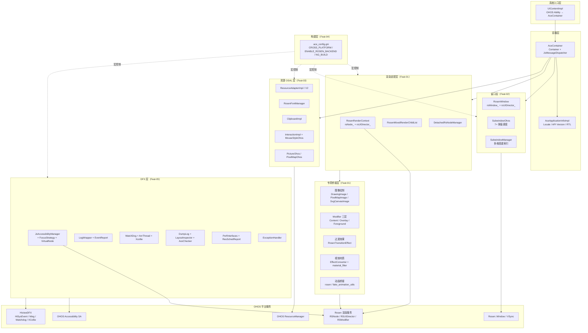
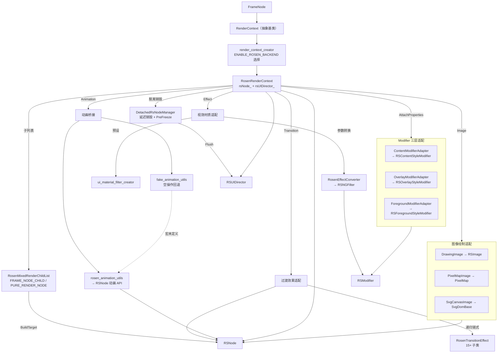
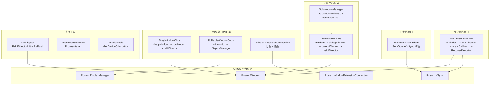
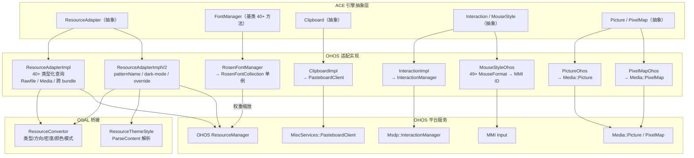
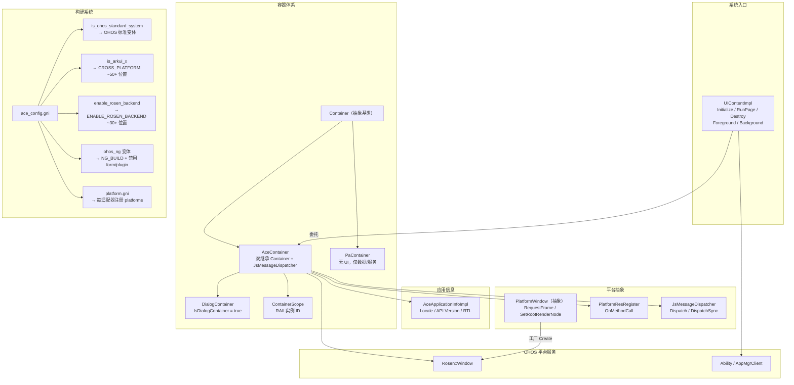
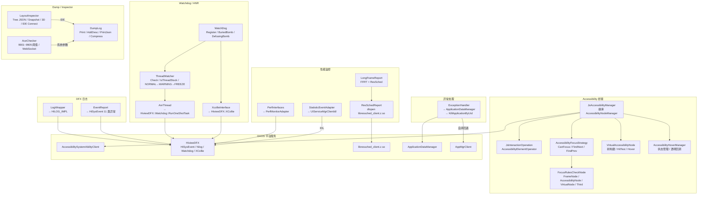

# 架构设计
> 确认目标仓和模块的架构约束、关键设计决策、Spec 拆分方向。

## 设计元数据

| Field | Content |
|-------|---------|
| Design ID | DESIGN-Func-02-01-01 |
| 关联需求 | 已有能力补录（无独立 requirement.md） |
| 关联 Epic | 跨平台适配层 |
| 目标 Feature | Feat-01（Rosen渲染后端适配），Feat-02（窗口与子窗口适配），Feat-03（资源与字体适配），Feat-04（平台抽象基类与构建适配），Feat-05（无障碍与DFX适配） |
| 复杂度 | 关键 |
| 目标版本 | API 9+ |
| Owner | ArkUI SIG |
| 状态 | Baselined（已有实现补录） |

## 需求基线

| 项 | 补充说明 |
|----|----------|
| Rosen 渲染后端适配 | 将 NG 渲染属性桥接到 Rosen RSNode/RSUIDirector 系统，使 ACE 引擎在 OHOS 平台上通过 RS 渲染服务完成渲染 |
| 混合子节点管理 | NG FrameNodeChild 与纯渲染 RSNode 需在同一父节点下有序共存 |
| 延迟销毁机制 | 脱离管线的 RSNode 需延迟销毁并在空闲时段冲刷渲染命令 |
| 窗口生命周期管理（Feat-02） | NG::RosenWindow 管理 OHOS Rosen Window 初始化、VSync 回调、前后台切换和超时恢复；旧管线通过 Platform::RSWindow 兼容 |
| 子窗口弹窗调度（Feat-02） | SubwindowOhos 创建和管理子窗口及其 AceContainer 子容器，支持 7+ 弹窗类型和 VSync 共享 |
| 子窗口注册中心（Feat-02） | SubwindowManager 单例管理多维度键索引的子窗口注册和容器-窗口双向映射 |
| 资源适配（Feat-03） | ResourceAdapterImpl/V2 双版本适配器桥接 OHOS ResourceManager，支持类型化查询、暗色模式检测、跨 bundle 访问 |
| 字体适配（Feat-03） | RosenFontManager 实现权重缩放和系统字体加载；FontManager 基类提供注册/加载/查询/观察者能力 |
| 剪贴板适配（Feat-03） | ClipboardImpl 桥接 PasteboardClient，支持多类型读写、同步/异步、自动填充检测 |
| 拖拽光标适配（Feat-03） | InteractionImpl 桥接 MSDP InteractionManager 支持拖拽生命周期和跨设备协调；MouseStyleOhos 支持 49+ 光标类型和自定义图标 |
| Picture/PixelMap OSAL（Feat-03） | PictureOhos/PixelMapOhos 桥接 Media::Picture/Media::PixelMap，支持 HDR 组合、TLV 编码、缩放裁剪 |
| Container 容器体系（Feat-04） | Container 抽象基类定义容器生命周期和查询接口；AceContainer 双继承 Container+JsMessageDispatcher，实现全部纯虚方法并集成 Rosen Window；DialogContainer/PaContainer 为特殊子类 |
| AceApplicationInfo（Feat-04） | AceApplicationInfoImpl 桥接 OHOS 应用信息管理，支持 Locale 设置、API 版本比较、RTL 判断 |
| PlatformWindow 工厂（Feat-04） | PlatformWindow 抽象基类定义 VSync 和根节点接口，工厂根据构建目标选择 RSWindow 或其他实现 |
| 构建系统适配（Feat-04） | ace_config.gni + adapter/ohos/build/ 控制平台选择（is_ohos_standard_system/is_arkui_x/enable_rosen_backend）、宏定义（CROSS_PLATFORM/ENABLE_ROSEN_BACKEND/NG_BUILD）和编译变体（ohos/ohos_ng） |
| UIContentImpl 入口（Feat-04） | UIContentImpl 作为 OHOS 系统级入口委托到 AceContainer 初始化、页面运行、前后台切换和配置变更 |
| Accessibility 桥接（Feat-05） | JsAccessibilityManager 桥接 OHOS AccessibilitySystemAbilityClient，支持注册/查询/操作/事件分发/子树管理 |
| FocusStrategy 焦点移动（Feat-05） | AccessibilityFocusStrategy + FocusRulesCheckNode 实现 OHOS 焦点移动规则（前向/后向/滚动/根类型边界） |
| VirtualNode 虚拟节点（Feat-05） | VirtualAccessibilityNode 构建虚拟无障碍节点树，支持布局/命中测试/悬停/聚焦判断 |
| DFX 日志与事件（Feat-05） | LogWrapper 桥接 hilog；EventReport 桥接 HiSysEvent（11类异常+ANR+Jank+无障碍失败） |
| Watchdog/ANR（Feat-05） | WatchDog+AnrThread+XcollieInterface 检测线程卡顿/ANR，状态转换 NORMAL→WARNING→FREEZE |
| Dump/Inspector（Feat-05） | DumpLog 格式化树输出；LayoutInspector 桥接 IDE+RS 快照；AceChecker 加载性能阈值 |
| 性能监控（Feat-05） | PerfInterfaces 桥接 PerfMonitorAdapter；ResSchedReport dlopen 加载资源调度库；StatisticEventAdapter 报告统计事件 |
| 异常处理（Feat-05） | ExceptionHandler 桥接 ApplicationDataManager 处理 JS 异常，无观察者时 AppMgrClient 自杀 |

## 上下文和现状

### 涉及仓和模块

| 仓库 | 补充架构说明 |
|------|-------------|
| ace_engine | 适配层位于 `adapter/ohos/` + `frameworks/core/components_ng/render/adapter/`，核心桥接代码在 `rosen_render_context.cpp`（395KB） |
| ace_engine（Feat-02） | 窗口适配层位于 `frameworks/core/components_ng/render/adapter/rosen_window.h/cpp`（NG管线）+ `frameworks/core/common/rosen/rosen_window.h/cpp`（旧管线）；子窗口适配位于 `adapter/ohos/entrance/subwindow/subwindow_ohos.h/cpp` |
| ace_engine（Feat-04） | 容器/入口位于 `adapter/ohos/entrance/ace_container.h/cpp` + `adapter/ohos/entrance/ui_content_impl.h/cpp`；构建系统位于 `adapter/ohos/build/ace_config.gni` + `adapter/ohos/build/common.gni`；应用信息位于 `adapter/ohos/entrance/ace_application_info_impl.h` |
| ace_engine（Feat-05） | 无障碍位于 `adapter/ohos/osal/js_accessibility_manager.h/cpp` + `adapter/ohos/osal/accessibility/focus_move/`；DFX 日志位于 `frameworks/base/log/` + `adapter/ohos/osal/event_report.cpp`；Watchdog 位于 `adapter/ohos/osal/anr_thread.cpp` + `adapter/ohos/capability/xcollie/`；Inspector 位于 `adapter/ohos/osal/layout_inspector.cpp` + `adapter/ohos/osal/ace_checker.cpp`；性能监控位于 `adapter/ohos/osal/perf_interfaces.cpp` + `adapter/ohos/osal/ressched_report.cpp` + `adapter/ohos/osal/statistic_event_adapter.cpp`；异常位于 `adapter/ohos/osal/exception_handler.cpp` |

### 调用链层级分析

| 层 | 模块 | 职责 | 修改类型 |
|----|------|------|----------|
| NG 组件层 | FrameNode/RenderContext | 持有 NG 渲染属性，通过 RenderContext 抽象接口下发更新 | 已有实现 |
| 适配工厂层 | render_context_creator.cpp | RenderContext::Create() 根据 ENABLE_ROSEN_BACKEND 选择 RosenRenderContext | 已有实现 |
| Rosen 适配层 | RosenRenderContext | 持 rsNode_+rsUIDirector_，将 NG 属性变更映射到 RS Modifier | 已有实现 |
| RS 适配层 | RosenMixedRenderChildList/DetachedRsNodeManager | 管理 RSNode 子列表和脱离管线节点延迟销毁 | 已有实现 |
| Drawing 适配层 | DrawingImage/PixelMapImage/SvgCanvasImage | 三路径图像数据→RS 绘制命令 | 已有实现 |
| Modifier 适配层 | ContentModifierAdapter/OverlayModifierAdapter/ForegroundModifierAdapter | 三层 Modifier Draw 委托 + AttachProperties 属性链接 | 已有实现 |
| Transition 适配层 | RosenTransitionEffect + 15+ 子类 | NG 过渡效果→RS 过渡效果递归转换 | 已有实现 |
| Effect 适配层 | RosenEffectConverter/ui_material_filter_creator | ACE 视效参数→RS NGFilter/NGShader | 已有实现 |
| Animation 适配层 | rosen_animation_utils.cpp/fake_animation_utils.cpp | AnimationUtils→RSNode 动画 API 桥接 | 已有实现 |
| RS 渲染服务 | Rosen::RSNode/RSUIDirector/RSModifier | OHOS 平台渲染服务，接收适配层提交的渲染命令 | 外部依赖 |
| Window 适配层（Feat-02） | NG::RosenWindow | NG 管线主窗口适配：rsWindow_+rsUIDirector_+vsyncCallback_ | 已有实现 |
| Window 适配层旧管线（Feat-02） | Platform::RSWindow | 旧管线兼容：SemQueue VSync 线程 | 已有实现 |
| Subwindow 适配层（Feat-02） | SubwindowOhos | 子窗口创建+弹窗调度+VSync共享 | 已有实现 |
| SubwindowManager（Feat-02） | SubwindowManager | 子窗口注册中心+多维度键索引+双向映射 | 已有实现 |
| Drag/Fold/Extension 适配层（Feat-02） | DragWindowOhos/FoldableWindowOhos/WindowExtensionConnection | 特殊窗口适配 | 已有实现 |
| 工具类（Feat-02） | RsAdapter/AceRosenSyncTask/WindowUtils | RS初始化/同步任务/方向转换 | 已有实现 |
| Resource 适配层（Feat-03） | ResourceAdapterImpl/ResourceAdapterImplV2 | OHOS ResourceManager 桥接+类型化查询+暗色模式 | 已有实现 |
| Font 适配层（Feat-03） | RosenFontManager/FontManager | 字体权重缩放+系统字体+注册加载查询 | 已有实现 |
| Clipboard 适配层（Feat-03） | ClipboardImpl/PasteDataImpl/MultiTypeRecordImpl | 剪贴板多类型读写+自动填充检测 | 已有实现 |
| Drag/Cursor 适配层（Feat-03） | InteractionImpl/MouseStyleOhos | 拖拽生命周期+49+光标类型+跨设备协调 | 已有实现 |
| Picture/PixelMap OSAL（Feat-03） | PictureOhos/PixelMapOhos | 图片/像素映射 HDR+TLV+缩裁 | 已有实现 |
| Container 适配层（Feat-04） | Container/AceContainer/DialogContainer/PaContainer | 容器生命周期+窗口类型+RAII+双继承 | 已有实现 |
| AceApplicationInfo 适配层（Feat-04） | AceApplicationInfoImpl | Locale+API版本+RTL | 已有实现 |
| PlatformWindow 工厂层（Feat-04） | PlatformWindow/PlatformResRegister/JsMessageDispatcher | VSync+根节点+消息分发 | 已有实现 |
| 构建系统层（Feat-04） | ace_config.gni/adapter/ohos/build/ | 宏选择+变体+跨平台 | 已有实现 |
| UIContentImpl 入口层（Feat-04） | UIContentImpl | OHOS系统入口→AceContainer | 已有实现 |
| Accessibility 桥接层（Feat-05） | JsAccessibilityManager | 注册/查询/操作/事件→OHOS Accessibility SA | 已有实现 |
| FocusStrategy 层（Feat-05） | AccessibilityFocusStrategy/FocusRulesCheckNode/FocusStrategyOsalNG | 焦点移动规则评估+前向后向遍历 | 已有实现 |
| VirtualNode 层（Feat-05） | VirtualAccessibilityNode | 虚拟节点树+命中测试+悬停 | 已有实现 |
| DFX 日志层（Feat-05） | LogWrapper/EventReport/FrameTraceAdapter | hilog+HiSysEvent+RS帧追踪 | 已有实现 |
| Watchdog/ANR 层（Feat-05） | WatchDog/AnrThread/XcollieInterface | 线程卡顿检测+ANR弹窗+超时计数 | 已有实现 |
| Dump/Inspector 层（Feat-05） | DumpLog/LayoutInspector/AceChecker | 树输出+布局快照+性能阈值 | 已有实现 |
| 性能监控层（Feat-05） | PerfInterfaces/ResSchedReport/StatisticEventAdapter | PerfMonitor+资源调度+统计事件 | 已有实现 |
| 异常处理层（Feat-05） | ExceptionHandler | JS异常→ApplicationDataManager→自杀 | 已有实现 |

### 适用架构规则

| Rule ID | 适用原因 | 设计结论 | 验证方式 |
|---------|----------|----------|----------|
| OH-ARCH-LAYERING | 适配层位于 NG 组件层与 RS 渲染服务之间 | 调用方向：NG→Adapter→RS，不可反向调用 | 代码评审/依赖检查 |
| OH-ARCH-SUBSYSTEM | 跨子系统（ace_engine→render_service） | 通过 RSUIDirector IPC 通信，不直接内存共享 | 集成测试 |
| OH-ARCH-API-LEVEL | 无 SDK API 变更 | InnerApi 级别，仅供框架内部使用 | API 评审 |
| OH-ARCH-COMPONENT-BUILD | ENABLE_ROSEN_BACKEND 编译宏影响构建选择 | ohos/ohos_ng 两个构建变体，通过 config.gni/config_ng.gni 控制 | 构建验证 |
| OH-ARCH-ERROR-LOG | 适配层无新增错误码 | 使用 RS 渲染服务自身错误体系 | hilog |

## 不涉及项承接

| 维度 | 设计结论 |
|------|----------|
| SDK API | 本适配层无 SDK API，不涉及 Public/System API 变更 |
| 窗口/子窗口 | 属于 Feat-02（窗口与子窗口适配），不在本 Feat 范围 |
| 资源/字体 | 属于 Feat-03（资源与字体适配），不在本 Feat 范围 |
| 渲染后端 | 属于 Feat-01（Rosen渲染后端适配），不在 Feat-04 范围 |
| 无障碍/DFX | 属于 Feat-05（无障碍与DFX适配），不在本 Feat 范围 |
| 窗口/子窗口 | 属于 Feat-02（窗口与子窗口适配），不在 Feat-05 范围 |

## 关键设计决策

| 决策 ID | 问题 | 推荐方案 | 探索过的替代方案 | 取舍理由 | 影响 |
|---------|------|----------|------------------|----------|------|
| ADR-1 | NG 渲染属性如何桥接到 RS 渲染服务？ | 双引用架构：RosenRenderContext 持 rsNode_（节点引用）+ rsUIDirector_（管线引用） | 单引用方案（仅 rsNode_，rsUIDirector_ 从全局获取） | 双引用使每个 RenderContext 独立持有管线上下文，支持多实例和 RSUIContext 切换；单引用依赖全局状态，多实例冲突 | 所有 NG 组件的渲染更新路径 |
| ADR-2 | FrameNodeChild 和纯渲染 RSNode 如何在同一父节点下共存？ | 混合子列表（RosenMixedRenderChildList）统一管理两类子节点 | 分离列表（FrameNodeChild 列表 + PureRenderChild 列表各自管理） | 混合列表支持按插入顺序交错排列，BuildTargetRSNodes 可精确控制最终子列表顺序；分离列表无法表达交错顺序 | 所有有子节点的 NG 组件的 RSNode 子树构建 |
| ADR-3 | 脱离管线的 RSNode 如何安全销毁？ | DetachedRsNodeManager 单例延迟销毁 + PreFreeze 空闲冲刷 | 立即销毁（节点脱离时直接 Release） | 立即销毁可能导致 RS 渲染服务内残留引用崩溃；延迟销毁通过 FlushImplicitTransaction 安全清理，PreFreeze 在 RSS 报告前冲刷避免数据不一致 | 多窗口/子窗口场景下的 RSNode 生命周期管理 |
| ADR-4 | NG 自定义绘制如何桥接到 RS Modifier 系统？ | 三层 Modifier 适配（Content/Overlay/Foreground 各有独立 RSModifier 子类） | 单层 Modifier 适配（所有绘制统一通过 RSContentStyleModifier） | 三层分离与 NG 渲染模型（Content→Background→Foreground→Overlay）对应，支持独立动画和脏区域标记；单层方案无法区分绘制层级 | 所有使用 ContentModifier/OverlayModifier/ForegroundModifier 的组件 |
| ADR-5 | NG 过渡效果如何桥接到 RS 过渡效果？ | RosenTransitionEffect 基类 + 15+ 具体子类 + 递归链式转换 | 直接使用 RS 过渡效果 API（无中间层） | 中间层使 NG 过渡效果类型系统独立于 RS API 变化，递归转换支持链式组合；直接使用 RS API 导致 NG 与 RS 耦合 | 所有使用 TransitionEffect 的组件动画 |
| ADR-F2-1 | NG 管线和旧管线如何并存？ | 双窗口适配层：NG::RosenWindow（NG管线）+ Platform::RSWindow（旧管线）并存 | 统一单一 Window 类（无兼容层） | 双适配层使 NG 管线使用 RSUIDirector 直接 VSync，旧管线使用独立线程 VSync；统一方案需旧管线迁移 | 所有窗口的 VSync 获取方式 |
| ADR-F2-2 | 子窗口 VSync 如何获取？ | 子管线通过 SetSubWindowVsyncListener 共享父管线 VSync 监听器 | 子窗口独立请求 VSync | 共享 VSync 避免子窗口独立 VSync 请求导致帧率不同步；独立请求增加 RS 调度压力 | 所有弹窗子窗口的帧驱动 |
| ADR-F2-3 | 子窗口如何按需索引？ | SubwindowMixMap 多维度键(instanceId+displayId+windowType+foldStatus+nodeId) 索引 | 按单一 instanceId 索引 | 多维度键支持同一实例在不同 display/fold/node 下创建不同子窗口；单一键无法区分 | 折叠屏/多 display 下的弹窗管理 |
| ADR-F2-4 | VSync 超时如何恢复？ | RecoverExecutor 3s 超时 DFX + 500ms ForceFlushVsync(UINT64_MAX) | 无恢复机制（等待自然 VSync） | 无恢复机制可能导致管线永久卡顿；ForceFlushVsync 生成 fake VSync 驱动管线继续 | 所有窗口的渲染管线稳定性 |
| ADR-F3-1 | 资源适配器如何支持暗色模式和跨 bundle？ | 双版本适配器并存：ImplV2 增加 patternNameMap_+ExistDarkRes+OverrideResourceAdapter | 单版本适配器（仅 Impl） | V2 的 pattern/dark-mode/override 能力是 V1 不具备的；单版本需大幅重构 | 主题系统和暗色模式切换 |
| ADR-F3-2 | 字体权重缩放如何实现？ | RosenFontManager 委托到 RosenFontCollection 单例 + NotifyVariationNodes | 每个容器独立管理字体集 | 单例共享字体集减少内存；独立管理每个容器字体集需更多资源 | 大字体适配和字体权重变化通知 |
| ADR-F3-3 | Clipboard 多类型读写如何区分？ | GetData(textCb, pixelMapCb, urlCb) 逐条 ProcessPasteDataRecord 按类型分发 | 单一回调返回所有数据 | 逐条分发使每种类型有独立回调，便于针对性处理；单一回调需消费者自行拆分 | 剪贴板多类型数据读取 |
| ADR-F3-4 | 拖拽光标类型如何映射？ | MouseFormat(49+种)→MMI pointerStyle ID 离散映射表 | 直接使用 MMI ID（无中间层） | 中间层隔离 ACE 与 MMI ID 编号差异；直接使用需 ACE 消费者了解 MMI 内部编号 | 所有光标样式设置 |
| ADR-F3-5 | UIExtension 场景光标如何设置？ | SetUeaCustomCursor 使用 hostWindowId+token 获取真实窗口 | 使用子窗口 ID 直接设置 | 子窗口 ID 在 MMI 中无效；host ID+token 是跨进程窗口的唯一标识 | UIExtension 组件光标控制 |
| ADR-F4-1 | Container 体系如何支持多种运行模式？ | 双继承 AceContainer(Container+JsMessageDispatcher)+子类(DialogContainer/PaContainer)+ContainerType枚举(ID范围分区) | 单一 Container 类（无子类分化） | 双继承+子类使 STAGE/FA/PA/DC 等模式各自有独立行为；单一类需大量条件分支 | 容器生命周期和窗口类型判断 |
| ADR-F4-2 | OHOS/Preview 同名 AceApplicationInfoImpl 如何切换？ | 链接时选择：adapter/ohos/ 和 adapter/preview/ 各提供同名实现 | 运行时工厂切换 | 链接时选择零运行时开销；工厂切换增加间接层 | 应用信息获取和 Locale 管理 |
| ADR-F4-3 | 跨平台宏如何控制 OHOS 子系统调用？ | CROSS_PLATFORM 宏 ~50+ 位置排除 OHOS 子系统调用 + is_arkui_x 构建标志 | 每个适配器独立判断平台 | 全局宏统一控制，编译期完全排除；独立判断导致散落的条件分支 | ArkUI-X 跨平台构建 |
| ADR-F4-4 | OHOS 系统级入口如何桥接到 ACE 容器？ | UIContentImpl 委托到 AceContainer（Initialize→RunPage→Destroy→Foreground/Background） | Ability 直接操作 AceContainer | 委托层使系统入口与容器解耦，支持多 Ability 类型；直接操作耦合 | OHOS 应用生命周期管理 |
| ADR-F5-1 | 无障碍如何桥接 OHOS 服务？ | JsAccessibilityManager 继承 AccessibilityNodeManager，内部类 JsInteractionOperation 实现 AccessibilityElementOperator | 直接调用 OHOS SA API | 内部类适配使 ACE 节点管理与 OHOS 操作接口解耦；直接调用需 ACE 理解 OHOS 内部协议 | 所有无障碍查询/操作/事件分发路径 |
| ADR-F5-2 | 焦点移动如何适配 OHOS 规则？ | FocusRulesCheckNode 适配器包装多种节点类型（FrameNode/AccessibilityNode/VirtualNode/ThirdProvider）为统一 ReadableRulesNode | 直接使用 OHOS ReadableRulesNode | 适配器层隔离 ACE 多类型节点与 OHOS 单一接口；直接使用需每种节点独立实现 | 所有焦点移动搜索路径 |
| ADR-F5-3 | ANR 检测如何实现？ | WatchDog 周期检测 + ThreadWatcher 状态转换（NORMAL→WARNING→FREEZE）+ Bomb 机制（输入任务队列 5s 阈值） | 纯 XCollie 超时检测 | WatchDog 自定义检测可精确追踪 JS/UI 线程状态和输入处理延迟；XCollie 仅提供通用超时 | 所有 ANR 弹窗和线程卡顿报告 |
| ADR-F5-4 | 资源调度如何动态加载？ | ResSchedReport dlopen("libressched_client.z.so") + dlsym("ReportData"/"ReportSyncEvent") | 静态链接 libressched_client | 动态加载避免资源调度库未安装时编译失败；静态链接需所有构建目标安装该库 | 所有资源调度数据报告路径 |
| ADR-F5-5 | JS 异常无观察者如何处理？ | ExceptionHandler 通知 ApplicationDataManager 观察者，无观察者时 KillApplicationByUid 自杀 | 仅记录日志不终止 | 自杀确保未处理 JS 异常不会导致应用处于不一致状态；仅记录日志可能导致后续行为异常 | JS 未捕获异常终态处理 |

## 设计骨架

### 骨架范围

| 骨架项 | 目标 | 不包含 | 验证方式 |
|--------|------|--------|----------|
| RenderContext 适配 | RosenRenderContext 双引用+工厂切换 | 窗口创建（Feat-02） | 单测 |
| RSNode 子列表 | RosenMixedRenderChildList 混合管理 | 子窗口子列表（Feat-02） | 单测 |
| 延迟销毁 | DetachedRsNodeManager PreFreeze | 窗口脱离（Feat-02） | 集成测试 |
| 图像适配 | DrawingImage/PixelMapImage/SvgCanvasImage | PixelMapOhos（Feat-03） | 单测 |
| Modifier 适配 | Content/Overlay/Foreground 三层 | DynamicComponent（Feat-04） | 单测 |
| 过渡效果 | RosenTransitionEffect + 15+ 子类 | 窗口过渡（Feat-02） | 单测 |
| 视效适配 | RosenEffectConverter + ui_material_filter_creator | LuminanceSampling（低频使用） | 单测 |
| 动画适配 | rosen_animation_utils/fake_animation_utils | 动画框架（03-02） | 编译检查+单测 |
| Container 容器体系 | AceContainer/DragContainer/PaContainer 双继承+子类 | 窗口创建细节（Feat-02） | 单测 |
| AceApplicationInfo | AceApplicationInfoImpl Locale+API版本+RTL | Preview 实现 | 编译检查+单测 |
| PlatformWindow 工厂 | PlatformWindow::Create 构建选择 | 旧管线 RSWindow 细节 | 单测 |
| 构建系统 | ace_config.gni 宏体系+ohos/ohos_ng 变体 | 具体组件构建 | 编译检查 |
| UIContentImpl 入口 | UIContentImpl→AceContainer 委托 | Ability 直接操作 | 集成测试 |
| Accessibility 桥接 | JsAccessibilityManager+JsInteractionOperation 注册/查询/操作 | OHOS 无障碍内部协议 | 单测+集成测试 |
| FocusStrategy | AccessibilityFocusStrategy+FocusRulesCheckNode+OsalNG | 焦点规则细节 | 单测 |
| VirtualNode | VirtualAccessibilityNode 树+命中测试+悬停 | 真实 Hover 事件 | 单测 |
| DFX 日志与事件 | LogWrapper hilog+EventReport HiSysEvent | 日志格式细节 | 单测+编译检查 |
| Watchdog/ANR | WatchDog+AnrThread+XcollieInterface | ANR 弹窗 UI | 单测+集成测试 |
| Dump/Inspector | DumpLog+LayoutInspector+AceChecker | IDE 连接细节 | 单测 |
| 性能监控 | PerfInterfaces+ResSchedReport+StatisticEventAdapter | 资源调度库版本 | 单测+集成测试 |
| 异常处理 | ExceptionHandler+ApplicationDataManager | AppMgrClient 版本 | 集成测试 |

### 骨架 Spec 拆分

| Task ID | 目标 | 受影响文件 | AC |
|---------|------|------------|----|
| TASK-SKELETON-1 | RenderContext 初始化与 RSNode 创建 | rosen_render_context.cpp/h, render_context_creator.cpp | AC-1.1~1.5 |
| TASK-SKELETON-2 | RSNode 混合子列表管理 | rosen_mixed_render_child_list.h/cpp | AC-2.1~2.5 |
| TASK-SKELETON-3 | DetachedRsNodeManager 延迟销毁 | detached_rs_node_manager.h/cpp | AC-3.1~3.5 |
| TASK-SKELETON-4 | Canvas Image 三路径适配 | drawing_image.h/cpp, pixelmap_image.h/cpp, svg_canvas_image.h/cpp, animated_image.h/cpp, image_painter_utils.h | AC-4.1~4.8 |
| TASK-SKELETON-5 | Modifier 三层适配 | rosen_modifier_adapter.h/cpp | AC-5.1~5.5 |
| TASK-SKELETON-6 | Transition 效果适配 | rosen_transition_effect.h/cpp, rosen_transition_effect_impl.h | AC-5.6~5.10 |
| TASK-SKELETON-7 | Visual Effect/Material 适配 | rosen_effect_converter.h/cpp, ui_material_filter_creator.cpp, rosen_luminance_sampling_helper.h | AC-6.1~6.9 |
| TASK-SKELETON-8 | Animation Utils 桥接 | rosen_animation_utils.cpp, fake_animation_utils.cpp | AC-7.1~7.6 |
| TASK-SKELETON-F04-1 | Container/AceContainer 双继承+生命周期 | ace_container.h/cpp, container.h | AC-1.1~1.12 |
| TASK-SKELETON-F04-2 | AceApplicationInfo 适配 | ace_application_info_impl.h | AC-2.1~2.5 |
| TASK-SKELETON-F04-3 | PlatformWindow 工厂+VSync | platform_window.h, platform_res_register.h | AC-3.1~3.5 |
| TASK-SKELETON-F04-4 | 构建系统宏体系 | ace_config.gni, common.gni, adapter/ohos/build/ | AC-4.1~4.8 |
| TASK-SKELETON-F04-5 | UIContentImpl 入口委托 | ui_content_impl.h/cpp | AC-5.1~5.5 |
| TASK-SKELETON-F05-1 | Accessibility 桥接 | js_accessibility_manager.h/cpp | AC-1.1~1.13 |
| TASK-SKELETON-F05-2 | FocusStrategy 焦点移动 | accessibility_focus_strategy.h/cpp, accessibility_focus_move_osal_ng.h | AC-2.1~2.8 |
| TASK-SKELETON-F05-3 | VirtualNode 虚拟节点 | accessibility_hover_virtual_node_utils.h/cpp | AC-3.1~3.6 |
| TASK-SKELETON-F05-4 | DFX 日志与事件 | log_wrapper.h, event_report.h/cpp | AC-4.1~4.10 |
| TASK-SKELETON-F05-5 | Watchdog/ANR | watch_dog.h/cpp, anr_thread.h/cpp, xcollieInterface_impl.h/cpp | AC-5.1~5.9 |
| TASK-SKELETON-F05-6 | Dump/Inspector/Checker | dump_log.h, layout_inspector.h/cpp, ace_checker.h/cpp | AC-6.1~6.10 |
| TASK-SKELETON-F05-7 | 性能监控与资源调度 | perf_interfaces.h/cpp, ressched_report.h/cpp, statistic_event_adapter.h/cpp | AC-7.1~7.11 |
| TASK-SKELETON-F05-8 | 异常处理 | exception_handler.h/cpp | AC-8.1~8.3 |

## 后续 Task 拆分

| Task ID | 目标 | 受影响文件 | 依赖 |
|---------|------|------------|------|
| TASK-F01-01 | RenderContext 初始化与 RSNode 创建 | rosen_render_context.cpp/h | 无 |
| TASK-F01-02 | RSNode 混合子列表 | rosen_mixed_render_child_list.h/cpp | TASK-F01-01 |
| TASK-F01-03 | DetachedRsNodeManager 延迟销毁 | detached_rs_node_manager.h/cpp | TASK-F01-01 |
| TASK-F01-04 | Canvas Image 三路径适配 | drawing_image.h/cpp, pixelmap_image.h/cpp, svg_canvas_image.h/cpp | TASK-F01-01 |
| TASK-F01-05 | Modifier 三层适配 | rosen_modifier_adapter.h/cpp | TASK-F01-01 |
| TASK-F01-06 | Transition 效果适配 | rosen_transition_effect.h/cpp | TASK-F01-05 |
| TASK-F01-07 | Visual Effect/Material 适配 | rosen_effect_converter.h/cpp, ui_material_filter_creator.cpp | TASK-F01-01 |
| TASK-F01-08 | Animation Utils 桥接 | rosen_animation_utils.cpp, fake_animation_utils.cpp | TASK-F01-01 |
| TASK-F02-01 | RosenWindow 主窗口生命周期 | rosen_window.cpp/h | TASK-F01-01 |
| TASK-F02-02 | RSWindow 旧管线兼容 | rosen_window.cpp/h(旧) | TASK-F02-01 |
| TASK-F02-03 | SubwindowOhos 子窗口管理 | subwindow_ohos.h/cpp, subwindow_ohos_static.cpp | TASK-F02-01 |
| TASK-F02-04 | SubwindowManager 注册中心 | subwindow_manager.h/cpp | TASK-F02-03 |
| TASK-F02-05 | 特殊窗口适配 | drag_window_ohos.h/cpp, foldable_window_ohos.h/cpp, window_extension_connection_ohos.h/cpp | TASK-F02-01 |
| TASK-F02-06 | 支撑工具类 | rs_adapter.h/cpp, ace_rosen_sync_task.h, window_utils.h/cpp | TASK-F02-01 |
| TASK-F03-01 | ResourceManager 资源适配 | resource_adapter_impl.h/cpp, resource_adapter_impl_v2.h/cpp, resource_theme_style.h/cpp, resource_convertor.h/cpp | TASK-F01-01 |
| TASK-F03-02 | FontManager 字体适配 | rosen_font_manager.h/cpp, font_manager.h | TASK-F03-01 |
| TASK-F03-03 | Clipboard 剪贴板适配 | clipboard_impl.h/cpp | TASK-F03-01 |
| TASK-F03-04 | Drag 拖拽适配 | interaction_impl.h/cpp, start_drag_listener_impl.h, stop_drag_listener_impl.h, coordination_listener_impl.h | TASK-F03-01 |
| TASK-F03-05 | Cursor 光标适配 | mouse_style_ohos.h/cpp | TASK-F03-01 |
| TASK-F03-06 | Picture/PixelMap OSAL | picture_ohos.h/cpp, pixel_map_ohos.h/cpp | TASK-F03-01 |
| TASK-F04-01 | Container/AceContainer 容器体系 | ace_container.h/cpp, container.h, container_scope.h | TASK-F01-01 |
| TASK-F04-02 | AceApplicationInfo 适配 | ace_application_info_impl.h | TASK-F04-01 |
| TASK-F04-03 | PlatformWindow 工厂 | platform_window.h, platform_res_register.h | TASK-F04-01 |
| TASK-F04-04 | 构建系统宏体系 | ace_config.gni, common.gni, adapter/ohos/build/ | 无 |
| TASK-F04-05 | UIContentImpl 入口委托 | ui_content_impl.h/cpp | TASK-F04-01 |
| TASK-F05-01 | Accessibility 桥接 | js_accessibility_manager.h/cpp | TASK-F04-01 |
| TASK-F05-02 | FocusStrategy 焦点移动 | accessibility_focus_strategy.h/cpp, accessibility_focus_move_osal_ng.h | TASK-F05-01 |
| TASK-F05-03 | VirtualNode 虚拟节点 | accessibility_hover_virtual_node_utils.h/cpp | TASK-F05-01 |
| TASK-F05-04 | DFX 日志与事件 | log_wrapper.h, event_report.h/cpp | TASK-F01-01 |
| TASK-F05-05 | Watchdog/ANR | watch_dog.h/cpp, anr_thread.h/cpp, xcollieInterface_impl.h/cpp | TASK-F05-04 |
| TASK-F05-06 | Dump/Inspector/Checker | dump_log.h, layout_inspector.h/cpp, ace_checker.h/cpp | TASK-F05-04 |
| TASK-F05-07 | 性能监控与资源调度 | perf_interfaces.h/cpp, ressched_report.h/cpp, statistic_event_adapter.h/cpp | TASK-F05-04 |
| TASK-F05-08 | 异常处理 | exception_handler.h/cpp | TASK-F05-04 |

## API 签名、Kit 与权限

### 新增 API

N/A，本特性为框架内部适配层，无 SDK API。

### 变更/废弃 API

N/A

## 构建系统影响

### BUILD.gn 变更

无新增 BUILD.gn 变更。所有文件已有实现，仅在 ENABLE_ROSEN_BACKEND 编译宏下启用。

关键 BUILD.gn 位置：
- `frameworks/core/components_ng/render/adapter/BUILD.gn` — Rosen 适配层源码
- `adapter/ohos/build/common.gni` — ENABLE_ROSEN_BACKEND 宏定义

### bundle.json 变更

无变更。

## 可选设计扩展

### 架构图

#### Func-02-01-01 整体架构图



#### Feat-01 Rosen渲染后端适配 架构图



#### Feat-02 窗口与子窗口适配 架构图



#### Feat-03 资源与字体适配 架构图



#### Feat-04 平台抽象基类与构建适配 架构图



#### Feat-05 无障碍与DFX适配 架构图



### 数据流/控制流

| 步骤 | 调用方 | 被调用方 | 数据/接口 | 说明 |
|------|--------|----------|-----------|------|
| 1 | NG FrameNode | RenderContext::Create() | ENABLE_ROSEN_BACKEND 标志 | 工厂选择创建 RosenRenderContext |
| 2 | RosenRenderContext | RSNode::Create() | SurfaceType | 创建对应类型 RSNode |
| 3 | RosenRenderContext | RSUIDirector::SetRootNode() | rsNode_ | 注册 RSNode 到 RS 管线 |
| 4 | RosenRenderContext | RosenMixedRenderChildList | MixedRenderChild 列表 | 添加/移除子节点 |
| 5 | RosenMixedRenderChildList | RSNode::AddChild/RemoveChild | BuildTargetRSNodes 结果 | 更新 RSNode 子列表 |
| 6 | RosenRenderContext | RSModifier::SetProperty | NG 属性值 | 属性变更映射到 RS Modifier |
| 7 | ContentModifierAdapter | NG ContentModifier::Draw | RSDrawingContext | 绘制委托 |
| 8 | DetachedRsNodeManager | RSUIDirector::FlushImplicitTransaction | 脱离 RSUIContext 集合 | PreFreeze 空闲冲刷 |

### 数据模型设计

| 类型 | C++ 实现 | 存储方案 | 说明 |
|------|----------|----------|------|
| RosenRenderContext | `std::shared_ptr<Rosen::RSNode> rsNode_` + `std::shared_ptr<Rosen::RSUIDirector> rsUIDirector_` | NG RenderContext 持有 | 双引用核心数据 |
| MixedRenderChild | `weak_ptr<RSNode> + weak_ptr<UINode> + SourceType` | RosenMixedRenderChildList 持有 | 混合子列表条目 |
| RSUIContext 脱离集合 | `unordered_set<RSUIContext*>` | DetachedRsNodeManager 单例持有 | 延迟销毁管理 |
| DrawingImage | `shared_ptr<RSImage> + shared_ptr<RSData>` | CanvasImage 持有 | RS 图像数据 |
| ModifierAdapter | `RefPtr<NG::Modifier> + RSAnimatableProperty 链` | RSModifier 持有 | 绘制委托+属性链接 |

### 线程与并发模型

| 操作 | 发起线程 | 回调线程 | 跨进程边界 | 线程安全 | 重入约束 |
|------|----------|----------|-----------|----------|----------|
| RenderContext::InitContext | UI 线程 | UI 线程 | 无 | rsNode_ 初始化后不变 | 不可重入 |
| BuildTargetRSNodes | UI 线程 | UI 线程 | 无 | RosenMixedRenderChildList 需在 UI 线程操作 | 不可重入 |
| PostDestructorTask | UI 线程提交 | 后台 TaskRunnerAdapter 执行 | RS 渲染服务进程 | DetachedRsNodeManager 使用 shared_mutex | 可重入 |
| PreFreezeFlushForAllContexts | Ark 空闲监视器线程 | 同线程 | RS 渲染服务进程 | 需锁保护 RSUIContext 集合 | 可重入 |

并发场景：

| 场景 | 风险 | 保护机制 |
|------|------|----------|
| 多窗口同时脱离 RSUIContext | 集合并发修改 | shared_mutex |
| PreFreeze 回调与 PostDestructorTask 同时执行 | 重复冲刷 | RS FlushImplicitTransaction 可重复调用无副作用 |
| UI 线程修改子列表与 RS 渲染线程读取 | 子列表不一致 | BuildTargetRSNodes 在 UI 线程执行，RS 在下一帧读取 |

## 详细设计

### RenderContext 双引用架构

RosenRenderContext 是 NG 渲染属性到 Rosen RS 渲染服务之间的核心桥接类。它持有两个关键引用：

1. **rsNode_** (`shared_ptr<Rosen::RSNode>`): 表示当前节点在 RS 渲染服务中的节点对象。根据 SurfaceType 创建不同子类：
   - `RSCanvasNode` — 默认类型（isSurface=false）
   - `RSSurfaceNode` — Surface 类型（isSurface=true）
   - `RSTextureNode` — Texture 导出类型（TextureExport=true）

2. **rsUIDirector_** (`shared_ptr<Rosen::RSUIDirector>`): 表示当前节点所属的 RS 渲染管线。来源：
   - 从 Window 的 rsUIDirector_ 获取（有窗口场景）
   - 从 pipeline context 的 RSUIContext 创建（无窗口场景）

初始化顺序（rosen_render_context.cpp）：
```
InitContext → CreateRSNode → AttachToUITree → SetRSUIContext
```

工厂切换（render_context_creator.cpp）：
```
#ifdef ENABLE_ROSEN_BACKEND
  return MakeRefPtr<RosenRenderContext>()
#else
  return nullptr / fallback
#endif
```

### 混合子列表管理

RosenMixedRenderChildList 维护两种类型子节点的混合列表：

- **FRAME_NODE_CHILD**: 来自 NG FrameNode 的子节点，持有 weak_ptr<RSNode> + weak_ptr<UINode>
- **PURE_RENDER_CHILD**: 来自 Modifier 或纯渲染创建的 RSNode，仅持有 weak_ptr<RSNode>

BuildTargetRSNodes 算法（rosen_mixed_render_child_list.cpp）：
1. 遍历混合列表
2. 对每个条目检查 weak_ptr 是否有效
3. 按插入顺序组装到 parent RSNode 的子列表

关键方法：
- `InsertPureRenderChildAt(index, rsNode)` — 在指定位置插入纯渲染子节点
- `InsertFrameChildBefore(targetUINode, rsNode)` — 在目标 FrameNodeChild 前插入
- `RemoveFrameChild/ClearPureRenderChildren` — 移除/清空子节点

### DetachedRsNodeManager 延迟销毁

DetachedRsNodeManager 是全局单例，管理脱离渲染管线的 RSUIContext：

核心数据结构：
- `unordered_set<RSUIContext*>` — 已脱离的上下文集合
- `TaskRunnerAdapter` — 后台任务执行器

关键流程：
1. RSUIContext 脱离 → `RegisterPreFreezeInstance` 或 `unordered_set.insert`
2. 延迟销毁 → `PostDestructorTask(fn)` → 后台线程执行 `FlushImplicitTransaction`
3. 空闲冲刷 → `PreFreezeFlushForAllContexts()` → 遍历集合执行 `FlushImplicitTransaction`
4. 上下文移除 → `RemoveRSUIContext` → `unordered_set.erase`

### Modifier 三层适配

三层 ModifierAdapter 分别继承不同的 RSModifier 子类：

| Adapter | RS 父类 | NG 绘制阶段 |
|---------|---------|-------------|
| ContentModifierAdapter | RSContentStyleModifier | Content（内容绘制） |
| OverlayModifierAdapter | RSOverlayStyleModifier | Overlay（覆盖层绘制） |
| ForegroundModifierAdapter | RSForegroundStyleModifier | Foreground（前景绘制） |

每个 Adapter 的 Draw 方法委托到被包装的 NG Modifier 的绘制函数：
```
ContentModifierAdapter::Draw(RSDrawingContext& ctx)
  → wrapped_ng_modifier_->OnDraw(ctx.canvas)
```

AttachProperties 将 NG 属性链接到 RSAnimatableProperty：
```
AttachProperties(ngProperty, rsAnimatableProperty)
  → rsAnimatableProperty.Set(ngProperty.Get())
  → 属性变更时 RS 动画系统自动驱动
```

### 过渡效果适配

RosenTransitionEffect 基类提供：
- `Attach/Detach` — 绑定到 RosenRenderContext
- `Appear/Disappear` — 创建出现/消失过渡
- `CombineWith` — 链式组合多个效果

15+ 具体子类（rosen_transition_effect_impl.h）：
Fade, Scale, Slide, Rotate, Opacity, Translate, TransitionAsCombine, etc.

链式转换算法：
```
ConvertToRosenTransitionEffect(ChainedTransitionEffect):
  → 递归遍历链式结构
  → 每个 ChainedTransitionEffect → 对应 RosenTransitionEffect 子类
  → 通过 CombineWith 链接
```

### RosenWindow 主窗口生命周期（Feat-02）

NG::RosenWindow 是 NG 渲染管线与 OHOS Rosen Window 之间的主窗口适配器。核心数据结构：

- `sptr<Rosen::Window> rsWindow_` — OHOS Rosen Window 对象
- `shared_ptr<Rosen::RSUIDirector> rsUIDirector_` — RS 渲染管线 UI Director
- `shared_ptr<Rosen::VsyncCallback> vsyncCallback_` — VSync 回调桥接

初始化流程（rosen_window.cpp）：
1. 构造函数：从 rsWindow_ 获取 RSUIDirector，设置 RSSurfaceNode
2. Init：设置 RequestVsyncCallback→RequestFrame()
3. RequestFrame：rsWindow_->RequestVsync(vsyncCallback_) + DFX超时任务
4. OnVsync：分发到 Window::OnVsync() + 移除超时任务 + post idle 51ms

VSync 超时恢复（RecoverExecutor 内部类）：
- 3s 超时：DFX 报告事件
- 500ms 后：ForceFlushVsync(UINT64_MAX frameCount) 生成 fake VSync

前后台状态管理：
- OnShow→rsUIDirector_->GoForeground + detached 节点 GoResume/GoStop
- OnHide→rsUIDirector_->GoBackground
- NotifyWindowAttachStateChange(true)→GoResume detached 节点
- NotifyWindowAttachStateChange(false)→hidden+detached 延迟 1s GoStop

### RSWindow 旧管线兼容（Feat-02）

Platform::RSWindow 为旧渲染管线提供独立 VSync 线程：
- SemQueue<bool> vsyncRequests_ — VSync 请求队列
- swap-locked pendingVsyncCallbacks_ — 回调队列
- VsyncThreadMain 线程循环：取出请求→sleep 1ms→swap callbacks→fire each

工厂：PlatformWindow::Create(AceView*)→std::make_unique<RSWindow>()

### SubwindowOhos 子窗口管理（Feat-02）

SubwindowOhos 是子窗口创建和管理适配器。核心数据结构：
- `sptr<Rosen::Window> window_` — 子窗口对象
- `sptr<Rosen::Window> dialogWindow_` — 对话框/Toast 专用窗口
- `sptr<Rosen::Window> parentWindow_` — 父窗口引用
- `shared_ptr<Rosen::RSUIDirector> rsUiDirector` — 子窗口 RS UIDirector

InitContainer 初始化链：
1. 创建 Rosen::WindowOption（WindowType 由弹窗类型决定）
2. Rosen::Window::Create → 创建 OHOS 子窗口
3. 注册 MenuWindowSceneListener（监听 attach/detach）
4. 初始化 AceContainer 子容器 + AceViewOhos
5. SetSubWindowVsyncListener（共享父管线 VSync）

7+ 弹窗类型调度方法：ShowMenuNG, ShowPopupNG, ShowTipsNG, ShowDialogNG, ShowToast, ShowBindSheetNG, ShowSelectOverlay

ArkTS 1.2 静态方法：ShowToastStatic, ShowDialogStatic, ShowActionMenuStatic

### SubwindowManager 子窗口注册中心（Feat-02）

SubwindowManager 是全局单例，管理子窗口注册和弹窗调度：

- SubwindowMixMap subwindowMap_ — 多维度键(instanceId+displayId+windowType+foldStatus+nodeId)
- containerMap_ / reverseContainerMap_ — 窗口ID↔容器ID双向映射

弹窗调度入口：ShowMenuNG, ShowPopupNG, ShowDialogNG, ShowToast, ShowBindSheetNG 等，均查找/创建子窗口后委托执行。

### 特殊窗口适配（Feat-02）

DragWindowOhos — 拖拽预览窗口：
- 持 dragWindow_ + rootNode_ + rsUiDirector_
- 四种预览绘制：DrawPixelMap, DrawFrameNode, DrawImage, DrawTextNG
- FlushImplicitTransaction 确保预览立即可见

FoldableWindowOhos — 折叠检测：
- 查询 Rosen::DisplayManager 返回 IsFoldExpand 状态

WindowExtensionConnection — UI 扩展连接：
- 旧版（Ohos）：ConnectExtension(want, rect, node, windowId)
- 新版（OhosNG）：ConnectExtension(node, windowId)
- UpdateRect/Show/Hide 接口相同

### ResourceManager 资源适配（Feat-03）

双版本资源适配器并存：
- ResourceAdapterImpl(V1): 40+ 类型化查询方法，Rawfile/RawFileData(含跨bundle版本)，MediaData，UpdateResourceManager切换bundle/module，线程安全shared_mutex
- ResourceAdapterImplV2(V2): 增加V1不具备的能力——GetPatternByName(patternNameMap_)，UpdateColorMode/GetResourceColorMode，ExistDarkResById/ExistDarkResByName，GetOverrideResourceAdapter/CreateOverrideResourceAdapter(静态工厂)

ResourceConvertor: 类型/方向/密度/颜色模式双向转换

ResourceThemeStyle: ParseContent解析，OnParseStyle/OnParseResourceMedia分别处理样式和媒体属性

### FontManager 字体适配（Feat-03）

RosenFontManager 仅实现2个纯虚方法：
1. VaryFontCollectionWithFontWeightScale→RosenFontCollection单例
2. LoadSystemFont→RosenFontCollection单例

FontManager基类提供40+具体方法：RegisterFont/SetFontFamily/GetSystemFontList/UpdateFontWeightScale/AddVariationNode/NotifyVariationNodes/RegisterTextEngineLoadCallback/UpdateStyleOptimizeFlagInCurrentLanguage等

### Clipboard 剪贴板适配（Feat-03）

ClipboardImpl桥接MiscServices::PasteboardClient：
- 写: SetData(文本+CopyOptions+isDragData), SetPixelMapData, SetData(混合PasteData)
- 读: GetData(文本cb), GetPixelMapData, GetData(三cb多类型), GetSpanStringData
- 同步/异步: GetDataSync/GetDataAsync(SYSTEM_CLIPBOARD_SUPPORTED)
- 自动填充检测: IsPasteFromAutoFill
- 数据容器: PasteDataImpl(延迟创建), MultiTypeRecordImpl(4种MIME)

### Drag 拖拽适配（Feat-03）

InteractionImpl桥接Msdp::DeviceStatus::InteractionManager单例：
- 生命周期: StartDrag(DragDataCore→Msdp DragData+StartDragListenerImpl), StopDrag(DragDropRet→Msdp DragDropResult+StopDragListenerImpl+DragDropBehaviorReporter)
- 风格: UpdateShadowPic/SetDragWindowVisible/UpdateDragStyle(DEFAULT/FORBIDDEN/COPY/MOVE)/UpdatePreviewStyle/UpdatePreviewStyleWithAnimation
- 协调: RegisterCoordinationListener/UnRegisterCoordinationListener

### Cursor 光标适配（Feat-03）

MouseStyleOhos桥接MMI光标系统：
- SetPointerStyle: MouseFormat(49+)→MMI pointerStyle ID离散映射
- SetCustomCursor/setUeaCustomCursor(UIExtension场景用hostWindowId+token)
- SetMouseIcon/SetPointerVisible

### Picture/PixelMap OSAL（Feat-03）

PictureOhos桥接Media::Picture: GetMainPixel/GetAuxPicturePixelMap/GetHdrComposedPixelMap
PixelMapOhos桥接Media::PixelMap: GetWidth/Height/GetPixels/Scale/GetCropPixelMap/EncodeTlv/WritePixels

### Container 容器体系（Feat-04）

Container 是 ACE 引擎容器抽象基类，定义完整的生命周期和查询接口：

核心类层次：
- **Container** — 抽象基类，定义 Initialize/Destroy/GetType/IsMainWindow 等纯虚方法
- **AceContainer** — 双继承 Container+JsMessageDispatcher，实现全部纯虚方法
  - 集成 Rosen Window（通过 PlatformWindow::Create 获取 RSWindow）
  - 集成多实例管理（ContainerType 枚举分区 ID 范围，每种 100000 个 ID）
- **DialogContainer** — 继承 AceContainer，IsDialogContainer()=true
- **PaContainer** — 继承 Container（无 JsMessageDispatcher），无 UI 渲染，仅数据/服务能力

ContainerScope RAII：构造时设置当前实例 ID，析构时恢复。Container::Current() 通过线程局部存储返回当前 Container 实例。

ContainerType ID 分区（每种 100000 个 ID）：
```
STAGE: 1~100000, FA: 100001~200000, PA_SERVICE: 200001~300000, ...
```

### AceApplicationInfo 适配（Feat-04）

AceApplicationInfoImpl 通过链接时选择机制提供 OHOS 应用信息：
- GetInstance() → OHOS AceApplicationInfoImpl 单例（adapter/ohos/ 提供 OHOS 实现，adapter/preview/ 提供 Preview 实现，同名类链接时选择）
- SetLocale → ResourceManager + Localization 设置语言
- ChangeLocale → OHOS ResourceManager locale 更新
- GreatOrEqualTargetAPIVersion → 比较 apiTargetVersion_ 字段
- IsRightToLeft → 基于 locale 语言代码判断 RTL 方向

### PlatformWindow 工厂（Feat-04）

PlatformWindow 抽象基类定义 VSync 和根节点接口：
- PlatformWindow::Create(AceView*) → 根据构建目标返回 RSWindow（OHOS）或其他实现
- RequestFrame/RegisterVsyncCallback → 请求/注册 VSync
- SetRootRenderNode → 设置根渲染节点（旧管线使用）
- PlatformResRegister::OnMethodCall → 处理平台方法调用
- JsMessageDispatcher::Dispatch/DispatchSync → AceContainer 实现异步/同步消息分发

### 构建系统宏体系（Feat-04）

ace_config.gni + adapter/ohos/build/ 控制平台选择和编译变体：

关键构建标志：
- **is_ohos_standard_system=true** → 启用 OHOS 标准系统变体（is_standard_system && !is_arkui_x）
- **is_arkui_x=true** → CROSS_PLATFORM 宏定义，禁用 ~50+ OHOS 子系统调用位置
- **enable_rosen_backend=true** → ENABLE_ROSEN_BACKEND 宏，选择 ~30+ Rosen 路径位置
- **ohos_ng 变体** → NG_BUILD 定义 + 禁用 form/plugin（!is_asan && ace_engine_feature_enable_libace）

platform.gni 迭代：每个适配器目录注册 platforms 列表，搜索 adapter/ 子目录。

Preview 平台构建：使用 adapter/preview/ 实现（mingw/mac/linux 条件）。

### UIContentImpl 入口（Feat-04）

UIContentImpl 是 OHOS 系统级入口，委托到 AceContainer：

关键方法：
- Initialize → 创建 AceContainer 并初始化
- RunPage/RunPageByName → 运行页面（委托 AceContainer）
- Destroy → 销毁 AceContainer
- Foreground/Background → 前后台切换（委托 AceContainer）
- OnConfigurationUpdated → 配置变更传播（委托 AceContainer）

### Accessibility 桥接（Feat-05）

JsAccessibilityManager 继承 AccessibilityNodeManager，桥接 OHOS AccessibilitySystemAbilityClient：

核心类层次：
- **JsAccessibilityManager** — 继承 AccessibilityNodeManager，内部类 JsInteractionOperation 实现 AccessibilityElementOperator
- **WebInteractionOperation** — #ifdef WEB_SUPPORTED，Web 无障碍操作桥接
- **ToastAccessibilityConfigObserver** — AccessibilityConfig::AccessibilityConfigObserver
- **JsAccessibilityStateObserver** — Accessibility::AccessibilityStateObserver

关键流程：
1. InitializeCallback → 注册 AccessibilityElementOperator 到 OHOS SA
2. RegisterInteractionOperation → 创建 JsInteractionOperation 并注册
3. SearchElementInfoByAccessibilityId/SearchByText → 查询元素信息
4. ExecuteAction → OHOS ActionType→ArkUI Action 映射执行
5. SendAccessibilityAsyncEvent/SyncEvent → 发送事件到 OHOS 无障碍服务

UIExtension 子树：
- RegisterInteractionOperationAsChildTree → 注册子树
- UpdateElementInfosTreeId → 多树 ID 标签管理
- RegisterAccessibilityChildTreeCallback → 子树回调管理

### FocusStrategy 焦点移动（Feat-05）

AccessibilityFocusStrategy 实现 OHOS 焦点移动规则：

节点适配器层次（FocusRulesCheckNode 子类）：
- FrameNodeRulesCheckNode — 包装 NG FrameNode
- AccessibilityNodeRulesCheckNode — 包装 AccessibilityNode（旧管线）
- VirtualAccessibilityNodeRulesCheckNode — 包装 VirtualAccessibilityNode
- ThirdRulesCheckNode — 包装第三方提供者元素
- DetectParentRulesCheckNode — 包装 AccessibilityElementInfo（父链检测）

FocusStrategyOsalNG（NG 管线 OSAL）：
- 维护 baseNode_/rootNode_/baseNextNode_/basePrevNode_ 追踪焦点搜索起点
- DetectElementInfoFocusableThroughAncestor — 通过祖先链检测可读性

焦点移动结果（AceFocusMoveResult）：
- FIND_SUCCESS / FIND_FAIL / FIND_CHILDTREE / FIND_EMBED_TARGET / FIND_FAIL_IN_CHILDTREE / FIND_FAIL_IN_SCROLL / FIND_FAIL_LOST_NODE / FIND_FAIL_IN_ROOT_TYPE

### VirtualAccessibilityNode 虚拟节点（Feat-05）

VirtualAccessibilityNode 构建虚拟无障碍节点树：

核心数据结构：
- nodeId_（int32_t, 默认 INVALID_NODE_ID=-1）
- rect_（NG::RectT<int32_t>）
- children_（std::vector<RefPtr<VirtualAccessibilityNode>>）
- parent_（WeakPtr<VirtualAccessibilityNode>）
- lastHovering_（WeakPtr<VirtualAccessibilityNode>）

关键方法：
- HitTest → 从右到左遍历子节点返回最深层命中节点
- OnAccessibilityHover → 分发悬停事件并更新 lastHovering_
- CanAccessibilityFocus → 通过 AccessibilityFocusStrategy 判断
- CloneTree → 深拷贝虚拟节点树

### DFX 日志与事件（Feat-05）

LogWrapper 桥接 OHOS hilog：
- PrintLog → HILOG_IMPL（domain=0xD003900, 100+ tags）
- SEC_PARAM/SEC_TAG_LOGI → IS_RELEASE_VERSION 安全掩码
- STRIP_RELEASE_LOG → 编译期剥离 LOGD/LOGI/LOGW
- ACE_INSTANCE_LOG → 日志前缀附加实例 ID

EventReport 桥接 OHOS HiSysEvent：
- 11 类异常映射到 HiSysEventWrite FAULT 参数
- ANRRawReport → SECURITY 级别（含 JS stacktrace）
- JankFrameReport → STATISTIC 级别
- ReportAccessibilityFailEvent → 无障碍操作失败
- FrameRateDurationsStatistics → FRC 场景 FPS

### Watchdog/ANR（Feat-05）

WatchDog+AnrThread+XcollieInterface 检测线程卡顿和 ANR：

ANR 检测流程：
1. WatchDog::Register → 创建 JS+UI ThreadWatcher
2. ThreadWatcher::Check → 定期检测（3s/2s/1s 间隔）
3. IsThreadStuck → loopTime_/threadTag_ 增长判断
4. NORMAL→WARNING→FREEZE 状态转换
5. DetonatedBomb → 输入任务 >5s 触发 ANR 弹窗

AnrThread 桥接：
- PostTaskToTaskRunner → HiviewDFX::Watchdog::RunOneShotTask（委托到 OHOS watchdog 线程）

XcollieInterface 桥接：
- SetTimerCount → HiviewDFX::XCollie::GetInstance().SetTimerCount()
- TriggerTimerCount → HiviewDFX::XCollie::GetInstance().TriggerTimerCount()

GC 信号处理（#ifdef OHOS_PLATFORM）：
- InitializeGcTrigger → SIG=60 信号处理初始化
- CheckGcSignal → sigtimedwait 检测 GC 请求

### Dump/Inspector/Checker（Feat-05）

DumpLog 格式化树输出：
- Print(depth, className, childSize) → 格式化输出组件树
- AddDesc(args) → 模板化累积描述
- PrintJson → JSON dump
- OutPutByCompress → zlib 压缩（MAX_DUMP_LENGTH=100000）

LayoutInspector 桥接 IDE 和 RS：
- GetInspectorTreeJsonStr → 生成组件树 JSON
- CreateLayoutInfo → 创建布局快照
- GetSnapshotJson → 含 3D 捕获的快照 JSON
- RegisterConnectCallback → IDE ConnectServerManager

AceChecker 性能阈值加载：
- InitPerformanceParameters → system::GetIntParameter 加载 5 组阈值（9901~9905）
- SetPerformanceCheckStatus → 启用/禁用检查 + WebSocket 通知

### 性能监控与资源调度（Feat-05）

PerfInterfaces 桥接 HiviewDFX PerfMonitorAdapter：
- RecordInputEvent → 记录输入事件
- Start/End(sceneId) → 标记性能场景
- SetFrameTime → 设置帧时间（vsyncTime/duration/jank）
- ReportJankFrameApp → 报告帧抖动

ResSchedReport dlopen 加载资源调度库：
- dlopen("libressched_client.z.so") → 动态加载
- dlsym("ReportData") → 获取异步报告函数指针
- dlsym("ReportSyncEvent") → 获取同步报告函数指针
- #ifdef CROSS_PLATFORM → 跳过 dlopen/dlsym

StatisticEventAdapter 桥接 UIServiceMgrClientIdl：
- ReportStatisticEvents → 报告统计事件（#ifdef UI_SERVICE_WITH_IDL）

LongFrameReport 长帧检测：
- ILongFrame::ReportStartEvent/EndEvent → FFRT+ResSchedDataReport

### 异常处理（Feat-05）

ExceptionHandler 桥接 OHOS ApplicationDataManager：

处理流程：
1. HandleJsException → JsErrorObject→AppExecFwk::ErrorObject（name/message/stack）
2. NotifyUnhandledException → 通知异常观察者
3. NotifyExceptionObject → 传递错误对象
4. 若无观察者 → KillApplicationByUid（AppMgrClient::KillApplicationSelf）

## 风险和开放问题

| 项 | 类型 | 影响 | 处理方式 | Owner |
|----|------|------|----------|-------|
| RosenRenderContext.cpp 体积过大（395KB） | 架构 | 中 | 按子能力拆分文件（当前实现不拆分，记录风险） | ArkUI SIG |
| PreFreeze 回调与 RS 渲染服务时序耦合 | 架构 | 低 | PreFreeze 在 RSS 报告前执行，时序由 Ark 空闲监视器保证 | ArkUI SIG |
| fake_animation_utils 空操作可能导致动画静默丢失 | 测试 | 低 | ENABLE_ROSEN_BACKEND 编译宏为标准构建必选项，非标准构建需显式启用 | ArkUI SIG |
| RSNode 弱引用失效时混合列表降级逻辑 | 架构 | 低 | CanSwitchToSingleIfRenderNode 检测弱引用失效后降级为单模式 | ArkUI SIG |
| 双窗口适配层并存增加维护复杂度（Feat-02） | 架构 | 中 | 旧管线 RSWindow 最终将废弃，当前维护成本可控 | ArkUI SIG |
| 旧/新版 WindowExtensionConnection API 签名差异（Feat-02） | API | 低 | 旧版逐步迁移到新版，新版签名更简洁 | ArkUI SIG |
| VSync 超时 RecoverExecutor ForceFlushVsync 可能产生虚假帧（Feat-02） | 测试 | 低 | UINT64_MAX frameCount 标识 fake VSync，下游可区分 | ArkUI SIG |
| SubwindowManager 多维度键索引可能导致子窗口数量膨胀（Feat-02） | 架构 | 低 | 折叠屏场景下同一实例可有多个子窗口，按需创建已优化 | ArkUI SIG |
| ResourceAdapterImplV2 与 V1 并存增加维护成本（Feat-03） | 架构 | 低 | V2 是 V1 的功能增强版，最终 V1 可废弃 | ArkUI SIG |
| Clipboard 同步/异步双路径条件编译（Feat-03） | 构建 | 低 | SYSTEM_CLIPBOARD_SUPPORTED 控制同步路径可用性 | ArkUI SIG |
| MouseFormat→MMI ID 映射表需随 MMI 版本更新（Feat-03） | API | 低 | 映射为硬编码，MMI 新增光标类型时需同步更新 | ArkUI SIG |
| InteractionImpl 拖拽行为报告器(DragDropBehaviorReporter) 依赖 MSDP 版本（Feat-03） | 测试 | 低 | MSDP API 变化时需同步更新适配层 | ArkUI SIG |
| ContainerType ID 范围分区可能导致 ID 冲突（Feat-04） | 架构 | 低 | 每种类型 100000 个 ID，当前最大实例数远低于上限 | ArkUI SIG |
| AceApplicationInfoImpl OHOS/Preview 链接时选择无运行时切换能力（Feat-04） | 架构 | 低 | 链接时选择零开销但不可运行时切换平台 | ArkUI SIG |
| CROSS_PLATFORM 宏 ~50+ 位置散落维护成本（Feat-04） | 构建 | 中 | 集中到 adapter 层，逐步减少散落条件分支 | ArkUI SIG |
| ohos/ohos_ng 双变体构建配置复杂度（Feat-04） | 构建 | 低 | 通过 ace_config.gni 统一管理，变体差异已明确 | ArkUI SIG |
| UIContentImpl 委托层增加一次间接调用（Feat-04） | 性能 | 低 | 委托层开销可忽略，解耦收益远大于性能损失 | ArkUI SIG |
| Accessibility 11 类异常映射需随 OHOS HiSysEvent 版本更新（Feat-05） | API | 中 | 映射为硬编码参数，OHOS HiSysEvent API 变化时需同步更新 | ArkUI SIG |
| ResSchedReport dlopen/dlsym 依赖 libressched_client.z.so 库版本兼容性（Feat-05） | 构建 | 低 | dlopen RTLD_NOW 可检测符号缺失；库不存在时函数指针为 nullptr 安全降级 | ArkUI SIG |
| WatchDog GC 信号（SIG=60）与 JS 引擎信号冲突风险（Feat-05） | 测试 | 低 | pthread_sigmask 确保 ANR 线程阻塞信号，GC 信号仅在专用线程处理 | ArkUI SIG |
| FocusRulesCheckNode 适配器层次复杂度（5+ 子类）增加维护成本（Feat-05） | 架构 | 低 | 适配器层隔离多类型节点与 OHOS 单一接口，子类职责清晰 | ArkUI SIG |
| ExceptionHandler 自杀回退可能导致用户数据丢失（Feat-05） | 安全 | 中 | 仅在无异常观察者时触发；应用应注册 JS 异常观察者避免自杀 | ArkUI SIG |
| LayoutInspector ConnectServerManager IDE 连接协议版本依赖（Feat-05） | API | 低 | IDE 连接协议需与 DevEco Studio 版本同步 | ArkUI SIG |

## 设计审批

- [x] 需求基线已确认，设计覆盖 P0/P1 AC
- [x] 不涉及项已承接，N/A 和展开项都有结论
- [x] 涉及仓和模块职责清楚
- [x] 调用链层级分析完整，每层覆盖到位
- [x] 适用架构规则已识别并形成设计结论
- [x] 分层和子系统边界合规
- [x] API 变更有签名、权限、错误码和兼容性说明（N/A，InnerApi）
- [x] BUILD.gn/bundle.json 影响明确（无新增变更）
- [x] 设计输出和后续 Task 拆分明确
- [x] 关键设计决策有理由和影响说明
- [x] 风险和开放问题有 Owner

**结论:** 通过（已有实现补录）
