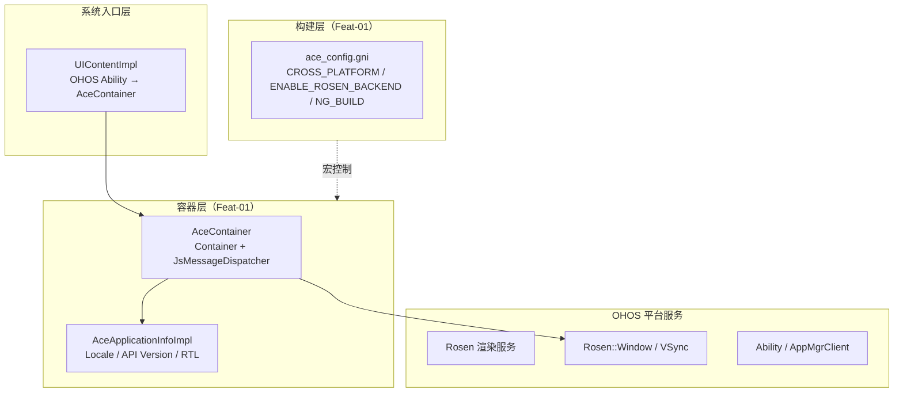
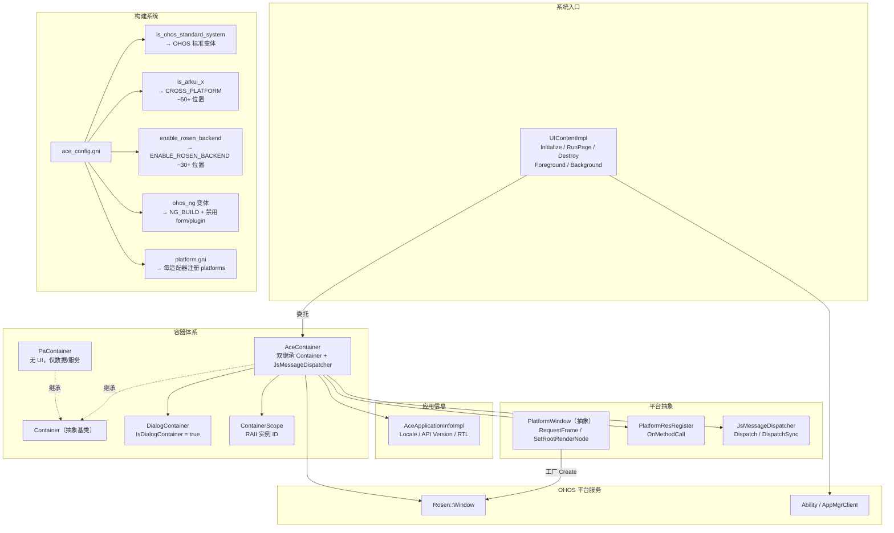

# 架构设计
> 确认目标仓和模块的架构约束、关键设计决策、Spec 拆分方向。

## 设计元数据

| Field | Content |
|-------|---------|
| Design ID | DESIGN-Func-02-01-01 |
| 关联需求 | 已有能力补录（无独立 requirement.md） |
| 关联 Epic | 跨平台适配层 |
| 目标 Feature | Feat-01（平台抽象基类与构建适配）。 |
| 复杂度 | 关键 |
| 目标版本 | API 9+ |
| Owner | ArkUI SIG |
| 状态 | Baselined（已有实现补录） |

## 需求基线

| 项 | 补充说明 |
|----|----------|
| 平台抽象基类与构建适配（Feat-01） | Container/AceContainer 双继承容器体系 + DialogContainer/PaContainer 子类；AceApplicationInfoImpl 链接时选择 Locale/API版本/RTL；PlatformWindow 工厂选择 RSWindow；ace_config.gni 宏体系（CROSS_PLATFORM/ENABLE_ROSEN_BACKEND/NG_BUILD）+ ohos/ohos_ng 编译变体；UIContentImpl 系统入口委托到 AceContainer。 |

## 上下文和现状

### 涉及仓和模块

| 仓库 | 补充架构说明 |
|------|-------------|
| ace_engine | 本域适配层位于 `adapter/ohos/` |
| ace_engine（Feat-01） | 容器/入口位于 `adapter/ohos/entrance/ace_container.h/cpp` + `adapter/ohos/entrance/ui_content_impl.h/cpp`；构建系统位于 `adapter/ohos/build/ace_config.gni` + `adapter/ohos/build/common.gni`；应用信息位于 `adapter/ohos/entrance/ace_application_info_impl.h` |

### 调用链层级分析

| 层 | 模块 | 职责 | 修改类型 |
|----|------|------|----------|
| RS 渲染服务 | Rosen::RSNode/RSUIDirector/RSModifier | OHOS 平台渲染服务，接收适配层提交的渲染命令 | 外部依赖 |
| Container 适配层（Feat-01） | Container/AceContainer/DialogContainer/PaContainer | 容器生命周期+窗口类型+RAII+双继承 | 已有实现 |
| AceApplicationInfo 适配层（Feat-01） | AceApplicationInfoImpl | Locale+API版本+RTL | 已有实现 |
| PlatformWindow 工厂层（Feat-01） | PlatformWindow/PlatformResRegister/JsMessageDispatcher | VSync+根节点+消息分发 | 已有实现 |
| 构建系统层（Feat-01） | ace_config.gni/adapter/ohos/build/ | 宏选择+变体+跨平台 | 已有实现 |
| UIContentImpl 入口层（Feat-01） | UIContentImpl | OHOS系统入口→AceContainer | 已有实现 |

### 适用架构规则

| Rule ID | 适用原因 | 设计结论 | 验证方式 |
|---------|----------|----------|----------|
| OH-ARCH-LAYERING | 适配层位于 NG 组件层与 RS 渲染服务之间 | 调用方向：NG→Adapter→RS，不可反向调用 | 代码评审/依赖检查 |
| OH-ARCH-SUBSYSTEM | 跨子系统（ace_engine→render_service） | 通过 RSUIDirector IPC 通信，不直接内存共享 | 集成测试 |
| OH-ARCH-API-LEVEL | 无 SDK API 变更 | InnerApi 级别，仅供框架内部使用 | API 评审 |
| OH-ARCH-COMPONENT-BUILD | ENABLE_ROSEN_BACKEND 编译宏影响构建选择 | ohos/ohos_ng 两个构建变体，通过 config.gni/config_ng.gni 控制 | 构建验证 |
| OH-ARCH-ERROR-LOG | 适配层无新增错误码 | 使用 RS 渲染服务自身错误体系 | hilog |

## 不涉及项承接

| 维度 | 设计结论 |
|------|----------|
| SDK API | 本适配层无 SDK API，不涉及 Public/System API 变更 |
| 渲染后端 | 已迁移至 Func-02-02-01（渲染后端适配），不在本域范围 |

## 关键设计决策

| 决策 ID | 问题 | 推荐方案 | 探索过的替代方案 | 取舍理由 | 影响 |
|---------|------|----------|------------------|----------|------|
| ADR-F1-1 | Container 体系如何支持多种运行模式？ | 双继承 AceContainer(Container+JsMessageDispatcher)+子类(DialogContainer/PaContainer)+ContainerType枚举(ID范围分区) | 单一 Container 类（无子类分化） | 双继承+子类使 STAGE/FA/PA/DC 等模式各自有独立行为；单一类需大量条件分支 | 容器生命周期和窗口类型判断 |
| ADR-F1-2 | OHOS/Preview 同名 AceApplicationInfoImpl 如何切换？ | 链接时选择：adapter/ohos/ 和 adapter/preview/ 各提供同名实现 | 运行时工厂切换 | 链接时选择零运行时开销；工厂切换增加间接层 | 应用信息获取和 Locale 管理 |
| ADR-F1-3 | 跨平台宏如何控制 OHOS 子系统调用？ | CROSS_PLATFORM 宏 ~50+ 位置排除 OHOS 子系统调用 + is_arkui_x 构建标志 | 每个适配器独立判断平台 | 全局宏统一控制，编译期完全排除；独立判断导致散落的条件分支 | ArkUI-X 跨平台构建 |
| ADR-F1-4 | OHOS 系统级入口如何桥接到 ACE 容器？ | UIContentImpl 委托到 AceContainer（Initialize→RunPage→Destroy→Foreground/Background） | Ability 直接操作 AceContainer | 委托层使系统入口与容器解耦，支持多 Ability 类型；直接操作耦合 | OHOS 应用生命周期管理 |

## 设计骨架

### 骨架范围

| 骨架项 | 目标 | 不包含 | 验证方式 |
|--------|------|--------|----------|
| Container 容器体系 | AceContainer/DialogContainer/PaContainer 双继承+子类 | 窗口创建细节 | 单测 |
| AceApplicationInfo | AceApplicationInfoImpl Locale+API版本+RTL | Preview 实现 | 编译检查+单测 |
| PlatformWindow 工厂 | PlatformWindow::Create 构建选择 | 旧管线 RSWindow 细节 | 单测 |
| 构建系统 | ace_config.gni 宏体系+ohos/ohos_ng 变体 | 具体组件构建 | 编译检查 |
| UIContentImpl 入口 | UIContentImpl→AceContainer 委托 | Ability 直接操作 | 集成测试 |

### 骨架 Spec 拆分

| Task ID | 目标 | 受影响文件 | AC |
|---------|------|------------|----|
| TASK-SKELETON-F01-1 | Container/AceContainer 双继承+生命周期 | ace_container.h/cpp, container.h | AC-1.1~1.12 |
| TASK-SKELETON-F01-2 | AceApplicationInfo 适配 | ace_application_info_impl.h | AC-2.1~2.5 |
| TASK-SKELETON-F01-3 | PlatformWindow 工厂+VSync | platform_window.h, platform_res_register.h | AC-3.1~3.5 |
| TASK-SKELETON-F01-4 | 构建系统宏体系 | ace_config.gni, common.gni, adapter/ohos/build/ | AC-4.1~4.8 |
| TASK-SKELETON-F01-5 | UIContentImpl 入口委托 | ui_content_impl.h/cpp | AC-5.1~5.5 |

## 后续 Task 拆分

| Task ID | 目标 | 受影响文件 | 依赖 |
|---------|------|------------|------|
| TASK-F01-01 | Container/AceContainer 容器体系 | ace_container.h/cpp, container.h, container_scope.h | 无 |
| TASK-F01-02 | AceApplicationInfo 适配 | ace_application_info_impl.h | TASK-F01-01 |
| TASK-F01-03 | PlatformWindow 工厂 | platform_window.h, platform_res_register.h | TASK-F01-01 |
| TASK-F01-04 | 构建系统宏体系 | ace_config.gni, common.gni, adapter/ohos/build/ | 无 |
| TASK-F01-05 | UIContentImpl 入口委托 | ui_content_impl.h/cpp | TASK-F01-01 |

## API 签名、Kit 与权限

### 新增 API

N/A，本特性为框架内部适配层，无 SDK API。

### 变更/废弃 API

N/A

## 构建系统影响

### BUILD.gn 变更

无新增 BUILD.gn 变更。所有文件已有实现，仅在 ENABLE_ROSEN_BACKEND 编译宏下启用。

关键 BUILD.gn 位置：
- `frameworks/core/components_ng/render/adapter/BUILD.gn` — Rosen 适配层源码
- `adapter/ohos/build/common.gni` — ENABLE_ROSEN_BACKEND 宏定义

### bundle.json 变更

无变更。

## 可选设计扩展

### 架构图

#### Func-02-01-01 整体架构图



#### 平台抽象基类与构建适配（Feat-01）架构图



## 详细设计

### Container 容器体系（Feat-01）

Container 是 ACE 引擎容器抽象基类，定义完整的生命周期和查询接口：

核心类层次：
- **Container** — 抽象基类，定义 Initialize/Destroy/GetType/IsMainWindow 等纯虚方法
- **AceContainer** — 双继承 Container+JsMessageDispatcher，实现全部纯虚方法
  - 集成 Rosen Window（ENABLE_ROSEN_BACKEND 时通过 SetView 直接创建 NG::RosenWindow；非 ENABLE_ROSEN_BACKEND 时通过 PlatformWindow::Create 获取 Platform::RSWindow）
  - 集成多实例管理（ContainerType 枚举分区 ID 范围，每种 100000 个 ID）
- **DialogContainer** — 继承 AceContainer，IsDialogContainer()=true
- **PaContainer** — 继承 Container（无 JsMessageDispatcher），无 UI 渲染，仅数据/服务能力

ContainerScope RAII：构造时设置当前实例 ID，析构时恢复。Container::Current() 通过线程局部存储返回当前 Container 实例。

ContainerType ID 分区（每种 100000 个 ID）：
```
STAGE: 1~100000, FA: 100001~200000, PA_SERVICE: 200001~300000, ...
```

### AceApplicationInfo 适配（Feat-01）

AceApplicationInfoImpl 通过链接时选择机制提供 OHOS 应用信息：
- GetInstance() → OHOS AceApplicationInfoImpl 单例（adapter/ohos/ 提供 OHOS 实现，adapter/preview/ 提供 Preview 实现，同名类链接时选择）
- SetLocale → ResourceManager + Localization 设置语言
- ChangeLocale → OHOS ResourceManager locale 更新
- GreatOrEqualTargetAPIVersion → 比较 apiTargetVersion_ 字段
- IsRightToLeft → 基于 locale 语言代码判断 RTL 方向

### PlatformWindow 工厂（Feat-01）

PlatformWindow 抽象基类定义 VSync 和根节点接口：
- PlatformWindow::Create(AceView*) → 无条件返回 Platform::RSWindow；实际渲染后端选择在 AceContainer::SetView 中通过 ENABLE_ROSEN_BACKEND 宏决定
- RequestFrame/RegisterVsyncCallback → 请求/注册 VSync
- SetRootRenderNode → 设置根渲染节点（旧管线使用）
- PlatformResRegister::OnMethodCall → 处理平台方法调用
- JsMessageDispatcher::Dispatch/DispatchSync → AceContainer 实现 Dispatch（异步派发）+ DispatchSync（空函数体 no-op）

### 构建系统宏体系（Feat-01）

ace_config.gni + adapter/ohos/build/ 控制平台选择和编译变体：

关键构建标志：
- **is_ohos_standard_system=true** → 启用 OHOS 标准系统变体（is_standard_system && !is_arkui_x）
- **is_arkui_x=true** → CROSS_PLATFORM 宏定义，禁用 ~50+ OHOS 子系统调用位置
- **enable_rosen_backend=true** → ENABLE_ROSEN_BACKEND 宏，选择 ~30+ Rosen 路径位置
- **ohos_ng 变体** → NG_BUILD 定义 + 禁用 form/plugin（!is_asan && ace_engine_feature_enable_libace）

platform.gni 迭代：每个适配器目录注册 platforms 列表，搜索 adapter/ 子目录。

Preview 平台构建：使用 adapter/preview/ 实现（mingw/mac/linux 条件）。

### UIContentImpl 入口（Feat-01）

UIContentImpl 是 OHOS 系统级入口，委托到 AceContainer：

关键方法：
- Initialize → 委托 InitializeInner→CommonInitialize（~675 行编排链，30+ 初始化步骤）
- RunPage/RunPageByName → 运行页面（委托 AceContainer）
- Destroy → 销毁 AceContainer
- Foreground/Background → 前后台切换（委托 AceContainer）
- OnConfigurationUpdated → 配置变更传播（委托 AceContainer）

## 风险和开放问题

| 项 | 类型 | 影响 | 处理方式 | Owner |
|----|------|------|----------|-------|
| ContainerType ID 范围分区可能导致 ID 冲突（Feat-01） | 架构 | 低 | 每种类型 100000 个 ID，当前最大实例数远低于上限 | ArkUI SIG |
| AceApplicationInfoImpl OHOS/Preview 链接时选择无运行时切换能力（Feat-01） | 架构 | 低 | 链接时选择零开销但不可运行时切换平台 | ArkUI SIG |
| CROSS_PLATFORM 宏 ~50+ 位置散落维护成本（Feat-01） | 构建 | 中 | 集中到 adapter 层，逐步减少散落条件分支 | ArkUI SIG |
| ohos/ohos_ng 双变体构建配置复杂度（Feat-01） | 构建 | 低 | 通过 ace_config.gni 统一管理，变体差异已明确 | ArkUI SIG |
| UIContentImpl 委托层增加一次间接调用（Feat-01） | 性能 | 低 | 委托层开销可忽略，解耦收益远大于性能损失 | ArkUI SIG |

## 设计审批

- [x] 需求基线已确认，设计覆盖 P0/P1 AC
- [x] 不涉及项已承接，N/A 和展开项都有结论
- [x] 涉及仓和模块职责清楚
- [x] 调用链层级分析完整，每层覆盖到位
- [x] 适用架构规则已识别并形成设计结论
- [x] 分层和子系统边界合规
- [x] API 变更有签名、权限、错误码和兼容性说明（N/A，InnerApi）
- [x] BUILD.gn/bundle.json 影响明确（无新增变更）
- [x] 设计输出和后续 Task 拆分明确
- [x] 关键设计决策有理由和影响说明
- [x] 风险和开放问题有 Owner

**结论:** 通过（已有实现补录）
