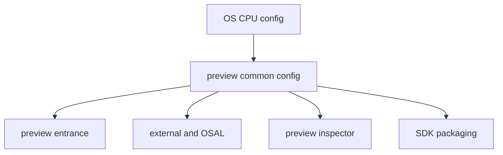
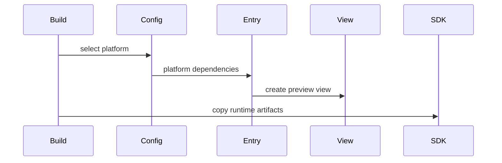

# 架构设计

> 预览器平台适配由桌面平台发现、预览运行入口/平台替身和 SDK 资源打包组成；本设计仅记录当前实现。

## 设计元数据

| 字段 | 内容 |
|------|------|
| Design ID | DESIGN-Func-02-01-04 |
| 关联需求 | 已有能力补录（无独立 requirement.md） |
| 关联 Epic | 无 |
| 目标 Feature | Feat-01 平台发现与构建配置；Feat-02 运行入口与平台服务替身；Feat-03 SDK 与资源打包 |
| 复杂度 | 复杂 |
| 目标版本 | 当前 preview adapter 支持的 Windows/Linux/macOS 目标组合 |
| Owner | ArkUI SIG |
| 状态 | Baselined（已有实现补录） |

## 需求基线

| 项 | 补充说明 |
|----|----------|
| 平台选择 | 仅 `mingw_x86_64`、Linux x64/arm64、macOS x64/arm64 生成 preview 平台。 |
| 运行边界 | 预览运行时使用入口、OSAL、Inspector 与 Ability/Stage mock，不等同于真实系统服务。 |
| 打包边界 | SDK 将资源、NAPI、ABC 和共享库放入预览器约定目录；标准系统与 macOS/设备类型有分支。 |

## 上下文和现状

### 涉及仓和模块

| 仓库 | 补充架构说明 |
|------|--------------|
| ace_engine | `adapter/preview/build` 根据宿主 OS/CPU 建立平台及 feature 配置。 |
| ace_engine | `adapter/preview/entrance` 负责视图、事件、输入、窗口和预览容器。 |
| ace_engine | `adapter/preview/external` 实现 Ability/Stage 及多媒体输入等替身。 |
| ace_engine | `adapter/preview/inspector` 和 `osal` 提供检查器及桌面 OSAL。 |
| ace_engine | `adapter/preview/sdk` 复制预览运行所需 NAPI、ABC、资源和共享库。 |

### 调用链层级分析

| 层 | 模块 | 职责 | 修改类型 |
|----|------|------|----------|
| 平台发现 | `build/config.gni`、`platform.gni` | 按 OS/CPU 声明 windows/linux/mac 平台 | 存量补录 |
| 公共配置 | `build/preview_common.gni` | feature flags、平台依赖、宏和 `libace_target` | 存量补录 |
| 运行入口 | `entrance/BUILD.gn`、AceViewPreview、EventDispatcher | View、表面、事件、输入和后端分支 | 存量补录 |
| 平台替身 | `external`、`osal`、`inspector` | 模拟上下文/服务并提供预览实现 | 存量补录 |
| 打包 | `sdk/BUILD.gn` | 资源提取、模块/ABC/NAPI 复制及输出布局 | 存量补录 |

### 适用架构规则

| Rule ID | 适用原因 | 设计结论 | 验证方式 |
|---------|----------|----------|----------|
| OH-ARCH-LAYERING | 构建、运行和打包分层 | 平台 config 只选依赖；运行入口不直接定义打包布局 | GN 审查 |
| OH-ARCH-SUBSYSTEM | 预览以桌面替身接入系统能力 | mock 不宣称拥有真实 AbilityRuntime 行为 | 运行测试 |
| OH-ARCH-COMPONENT-BUILD | 多个 GN target 与复制 action | 产物位置和条件以 BUILD.gn 为准 | 构建检查 |

## 不涉及项承接

| 维度 | 设计结论 |
|------|----------|
| 公开 ArkTS/C API | 不涉及；本域是内部预览构建和运行适配。 |
| IPC/持久化 | 不涉及新增实现；替身只读取预览输入文件。 |
| 真机系统服务 | 不涉及；仅记录 preview mock/OSAL 行为。 |

## 关键设计决策

| 决策 ID | 问题 | 推荐方案 | 探索过的替代方案 | 取舍理由 | 影响 |
|---------|------|----------|-----------------|----------|------|
| ADR-1 | 平台粒度 | 用 OS/CPU 组合记录 | 仅按 Windows/Linux/macOS | `config.gni` 就以组合判定 | 构建矩阵可验证 |
| ADR-2 | feature 边界 | 显式记录 preview 默认开关 | 假设宿主完整能力 | 多项组件默认关闭 | 运行预期不失真 |
| ADR-3 | 渲染后端 | 保留 Rosen/Flutter 分支 | 只描述 Rosen | 入口和事件调度均有编译分支 | 双路径测试 |
| ADR-4 | 打包产物 | 将资源、NAPI、ABC 分 Feat-03 管理 | 仅记录一处输出目录 | BUILD.gn 包含多条件复制规则 | 输出路径与条件可追溯 |

## 设计骨架

### 骨架范围

| 骨架项 | 目标 | 不包含 | 验证方式 |
|--------|------|--------|----------|
| 平台配置 | OS/CPU 发现与宏/开关 | Android/iOS adapter | GN 矩阵 |
| 预览运行 | View、事件、mock 服务 | 真机系统服务 | 运行/单测 |
| SDK 打包 | 模块、资源与共享库输出 | 业务应用打包 | 文件清单 |

### 骨架 Spec 拆分

| Task ID | 目标 | 受影响文件 | AC |
|---------|------|------------|----|
| TASK-SKELETON-1 | 平台发现与配置 | `Feat-01-previewer-platform-build-spec.md` | Feat-01 AC |
| TASK-SKELETON-2 | 运行入口与替身 | `Feat-02-previewer-runtime-mock-spec.md` | Feat-02 AC |
| TASK-SKELETON-3 | SDK/资源打包 | `Feat-03-previewer-sdk-packaging-spec.md` | Feat-03 AC |

## 后续 Task 拆分

| Task ID | 目标 | 受影响文件 | 依赖 |
|---------|------|------------|------|
| TASK-FEAT-01 | 固化平台选择和配置 | Feat-01 spec | build/*.gni |
| TASK-FEAT-02 | 固化入口、事件和 mock | Feat-02 spec | entrance/external/inspector |
| TASK-FEAT-03 | 固化产物复制和资源分支 | Feat-03 spec | sdk/BUILD.gn |

## API 签名、Kit 与权限

### 新增 API

N/A；内部预览构建能力，不新增公开 API。

### 变更/废弃 API

N/A。

## 构建系统影响

### BUILD.gn 变更

```text
无变更；适配由 adapter/preview/build、entrance、external、inspector、osal 和 sdk 的既有 GN target 构成。
```

### bundle.json 变更

无新增部件或依赖。

## 可选设计扩展

### 架构图



### 数据流/控制流

| 步骤 | 调用方 | 被调用方 | 数据/接口 | 说明 |
|------|--------|----------|-----------|------|
| 1 | GN | platform.gni | current OS and CPU | 选择 desktop platform |
| 2 | config | entrance/external/inspector | flags and platform deps | 选择运行实现 |
| 3 | host | AceViewPreview | surface/input events | 更新预览视图 |
| 4 | SDK GN | copy actions | resources/modules/libraries | 生成预览器目录 |

### 时序设计



### 测试性设计

| 测试层级 | 测试目标 | Mock 策略 | 验证方式 |
|----------|----------|----------|----------|
| GN | OS/CPU 和 feature 分支 | 参数化 args | 目标图检查 |
| 运行时 | 表面/输入/上下文 mock | fake event and files | 预览运行测试 |
| 打包 | 资源和模块输出 | 临时输出目录 | 文件清单比对 |

## 详细设计

### 平台与运行时边界

`platform.gni` 仅在 Windows mingw x86_64、Linux x64/arm64、macOS x64/arm64 追加平台（`adapter/preview/build/config.gni:15-26`、`platform.gni:17-43`）。公共配置启用 preview、Rosen 与检查器事件上报，并选择 entrance/external/inspector/osal 依赖（`preview_common.gni:16-55,121-124`）。运行入口将表面和鼠标/轴/触摸事件交给回调；Rosen 与 Flutter 绘制路径由编译宏区分（`entrance/ace_view_preview.cpp:23-101`）。

### 资源和模块输出

SDK 构建用 action 提取系统资源，复制 NAPI/ABC 到 `previewer/common/bin/module` 约定路径；标准系统与 macOS/TV/穿戴路径使用不同资源来源或输出目录（`adapter/preview/sdk/BUILD.gn:47-65,340-390,415-461`）。

## 风险和开放问题

| 项 | 类型 | 影响 | 处理方式 | Owner |
|----|------|------|----------|-------|
| 平台支持受 OS/CPU 限制 | 构建 | 高 | 用组合矩阵检查，不泛化桌面支持 | ArkUI SIG |
| mock 与真机服务语义不同 | 兼容性 | 中 | 在 Feat-02 显式定界 | ArkUI SIG |
| 资源路径按系统/设备分支 | 构建 | 中 | 以输出清单验证 | ArkUI SIG |

## 设计审批

- [x] 需求基线已确认，设计覆盖 P0/P1 AC
- [x] 不涉及项已承接，N/A 和展开项都有结论
- [x] 涉及仓和模块职责清楚
- [x] 调用链层级分析完整，每层覆盖到位
- [x] 适用架构规则已识别并形成设计结论
- [x] 分层和子系统边界合规
- [x] API 变更有签名、权限、错误码和兼容性说明
- [x] BUILD.gn/bundle.json 影响明确
- [x] 设计输出和后续 Task 拆分明确
- [x] 关键设计决策有理由和影响说明
- [x] 风险和开放问题有 Owner

**结论:** 通过（已有实现补录）。
