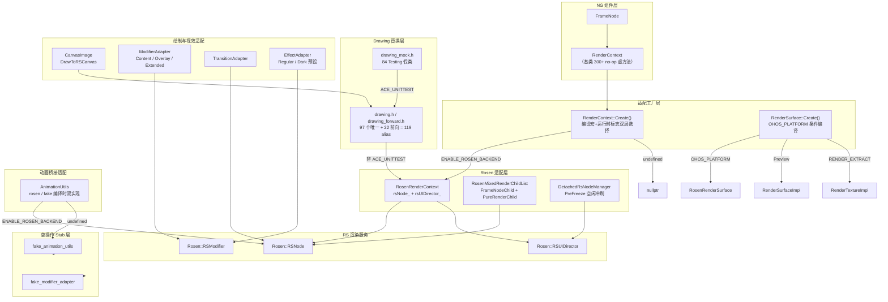
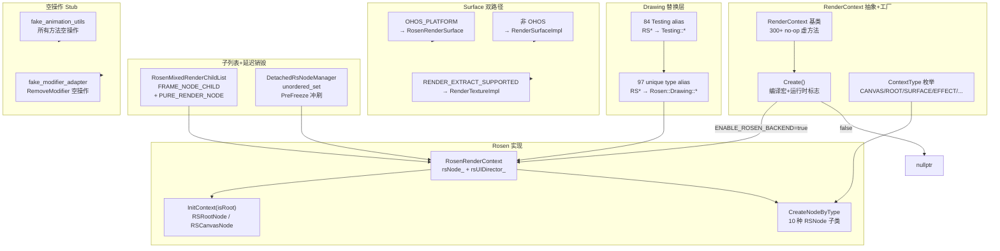
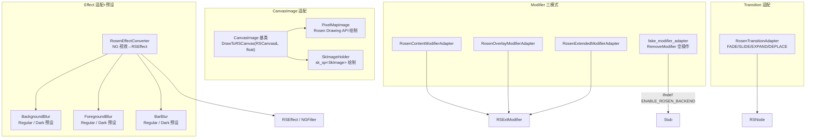
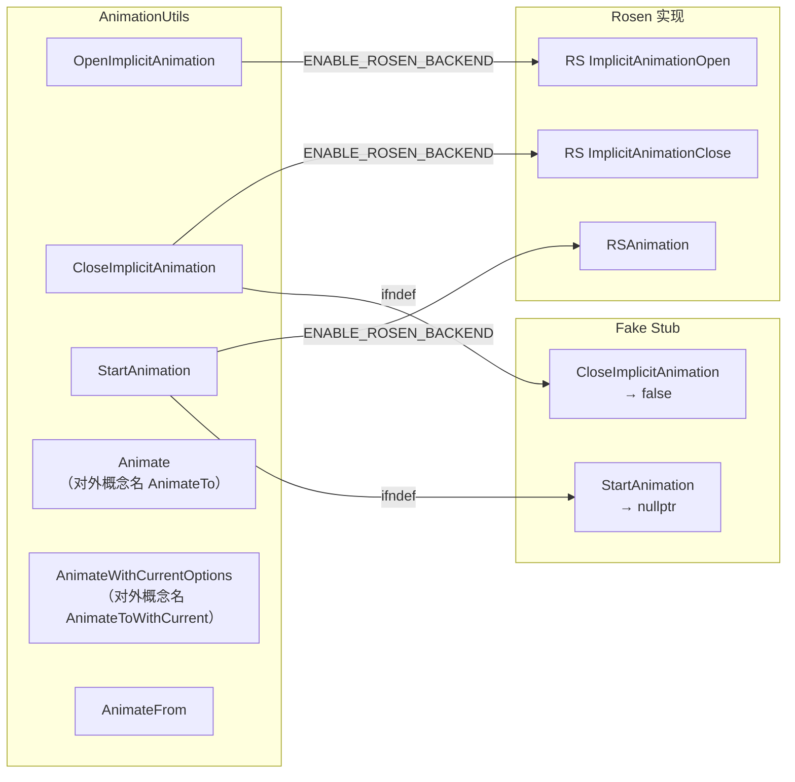

# 架构设计
> 确认目标仓和模块的架构约束、关键设计决策、Spec 拆分方向。

## 设计元数据

| Field | Content |
|-------|---------|
| Design ID | DESIGN-Func-02-02-01 |
| 关联需求 | 已有能力补录（无独立 requirement.md） |
| 关联 Epic | 跨平台适配层 |
| 目标 Feature | Feat-01（渲染后端核心架构），Feat-02（绘制与视效适配），Feat-03（动画桥接适配） |
| 复杂度 | 关键 |
| 目标版本 | API 9+ |
| Owner | ArkUI SIG |
| 状态 | Baselined（已有实现补录） |

## 需求基线

| 项 | 补充说明 |
|----|----------|
| RenderContext 三层可插拔架构 | 基类（no-op 默认）→ 工厂（编译宏+运行时标志）→ Rosen 后端实现；新后端仅需覆盖关心的虚方法 |
| Drawing API 编译时替换层 | 97+22+84=203 type alias 在编译时将 RS* 映射到 Rosen::Drawing 或 Testing 假类，运行时零开销 |
| 单后端现状与多后端预留 | 当前只有 Rosen 一个后端；架构预留三层可插拔，但无第二后端实际实现 |
| 混合子列表与延迟销毁 | RosenMixedRenderChildList 管理 FrameNodeChild+PureRenderChild 混合子列表；DetachedRsNodeManager 管理脱离管线 RSNode 的延迟销毁 |
| RenderSurface 双路径工厂 | OHOS_PLATFORM→RosenRenderSurface（Native）；非 OHOS→RenderSurfaceImpl（跨平台）；RENDER_EXTRACT_SUPPORTED→RenderTextureImpl |
| 空操作 Stub 层 | fake_animation_utils/fake_modifier_adapter 在无后端时提供空操作 stub，确保编译链接不失败 |
| CanvasImage RS 命名耦合 | CanvasImage::DrawToRSCanvas 方法名含 RS 前缀，基类接口已与 Rosen 耦合——标记为风险 |
| Modifier 三模式适配 | Content/Overlay/Extended 三种 ModifierAdapter 将 NG Modifier 属性适配为 RSExtModifier |
| Transition 适配 | NG 过渡效果→RS 过渡效果类型映射 |
| Effect 适配与毛玻璃预设 | NG 视效参数→RSEffect；Background/Foreground/Bar 毛玻璃区分 Regular/Dark 两套预设参数 |
| AnimationUtils 编译时双实现 | rosen_animation_utils（真实）/ fake_animation_utils（空操作）通过 ENABLE_ROSEN_BACKEND 宏编译时选择 |

## 上下文和现状

### 涉及仓和模块

| 仓库 | 补充架构说明 |
|------|-------------|
| ace_engine | 核心适配层位于 `frameworks/core/components_ng/render/` + `frameworks/core/components_ng/render/adapter/`；Drawing 替换层位于 `frameworks/core/components_ng/render/drawing.h` + `drawing_forward.h` + `drawing_mock.h`；混合子列表位于 `frameworks/core/components_ng/render/rosen_mixed_render_child_list.h`；延迟销毁位于 `frameworks/core/components_ng/render/detached_rs_node_manager.h`；Surface 工厂位于 `frameworks/core/components_ng/render/adapter/render_surface_creator.cpp`；空操作 Stub 位于 `frameworks/core/animation/fake_animation_utils.cpp` + `frameworks/core/animation/fake_modifier_adapter.cpp` |

### 调用链层级分析

| 层 | 模块 | 职责 | 修改类型 |
|----|------|------|----------|
| NG 组件层 | FrameNode/RenderContext | 持有 NG 渲染属性，通过 RenderContext 抽象接口下发更新 | 已有实现 |
| 适配工厂层 | render_context_creator.cpp | RenderContext::Create() 根据 ENABLE_ROSEN_BACKEND + SystemProperties 双层选择后端 | 已有实现 |
| Drawing 替换层 | drawing.h/drawing_forward.h/drawing_mock.h | 97+22+84=203 type alias 编译时将 RS* 映射到 Rosen::Drawing 或 Testing | 已有实现 |
| Rosen 适配层 | RosenRenderContext | 持 rsNode_+rsUIDirector_，将 NG 属性变更映射到 RS Modifier | 已有实现 |
| RSNode 类型映射层 | CreateNodeByType/InitContext | 10 种 ContextType→RSNode 子类映射 | 已有实现 |
| 混合子列表层 | RosenMixedRenderChildList | FrameNodeChild+PureRenderChild 按插入顺序组装有序子列表 | 已有实现 |
| 延迟销毁层 | DetachedRsNodeManager | 脱离管线 RSUIContext→unordered_set→PreFreeze 空闲冲刷 | 已有实现 |
| Surface 工厂层 | render_surface_creator.cpp | OHOS_PLATFORM/RENDER_EXTRACT_SUPPORTED 双路径选择 | 已有实现 |
| CanvasImage 层 | CanvasImage/PixelMapImage/SkImageHolder | 图片绘制基类+RS 命名耦合 | 已有实现 |
| Modifier 适配层 | RosenContentModifierAdapter/RosenOverlayModifierAdapter/RosenExtendedModifierAdapter | 三模式 Modifier→RSExtMapper | 已有实现 |
| Transition 适配层 | RosenTransitionEffect + 子类 | NG 过渡→RS 过渡类型映射 | 已有实现 |
| Effect 适配层 | RosenEffectConverter/ui_material_filter_creator | 视效参数→RSEffect/NGFilter + Regular/Dark 预设 | 已有实现 |
| Animation 适配层 | rosen_animation_utils/fake_animation_utils | AnimationUtils→RSAnimation 或空操作 stub | 已有实现 |
| RS 渲染服务 | Rosen::RSNode/RSUIDirector/RSModifier | OHOS 平台渲染服务 | 外部依赖 |

### 适用架构规则

| Rule ID | 适用原因 | 设计结论 | 验证方式 |
|---------|----------|----------|----------|
| OH-ARCH-LAYERING | 适配层位于 NG 组件层与 RS 渲染服务之间 | 调用方向：NG→Adapter→RS，不可反向调用 | 代码评审/依赖检查 |
| OH-ARCH-SUBSYSTEM | 渲染后端适配层跨 ace_engine 和 render_service 两个子系统 | ace_engine→render_service 单向调用，禁止反向 | 依赖检查 |
| OH-ARCH-API-LEVEL | 无 SDK API 变更 | InnerApi 级别，不影响 Public/System API | API 评审 |
| OH-ARCH-COMPONENT-BUILD | ENABLE_ROSEN_BACKEND/CROSS_PLATFORM 宏控制编译选择 | ace_config.gni 控制宏定义和编译变体 | 构建验证 |
| OH-ARCH-ERROR-LOG | 无新增错误码 | 适配层使用 RS 层错误传播，不定义新错误码 | 单测 |

## 不涉及项承接

| 维度 | 设计结论 |
|------|----------|
| SDK API 变更 | 不涉及，适配层为 InnerApi |
| 跨进程 IPC | 不涉及，RS 渲染服务调用通过 RSNode 提交命令（不涉及直接 IPC） |
| 数据持久化 | 不涉及 |
| 新增权限 | 不涉及 |

## 关键设计决策

| 决策 ID | 问题 | 推荐方案 | 探索过的替代方案 | 取舍理由 | 影响 |
|---------|------|----------|----------------|----------|------|
| ADR-1 | RenderContext 基类是否使用纯虚方法 | No-op 默认虚方法（非纯虚） | 纯虚方法强制后端实现全部接口 | No-op 允许新后端仅覆盖关心的方法，降低接入门槛；代价是基类可实例化但无渲染效果 | 所有后端实现 |
| ADR-2 | 后端选择机制设计 | 编译宏+运行时标志双层选择 | 纯运行时注册表；纯编译宏 | 编译宏控制后端代码是否编译链接（零开销）；运行时标志控制同一编译中是否启用（Preview 场景）；纯运行时注册表有虚函数开销，纯编译宏不支持同编译多后端 | 工厂选择路径 |
| ADR-3 | Drawing API 后端切换方式 | 编译时 type alias 替换 | 运行时虚函数接口 | Type alias 编译时替换零运行时开销，与单后端现状一致；运行时虚函数接口有多后端优势但当前无第二后端，虚函数开销无意义 | drawing.h/drawing_mock.h |
| ADR-4 | CanvasImage 基类 RS 命名耦合 | 保留 DrawToRSCanvas 方法名 | 改为 DrawToCanvas 通用名 | 改名涉及大量下游代码修改，风险高于收益；标记为风险并在新后端适配时评估 | CanvasImage 子类 |
| ADR-5 | 混合子列表管理策略 | RosenMixedRenderChildList 按插入顺序维护混合列表 | 分离为两个独立列表 | 按插入顺序组装保证渲染层级正确；分离列表需额外排序逻辑且无法保证交错节点顺序 | NG 组件子列表 |
| ADR-6 | 延迟销毁机制 | DetachedRsNodeManager + PreFreeze 空闲冲刷 | 即时销毁 | 即时销毁可能导致正在使用的 RSNode 被提前释放；PreFreeze 在空闲时段冲刷更安全 | 脱离管线 RSNode |
| ADR-7 | Surface 双路径设计 | OHOS_PLATFORM 条件编译 + RENDER_EXTRACT_SUPPORTED 纹理路径 | 统一 Surface 接口 | OHOS 有 Native producer/consumer Surface 优化路径；跨平台需 ExtSurface 兼容；纹理导出是独立能力 | RenderSurface 工厂 |
| ADR-8 | 空操作 Stub 策略 | #ifndef ENABLE_ROSEN_BACKEND 时 fake_animation_utils/fake_modifier_adapter 提供空操作 | 链接时弱符号 | 空操作 stub 明确、可调试；弱符号隐式、可能导致意外行为 | 编译链接守卫 |

## 设计骨架

### 骨架范围

| 骨架项 | 目标 | 不包含 | 验证方式 |
|--------|------|----------|----------|
| RenderContext 抽象基类 | 定义 300+ no-op 默认虚方法接口（实际约 364 个） | RS 层具体属性实现 | 编译检查 |
| 工厂双层选择 | 编译宏+运行时标志选择后端 | 多后端运行时注册 | 单测 |
| Drawing API 替换层 | 97+22+84=203 type alias 编译时替换 | 运行时虚函数切换 | 编译检查 |
| 混合子列表+延迟销毁 | 有序子列表+空闲冲刷 | 即时销毁 | 集成测试 |
| Surface 双路径 | OHOS/Preview/Texture 三路径 | 未来新平台路径 | 编译检查 |
| 空操作 Stub | fake_animation_utils/fake_modifier_adapter | 真实实现内容 | 编译检查 |
| Modifier 三模式适配 | Content/Overlay/Extended 适配器 | RS 层 Modifier 内部实现 | 单测 |
| Transition 适配 | NG→RS 过渡效果映射 | RS 过渡效果内部实现 | 单测 |
| Effect 适配+预设 | 视效参数映射+Regular/Dark 预设 | RS Filter/Shader 内部实现 | 单测 |
| Animation 双实现 | rosen/fake 编译时选择 | RS Animation 内部实现 | 编译检查 |

### 骨架 Spec 拆分

| Task ID | 目标 | 受影响文件 | AC |
|---------|------|------------|----|
| TASK-SKELETON-1 | RenderContext 抽象+工厂+混合子列表+延迟销毁+Surface 双路径+空操作 Stub | render_context.h, render_context_creator.cpp, rosen_render_context.cpp, rosen_mixed_render_child_list.h, detached_rs_node_manager.h, render_surface_creator.cpp, fake_animation_utils.cpp, fake_modifier_adapter.cpp, drawing.h, drawing_forward.h, drawing_mock.h | AC-1.1~6.4 |
| TASK-SKELETON-2 | Modifier/Transition/Effect 三模式适配 | rosen_modifier_adapter.cpp, rosen_transition_adapter.cpp, rosen_effect_adapter.cpp, canvas_image.h, pixel_map_image.cpp | AC-1.1~4.5 |
| TASK-SKELETON-3 | AnimationUtils 编译时双实现 | rosen_animation_utils.cpp, fake_animation_utils.cpp | AC-1.1~2.6 |

## 后续 Task 拆分

| Task ID | 目标 | 受影响文件 | 依赖 |
|---------|------|------------|------|
| TASK-F01-01 | RenderContext 抽象基类与三层可插拔架构 | frameworks/core/components_ng/render/render_context.h | 无 |
| TASK-F01-02 | RSNode 创建与节点类型映射 | frameworks/core/components_ng/render/adapter/rosen_render_context.cpp | TASK-F01-01 |
| TASK-F01-03 | Drawing API 编译时替换层 | frameworks/core/components_ng/render/drawing.h, drawing_forward.h, drawing_mock.h | TASK-F01-01 |
| TASK-F01-04 | 混合子列表与延迟销毁 | rosen_mixed_render_child_list.h, detached_rs_node_manager.h | TASK-F01-02 |
| TASK-F01-05 | RenderSurface 双路径工厂 | render_surface_creator.cpp | TASK-F01-01 |
| TASK-F01-06 | 空操作 Stub 层 | fake_animation_utils.cpp, fake_modifier_adapter.cpp | TASK-F01-01 |
| TASK-F02-01 | CanvasImage 基类与 RS 命名耦合适配 | canvas_image.h, pixel_map_image.cpp | TASK-F01-01 |
| TASK-F02-02 | Modifier 适配器三模式 | rosen_modifier_adapter.cpp, fake_modifier_adapter.cpp | TASK-F01-02 |
| TASK-F02-03 | Transition 适配器 | rosen_transition_adapter.cpp | TASK-F01-02 |
| TASK-F02-04 | Effect 适配器与毛玻璃预设 | rosen_effect_adapter.cpp | TASK-F01-02 |
| TASK-F03-01 | AnimationUtils 编译时双实现 | rosen_animation_utils.cpp, fake_animation_utils.cpp | TASK-F01-01 |

## API 签名、Kit 与权限

### 新增 API

N/A，适配层为 InnerApi，无 SDK API 变更。

### 变更/废弃 API

N/A。

## 构建系统影响

### BUILD.gn 变更

```
frameworks/core/components_ng/render/BUILD.gn
  变更说明: ENABLE_ROSEN_BACKEND 宏控制 rosen_render_context / rosen_mixed_render_child_list 等源文件编译选择

frameworks/core/animation/BUILD.gn
  变更说明: ENABLE_ROSEN_BACKEND 宏控制 rosen_animation_utils / fake_animation_utils 编译选择
```

### bundle.json 变更

无新增 component，仅通过宏控制已有 source 文件编译路径。

## 可选设计扩展

### 架构图

#### 渲染后端适配层整体架构图



#### Feat-01 渲染后端核心架构 架构图



#### Feat-02 绘制与视效适配 架构图



#### Feat-03 动画桥接适配 架构图



### 数据流/控制流

| 步骤 | 调用方 | 被调用方 | 数据/接口 | 说明 |
|------|--------|----------|-----------|------|
| 1 | FrameNode | RenderContext::Create() | 编译宏+运行时标志 | 双层选择后端 |
| 2 | RosenRenderContext | RSNode::Create() | ContextType → RSNode 子类 | 10 种节点类型映射 |
| 3 | RosenRenderContext | RSUIDirector::SetRSCanvasNode() | rsNode_ | 注册 RSNode 到 UIDirector |
| 4 | RosenMixedRenderChildList | BuildTargetRSNodes() | 子列表 | 按插入顺序组装 |
| 5 | DetachedRsNodeManager | FlushImplicitTransaction() | 脱离 RSUIContext | PreFreeze 空闲冲刷 |
| 6 | RenderSurface::Create() | OHOS_PLATFORM 条件 | Surface 类型 | 双路径选择 |
| 7 | AnimationUtils | RS ImplicitAnimationOpen/Close | 动画指令 | 隐式动画开关 |
| 8 | AnimationUtils | RSAnimation::Start | Animation<> | 动画启动 |
| 9 | ModifierAdapter | RSExtModifier::Apply | 属性数据 | 三模式属性注入 |
| 10 | EffectAdapter | RSEffect 参数 | 预设数据 | Regular/Dark 预设映射 |

### 测试性设计

| 测试层级 | 测试目标 | Mock 策略 | 验证方式 |
|----------|----------|-----------|----------|
| 单测 | RenderContext 基类 no-op 默认 | ACE_UNITTEST 编译宏 | 编译检查 |
| 单测 | Drawing API type alias 替换 | Testing 假类 (drawing_mock.h) | 编译检查 |
| 单测 | RosenMixedRenderChildList 有序组装 | Mock RSNode | UT 覆盖率 |
| 单测 | DetachedRsNodeManager PreFreeze | Mock 空闲回调 | UT 覆盖率 |
| 编译验证 | 空操作 Stub 层 | #ifndef ENABLE_ROSEN_BACKEND | 编译链接 |
| 集成测试 | Surface 双路径 | Mock OHOS_PLATFORM / Preview 编译 | 编译验证 |

## 详细设计

### RenderContext 抽象基类设计

RenderContext 基类位于 `frameworks/core/components_ng/render/render_context.h`，定义 300+ 虚方法均为 no-op 默认（非纯虚，实际约 364 个）。关键设计：

- **No-op 默认策略**：所有 300+ 虚方法体为空操作或返回默认值（如 `return false`），新后端仅需覆盖关心的方法
- **双层工厂**：`RenderContext::Create()` 在 `render_context_creator.cpp` 中通过 `ENABLE_ROSEN_BACKEND` 编译宏控制 `RosenRenderContext` 可见性，运行时通过 `SystemProperties::GetRosenBackendEnabled()` 控制是否启用
- **ContextType 枚举**：定义 CANVAS/ROOT/SURFACE/EFFECT/EXTERNAL/INCREMENTAL_CANVAS/HARDWARE_SURFACE/COMPOSITE_COMPONENT/UNION/DEPTH 等 10 种节点类型；RENDER_EXTRACT_SUPPORTED 条件下额外有 HARDWARE_TEXTURE

### Drawing API 编译时替换层设计

Drawing 替换层位于 `frameworks/core/components_ng/render/drawing.h` + `drawing_forward.h` + `drawing_mock.h`：

- **drawing.h**：97 个唯一 type alias（104 行含 7 个重复，如 RSColorQuad/RSShaderEffect/RSTileMode/RSClipOp/RSPathEffect/RSPathDirection/RSPathDashStyle），涵盖 Typography/Effects/3D 等
- **drawing_forward.h**：22 轻量前向声明 alias
- **drawing_mock.h**：84 Testing 假类 alias（如 `using RSCanvas = Testing::TestingCanvas`）
- **编译时零开销**：`#ifdef ACE_UNITTEST` 时引用 `drawing_mock.h`，否则引用 `drawing.h`

### RosenMixedRenderChildList 设计

混合子列表位于 `frameworks/core/components_ng/render/rosen_mixed_render_child_list.h`：

- **双类型管理**：FRAME_NODE_CHILD（NG 组件子节点）+ PURE_RENDER_NODE（纯渲染子节点），两者按插入顺序混合排列
- **弱引用管理**：子节点通过弱引用持有 RSNode，弱引用失效时可降级为单模式（`CanSwitchToSingleIfRenderNode`）
- **BuildTargetRSNodes**：按插入顺序组装有序 RSNode 子列表，确保渲染层级正确

### DetachedRsNodeManager 设计

延迟销毁管理位于 `frameworks/core/components_ng/render/detached_rs_node_manager.h`：

- **脱离管线集合**：`std::unordered_set<RSUIContext*>` 管理脱离管线的 RSUIContext
- **PreFreeze 冲刷**：`PreFreezeFlushForAllContexts` 在空闲时段对所有脱离 RSUIContext 执行 `FlushImplicitTransaction`
- **安全销毁**：避免正在使用的 RSNode 被提前释放

### RenderSurface 双路径设计

Surface 工厂位于 `frameworks/core/components_ng/render/adapter/render_surface_creator.cpp`：

- **OHOS_PLATFORM**：返回 `RosenRenderSurface`（OHOS Native producer/consumer Surface）
- **非 OHOS_PLATFORM**：返回 `RenderSurfaceImpl`（跨平台 ExtSurface）
- **RENDER_EXTRACT_SUPPORTED**：TEXTURE 类型返回 `RenderTextureImpl`

### 空操作 Stub 层设计

- **fake_animation_utils.cpp**：所有方法为空操作，`CloseImplicitAnimation` 返回 `false`，`StartAnimation` 返回 `nullptr`
- **fake_modifier_adapter.cpp**：`RemoveModifier` 为空操作
- **宏守卫**：`#ifndef ENABLE_ROSEN_BACKEND` 时编译链接 fake 文件，真实实现被宏排除

### CanvasImage 基类设计

CanvasImage 基类位于 `frameworks/core/components_ng/image/`：

- **DrawToRSCanvas**：虚方法，基类为空操作；PixelMapImage 通过 Rosen Drawing API 绘制；SkImageHolder 通过 Skia 绘制
- **RS 命名耦合风险**：方法名含 RS 前缀，新后端适配需评估是否改名

### Modifier 三模式适配设计

ModifierAdapter 位于 `frameworks/core/components_ng/render/adapter/`：

- **ContentModifierAdapter**：将 NG Modifier 属性转换为 RSExtModifier Content 属性
- **OverlayModifierAdapter**：Overlay 属性映射
- **ExtendedModifierAdapter**：Extended 属性映射
- **Apply 流程**：NG Modifier 属性 → RSExtModifier → Apply 到 RSNode

### Effect 适配与毛玻璃预设设计

EffectAdapter 位于 `frameworks/core/components_ng/render/adapter/`：

- **RosenEffectConverter**：NG 视效参数（Blur/Color/Radius）→ RSEffect 参数
- **毛玻璃预设**：Background/Foreground/Bar 各区分 Regular/Dark 两套参数；预设参数（radius/saturation/brightness/maskColor）由外部系统主题资源文件加载（不在 ace_engine 仓内），字段名为 maskColor

### AnimationUtils 编译时双实现设计

- **rosen_animation_utils.cpp**：Open/CloseImplicitAnimation → RS ImplicitAnimation API；StartAnimation → RSAnimation 创建
- **fake_animation_utils.cpp**：空操作 stub，CloseImplicitAnimation 返回 false，StartAnimation 返回 nullptr
- **编译选择**：`#ifdef ENABLE_ROSEN_BACKEND` 引用 rosen 实现，否则引用 fake 实现

## 风险和开放问题

| 项 | 类型 | 影响 | 处理方式 | Owner |
|----|------|------|----------|-------|
| CanvasImage::DrawToRSCanvas RS 命名耦合 | API | 低 | 保留当前命名，新后端适配时评估改名 | ArkUI SIG |
| 当前仅 Rosen 单后端 | 架构 | 中 | 架构预留三层可插拔，待第二后端实际需求时验证 | ArkUI SIG |
| Drawing type alias 仅支持编译时单选择 | 架构 | 低 | 与单后端现状一致，多后端时需改为运行时接口 | ArkUI SIG |
| DetachedRsNodeManager PreFreeze 冲刷时机依赖空闲回调 | 测试 | 低 | 已有 UT 覆盖，集成测试验证冲刷行为 | ArkUI SIG |
| 毛玻璃预设参数硬编码在适配层 | 构建 | 低 | 参数来源为系统资源，后续可通过配置文件替代 | ArkUI SIG |

## 设计审批

- [x] 需求基线已确认，设计覆盖 P0/P1 AC
- [x] 不涉及项已承接，N/A 和展开项都有结论
- [x] 涉及仓和模块职责清楚
- [x] 调用链层级分析完整，每层覆盖到位
- [x] 适用架构规则已识别并形成设计结论
- [x] 分层和子系统边界合规
- [x] API 变更有签名、权限、错误码和兼容性说明
- [x] BUILD.gn/bundle.json 影响明确
- [x] 设计输出和后续 Task 拆分明确
- [x] 关键设计决策有理由和影响说明
- [x] 风险和开放问题有 Owner

**结论:** 通过（已有实现补录）
