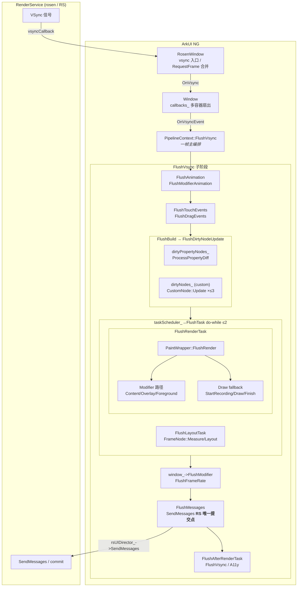
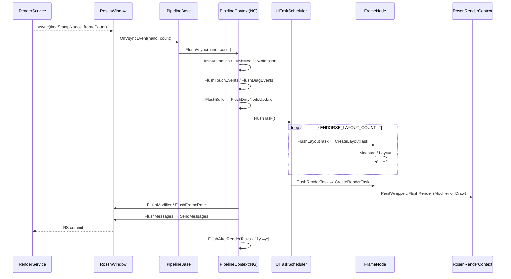

# 架构设计

> ArkUI NG 基础渲染管线（PipelineContext）每一帧的总编排——把"VSync 信号、状态变更、布局、绘制、RS 提交"组织为可观察、可中断、可重入的固定序列。

## 设计元数据

| 字段 | 内容 |
|------|------|
| Design ID | DESIGN-Func-03-01-01 |
| 关联需求 | 已有能力补录（无独立 requirement.md） |
| 关联 Epic | 无 |
| 目标 Feature | Feat-01 渲染主流程 |
| 复杂度 | 复杂 |
| 目标版本 | API 9 及以后（基线以 master HEAD 行为为准，关键差异标注 API target version） |
| Owner | ArkUI SIG / 渲染管线团队 |
| 状态 | Baselined（已有实现补录） |

## 需求基线

| 字段 | 内容 |
|------|------|
| 问题陈述 | NG 框架下，从 RenderService 产生 VSync 信号到一帧画面提交回 RS，需要在单一线程上、单次帧调度内完成：动画 tick、手势分发、状态驱动的 FrameNode 重建、Measure/Layout、Paint/Render、RSNode 变更回写。该编排是所有上层组件正确渲染的前提，错序或漏阶段会引发掉帧、闪烁、状态不一致。 |
| 核心目标 | （Feat-01）固化 PipelineContext 一帧编排：VSync → Animation → Touch/Drag → Build → Layout → Render → Modifier/FrameRate/Messages → 二次 UI Tasks。任何上层能力不得绕过该序列。 |
| P0 AC | （Feat-01）AC-1.1 单次 VSync 触发恰好一次 FlushVsync；AC-2.1 一帧内 Flush 子阶段顺序固定；AC-6.1 FlushMessages 是 RS 提交的唯一边界；AC-7.1 后台/无 onShow 窗口不主动 RequestFrame。 |

## 上下文和现状

### 涉及仓和模块

| 仓库 | 模块路径 | 当前职责 | 本 Feature 影响 |
|------|----------|----------|----------------|
| foundation/arkui/ace_engine | frameworks/core/pipeline_ng/pipeline_context.cpp | NG 主管线，FlushVsync 编排各阶段 | 锁定一帧主流程顺序与入口 |
| foundation/arkui/ace_engine | frameworks/core/pipeline_ng/ui_task_scheduler.cpp | dirtyLayoutNodes_ / dirtyRenderNodes_ 调度，Layout+Render 任务泵 | 锁定 Layout/Render 子流程 |
| foundation/arkui/ace_engine | frameworks/core/components_ng/base/frame_node.cpp | FrameNode 生命周期、MarkDirtyNode、Measure/Layout/Paint 入口 | 锁定 dirty 标记与 Paint 入口 |
| foundation/arkui/ace_engine | frameworks/core/components_ng/render/paint_wrapper.cpp | PaintWrapper::FlushRender，Modifier vs Draw 路径分发 | 锁定 Paint 调用约定 |
| foundation/arkui/ace_engine | frameworks/core/components_ng/render/adapter/rosen_render_context.cpp | RenderContext 与 Rosen RSNode 桥接 | 锁定 RS 桥接接口 |
| foundation/arkui/ace_engine | frameworks/core/components_ng/render/adapter/rosen_window.cpp | VSync 接收、帧合并、SendMessages 提交 | 锁定 VSync/提交边界 |
| foundation/arkui/ace_engine | frameworks/core/common/window.cpp / window.h | Window 抽象接口（VSync 回调列表、RequestFrame） | 多容器 VSync 分发 |
| foundation/arkui/ace_engine | frameworks/core/components_ng/pattern/custom/custom_node_base.cpp | CustomNode rebuild、MarkNeedUpdate | 锁定 Build 入队边界 |

### 适用架构规则

| 规则 | 设计结论 |
|------|----------|
| OH-ARCH-UI-单线程 | 一帧主流程全程 CHECK_RUN_ON(UI)；Render Task 可声明 BACKGROUND，但默认主线程。 |
| OH-ARCH-VSync-单源 | 每个 PipelineContext 一帧仅由一次 RS VSync 触发；ForceFlushVsync 仅作为超时恢复路径。 |
| OH-ARCH-RS-提交 | RS 状态变更必须在 FlushMessages（SendMessages）边界一次提交；任何在该边界后产生的修改进入下一帧。 |
| OH-ARCH-多实例 | SystemProperties::GetMultiInstanceEnabled() 控制子窗口 VSync 传播；多容器靠 Window::callbacks_ 扇出。 |

## 不涉及项承接

| 维度 | 结论 |
|------|------|
| 性能 | 展开设计：FlushVsync 内的耗时受 maxFlushTimes=3 / ENDORSE_LAYOUT_COUNT=2 双重保护，超额工作延入下一帧；不在本 Feat 中量化指标，仅锁定行为。 |
| 安全与权限 | N/A：基础管线不涉及权限检查，权限由上层 API 控制。 |
| 兼容性 | 展开设计：关键版本差异（如 aspect-ratio 的 VERSION_TEN 门控、IsPageOverflowEnabled）在 Feat-01-spec 兼容性章节登记；后续 Feat 增加版本差异需追加。 |
| API/SDK | N/A：基础管线为框架内部能力，不对外暴露 ArkTS / C-API。 |
| IPC/跨进程 | 展开设计：与 RenderService 的 IPC 在 rsUIDirector_->SendMessages 单点收敛；FrameReport / ResSchedReport 走 OHOS 系统 API。 |
| 构建与部件 | N/A：不引入新部件/BUILD.gn 变更，纯属补录。 |

## 关键设计决策

| 决策 ID | 问题 | 推荐方案 | 探索过的替代方案 | 取舍理由 | 影响 |
|---------|------|----------|------------------|----------|------|
| ADR-1 | 一帧内 Flush 子阶段如何排序 | 在 FlushVsync 中固定 Animation → ModifierAnimation → Touch/Drag → CAPI Callbacks → Build → taskScheduler.FlushTask(Layout+Render) → AfterLayout → Modifier/FrameRate → AfterModifier → Messages → AfterRender → FlushVsync → A11y 的硬序列 | 拆为多个独立 PipelineStage 接口、动态依赖图 | 硬序列可读且可观测，且与 RS 协议契合；动态图增加调试复杂度，无收益 | pipeline_context.cpp:936-1125；任何插入新子阶段必须显式定位 |
| ADR-2 | Layout 与 Render 是否各自暴露 Flush 接口 | 由同一个 UITaskScheduler::FlushTask（do-while 循环，ENDORSE_LAYOUT_COUNT=2）统一驱动 FlushLayoutTask 与 FlushRenderTask | PipelineContext 各暴露 FlushLayout/FlushRender | 统一驱动保证 Layout 完毕后立刻 Render，且支持 geometryTransition 二次布局 | ui_task_scheduler.cpp:300-337 |
| ADR-3 | 一帧内重复请求 VSync 如何合并 | RosenWindow::RequestFrame 用 isRequestVsync_ 自合并，且 !forceVsync_ && !onShow_ 时整体跳过；Window::callbacks_ 多容器扇出；ForceFlushVsync 使用 frameCount=UINT64_MAX 哨兵作为 500ms 兜底 | 每次都调用 RS，依赖 RS 端去重 | 客户端合并降低 IPC 频次；后台不绘制；哨兵让 DFX 恢复路径不污染 DisplaySync | rosen_window.cpp:222-289 |
| ADR-4 | dirty 节点如何分级收集 | 分为 dirtyPropertyNodes_（NodeAPI diff，先排）、dirtyNodes_（CustomNode 重建，maxFlushTimes=3）、taskScheduler_.dirtyLayoutNodes_、taskScheduler_.dirtyRenderNodes_ 四条队列 | 单一 dirty 列表 + 多标志位 | 分级队列让 Build 与 Layout/Render 阶段可独立排空与去重；isLayoutDirtyMarked_/isRenderDirtyMarked_ 单帧幂等 | pipeline_context.cpp:475-597, 666-708；frame_node.cpp:3321-3499 |
| ADR-5 | Paint 阶段是否统一接口 | PaintWrapper::FlushRender 优先 ContentModifier/Overlay/Foreground 三类 Modifier；缺失时回退 StartRecording/DrawFunction/FinishRecording 旧路径 | 全部走录制 Draw、统一改 Modifier | Modifier 路径让属性可独立动画且无需重发 draw 指令；旧组件渐进式迁移 | paint_wrapper.cpp:125-180 |
| ADR-6 | RS 状态何时真正提交 | 每帧仅在 FlushMessages → Window::FlushTasks → rsUIDirector_->SendMessages 一处提交；之后的 RS 改动进入下一帧；OnShow 与组件截图等极少数路径走 FlushImplicitTransaction 旁路 | 多点提交、自动批处理 | 单点提交是一帧"完成"的语义边界；旁路严格受限，可枚举 | pipeline_context.cpp:1068-1075；rosen_window.cpp:309-388 |

## 设计骨架

### 骨架范围

| 骨架项 | 目标 | 不包含 | 验证方式 |
|--------|------|--------|----------|
| FlushVsync 顺序基线 | 锁定 14+ 个子阶段顺序 | 子阶段内部算法细节 | 代码评审 + pipeline ut |
| Dirty 队列基线 | 锁定四条队列与去重标志 | 各 dirty 标志的产生策略 | frame_node ut |
| RS 提交边界 | 锁定 SendMessages 单点 | RSNode 内部增量提交细节 | rosen_window ut |
| VSync 合并 / 后台门控 | isRequestVsync_、onShow_ 行为 | DVSync、动态帧率 | rosen_window ut |

### 骨架 Spec 拆分

| Task ID | 目标 | 受影响文件 | AC |
|---------|------|------------|----|
| TASK-SKELETON-1 | 编排骨架 | pipeline_context.cpp | Feat-01 AC-1.x |
| TASK-SKELETON-2 | TaskScheduler 骨架 | ui_task_scheduler.cpp | Feat-01 AC-3.x |
| TASK-SKELETON-3 | Dirty / Paint 骨架 | frame_node.cpp、paint_wrapper.cpp | Feat-01 AC-2.x、AC-4.x |
| TASK-SKELETON-4 | RS 提交骨架 | rosen_window.cpp、rosen_render_context.cpp | Feat-01 AC-5.x |

## 后续 Task 拆分

| Task ID | 目标 | 受影响文件 | 依赖 |
|---------|------|------------|------|
| TASK-1 | 一帧主流程总体编排 | Feat-01-render-main-flow-spec.md | 无（基线） |
| TASK-2（规划） | Build 阶段细化 | Feat-02-build-stage-spec.md | TASK-1 |
| TASK-3（规划） | Layout 阶段细化 | Feat-03-layout-stage-spec.md | TASK-1 |
| TASK-4（规划） | Render 阶段细化 | Feat-04-render-stage-spec.md | TASK-1 |
| TASK-5（规划） | VSync 与 commit 旁路 | Feat-05-vsync-and-commit-spec.md | TASK-1 |

## API 签名与权限

### 新增 API

| API 签名 | 类型 | d.ts 位置 | 权限要求 | SysCap |
|----------|------|-----------|----------|--------|
| — | — | — | — | — |

> 本功能域为框架内部渲染管线，无 Public/System API 变更。

### 变更/废弃 API

| 原有 API | 变更类型 | 新 API | 迁移说明 |
|----------|----------|--------|----------|
| — | — | — | 无变更/废弃 API |

## 构建系统影响

### BUILD.gn 变更

```
无变更。渲染管线代码位于 ace_core_ng_source_set，已有构建配置覆盖。
```

### bundle.json 变更

无变更。

## 可选设计扩展

### 架构图

<!-- 展开 -->



### 数据流/控制流

| 步骤 | 调用方 | 被调用方 | 数据/接口 | 说明 |
|------|--------|----------|-----------|------|
| 1 | RS | RosenWindow::vsyncCallback_->onCallback | (timeStampNanos, frameCount) | rosen_window.cpp:63-106 |
| 2 | RosenWindow | Window::OnVsync → 注册回调列表 | 多容器扇出 | window.cpp:48-58 |
| 3 | Window 回调 | PipelineBase::OnVsyncEvent | nanoTimestamp、frameCount_ | pipeline_base.cpp:748-783 |
| 4 | PipelineBase | PipelineContext::FlushVsync | 编排入口 | pipeline_context.cpp:936 |
| 5 | FlushVsync | FlushAnimation / FlushModifierAnimation | scheduleTasks_、RS modifier 动画 | pipeline_context.cpp:976-978 |
| 6 | FlushVsync | FlushBuild → FlushDirtyNodeUpdate | dirtyPropertyNodes_ / dirtyNodes_ | pipeline_context.cpp:1006、:666 |
| 7 | FlushVsync | taskScheduler_->FlushTask | dirtyLayoutNodes_、dirtyRenderNodes_ | pipeline_context.cpp:1020；ui_task_scheduler.cpp:300 |
| 8 | FlushTask | FrameNode::CreateLayoutTask | Measure→Layout | frame_node.cpp:2830 |
| 9 | FlushTask | FrameNode::CreateRenderTask → PaintWrapper::FlushRender | Modifier / Draw | frame_node.cpp:3057；paint_wrapper.cpp:125 |
| 10 | FlushVsync | window_->FlushModifier / FlushFrameRate | RSNode 属性回写 | pipeline_context.cpp:1046-1047 |
| 11 | FlushVsync | FlushMessages → rsUIDirector_->SendMessages | RS 提交 | pipeline_context.cpp:1068-1074；rosen_window.cpp:378-388 |
| 12 | FlushVsync | FlushAfterRenderTask / FlushVsync / 上报 | 末尾收尾 | pipeline_context.cpp:1111-1123 |

### 时序设计



### 数据模型设计

C++（框架层，简化字段）：

```cpp
// frameworks/core/pipeline_ng/pipeline_context.h（节选）
class PipelineContext : public PipelineBase {
public:
    void FlushVsync(uint64_t nanoTimestamp, uint64_t frameCount) override;  // 主编排
    void FlushBuild() override;
    void FlushPipelineImmediately() override;
    void AddDirtyPropertyNode(const RefPtr<FrameNode>& dirty);
    void AddDirtyCustomNode(const RefPtr<UINode>& dirty);
    void AddDirtyLayoutNode(const RefPtr<FrameNode>& dirty);
    void AddDirtyRenderNode(const RefPtr<FrameNode>& dirty);
private:
    std::set<RefPtr<FrameNode>> dirtyPropertyNodes_;
    std::set<RefPtr<UINode>>    dirtyNodes_;          // CustomNode 重建队列
    RefPtr<UITaskScheduler>     taskScheduler_;       // 内含 dirtyLayoutNodes_ / dirtyRenderNodes_
    bool isRebuildFinished_ = false;
    static constexpr int32_t maxFlushTimes_ = 3;      // FlushDirtyNodeUpdate 重入上限
};

// frameworks/core/pipeline_ng/ui_task_scheduler.h（节选）
class UITaskScheduler {
public:
    static constexpr int32_t ENDORSE_LAYOUT_COUNT = 2;
    void FlushTask();             // do-while 循环驱动 Layout + Render
    void FlushLayoutTask(bool forceMain);
    void FlushRenderTask(bool forceMain);
    void AddDirtyLayoutNode(const RefPtr<FrameNode>& dirty);
    void AddDirtyRenderNode(const RefPtr<FrameNode>& dirty);
};

// frameworks/core/components_ng/property/property.h（节选）
constexpr PropertyChangeFlag PROPERTY_UPDATE_NORMAL              = 0;
constexpr PropertyChangeFlag PROPERTY_UPDATE_LAYOUT              = 1;
constexpr PropertyChangeFlag PROPERTY_UPDATE_MEASURE             = 1 << 1;
constexpr PropertyChangeFlag PROPERTY_UPDATE_MEASURE_SELF        = 1 << 2;
constexpr PropertyChangeFlag PROPERTY_UPDATE_RENDER              = 1 << 3;
constexpr PropertyChangeFlag PROPERTY_UPDATE_BY_CHILD_REQUEST    = 1 << 4;
constexpr PropertyChangeFlag PROPERTY_UPDATE_RENDER_BY_CHILD_REQUEST = 1 << 5;
constexpr PropertyChangeFlag PROPERTY_UPDATE_DIFF                = 1 << 6;
```

## 详细设计

### 一帧主编排（FlushVsync）

入口：`frameworks/core/pipeline_ng/pipeline_context.cpp:936`。子阶段顺序（受 ADR-1 锁定）：

```text
FlushVsync(nano, frameCount):
  SetVsyncTime(nano)                                      # :943
  contentChangeMgr_->OnVsyncStart()                       # :945
  ACE_SCOPED_TRACE_COMMERCIAL("UIVsyncTask[...]")          # :948
  window_->Lock(); RecordFrameTime; ResampleTimeStamp     # :950..961
  ProcessDelayTasks()                                      # :971
  if frameCount != UINT64_MAX: DispatchDisplaySync()       # :972..974
  FlushZindexUpdate                                        # :975
  FlushAnimation(nano)                                     # :976  → pipeline_context.cpp:1335
  FlushFrameCallback                                       # :977
  FlushModifierAnimation(nano)                             # :978  → :7466 → window_->FlushAnimation
  if hasRunningAnimation: ...
  FlushTouchEvents / FlushCompatibleTouchEvents / FlushDragEvents  # :985..993
  FlushFrameCallbackFromCAPI                               # :1004
  if isFormRender_ && drawDelegate_: form 单次绘制         # :1008..1012
  FlushBuild()                                              # :1006 → :1745
  ReloadNodesResource()                                    # :1007
  taskScheduler_->StartRecordFrameInfo                     # :1019
  taskScheduler_->FlushTask()                              # :1020  → ui_task_scheduler.cpp:300
  FlushPersistAfterLayoutTask                              # :1027
  FlushNodeChangeFlag                                      # :1029
  FlushAnimationClosure                                    # :1030
  TryCallNextFrameLayoutCallback                           # :1031
  if HasUIRunningAnimation(): RequestFrame()               # :1043..1044
  window_->FlushModifier()                                 # :1046
  FlushFrameRate()                                          # :1047 → :1718
  FlushAfterModifierTask                                    # :1054
  FlushMessages(...)                                        # :1068/1074 → :1412
  if onShow && onFocus && isWindowHasFocused_:             # :1080..1086
    FlushFocusView / FlushFocus / FlushFocusScroll
  HandleOnAreaChangeEvent / HandleVisibleAreaChangeEvent   # :1092..1099
  FlushAfterRenderTask                                      # :1111
  window_->FlushLayoutSize                                  # :1112
  window_->FlushVsync()                                     # :1113 → rosen_window.cpp:500
  FireAccessibilityEvents                                   # :1117
  ResSchedReport::LoadPageEvent                             # :1123
  window_->Unlock()                                         # :1125
```

观察要点：
- `frameCount==UINT64_MAX` 是 `ForceFlushVsync` 兜底哨兵（`rosen_window.cpp:222-228`），在此分支跳过 `DispatchDisplaySync`，避免污染 DisplaySync 时间线。
- `FlushBuild` 与 `taskScheduler_->FlushTask` 顺序硬绑定（Build 必先于 Layout/Render），否则新建节点不会进入当帧布局。
- `FlushMessages` 是 RS 提交边界（ADR-6）；在其之后的 RC 修改进入下一帧。

### Build 阶段

入口：`FlushBuild`（`pipeline_context.cpp:1745`）。
```text
FlushBuild:
  vsyncListener_()                       # :1747  Arkoala hook
  FlushOnceVsyncTask()                   # :1751
  isRebuildFinished_ = false             # :1752
  FlushDirtyNodeUpdate()                 # :1753  → :666
  isRebuildFinished_ = true
  FlushBuildFinishCallbacks()            # :1755
```
`FlushDirtyNodeUpdate`（`:666`）顺序：
1. `FlushFreezeNode()` (:678) — 解冻
2. `FlushDirtyPropertyNodes()` (:680) — 排空 `dirtyPropertyNodes_`，对每个节点 `ProcessPropertyDiff()`（NodeAPI 必须先于 ETS 重建）
3. `FlushPendingDeleteCustomNode()` (:682)
4. while 循环 ≤ `maxFlushTimes=3`（ADR-4）：取出 `dirtyNodes_` 局部副本，逐个 `customNode->Update()`；若 Update 又产生新 dirty，则再循环一次，最多 3 次
5. `FlushTSUpdates()` (:706) — TS 端可选增量

dirty 入队（`frame_node.cpp`）：
- `MarkDirtyNode(extraFlag)` (:3321)：Freeze 短路 → property diff 走 `AddDirtyPropertyNode` → 其余走 `MarkDirtyNode(measureBoundary, renderBoundary, flag)` (:3473)。
- 布局 dirty：`AddDirtyLayoutNode` (:3495)；渲染 dirty：`MarkNeedRender` (:3430)→`AddDirtyRenderNode`。
- `isPropertyDiffMarked_` / `isLayoutDirtyMarked_` / `isRenderDirtyMarked_` 保证单帧幂等。

### Layout 阶段

入口：`UITaskScheduler::FlushTask`（`ui_task_scheduler.cpp:300`）。do-while 主循环（ADR-2）：

```text
multiLayoutCount_ = 1
do:
  if isLayouting_: multiLayoutCount_++; break       # :294
  FlushLayoutTask(force)                            # :313 → :131
  if NeedAdditionalLayout(): FlushLayoutTask 再一次  # :315
  FlushAfterLayoutTask                              # :318
  FlushSafeAreaPaddingProcess                       # :322
  FlushAfterLayoutCallbackInImplicitAnimationTask    # :326
while (--ENDORSE_LAYOUT_COUNT > 0 && needAdditional)
FlushAllSingleNodeTasks                             # :334
FlushRenderTask                                     # :337
```
- `FlushLayoutTask`：每个 dirty page 取 `FrameNode::CreateLayoutTask`（`frame_node.cpp:2830`）→ `Measure(parentConstraint)`（`:5895`）→ `Layout()`（`:6042`）。
- 重入：若布局阶段又产生 dirty，`FlushUITaskWithSingleDirtyNode` (`pipeline_context.cpp:1451`) 会延入 `AddSingleNodeToFlush` 由 `FlushAllSingleNodeTasks` 在末尾统一处理。

### Render 阶段

入口：`UITaskScheduler::FlushRenderTask`（`ui_task_scheduler.cpp:230`）。
- 移动 `dirtyRenderNodes_` 到局部 → 逐个 `node->CreateRenderTask(force)`（`frame_node.cpp:3057`）。
- `CreateRenderTask` 通过 `CreatePaintWrapper` 构建 PaintWrapper：调用 `pattern_->BeforeCreatePaintWrapper`，清 `isRenderDirtyMarked_`（`:3078`），由 pattern 的 `CreateNodePaintMethod` 返回绘制方法或默认实现。
- `PaintWrapper::FlushRender`（`paint_wrapper.cpp:125`）：优先 ContentModifier (:130)、OverlayModifier (:139)、ForegroundModifier (:147) — 对应 RS modifier adapter（`rosen_modifier_adapter.cpp:45/58/71`）；不存在 modifier 时 fallback `renderContext->StartRecording` → DrawFunction → `FinishRecording`（`rosen_render_context.cpp:398/412`）（ADR-5）。

### RS 提交边界

入口：`FlushMessages`（`pipeline_context.cpp:1412`）→ `Window::FlushTasks(callback)` → `RosenWindow::FlushTasks`（`rosen_window.cpp:378`）→ `rsUIDirector_->SendMessages(...)`（:382/385）。
- 旁路：`RosenWindow::FlushImplicitTransaction` (`:309`) 仅在 OnShow（多实例）与组件截图等极少数路径调用；`RosenRenderContext::FlushImplicitTransaction()` (`rosen_render_context.cpp:8403-8443`) 用于离帧推属性。
- 在 `FlushMessages` 之后才被产生的 RS modifier/属性变更，等待下一帧 `RequestFrame`。

### VSync 接收与帧合并

入口：`RosenWindow::RequestFrame`（`rosen_window.cpp:258`）：
- `!forceVsync_ && !onShow_` → 直接返回（后台不绘制，ADR-3）。
- `isRequestVsync_` 自合并（:265/268），同帧多次请求只产生一次 `rsWindow_->RequestVsync`（:272）。
- 注册超时 DFX：`PostVsyncTimeoutDFXTask`（:275 / 230-256）。500 ms 内无响应 → `ForceFlushVsync` 调用 `vsyncCallback_->onCallback(now, UINT64_MAX)`。

`Window::SetVsyncCallback`（`window.cpp:60`）维护多容器回调列表，单次 VSync 经 `Window::OnVsync`（`window.cpp:48`）扇出，再进入 `PipelineBase::OnVsyncEvent`（`pipeline_base.cpp:748`）。

## 风险和开放问题

| 项 | 类型 | 影响 | 处理方式 | Owner |
|----|------|------|----------|-------|
| FlushDirtyNodeUpdate 单帧最多 3 轮重入，超出后剩余 dirtyNodes_ 漏到下一帧，可能引发视觉延迟 | 架构 | 中 | 在 Feat-02 Build 细化 spec 中加入边界场景 + 日志告警建议；当前不修复 | 渲染管线团队 |
| `ENDORSE_LAYOUT_COUNT=2` 之外的二次布局会 `RequestFrameOnLayoutCountExceeds` 延入下一帧，复杂布局/geometryTransition 易触发 | 架构 | 中 | 在 Feat-03 Layout spec 中量化触发条件，并保留行为 | 渲染管线团队 |
| `RosenWindow::RequestFrame` 用 `onShow_` 而非更细致的可见性，后台短暂前台切换可能错过一次 vsync 请求；需要 `ForceFlushVsync` 兜底 | 兼容性 | 低 | 文档化为已知行为；ForceFlushVsync 500ms 兜底保证不卡死 | 渲染管线团队 |
| Paint 阶段 Modifier 与 Draw fallback 并存，Draw 路径修改不会触发离帧动画，迁移过程中可能出现新旧组件行为不一致 | API | 中 | 在 Feat-04 Render spec 标注每个组件路径；不强制统一 | 渲染管线团队 |
| `FlushMessages` 之后的 RC 修改进入下一帧，组件代码在该边界后写属性会有一帧延迟 | 文档 | 低 | 文档化"RS 提交边界"概念；不在管线层做防御 | 渲染管线团队 |
| `frameCount==UINT64_MAX` 哨兵语义与 RS 真实 frameCount 共享同一参数，未来 RS 协议变更需注意 | 兼容性 | 低 | 在 Feat-05 vsync spec 标注；保留至少一处常量 | 渲染管线团队 |

## 设计审批

- [x] 需求基线已确认，设计覆盖 P0/P1 AC
- [x] 不涉及项已承接，N/A 和展开项都有结论
- [x] 涉及仓和模块职责清楚
- [x] 适用架构规则已识别并形成设计结论
- [x] 分层和子系统边界合规
- [x] API 变更有签名、权限、错误码和兼容性说明
- [x] BUILD.gn/bundle.json 影响明确
- [x] 设计输出和后续 Task 拆分明确
- [x] 关键设计决策有理由和影响说明
- [x] 风险和开放问题有 Owner

**结论:** 通过（已有实现补录）
