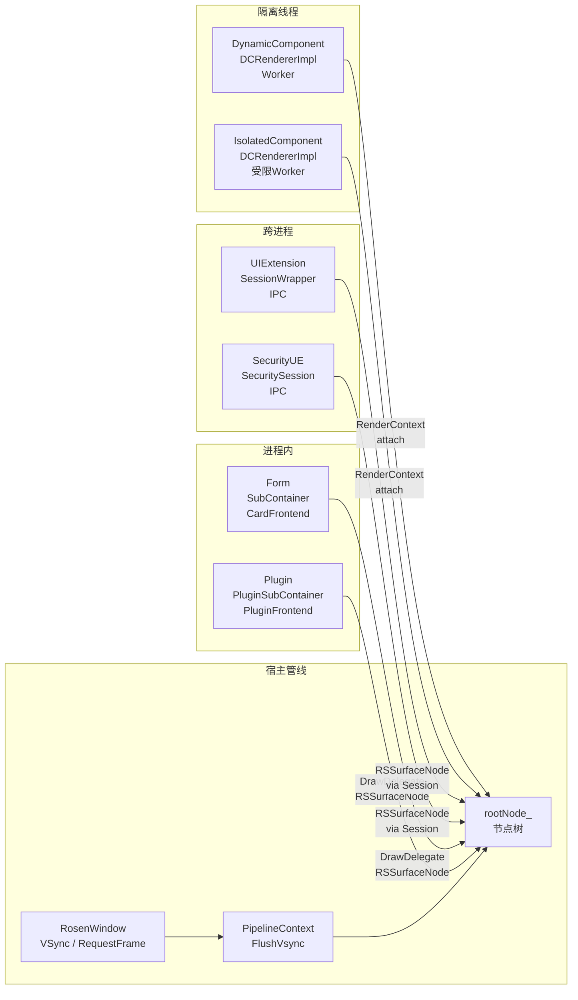
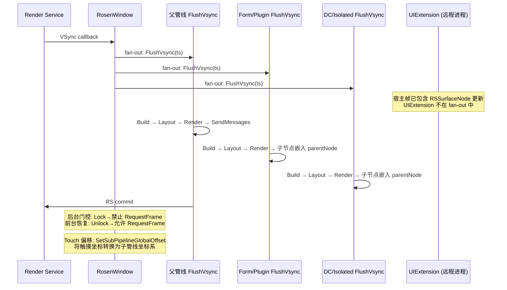

# 架构设计

> 多级渲染管线功能域的架构设计文档，补录已有实现。本域聚焦子管线与多容器 VSync 协调机制，其余管线内部能力（dirty flag、UITaskScheduler、Modifier 路径等）属于 03-01-01 基本渲染管线域。

## 设计元数据

| 字段 | 内容 |
|------|------|
| Design ID | DESIGN-Func-03-01-02 |
| 关联需求 | 已有能力补录（无独立 requirement.md） |
| 关联 Epic | 无 |
| 目标 Feature | Feat-01 子管线与多容器 VSync 协调 |
| 复杂度 | 复杂 |
| 目标版本 | API 10 起支持（框架内部能力） |
| Owner | ArkUI SIG |
| 状态 | Baselined（已有实现补录） |

## 需求基线

| 项 | 补充说明 |
|----|----------|
| 核心目标 | 子管线实例创建注册（isSubPipeline/parentPipeline/AttachSubPipelineContext）、多实例 VSync fan-out 协调、跨管线 Touch 坐标偏移、后台 RequestFrame 门控、7 类子管线类型分类差异 |
| P0 AC | 子管线创建与注册；VSync fan-out 分发；Touch 坐标偏移；后台门控；子管线类型分类 |

## 上下文和现状

### 涉及仓和模块

| 仓库 | 模块/路径 | 当前职责 | 本 Feature 影响 |
|------|-----------|----------|----------------|
| ace_engine | `frameworks/core/pipeline/pipeline_base.h` | PipelineBase 定义 isSubPipeline_/parentPipeline_ 子管线标记和父管线引用 | 子管线标记机制 |
| ace_engine | `frameworks/core/pipeline_ng/pipeline_context.h/cpp` | NG::PipelineContext 主管线编排、FlushVsync 流程、FindWindowScene | 主管线编排 |
| ace_engine | `frameworks/core/common/frontend.h` | Frontend::AttachSubPipelineContext 注册子管线 | 子管线注册入口 |
| ace_engine | `frameworks/core/pipeline/base/render_sub_container.h` | RenderSubContainer::GetSubPipelineContext 桥接 Form/Plugin 子管线 | 子管线桥接 |
| ace_engine | `frameworks/core/common/rosen/rosen_window.cpp` | RosenWindow VSync 注册、multi-instance callback fan-out、RequestFrame 门控 | VSync 协调 |
| ace_engine | `frameworks/core/event/touch_event.h` | TouchEvent SetSubPipelineGlobalOffset 坐标偏移 | Touch 偏移 |
| ace_engine | `frameworks/core/pipeline_ng/pipeline_context.cpp:5294` | FindWindowScene 查找 WINDOW_SCENE_ETS_TAG | 窗口场景适配 |
| ace_engine | `frameworks/core/components_ng/pattern/form/form_pattern.h` | FormPattern — Form/Card 子管线 Pattern | 进程内子管线 |
| ace_engine | `frameworks/core/components/form/sub_container.h` | SubContainer — Form/Card 子管线容器，创建独立 PipelineContext | 进程内容器 |
| ace_engine | `frameworks/core/components_ng/pattern/plugin/plugin_pattern.h` | PluginPattern — Plugin 子管线 Pattern | 进程内子管线 |
| ace_engine | `frameworks/core/components/plugin/plugin_sub_container.h` | PluginSubContainer — Plugin 子管线容器 | 进程内容器 |
| ace_engine | `frameworks/core/components_ng/pattern/ui_extension/ui_extension_component/ui_extension_pattern.h` | UIExtensionPattern — UIExtension 子管线 Pattern，SessionWrapper IPC | 跨进程子管线 |
| ace_engine | `frameworks/core/components_ng/pattern/ui_extension/session_wrapper.h` | SessionWrapper — IPC Session 通信桥接 | 跨进程桥接 |
| ace_engine | `frameworks/core/components_ng/pattern/ui_extension/dynamic_component/dynamic_pattern.h` | DynamicPattern — DynamicComponent 子管线 Pattern | 隔离线程子管线 |
| ace_engine | `adapter/ohos/entrance/dynamic_component/dynamic_component_renderer_impl.h` | DynamicComponentRendererImpl — DC/Isolated UIContent 创建 | 隔离线程渲染器 |
| ace_engine | `frameworks/core/components_ng/pattern/ui_extension/isolated_component/isolated_pattern.h` | IsolatedPattern — IsolatedComponent 子管线 Pattern | 受限线程子管线 |
| ace_engine | `frameworks/core/common/container.h` | Container::IsSubContainer()/IsDynamicRender() 子管线类型标记 | 容器类型判定 |
| ace_engine | `frameworks/core/common/container_scope.h` | ContainerScope::MarkIsolatedThread() 隔离线程标记 | 隔离线程管理 |

### 调用链层级分析

| 层 | 模块 | 职责 | 修改类型 |
|----|------|------|----------|
| 子管线创建层 | PipelineBase 构造 | 设置 isSubPipeline_/parentPipeline_ 标记 | 存量分析 |
| 注册层 | Frontend::AttachSubPipelineContext | 注册子管线到 Frontend 列表 | 存量分析 |
| 桥接层 | RenderSubContainer::GetSubPipelineContext | Form/Plugin 子管线实例获取 | 存量分析 |
| VSync 层 | RosenWindow::Init | multi-instance callback fan-out 注册 | 存量分析 |
| VSync 独立层 | 子管线 RequestVsync | 子管线独立 VSync 请求 | 存量分析 |
| Touch 层 | SetSubPipelineGlobalOffset | 跨管线 Touch 坐标偏移转换 | 存量分析 |
| 门控层 | window_->Lock/Unlock | 后台 RequestFrame 门控 | 存量分析 |
| 窗口适配层 | FindWindowScene | 子管线渲染挂载到正确窗口 | 存量分析 |
| 进程内类型层 | FormPattern/SubContainer + PluginPattern/PluginSubContainer | 进程内子管线创建与容器管理 | 存量分析 |
| 跨进程类型层 | UIExtensionPattern/SessionWrapper + SecurityUE/SecuritySessionWrapperImpl | 跨进程 IPC Session 通信 | 存量分析 |
| 隔离线程类型层 | DynamicPattern/DynamicComponentRendererImpl + IsolatedPattern | 隔离 Worker 线程 UIContent 创建 | 存量分析 |
| 容器类型标记层 | Container::IsSubContainer/IsDynamicRender + ContainerScope::MarkIsolatedThread | 子管线类型判定与线程隔离标记 | 存量分析 |

- [x] 调用链每一层都已覆盖
- [x] 每层职责边界清晰
- [x] 每层修改类型明确

### 适用架构规则

| Rule ID | 适用原因 | 设计结论 | 验证方式 |
|---------|----------|----------|----------|
| OH-ARCH-LAYERING | 子管线涉及 PipelineBase→Frontend→RosenWindow 单向调用 | 创建→注册→VSync 严格单向 | 代码评审 |
| OH-ARCH-SUBSYSTEM | 子管线跨渲染子系统（Form/Plugin/DynamicComponent） | 子管线嵌入父管线节点树 | 代码评审 |

## 不涉及项承接

| 维度 | 设计阶段处理方式 | 设计结论 |
|------|----------------|----------|
| 性能 | 展开设计 | VSync fan-out 分发延迟 < 0.5ms；后台 Lock/Unlock 功耗节省 |
| 安全与权限 | N/A | 框架内部能力，无权限 |
| 兼容性 | 保持 N/A | 框架内部，无版本差异 |
| API/SDK | N/A | 框架内部，无 SDK API |

## 关键设计决策

| 决策 ID | 问题 | 推荐方案 | 探索过的替代方案 | 取舍理由 | 影响 |
|---------|------|----------|-----------------|------|------|
| ADR-1 | 子管线如何建立父子关系 | 用 isSubPipeline_/parentPipeline_ 标记+指针 | 方案A：PipelineBase 子类化（创建子类 SubPipelineContext，增加维护复杂度）；方案B：独立 Pipeline 实例无关联（无法 VSync 协调） | 标记方式简单，共享大部分基础设施，仅 dirty 管理独立 | 子管线共享父管线 RSUIDirector 等基础设施 |
| ADR-2 | 子管线如何获得 VSync | 主管线 VSync fan-out 分发给所有子管线 | 方案A：每子管线独立订阅 VSync（VSync 请求分散，帧间延迟）；方案B：仅在需要时 RequestVsync（按需订阅，但帧间不保证同步） | fan-out 保证同一帧内所有管线协同渲染 | 子管线在同一 FlushVsync 流程中执行 |
| ADR-3 | 跨管线 Touch 坐标如何转换 | SetSubPipelineGlobalOffset 偏移转换 | 方案A：每子管线独立坐标空间无转换（触摸定位错误）；方案B：管线间事件广播（性能开销大） | 像素级偏移简单高效 | 子管线坐标系相对于父管线有正确偏移 |
| ADR-4 | 后台管线如何防止浪费 VSync | window_->Lock/Unlock 门控 | 方案A：始终订阅 VSync（后台功耗浪费）；方案B：管线暂停标记（实现复杂） | Lock/Unlock 门控简单直接 | 后台管线无 VSync 请求 |
| ADR-5 | 子管线 rootNode 如何挂载 | 子管线 rootNode 嵌入父管线节点树 | 方案A：独立渲染树（需要独立 RSRootNode，增加资源开销）；方案B：脱离父树（无法与父管线内容协同） | 嵌入父树保证子管线渲染在父管线节点树中 | 子管线节点仍是父管线树的子节点 |
| ADR-6 | 子管线类型如何分类 | 三类进程模型：进程内（Form/Plugin）、隔离线程（DC/Isolated）、跨进程（UIExtension） | 方案A：统一进程内模型（UIExtension 无法在进程内实现）；方案B：统一跨进程模型（Form/Plugin 不需要 IPC 开销） | 不同内容嵌入场景有本质架构差异，无法统一 | 各类型使用不同的 Pattern/Container/Session 类 |

## 设计骨架

### 骨架范围

| 骨架项 | 目标 | 不包含 | 验证方式 |
|-------|------|--------|----------|
| 子管线创建与注册 | isSubPipeline/parentPipeline 标记与 AttachSubPipelineContext 注册 | dirty flag 管理（03-01-01） | 单元测试 |
| VSync 协调 | fan-out 分发与独立 RequestVsync | DisplaySync（03-01-01） | 单元测试 |
| Touch 偏移 | SetSubPipelineGlobalOffset 坐标转换 | 手势仲裁（04-04-06） | 单元测试 |
| 后台门控 | Lock/Unlock RequestFrame 门控 | FlushMessages（03-01-01） | 单元测试 |
| 子管线类型分类 | 7 类子管线进程/线程/渲染/事件模型差异 | 各类型内部实现细节 | 单元测试 |

### 骨架 Spec 拆分

| Task ID | 目标 | 受影响文件 | AC |
|---------|------|-----------|----|
| TASK-SKELETON-1 | 子管线与多容器 VSync 协调规格 | Feat-01 spec document | AC-1.1~5.10 |

## 后续 Task 拆分

| Task ID | 目标 | 受影响文件 | 依赖 |
|---------|------|-----------|------|
| TASK-1 | Feat-01 子管线与多容器 VSync 协调规格 | Feat-01 spec document | 无 |

## API 签名、Kit 与权限

### 新增 API

N/A — 框架内部能力，无新增 API。

### 变更/废弃 API

无变更或废弃 API。

## 构建系统影响

### BUILD.gn 变更

无新增 BUILD.gn target — 子管线机制属于 pipeline_base/pipeline_context 已有源集。

### bundle.json 变更

无新增部件或依赖变更。

## 可选设计扩展

### 架构图

#### 子管线分类与嵌入模型



**三类子管线差异对照：**

| 维度 | 进程内 (Form/Plugin) | 跨进程 (UIExtension) | 隔离线程 (DC/Isolated) |
|------|---------------------|---------------------|----------------------|
| PipelineContext | SubContainer 创建独立 PC | 无本地 PC（远程 Ability 进程） | UIContent 创建独立 PC（Worker线程） |
| 渲染挂载 | DrawDelegate / RSSurfaceNode → parentNode | RSSurfaceNode via IPC Session → parentNode | RenderContext attach → parentNode |
| 事件 | Touch dispatch + serialized gesture | IPC session sync/async forward | PointerEvent + Key transfer |
| Container 标记 | IsSubContainer=true | Normal host | IsDynamicRender=true, IsIsolatedThread=true |
| 线程 | 宿主 UI 线程 | 宿主 UI 线程（无本地渲染） | Worker / 受限 Worker 线程 |

#### VSync 协调与事件流



### 数据模型设计

| 字段 | 类型 | 所属类 | 用途 |
|------|------|--------|------|
| isSubPipeline_ | bool | PipelineBase | 标记是否为子管线 |
| parentPipeline_ | WeakPtr<PipelineBase> | PipelineBase | 父管线引用（弱引用防循环） |
| subPipelineContexts_ | vector<RefPtr<PipelineContext>> | Frontend | 已注册子管线列表 |
| globalOffset_ | Offset | TouchEvent | 跨管线 Touch 坐标偏移 |

### 子管线类型分类模型

| 类型 | 进程模型 | 线程模型 | PipelineContext | 渲染模型 | 事件模型 | Container 标记 |
|------|---------|---------|---------------|---------|---------|---------------|
| Form/Card | 进程内 | 宿主 UI 线程 | SubContainer 创建 | DrawDelegate/RSSurfaceNode | Touch dispatch + serialized gesture | IsSubContainer=true |
| Plugin | 进程内 | 宿主 UI 线程 | PluginSubContainer 创建 | DrawDelegate/RSSurfaceNode | Touch dispatch | IsSubContainer=true |
| UIExtension | 跨进程 IPC | 宿主 UI 线程（无本地 PC） | 无（SessionWrapper） | RSSurfaceNode via Session | IPC session forward | Normal |
| SecurityUIExtension | 跨进程 IPC | 宿主 UI 线程 | 无（SecuritySessionWrapper） | RSSurfaceNode via Session | IPC session forward | Normal |
| DynamicComponent | 进程内隔离 | Worker 线程（MarkIsolatedThread） | UIContent 创建（有 AbilityContext） | RenderContext attach | PointerEvent + Key transfer | IsDynamicRender=true |
| IsolatedComponent | 进程内受限 | 受限 Worker 线程 | UIContent 创建（无 AbilityContext） | RenderContext attach | PointerEvent + Key transfer | IsDynamicRender=true |
| PreviewUIExtension | 跨进程 IPC | 宿主 UI 线程 | 无（PreviewSessionWrapper） | RSSurfaceNode via Session | 继承 SecurityUE | Normal |

## 详细设计

### 子管线创建与注册

子管线通过 `PipelineContext` 构造时设置 `isSubPipeline_=true` 和 `parentPipeline_=parent` 建立归属关系。`Frontend::AttachSubPipelineContext(pipeline)` 注册子管线到 Frontend 维护的子管线列表。`RenderSubContainer::GetSubPipelineContext()` 桥接 Form/Plugin 子管线。

```cpp
// pipeline_base.h:1185-1192
bool isSubPipeline_ = false;
WeakPtr<PipelineBase> parentPipeline_;

// frontend.h:138-139
void AttachSubPipelineContext(const RefPtr<PipelineContext>& pipeline);

// render_sub_container.h:29
virtual RefPtr<PipelineContext> GetSubPipelineContext();
```

子管线 rootNode 嵌入父管线节点树（非独立渲染树根），因此子管线渲染节点仍受父管线 FlushRender 管理。

### 多实例 VSync 协调

`RosenWindow::Init` 注册 VSync 回调时，通过 multi-instance callback fan-out 将同一 VSync 信号分发给所有已注册管线实例。子管线在同一 FlushVsync 流程中按 parentPipeline_ 确定的时序执行，保证帧间协同。

```cpp
// rosen_window.cpp:147-178
// Multi-instance callback fan-out:
// vsyncCallback_ → forEach registered pipeline → FlushVsync(timestamp)
```

子管线也可通过自身 `RequestVsync()` 独立订阅 VSync（不依赖 fan-out），用于子管线主动请求帧的场景。

### 跨管线 Touch 坐标偏移

`SetSubPipelineGlobalOffset` 在 Touch 事件从父管线传递到子管线时，将触摸坐标转换为子管线本地坐标系。偏移值 = parentOffset + subPipelineLocalOffset，支持多层级累加。

```cpp
// touch_event.h:197
void SetSubPipelineGlobalOffset(const Offset& globalOffset);
```

### 子管线类型分类

ace_engine 有 7 类子管线/嵌入组件，分属三类进程模型：

**进程内类型（Form/Plugin）**：SubContainer/PluginSubContainer 在宿主 UI 线程创建独立 PipelineContext，使用 CardFrontend/PluginFrontend 驱动页面运行。渲染通过 DrawDelegate 或 RSSurfaceNode 输出到宿主树。Container::IsSubContainer()=true。

```cpp
// sub_container.h:31 — Form 子管线容器
class SubContainer : public AceType { ... };

// plugin_sub_container.h:28 — Plugin 子管线容器
class PluginSubContainer : public AceType { ... };

// container.h:314
bool IsSubContainer() const { return isSubContainer_; }
```

**跨进程类型（UIExtension/SecurityUE/PreviewUE）**：宿主 Pattern 仅持有 SessionWrapper 进行 IPC 通信，不创建本地 PipelineContext。远程 Ability 进程负责渲染，通过 RSSurfaceNode 嵌入宿主渲染树。事件通过 IPC Session 同步/异步转发。

```cpp
// session_wrapper.h:58-81
enum SessionType { UI_EXTENSION_ABILITY, SECURITY_UI_EXTENSION_ABILITY, ... };
class SessionWrapper : public AceType { ... };

// ui_extension_pattern.h:102 — 宿主侧无 PC
class UIExtensionPattern : public Pattern {
    RefPtr<SessionWrapper> sessionWrapper_; // IPC 桥接
};
```

**隔离线程类型（DynamicComponent/IsolatedComponent）**：DynamicComponentRendererImpl 在 Worker 线程创建 UIContent → Container → PipelineContext。ContainerScope::MarkIsolatedThread() 标记线程为隔离线程。DC 使用 `InitUiContent(hostAbilityContext)` 有 AbilityContext；Isolated 使用 `InitUiContent(nullptr)` 无 AbilityContext。Container::IsDynamicRender()=true。

```cpp
// container_scope.h:110-116
static void MarkIsolatedThread();
static bool IsIsolatedThread();
static void AddLocal(int32_t containerId);

// dynamic_component_renderer_impl.cpp:295
void InitUiContent(void* abilityContext); // DC: 有 context; Isolated: nullptr

// pipeline_context.h:948
bool IsIsolatedThread() const { return isIsolatedThread_; }

// isolated_pattern.cpp:82 — Isolated 必须在受限线程
if (!IsRestrictedWorkerThread()) { return; }
```

DC/Isolated 禁止嵌套：不可在 DC 内嵌套 DC 或 Isolated，不可在 Isolated 内嵌套 Isolated 或 DC。

### 后台 RequestFrame 门控

`window_->Lock()` 在管线处于后台时阻止 `RequestFrame` 发起 VSync 请求，`window_->Unlock()` 在管线切换到前台时恢复。子管线需要额外判断是否在可见窗口中，通过 `FindWindowScene` 查找 `WINDOW_SCENE_ETS_TAG` 确定挂载窗口场景。

```cpp
// rosen_window.cpp:258-289
// RequestFrame with background gate:
// if (isLocked_) return; // 后台门控
```

## 风险和开放问题

| 项 | 类型 | 影响 | 处理方式 | Owner |
|----|------|------|----------|-------|
| parentPipeline_ 弱引用 | 架构 | 低 | 弱引用防循环引用，销毁时断开 | ArkUI SIG |
| fan-out 时序与独立 RequestVsync 冲突 | 架构 | 中 | spec 注明独立请求场景可能造成帧间延迟 | ArkUI SIG |
| 子管线 rootNode 嵌入父树 | 架构 | 中 | spec 注明子管线不拥有独立渲染树根 | ArkUI SIG |
| FindWindowScene 查找失败 | 架构 | 低 | 查找失败时子管线挂载到全局 root | ArkUI SIG |
| DC/Isolated 禁止嵌套 | 架构 | 中 | CheckConstraint 防止嵌套，spec 注明约束 | ArkUI SIG |
| IsolatedThread 一致性 | 架构 | 中 | PipelineContext 验证 isIsolatedThread_ 节点匹配，日志告警 | ArkUI SIG |
| UIExtension 跨进程 Session 断开 | 架构 | 中 | OnDisconnect 清理 RSSurfaceNode 和 placeholder 恢复 | ArkUI SIG |

## 设计审批

- [x] 需求基线已确认，设计覆盖 P0/P1 AC
- [x] 不涉及项已承接
- [x] 涉及仓和模块职责清楚
- [x] 调用链层级分析完整
- [x] 适用架构规则已识别
- [x] 分层和子系统边界合规
- [x] API 变更有签名和兼容性说明（N/A — 框架内部）
- [x] BUILD.gn/bundle.json 影响明确（无变更）
- [x] 设计输出和 Task 拆分明确
- [x] 关键设计决策有理由
- [x] 风险和开放问题有 Owner

**结论:** 通过（已有实现补录）
