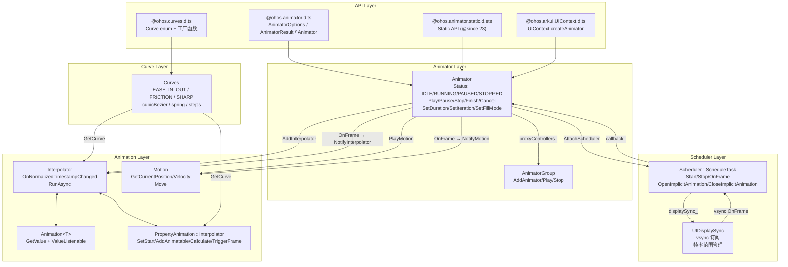
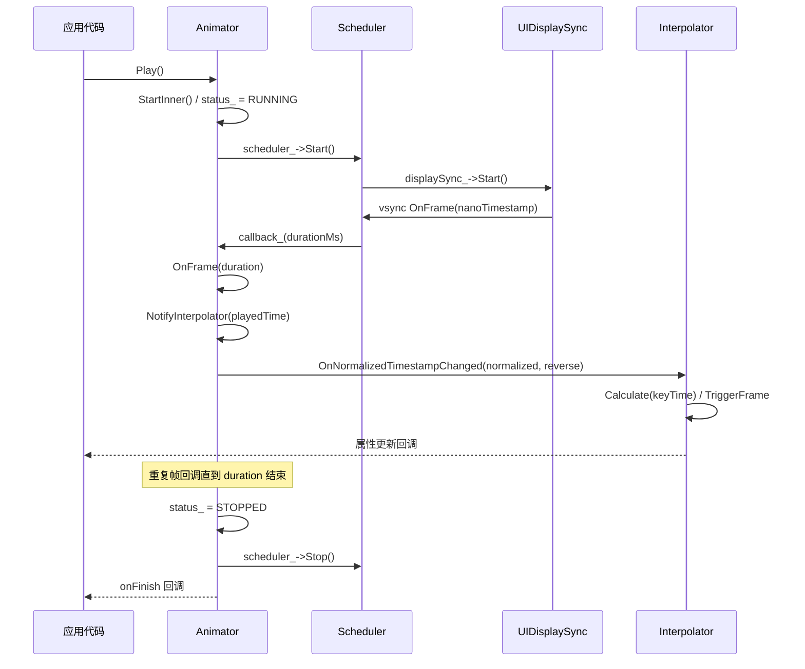
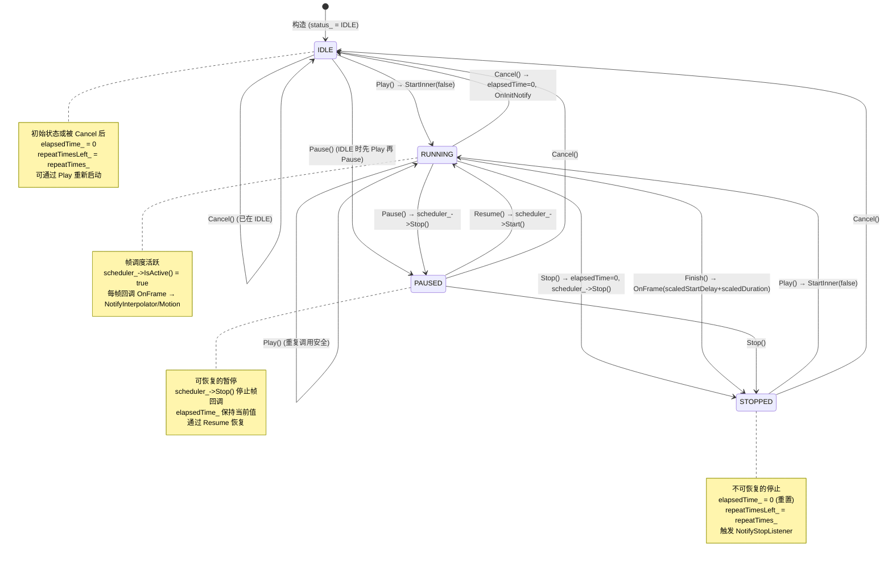

# 架构设计
> 动效框架（Animation Framework）的架构设计文档，覆盖 Animator 控制器、Scheduler 帧调度、Motion 物理动画、AnimatorGroup 编组以及曲线系统。

## 设计元数据

| 字段 | 内容 |
|------|------|
| Design ID | DESIGN-Func-03-02-01 |
| 关联需求 | 已有能力补录（无独立 requirement.md） |
| 关联 Epic | 无 |
| 目标 Feature | Feat-01: 动效框架全量规格（Animator / Scheduler / Motion / AnimatorGroup / Curves） |
| 复杂度 | 复杂 |
| 目标版本 | API 6 ~ API 26+ |
| Owner | ArkUI SIG |
| 状态 | Baselined（已有实现补录） |

## 需求基线

> 需求基线详见 proposal.md。以下仅列出设计阶段需要额外强调的要点。

| 项 | 补充说明（如需） |
|----|------------------|
| 双驱动模型 | Animator 同时支持 Interpolator 插值动画和 Motion 物理动画，互斥播放，设置一方时清除另一方（`animator.h:56-59`） |
| VSync 帧调度 | Scheduler 持有 UIDisplaySync 实例（`scheduler.h:87`），通过 vsync 回调驱动 OnFrame → NotifyInterpolator → 属性更新 |
| 帧率范围 | ExpectedFrameRateRange {min, max, expected} 支持动态帧率调节（`animator.h:106`，`scheduler.h:79`） |
| 全局时长缩放 | SetDurationScale 静态方法调节全局动画时长（`animator.h:53`，`animator.cpp:37`），默认 1.0 |
| 静态 API | `@ohos.animator.static.d.ets` 自 API 23 起提供 Static API 支持 |

## 上下文和现状

### 涉及仓和模块

| 仓库 | 模块路径 | 当前职责 | 本 Feature 影响 |
|------|----------|----------|-----------------|
| ace_engine | `frameworks/core/animation/animator.h/.cpp` | Animator 控制器：状态管理、Play/Pause/Stop/Finish/Cancel、Interpolator/Motion 驱动 | 核心实现，规格补录 |
| ace_engine | `frameworks/core/animation/scheduler.h/.cpp` | Scheduler：持有 UIDisplaySync，vsync 帧驱动、隐式动画管理 | 规格补录 |
| ace_engine | `frameworks/core/animation/schedule_task.h` | ScheduleTask 抽象基类：OnFrame 纯虚接口 | 规格补录 |
| ace_engine | `frameworks/core/animation/animator_group.h/.cpp` | AnimatorGroup：多 Animator 编组同步播放/停止 | 规格补录 |
| ace_engine | `frameworks/core/animation/interpolator.h` | Interpolator 抽象：归一化时间戳回调、RunAsync 异步执行 | 规格补录 |
| ace_engine | `frameworks/core/animation/motion.h` | Motion 物理动画基类：位置/速度/完成状态查询 | 规格补录 |
| ace_engine | `frameworks/core/animation/animation.h` | Animation<T> 模板：值监听 + 插值器组合 | 规格补录 |
| ace_engine | `frameworks/core/animation/curves.h` | Curves 曲线工厂（委托 `ui/animation/curves.h`） | 规格补录 |
| ace_engine | `frameworks/core/animation/animation_pub.h` | AnimationInterface 枚举、动画接口名称查询 | 规格补录 |
| interface/sdk-js | `api/@ohos.animator.d.ts` | Dynamic API 声明（AnimatorOptions / AnimatorResult / Animator） | 规格对照 |
| interface/sdk-js | `api/@ohos.animator.static.d.ets` | Static API 声明（@since 23） | 规格对照 |
| interface/sdk-js | `api/@ohos.curves.d.ts` | Curves 模块声明（Curve 枚举 + 工厂函数） | 规格对照 |

### 调用链层级分析

| 层 | 模块 | 职责 | 修改类型 |
|----|------|------|----------|
| SDK API | `@ohos.animator.d.ts`, `@ohos.animator.static.d.ets` | 应用层 Animator 创建、属性设置、回调注册 | 无修改（规格补录） |
| SDK API | `@ohos.curves.d.ts` | 曲线创建工厂函数 | 无修改（规格补录） |
| JS Bridge | `frameworks/bridge/declarative_frontend/engine_function.cpp` | animator 模块 JS 绑定入口 | 无修改（规格补录） |
| Animator | `frameworks/core/animation/animator.h/.cpp` | 控制器核心：状态机、Interpolator 列表、Motion 持有、Scheduler 驱动 | 无修改（规格补录） |
| Scheduler | `frameworks/core/animation/scheduler.h/.cpp` | 帧调度：UIDisplaySync vsync 回调 → OnFrame → NotifyInterpolator | 无修改（规格补录） |
| ScheduleTask | `frameworks/core/animation/schedule_task.h` | 抽象基类：OnFrame(uint64_t nanoTimestamp) 纯虚 | 无修改（规格补录） |
| Interpolator | `frameworks/core/animation/interpolator.h` | 插值动画基类：归一化时间戳回调、RunAsync 异步路径 | 无修改（规格补录） |
| Motion | `frameworks/core/animation/motion.h` | 物理动画基类：GetCurrentPosition/Velocity/IsCompleted、Move | 无修改（规格补录） |
| AnimatorGroup | `frameworks/core/animation/animator_group.h/.cpp` | 多 Animator 编组管理 | 无修改（规格补录） |
| DisplaySync | `frameworks/core/components_ng/manager/display_sync/ui_display_sync.h` | UIDisplaySync 实例：vsync 订阅与帧率管理 | 无修改（规格补录） |

### 适用架构规则

| Rule ID | 适用原因 | 设计结论 | 验证方式 |
|---------|----------|----------|----------|
| OH-ARCH-LAYERING | Animator 涉及 API → Bridge → Animator → Scheduler → UIDisplaySync → vsync 多层调用 | 调用方向自上而下，Scheduler 不直接访问 Bridge 层 | 代码评审 |
| OH-ARCH-API-LEVEL | Animator 有 @since 6/9/10/11/12/18/23/26 等多版本 API | 各版本 API 通过 PlatformVersion 条件分支实现兼容 | API 评审 / XTS |
| OH-ARCH-SUBSYSTEM | Scheduler 依赖 UIDisplaySync（display_sync 模块） | 同仓跨模块依赖，通过 RefPtr<UIDisplaySync> 持有 | 依赖检查 |
| OH-ARCH-ERROR-LOG | Animator 关键路径使用 TAG_LOGI/TAG_LOGW 日志 | 动画启停、状态切换、帧率设置等关键路径有 hilog 覆盖 | hilog 验证 |

## 不涉及项承接

> proposal.md 已完成 N/A 判定。本节仅对 proposal 中标记为"涉及"且需展开设计的维度给出结论。

| 维度 | 设计结论 |
|------|----------|
| 帧率自适应 | ExpectedFrameRateRange {min, max, expected} 通过 Scheduler→UIDisplaySync 传递给 vsync 子系统，支持动态帧率调节 |
| 全局动画缩放 | SetDurationScale 静态方法（`animator.cpp:37`）影响所有 Animator 的 scaledDuration_，用于开发者选项动画缩放 |
| 跨平台兼容 | @crossplatform 标注自 API 10 起支持，Scheduler 在非移动端通过 UIDisplaySync 适配不同 vsync 源 |

## 关键设计决策

| 决策 ID | 问题 | 推荐方案 | 探索过的替代方案 | 取舍理由 | 影响 |
|---------|------|----------|-----------------|----------|------|
| ADR-1 | Animator 如何同时支持插值和物理动画 | 双路径设计：Interpolator 列表 + Motion 单例，互斥播放（`animator.h:56-59`） | 统一为单一动画抽象 | 插值动画需要归一化时间戳（0~1），物理动画需要真实时间戳和速度/位置查询，语义不同难以统一 | AC-1.1, AC-3.1 |
| ADR-2 | 帧调度由谁驱动 | Scheduler 持有 UIDisplaySync 实例（`scheduler.h:87`），vsync 回调 OnFrame | 直接订阅 Rosen RSUIDisplaySync | UIDisplaySync 封装了帧率范围管理和 vsync 订阅，提供更简洁的 Start/Stop 接口 | AC-2.1, AC-2.2 |
| ADR-3 | Animator 状态如何管理 | 四态状态机：IDLE/RUNNING/PAUSED/STOPPED（`animator.h:45-50`） | 三态（IDLE/RUNNING/STOPPED） | PAUSED 与 STOPPED 语义不同：PAUSED 可 Resume 恢复，STOPPED 不可恢复（elapsedTime 归零） | AC-4.1 ~ AC-4.5 |
| ADR-4 | 全局动画缩放如何实现 | 静态 scale_ 变量（`animator.h:282`），SetDurationScale 修改后影响所有新建/更新动画的 scaledDuration_ | 每实例独立缩放 | 开发者选项"动画缩放"需要全局生效，静态变量最简实现 | AC-6.1 |
| ADR-5 | Animator 编组如何实现 | AnimatorGroup 管理子 Animator 列表，Play/Stop 同步广播（`animator_group.h:27`） | 嵌套 Animator 代理 | AnimatorGroup 使用独立状态跟踪（AnimatorGroupStatus），OnAnimatorStop 回调检测全部停止 | AC-8.1, AC-8.2 |
| ADR-6 | 回调命名从 camelCase 到 PascalCase 的迁移 | onframe/onfinish/oncancel/onrepeat 标记 @deprecated since 12，新增 onFrame/onFinish/onCancel/onRepeat | 直接重命名 | 保持向后兼容，旧回调在 API 12 后仍可用但推荐迁移 | AC-9.1 |
| ADR-7 | Animator 创建是否需要 UIContext 关联 | API 10+ 推荐 UIContext.createAnimator（`@ohos.arkui.UIContext.d.ts:3845`），全局 Animator.create 标记 @deprecated since 18 | 保留全局 create | UIContext 关联确保 Animator 在正确的 UI 实例中创建，避免多实例混淆 | AC-10.1 |

## 设计骨架

### 骨架范围

| 骨架项 | 目标 | 不包含 | 验证方式 |
|--------|------|--------|----------|
| Animator 状态机 | IDLE/RUNNING/PAUSED/STOPPED 四态转换与 Play/Pause/Resume/Stop/Finish/Cancel 驱动 | 嵌套代理控制器（AddProxyController） | UT |
| Scheduler 帧调度 | UIDisplaySync vsync → OnFrame → NotifyInterpolator/Motion 驱动链 | 自定义 vsync 源 | UT |
| Interpolator 插值动画 | 归一化时间戳回调、RunAsync 异步路径 | 具体插值器子类（PropertyAnimation 等） | UT |
| Motion 物理动画 | GetCurrentPosition/Velocity、Move 驱动 | 具体物理动画子类（SpringMotion/FrictionMotion） | UT |
| AnimatorGroup 编组 | 多 Animator 同步 Play/Stop、OnAnimatorStop 回调 | 嵌套 AnimatorGroup | UT |
| 曲线系统 | Curve 枚举 + 工厂函数（initCurve/cubicBezierCurve/springCurve/springMotion/interpolatingSpring 等） | 自定义曲线实现细节 | UT |
| 帧率范围管理 | ExpectedFrameRateRange {min, max, expected} 设置与 UIDisplaySync 传递 | vsync 子系统内部实现 | UT |

### 骨架 Spec 拆分

| Task ID | 目标 | 受影响文件 | AC |
|---------|------|-----------|-----|
| TASK-SKELETON-1 | 动效框架全量规格补录（Animator / Scheduler / Motion / AnimatorGroup / Curves） | Feat-01-animation-framework-spec.md | AC-1.1 ~ AC-10.4 |

## 后续 Task 拆分

| Task ID | 目标 | 受影响文件 | 依赖 |
|---------|------|-----------|------|
| TASK-ANIM-FW-01 | 动效框架全量规格补录 | Feat-01-animation-framework-spec.md, design.md | 无 |

## API 签名、Kit 与权限

### 新增 API

| API 签名 | 类型 | d.ts 位置 | 权限要求 | SysCap |
|----------|------|-----------|----------|--------|
| `Animator.create(options: AnimatorOptions): AnimatorResult` | Public | `@ohos.animator.d.ts:542` | 无 | SystemCapability.ArkUI.ArkUI.Full |
| `Animator.create(options: AnimatorOptions \| SimpleAnimatorOptions): AnimatorResult` | Public | `@ohos.animator.d.ts:561` | 无 | SystemCapability.ArkUI.ArkUI.Full |
| `AnimatorResult.play(): void` | Public | `@ohos.animator.d.ts:335` | 无 | 同上 |
| `AnimatorResult.finish(): void` | Public | `@ohos.animator.d.ts:346` | 无 | 同上 |
| `AnimatorResult.pause(): void` | Public | `@ohos.animator.d.ts:356` | 无 | 同上 |
| `AnimatorResult.cancel(): void` | Public | `@ohos.animator.d.ts:368` | 无 | 同上 |
| `AnimatorResult.reverse(): void` | Public | `@ohos.animator.d.ts:378` | 无 | 同上 |
| `AnimatorResult.reset(options: AnimatorOptions): void` | Public | `@ohos.animator.d.ts:305` | 无 | 同上 |
| `AnimatorResult.reset(options: AnimatorOptions \| SimpleAnimatorOptions): void` | Public | `@ohos.animator.d.ts:324` | 无 | 同上 |
| `AnimatorResult.onFrame: (progress: number) => void` | Public | `@ohos.animator.d.ts:407` | 无 | 同上 |
| `AnimatorResult.onFinish: () => void` | Public | `@ohos.animator.d.ts:433` | 无 | 同上 |
| `AnimatorResult.onCancel: () => void` | Public | `@ohos.animator.d.ts:459` | 无 | 同上 |
| `AnimatorResult.onRepeat: () => void` | Public | `@ohos.animator.d.ts:485` | 无 | 同上 |
| `AnimatorResult.setExpectedFrameRateRange(rateRange: ExpectedFrameRateRange): void` | Public | `@ohos.animator.d.ts:496` | 无 | 同上 |
| `SimpleAnimatorOptions` class | Public | `@ohos.animator.d.ts:172` | 无 | 同上 |
| `curves.initCurve(curve?: Curve): ICurve` | Public | `@ohos.curves.d.ts:197` | 无 | 同上 |
| `curves.stepsCurve(count: number, end: boolean): ICurve` | Public | `@ohos.curves.d.ts:226` | 无 | 同上 |
| `curves.customCurve(interpolate: (fraction: number) => number): ICurve` | Public | `@ohos.curves.d.ts:245` | 无 | 同上 |
| `curves.cubicBezierCurve(x1, y1, x2, y2): ICurve` | Public | `@ohos.curves.d.ts:277` | 无 | 同上 |
| `curves.springCurve(velocity, mass, stiffness, damping): ICurve` | Public | `@ohos.curves.d.ts:329` | 无 | 同上 |
| `curves.springMotion(response?, dampingFraction?, overlapDuration?): ICurve` | Public | `@ohos.curves.d.ts:384` | 无 | 同上 |
| `curves.responsiveSpringMotion(response?, dampingFraction?, overlapDuration?): ICurve` | Public | `@ohos.curves.d.ts:412` | 无 | 同上 |
| `curves.interpolatingSpring(velocity, mass, stiffness, damping): ICurve` | Public | `@ohos.curves.d.ts:453` | 无 | 同上 |
| `Animator.create(options): AnimatorResult` (Static) | Public | `@ohos.animator.static.d.ets:382` | 无 | 同上 |
| `UIContext.createAnimator(options): AnimatorResult` | Public | `@ohos.arkui.UIContext.d.ts:3845` | 无 | 同上 |

### 变更/废弃 API

| 原有 API | 变更类型 | 新 API | 迁移说明 |
|----------|----------|--------|----------|
| `Animator.createAnimator(options)` (@since 6) | 废弃 | `Animator.create(options)` (@since 9) | 使用 Animator.create 替代 |
| `AnimatorResult.update(options)` (@since 6) | 废弃 | `AnimatorResult.reset(options)` (@since 9) | 使用 reset 替代 |
| `Animator.create(options)` (@since 9) | 废弃 | `UIContext.createAnimator(options)` (@since 10) | 使用 UIContext 关联创建 |
| `onframe` (@since 6) | 废弃 | `onFrame` (@since 12) | 使用 PascalCase 命名 |
| `onfinish` (@since 6) | 废弃 | `onFinish` (@since 12) | 使用 PascalCase 命名 |
| `oncancel` (@since 6) | 废弃 | `onCancel` (@since 12) | 使用 PascalCase 命名 |
| `onrepeat` (@since 6) | 废弃 | `onRepeat` (@since 12) | 使用 PascalCase 命名 |

## 构建系统影响

### BUILD.gn 变更

动画框架为 ace_engine 核心模块，无独立 BUILD.gn 变更：

```
# frameworks/core/animation/BUILD.gn
# 构建目标：ace_core（内部静态库）
# 包含 animator.cpp, scheduler.cpp, interpolator.cpp, motion.cpp, animator_group.cpp 等
```

### bundle.json 变更

动画框架作为 ace_engine 的内部 component，无独立 bundle.json 变更。

## 可选设计扩展

### 架构图



### 数据流/控制流

| 步骤 | 调用方 | 被调用方 | 数据/接口 | 说明 |
|------|--------|----------|-----------|------|
| 1 | 应用代码 | Animator | Play() | 启动动画 |
| 2 | Animator | StartInner() | status_ = RUNNING | 状态切换 |
| 3 | Animator | Scheduler | scheduler_->Start() | 启动帧调度 |
| 4 | Scheduler | UIDisplaySync | displaySync_->Start() | 订阅 vsync |
| 5 | UIDisplaySync | Scheduler | OnFrame(nanoTimestamp) | vsync 回调 |
| 6 | Scheduler | Animator | callback_(durationMs) | 帧回调 |
| 7 | Animator | Animator | OnFrame(duration) | 内部帧处理 |
| 8 | Animator | Interpolator | NotifyInterpolator(playedTime) | 通知插值器 |
| 9 | Interpolator | PropertyAnimation | OnNormalizedTimestampChanged(normalized, reverse) | 归一化时间戳 |
| 10 | PropertyAnimation | Animatable | TriggerFrame(start, end, time) | 计算插值并触发回调 |
| 11 | PropertyAnimation | 应用代码 | animateTo_(animatable) | 属性更新回调 |

### 时序设计



### 数据模型设计

**API 层类型 (TypeScript)**:

```typescript
// AnimatorOptions (@since 6)
interface AnimatorOptions {
  duration: number;      // ms, [0, +∞), default 0
  easing: string;        // 曲线字符串
  delay: number;         // ms, default 0
  fill: "none" | "forwards" | "backwards" | "both";
  direction: "normal" | "reverse" | "alternate" | "alternate-reverse";
  iterations: number;     // 0=不播放, -1=无限, 正整数=次数
  begin: number;         // 插值起点, default 0
  end: number;           // 插值终点, default 1
}

// SimpleAnimatorOptions (@since 18)
class SimpleAnimatorOptions {
  constructor(begin: number, end: number);
  duration(duration: number): SimpleAnimatorOptions;
  easing(curve: string): SimpleAnimatorOptions;
  delay(delay: number): SimpleAnimatorOptions;
  fill(fillMode: FillMode): SimpleAnimatorOptions;
  direction(direction: PlayMode): SimpleAnimatorOptions;
  iterations(iterations: number): SimpleAnimatorOptions;
}

// AnimatorResult
interface AnimatorResult {
  reset(options: AnimatorOptions | SimpleAnimatorOptions): void;
  play(): void;
  finish(): void;
  pause(): void;
  cancel(): void;
  reverse(): void;
  onFrame: (progress: number) => void;
  onFinish: () => void;
  onCancel: () => void;
  onRepeat: () => void;
  setExpectedFrameRateRange(rateRange: ExpectedFrameRateRange): void;
}

// ExpectedFrameRateRange (@since 11)
interface ExpectedFrameRateRange {
  min: number;
  max: number;
  expected: number;
}
```

**框架层结构 (C++)**:

```cpp
// Animator 关键字段 (animator.h:258-287)
std::list<RefPtr<Interpolator>> interpolators_;  // 插值器列表
std::list<RefPtr<Animator>> proxyControllers_;   // 代理控制器
RefPtr<Scheduler> scheduler_;                    // 帧调度器
RefPtr<Motion> motion_;                           // 物理动画
FillMode fillMode_ = FillMode::FORWARDS;         // 填充模式
AnimationDirection direction_ = AnimationDirection::NORMAL;
int32_t duration_ = 0;                            // ms
int32_t startDelay_ = 0;                          // ms
int32_t iteration_ = 1;                           // 迭代次数
Status status_ = Status::IDLE;                   // 当前状态
float tempo_ = 1.0f;                              // 速度倍率
static float scale_;                              // 全局缩放

// Scheduler 关键字段 (scheduler.h:82-87)
int32_t scheduleId_ = 0;
bool isRunning_ = false;
OnFrameCallback callback_ = nullptr;
WeakPtr<PipelineBase> context_;
RefPtr<UIDisplaySync> displaySync_;               // UIDisplaySync 实例
```

### 算法与状态机



### 测试性设计

| 测试层级 | 测试目标 | Mock 策略 | 验证方式 |
|----------|----------|-----------|----------|
| UT - Animator | 状态转换（IDLE/RUNNING/PAUSED/STOPPED） | MockScheduler 替换 UIDisplaySync | gtest_filter |
| UT - Animator | Play/Pause/Stop/Finish/Cancel 行为 | MockScheduler | gtest_filter |
| UT - Animator | SetDuration/SetIteration/SetFillMode/SetAnimationDirection | 直接构造 Animator | gtest_filter |
| UT - Scheduler | Start/Stop/OnFrame 帧调度 | MockUIDisplaySync | gtest_filter |
| UT - AnimatorGroup | AddAnimator/Play/Stop/OnAnimatorStop | MockAnimator | gtest_filter |
| UT - Interpolator | OnNormalizedTimestampChanged/RunAsync | MockCurve | gtest_filter |
| UT - Curves | 曲线工厂函数（cubicBezier/spring/steps 等） | 直接构造 | gtest_filter |
| UT - FrameRate | SetExpectedFrameRateRange 帧率范围设置 | MockUIDisplaySync | gtest_filter |

### 线程与并发模型

| 操作 | 发起线程 | 回调线程 | 跨进程边界 | 线程安全 | 重入约束 |
|------|----------|----------|-----------|----------|----------|
| Play/Pause/Stop/Finish/Cancel | UI 线程 | UI 线程 | 无 | UI 线程安全 | Play 可重入（重复调用安全） |
| onFrame 回调 | vsync 线程 | UI 线程（通过 PipelineBase 转发） | 无 | UI 线程安全 | 不可在回调中调用 Stop |
| setExpectedFrameRateRange | UI 线程 | — | 无 | UI 线程安全 | — |

## 详细设计

### Animator 状态机与生命周期

Animator 使用四态状态机管理动画生命周期（`animator.h:45-50`）：

- **IDLE**: 初始状态或 Cancel 后的状态。elapsedTime_ = 0，repeatTimesLeft_ = repeatTimes_。可通过 Play 重新启动。
- **RUNNING**: 动画播放中。scheduler_ 活跃，每帧回调 OnFrame → NotifyInterpolator（`animator.cpp:627`）或 NotifyMotion。
- **PAUSED**: 可恢复的暂停。scheduler_->Stop() 停止帧回调，elapsedTime_ 保持当前值。通过 Resume 恢复（`animator.cpp:463`）。
- **STOPPED**: 不可恢复的停止。elapsedTime_ = 0，触发 NotifyStopListener（`animator.cpp:524`）。

**关键方法实现**:

- `Play()`（`animator.cpp:391`）: 检查 iteration_ == 0 则直接返回；清除 motion_；调用 StartInner(false)。
- `Pause()`（`animator.cpp:436`）: 若已在 PAUSED 则返回；若在 IDLE 则先 Play；scheduler_->Stop()；status_ = PAUSED。
- `Stop()`（`animator.cpp:498`）: 若已在 STOPPED 则返回；elapsedTime_ = 0；repeatTimesLeft_ = repeatTimes_；scheduler_->Stop()；status_ = STOPPED。
- `Finish()`（`animator.cpp:530`）: 若有 motion_ 则通知 MAX_TIME 后 Stop；否则设置 repeatTimesLeft_ = 0 并 OnFrame 到末尾帧。
- `Cancel()`（`animator.cpp:550`）: 若在 IDLE 则返回；status_ = IDLE；elapsedTime_ = 0；通知 OnInitNotify 回到初始状态。

### Scheduler 帧调度

Scheduler 继承 ScheduleTask（`scheduler.h:29`），持有 UIDisplaySync 实例（`scheduler.h:87`，类型 DISPLAYSYNC_ANIMATOR）。

**帧调度链路**:
1. `Animator::AttachScheduler(context)`（`animator.cpp:85`）创建 Scheduler 并绑定 OnFrame 回调。
2. `Animator::Play()` → `StartInner()` → `scheduler_->Start()`。
3. `Scheduler::Start()` → `displaySync_->Start()` 订阅 vsync。
4. vsync 回调 → `Scheduler::OnFrame(nanoTimestamp)`（`scheduler.h:48`）→ `callback_(durationMs)` → `Animator::OnFrame(duration)`（`animator.cpp:588`）。
5. `Animator::OnFrame()` 计算 elapsedTime_，调用 `NotifyInterpolator(playedTime)`（`animator.cpp:627`）。
6. `NotifyInterpolator()` 遍历 interpolators_ 列表，对每个 Interpolator 调用 `OnTimestampChanged()` → `OnNormalizedTimestampChanged()`。

**帧率范围管理**:
- `Animator::SetExpectedFrameRateRange(frameRateRange)`（`animator.cpp:120`）转发到 `scheduler_->SetExpectedFrameRateRange(frameRateRange)`（`scheduler.h:79`）。
- Scheduler 调用 `displaySync_->SetExpectedFrameRateRange()` 通知 vsync 子系统调整帧率。

### Interpolator 与 Motion 双路径

Animator 支持两种动画类型，互斥播放（`animator.h:56-59`）：

**Interpolator 路径**:
- `AddInterpolator(animation)`（`animator.h:109`）将插值器加入 interpolators_ 列表。
- 帧回调时通过 `NotifyInterpolator(playedTime)` 驱动。
- Interpolator 接收归一化时间戳（0.0~1.0），通过 `OnNormalizedTimestampChanged(normalized, reverse)` 回调（`interpolator.h:54`）。
- `RunAsync()`（`interpolator.h:63`）提供异步执行路径：通过 Scheduler->Animate() 创建单次动画。

**Motion 路径**:
- `PlayMotion(motion)`（`animator.h:158`，`animator.cpp:378`）设置 motion_ 并清除 interpolators_。
- 帧回调时通过 `NotifyMotion(playedTime)` 驱动。
- Motion 接收真实时间戳，通过 `Move(offsetTime)` 驱动（`motion.h:38`）。
- Motion 提供位置/速度查询：`GetCurrentPosition()`、`GetCurrentVelocity()`、`IsCompleted()`（`motion.h:28-30`）。

### AnimatorGroup 编组

AnimatorGroup（`animator_group.h:27`）管理多个 Animator 的同步播放：

- `AddAnimator(animator)`（`animator_group.h:37`）将 Animator 加入 animators_ map。
- `Play()`（`animator_group.h:39`）遍历所有 Animator 调用 Play()，设置 status_ = RUNNING。
- `Stop()`（`animator_group.h:40`）遍历所有 Animator 调用 Stop()，设置 status_ = STOPPED。
- `OnAnimatorStop(animator)`（`animator_group.h:42`）当子 Animator 停止时回调，从 runningAnimators_ 移除；全部停止时设置 status_ = STOPPED。

### 曲线系统

Curves 模块（`@ohos.curves.d.ts`）提供插值曲线创建工厂：

- **Curve 枚举**（`@ohos.curves.d.ts:39`）: Linear, Ease, EaseIn, EaseOut, EaseInOut, FastOutSlowIn, LinearOutSlowIn, FastOutLinearIn, Friction, ExtremeDeceleration, Rhythm, Sharp, Smooth, ExtremlyFastOutIn。
- **initCurve(curve?)**（`:197`）: 按枚举值创建 ICurve 对象。
- **cubicBezierCurve(x1, y1, x2, y2)**（`:277`）: 自定义三次贝塞尔曲线，x1/x2 范围 [0, 1]。
- **stepsCurve(count, end)**（`:226`）: 阶梯曲线，count 为正整数。
- **customCurve(interpolate)**（`:245`）: 自定义插值函数。
- **springCurve(velocity, mass, stiffness, damping)**（`:329`）: 弹簧曲线。
- **springMotion(response?, dampingFraction?, overlapDuration?)**（`:384`）: 弹簧运动曲线（用于响应式动画）。
- **responsiveSpringMotion(response?, dampingFraction?, overlapDuration?)**（`:412`）: 响应式弹簧运动。
- **interpolatingSpring(velocity, mass, stiffness, damping)**（`:453`）: 插值弹簧曲线。

## 风险和开放问题

| 项 | 类型 | 影响 | 处理方式 | Owner |
|----|------|------|----------|-------|
| onframe/onfinish 等旧回调仍被存量应用使用 | 兼容性 | 中 | @deprecated 标注但不移除，保留向后兼容 | ArkUI SIG |
| 全局 Animator.create 在多实例场景下可能创建到错误 UI 实例 | API | 中 | @deprecated since 18，推荐 UIContext.createAnimator | ArkUI SIG |
| UIDisplaySync 帧率范围在不同设备硬件支持可能不一致 | 兼容性 | 低 | UIDisplaySync 内部做降级处理，回退到默认帧率 | ArkUI SIG |
| Animator 静态 API（@since 23）与 Dynamic API 行为差异需文档化 | 文档 | 低 | 在开发者文档中明确 Static API 的限制和差异 | ArkUI SIG |

## 设计审批

- [x] 需求基线已确认，设计覆盖 P0/P1 AC
- [x] 不涉及项已承接，N/A 和展开项都有结论
- [x] 涉及仓和模块职责清楚
- [x] 调用链层级分析完整，每层覆盖到位
- [x] 适用架构规则已识别并形成设计结论
- [x] 分层和子系统边界合规
- [x] API 变更有签名、权限、错误码和兼容性说明
- [x] BUILD.gn/bundle.json 影响明确
- [x] 设计输出和后续 Task 拆分明确
- [x] 关键设计决策有理由和影响说明
- [x] 风险和开放问题有 Owner

**结论:** 通过（已有实现补录）
