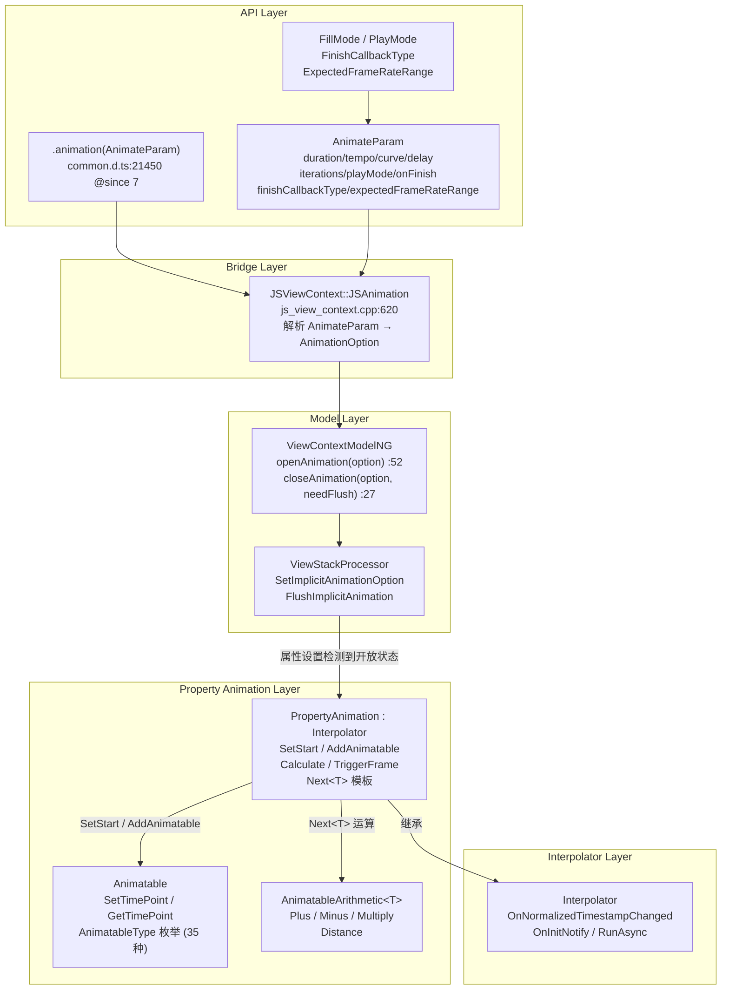
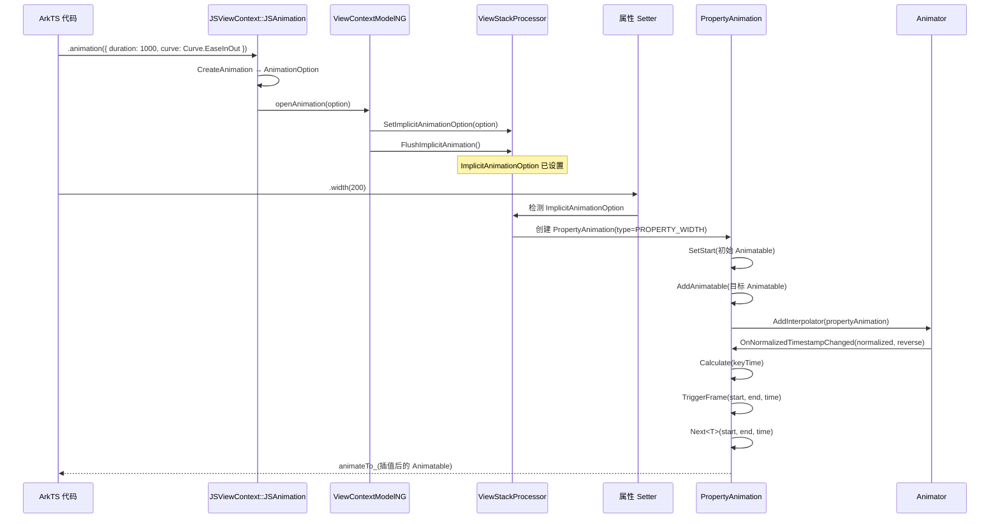
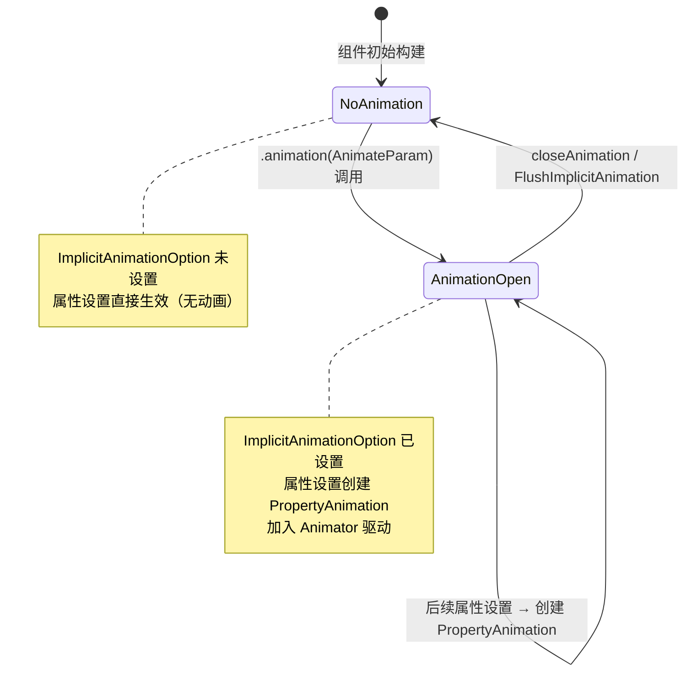

# 架构设计
> 属性动画（Property Animation）的架构设计文档，覆盖 `.animation()` 隐式属性动画属性、PropertyAnimation 插值器、Animatable 属性包装和 AnimatableArithmetic 运算模板。

## 设计元数据

| 字段 | 内容 |
|------|------|
| Design ID | DESIGN-Func-03-02-02 |
| 关联需求 | 已有能力补录（无独立 requirement.md） |
| 关联 Epic | 无 |
| 目标 Feature | Feat-01: 属性动画全量规格（.animation 属性 / PropertyAnimation / Animatable / AnimatableArithmetic） |
| 复杂度 | 标准 |
| 目标版本 | API 7 ~ API 26+ |
| Owner | ArkUI SIG |
| 状态 | Baselined（已有实现补录） |

## 需求基线

> 需求基线详见 proposal.md。以下仅列出设计阶段需要额外强调的要点。

| 项 | 补充说明（如需） |
|----|------------------|
| 隐式动画机制 | `.animation(AnimateParam)` 设置当前 AnimationOption 到 ViewStackProcessor，后续属性设置检测到开放状态后创建 PropertyAnimation 插值器 |
| AnimatableType 枚举 | 定义可动画属性类型（PROPERTY_WIDTH/HEIGHT/BG_COLOR/OPACITY/MARGIN_*/PADDING_*/BORDER_*/FILTER_BLUR/BOX_SHADOW/POSITION_* 等，`animatable.h:27-66`） |
| AnimatableArithmetic | 模板化运算接口，支持自定义类型的 Plus/Minus/Multiply + 距离计算，用于 PropertyAnimation::Next 模板实例化 |

## 上下文和现状

### 涉及仓和模块

| 仓库 | 模块路径 | 当前职责 | 本 Feature 影响 |
|------|----------|----------|-----------------|
| ace_engine | `frameworks/core/animation/property_animation.h/.cpp` | PropertyAnimation：Interpolator 子类，管理 Animatable 列表，Calculate/TriggerFrame 插值计算 | 核心实现，规格补录 |
| ace_engine | `frameworks/core/animation/animatable.h` | Animatable 基类 + AnimatableType 枚举，可动画属性包装 | 规格补录 |
| ace_engine | `frameworks/core/components_ng/animation/animatable_arithmetic.h` | AnimatableArithmetic 模板（委托 `ui/animation/ng/animatable_arithmetic.h`） | 规格补录 |
| ace_engine | `frameworks/core/animation/interpolator.h` | Interpolator 抽象基类，PropertyAnimation 的父类 | 规格补录 |
| ace_engine | `frameworks/core/animation/animation.h` | Animation<T> 模板：Interpolator + ValueListenable<T> | 规格补录 |
| ace_engine | `frameworks/core/components_ng/pattern/view_context/view_context_model_ng.cpp` | ViewContextModelNG：openAnimation/closeAnimation 隐式动画管理 | 规格补录 |
| ace_engine | `frameworks/bridge/declarative_frontend/jsview/js_view_context.cpp` | JSAnimation：`.animation()` 属性 JS 绑定入口 | 规格补录 |
| interface/sdk-js | `api/@internal/component/ets/common.d.ts` | `.animation(AnimateParam)` 属性声明（`:21450`，@since 7） | 规格对照 |
| interface/sdk-js | `api/@internal/component/ets/enums.d.ts` | FillMode / PlayMode / FinishCallbackType 枚举 | 规格对照 |

### 调用链层级分析

| 层 | 模块 | 职责 | 修改类型 |
|----|------|------|----------|
| SDK API | `common.d.ts:21450` | `.animation(value: AnimateParam)` 属性声明 | 无修改（规格补录） |
| JS Bridge | `frameworks/bridge/declarative_frontend/jsview/js_view_context.cpp:620` | JSAnimation：解析 AnimateParam，调用 ViewContextModelNG::openAnimation | 无修改（规格补录） |
| Model | `frameworks/core/components_ng/pattern/view_context/view_context_model_ng.cpp:52` | openAnimation：设置 ImplicitAnimationOption 到 ViewStackProcessor | 无修改（规格补录） |
| Model | `frameworks/core/components_ng/pattern/view_context/view_context_model_ng.cpp:27` | closeAnimation：FlushImplicitAnimation，关闭隐式动画范围 | 无修改（规格补录） |
| Property | `frameworks/core/animation/property_animation.h:28` | PropertyAnimation：Interpolator 子类，管理 Animatable 列表 | 无修改（规格补录） |
| Property | `frameworks/core/animation/property_animation.cpp:55` | OnNormalizedTimestampChanged：归一化时间戳 → Calculate → TriggerFrame | 无修改（规格补录） |
| Property | `frameworks/core/animation/property_animation.cpp:81` | Calculate：计算关键时间点的插值 | 无修改（规格补录） |
| Property | `frameworks/core/animation/property_animation.cpp:101` | TriggerFrame：调用 Next<T> 模板执行具体插值运算 | 无修改（规格补录） |
| Animatable | `frameworks/core/animation/animatable.h:68` | Animatable 基类：SetTimePoint/GetTimePoint | 无修改（规格补录） |
| Animatable | `frameworks/core/animation/animatable.h:27` | AnimatableType 枚举：35 种可动画属性类型 | 无修改（规格补录） |
| Arithmetic | `frameworks/core/components_ng/animation/animatable_arithmetic.h` | AnimatableArithmetic 模板：Plus/Minus/Multiply/Distance | 无修改（规格补录） |
| Interpolator | `frameworks/core/animation/interpolator.h:27` | Interpolator 基类：OnNormalizedTimestampChanged/OnInitNotify/RunAsync | 无修改（规格补录） |

### 适用架构规则

| Rule ID | 适用原因 | 设计结论 | 验证方式 |
|---------|----------|----------|----------|
| OH-ARCH-LAYERING | 属性动画涉及 API → Bridge → Model → Property → Interpolator 多层调用 | 调用方向自上而下，Property 不直接访问 Bridge 层 | 代码评审 |
| OH-ARCH-API-LEVEL | `.animation()` @since 7，AnimateParam 字段有 @since 7/9/11/12 等多版本 | 各版本 API 通过 PlatformVersion 条件分支实现兼容 | API 评审 / XTS |

## 不涉及项承接

> proposal.md 已完成 N/A 判定。本节仅对 proposal 中标记为"涉及"且需展开设计的维度给出结论。

| 维度 | 设计结论 |
|------|----------|
| 隐式动画范围 | `.animation()` 在 ViewStackProcessor 上设置 ImplicitAnimationOption，后续同一组件的属性设置检测到此 option 后创建 PropertyAnimation 并附加到 Animator |
| ArkTS 卡片时长限制 | API 26 前卡片动画最长 1000ms，API 26+ 调整为 2000ms（`js_view_context.cpp:637-639`，FORM_MAX_DURATION / DEFAULT_DURATION） |
| 异步动画 | Rosen 后端启用时 option.SetAllowRunningAsynchronously(true)（`js_view_context.cpp:682-684`） |

## 关键设计决策

| 决策 ID | 问题 | 推荐方案 | 探索过的替代方案 | 取舍理由 | 影响 |
|---------|------|----------|-----------------|----------|------|
| ADR-1 | 属性动画如何与属性设置关联 | 隐式动画机制：`.animation()` 设置 ImplicitAnimationOption，后续属性 setter 检测到开放状态后创建 PropertyAnimation | 显式注册每个属性的动画 | 隐式机制让开发者只需在属性设置前声明 `.animation()`，大幅简化 API | AC-1.1, AC-1.2 |
| ADR-2 | 可动画属性如何统一管理 | AnimatableType 枚举（35 种属性类型）+ Animatable 基类包装 | 每种属性独立实现动画接口 | 统一枚举便于遍历和管理，Animatable 基类提供 SetTimePoint/GetTimePoint 统一接口 | AC-2.1 |
| ADR-3 | 插值运算如何支持多种类型 | PropertyAnimation::Next<T> 模板 + AnimatableArithmetic 运算模板（Plus/Minus/Multiply/Distance） | 为每种类型单独实现计算逻辑 | 模板化实现复用度高，新类型只需实现 AnimatableArithmetic 特化 | AC-3.1, AC-3.2 |
| ADR-4 | `.animation()` 在首次构建时是否生成动画 | 不生成（`js_view_context.cpp:628-631` CheckTopNodeFirstBuilding 返回 true 时跳过） | 首次也生成动画 | 首次构建时属性是初始值，无动画意义，跳过避免无谓动画 | AC-1.4 |
| ADR-5 | 卡片动画时长限制如何处理 | API 26 前限 1000ms，API 26+ 限 2000ms，超限时截断 | 统一限制 | 不同 API 版本限制不同，通过 PlatformVersion 条件判断 | AC-5.1, AC-5.2 |

## 设计骨架

### 骨架范围

| 骨架项 | 目标 | 不包含 | 验证方式 |
|--------|------|--------|----------|
| .animation 隐式动画 | 设置 AnimationOption → 后续属性创建 PropertyAnimation | 显式动画（animateTo） | UT |
| PropertyAnimation 插值 | SetStart/AddAnimatable/Calculate/TriggerFrame 完整链路 | 自定义 Interpolator 子类 | UT |
| Animatable 属性包装 | AnimatableType 枚举 + Animatable 基类 SetTimePoint/GetTimePoint | 具体 Animatable 子类 | UT |
| AnimatableArithmetic 模板 | Plus/Minus/Multiply/Distance 运算接口 | 具体类型特化 | UT |
| AnimateParam 参数 | duration/tempo/curve/delay/iterations/playMode/onFinish/finishCallbackType/expectedFrameRateRange | animateTo 专用参数 | UT |

### 骨架 Spec 拆分

| Task ID | 目标 | 受影响文件 | AC |
|---------|------|-----------|-----|
| TASK-SKELETON-1 | 属性动画全量规格补录（.animation / PropertyAnimation / Animatable / AnimatableArithmetic） | Feat-01-property-animation-spec.md | AC-1.1 ~ AC-6.3 |

## 后续 Task 拆分

| Task ID | 目标 | 受影响文件 | 依赖 |
|---------|------|-----------|------|
| TASK-PROP-ANIM-01 | 属性动画全量规格补录 | Feat-01-property-animation-spec.md, design.md | 无 |

## API 签名、Kit 与权限

### 新增 API

| API 签名 | 类型 | d.ts 位置 | 权限要求 | SysCap |
|----------|------|-----------|----------|--------|
| `.animation(value: AnimateParam): T` | Public | `@internal/component/ets/common.d.ts:21450` | 无 | SystemCapability.ArkUI.ArkUI.Full |
| `interface AnimateParam` | Public | `@internal/component/ets/common.d.ts:4301` | 无 | 同上 |
| `enum FillMode { None, Forwards, Backwards, Both }` | Public | `@internal/component/ets/enums.d.ts:1149` | 无 | 同上 |
| `enum PlayMode { Normal, Reverse, Alternate, AlternateReverse }` | Public | `@internal/component/ets/enums.d.ts:1215` | 无 | 同上 |
| `enum FinishCallbackType { REMOVED=0, LOGICALLY=1 }` | Public | `@internal/component/ets/common.d.ts:4216` | 无 | 同上 |
| `interface ExpectedFrameRateRange { min, max, expected }` | Public | `@internal/component/ets/common.d.ts:2635` | 无 | 同上 |

### 变更/废弃 API

| 原有 API | 变更类型 | 新 API | 迁移说明 |
|----------|----------|--------|----------|
| 无 | — | — | — |

## 构建系统影响

### BUILD.gn 变更

属性动画为 ace_engine 核心模块，无独立 BUILD.gn 变更：

```
# frameworks/core/animation/BUILD.gn
# 包含 property_animation.cpp, animatable 相关代码
```

### bundle.json 变更

属性动画作为 ace_engine 的内部 component，无独立 bundle.json 变更。

## 可选设计扩展

### 架构图



### 数据流/控制流

| 步骤 | 调用方 | 被调用方 | 数据/接口 | 说明 |
|------|--------|----------|-----------|------|
| 1 | ArkTS 代码 | JSAnimation | `.animation(AnimateParam)` | 设置动画属性 |
| 2 | JSAnimation | CreateAnimation | AnimateParam → AnimationOption | 解析参数 |
| 3 | JSAnimation | ViewContextModelNG::openAnimation | AnimationOption | 开启隐式动画 |
| 4 | openAnimation | ViewStackProcessor::SetImplicitAnimationOption | option | 存储 ImplicitAnimationOption |
| 5 | openAnimation | PipelineContext::OpenFrontendAnimation | option, curve, onFinish | 开启前端动画 |
| 6 | 后续属性 setter | ViewStackProcessor | 检测 ImplicitAnimationOption | 属性设置时检测到动画开放 |
| 7 | 属性 setter | PropertyAnimation | SetStart(init) / AddAnimatable(target) | 创建插值器 |
| 8 | PropertyAnimation | Animator | AddInterpolator | 加入 Animator 驱动 |
| 9 | Animator 帧回调 | PropertyAnimation::OnNormalizedTimestampChanged | normalized, reverse | 归一化时间戳 |
| 10 | OnNormalizedTimestampChanged | Calculate(keyTime) | 计算插值 | 关键时间点 |
| 11 | Calculate | TriggerFrame(start, end, time) | 触发帧 | 调用 Next<T> |
| 12 | TriggerFrame | Next<T> | AnimatableArithmetic 运算 | 执行插值运算 |
| 13 | Next<T> | animateTo_ 回调 | RefPtr<Animatable> | 属性更新回调 |

### 时序设计



### 数据模型设计

**API 层类型 (TypeScript)**:

```typescript
// AnimateParam (@since 7, common.d.ts:4301)
interface AnimateParam {
  duration?: number;           // ms, default 1000, [0, +∞)
  tempo?: number;              // 速度倍率, default 1.0, [0, +∞)
  curve?: Curve | string | ICurve;  // default Curve.EaseInOut
  delay?: number;              // ms, default 0, (-∞, +∞)
  iterations?: number;         // default 1, [-1, +∞)
  playMode?: PlayMode;         // default PlayMode.Normal
  onFinish?: () => void;        // 完成回调
  finishCallbackType?: FinishCallbackType;  // @since 11, default REMOVED
  expectedFrameRateRange?: ExpectedFrameRateRange;  // @since 11
}

// FillMode (@since 7, enums.d.ts:1149)
enum FillMode { None = 0, Forwards = 1, Backwards = 2, Both = 3 }

// PlayMode (@since 7, enums.d.ts:1215)
enum PlayMode { Normal, Reverse, Alternate, AlternateReverse }

// FinishCallbackType (@since 11, common.d.ts:4216)
enum FinishCallbackType { REMOVED = 0, LOGICALLY = 1 }

// ExpectedFrameRateRange (@since 11, common.d.ts:2635)
interface ExpectedFrameRateRange { min: number; max: number; expected: number }
```

**框架层结构 (C++)**:

```cpp
// PropertyAnimation 关键字段 (property_animation.h:66-69)
AnimatableType type_;                              // 属性类型枚举
std::list<RefPtr<Animatable>> animatables_;        // 目标 Animatable 列表
PropCallback animateTo_ = nullptr;                 // 属性更新回调
RefPtr<Animatable> init_;                           // 初始值

// Animatable 关键方法 (animatable.h:68-80)
void SetTimePoint(float timePoint)  // timePoint ∈ [0.0, 1.0]
float GetTimePoint() const

// AnimatableType 枚举 (animatable.h:27-66)
// 35 种属性: PROPERTY_WIDTH, PROPERTY_HEIGHT, PROPERTY_BG_COLOR,
// PROPERTY_OPACITY, PROPERTY_MARGIN_*, PROPERTY_PADDING_*,
// PROPERTY_BORDER_*, PROPERTY_FILTER_BLUR, PROPERTY_BOX_SHADOW,
// PROPERTY_POSITION_* 等

// PropAnimationMap (property_animation.h:72)
using PropAnimationMap = std::map<AnimatableType, RefPtr<PropertyAnimation>>;
```

### 算法与状态机



### 测试性设计

| 测试层级 | 测试目标 | Mock 策略 | 验证方式 |
|----------|----------|-----------|----------|
| UT - JSAnimation | .animation() 参数解析 | MockViewStackProcessor | gtest_filter |
| UT - PropertyAnimation | SetStart/AddAnimatable/Calculate/TriggerFrame | MockAnimatable | gtest_filter |
| UT - Animatable | SetTimePoint/GetTimePoint 边界 | 直接构造 | gtest_filter |
| UT - AnimatableArithmetic | Plus/Minus/Multiply/Distance 运算 | 直接构造模板特化 | gtest_filter |
| UT - Model | openAnimation/closeAnimation 隐式动画管理 | MockPipelineContext | gtest_filter |

### 接口参数规约

| 接口 | 参数 | 类型 | 合法范围 | 非法处理 | 边界说明 |
|------|------|------|----------|----------|----------|
| .animation(value) | duration | number | [0, +∞) | 负数截断为 0 | 浮点向下取整 |
| .animation(value) | tempo | number | [0, +∞) | 负数截断为 0 | 0 表示无动画 |
| .animation(value) | curve | Curve\|string\|ICurve | 有效曲线 | 字符串无效回退 EaseInOut | @since 9 支持 ICurve |
| .animation(value) | delay | number | (-∞, +∞) | — | 负数提前播放 |
| .animation(value) | iterations | number | [-1, +∞) | 浮点向下取整 | -1=无限, 0=无动画 |
| .animation(value) | playMode | PlayMode | Normal/Reverse/Alternate/AlternateReverse | 默认 Normal | — |
| .animation(value) | finishCallbackType | FinishCallbackType | REMOVED/LOGICALLY | 默认 REMOVED | @since 11 |
| .animation(value) | expectedFrameRateRange | ExpectedFrameRateRange | min ≤ expected ≤ max | expected=0 使用应用帧率 | @since 11 |

## 详细设计

### `.animation()` 隐式动画机制

`.animation(AnimateParam)` 是属性动画的核心入口（`common.d.ts:21450`，@since 7）。

**执行流程**:

1. **JS Bridge 解析**（`js_view_context.cpp:620`）:
   - 检查 `ViewStackModel::GetInstance()->CheckTopNodeFirstBuilding()`，若首次构建则跳过（`:628-631`）。
   - 解析 AnimateParam 为 AnimationOption（通过 `CreateAnimation()`）。
   - 处理 onFinish 回调（`:653-669`）。
   - 卡片动画时长限制检查（`:637-679`）。
   - Rosen 后端启用异步动画（`:682-684`）。

2. **Model 层开启**（`view_context_model_ng.cpp:52`）:
   - `ViewStackProcessor::SetImplicitAnimationOption(option)` 存储到 ViewStackProcessor（`:54`）。
   - `ViewStackProcessor::FlushImplicitAnimation()` 刷新隐式动画（`:55`）。
   - `PipelineContext::OpenFrontendAnimation(option, curve, onFinish)` 开启前端动画（`:62`）。

3. **属性设置触发**:
   - 后续属性 setter 检测到 ViewStackProcessor 上的 ImplicitAnimationOption。
   - 创建 `PropertyAnimation(type)`，调用 `SetStart(init)` 和 `AddAnimatable(target)`。
   - 将 PropertyAnimation 加入 Animator 的 Interpolator 列表。

4. **关闭动画**（`view_context_model_ng.cpp:27`）:
   - `ViewStackProcessor::SetImplicitAnimationOption(option)` 更新或清除。
   - `FlushImplicitAnimation()` 刷新并关闭隐式动画范围。
   - `PipelineContext::CloseFrontendAnimation()` 关闭前端动画（`:46`）。

### PropertyAnimation 插值器

PropertyAnimation 继承 Interpolator（`property_animation.h:28`），管理 Animatable 列表：

- **SetStart(animatable)**（`property_animation.cpp:27`）: 设置初始 Animatable 值。
- **AddAnimatable(animatable)**（`:36`）: 添加目标 Animatable 到列表。
- **SetCurve(curve)**（`:44`）: 设置插值曲线。
- **OnNormalizedTimestampChanged(normalized, reverse)**（`:55`）: 接收归一化时间戳（0.0~1.0），调用 Calculate。
- **OnInitNotify(normalizedTime, reverse)**（`:64`）: 初始化通知。
- **Calculate(keyTime)**（`:81`）: 计算关键时间点的插值，调用 TriggerFrame。
- **TriggerFrame(start, end, time)**（`:101`）: 调用 `Next<T>(start, end, time)` 执行具体插值运算。
- **Next<T>(start, end, time)**（`:172`）: 模板方法，使用 AnimatableArithmetic 的 Plus/Minus/Multiply 运算计算 `start + (end - start) * curve(time)`。

### Animatable 与 AnimatableType

**Animatable 基类**（`animatable.h:68`）:
- `SetTimePoint(float timePoint)`: 设置时间点，clamp 到 [0.0, 1.0]（`:72-74`）。
- `GetTimePoint() const`: 返回当前时间点（`:77-79`）。

**AnimatableType 枚举**（`animatable.h:27-66`）: 35 种可动画属性类型：
- 尺寸: PROPERTY_WIDTH, PROPERTY_HEIGHT
- 背景: PROPERTY_BG_COLOR, PROPERTY_OPACITY
- 外边距: PROPERTY_MARGIN_LEFT/TOP/RIGHT/BOTTOM
- 内边距: PROPERTY_PADDING_LEFT/TOP/RIGHT/BOTTOM
- 背景: PROPERTY_BACKGROUND_POSITION, PROPERTY_BACKGROUND_SIZE
- 边框: PROPERTY_BORDER_LEFT/TOP/RIGHT/BOTTOM_WIDTH/COLOR/STYLE
- 圆角: PROPERTY_BORDER_TOP_LEFT/TOP_RIGHT/BOTTOM_LEFT/BOTTOM_RIGHT_RADIUS
- 滤镜: PROPERTY_FILTER_BLUR, PROPERTY_BACKDROP_FILTER_BLUR, PROPERTY_WINDOW_FILTER_BLUR
| 阴影: PROPERTY_BOX_SHADOW
| 位置: PROPERTY_POSITION_LEFT/TOP/RIGHT/BOTTOM

### AnimatableArithmetic 运算模板

AnimatableArithmetic（`animatable_arithmetic.h` → `ui/animation/ng/animatable_arithmetic.h`）提供模板化运算接口：

- `Plus(other)`: 加法运算
- `Minus(other)`: 减法运算
- `Multiply(scale)`: 乘法运算
- `Distance(other)`: 距离计算

PropertyAnimation::Next<T> 使用这些运算计算插值：
```
result = start.Plus(end.Minus(start).Multiply(curve(time)))
```

CustomAnimatableArithmetic 允许开发者自定义类型的插值运算。

## 风险和开放问题

| 项 | 类型 | 影响 | 处理方式 | Owner |
|----|------|------|----------|-------|
| 首次构建跳过动画可能导致属性初始设置无动画 | 行为 | 低 | 文档说明首次构建不生成动画的设计意图 | ArkUI SIG |
| 卡片动画时长限制在不同 API 版本不同 | 兼容性 | 中 | 通过 PlatformVersion 条件分支处理 | ArkUI SIG |
| AnimatableArithmetic 自定义类型支持范围有限 | API | 低 | 文档说明支持的类型和自定义方式 | ArkUI SIG |

## 设计审批

- [x] 需求基线已确认，设计覆盖 P0/P1 AC
- [x] 不涉及项已承接，N/A 和展开项都有结论
- [x] 涉及仓和模块职责清楚
- [x] 调用链层级分析完整，每层覆盖到位
- [x] 适用架构规则已识别并形成设计结论
- [x] 分层和子系统边界合规
- [x] API 变更有签名、权限、错误码和兼容性说明
- [x] BUILD.gn/bundle.json 影响明确
- [x] 设计输出和后续 Task 拆分明确
- [x] 关键设计决策有理由和影响说明
- [x] 风险和开放问题有 Owner

**结论:** 通过（已有实现补录）
