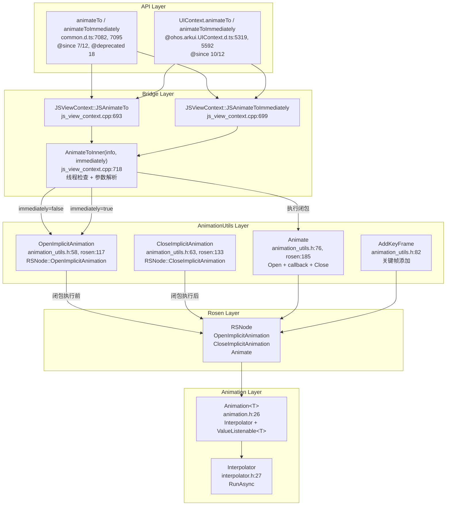
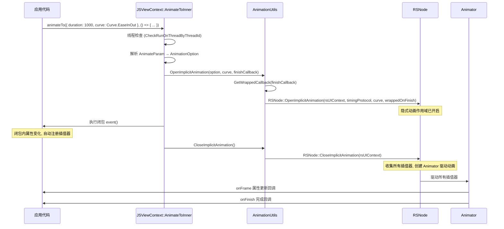
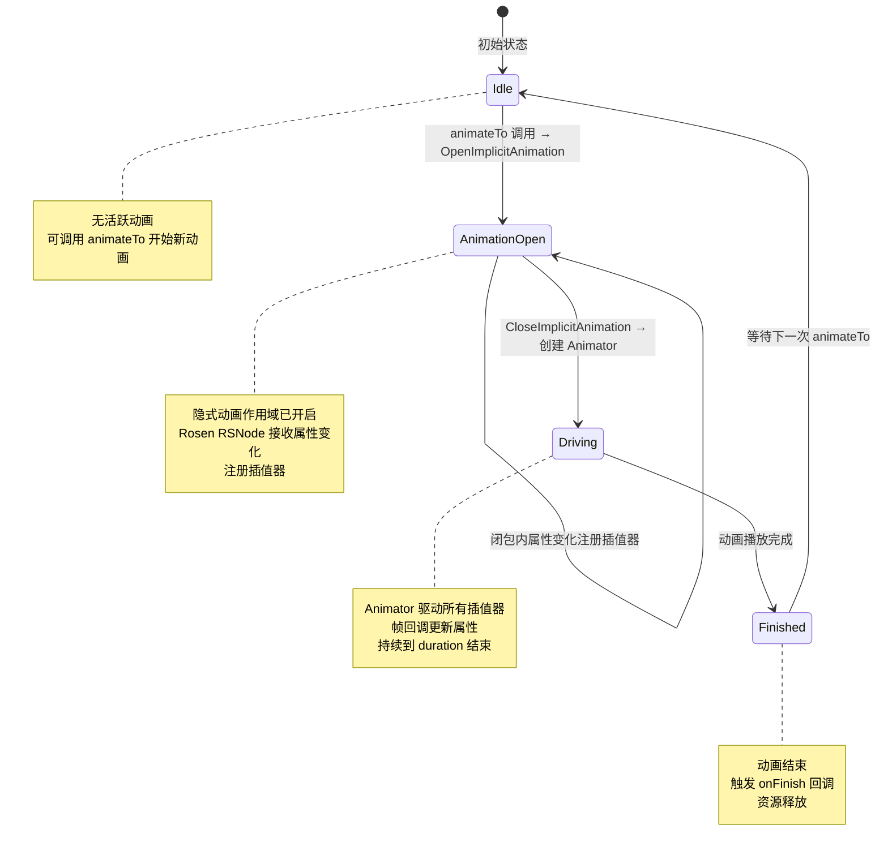

# 架构设计
> 显式动画（Explicit Animation）的架构设计文档，覆盖 `animateTo`/`animateToImmediately` 显式动画函数、AnimationUtils 隐式动画作用域管理、Animation<T> 模板和关键帧动画。

## 设计元数据

| 字段 | 内容 |
|------|------|
| Design ID | DESIGN-Func-03-02-03 |
| 关联需求 | 已有能力补录（无独立 requirement.md） |
| 关联 Epic | 无 |
| 目标 Feature | Feat-01: 显式动画全量规格（animateTo / animateToImmediately / AnimationUtils / Animation<T> / AddKeyFrame） |
| 复杂度 | 标准 |
| 目标版本 | API 7 ~ API 26+ |
| Owner | ArkUI SIG |
| 状态 | Baselined（已有实现补录） |

## 需求基线

> 需求基线详见 proposal.md。以下仅列出设计阶段需要额外强调的要点。

| 项 | 补充说明（如需） |
|----|------------------|
| 闭包动画机制 | animateTo(AnimateParam, event) 在闭包执行前 OpenImplicitAnimation，闭包内属性变化注册插值器，闭包后 CloseImplicitAnimation 创建 Animator 驱动所有插值器 |
| UIContext 迁移 | 全局 animateTo @deprecated since 18，推荐 UIContext.animateTo（`@ohos.arkui.UIContext.d.ts:5319`，@since 10） |
| animateToImmediately | 立即执行动画（不等 vsync 对齐），用于需要即时反馈的场景（`common.d.ts:7095`，@since 12） |

## 上下文和现状

### 涉及仓和模块

| 仓库 | 模块路径 | 当前职责 | 本 Feature 影响 |
|------|----------|----------|-----------------|
| ace_engine | `frameworks/core/components_ng/render/animation_utils.h` | AnimationUtils：OpenImplicitAnimation/CloseImplicitAnimation/Animate/AddKeyFrame 静态接口 | 核心实现，规格补录 |
| ace_engine | `frameworks/core/components_ng/render/adapter/rosen_animation_utils.cpp` | AnimationUtils 实现：委托 Rosen RSNode 隐式动画管理 | 规格补录 |
| ace_engine | `frameworks/core/animation/animation.h` | Animation<T> 模板：Interpolator + ValueListenable<T> | 规格补录 |
| ace_engine | `frameworks/core/animation/interpolator.h` | Interpolator 基类：RunAsync 异步路径 | 规格补录 |
| ace_engine | `frameworks/bridge/declarative_frontend/jsview/js_view_context.cpp` | JSAnimateTo/JSAnimateToImmediately：JS 绑定入口（`:693`，`:699`） | 规格补录 |
| interface/sdk-js | `api/@internal/component/ets/common.d.ts` | animateTo / animateToImmediately 声明（`:7082`，`:7095`） | 规格对照 |
| interface/sdk-js | `api/@ohos.arkui.UIContext.d.ts` | UIContext.animateTo / animateToImmediately（`:5319`，`:5592`） | 规格对照 |

### 调用链层级分析

| 层 | 模块 | 职责 | 修改类型 |
|----|------|------|----------|
| SDK API | `common.d.ts:7082` | `animateTo(value: AnimateParam, event: () => void): void` 声明 | 无修改（规格补录） |
| SDK API | `common.d.ts:7095` | `animateToImmediately(value: AnimateParam, event: () => void): void` 声明 | 无修改（规格补录） |
| SDK API | `@ohos.arkui.UIContext.d.ts:5319` | `UIContext.animateTo(value, event)` 声明 | 无修改（规格补录） |
| SDK API | `@ohos.arkui.UIContext.d.ts:5592` | `UIContext.animateToImmediately(param, processor)` 声明 | 无修改（规格补录） |
| JS Bridge | `js_view_context.cpp:693` | JSAnimateTo：调用 AnimateToInner(info, false) | 无修改（规格补录） |
| JS Bridge | `js_view_context.cpp:699` | JSAnimateToImmediately：调用 AnimateToInner(info, true) | 无修改（规格补录） |
| JS Bridge | `js_view_context.cpp:718` | AnimateToInner：解析 AnimateParam，执行闭包，管理隐式动画作用域 | 无修改（规格补录） |
| AnimationUtils | `animation_utils.h:58-61` | OpenImplicitAnimation：开启隐式动画作用域 | 无修改（规格补录） |
| AnimationUtils | `animation_utils.h:63-64` | CloseImplicitAnimation：关闭隐式动画作用域 | 无修改（规格补录） |
| AnimationUtils | `animation_utils.h:76-80` | Animate：Open + callback + Close 一体化 | 无修改（规格补录） |
| AnimationUtils | `animation_utils.h:82-87` | AddKeyFrame：添加关键帧 | 无修改（规格补录） |
| AnimationUtils Impl | `rosen_animation_utils.cpp:117-131` | OpenImplicitAnimation 实现：委托 RSNode::OpenImplicitAnimation | 无修改（规格补录） |
| AnimationUtils Impl | `rosen_animation_utils.cpp:133-148` | CloseImplicitAnimation 实现：委托 RSNode::CloseImplicitAnimation | 无修改（规格补录） |
| AnimationUtils Impl | `rosen_animation_utils.cpp:185-205` | Animate 实现：委托 RSNode::Animate | 无修改（规格补录） |
| Animation<T> | `frameworks/core/animation/animation.h:26` | Animation<T> 模板：Interpolator + ValueListenable<T> | 无修改（规格补录） |
| Interpolator | `frameworks/core/animation/interpolator.h:27` | Interpolator 基类：RunAsync 异步路径 | 无修改（规格补录） |

### 适用架构规则

| Rule ID | 适用原因 | 设计结论 | 验证方式 |
|---------|----------|----------|----------|
| OH-ARCH-LAYERING | 显式动画涉及 API → Bridge → AnimationUtils → RSNode 多层调用 | 调用方向自上而下，AnimationUtils 不直接访问 Bridge 层 | 代码评审 |
| OH-ARCH-API-LEVEL | animateTo @since 7 @deprecated 18, animateToImmediately @since 12, UIContext 版本 @since 10 | 各版本 API 通过 PlatformVersion 条件分支实现兼容 | API 评审 / XTS |
| OH-ARCH-SUBSYSTEM | AnimationUtils 委托 Rosen RSNode 进行隐式动画管理 | 跨子系统调用（ace_engine → graphic_2d），通过 RSNode 接口隔离 | 依赖检查 |

## 不涉及项承接

> proposal.md 已完成 N/A 判定。本节仅对 proposal 中标记为"涉及"且需展开设计的维度给出结论。

| 维度 | 设计结论 |
|------|----------|
| UIContext 关联 | 全局 animateTo @deprecated since 18，推荐 UIContext.animateTo 确保在正确 UI 实例执行 |
| 线程检查 | AnimateToInner 检查是否运行在正确线程（`js_view_context.cpp:720-733`），非正确线程时尝试 localContainerId 回退 |
| 异步动画 | Rosen 后端启用时 option.SetAllowRunningAsynchronously(true) |

## 关键设计决策

| 决策 ID | 问题 | 推荐方案 | 探索过的替代方案 | 取舍理由 | 影响 |
|---------|------|----------|-----------------|----------|------|
| ADR-1 | 显式动画如何捕获闭包内属性变化 | Open-Close 作用域模式：OpenImplicitAnimation → 执行闭包 → CloseImplicitAnimation | 逐属性注册 | 闭包内任意属性变化自动注册插值器，开发者无需手动管理 | AC-1.1, AC-1.2 |
| ADR-2 | animateTo 与 animateToImmediately 的差异 | animateTo 等待 vsync 对齐后开始，animateToImmediately 立即执行 | 统一为 animateTo | 某些场景需要立即视觉反馈（如手势结束），不能等 vsync | AC-2.1, AC-2.2 |
| ADR-3 | 全局 animateTo 废弃后的替代方案 | UIContext.animateTo（@since 10），@deprecated since 18 标注 | 保留全局函数 | UIContext 关联确保在正确 UI 实例执行，避免多实例混淆 | AC-5.1 |
| ADR-4 | 隐式动画作用域如何委托到 Rosen | AnimationUtils 静态方法委托 RSNode::OpenImplicitAnimation/CloseImplicitAnimation/Animate | 直接调用 RSNode | 静态封装层提供 PipelineContext 传递和回调包装 | AC-3.1, AC-3.2 |
| ADR-5 | 关键帧动画如何实现 | AddKeyFrame(fraction, curve, callback) 按分数添加关键帧 | 闭包内顺序设置属性 | 关键帧允许精确控制每个时间点的属性状态和曲线 | AC-4.1, AC-4.2 |

## 设计骨架

### 骨架范围

| 骨架项 | 目标 | 不包含 | 验证方式 |
|--------|------|--------|----------|
| animateTo 闭包动画 | Open-Close 作用域模式，闭包内属性变化注册插值器 | .animation 属性动画 | UT |
| animateToImmediately | 立即执行动画（不等 vsync） | — | UT |
| AnimationUtils | OpenImplicitAnimation/CloseImplicitAnimation/Animate/AddKeyFrame | — | UT |
| Animation<T> 模板 | Interpolator + ValueListenable<T> 组合 | 具体子类实现 | UT |
| UIContext 迁移 | UIContext.animateTo/animateToImmediately | — | UT + XTS |

### 骨架 Spec 拆分

| Task ID | 目标 | 受影响文件 | AC |
|---------|------|-----------|-----|
| TASK-SKELETON-1 | 显式动画全量规格补录（animateTo / animateToImmediately / AnimationUtils / Animation<T> / AddKeyFrame） | Feat-01-explicit-animation-spec.md | AC-1.1 ~ AC-6.3 |

## 后续 Task 拆分

| Task ID | 目标 | 受影响文件 | 依赖 |
|---------|------|-----------|------|
| TASK-EXPL-ANIM-01 | 显式动画全量规格补录 | Feat-01-explicit-animation-spec.md, design.md | 无 |

## API 签名、Kit 与权限

### 新增 API

| API 签名 | 类型 | d.ts 位置 | 权限要求 | SysCap |
|----------|------|-----------|----------|--------|
| `animateTo(value: AnimateParam, event: () => void): void` | Public | `@internal/component/ets/common.d.ts:7082` | 无 | SystemCapability.ArkUI.ArkUI.Full |
| `animateToImmediately(value: AnimateParam, event: () => void): void` | Public | `@internal/component/ets/common.d.ts:7095` | 无 | 同上 |
| `UIContext.animateTo(value: AnimateParam, event: () => void): void` | Public | `@ohos.arkui.UIContext.d.ts:5319` | 无 | 同上 |
| `UIContext.animateToImmediately(param: AnimateParam, processor: Callback<void>): void` | Public | `@ohos.arkui.UIContext.d.ts:5592` | 无 | 同上 |

### 变更/废弃 API

| 原有 API | 变更类型 | 新 API | 迁移说明 |
|----------|----------|--------|----------|
| `animateTo(value, event)` (全局) | MODIFIED（废弃） | `UIContext.animateTo(value, event)` (@since 10) | 使用 UIContext 关联版本 |

## 构建系统影响

### BUILD.gn 变更

显式动画为 ace_engine 核心模块，无独立 BUILD.gn 变更：

```
# frameworks/core/components_ng/render/adapter/BUILD.gn
# 包含 rosen_animation_utils.cpp 实现
```

### bundle.json 变更

显式动画作为 ace_engine 的内部 component，无独立 bundle.json 变更。

## 可选设计扩展

### 架构图



### 数据流/控制流

| 步骤 | 调用方 | 被调用方 | 数据/接口 | 说明 |
|------|--------|----------|-----------|------|
| 1 | 应用代码 | JSAnimateTo | animateTo(value, event) | 全局函数调用 |
| 2 | JSAnimateTo | AnimateToInner | info, immediately=false | 转发到内部实现 |
| 3 | AnimateToInner | Container | CheckRunOnThreadByThreadId | 线程检查 |
| 4 | AnimateToInner | AnimationUtils::OpenImplicitAnimation | option, curve, finishCallback | 开启隐式动画作用域 |
| 5 | OpenImplicitAnimation | RSNode::OpenImplicitAnimation | timingProtocol, curve, wrappedOnFinish | 委托 Rosen |
| 6 | AnimateToInner | event() | 闭包执行 | 闭包内属性变化注册插值器 |
| 7 | AnimateToInner | AnimationUtils::CloseImplicitAnimation | — | 关闭隐式动画作用域 |
| 8 | CloseImplicitAnimation | RSNode::CloseImplicitAnimation | — | 收集所有插值器，创建 Animator |
| 9 | RSNode | Animator | 驱动所有插值器 | Animator 帧回调驱动动画 |

### 时序设计



### 数据模型设计

**API 层类型 (TypeScript)**:

```typescript
// animateTo (@since 7, deprecated 18, common.d.ts:7082)
declare function animateTo(value: AnimateParam, event: () => void): void;

// animateToImmediately (@since 12, common.d.ts:7095)
declare function animateToImmediately(value: AnimateParam, event: () => void): void;

// UIContext.animateTo (@since 10, @ohos.arkui.UIContext.d.ts:5319)
animateTo(value: AnimateParam, event: () => void): void;

// UIContext.animateToImmediately (@since 12, @ohos.arkui.UIContext.d.ts:5592)
animateToImmediately(param: AnimateParam, processor: Callback<void>): void;

// AnimateParam 复用属性动画的接口 (common.d.ts:4301)
interface AnimateParam {
  duration?: number;         // default 1000
  tempo?: number;            // default 1.0
  curve?: Curve | string | ICurve;  // default EaseInOut
  delay?: number;           // default 0
  iterations?: number;       // default 1
  playMode?: PlayMode;       // default Normal
  onFinish?: () => void;
  finishCallbackType?: FinishCallbackType;  // @since 11, default REMOVED
  expectedFrameRateRange?: ExpectedFrameRateRange;  // @since 11
}
```

**框架层结构 (C++)**:

```cpp
// AnimationUtils 关键方法 (animation_utils.h:51-142)
static void OpenImplicitAnimation(option, curve, finishCallback);
static bool CloseImplicitAnimation();
static void Animate(option, callback, finishCallback, repeatCallback);
static void AddKeyFrame(fraction, curve, callback);
static void AddDurationKeyFrame(duration, curve, callback);

// Animation<T> 模板 (animation.h:26)
template<typename T>
class Animation : public Interpolator, public ValueListenable<T> {
    virtual const T& GetValue() const = 0;
    void OnInitNotify(float normalizedTime, bool reverse) override;
    void SetInitValue(const T& initValue);
    virtual void SetCurve(const RefPtr<Curve>& curve) {}
};

// Interpolator (interpolator.h:27)
class Interpolator : public TimeEvent {
    virtual void OnNormalizedTimestampChanged(float normalized, bool reverse) = 0;
    virtual void OnInitNotify(float normalizedTime, bool reverse) = 0;
    virtual bool RunAsync(weakScheduler, option, prepareCallback, finishCallback);
};
```

### 算法与状态机



### 测试性设计

| 测试层级 | 测试目标 | Mock 策略 | 验证方式 |
|----------|----------|-----------|----------|
| UT - AnimateToInner | 参数解析、线程检查、闭包执行 | MockRSNode, MockPipelineContext | gtest_filter |
| UT - AnimationUtils | OpenImplicitAnimation/CloseImplicitAnimation/Animate | MockRSNode | gtest_filter |
| UT - AddKeyFrame | 关键帧添加和执行 | MockRSNode | gtest_filter |
| UT - Animation<T> | GetValue/OnInitNotify/SetInitValue | 直接构造模板特化 | gtest_filter |
| 手工 | animateTo 视觉验证 | 真机 | 视觉比对 |

### 接口参数规约

| 接口 | 参数 | 类型 | 合法范围 | 非法处理 | 边界说明 |
|------|------|------|----------|----------|----------|
| animateTo(value, event) | value | AnimateParam | 有效对象 | — | 复用属性动画参数 |
| animateTo(value, event) | event | () => void | 闭包函数 | — | 闭包内属性变化触发动画 |
| animateToImmediately(value, event) | value | AnimateParam | 有效对象 | — | 同 animateTo |
| UIContext.animateTo(value, event) | value | AnimateParam | 有效对象 | — | @since 10 |
| AddKeyFrame(fraction, curve, callback) | fraction | float | [0.0, 1.0] | — | 关键帧时间点 |
| AddKeyFrame(fraction, curve, callback) | curve | RefPtr<Curve> | 有效曲线 | — | 插值曲线 |
| AddDurationKeyFrame(duration, curve, callback) | duration | int32_t | ≥ 0 | — | 关键帧时长(ms) |

## 详细设计

### animateTo 闭包动画机制

`animateTo(value: AnimateParam, event: () => void)` 是显式动画的核心入口（`common.d.ts:7082`，@since 7，@deprecated since 18）。

**执行流程**（`js_view_context.cpp:718` AnimateToInner）:

1. **线程检查**（`:720-733`）:
   - `Container::CheckRunOnThreadByThreadId(currentId, false)` 检查是否在正确线程。
   - 若不在正确线程，尝试 `localContainerId` 回退。
   - 若回退也失败，设置 `needCheck = true`。

2. **参数校验**（`:744-747`）:
   - `info.Length() < 2` 则直接返回。
   - `info[0]` 非对象则返回。

3. **AnimationOption 解析**:
   - 从 JS 对象解析 AnimateParam 为 AnimationOption。
   - 处理 onFinish 回调（`:376`）。

4. **开启隐式动画**:
   - `immediately = false` 时调用 `AnimationUtils::OpenImplicitAnimation(option, curve, finishCallback, context)`（`rosen_animation_utils.cpp:123`）。
   - `immediately = true` 时同样调用 OpenImplicitAnimation，但后续处理不同。
   - OpenImplicitAnimation 委托 `RSNode::OpenImplicitAnimation(rsUIContext, timingProtocol, curve, wrappedOnFinish)`（`:129`）。

5. **执行闭包**:
   - 调用 `event()` 闭包函数。
   - 闭包内的属性变化自动注册插值器到 RSNode。

6. **关闭隐式动画**:
   - `AnimationUtils::CloseImplicitAnimation(context)`（`rosen_animation_utils.cpp:138`）。
   - 委托 `RSNode::CloseImplicitAnimation(rsUIContext)` 收集所有插值器并创建 Animator。
   - Animator 开始驱动所有插值器。

### animateToImmediately

`animateToImmediately(value: AnimateParam, event: () => void)`（`common.d.ts:7095`，@since 12）：

- 与 `animateTo` 的区别在于 `immediately = true`（`js_view_context.cpp:699`）。
- AnimateToInner 中 `immediately` 参数控制是否立即执行动画。
- 不等待 vsync 对齐，立即开始动画。

### AnimationUtils 静态接口

AnimationUtils（`animation_utils.h:51`）提供显式动画的核心静态方法：

- **OpenImplicitAnimation(option, curve, finishCallback)**（`:58-61`）: 开启隐式动画作用域。委托 `RSNode::OpenImplicitAnimation`（`rosen_animation_utils.cpp:129`）。
- **CloseImplicitAnimation()**（`:63-64`）: 关闭隐式动画作用域，收集插值器创建 Animator。委托 `RSNode::CloseImplicitAnimation`（`rosen_animation_utils.cpp:141`）。
- **Animate(option, callback, finishCallback, repeatCallback)**（`:76-80`）: Open + callback + Close 一体化。委托 `RSNode::Animate`（`rosen_animation_utils.cpp:198`）。
- **AddKeyFrame(fraction, curve, callback)**（`:82-84`）: 按分数添加关键帧。
- **AddDurationKeyFrame(duration, curve, callback)**（`:89-91`）: 按时长添加关键帧。
- **ExecuteWithoutAnimation(callback)**（`:118-119`）: 在无动画作用域中执行回调。
- **StartAnimation(option, callback, finishCallback, repeatCallback)**（`:103-108`）: 启动动画并返回 Animation 对象引用。
- **StopAnimation(animation)**（`:110`）: 停止动画。
- **PauseAnimation(animation)**（`:113`）: 暂停动画。
- **ResumeAnimation(animation)**（`:114`）: 恢复动画。
- **ReverseAnimation(animation)**（`:116`）: 反向动画。
- **CreateInteractiveAnimation(addCallback, callback)**（`:121-122`）: 创建交互式动画。

### Animation<T> 模板

Animation<T>（`animation.h:26`）继承 Interpolator 和 ValueListenable<T>：

- **GetValue() = 0**: 纯虚方法，子类实现返回当前动画值。
- **OnInitNotify(normalizedTime, reverse)**（`:32-40`）: 初始化通知。若设置了 initValue 则通知 initValue，否则调用 OnNormalizedTimestampChanged。
- **SetInitValue(initValue)**（`:42-46`）: 设置初始值。
- **HasInitValue()**（`:48-51`）: 是否设置了初始值。
- **SetCurve(curve)**（`:53`）: 设置曲线（空实现，子类可重写）。

### 关键帧动画

通过 `AddKeyFrame` 在隐式动画作用域内添加关键帧：

```cpp
// 关键帧添加流程
AnimationUtils::OpenImplicitAnimation(option, curve, finishCallback);
AnimationUtils::AddKeyFrame(0.0, curve1, []() { /* 属性设置1 */ });
AnimationUtils::AddKeyFrame(0.5, curve2, []() { /* 属性设置2 */ });
AnimationUtils::AddKeyFrame(1.0, curve3, []() { /* 属性设置3 */ });
AnimationUtils::CloseImplicitAnimation();
```

- `fraction` ∈ [0.0, 1.0]，表示关键帧在动画时长中的位置。
- 每个关键帧可指定独立的曲线。
- `AddDurationKeyFrame(duration, curve, callback)` 按时长（ms）添加关键帧。

## 风险和开放问题

| 项 | 类型 | 影响 | 处理方式 | Owner |
|----|------|------|----------|-------|
| 全局 animateTo 废弃后存量应用兼容 | 兼容性 | 中 | @deprecated since 18 标注但不移除，保留向后兼容 | ArkUI SIG |
| animateTo 在 aboutToAppear 中调用可能不生效 | 行为 | 中 | 文档说明 aboutToAppear 中组件未创建，动画无初始值 | ArkUI SIG |
| Rosen RSNode 隐式动画作用域管理复杂度 | 架构 | 低 | AnimationUtils 封装层提供简洁接口，隐藏 RSNode 细节 | ArkUI SIG |
| State Management V2 与 animateTo 可能产生意外结果 | 兼容性 | 低 | 文档说明 V2 下的限制和注意事项 | ArkUI SIG |

## 设计审批

- [x] 需求基线已确认，设计覆盖 P0/P1 AC
- [x] 不涉及项已承接，N/A 和展开项都有结论
- [x] 涉及仓和模块职责清楚
- [x] 调用链层级分析完整，每层覆盖到位
- [x] 适用架构规则已识别并形成设计结论
- [x] 分层和子系统边界合规
- [x] API 变更有签名、权限、错误码和兼容性说明
- [x] BUILD.gn/bundle.json 影响明确
- [x] 设计输出和后续 Task 拆分明确
- [x] 关键设计决策有理由和影响说明
- [x] 风险和开放问题有 Owner

**结论:** 通过（已有实现补录）
