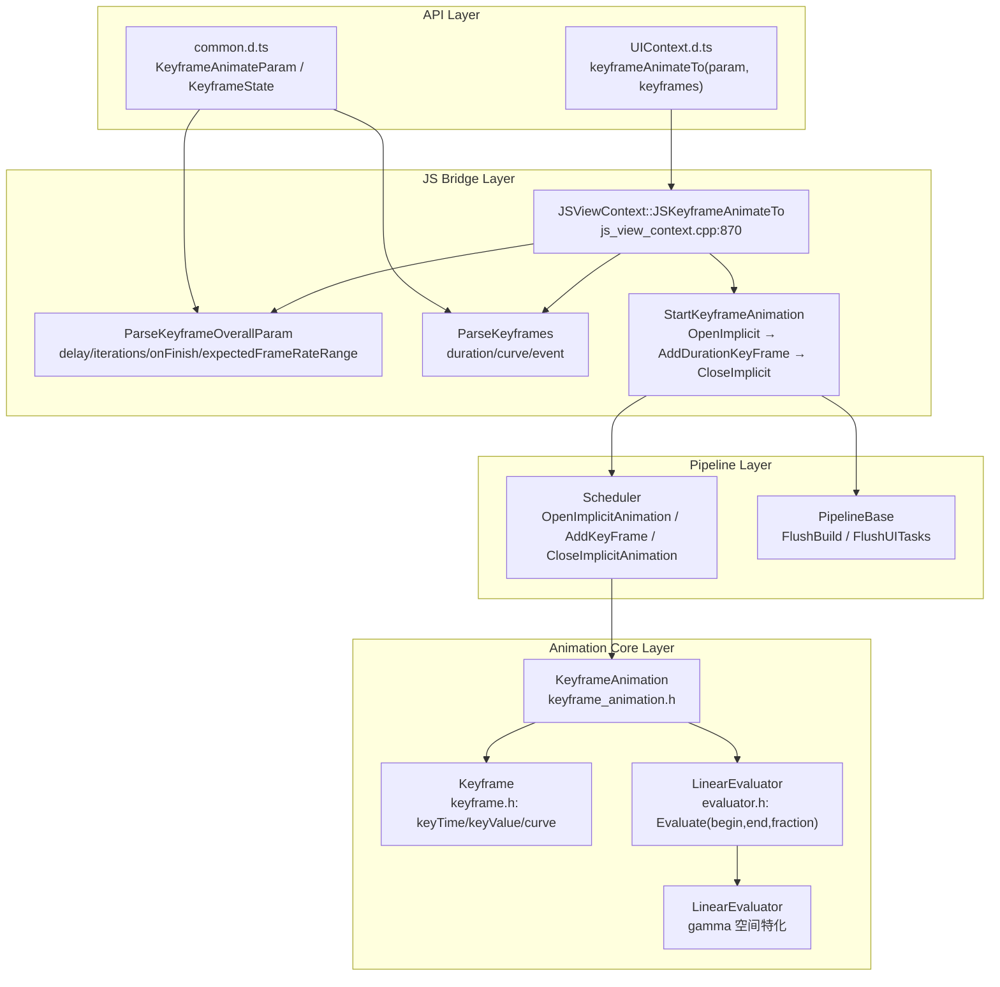
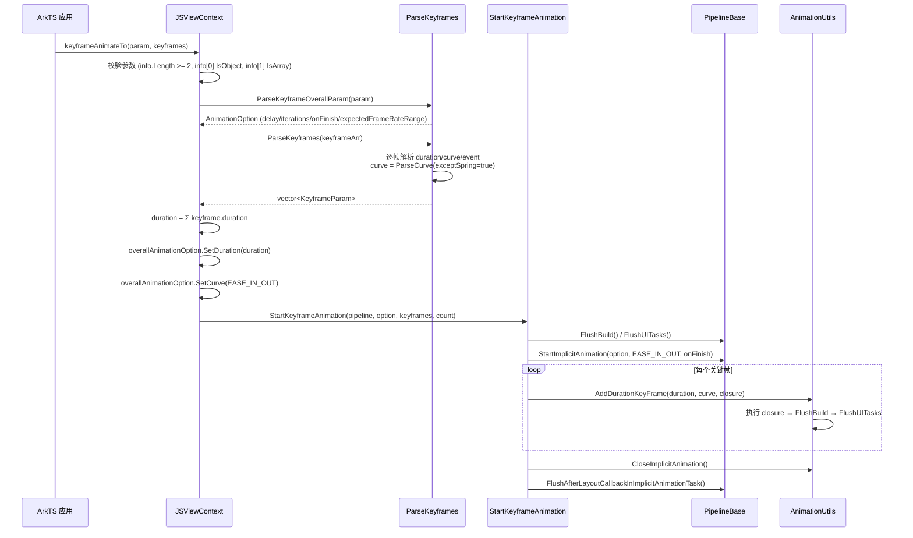
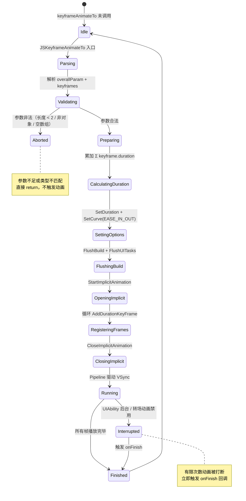

# 架构设计
> 关键帧动画（Keyframe Animation）的架构设计文档，覆盖 keyframeAnimateTo 隐式作用域、关键帧链式组装、逐帧曲线插值和整体 EASE_IN_OUT 强制覆盖。

## 设计元数据

| 字段 | 内容 |
|------|------|
| Design ID | DESIGN-Func-03-02-04 |
| 关联需求 | 已有能力补录（无独立 requirement.md） |
| 关联 Epic | 无 |
| 目标 Feature | Feat-01: 关键帧动画全量规格（keyframeAnimateTo 隐式作用域、KeyframeAnimation 链式组装、逐帧曲线） |
| 复杂度 | 标准 |
| 目标版本 | API 11 ~ API 26+ |
| Owner | ArkUI SIG |
| 状态 | Baselined（已有实现补录） |

## 需求基线

> 需求基线详见 proposal.md。以下仅列出设计阶段需要额外强调的要点。

| 项 | 补充说明（如需） |
|----|------------------|
| 整体曲线强制 EASE_IN_OUT | keyframeAnimateTo 的 overallAnimationOption.curve 被硬编码为 Curves::EASE_IN_OUT（`js_view_context.cpp:911`），用户不可覆盖；实际插值曲线来自每个 KeyframeState.curve |
| 逐帧曲线解析 | ParseKeyframes 调用 `ParseCurve(executionContext, curveArgs, true)`，第三个参数 `exceptSpring=true` 表示 springMotion/responsiveSpringMotion/interpolatingSpring 不被支持（`js_view_context.cpp:430`） |
| 总时长 = 各帧时长之和 | `js_view_context.cpp:906-908` 循环累加 keyframe.duration 赋值给 overallAnimationOption.SetDuration(duration) |
| expectedFrameRateRange | 自 API 19 起新增，通过 ParseKeyframeOverallParam 解析为 FrameRateRange（`js_view_context.cpp:389-398`） |

## 上下文和现状

### 涉及仓和模块

| 仓库 | 模块路径 | 当前职责 | 本 Feature 影响 |
|------|----------|----------|-----------------|
| ace_engine | `frameworks/core/animation/keyframe_animation.h` | KeyframeAnimation<T> 模板类，AddKeyframe/Calculate/RunAsync | 规格补录 |
| ace_engine | `frameworks/core/animation/keyframe.h` | Keyframe<T> 模板类，keyTime/keyValue/curve | 规格补录 |
| ace_engine | `frameworks/core/animation/evaluator.h` | Evaluator<T> / LinearEvaluator<T> 及 Color/Shadow/TransformOperations 特化 | 规格补录 |
| ace_engine | `frameworks/core/animation/curve_animation.h` | CurveAnimation<T>，用于非关键帧的曲线动画对比参考 | 规格补录 |
| ace_engine | `frameworks/bridge/declarative_frontend/jsview/js_view_context.cpp` | JSKeyframeAnimateTo / StartKeyframeAnimation / ParseKeyframeOverallParam / ParseKeyframes | 规格补录 |
| interface/sdk-js | `api/@internal/component/ets/common.d.ts` | KeyframeAnimateParam / KeyframeState 接口声明 | 规格对照 |
| interface/sdk-js | `api/@ohos.arkui.UIContext.d.ts` | UIContext.keyframeAnimateTo 方法声明 | 规格对照 |

### 调用链层级分析

| 层 | 模块 | 职责 | 修改类型 |
|----|------|------|----------|
| SDK API Layer | `interface/sdk-js/api/@ohos.arkui.UIContext.d.ts:5561` | `keyframeAnimateTo(param: KeyframeAnimateParam, keyframes: Array<KeyframeState>): void` | 无修改（规格补录） |
| SDK Type Layer | `interface/sdk-js/api/@internal/component/ets/common.d.ts:29918-30065` | KeyframeAnimateParam（delay/iterations/onFinish/expectedFrameRateRange）+ KeyframeState（duration/curve/event） | 无修改（规格补录） |
| JS Bridge | `frameworks/bridge/declarative_frontend/jsview/js_view_context.cpp:870` | `JSViewContext::JSKeyframeAnimateTo` 入口，校验参数、解析 overallParam 和 keyframes | 无修改（规格补录） |
| JS Bridge (Parser) | `frameworks/bridge/declarative_frontend/jsview/js_view_context.cpp:369-434` | `ParseKeyframeOverallParam` / `ParseKeyframes` 解析 delay/iterations/onFinish/expectedFrameRateRange 和逐帧 duration/curve/event | 无修改（规格补录） |
| JS Bridge (Runner) | `frameworks/bridge/declarative_frontend/jsview/js_view_context.cpp:487-522` | `StartKeyframeAnimation` 打开隐式作用域、循环 AddDurationKeyFrame、关闭隐式作用域 | 无修改（规格补录） |
| Animation Core | `frameworks/core/animation/keyframe_animation.h` | `KeyframeAnimation<T>::RunAsync` 打开隐式动画、逐帧 AddKeyFrame 到 Scheduler | 无修改（规格补录） |
| Animation Core (Data) | `frameworks/core/animation/keyframe.h` | `Keyframe<T>` 持有 normalized keyTime [0,1]、keyValue、curve | 无修改（规格补录） |
| Animation Core (Eval) | `frameworks/core/animation/evaluator.h` | `LinearEvaluator<T>::Evaluate(begin, end, fraction)` 线性插值；Color 特化使用 gamma 空间插值 | 无修改（规格补录） |
| Pipeline | `frameworks/core/pipeline/pipeline_base.h` | `StartImplicitAnimation` / `FlushBuild` / `FlushUITasks` 驱动动画 | 无修改（规格补录） |

### 适用架构规则

| Rule ID | 适用原因 | 设计结论 | 验证方式 |
|---------|----------|----------|----------|
| OH-ARCH-LAYERING | keyframeAnimateTo 涉及 SDK → JS Bridge → Animation Core → Pipeline 多层调用 | 调用方向自上而下，Animation Core 不直接访问 Bridge 层 | 代码评审 |
| OH-ARCH-API-LEVEL | KeyframeAnimateParam 有 @since 11/12/19/26 多版本字段 | expectedFrameRateRange @since 19，各版本通过 PlatformVersion 条件分支兼容 | API 评审 / XTS |
| OH-ARCH-COMPONENT-BUILD | 关键帧动画为框架内置能力，无独立 SO | 编译进 ace_engine 核心库 | 构建验证 |

## 不涉及项承接

> proposal.md 已完成 N/A 判定。本节仅对 proposal 中标记为"涉及"且需展开设计的维度给出结论。

| 维度 | 设计结论 |
|------|----------|
| 弹簧曲线排除 | ParseKeyframes 的 `exceptSpring=true` 参数（`js_view_context.cpp:430`）会在 ParseCurve 中将 springMotion/responsiveSpringMotion/interpolatingSpring 降级为 EASE_IN_OUT，SDK 文档也明确标注不支持 |
| Form 动画限制 | Form 场景下 duration 受 FORM_MAX_DURATION 限制（API 26+），delay 被清零 |
| 多设备适配 | 关键帧动画行为在手机/平板/折叠屏上无差异 |

## 关键设计决策

| 决策 ID | 问题 | 推荐方案 | 探索过的替代方案 | 取舍理由 | 影响 |
|---------|------|----------|-----------------|----------|------|
| ADR-1 | 整体动画曲线是否允许用户自定义 | 强制使用 EASE_IN_OUT，不允许覆盖 | 允许用户在 KeyframeAnimateParam 中指定整体 curve | 整体 curve 实际不生效（逐帧 curve 控制插值），强制 EASE_IN_OUT 避免误解 | AC-2.3 |
| ADR-2 | 弹簧曲线是否支持关键帧 | 不支持（exceptSpring=true） | 支持但使用默认时长 | 弹簧曲线无固定时长，无法映射到 normalized keyTime [0,1]，会导致 Calculate 插值逻辑失效 | AC-3.3 |
| ADR-3 | 总时长计算方式 | 累加各 KeyframeState.duration | 使用最大单帧时长 | 累加方式符合"逐帧串行播放"语义，每帧独立执行 event 闭包 | AC-2.2 |
| ADR-4 | RunAsync 中 scheduler->OpenImplicitAnimation 的 curve 参数 | 传入 Curves::EASE（`keyframe_animation.h:111`） | 传入用户 curve | RunAsync 的整体 curve 是容器级占位，实际逐帧 curve 来自 keyframe->GetCurve() | AC-4.2 |
| ADR-5 | Color 插值空间 | 使用 gamma 空间（LinearEvaluator<Color> 特化，`evaluator.h:48-105`） | 直接 ARGB 线性插值 | gamma 空间插值视觉效果更平滑，避免中间色偏暗 | AC-5.2 |

## 设计骨架

### 骨架范围

| 骨架项 | 目标 | 不包含 | 验证方式 |
|--------|------|--------|----------|
| 隐式作用域 | keyframeAnimateTo 打开隐式动画作用域，AddDurationKeyFrame 逐帧注册 | animateTo（非关键帧） | UT |
| 逐帧曲线 | 每个 KeyframeState 独立 curve，排除弹簧 | 自定义曲线（由 curves 模块支持） | UT |
| 总时长计算 | 累加各帧 duration | — | UT |
| KeyframeAnimation 模板 | AddKeyframe/Calculate/RunAsync 全流程 | CurveAnimation（对比参考） | UT |
| Color 插值 | gamma 空间 LinearEvaluator<Color> 特化 | 自定义 Evaluator | UT |

### 骨架 Spec 拆分

| Task ID | 目标 | 受影响文件 | AC |
|---------|------|-----------|-----|
| TASK-SKELETON-1 | 关键帧动画全量规格补录（隐式作用域、逐帧曲线、总时长、KeyframeAnimation 模板） | Feat-01-keyframe-animation-spec.md | AC-1.1 ~ AC-6.3 |

## 后续 Task 拆分

| Task ID | 目标 | 受影响文件 | 依赖 |
|---------|------|-----------|------|
| TASK-KEYFRAME-01 | 关键帧动画全量规格补录 | Feat-01-keyframe-animation-spec.md, design.md | 无 |

## API 签名、Kit 与权限

### 新增 API

| API 签名 | 类型 | d.ts 位置 | 权限要求 | SysCap |
|----------|------|-----------|----------|--------|
| `UIContext.keyframeAnimateTo(param: KeyframeAnimateParam, keyframes: Array<KeyframeState>): void` | Public | `@ohos.arkui.UIContext.d.ts:5561` | 无 | SystemCapability.ArkUI.ArkUI.Full |
| `KeyframeAnimateParam.delay?: number` | Public | `common.d.ts:29941` | 无 | 同上 |
| `KeyframeAnimateParam.iterations?: number` | Public | `common.d.ts:29963` | 无 | 同上 |
| `KeyframeAnimateParam.onFinish?: () => void` | Public | `common.d.ts:29977` | 无 | 同上 |
| `KeyframeAnimateParam.expectedFrameRateRange?: ExpectedFrameRateRange` | Public | `common.d.ts:29997` | 无 | 同上 |
| `KeyframeState.duration: number` | Public | `common.d.ts:30026` | 无 | 同上 |
| `KeyframeState.curve?: Curve \| string \| ICurve` | Public | `common.d.ts:30052` | 无 | 同上 |
| `KeyframeState.event: () => void` | Public | `common.d.ts:30064` | 无 | 同上 |

### 变更/废弃 API

| 原有 API | 变更类型 | 新 API | 迁移说明 |
|----------|----------|--------|----------|
| 无 | — | — | — |

## 构建系统影响

### BUILD.gn 变更

关键帧动画为框架核心能力，编译进 ace_engine 核心库，无独立 SO：

```
# frameworks/core/animation/BUILD.gn
# keyframe_animation.h / keyframe.h / evaluator.h 为头文件模板
# 编译目标：libace_compatible.so（核心库）
```

### bundle.json 变更

关键帧动画作为 ace_engine 内部能力，无独立 bundle.json 变更。

## 可选设计扩展

### 架构图



### 数据流/控制流

| 步骤 | 调用方 | 被调用方 | 数据/接口 | 说明 |
|------|--------|----------|-----------|------|
| 1 | ArkTS | `JSViewContext::JSKeyframeAnimateTo` | `(param: KeyframeAnimateParam, keyframes: Array<KeyframeState>)` | API 入口 |
| 2 | JSKeyframeAnimateTo | `ParseKeyframeOverallParam` | delay/iterations/onFinish/expectedFrameRateRange | 解析全局参数 |
| 3 | JSKeyframeAnimateTo | `ParseKeyframes` | duration/curve/event 逐帧解析 | curve 使用 `exceptSpring=true` |
| 4 | JSKeyframeAnimateTo | 循环累加 | `duration += keyframe.duration` | 总时长 = 各帧时长之和 |
| 5 | JSKeyframeAnimateTo | `overallAnimationOption.SetCurve(Curves::EASE_IN_OUT)` | 强制整体 curve | 用户不可覆盖 |
| 6 | JSKeyframeAnimateTo | `StartKeyframeAnimation` | overallAnimationOption, keyframes | 启动动画 |
| 7 | StartKeyframeAnimation | `pipelineContext->FlushBuild()` | — | 刷新构建 |
| 8 | StartKeyframeAnimation | `pipelineContext->StartImplicitAnimation` | overallAnimationOption, EASE_IN_OUT, onFinish | 打开隐式作用域 |
| 9 | StartKeyframeAnimation | `AnimationUtils::AddDurationKeyFrame` | duration, curve, animationClosure | 逐帧注册 |
| 10 | StartKeyframeAnimation | `AnimationUtils::CloseImplicitAnimation` | — | 关闭隐式作用域 |

### 时序设计



### 算法与状态机



### 数据模型设计

**API 层类型 (TypeScript)**:

```typescript
interface KeyframeAnimateParam {
  delay?: number;             // @default 0, @since 11
  iterations?: number;        // @default 1, @since 11
  onFinish?: () => void;      // @since 11
  expectedFrameRateRange?: ExpectedFrameRateRange; // @since 19
}

interface KeyframeState {
  duration: number;           // [0, +∞) ms, @since 11
  curve?: Curve | string | ICurve;  // @default EaseInOut, @since 11
  event: () => void;          // 关键帧状态闭包, @since 11
}

interface ExpectedFrameRateRange {
  min: number;
  max: number;
  expected: number;
}
```

**框架层结构 (C++)**:

```cpp
// KeyframeParam (js_view_context.cpp:363)
struct KeyframeParam {
    int32_t duration = 0;
    RefPtr<Curve> curve;
    std::function<void()> animationClosure;
};

// KeyframeAnimation<T> 关键字段 (keyframe_animation.h)
template<typename T>
class KeyframeAnimation : public Animation<T> {
    T currentValue_;
    int32_t keyframeNum_ = 0;
    std::list<RefPtr<Keyframe<T>>> keyframes_;
    RefPtr<Evaluator<T>> evaluator_ = AceType::MakeRefPtr<LinearEvaluator<T>>();
};

// Keyframe<T> 关键字段 (keyframe.h)
template<typename T>
class Keyframe : public AceType {
    const float keyTime_ { 0.0f };  // normalized [0, 1]
    T keyValue_;
    RefPtr<Curve> curve_ { Curves::EASE };
};
```

### 测试性设计

| 测试层级 | 测试目标 | Mock 策略 | 验证方式 |
|----------|----------|-----------|----------|
| UT - Bridge | JSKeyframeAnimateTo 参数校验 + ParseKeyframes 逐帧解析 | MockPipelineContext | gtest |
| UT - Animation | KeyframeAnimation::AddKeyframe / Calculate / RunAsync | MockScheduler | gtest |
| UT - Evaluator | LinearEvaluator<T> 线性插值 + Color gamma 空间 | 直接构造 | gtest |
| UT - Keyframe | Keyframe::IsValid (keyTime [0,1]) | 直接构造 | gtest |
| 手工 | expectedFrameRateRange 帧率跟随 | 真机 Trace | 视觉比对 |

### 接口参数规约

| 接口 | 参数 | 类型 | 合法范围 | 非法处理 | 边界说明 |
|------|------|------|----------|----------|----------|
| keyframeAnimateTo | param.delay | number | [−∞, +∞) ms | 默认 0 | 负值提前播放 |
| keyframeAnimateTo | param.iterations | number | [−1, +∞) | 默认 1；−1 无限循环 | 浮点向下取整 |
| keyframeAnimateTo | param.onFinish | () => void | 函数对象 | 未设置时不回调 | 动画完成或被打断时触发 |
| keyframeAnimateTo | param.expectedFrameRateRange | ExpectedFrameRateRange | min/max/expected ≥ 0 | 默认 {0,0,0} | @since 19 |
| keyframeAnimateTo | keyframes | Array<KeyframeState> | 非空数组 | 空数组直接 return | — |
| KeyframeState | duration | number | [0, +∞) ms | < 0 时取 0 | 浮点向下取整 |
| KeyframeState | curve | Curve/string/ICurve | 非弹簧曲线 | 弹簧曲线降级为 EASE_IN_OUT | 默认 EaseInOut |
| KeyframeState | event | () => void | 函数对象 | 非函数时跳过该帧 | — |

## 详细设计

### keyframeAnimateTo 隐式作用域

`JSViewContext::JSKeyframeAnimateTo`（`js_view_context.cpp:870`）是关键帧动画的 JS 入口。执行流程：

1. **参数校验**：`info.Length() < 2` 或 `info[0]` 非对象或 `info[1]` 非数组时直接 return（`:878-886`）；空数组时 return（`:888-890`）
2. **线程检查**：通过 `Container::CheckRunOnThreadByThreadId` 确保在 UI 线程执行（`:894-898`）
3. **参数解析**：`ParseKeyframeOverallParam` 解析 delay/iterations/onFinish/expectedFrameRateRange（`:903`）；`ParseKeyframes` 解析逐帧 duration/curve/event（`:904`）
4. **总时长计算**：循环累加 `duration += keyframe.duration`（`:906-908`），赋值 `overallAnimationOption.SetDuration(duration)`（`:909`）
5. **强制整体 curve**：`overallAnimationOption.SetCurve(Curves::EASE_IN_OUT)`（`:911`），注释标注"actual curve is in keyframe, this curve will not be effective"
6. **启动动画**：`StartKeyframeAnimation(pipelineContext, overallAnimationOption, keyframes, count)`（`:924`）

### StartKeyframeAnimation 执行流程

`StartKeyframeAnimation`（`js_view_context.cpp:487`）负责打开隐式动画作用域并逐帧注册：

1. **FlushBuild**：`pipelineContext->FlushBuild()`（`:491`）确保构建完成
2. **FlushUITasks**：非 Layouting 时 `FlushUITasks(true)`（`:493`）
3. **FlushDirtyNodesWhenExist**：处理 dirty 节点（`:497-498`）
4. **StartImplicitAnimation**：`pipelineContext->StartImplicitAnimation(overallAnimationOption, overallAnimationOption.GetCurve(), overallAnimationOption.GetOnFinishEvent(), count)`（`:501-502`）
5. **逐帧注册**：循环 `AnimationUtils::AddDurationKeyFrame(keyframe.duration, keyframe.curve, closure)`（`:508`），closure 内执行 `keyframe.animationClosure()` 后 FlushBuild + FlushUITasks（`:509-515`）
6. **CloseImplicitAnimation**：`AnimationUtils::CloseImplicitAnimation()`（`:521`）

### KeyframeAnimation<T> 模板

`KeyframeAnimation<T>`（`keyframe_animation.h:31`）继承 `Animation<T>`：

- **AddKeyframe(list)**（`:38-47`）：批量添加后按 keyTime 排序
- **AddKeyframe(single)**（`:49-62`）：校验非空和 IsValid 后 emplace_back
- **ReplaceKeyframe**（`:64-79`）：按 keyTime 匹配替换
- **SetCurve**（`:91-100`）：将 curve 设到所有 keyframe
- **RunAsync**（`:102-137`）：`scheduler->OpenImplicitAnimation(option, Curves::EASE, finishCallback)` 后逐帧 `scheduler->AddKeyFrame(fraction, curve, callback)`
- **Calculate**（`:140-179`）：keyTime < 0 取首帧值；keyTime > 1 或单帧取末帧值；中间值用 `evaluator_->Evaluate(begin, end, curve->Move(intervalKeyTime))` 插值
- **evaluator_** 默认 `LinearEvaluator<T>`（`:194`）

### LinearEvaluator 特化

`LinearEvaluator<T>`（`evaluator.h:36`）默认实现：`begin + (end - begin) * fraction`（`:44`）

特化版本：
- **LinearEvaluator<Color>**（`:48-105`）：ARGB → gamma 空间线性插值 → 回 gamma 空间。GAMMA_FACTOR = 2.2（`:77`）
- **LinearEvaluator<BorderStyle>**（`:108-120`）：fraction ≥ 0.5 取 end，否则 begin
- **LinearEvaluator<TransformOperation>**（`:123-128`）：`TransformOperation::Blend(end, begin, fraction)`
- **LinearEvaluator<Shadow>**（`:131-136`）：`Shadow::Blend(end, begin, fraction)`
- **LinearEvaluator<TransformOperations>**（`:139-146`）：`TransformOperations::Blend(end, begin, fraction)`

## 风险和开放问题

| 项 | 类型 | 影响 (高/中/低) | 处理方式 | Owner |
|----|------|------|----------|-------|
| 弹簧曲线不支持可能导致开发者困惑 | API | 中 | SDK 文档已明确标注不支持 springMotion/responsiveSpringMotion/interpolatingSpring | ArkUI SIG |
| 整体 EASE_IN_OUT 被硬编码可能误用 | API | 低 | 代码注释已说明"actual curve is in keyframe"，SDK 文档未暴露整体 curve 参数 | ArkUI SIG |
| Layouting 时关键帧动画可能不生成 | 架构 | 低 | 日志 TAG_LOGI 标注"maybe some layout keyframe animation not generated"（`js_view_context.cpp:514`） | ArkUI SIG |

## 设计审批

- [x] 需求基线已确认，设计覆盖 P0/P1 AC
- [x] 不涉及项已承接，N/A 和展开项都有结论
- [x] 涉及仓和模块职责清楚
- [x] 调用链层级分析完整，每层覆盖到位
- [x] 适用架构规则已识别并形成设计结论
- [x] 分层和子系统边界合规
- [x] API 变更有签名、权限、错误码和兼容性说明
- [x] BUILD.gn/bundle.json 影响明确
- [x] 设计输出和后续 Task 拆分明确
- [x] 关键设计决策有理由和影响说明
- [x] 风险和开放问题有 Owner

**结论:** 通过（已有实现补录）
