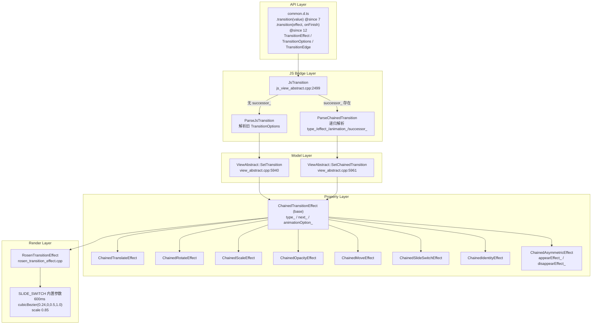
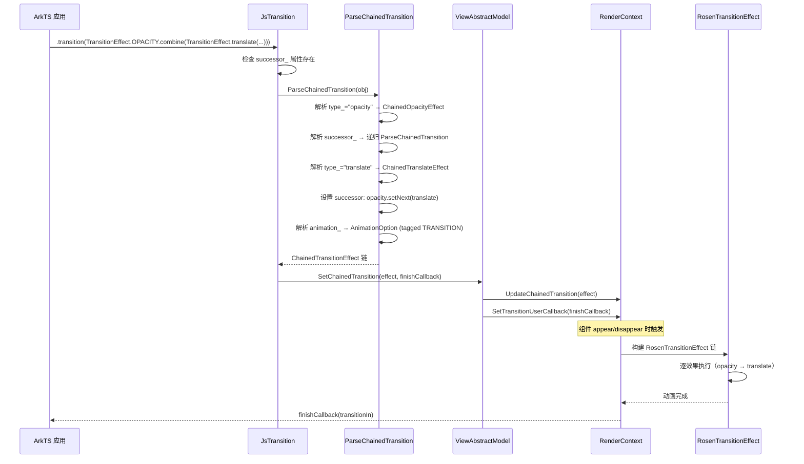
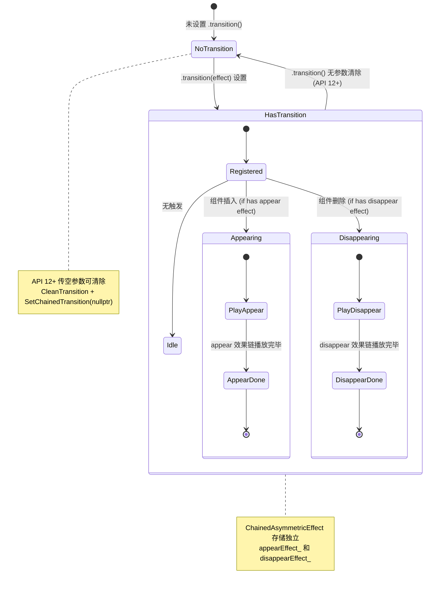

# 架构设计
> 转场动画（Transition Animation）的架构设计文档，覆盖 .transition() API、TransitionEffect 链式效果、ChainedTransitionEffect 继承体系、appear/disappear 效果链播放和 SLIDE_SWITCH 内置参数。

## 设计元数据

| 字段 | 内容 |
|------|------|
| Design ID | DESIGN-Func-03-02-05 |
| 关联需求 | 已有能力补录（无独立 requirement.md） |
| 关联 Epic | 无 |
| 目标 Feature | Feat-01: 转场动画全量规格（TransitionEffect 链式效果、appear/disappear 效果链、SLIDE_SWITCH 内置参数） |
| 复杂度 | 标准 |
| 目标版本 | API 7 ~ API 26+ |
| Owner | ArkUI SIG |
| 状态 | Baselined（已有实现补录） |

## 需求基线

> 需求基线详见 proposal.md。以下仅列出设计阶段需要额外强调的要点。

| 项 | 补充说明（如需） |
|----|------------------|
| TransitionOptions 废弃 | TransitionOptions 自 API 10 起标注 @deprecated / @useinstead TransitionEffect，但 .transition(TransitionOptions \| TransitionEffect) 重载仍同时支持 |
| SLIDE_SWITCH 内置参数 | 默认 600ms cubicBezier(0.24, 0.0, 0.5, 1.0) + 缩放 0.85（`rosen_transition_effect.cpp:24-29`） |
| Asymmetric 效果链 | ChainedAsymmetricEffect 存储独立的 appearEffect_ 和 disappearEffect_（`transition_property.h:463-465`） |
| onFinish 回调 | .transition(effect, onFinish) 重载自 API 12 起支持 TransitionFinishCallback(transitionIn: boolean) |

## 上下文和现状

### 涉及仓和模块

| 仓库 | 模块路径 | 当前职责 | 本 Feature 影响 |
|------|----------|----------|-----------------|
| ace_engine | `frameworks/core/components_ng/property/transition_property.h` | ChainedTransitionEffect 基类 + 8 个子类 + TransitionOptions + ChainedTransitionEffectType/TransitionEdge 枚举 | 规格补录 |
| ace_engine | `frameworks/core/components_ng/base/view_abstract.cpp` | ViewAbstract::SetTransition / SetChainedTransition 写入 RenderContext | 规格补录 |
| ace_engine | `frameworks/bridge/declarative_frontend/jsview/js_view_abstract.cpp` | JsTransition / ParseChainedTransition / ParseJsTransition / ParseJsTransitionEffect | 规格补录 |
| ace_engine | `frameworks/core/components_ng/render/adapter/rosen_transition_effect.cpp` | RosenTransitionEffect 实现，SLIDE_SWITCH 内置参数 | 规格补录 |
| interface/sdk-js | `api/@internal/component/ets/common.d.ts` | TransitionEffect / TransitionOptions / TransitionEdge / TransitionType / TransitionFinishCallback | 规格对照 |
| interface/sdk-js | `api/arkui/component/enums.static.d.ets` | TransitionType 静态枚举 | 规格对照 |

### 调用链层级分析

| 层 | 模块 | 职责 | 修改类型 |
|----|------|------|----------|
| SDK API Layer | `interface/sdk-js/api/@internal/component/ets/common.d.ts:21465` | `.transition(value: TransitionOptions \| TransitionEffect): T` @since 7 | 无修改（规格补录） |
| SDK API Layer | `interface/sdk-js/api/@internal/component/ets/common.d.ts:21486` | `.transition(effect: TransitionEffect, onFinish: Optional<TransitionFinishCallback>): T` @since 12 | 无修改（规格补录） |
| SDK Type Layer | `common.d.ts:6335-6561` | TransitionEffect 类：IDENTITY/OPACITY/SLIDE/SLIDE_SWITCH 预设 + translate/rotate/scale/opacity/move/asymmetric 工厂 + combine/animation | 无修改（规格补录） |
| SDK Type Layer | `common.d.ts:6062-6151` | TransitionOptions 接口（@deprecated since 10）：type/opacity/translate/scale/rotate | 无修改（规格补录） |
| SDK Type Layer | `common.d.ts:6163-6211` | TransitionEdge 枚举（TOP/BOTTOM/START/END）@since 10 | 无修改（规格补录） |
| SDK Type Layer | `common.d.ts:11412` | TransitionFinishCallback = (transitionIn: boolean) => void @since 12 | 无修改（规格补录） |
| JS Bridge | `js_view_abstract.cpp:2499` | `JsTransition` 入口，区分 successor_ 分支（ChainedTransition）和普通分支（TransitionOptions） | 无修改（规格补录） |
| JS Bridge (Parser) | `js_view_abstract.cpp:2053` | `ParseChainedTransition` 递归解析 type_/effect_/animation_/successor_ | 无修改（规格补录） |
| JS Bridge (Parser) | `js_view_abstract.cpp:2425` | `ParseJsTransition` 解析 TransitionOptions（旧 API） | 无修改（规格补录） |
| Model Layer | `view_abstract.cpp:5940` | `ViewAbstract::SetTransition` 写入 ACE_UPDATE_RENDER_CONTEXT(Transition, options) | 无修改（规格补录） |
| Model Layer | `view_abstract.cpp:5961` | `ViewAbstract::SetChainedTransition` 写入 RenderContext::UpdateChainedTransition + SetTransitionUserCallback | 无修改（规格补录） |
| Property Layer | `transition_property.h:156-466` | ChainedTransitionEffect 基类 + 8 子类（Translate/Rotate/Scale/Opacity/Move/SlideSwitch/Identity/Asymmetric） | 无修改（规格补录） |
| Render Layer | `rosen_transition_effect.cpp:24-31` | SLIDE_SWITCH 内置参数：600ms cubicBezier(0.24,0,0.5,1.0) + scale 0.85 | 无修改（规格补录） |

### 适用架构规则

| Rule ID | 适用原因 | 设计结论 | 验证方式 |
|---------|----------|----------|----------|
| OH-ARCH-LAYERING | transition 涉及 SDK → JS Bridge → Model → Property → Render 多层调用 | 调用方向自上而下，Property 层不直接访问 Bridge | 代码评审 |
| OH-ARCH-API-LEVEL | transition 有 @since 7/10/12 多版本 API | TransitionOptions @deprecated since 10，.transition(effect, onFinish) @since 12 | API 评审 / XTS |
| OH-ARCH-COMPONENT-BUILD | 转场动画为框架内置能力，无独立 SO | 编译进 ace_engine 核心库 | 构建验证 |

## 不涉及项承接

> proposal.md 已完成 N/A 判定。本节仅对 proposal 中标记为"涉及"且需展开设计的维度给出结论。

| 维度 | 设计结论 |
|------|----------|
| TransitionOptions 废弃 | 保留兼容但标注 @deprecated/@useinstead，新代码应使用 TransitionEffect |
| SLIDE_SWITCH 内置动画参数 | 默认 600ms cubicBezier(0.24,0,0.5,1.0) + scale 0.85，用户可通过 .animation() 覆盖 |
| Asymmetric 效果链 | appear 和 disappear 独立存储，不共享 successor 链 |
| 多设备适配 | 转场动画行为在手机/平板/折叠屏上无差异 |

## 关键设计决策

| 决策 ID | 问题 | 推荐方案 | 探索过的替代方案 | 取舍理由 | 影响 |
|---------|------|----------|-----------------|----------|------|
| ADR-1 | 旧 API TransitionOptions 是否保留 | 保留兼容，标注 @deprecated/@useinstead TransitionEffect | 直接移除 | API 7 已广泛使用，移除会破坏存量应用 | AC-7.1, AC-7.2 |
| ADR-2 | TransitionEffect 如何支持链式组合 | successor_ 指针 + combine() 方法，形成单链表 | 数组存储 | 单链表足够表达顺序执行语义，内存开销小 | AC-3.3 |
| ADR-3 | Asymmetric 如何存储 appear/disappear | 独立 appearEffect_ / disappearEffect_ 字段 | 合并到 successor 链 | appear 和 disappear 是正交的，合并会导致遍历复杂 | AC-4.1, AC-4.2 |
| ADR-4 | SLIDE_SWITCH 是否允许覆盖动画参数 | 允许，通过 .animation() 覆盖 | 固定不可覆盖 | 提供灵活性，SLIDE_SWITCH_DEFAULT_OPTION 作为 fallback | AC-5.2 |
| ADR-5 | .transition(effect, onFinish) 回调签名 | (transitionIn: boolean) => void | () => void | transitionIn 区分 appear(true)/disappear(false)，更实用 | AC-6.1 |

## 设计骨架

### 骨架范围

| 骨架项 | 目标 | 不包含 | 验证方式 |
|--------|------|--------|----------|
| TransitionEffect 链式效果 | 8 种效果类型 + combine + animation | 共享转场动画（geometryTransition） | UT |
| appear/disappear 效果链 | 组件插入/删除时播放效果链 | 组件内属性动画 | UT + 手工 |
| SLIDE_SWITCH 内置参数 | 600ms cubicBezier + scale 0.85 | 用户自定义 SLIDE_SWITCH 参数 | 手工 |
| TransitionOptions 兼容 | 旧 API 行为等价 opacity(0) | — | UT |
| onFinish 回调 | transitionIn boolean 区分 | — | UT |

### 骨架 Spec 拆分

| Task ID | 目标 | 受影响文件 | AC |
|---------|------|-----------|-----|
| TASK-SKELETON-1 | 转场动画全量规格补录（TransitionEffect 链、appear/disappear、SLIDE_SWITCH、TransitionOptions 兼容、onFinish） | Feat-01-transition-animation-spec.md | AC-1.1 ~ AC-7.3 |

## 后续 Task 拆分

| Task ID | 目标 | 受影响文件 | 依赖 |
|---------|------|-----------|------|
| TASK-TRANSITION-01 | 转场动画全量规格补录 | Feat-01-transition-animation-spec.md, design.md | 无 |

## API 签名、Kit 与权限

### 新增 API

| API 签名 | 类型 | d.ts 位置 | 权限要求 | SysCap |
|----------|------|-----------|----------|--------|
| `CommonMethod.transition(value: TransitionOptions \| TransitionEffect): T` | Public | `common.d.ts:21465` | 无 | SystemCapability.ArkUI.ArkUI.Full |
| `CommonMethod.transition(effect: TransitionEffect, onFinish: Optional<TransitionFinishCallback>): T` | Public | `common.d.ts:21486` | 无 | 同上 |
| `TransitionEffect.IDENTITY` | Public | `common.d.ts:6355` | 无 | 同上 |
| `TransitionEffect.OPACITY` | Public | `common.d.ts:6368` | 无 | 同上 |
| `TransitionEffect.SLIDE` | Public | `common.d.ts:6384` | 无 | 同上 |
| `TransitionEffect.SLIDE_SWITCH` | Public | `common.d.ts:6406` | 无 | 同上 |
| `TransitionEffect.translate(options: TranslateOptions)` | Public | `common.d.ts:6422` | 无 | 同上 |
| `TransitionEffect.rotate(options: RotateOptions)` | Public | `common.d.ts:6442` | 无 | 同上 |
| `TransitionEffect.scale(options: ScaleOptions)` | Public | `common.d.ts:6463` | 无 | 同上 |
| `TransitionEffect.opacity(alpha: number)` | Public | `common.d.ts:6479` | 无 | 同上 |
| `TransitionEffect.move(edge: TransitionEdge)` | Public | `common.d.ts:6495` | 无 | 同上 |
| `TransitionEffect.asymmetric(appear, disappear)` | Public | `common.d.ts:6514` | 无 | 同上 |
| `TransitionEffect.animation(value: AnimateParam)` | Public | `common.d.ts:6547` | 无 | 同上 |
| `TransitionEffect.combine(transitionEffect)` | Public | `common.d.ts:6561` | 无 | 同上 |
| `TransitionEdge` enum | Public | `common.d.ts:6163` | 无 | 同上 |
| `TransitionFinishCallback` type | Public | `common.d.ts:11412` | 无 | 同上 |

### 变更/废弃 API

| 原有 API | 变更类型 | 新 API | 迁移说明 |
|----------|----------|--------|----------|
| TransitionOptions | 废弃 | TransitionEffect | @deprecated since 10，@useinstead TransitionEffect |
| TransitionType enum (All/Insert/Delete) | 废弃 | TransitionEffect + asymmetric | @deprecated since 10，语义由 TransitionEffect.asymmetric 覆盖 |

## 构建系统影响

### BUILD.gn 变更

转场动画为框架核心能力，编译进 ace_engine 核心库，无独立 SO：

```
# frameworks/core/components_ng/property/BUILD.gn
# transition_property.h 为头文件，含 ChainedTransitionEffect 继承体系
# frameworks/core/components_ng/render/adapter/BUILD.gn
# rosen_transition_effect.cpp 实现 SLIDE_SWITCH 内置参数
# 编译目标：libace_compatible.so（核心库）
```

### bundle.json 变更

转场动画作为 ace_engine 内部能力，无独立 bundle.json 变更。

## 可选设计扩展

### 架构图



### 数据流/控制流

| 步骤 | 调用方 | 被调用方 | 数据/接口 | 说明 |
|------|--------|----------|-----------|------|
| 1 | ArkTS | `JsTransition` | TransitionEffect 或 TransitionOptions | API 入口 |
| 2 | JsTransition | 检查 `successor_` 属性 | — | 区分新旧 API |
| 3a | JsTransition | `ParseChainedTransition` | type_/effect_/animation_/successor_ | 递归解析效果链 |
| 3b | JsTransition | `ParseJsTransition` | type/opacity/translate/scale/rotate | 旧 API 解析 |
| 4a | JsTransition | `ViewAbstractModel::SetChainedTransition` | ChainedTransitionEffect + finishCallback | 写入 RenderContext |
| 4b | JsTransition | `ViewAbstractModel::SetTransition` | TransitionOptions | 写入 RenderContext |
| 5 | RenderContext | `UpdateChainedTransition` | effect 链 | 组件 appear/disappear 时播放 |
| 6 | RenderContext | `SetTransitionUserCallback` | finishCallback | 动画结束时回调 |

### 时序设计



### 算法与状态机



### 数据模型设计

**API 层类型 (TypeScript)**:

```typescript
// TransitionEffect 预设 (@since 10)
class TransitionEffect {
  static readonly IDENTITY: TransitionEffect<"identity">;
  static readonly OPACITY: TransitionEffect<"opacity">;
  static readonly SLIDE: TransitionEffect<"asymmetric", {...}>;
  static readonly SLIDE_SWITCH: TransitionEffect<"slideSwitch">;

  static translate(options: TranslateOptions): TransitionEffect<"translate">;
  static rotate(options: RotateOptions): TransitionEffect<"rotate">;
  static scale(options: ScaleOptions): TransitionEffect<"scale">;
  static opacity(alpha: number): TransitionEffect<"opacity">;
  static move(edge: TransitionEdge): TransitionEffect<"move">;
  static asymmetric(appear: TransitionEffect, disappear: TransitionEffect): TransitionEffect<"asymmetric">;

  animation(value: AnimateParam): TransitionEffect;
  combine(transitionEffect: TransitionEffect): TransitionEffect;
}

// TransitionOptions (@deprecated since 10)
interface TransitionOptions {
  type?: TransitionType;    // All (default) / Insert / Delete
  opacity?: number;         // [0, 1]
  translate?: TranslateOptions;
  scale?: ScaleOptions;
  rotate?: RotateOptions;
}

// TransitionEdge (@since 10)
enum TransitionEdge { TOP = 0, BOTTOM = 1, START = 2, END = 3 }

// TransitionFinishCallback (@since 12)
type TransitionFinishCallback = (transitionIn: boolean) => void;

// TransitionType (@deprecated since 10, static @since 23)
enum TransitionType { All = 0, Insert = 1, Delete = 2 }
```

**框架层结构 (C++)**:

```cpp
// ChainedTransitionEffect 基类 (transition_property.h:156)
class ChainedTransitionEffect : public AceType {
    ChainedTransitionEffectType type_;
    std::shared_ptr<AnimationOption> animationOption_;  // tagged TRANSITION
    RefPtr<ChainedTransitionEffect> next_;              // successor 链
};

// 8 个子类:
// ChainedTranslateEffect (TranslateOptions effect_)
// ChainedRotateEffect (RotateOptions effect_)
// ChainedScaleEffect (ScaleOptions effect_)
// ChainedOpacityEffect (float opacity_)
// ChainedMoveEffect (TransitionEdge edge_)
// ChainedSlideSwitchEffect (无额外字段)
// ChainedIdentityEffect (无额外字段)
// ChainedAsymmetricEffect (RefPtr appearEffect_, RefPtr disappearEffect_)

// SLIDE_SWITCH 内置参数 (rosen_transition_effect.cpp:24-31)
constexpr float SLIDE_SWITCH_FRAME_PERCENT = 0.333f;
constexpr float SLIDE_SWITCH_SCALE = 0.85f;
const auto SLIDE_SWITCH_DEFAULT_CURVE = CubicCurve(0.24f, 0.0f, 0.50f, 1.0f);
constexpr int32_t SLIDE_SWITCH_DEFAULT_DURATION = 600;
const auto SLIDE_SWITCH_DEFAULT_OPTION = AnimationOption(SLIDE_SWITCH_DEFAULT_CURVE, SLIDE_SWITCH_DEFAULT_DURATION);

// TransitionOptions (transition_property.h:106)
struct TransitionOptions {
    TransitionType Type = TransitionType::ALL;
    ACE_DEFINE_PROPERTY_GROUP_ITEM(Opacity, float);
    ACE_DEFINE_PROPERTY_GROUP_ITEM(Translate, TranslateOptions);
    ACE_DEFINE_PROPERTY_GROUP_ITEM(Scale, ScaleOptions);
    ACE_DEFINE_PROPERTY_GROUP_ITEM(Rotate, RotateOptions);
};
```

### 测试性设计

| 测试层级 | 测试目标 | Mock 策略 | 验证方式 |
|----------|----------|-----------|----------|
| UT - Bridge | JsTransition 分支（successor_ / 无 successor_） | MockViewStackProcessor | gtest |
| UT - Parser | ParseChainedTransition 递归解析 8 种 type_ | 直接构造 JSObject | gtest |
| UT - Property | ChainedTransitionEffect 链式 combine + animation | 直接构造 | gtest |
| UT - Model | SetTransition / SetChainedTransition 写入 RenderContext | MockRenderContext | gtest |
| UT - Render | RosenTransitionEffect SLIDE_SWITCH 内置参数 | MockRosen | gtest |
| 手工 | SLIDE_SWITCH 视觉效果验证 | 真机 | 视觉比对 |

### 接口参数规约

| 接口 | 参数 | 类型 | 合法范围 | 非法处理 | 边界说明 |
|------|------|------|----------|----------|----------|
| .transition | value | TransitionOptions \| TransitionEffect | 有效对象 | API 12+ 空参清除 | @since 7 |
| .transition | effect | TransitionEffect | 有效对象 | — | @since 12 |
| .transition | onFinish | Optional<TransitionFinishCallback> | 函数对象 | undefined 时无回调 | @since 12 |
| TransitionEffect.opacity | alpha | number | [0, 1] | < 0 取 0, > 1 取 1 | — |
| TransitionEffect.move | edge | TransitionEdge | TOP/BOTTOM/START/END | — | — |
| TransitionEffect.asymmetric | appear | TransitionEffect | 有效对象 | — | — |
| TransitionEffect.asymmetric | disappear | TransitionEffect | 有效对象 | — | — |
| TransitionEffect.animation | value | AnimateParam | 有效对象 | onFinish 不生效 | — |
| TransitionEffect.combine | transitionEffect | TransitionEffect | 有效对象 | — | 追加到 successor 链尾 |
| TransitionOptions.opacity | value | number | [0, 1] | < 0 取 0, > 1 取 1 | @deprecated |
| TransitionOptions.type | value | TransitionType | All/Insert/Delete | 默认 All | @deprecated |

## 详细设计

### JsTransition 分支逻辑

`JsTransition`（`js_view_abstract.cpp:2499`）是转场动画的 JS 入口。执行流程：

1. **参数校验**：`info.Length() < 1` 或 `!info[0]->IsObject()` 时，API 12+ 执行 `CleanTransition()` + `SetChainedTransition(nullptr, nullptr)` 清除（`:2501-2506`）
2. **successor_ 分支**：检查 `obj->GetProperty("successor_")` 是否 defined（`:2509`）
   - **存在 successor_**：调用 `ParseChainedTransition(obj, context)` 解析效果链 + `ParseTransitionCallback` 解析 onFinish，通过 `SetChainedTransition(chainedEffect, finishCallback)` 写入（`:2510-2516`）
   - **无 successor_**：调用 `ParseJsTransition(obj)` 解析旧 API TransitionOptions，通过 `SetTransition(options)` 写入（`:2518-2519`）

### ParseChainedTransition 递归解析

`ParseChainedTransition`（`js_view_abstract.cpp:2053`）递归解析效果链：

1. **type_ 解析**：从 `creatorMap[]` 二分查找类型（`:2064-2079`），支持 asymmetric/identity/move/opacity/rotate/scale/slideSwitch/translate
2. **effect_ 解析**：调用对应的 `ParseChained*Transition` 函数构造效果对象
3. **animation_ 解析**：通过 `JSViewContext::CreateAnimation` 构造 AnimationOption，标记 `AnimationInterface::TRANSITION`（`:2088-2131`）
4. **successor_ 递归**：`result->SetNext(ParseChainedTransition(successor, context))`（`:2133-2134`）
5. **onFinish**：解析 animation_ 对象的 onFinish 函数，设到 AnimationOption（`:2119-2130`）

### ChainedTransitionEffect 继承体系

`ChainedTransitionEffect`（`transition_property.h:156`）是所有效果类的基类：

- **基类字段**：`type_`（ChainedTransitionEffectType）、`next_`（RefPtr 后继指针）、`animationOption_`（shared_ptr<AnimationOption>）
- **SetAnimationOption**（`:178-184`）：设置时自动标记 `AnimationInterface::TRANSITION`
- **GetNext**（`:166-169`）：返回 successor 链

8 个子类（`transition_property.h:261-466`）：
- **ChainedTranslateEffect**（`:261`）：持有 `TranslateOptions effect_`
- **ChainedRotateEffect**（`:290`）：持有 `RotateOptions effect_`
- **ChainedScaleEffect**（`:321`）：持有 `ScaleOptions effect_`
- **ChainedOpacityEffect**（`:350`）：持有 `float opacity_`
- **ChainedMoveEffect**（`:381`）：持有 `TransitionEdge edge_`
- **ChainedSlideSwitchEffect**（`:407`）：无额外字段
- **ChainedIdentityEffect**（`:421`）：无额外字段
- **ChainedAsymmetricEffect**（`:435`）：持有 `RefPtr<ChainedTransitionEffect> appearEffect_` 和 `disappearEffect_`（`:463-465`）

### SLIDE_SWITCH 内置参数

`rosen_transition_effect.cpp:24-31` 定义了 SLIDE_SWITCH 的内置动画参数：

```cpp
constexpr float SLIDE_SWITCH_FRAME_PERCENT = 0.333f;  // 关键帧位置
constexpr float SLIDE_SWITCH_SCALE = 0.85f;            // 缩放比例
const auto SLIDE_SWITCH_DEFAULT_CURVE = CubicCurve(0.24f, 0.0f, 0.50f, 1.0f);
constexpr int32_t SLIDE_SWITCH_DEFAULT_DURATION = 600;  // 600ms
const auto SLIDE_SWITCH_DEFAULT_OPTION = AnimationOption(SLIDE_SWITCH_DEFAULT_CURVE, SLIDE_SWITCH_DEFAULT_DURATION);
```

SLIDE_SWITCH 的关键帧（`:30-31`）：`{0.333f, Vector2f{0.85f, 0.85f}}`，即在 1/3 时间点缩放到 0.85。

用户可通过 `.animation()` 覆盖默认参数（`rosen_transition_effect.cpp:597`）：`SetAnimationOption(option ? option : SLIDE_SWITCH_DEFAULT_OPTION)`。

### SetTransition / SetChainedTransition

`ViewAbstract::SetTransition`（`view_abstract.cpp:5940`）：
- 写入 `ACE_UPDATE_RENDER_CONTEXT(Transition, options)`

`ViewAbstract::SetChainedTransition`（`view_abstract.cpp:5961`）：
- 获取 frameNode 的 RenderContext
- `target->UpdateChainedTransition(effect)` 写入效果链
- `target->SetTransitionUserCallback(std::move(finishCallback))` 设置完成回调

### TransitionOptions 兼容

`TransitionOptions`（`transition_property.h:106`）是旧 API 的数据结构：
- `Type` 默认 `TransitionType::ALL`（`:107`）
- `GetDefaultTransition(type)` 返回 opacity=0.0f 的默认 TransitionOptions（`:112-118`）
- 所有字段使用 `ACE_DEFINE_PROPERTY_GROUP_ITEM` 宏定义

### TransitionEffect 预设语义

| 预设 | 等价表达 | 说明 |
|------|---------|------|
| IDENTITY | 无效果 | appear/disappear 时不做任何变换 |
| OPACITY | opacity(0) | appear 时 0→1，disappear 时 1→0 |
| SLIDE | asymmetric(move(START), move(END)) | appear 从 START 边滑入，disappear 从 END 边滑出 |
| SLIDE_SWITCH | 内置 600ms cubicBezier + scale 0.85 | appear 从右滑入并缩放，disappear 从左滑出并缩放 |

## 风险和开放问题

| 项 | 类型 | 影响 (高/中/低) | 处理方式 | Owner |
|----|------|------|----------|-------|
| TransitionOptions 废弃但未移除 | 兼容性 | 中 | 保留 @deprecated 标注，引导迁移到 TransitionEffect | ArkUI SIG |
| SLIDE_SWITCH 内置参数可能被误用 | API | 低 | SDK 文档已说明默认 600ms cubicBezier(0.24,0,0.5,1.0) + scale 0.85 | ArkUI SIG |
| Asymmetric appear/disappear 独立链可能导致不一致 | 架构 | 低 | 设计上正交独立，文档需明确说明 | ArkUI SIG |
| onFinish 回调在 attributeModifier 中调用限制 | API | 低 | SDK 文档标注 .transition(effect, onFinish) 自 API 20 起可在 attributeModifier 中调用 | ArkUI SIG |

## 设计审批

- [x] 需求基线已确认，设计覆盖 P0/P1 AC
- [x] 不涉及项已承接，N/A 和展开项都有结论
- [x] 涉及仓和模块职责清楚
- [x] 调用链层级分析完整，每层覆盖到位
- [x] 适用架构规则已识别并形成设计结论
- [x] 分层和子系统边界合规
- [x] API 变更有签名、权限、错误码和兼容性说明
- [x] BUILD.gn/bundle.json 影响明确
- [x] 设计输出和后续 Task 拆分明确
- [x] 关键设计决策有理由和影响说明
- [x] 风险和开放问题有 Owner

**结论:** 通过（已有实现补录）
