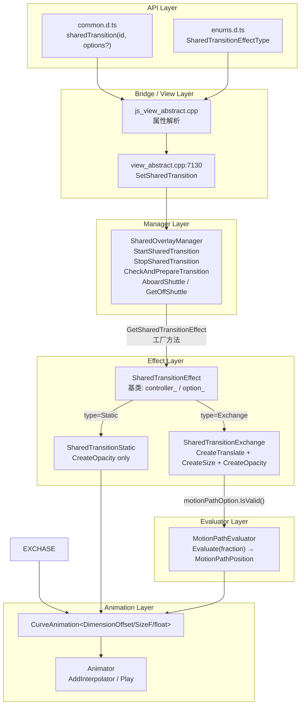
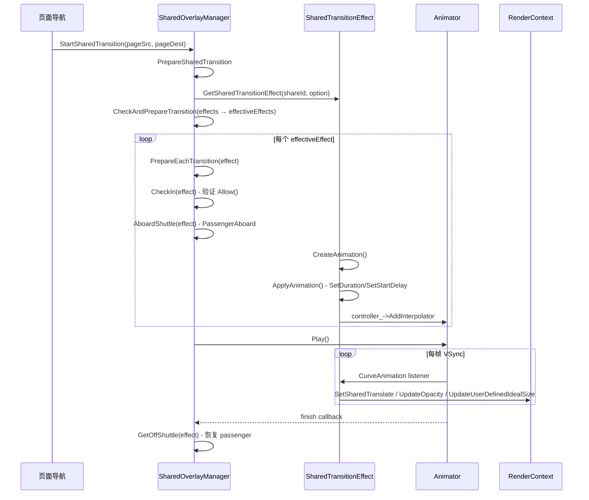
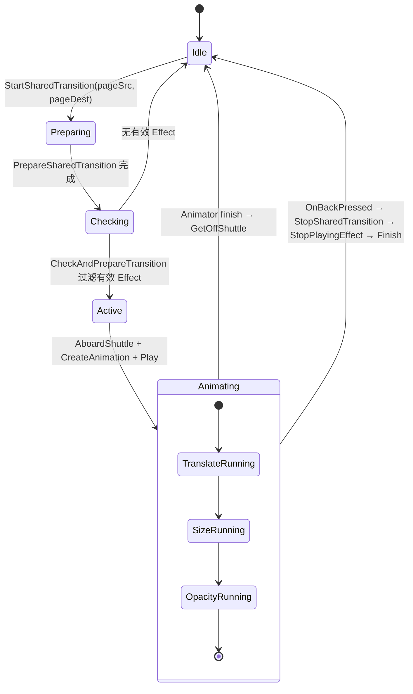

# 架构设计
> 共享元素动画（Shared Transition）的架构设计文档，覆盖页面间共享元素的 Exchange / Static 两种过渡效果、SharedOverlayManager 管理器、MotionPath 路径复用及回退动画流程。

## 设计元数据

| 字段 | 内容 |
|------|------|
| Design ID | DESIGN-Func-03-02-06 |
| 关联需求 | 已有能力补录（无独立 requirement.md） |
| 关联 Epic | 无 |
| 目标 Feature | Feat-01: 共享元素动画全量规格（Exchange / Static / MotionPath 集成） |
| 复杂度 | 复杂 |
| 目标版本 | API 7 ~ API 26+ |
| Owner | ArkUI SIG |
| 状态 | Baselined（已有实现补录） |

## 需求基线

> 需求基线详见 proposal.md。以下仅列出设计阶段需要额外强调的要点。

| 项 | 补充说明（如需） |
|----|------------------|
| 跨页面元素匹配 | 通过 shareId 匹配源页面与目标页面中的共享元素，ShareId 为空时跳过过渡 |
| Exchange vs Static | Exchange 同时执行 translate+size+opacity 动画；Static 仅执行 opacity 动画 |
| MotionPath 复用 | Exchange 类型的 translate 动画支持 MotionPathEvaluator，使元素沿 SVG 路径移动 |
| 回退动画 | 按下返回键时 StopSharedTransition 触发反向过渡动画 |

## 上下文和现状

### 涉及仓和模块

| 仓库 | 模块路径 | 当前职责 | 本 Feature 影响 |
|------|----------|----------|-----------------|
| ace_engine | `frameworks/core/components_ng/manager/shared_overlay/shared_overlay_manager.h/.cpp` | SharedOverlayManager：StartSharedTransition/StopSharedTransition/CheckAndPrepareTransition/AboardShuttle/GetOffShuttle | 核心实现，规格补录 |
| ace_engine | `frameworks/core/components_ng/manager/shared_overlay/shared_transition_effect.h/.cpp` | SharedTransitionEffect 基类 + SharedTransitionExchange + SharedTransitionStatic | 核心实现，规格补录 |
| ace_engine | `frameworks/core/components/common/properties/shared_transition_option.h` | SharedTransitionOption 结构体（duration/delay/zIndex/curve/motionPathOption/type） | 规格补录 |
| ace_engine | `frameworks/core/animation/shared_transition.h` | SharedTransitionEffectType 枚举（SHARED_EFFECT_STATIC / SHARED_EFFECT_EXCHANGE） | 规格补录 |
| ace_engine | `frameworks/core/components/common/properties/motion_path_option.h` | MotionPathOption：path/begin/end/rotate | 规格补录（MotionPath 域共用） |
| ace_engine | `frameworks/core/components/common/properties/motion_path_evaluator.h/.cpp` | MotionPathEvaluator：Evaluate + 子 Evaluator 工厂方法 | 规格补录（MotionPath 域共用） |
| ace_engine | `frameworks/core/components_ng/base/view_abstract.cpp` | SetSharedTransition / SetMotionPath 入口 | 规格补录 |
| interface/sdk-js | `api/@internal/component/ets/common.d.ts` | sharedTransition / sharedTransitionOptions / MotionPathOptions 声明 | 规格对照 |
| interface/sdk-js | `api/@internal/component/ets/enums.d.ts` | SharedTransitionEffectType 枚举声明 | 规格对照 |

### 调用链层级分析

| 层 | 模块 | 职责 | 修改类型 |
|----|------|------|----------|
| SDK API | `common.d.ts:22889` `sharedTransition(id, options?)` | ArkTS 属性入口，@since 7 | 无修改（规格补录） |
| JS Bridge | `frameworks/bridge/declarative/frontend/jsview/js_view_abstract.cpp` | 解析 sharedTransition 属性 → 调用 ViewAbstract::SetSharedTransition | 无修改（规格补录） |
| View Layer | `frameworks/core/components_ng/base/view_abstract.cpp:7130-7140` | SetSharedTransition：设置 RenderContext 的 shareId 和 SharedTransitionOptions | 无修改（规格补录） |
| Manager | `frameworks/core/components_ng/manager/shared_overlay/shared_overlay_manager.h` | SharedOverlayManager：页面切换时遍历两端页面树，匹配 shareId，创建 Effect，管理 Animator 生命周期 | 无修改（规格补录） |
| Effect | `frameworks/core/components_ng/manager/shared_overlay/shared_transition_effect.h` | SharedTransitionEffect 基类 + Exchange / Static 子类：CreateAnimation / ApplyAnimation / Allow | 无修改（规格补录） |
| Evaluator | `frameworks/core/components/common/properties/motion_path_evaluator.h/.cpp` | MotionPathEvaluator：Evaluate(fraction) → MotionPathPosition，被 Exchange translate 动画复用 | 无修改（规格补录） |
| Animation | `frameworks/core/animation/curve_animation.h` | CurveAnimation<DimensionOffset/SizeF/float> 插值器，由 Animator 驱动 | 无修改（规格补录） |

### 适用架构规则

| Rule ID | 适用原因 | 设计结论 | 验证方式 |
|---------|----------|----------|----------|
| OH-ARCH-LAYERING | SharedTransition 涉及 API → Bridge → View → Manager → Effect → Evaluator 多层调用 | 调用方向自上而下，Effect 不直接访问 Bridge 层 | 代码评审 |
| OH-ARCH-API-LEVEL | sharedTransition @since 7，sharedTransitionOptions 跨平台 @since 10，原子化 @since 11 | 各版本 API 通过条件编译兼容 | API 评审 / XTS |
| OH-ARCH-SUBSYSTEM | SharedOverlayManager 在 NG 层 manager 中，依赖 Stage/Page 模块和 RenderContext | 同仓跨模块，通过 FrameNode 弱引用访问 | 依赖检查 |
| OH-ARCH-ERROR-LOG | TAG_LOGD/TAG_LOGW 使用 ACE_ANIMATION 标签 | 关键路径有日志覆盖 | hilog |

## 不涉及项承接

> proposal.md 已完成 N/A 判定。本节仅对 proposal 中标记为"涉及"且需展开设计的维度给出结论。

| 维度 | 设计结论 |
|------|----------|
| 多窗口/分屏 | SharedOverlayManager 绑定在页面根节点上，每个窗口独立管理各自的共享过渡 |
| 版本升级兼容 | API 7 基础功能 → API 10 跨平台 → API 11 原子化，通过 @since 标注策略保持向前兼容 |

## 关键设计决策

| 决策 ID | 问题 | 推荐方案 | 探索过的替代方案 | 取舍理由 | 影响 |
|---------|------|----------|-----------------|----------|------|
| ADR-1 | Exchange 和 Static 如何选择 | 通过 SharedTransitionEffectType 枚举区分，GetSharedTransitionEffect 工厂方法创建对应子类 | 单一 Effect 类内部分支 | 面向对象多态更清晰；Exchange 和 Static 的动画创建逻辑差异大 | AC-1.1, AC-1.2 |
| ADR-2 | Exchange 是否同时执行 translate+size+opacity | 是，CreateAnimation 依次调用三个子方法，各自独立判断是否需要创建（NearEqual 跳过） | 组合为单一动画 | 三个维度独立控制，可按需跳过无变化维度，减少不必要的插值器 | AC-1.3 |
| ADR-3 | Exchange translate 是否支持 MotionPath | 是，当 option_->motionPathOption.IsValid() 时创建 MotionPathEvaluator 替代默认 DimensionOffsetEvaluator | 仅支持直线插值 | MotionPath 提供更丰富的路径效果，且复用 MotionPath 域的 Evaluator | AC-2.1 |
| ADR-4 | Passenger 节点如何被移入 overlay | AboardShuttle → PassengerAboard：将 passenger 从原父节点摘除，创建 holder 节点占位，将 passenger 挂到 sharedManager_ overlay 上 | 直接在原位置渲染 | overlay 层级确保 passenger 在动画期间不受页面切换影响，zIndex 可控 | AC-3.1 |
| ADR-5 | 回退动画如何处理 | OnBackPressed → StopSharedTransition：将 effects 列表中所有 effect 调用 StopPlayingEffect（controller_->Finish()），然后 GetOffShuttle 恢复 passenger | 立即清除无动画 | Finish 使动画跳到终点，恢复 holder 和 passenger 的原始状态 | AC-4.1 |
| ADR-6 | Static 类型的 passenger 如何确定 | GetPassengerNode() 返回 src_.Invalid() ? dest_ : src_，即优先使用 src（离开页面的元素），如果 src 无效则用 dest（进入页面的元素） | 固定使用 src 或 dest | 支持前进和后退两种导航方向的 Static 过渡 | AC-1.2 |

## 设计骨架

### 骨架范围

| 骨架项 | 目标 | 不包含 | 验证方式 |
|--------|------|--------|----------|
| SharedOverlayManager 流程 | StartSharedTransition → PrepareSharedTransition → CheckAndPrepareTransition → AboardShuttle → Animator 驱动 → GetOffShuttle | 自定义动画曲线逻辑 | UT |
| Exchange 动画创建 | CreateTranslateAnimation + CreateSizeAnimation + CreateOpacityAnimation | MotionPath SVG 解析（由 MotionPath 域覆盖） | UT |
| Static 动画创建 | CreateOpacityAnimation（仅透明度） | translate/size 动画 | UT |
| MotionPath 集成 | Exchange translate 通过 MotionPathEvaluator 沿路径移动 | 独立 motionPath() 属性设置（由 MotionPath 域覆盖） | UT + 手工 |
| 回退动画 | OnBackPressed → StopSharedTransition | 自定义回退曲线 | UT |

### 骨架 Spec 拆分

| Task ID | 目标 | 受影响文件 | AC |
|---------|------|-----------|-----|
| TASK-SKELETON-1 | 共享元素动画全量规格补录 | Feat-01-shared-transition-spec.md | AC-1.1 ~ AC-5.3 |

## 后续 Task 拆分

| Task ID | 目标 | 受影响文件 | 依赖 |
|---------|------|-----------|------|
| TASK-SHARED-TRANSITION-01 | 共享元素动画全量规格补录 | Feat-01-shared-transition-spec.md, design.md | 无 |

## API 签名、Kit 与权限

### 新增 API

| API 签名 | 类型 | d.ts 位置 | 权限要求 | SysCap |
|----------|------|-----------|----------|--------|
| `sharedTransition(id: string, options?: sharedTransitionOptions): T` | Public | `common.d.ts:22889` | 无 | SystemCapability.ArkUI.ArkUI.Full |
| `sharedTransitionOptions` (interface) | Public | `common.d.ts:4638` | 无 | 同上 |
| `SharedTransitionEffectType` (enum: Static / Exchange) | Public | `enums.d.ts:2790` | 无 | 同上 |
| `MotionPathOptions` (interface) | Public | `common.d.ts:4553` | 无 | 同上 |

### 变更/废弃 API

| 原有 API | 变更类型 | 新 API | 迁移说明 |
|----------|----------|--------|----------|
| 无 | — | — | — |

## 构建系统影响

### BUILD.gn 变更

```
# frameworks/core/components_ng/manager/shared_overlay/BUILD.gn
# 构建目标：包含在 ace_engine 核心库中
# SharedOverlayManager 和 SharedTransitionEffect 为核心动画管理器
```

### bundle.json 变更

共享元素动画作为 ace_engine 的内部能力，无独立 bundle.json 变更。

## 可选设计扩展

### 架构图



### 数据流/控制流

| 步骤 | 调用方 | 被调用方 | 数据/接口 | 说明 |
|------|--------|----------|-----------|------|
| 1 | 页面导航 | SharedOverlayManager | StartSharedTransition(pageSrc, pageDest) | 入口 |
| 2 | SharedOverlayManager | SharedOverlayManager | PrepareSharedTransition | 遍历两端页面树 |
| 3 | PrepareSharedTransition | SharedTransitionEffect::GetSharedTransitionEffect | shareId + option | 工厂方法创建 Effect |
| 4 | SharedOverlayManager | CheckAndPrepareTransition | effects → effectiveEffects | 过滤无效 Effect |
| 5 | SharedOverlayManager | PrepareEachTransition → AboardShuttle | effect | Passenger 移入 overlay |
| 6 | AboardShuttle | PassengerAboard | effect, passenger | 摘除 passenger，创建 holder |
| 7 | Effect | CreateAnimation → CreateTranslate/CreateSize/CreateOpacity | CurveAnimation | 创建插值器 |
| 8 | Effect | ApplyAnimation → controller_->Play | Animator | 启动动画 |
| 9 | Animator | CurveAnimation listener | RenderContext::SetSharedTranslate / UpdateOpacity / UpdateUserDefinedIdealSize | 逐帧驱动 |
| 10 | Animator finish | PerformFinishCallback → GetOffShuttle | effect | 恢复 passenger |

### 时序设计



### 算法与状态机



### 测试性设计

| 测试层级 | 测试目标 | Mock 策略 | 验证方式 |
|----------|----------|-----------|----------|
| UT - Manager | StartSharedTransition / StopSharedTransition 流程 | MockPipelineContext + Mock FrameNode 树 | gtest_filter |
| UT - Effect | Exchange CreateAnimation 三维度 / Static CreateOpacity | MockRenderContext | gtest_filter |
| UT - Effect | Allow() 条件判定（shareId 非空、src/dest 有效） | 构造空/非空 shareId | gtest_filter |
| UT - MotionPath | Exchange translate 使用 MotionPathEvaluator | 构造有效 MotionPathOption | gtest_filter |
| 手工 | 页面间共享元素过渡视觉验证 | 真机导航 | 视觉比对 |

### 接口参数规约

| 接口 | 参数 | 类型 | 合法范围 | 非法处理 | 边界说明 |
|------|------|------|----------|----------|----------|
| sharedTransition | id | string | 非空字符串 | 空字符串 → 无过渡 | — |
| sharedTransitionOptions.duration | number | ms | [0, +∞) | 负数 → 默认 1000 | 默认 1000 |
| sharedTransitionOptions.curve | Curve/string/ICurve | — | 有效曲线 | — | 默认 Curve.Linear |
| sharedTransitionOptions.delay | number | ms | [0, +∞) | 负数 → 默认 0 | 默认 0 |
| sharedTransitionOptions.type | SharedTransitionEffectType | Static/Exchange | — | — | 默认 Exchange |
| sharedTransitionOptions.zIndex | number | int | (-∞, +∞) | — | 默认 0 |
| sharedTransitionOptions.motionPath | MotionPathOptions | — | 有效 SVG path | 仅 Exchange 生效 | — |

## 详细设计

### SharedOverlayManager 流程

`SharedOverlayManager`（`shared_overlay_manager.h:29`）绑定在页面根节点的 render node 上。核心流程：

1. **StartSharedTransition**（`:36`）：入口，接收源页面和目标页面的 FrameNode
2. **PrepareSharedTransition**（`:41`）：遍历两个页面树，收集所有设置了 shareId 的节点，通过 `GetSharedTransitionEffect` 工厂方法创建 Effect
3. **CheckAndPrepareTransition**（`:43-44`）：过滤无效 Effect（`Allow()` 返回 false 的被排除）
4. **PrepareEachTransition → CheckIn → AboardShuttle**：对每个有效 Effect：
   - `CheckIn`（`:46`）：验证 `effect->Allow()` 为 true
   - `AboardShuttle`（`:47`）：调用 `PassengerAboard` 将 passenger 从原父节点摘除，创建 holder 节点占位（保持布局位置），将 passenger 挂到 sharedManager_ overlay 上
5. **CreateAnimation + ApplyAnimation + Play**：Effect 创建插值器，Animator 驱动
6. **finish → GetOffShuttle**（`:48`）：恢复 passenger 到原位置，移除 holder

### Exchange 动画创建

`SharedTransitionExchange::CreateAnimation()`（`shared_transition_effect.cpp:100-118`）依次创建三个维度动画：

- **CreateTranslateAnimation**（`:121-170`）：
  - 计算 `diff = destOffset - srcOffset`（页面坐标系）
  - 创建 `CurveAnimation<DimensionOffset>(Offset(0,0), diff, option_->curve)`
  - 如果 `motionPathOption.IsValid()`（`:135`）：创建 `MotionPathEvaluator(option_->motionPathOption, Offset(0,0), diff)`，调用 `CreateDimensionOffsetEvaluator()` 替代默认 Evaluator
  - 如果 `motionPathOption.GetRotate()`（`:139`）：额外创建 rotate 动画，使用 `MotionPathEvaluator::CreateRotateEvaluator()`
  - listener 调用 `RenderContext::SetSharedTranslate()`

- **CreateSizeAnimation**（`:172-225`）：
  - 创建 `CurveAnimation<SizeF>(srcSize, destSize, option_->curve)`
  - listener 调用 `UpdateUserDefinedIdealSize` + `UpdateAspectRatio` + `MarkDirtyNode`
  - NearEqual(srcSize, destSize) 时跳过

- **CreateOpacityAnimation**（`:227-232`）：
  - 调用基类 `SharedTransitionEffect::CreateOpacityAnimation(startOpacity, endOpacity, startOpacity, src_)`（`:54-75`）
  - listener 调用 `RenderContext::UpdateOpacity()`

### Static 动画创建

`SharedTransitionStatic::CreateAnimation()`（`:268-282`）：
- 仅创建 opacity 动画
- 如果 `dest_ == passenger`（进入方向）：opacity 0 → initialOpacity（淡入）
- 如果 `src_ == passenger`（离开方向）：opacity initialOpacity → 0（淡出）

### 回退动画

`SharedOverlayManager::OnBackPressed()`（`:38`）→ `StopSharedTransition()`（`:37`）：
- 对每个 effect 调用 `StopPlayingEffect()`（`shared_transition_effect.h:63-69`）：`controller_->Finish()` 使动画跳到终点
- 然后执行 `GetOffShuttle` 恢复 passenger

## 风险和开放问题

| 项 | 类型 | 影响 | 处理方式 | Owner |
|----|------|------|----------|-------|
| Exchange 动画期间 destNode 内容属性（如 fontSize）突变 | 架构 | 中 | 已知行为，SDK 文档明确说明内容属性在动画结束时 snap 到目标值 | ArkUI SIG |
| MotionPath SVG 解析依赖 RosenSvgPainter | 架构 | 低 | SVG 路径无效时 Evaluate 返回零偏移，降级为无路径动画 | ArkUI SIG |
| shareId 匹配在复杂页面树中可能遗漏 | 测试 | 中 | PrepareSharedTransition 递归遍历全树，UT 覆盖深层节点 | ArkUI SIG |
| 回退动画使用 Finish 跳到终点而非反向播放 | 设计 | 低 | 设计决策：Finish 保证状态一致性，反向播放可能导致中间态不一致 | ArkUI SIG |

## 设计审批

- [x] 需求基线已确认，设计覆盖 P0/P1 AC
- [x] 不涉及项已承接，N/A 和展开项都有结论
- [x] 涉及仓和模块职责清楚
- [x] 调用链层级分析完整，每层覆盖到位
- [x] 适用架构规则已识别并形成设计结论
- [x] 分层和子系统边界合规
- [x] API 变更有签名、权限、错误码和兼容性说明
- [x] BUILD.gn/bundle.json 影响明确
- [x] 设计输出和后续 Task 拆分明确
- [x] 关键设计决策有理由和影响说明
- [x] 风险和开放问题有 Owner

**结论:** 通过（已有实现补录）
