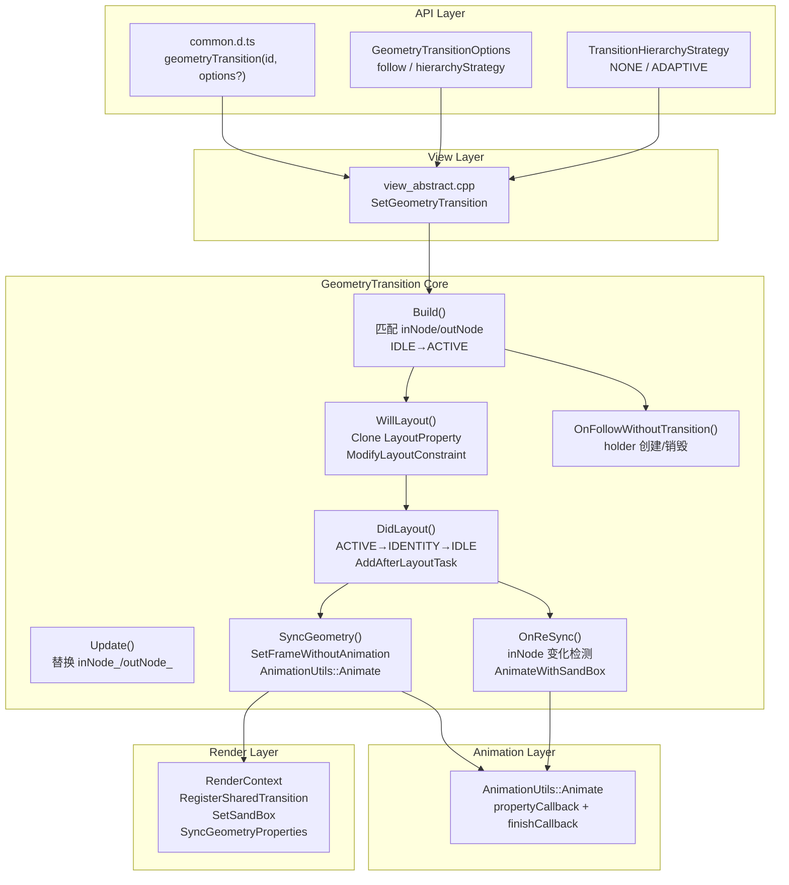
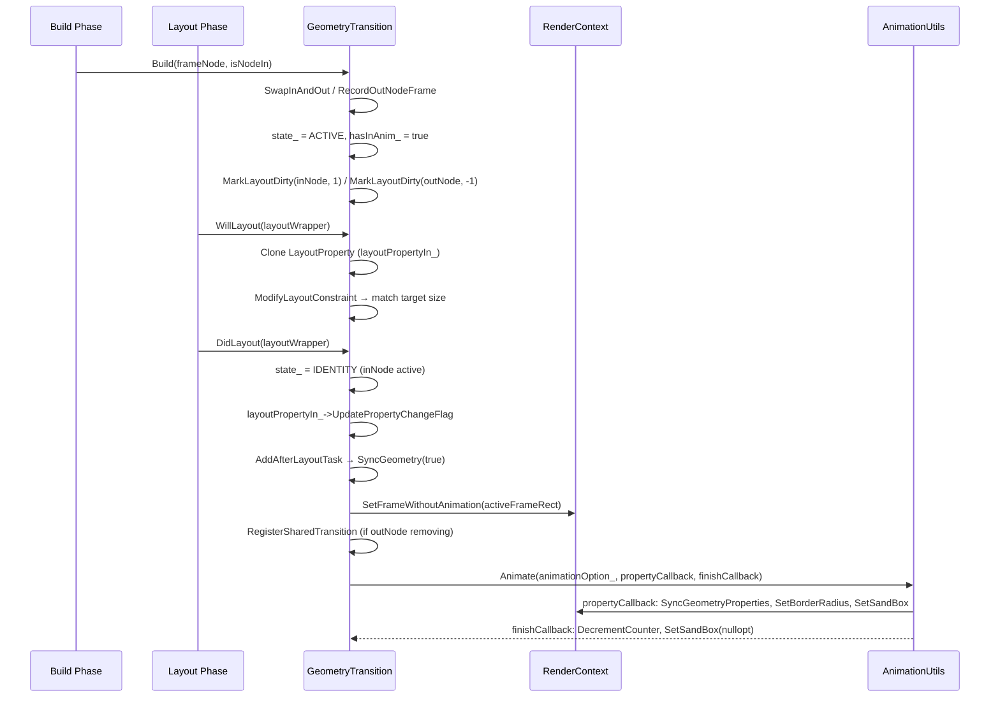
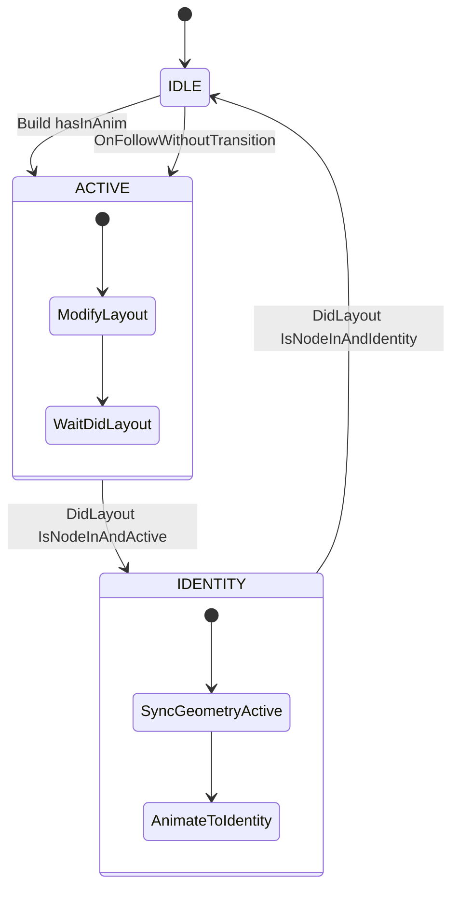

# 架构设计
> 组件共享元素动画（Geometry Transition）的架构设计文档，覆盖 if/else 条件分支间的 Hero 动画、inNode/outNode 配对、State 状态机（IDLE/ACTIVE/IDENTITY）、WillLayout/DidLayout/SyncGeometry 布局协同及 follow 模式。

## 设计元数据

| 字段 | 内容 |
|------|------|
| Design ID | DESIGN-Func-03-02-07 |
| 关联需求 | 已有能力补录（无独立 requirement.md） |
| 关联 Epic | 无 |
| 目标 Feature | Feat-01: 组件共享元素动画全量规格（Hero 动画 / State 状态机 / follow 模式 / hierarchyStrategy） |
| 复杂度 | 复杂 |
| 目标版本 | API 7 ~ API 26+ |
| Owner | ArkUI SIG |
| 状态 | Baselined（已有实现补录） |

## 需求基线

> 需求基线详见 proposal.md。以下仅列出设计阶段需要额外强调的要点。

| 项 | 补充说明（如需） |
|----|------------------|
| 组件级 Hero 动画 | 通过 geometryTransition(id) 在 if/else 分支间匹配 inNode/outNode 对，实现组件级共享元素过渡 |
| 双向过渡 | inNode 从 outNode 尺寸/位置开始（active），动画到自身位置（identity）；outNode 反向 |
| State 状态机 | IDLE → ACTIVE → IDENTITY → IDLE 三态，由 Build/WillLayout/DidLayout/SyncGeometry 驱动 |
| follow 模式 | @since 11，followWithoutTransition_ 允许不参与过渡的节点跟随匹配节点的动画 |
| hierarchyStrategy | @since 12 systemapi，控制 in/out 组件在组件树中的层级提升策略 |

## 上下文和现状

### 涉及仓和模块

| 仓库 | 模块路径 | 当前职责 | 本 Feature 影响 |
|------|----------|----------|-----------------|
| ace_engine | `frameworks/core/components_ng/animation/geometry_transition.h/.cpp` | GeometryTransition 类：Build/Update/OnReSync/WillLayout/DidLayout/SyncGeometry/AnimateWithSandBox/OnFollowWithoutTransition | 核心实现，规格补录 |
| ace_engine | `frameworks/core/components_ng/base/view_abstract.cpp` | SetGeometryTransition 入口 | 规格补录 |
| ace_engine | `frameworks/core/components_ng/render/render_context.h` | RegisterSharedTransition / SetSandBox / SyncGeometryProperties / IsGeometryTransitionAnimating | 规格补录 |
| interface/sdk-js | `api/@internal/component/ets/common.d.ts` | geometryTransition(id) / geometryTransition(id, options) / GeometryTransitionOptions / TransitionHierarchyStrategy | 规格对照 |

### 调用链层级分析

| 层 | 模块 | 职责 | 修改类型 |
|----|------|------|----------|
| SDK API | `common.d.ts:24152` `geometryTransition(id)` / `:24168` `geometryTransition(id, options?)` | ArkTS 属性入口，@since 7 / @since 11 | 无修改（规格补录） |
| JS Bridge | `frameworks/bridge/declarative/frontend/jsview/js_view_abstract.cpp` | 解析 geometryTransition 属性 | 无修改（规格补录） |
| View Layer | `frameworks/core/components_ng/base/view_abstract.cpp` | SetGeometryTransition：创建/更新 GeometryTransition 对象，注册到 FrameNode | 无修改（规格补录） |
| Build Phase | `frameworks/core/components_ng/animation/geometry_transition.cpp:138-209` | Build：节点添加/移除时匹配 inNode/outNode，设置 hasInAnim_/hasOutAnim_，状态 IDLE→ACTIVE | 无修改（规格补录） |
| Layout Phase | `geometry_transition.cpp:231-293` | WillLayout：克隆 LayoutProperty，ModifyLayoutConstraint 修改尺寸约束；DidLayout：状态 ACTIVE→IDENTITY→IDLE，AddAfterLayoutTask → SyncGeometry | 无修改（规格补录） |
| Sync Phase | `geometry_transition.cpp:340-459` | SyncGeometry：计算 activeFrameRect，SetFrameWithoutAnimation，AnimationUtils::Animate 驱动属性动画 | 无修改（规格补录） |
| ReSync Phase | `geometry_transition.cpp:626-681` | OnReSync：outNode 动画运行中 inNode 尺寸变化时重新同步，AnimateWithSandBox | 无修改（规格补录） |
| Follow Mode | `geometry_transition.cpp:493-545` | OnFollowWithoutTransition：followWithoutTransition_ 时创建 holder，移入/移出 disappearing | 无修改（规格补录） |
| Render | `render_context.h` | RegisterSharedTransition / SetSandBox / SyncGeometryProperties / IncrementGeometryTransitionCounter | 无修改（规格补录） |

### 适用架构规则

| Rule ID | 适用原因 | 设计结论 | 验证方式 |
|---------|----------|----------|----------|
| OH-ARCH-LAYERING | GeometryTransition 涉及 API → Bridge → View → Build → Layout → Sync 多层 | 调用方向自上而下，Layout 阶段不直接访问 Bridge | 代码评审 |
| OH-ARCH-API-LEVEL | geometryTransition(id) @since 7，options @since 11，hierarchyStrategy @since 12 systemapi | 各版本 API 通过条件分支兼容 | API 评审 / XTS |
| OH-ARCH-SUBSYSTEM | GeometryTransition 依赖 RenderContext 和 PipelineContext | 同仓跨模块，通过 WeakPtr 访问 | 依赖检查 |
| OH-ARCH-ERROR-LOG | TAG_LOGD/TAG_LOGI 使用 ACE_GEOMETRY_TRANSITION 标签 | 关键路径有日志覆盖 | hilog |

## 不涉及项承接

> proposal.md 已完成 N/A 判定。本节仅对 proposal 中标记为"涉及"且需展开设计的维度给出结论。

| 维度 | 设计结论 |
|------|----------|
| 版本升级兼容 | API 7 基础功能 → API 11 options.follow → API 12 hierarchyStrategy，通过 @since 标注策略保持向前兼容 |
| hierarchyStrategy | systemapi，默认 ADAPTIVE，开发者仅在层级关系错误时调整 |

## 关键设计决策

| 决策 ID | 问题 | 推荐方案 | 探索过的替代方案 | 取舍理由 | 影响 |
|---------|------|----------|-----------------|----------|------|
| ADR-1 | inNode/outNode 如何配对 | 通过 id_ 匹配，Build 阶段在同一 GeometryTransition 对象上记录 inNode_ 和 outNode_ | 全局注册表 | 每个 id 对应一个 GeometryTransition 对象，简化匹配逻辑 | AC-1.1 |
| ADR-2 | 双向过渡如何实现 | inNode active = 从 outNode 尺寸/位置开始；inNode identity = 动画到自身位置。outNode active = 从自身开始，动画到 inNode 尺寸/位置 | 单向过渡 | 双向完美贴合，视觉上如单一视图移动 | AC-1.2 |
| ADR-3 | 状态机设计 | IDLE→ACTIVE→IDENTITY→IDLE，由 Build（→ACTIVE）、DidLayout（ACTIVE→IDENTITY→IDLE）驱动 | 两态（idle/running） | 三态精确控制布局修改和恢复时机 | AC-2.1 |
| ADR-4 | follow 模式如何实现 | OnFollowWithoutTransition：创建 holder 替换 outNode，将 outNode 加入 disappearing 列表，layoutPriority=-1 | 直接隐藏 outNode | holder 保持布局位置不变，outNode 可独立动画 | AC-4.1 |
| ADR-5 | ReSync 如何处理 | OnReSync：检测 inNode 尺寸/位置变化超过 1px 时触发，AnimateWithSandBox 重新驱动 outNode | 立即跳到新位置 | 平滑过渡到新尺寸，RESYNC_DURATION=1ms | AC-5.1 |
| ADR-6 | SandBox 机制 | SetSandBox(parentPos)：使节点渲染不受父节点 transform 影响 | 直接修改父节点 | SandBox 隔离父节点缩放/位移，保证动画期间渲染正确 | AC-3.2 |
| ADR-7 | hierarchyStrategy 默认值 | ADAPTIVE（低层级组件提升到高层级） | NONE（保持原层级） | ADAPTIVE 在大多数场景下自动修正层级关系，减少开发者手动调整 | AC-6.1 |

## 设计骨架

### 骨架范围

| 骨架项 | 目标 | 不包含 | 验证方式 |
|--------|------|--------|----------|
| Build 匹配 | 节点添加/移除时匹配 inNode/outNode，设置 hasInAnim_/hasOutAnim_ | 具体动画曲线（由 AnimationOption 控制） | UT |
| Layout 协同 | WillLayout 克隆属性 + ModifyLayoutConstraint；DidLayout 状态转换 + AddAfterLayoutTask | 具体布局算法 | UT |
| SyncGeometry | 计算 activeFrameRect，SetFrameWithoutAnimation，AnimationUtils::Animate | SandBox 渲染细节 | UT + 手工 |
| follow 模式 | holder 创建/销毁，disappearing 管理 | 自定义 follow 动画 | UT |
| ReSync | inNode 变化检测，AnimateWithSandBox | 多次连续 ReSync 合并 | UT |

### 骤架 Spec 拆分

| Task ID | 目标 | 受影响文件 | AC |
|---------|------|-----------|-----|
| TASK-SKELETON-1 | 组件共享元素动画全量规格补录 | Feat-01-geometry-transition-spec.md | AC-1.1 ~ AC-6.2 |

## 后续 Task 拆分

| Task ID | 目标 | 受影响文件 | 依赖 |
|---------|------|-----------|------|
| TASK-GEOMETRY-01 | 组件共享元素动画全量规格补录 | Feat-01-geometry-transition-spec.md, design.md | 无 |

## API 签名、Kit 与权限

### 新增 API

| API 签名 | 类型 | d.ts 位置 | 权限要求 | SysCap |
|----------|------|-----------|----------|--------|
| `geometryTransition(id: string): T` | Public | `common.d.ts:24152` | 无 | SystemCapability.ArkUI.ArkUI.Full |
| `geometryTransition(id: string, options?: GeometryTransitionOptions): T` | Public | `common.d.ts:24168` | 无 | 同上 |
| `GeometryTransitionOptions` (interface: follow / hierarchyStrategy) | Public/System | `common.d.ts:4736` | 无 | 同上 |
| `TransitionHierarchyStrategy` (enum: NONE / ADAPTIVE) | System | `common.d.ts:5108` | 无 | 同上 |

### 变更/废弃 API

| 原有 API | 变更类型 | 新 API | 迁移说明 |
|----------|----------|--------|----------|
| geometryTransition(id) | MODIFIED | geometryTransition(id, options?) | @since 11 新增 options 参数，@since 12 新增 hierarchyStrategy，行为兼容 |

## 构建系统影响

### BUILD.gn 变更

```
# frameworks/core/components_ng/animation/BUILD.gn
# GeometryTransition 包含在 ace_engine 核心库中
# 无独立 SO 输出
```

### bundle.json 变更

组件共享元素动画作为 ace_engine 的内部能力，无独立 bundle.json 变更。

## 可选设计扩展

### 架构图



### 数据流/控制流

| 步骤 | 调用方 | 被调用方 | 数据/接口 | 说明 |
|------|--------|----------|-----------|------|
| 1 | Build 阶段 | GeometryTransition::Build | frameNode, isNodeIn | 节点添加/移除 |
| 2 | Build | SwapInAndOut | 条件交换 inNode_/outNode_ | 确保方向正确 |
| 3 | Build | RecordOutNodeFrame | outNode 的 pos/size/parentPos | 记录 outNode 初始帧 |
| 4 | Build | MarkLayoutDirty | inNode layoutPriority=1, outNode=-1 | 标记布局优先级 |
| 5 | Layout | WillLayout | Clone LayoutProperty → ModifyLayoutConstraint | 修改尺寸约束 |
| 6 | Layout | DidLayout | ACTIVE→IDENTITY→IDLE 状态转换 | 状态推进 |
| 7 | DidLayout | AddAfterLayoutTask | SyncGeometry(isNodeIn) | 延迟到布局后执行 |
| 8 | SyncGeometry | SetFrameWithoutAnimation | activeFrameRect | inNode 设置为 outNode 帧 |
| 9 | SyncGeometry | AnimationUtils::Animate | propertyCallback + finishCallback | 驱动属性动画 |
| 10 | 动画完成 | finishCallback | DecrementGeometryTransitionCounter, SetSandBox(nullopt) | 清理 |

### 时序设计



### 算法与状态机



### 测试性设计

| 测试层级 | 测试目标 | Mock 策略 | 验证方式 |
|----------|----------|-----------|----------|
| UT - Build | inNode/outNode 匹配、SwapInAndOut、hasInAnim_/hasOutAnim_ | MockFrameNode 树 | gtest_filter |
| UT - Layout | WillLayout Clone/LayoutProperty、DidLayout 状态转换 | MockLayoutWrapper | gtest_filter |
| UT - SyncGeometry | activeFrameRect 计算、SetFrameWithoutAnimation | MockRenderContext | gtest_filter |
| UT - Follow | OnFollowWithoutTransition holder 创建/销毁 | MockFrameNode + Parent | gtest_filter |
| UT - ReSync | inNode 变化检测、AnimateWithSandBox | MockRenderContext + AnimationOption | gtest_filter |
| 手工 | if/else 条件分支间 Hero 动画视觉验证 | 真机 | 视觉比对 |

### 接口参数规约

| 接口 | 参数 | 类型 | 合法范围 | 非法处理 | 边界说明 |
|------|------|------|----------|----------|----------|
| geometryTransition | id | string | 非空字符串 | 空字符串 → 清除绑定 | — |
| GeometryTransitionOptions.follow | boolean | true/false | — | 默认 false | 仅 if 语法中生效 |
| GeometryTransitionOptions.hierarchyStrategy | TransitionHierarchyStrategy | NONE(0) / ADAPTIVE(1) | — | 默认 ADAPTIVE | systemapi @since 12 |

## 详细设计

### Build 匹配阶段

`GeometryTransition::Build()`（`geometry_transition.cpp:138-209`）：

1. 重置状态：`state_ = State::IDLE`，`outNodeTargetAbsRect_.reset()`，`isSynced_ = false`（`:140-142`）
2. 如果 `!isNodeIn`（outNode 方向）且 `frameNode == inNode_ || frameNode == outNode_`（`:152`）：
   - `SwapInAndOut(frameNode == inNode_)`（`:153`）
   - `RecordOutNodeFrame()`（`:154`）记录 outNode 的 pos/size/parentPos
   - `hasOutAnim_ = true`（`:155`）
3. 如果 `isNodeIn` 且 `frameNode != inNode_`（`:157`）：
   - 检查是否需要替换（`replace` 逻辑，`:159-163`）
   - `SwapInAndOut(!replace)`（`:164`）
   - `inNode_ = frameNode`（`:165`）
   - `hasInAnim_ = true`（`:169`）
4. 检查 `isImplicitAnimationOpen`（`:176`）或 `follow`（`:177`）：
   - hasOutAnim_ 且 !hasInAnim_ → `OnFollowWithoutTransition(false)`（`:180`）
   - hasInAnim_ 且 !follow → `state_ = State::ACTIVE`，`MarkLayoutDirty(inNode, 1)`（`:192-193`）

### Layout 协同

**WillLayout**（`geometry_transition.cpp:231-242`）：
- 如果 `IsNodeInAndActive(hostNode)`：`layoutPropertyIn_ = hostNode->GetLayoutProperty()->Clone()`，`ModifyLayoutConstraint(layoutWrapper, true)`（`:236-237`）
- 如果 `IsNodeOutAndActive(hostNode) && !hasInAnim_`：`layoutPropertyOut_ = Clone()`，`ModifyLayoutConstraint(layoutWrapper, false)`（`:239-241`）

**DidLayout**（`geometry_transition.cpp:245-293`）：
- `IsNodeInAndActive`：`state_ = IDENTITY`，记录 `inNodeActiveFrameSize_`，恢复 `layoutPropertyIn_`（`:252-261`）
- `IsNodeInAndIdentity`：`state_ = IDLE`，`hasInAnim_ = false`，`direction = true`（`:262-266`）
- `IsNodeOutAndActive && !hasInAnim_`：`hasOutAnim_ = false`，`direction = false`（`:267-276`）
- `direction.has_value()`：`AddAfterLayoutTask` → `SyncGeometry(isNodeIn)`（`:280-291`）

### SyncGeometry

`GeometryTransition::SyncGeometry()`（`geometry_transition.cpp:340-459`）：

1. 获取匹配对 `[self, target] = GetMatchedPair(isNodeIn)`（`:342`）
2. 计算 `parentPos`（self 的父节点全局位置）和 `targetRect`（目标帧矩形）（`:350-354`）
3. 计算 `activeFrameRect = RectF(targetPos - parentPos, inNodeActiveFrameSize_)`（`:358-359`）
4. 如果 `isNodeIn`（`:362-372`）：
   - `SetLayoutPriority(0)`，`SetFrameWithoutAnimation(activeFrameRect)`
   - 如果 `target->IsRemoving()`：`RegisterSharedTransition(targetRenderContext, isInSameWindow)`
5. 如果 `!isNodeIn`（`:373-383`）：
   - `isSynced_ = true`，`outNodeTargetAbsRect_ = targetRect`
   - 如果 `staticNodeAbsRect_ && target->IsGeometryTransitionAnimating()`：`RegisterSharedTransition`
6. 创建 `propertyCallback`（`:388-412`）：`SyncGeometryProperties(activeFrameRect)` + `SetBorderRadius` + `SetSandBox(parentPos)`
7. 创建 `finishCallback`（`:414-438`）：`DecrementGeometryTransitionCounter` + `SetSandBox(nullopt)` + `UnregisterSharedTransition`
8. `AnimationUtils::Animate(animationOption_, propertyCallback, finishCallback)`（`:441`）或 `AnimateWithCurrentOptions`（`:445`）

### Follow 模式

`GeometryTransition::OnFollowWithoutTransition()`（`geometry_transition.cpp:493-545`）：

- `followWithoutTransition_` 为 false 时直接返回（`:495`）
- `direction = true`（inNode 出现）：创建 holder 替换 outNode，outNode 加入 disappearing 列表，`MarkLayoutDirty(outNode, -1)`（`:514-527`）
- `direction = false`（inNode 消失）：holder 替换回 inNode，`state_ = ACTIVE`，`MarkLayoutDirty(inNode, 1)`（`:529-543`）

### ReSync

`GeometryTransition::OnReSync()`（`geometry_transition.cpp:626-681`）：

- 检查 `isSynced_ && outNodeTargetAbsRect_` 有效（`:628`）
- 计算 inNode 新的 absRect，检测 size 或 pos 变化超过 1px（`:657-661`）
- 如果仅 posChanged：直接 `SyncGeometryProperties(activeFrameRect)`（`:664-668`）
- 如果 sizeChanged：`hasOutAnim_ = true`，`inNodeAbsRect_ = inNodeAbsRect`，`MarkLayoutDirty(outNode)`（`:670-675`）
- 调用 `AnimateWithSandBox(inNodeParentPos, inNodeParentHasScales, propertyCallback, animOption)`（`:677`）

## 风险和开放问题

| 项 | 类型 | 影响 | 处理方式 | Owner |
|----|------|------|----------|-------|
| ReSync 期间多次 inNode 变化可能导致动画抖动 | 架构 | 中 | AnimateWithSandBox 使用增量计数器管理，IsGeometryTransitionAnimating 检查防重入 | ArkUI SIG |
| hierarchyStrategy ADAPTIVE 在复杂组件树中可能选错层级 | 设计 | 中 | systemapi 仅供高级用户调整，默认 ADAPTIVE 覆盖大多数场景 | ArkUI SIG |
| follow 模式 holder 节点生命周期管理 | 测试 | 低 | holder 在 follow 结束时销毁，UT 覆盖 | ArkUI SIG |
| SandBox 机制依赖 RenderContext 后端实现 | 架构 | 低 | SetSandBox 为可选依赖，不影响功能正确性 | ArkUI SIG |

## 设计审批

- [x] 需求基线已确认，设计覆盖 P0/P1 AC
- [x] 不涉及项已承接，N/A 和展开项都有结论
- [x] 涉及仓和模块职责清楚
- [x] 调用链层级分析完整，每层覆盖到位
- [x] 适用架构规则已识别并形成设计结论
- [x] 分层和子系统边界合规
- [x] API 变更有签名、权限、错误码和兼容性说明
- [x] BUILD.gn/bundle.json 影响明确
- [x] 设计输出和后续 Task 拆分明确
- [x] 关键设计决策有理由和影响说明
- [x] 风险和开放问题有 Owner

**结论:** 通过（已有实现补录）
