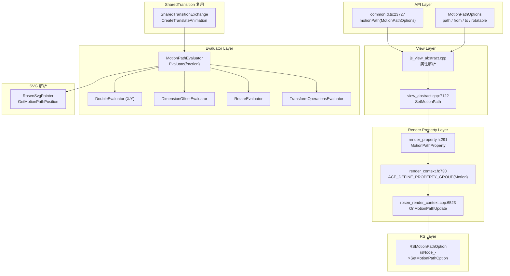
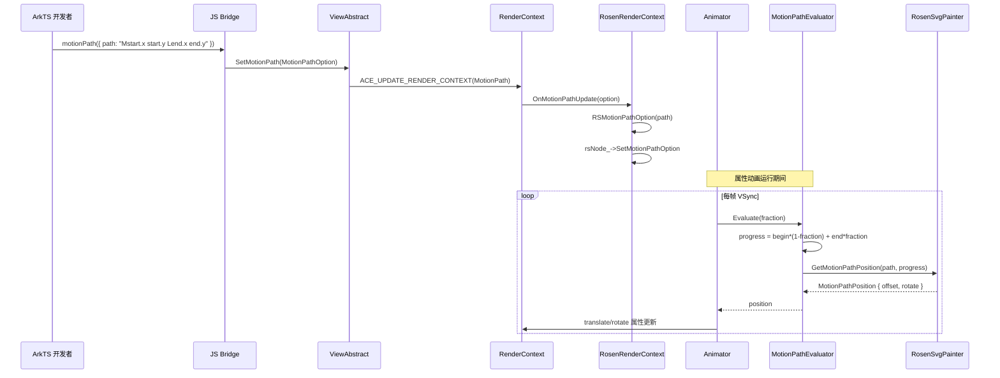
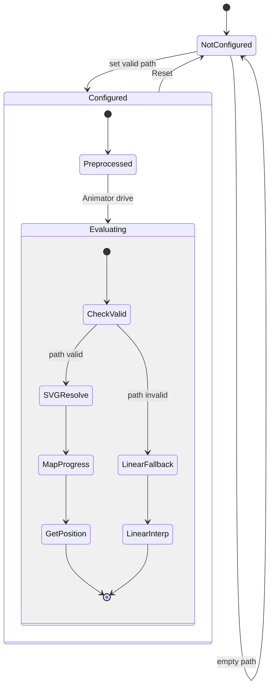

# 架构设计
> 路径动画（Motion Path）的架构设计文档，覆盖 MotionPathOption 配置、MotionPathEvaluator 求值器、SVG 路径解析、begin/end 范围映射、rotate 旋转计算及与 SharedTransition 的复用关系。

## 设计元数据

| 字段 | 内容 |
|------|------|
| Design ID | DESIGN-Func-03-02-08 |
| 关联需求 | 已有能力补录（无独立 requirement.md） |
| 关联 Epic | 无 |
| 目标 Feature | Feat-01: 路径动画全量规格（MotionPathOption / MotionPathEvaluator / SVG 路径 / rotate / SharedTransition 复用） |
| 复杂度 | 标准 |
| 目标版本 | API 7 ~ API 26+ |
| Owner | ArkUI SIG |
| 状态 | Baselined（已有实现补录） |

## 需求基线

> 需求基线详见 proposal.md。以下仅列出设计阶段需要额外强调的要点。

| 项 | 补充说明（如需） |
|----|------------------|
| SVG 路径语法 | path 支持 SVG path 语法，支持 `start.x`/`start.y`/`end.x`/`end.y` 占位符替换 |
| begin/end 范围 | begin 默认 0.0，end 默认 1.0，映射动画 fraction 到路径上的子区间 |
| rotate | rotatable 默认 false，为 true 时根据路径切线方向计算旋转角度 |
| 多 Evaluator 适配 | MotionPathEvaluator 提供 5 种子 Evaluator（X/Y/DimensionOffset/Rotate/TransformOperations） |
| SharedTransition 复用 | Exchange 类型的 translate 动画可直接使用 MotionPathEvaluator |

## 上下文和现状

### 涉及仓和模块

| 仓库 | 模块路径 | 当前职责 | 本 Feature 影响 |
|------|----------|----------|-----------------|
| ace_engine | `frameworks/core/components/common/properties/motion_path_option.h` | MotionPathOption：path/begin/end/rotate 字段 + Get/Set 方法 | 规格补录 |
| ace_engine | `frameworks/core/components/common/properties/motion_path_evaluator.h/.cpp` | MotionPathEvaluator：Evaluate + 5 种子 Evaluator 工厂方法 | 核心实现，规格补录 |
| ace_engine | `frameworks/core/components_ng/render/render_property.h` | MotionPathProperty（MotionPath 属性组） | 规格补录 |
| ace_engine | `frameworks/core/components_ng/render/render_context.h` | ACE_DEFINE_PROPERTY_GROUP(Motion, MotionPathProperty) + OnMotionPathUpdate | 规格补录 |
| ace_engine | `frameworks/core/components_ng/render/adapter/rosen_render_context.cpp` | RosenRenderContext::OnMotionPathUpdate → RSMotionPathOption | 规格补录 |
| ace_engine | `frameworks/core/components_ng/base/view_abstract.cpp` | SetMotionPath 入口（`:7122-7128`） | 规格补录 |
| interface/sdk-js | `api/@internal/component/ets/common.d.ts` | motionPath(value: MotionPathOptions) / MotionPathOptions 接口 | 规格对照 |

### 调用链层级分析

| 层 | 模块 | 职责 | 修改类型 |
|----|------|------|----------|
| SDK API | `common.d.ts:23727` `motionPath(value: MotionPathOptions)` | ArkTS 属性入口，@since 7 | 无修改（规格补录） |
| JS Bridge | `frameworks/bridge/declarative/frontend/jsview/js_view_abstract.cpp` | 解析 motionPath 属性 → 调用 ViewAbstract::SetMotionPath | 无修改（规格补录） |
| View Layer | `frameworks/core/components_ng/base/view_abstract.cpp:7122-7128` | SetMotionPath：ACE_UPDATE_RENDER_CONTEXT(MotionPath, motionPath) | 无修改（规格补录） |
| Render Property | `frameworks/core/components_ng/render/render_property.h:291-292` | MotionPathProperty：ACE_DEFINE_PROPERTY_GROUP_ITEM(MotionPath, MotionPathOption) | 无修改（规格补录） |
| Render Context | `frameworks/core/components_ng/render/render_context.h:730-732` | ACE_DEFINE_PROPERTY_GROUP(Motion) + ACE_DEFINE_PROPERTY_FUNC_WITH_GROUP(Motion, MotionPath) | 无修改（规格补录） |
| Render Adapter | `frameworks/core/components_ng/render/adapter/rosen_render_context.cpp:6523-6537` | OnMotionPathUpdate → RSMotionPathOption → rsNode_->SetMotionPathOption | 无修改（规格补录） |
| Evaluator | `frameworks/core/components/common/properties/motion_path_evaluator.h/.cpp` | MotionPathEvaluator：Evaluate(fraction) → MotionPathPosition | 无修改（规格补录） |
| SVG 解析 | `frameworks/core/components/common/painter/rosen_svg_painter.h/.cpp` | RosenSvgPainter::GetMotionPathPosition(path, progress, position) | 无修改（规格补录） |

### 适用架构规则

| Rule ID | 适用原因 | 设计结论 | 验证方式 |
|---------|----------|----------|----------|
| OH-ARCH-LAYERING | MotionPath 涉及 API → Bridge → View → RenderContext → Evaluator → SVG 解析多层 | 调用方向自上而下，Evaluator 不直接访问 Bridge | 代码评审 |
| OH-ARCH-API-LEVEL | motionPath @since 7，@crossplatform @since 10，@atomicservice @since 11 | 各版本 API 通过条件编译兼容 | API 评审 / XTS |
| OH-ARCH-SUBSYSTEM | MotionPathEvaluator 被 SharedTransitionEffect 复用 | 同仓跨模块，通过 AceType::MakeRefPtr 共享 | 依赖检查 |
| OH-ARCH-ERROR-LOG | 无专用日志标签 | SVG 解析失败时 Evaluate 返回零偏移 | 代码审查 |

## 不涉及项承接

> proposal.md 已完成 N/A 判定。本节仅对 proposal 中标记为"涉及"且需展开设计的维度给出结论。

| 维度 | 设计结论 |
|------|----------|
| 版本升级兼容 | API 7 基础功能 → API 10 跨平台 → API 11 原子化，通过 @since 标注策略保持向前兼容 |
| 跨模块复用 | MotionPathEvaluator 被 SharedTransition 的 Exchange translate 动画复用，不影响 motionPath() 属性的独立使用 |

## 关键设计决策

| 决策 ID | 问题 | 推荐方案 | 探索过的替代方案 | 取舍理由 | 影响 |
|---------|------|----------|-----------------|----------|------|
| ADR-1 | path 中的 start/end 占位符如何处理 | Preprocess 阶段将 `start.x`/`start.y`/`end.x`/`end.y` 替换为实际坐标值 | 运行时动态替换 | 预处理一次性完成，避免每帧 Evaluate 时重复替换 | AC-1.2 |
| ADR-2 | begin/end 范围如何映射 | `progress = begin * (1-fraction) + end * fraction`，将动画 fraction 映射到 [begin, end] 子区间 | 直接使用 fraction | 支持路径子区间动画，更灵活 | AC-2.1 |
| ADR-3 | 无效 path 时如何降级 | IsValid() 检查 path 为空时，Evaluate 返回 `startPoint * (1-fraction) + endPoint * fraction` 线性插值 | 报错或返回零 | 降级为直线插值，不中断动画 | AC-3.1 |
| ADR-4 | rotate 如何计算 | RosenSvgPainter::GetMotionPathPosition 返回 MotionPathPosition{offset, rotate}，rotate 为路径切线角度 | 单独计算角度 | 复用 SVG 路径解析的切线信息，一步到位 | AC-4.1 |
| ADR-5 | 多种 Evaluator 如何适配 | MotionPathEvaluator 提供 5 种工厂方法：CreateXEvaluator/CreateYEvaluator/CreateDimensionOffsetEvaluator/CreateRotateEvaluator/CreateTransformOperationsEvaluator | 单一 Evaluator | 适配 translate(x/y)、position(offset)、rotate、transform 多种动画维度 | AC-5.1 |

## 设计骨架

### 骨架范围

| 骨架项 | 目标 | 不包含 | 验证方式 |
|--------|------|--------|----------|
| MotionPathOption | path/begin/end/rotate 字段 + IsValid 判定 | SVG 路径解析（由 RosenSvgPainter 负责） | UT |
| MotionPathEvaluator | Evaluate(fraction) → MotionPathPosition，5 种子 Evaluator 工厂 | 动画驱动逻辑（由 Animator 负责） | UT |
| Preprocess | start.x/start.y/end.x/end.y 占位符替换 | 路径语法校验 | UT |
| RenderContext 集成 | OnMotionPathUpdate → RSMotionPathOption → rsNode | RS 层渲染细节 | UT |
| SharedTransition 复用 | Exchange translate 使用 MotionPathEvaluator | Exchange size/opacity 动画 | UT |

### 骨架 Spec 拆分

| Task ID | 目标 | 受影响文件 | AC |
|---------|------|-----------|-----|
| TASK-SKELETON-1 | 路径动画全量规格补录 | Feat-01-motion-path-spec.md | AC-1.1 ~ AC-5.2 |

## 后续 Task 拆分

| Task ID | 目标 | 受影响文件 | 依赖 |
|---------|------|-----------|------|
| TASK-MOTION-PATH-01 | 路径动画全量规格补录 | Feat-01-motion-path-spec.md, design.md | 无 |

## API 签名、Kit 与权限

### 新增 API

| API 签名 | 类型 | d.ts 位置 | 权限要求 | SysCap |
|----------|------|-----------|----------|--------|
| `motionPath(value: MotionPathOptions): T` | Public | `common.d.ts:23727` | 无 | SystemCapability.ArkUI.ArkUI.Full |
| `MotionPathOptions` (interface: path/from/to/rotatable) | Public | `common.d.ts:4553` | 无 | 同上 |

### 变更/废弃 API

| 原有 API | 变更类型 | 新 API | 迁移说明 |
|----------|----------|--------|----------|
| MotionPathOptions | MODIFIED | @crossplatform since 10 | 新增跨平台支持，行为兼容 |
| MotionPathOptions | MODIFIED | @atomicservice since 11 | 新增原子化服务支持，行为兼容 |

## 构建系统影响

### BUILD.gn 变更

```
# frameworks/core/components/common/properties/BUILD.gn
# MotionPathOption 和 MotionPathEvaluator 包含在 ace_engine 核心库中
# 无独立 SO 输出
```

### bundle.json 变更

路径动画作为 ace_engine 的内部能力，无独立 bundle.json 变更。

## 可选设计扩展

### 架构图



### 数据流/控制流

| 步骤 | 调用方 | 被调用方 | 数据/接口 | 说明 |
|------|--------|----------|-----------|------|
| 1 | ArkTS | motionPath(value) | MotionPathOptions | 属性设置入口 |
| 2 | JS Bridge | ViewAbstract::SetMotionPath | MotionPathOption | 转换为 C++ 结构体 |
| 3 | ViewAbstract | ACE_UPDATE_RENDER_CONTEXT | MotionPath | 写入 RenderContext |
| 4 | RenderContext | OnMotionPathUpdate | MotionPathOption | 属性变更回调 |
| 5 | RosenRenderContext | RSMotionPathOption + rsNode_->SetMotionPathOption | path 字符串 | 下发到 RS 层 |
| 6 | 动画运行 | MotionPathEvaluator::Evaluate(fraction) | fraction → MotionPathPosition | 每帧求值 |
| 7 | Evaluate | RosenSvgPainter::GetMotionPathPosition | path + progress → position | SVG 路径解析 |
| 8 | 子 Evaluator | MotionPathEvaluator::Evaluate | 转发到核心 Evaluate | 适配多种动画维度 |

### 时序设计



### 算法与状态机



### 测试性设计

| 测试层级 | 测试目标 | Mock 策略 | 验证方式 |
|----------|----------|-----------|----------|
| UT - Option | MotionPathOption Get/Set/IsValid/operator== | 直接构造对象 | gtest_filter |
| UT - Evaluator | Evaluate(fraction) 返回正确 position | Mock RosenSvgPainter | gtest_filter |
| UT - Preprocess | start.x/start.y/end.x/end.y 替换 | 直接调用 Preprocess | gtest_filter |
| UT - 子 Evaluator | DoubleEvaluator/DimensionOffsetEvaluator/RotateEvaluator/TransformOperationsEvaluator | Mock MotionPathEvaluator | gtest_filter |
| UT - RenderContext | OnMotionPathUpdate → RSMotionPathOption | MockRenderContext | gtest_filter |
| 手工 | SVG 路径动画视觉验证 | 真机 | 视觉比对 |

### 接口参数规约

| 接口 | 参数 | 类型 | 合法范围 | 非法处理 | 边界说明 |
|------|------|------|----------|----------|----------|
| motionPath | path | string | 有效 SVG path 语法 | 空字符串 → 无路径动画 | 支持 start/end 占位符 |
| MotionPathOptions.from | number | float | [0.0, 1.0] | <0 或 >1 → 默认 0.0 | 默认 0.0 |
| MotionPathOptions.to | number | float | [0.0, 1.0] | <0 或 >1 → 默认 1.0；归一化后 to >= from | 默认 1.0 |
| MotionPathOptions.rotatable | boolean | true/false | — | — | 默认 false |

## 详细设计

### MotionPathOption

`MotionPathOption`（`motion_path_option.h:24-88`）：

- 构造函数：`MotionPathOption(path, begin=0.0f, end=1.0f, rotate=false)`（`:26`）
- 字段：`path_`（string）、`begin_`（float，默认 0.0）、`end_`（float，默认 1.0）、`rotate_`（bool，默认 false）（`:84-87`）
- `IsValid()`：`!path_.empty()`（`:70-73`）
- `operator==`：比较 path/begin/end/rotate 四字段（`:75-81`）

### MotionPathEvaluator

`MotionPathEvaluator`（`motion_path_evaluator.h:39-100`）：

**构造函数**（`motion_path_evaluator.cpp:51-57`）：
- 接收 `MotionPathOption`、`start` Offset、`end` Offset、`PositionType`
- 调用 `Preprocess` 替换 path 中 `start.x`/`start.y`/`end.x`/`end.y` 为实际坐标（`:55-56`）

**Evaluate**（`motion_path_evaluator.cpp:59-77`）：
1. 如果 `NearEqual(fraction, 1.0f)`，fraction = 1.0（`:61-63`）
2. 如果 `!motionPathOption_.IsValid()`（`:64`）：返回 `startPoint_ * (1-fraction) + endPoint_ * fraction` 线性插值（`:65`）
3. 计算 `progress = motionPathOption_.GetBegin() * (1-fraction) + motionPathOption_.GetEnd() * fraction`（`:67`）
4. 调用 `RosenSvgPainter::GetMotionPathPosition(path, progress, position)`（`:70`）
5. 如果 `positionType_ == PositionType::PTOFFSET`：`position.offset += startPoint_`（`:71-72`）
6. 返回 position

**Preprocess**（`motion_path_evaluator.cpp:40-47`）：
- `ReplaceAll(path, "start.x", std::to_string(start.GetX()))`
- `ReplaceAll(path, "start.y", std::to_string(start.GetY()))`
- `ReplaceAll(path, "end.x", std::to_string(end.GetX()))`
- `ReplaceAll(path, "end.y", std::to_string(end.GetY()))`

### 子 Evaluator

MotionPathEvaluator 提供 5 种子 Evaluator 工厂方法（`motion_path_evaluator.h:50-73`）：

| 工厂方法 | 子类 | Evaluate 行为 | 适用动画维度 |
|----------|------|--------------|-------------|
| CreateXEvaluator() | DoubleEvaluator(isXAxis=true) | 返回 position.offset.GetX() | translate x |
| CreateYEvaluator() | DoubleEvaluator(isXAxis=false) | 返回 position.offset.GetY() | translate y |
| CreateDimensionOffsetEvaluator() | DimensionOffsetEvaluator | 返回 DimensionOffset(x, y) | position/offset |
| CreateRotateEvaluator() | RotateEvaluator | 返回 position.rotate | rotate |
| CreateTransformOperationsEvaluator() | TransformOperationsEvaluator | 返回 ROTATE TransformOperation | transform |

**DoubleEvaluator::Evaluate**（`motion_path_evaluator.cpp:79-91`）：转发到 `MotionPathEvaluator::Evaluate(fraction)`，按 isXAxis_ 返回 X 或 Y 坐标。

**DimensionOffsetEvaluator::Evaluate**（`:93-103`）：转发到 Evaluate，返回 DimensionOffset。

**RotateEvaluator::Evaluate**（`:105-112`）：转发到 Evaluate，返回 position.rotate。

**TransformOperationsEvaluator::Evaluate**（`:114-126`）：转发到 Evaluate，返回 ROTATE 类型 TransformOperation。

### RenderContext 集成

**MotionPathProperty**（`render_property.h:291-292`）：`ACE_DEFINE_PROPERTY_GROUP_ITEM(MotionPath, MotionPathOption)`

**RenderContext**（`render_context.h:730-732`）：
- `ACE_DEFINE_PROPERTY_GROUP(Motion, MotionPathProperty)`
- `ACE_DEFINE_PROPERTY_FUNC_WITH_GROUP(Motion, MotionPath, MotionPathOption)`

**RosenRenderContext::OnMotionPathUpdate**（`rosen_render_context.cpp:6523-6537`）：
- 如果 path 为空：`rsNode_->SetMotionPathOption(nullptr)`（`:6528`）
- 否则：创建 `Rosen::RSMotionPathOption(motionPath.GetPath())`，`rsNode_->SetMotionPathOption(...)`（`:6531-6537`）

### SharedTransition 复用

`SharedTransitionExchange::CreateTranslateAnimation`（`shared_transition_effect.cpp:135-153`）：
- 如果 `option_->motionPathOption.IsValid()`（`:135`）：
  - 创建 `MotionPathEvaluator(option_->motionPathOption, Offset(0,0), diff)`（`:136-137`）
  - `translateAnimation->SetEvaluator(motionPathEvaluator->CreateDimensionOffsetEvaluator())`（`:138`）
  - 如果 `motionPathOption.GetRotate()`（`:139`）：创建额外 rotate 动画使用 `CreateRotateEvaluator()`（`:141-152`）

## 风险和开放问题

| 项 | 类型 | 影响 | 处理方式 | Owner |
|----|------|------|----------|-------|
| SVG 路径解析依赖 RosenSvgPainter | 架构 | 低 | 路径无效时 Evaluate 返回零偏移，降级处理 | ArkUI SIG |
| from/to 超范围归一化逻辑在 SDK 层 | 设计 | 低 | SDK d.ts 注明 <0 或 >1 时按默认值处理 | ArkUI SIG |
| Preprocess 每次创建新 MotionPathEvaluator 时执行 | 性能 | 低 | 构造时一次性完成，Evaluate 时无替换开销 | ArkUI SIG |

## 设计审批

- [x] 需求基线已确认，设计覆盖 P0/P1 AC
- [x] 不涉及项已承接，N/A 和展开项都有结论
- [x] 涉及仓和模块职责清楚
- [x] 调用链层级分析完整，每层覆盖到位
- [x] 适用架构规则已识别并形成设计结论
- [x] 分层和子系统边界合规
- [x] API 变更有签名、权限、错误码和兼容性说明
- [x] BUILD.gn/bundle.json 影响明确
- [x] 设计输出和后续 Task 拆分明确
- [x] 关键设计决策有理由和影响说明
- [x] 风险和开放问题有 Owner

**结论:** 通过（已有实现补录）
