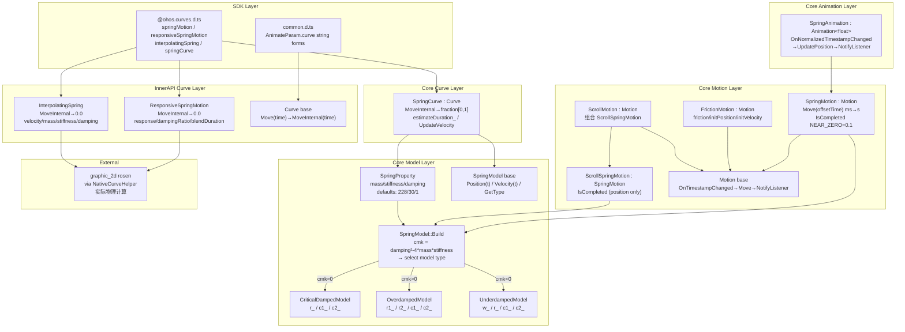
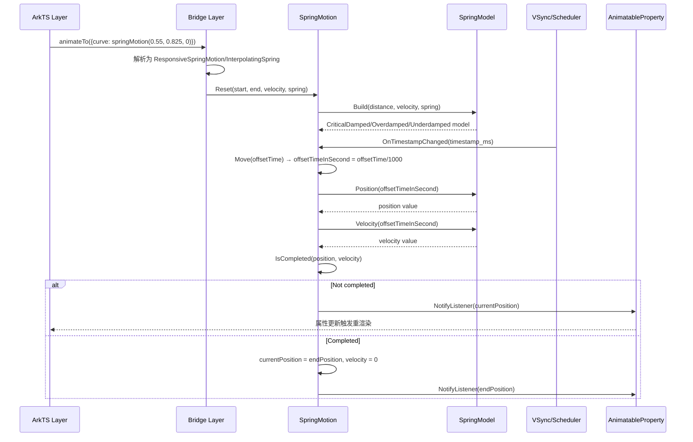
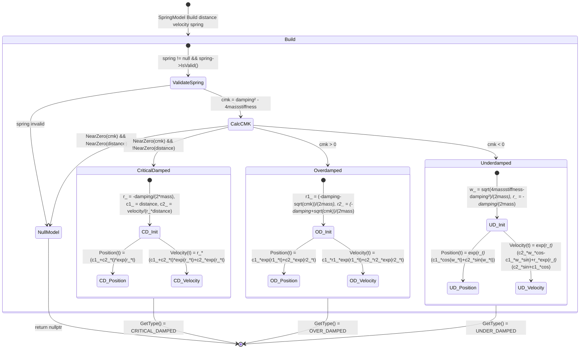

# 架构设计
> 物理动画能力域的架构设计文档，覆盖 SpringMotion / ResponsiveSpringMotion / InterpolatingSpring / SpringCurve 四条物理动画路径及其底层 SpringModel 物理方程模型。

## 设计元数据

| 字段 | 内容 |
|------|------|
| Design ID | DESIGN-Func-03-02-09 |
| 关联需求 | 已有能力补录（无独立 requirement.md） |
| 关联 Epic | 无 |
| 目标 Feature | Feat-01: 物理动画全量规格（SpringMotion / ResponsiveSpringMotion / InterpolatingSpring / SpringCurve） |
| 复杂度 | 复杂 |
| 目标版本 | API 9 ~ API 26+ |
| Owner | ArkUI SIG |
| 状态 | Baselined（已有实现补录） |

## 需求基线

> 需求基线详见 proposal.md。以下仅列出设计阶段需要额外强调的要点。

| 项 | 补充说明（如需） |
|----|------------------|
| 双路径架构 | 物理动画分 Curve-based（SpringCurve 有 duration，由 AnimateParam.duration 治理）与 Motion-based（SpringMotion 运行至 IsCompleted，无固定 duration，速度可继承）两条路径 |
| SpringModel 物理方程 | SpringModel::Build 根据 cmk 判别式（damping²-4*mass*stiffness）自动选择 CRITICAL_DAMPED / OVER_DAMPED / UNDER_DAMPED 三种物理方程 |
| duration 无效性 | springMotion / responsiveSpringMotion / interpolatingSpring 忽略 AnimateParam.duration，运行时长由物理方程和初始速度决定 |
| interpolate 不可采样 | springMotion / responsiveSpringMotion / interpolatingSpring 的 MoveInternal 返回 0.0，不可通过 ICurve.interpolate() 采样 |
| 速度继承 | 多个 spring 动画作用于同一属性时，后继动画继承前驱动画的末速度 |
| rosen 委托 | InterpolatingSpring / ResponsiveSpringMotion 的实际物理计算委托给 rosen，ace_engine 仅保存参数与 ToString |

## 上下文和现状

### 涉及仓和模块

| 仓库 | 补充架构说明 |
|------|-------------|
| ace_engine | `frameworks/core/animation/spring_model.h/.cpp` — SpringProperty(mass/stiffness/damping)、SpringModel 基类与三种阻尼模型实现；`spring_motion.h/.cpp` — SpringMotion / ScrollSpringMotion(Motion 子类)；`spring_curve.h` — SpringCurve(Curve 子类，有 estimateDuration)；`spring_animation.h` — SpringAnimation(Animation<float>)；`motion.h` — Motion 基类(OnTimestampChanged→Move→NotifyListener)；`friction_motion.h/.cpp` — FrictionMotion(Motion 子类)；`scroll_motion.h/.cpp` — ScrollMotion(组合 ScrollSpringMotion) |
| ace_engine | `interfaces/inner_api/ace_kit/include/ui/animation/curve.h` — ResponsiveSpringMotion / InterpolatingSpring(Curve 子类，MoveInternal 返回 0.0，实际实现委托 rosen) |
| interface/sdk-js | `api/@ohos.curves.d.ts` — springMotion / responsiveSpringMotion / interpolatingSpring / springCurve 公共 API 声明 |
| graphic_2d | rosen — InterpolatingSpring / ResponsiveSpringMotion 的实际物理计算实现（通过 NativeCurveHelper 桥接） |

### 调用链层级分析

| 层 | 模块 | 职责 | 修改类型 |
|----|------|------|----------|
| SDK Layer | `@ohos.curves.d.ts` springMotion / responsiveSpringMotion / interpolatingSpring / springCurve | 公共 API 声明，返回 ICurve | 无修改（规格补录） |
| ArkTS Bridge | `frameworks/bridge/declarative_frontend/` 曲线解析 | string / ICurve → RefPtr<Curve> 解析 | 无修改（规格补录） |
| InnerAPI Curve | `interfaces/inner_api/ace_kit/include/ui/animation/curve.h` ResponsiveSpringMotion / InterpolatingSpring | Curve 子类，MoveInternal 返回 0.0，保存参数 + ToString | 无修改（规格补录） |
| Core Curve | `frameworks/core/animation/spring_curve.h/.cpp` SpringCurve | Curve 子类，MoveInternal 产出 [0,1] fraction，有 estimateDuration_，UpdateVelocity | 无修改（规格补录） |
| Core Motion | `frameworks/core/animation/spring_motion.h/.cpp` SpringMotion / ScrollSpringMotion | Motion 子类，Move(offsetTime) ms→s 转换，IsCompleted via NearZero(NEAR_ZERO=0.1) | 无修改（规格补录） |
| Core Motion | `frameworks/core/animation/friction_motion.h/.cpp` FrictionMotion | Motion 子类，摩擦运动方程 | 无修改（规格补录） |
| Core Motion | `frameworks/core/animation/scroll_motion.h/.cpp` ScrollMotion | Motion 子类，组合 ScrollSpringMotion 实现过/欠滚动 | 无修改（规格补录） |
| Core Model | `frameworks/core/animation/spring_model.h/.cpp` SpringModel / CriticalDampedModel / OverdampedModel / UnderdampedModel | 物理方程实现：Position(t) / Velocity(t)，Build 工厂按 cmk 判别式选择模型 | 无修改（规格补录） |
| Core Animation | `frameworks/core/animation/spring_animation.h` SpringAnimation | Animation<float> 子类，OnNormalizedTimestampChanged→UpdatePosition→NotifyListener | 无修改（规格补录） |
| Core Base | `frameworks/core/animation/motion.h` Motion | TimeEvent + ValueListenable<double>，OnTimestampChanged→Move(timestamp)→NotifyListener | 无修改（规格补录） |
| External | graphic_2d rosen via NativeCurveHelper | InterpolatingSpring / ResponsiveSpringMotion 实际物理计算 | 外部依赖 |

### 适用架构规则

| Rule ID | 适用原因 | 设计结论 | 验证方式 |
|---------|----------|----------|----------|
| OH-ARCH-LAYERING | 物理动画涉及 SDK → Bridge → InnerAPI Curve → Core Motion/Model 多层调用 | 调用方向自上而下，Core Motion 不直接访问 Bridge 层 | 代码评审 |
| OH-ARCH-SUBSYSTEM | InterpolatingSpring / ResponsiveSpringMotion 委托 rosen 跨子系统 | 通过 NativeCurveHelper 桥接到 graphic_2d rosen，ace_engine 仅保存参数 | 依赖检查 |
| OH-ARCH-API-LEVEL | springMotion / responsiveSpringMotion @since 9，interpolatingSpring @since 10 | 各版本 API 通过 @since 标注区分 | API 评审 / XTS |

## 不涉及项承接

> proposal.md 已完成 N/A 判定。本节仅对 proposal 中标记为"涉及"且需展开设计的维度给出结论。

| 维度 | 设计结论 |
|------|----------|
| 多设备适配 | 物理动画为引擎层能力，不依赖设备类型，行为一致 |
| 深色模式 | 物理动画无颜色/主题相关属性，不涉及 |
| 无障碍 | 物理动画为引擎内部能力，无直接无障碍接口 |

## 关键设计决策

| 决策 ID | 问题 | 推荐方案 | 探索过的替代方案 | 取舍理由 | 影响 |
|---------|------|----------|-----------------|----------|------|
| ADR-1 | 物理动画是否需要固定 duration | Motion-based 路径（SpringMotion）无固定 duration，运行至 IsCompleted；Curve-based 路径（SpringCurve）有 estimateDuration 但仍由 AnimateParam.duration 治理 | 统一使用固定 duration | 物理动画的本质是基于物理方程自然衰减，固定 duration 会破坏物理真实感；Motion-based 路径让动画自然结束更符合物理直觉 | AC-1.4, AC-2.3 |
| ADR-2 | SpringModel 如何选择阻尼模型 | SpringModel::Build 按 cmk 判别式（damping²-4*mass*stiffness）自动选择：cmk≈0→CriticalDamped，cmk>0→Overdamped，cmk<0→Underdamped | 用户提供模型类型参数 | 自动选择降低了开发者理解成本；cmk 判别式是二阶 ODE 根的标准分类法，数学正确性有保证 | AC-3.1 ~ AC-3.3 |
| ADR-3 | InterpolatingSpring / ResponsiveSpringMotion 的 MoveInternal 返回 0.0 | ace_engine 仅保存参数 + ToString，实际物理计算委托 rosen via NativeCurveHelper | 在 ace_engine 内部实现物理方程 | rosen 已有成熟的物理动画引擎实现，避免重复维护；ace_engine 仅需参数传递和序列化 | AC-2.4, AC-4.2 |
| ADR-4 | SpringMotion 完成判定阈值 | NEAR_ZERO=0.1（position 和 velocity 均接近零时判定完成） | 使用更小阈值如 0.001 | 0.1 是物理动画自然停止的合理阈值，太小会导致动画尾部微小震荡无法结束；ScrollSpringMotion 重写 IsCompleted 仅判定 position | AC-1.5 |
| ADR-5 | springMotion / responsiveSpringMotion / interpolatingSpring 是否支持 interpolate() 采样 | 不支持，MoveInternal 返回 0.0，ICurve.interpolate() 不可用 | 实现采样 | 物理动画时长不确定，时间无法归一化到 [0,1]，采样无意义 | AC-2.4, AC-4.2 |
| ADR-6 | 多个 spring 动画作用于同一属性时速度如何处理 | 后继动画继承前驱动画的末速度 | 不继承，每次从 0 开始 | 速度继承保证了连续 spring 动画之间的平滑过渡，避免视觉跳变 | AC-5.1 |

## 设计骨架

### 骨架范围

| 骨架项 | 目标 | 不包含 | 验证方式 |
|--------|------|--------|----------|
| SpringModel 物理方程 | 三种阻尼模型 Position(t)/Velocity(t) + Build 工厂 | 自定义阻尼方程 | UT |
| SpringMotion (Motion-based) | SpringMotion / ScrollSpringMotion Move + IsCompleted | FrictionMotion | UT |
| SpringCurve (Curve-based) | SpringCurve MoveInternal 产出 [0,1] fraction + estimateDuration | CubicCurve | UT |
| SpringAnimation | SpringAnimation OnNormalizedTimestampChanged→UpdatePosition→NotifyListener | CurveAnimation<T> | UT |
| ResponsiveSpringMotion / InterpolatingSpring | 参数保存 + ToString + rosen 委托 | 实际物理计算（在 rosen） | UT + 手工 |
| 速度继承 | 多个 spring 动画同属性速度传递 | 跨属性速度传递 | UT + 手工 |

### 骨架 Spec 拆分

| Task ID | 目标 | 受影响文件 | AC |
|---------|------|-----------|-----|
| TASK-SKELETON-1 | 物理动画全量规格补录（SpringMotion / ResponsiveSpringMotion / InterpolatingSpring / SpringCurve / SpringModel） | Feat-01-physics-animation-spec.md | AC-1.1 ~ AC-5.3 |

## 后续 Task 拆分

| Task ID | 目标 | 受影响文件 | 依赖 |
|---------|------|-----------|------|
| TASK-PHYSICS-01 | 物理动画全量规格补录 | Feat-01-physics-animation-spec.md, design.md | 无 |

## API 签名、Kit 与权限

### 新增 API

| API 签名 | 类型 | d.ts 位置 | 权限要求 | SysCap |
|----------|------|-----------|----------|--------|
| `curves.springMotion(response?: number, dampingFraction?: number, overlapDuration?: number): ICurve` | Public | `@ohos.curves.d.ts:384` | 无 | SystemCapability.ArkUI.ArkUI.Full |
| `curves.responsiveSpringMotion(response?: number, dampingFraction?: number, overlapDuration?: number): ICurve` | Public | `@ohos.curves.d.ts:412` | 无 | SystemCapability.ArkUI.ArkUI.Full |
| `curves.interpolatingSpring(velocity: number, mass: number, stiffness: number, damping: number): ICurve` | Public | `@ohos.curves.d.ts:453` | 无 | SystemCapability.ArkUI.ArkUI.Full |
| `curves.springCurve(velocity: number, mass: number, stiffness: number, damping: number): ICurve` | Public | `@ohos.curves.d.ts:329` | 无 | SystemCapability.ArkUI.ArkUI.Full |
| `AnimateParam.curve: "spring-motion(response,dampingFraction,overlapDuration)"` | Public | `common.d.ts:4393` | 无 | SystemCapability.ArkUI.ArkUI.Full |
| `AnimateParam.curve: "responsive-spring-motion(response,dampingFraction,overlapDuration)"` | Public | `common.d.ts:4387` | 无 | SystemCapability.ArkUI.ArkUI.Full |
| `AnimateParam.curve: "interpolating-spring(velocity,mass,stiffness,damping)"` | Public | `common.d.ts:4384` | 无 | SystemCapability.ArkUI.ArkUI.Full |
| `AnimateParam.curve: "spring(velocity,mass,stiffness,damping)"` | Public | `common.d.ts:4390` | 无 | SystemCapability.ArkUI.ArkUI.Full |

### 变更/废弃 API

| 原有 API | 变更类型 | 新 API | 迁移说明 |
|----------|----------|--------|----------|
| `curves.spring(velocity, mass, stiffness, damping): string` | 废弃 | `curves.springCurve(velocity, mass, stiffness, damping): ICurve` | @deprecated since 9，@useinstead springCurve；spring 返回 string 形式，springCurve 返回 ICurve 对象 |

## 构建系统影响

### BUILD.gn 变更

物理动画为 ace_engine 核心动画模块，无独立 BUILD.gn 变更：

```
# frameworks/core/animation/BUILD.gn
# spring_model.cpp / spring_motion.cpp / spring_curve.cpp / friction_motion.cpp / scroll_motion.cpp
# 均为 ace_engine 核心编译目标的已有源文件
```

### bundle.json 变更

物理动画作为 ace_engine 内部能力，无独立 bundle.json 变更。

## 可选设计扩展

### 架构图



### 数据流/控制流

| 步骤 | 调用方 | 被调用方 | 数据/接口 | 说明 |
|------|--------|----------|-----------|------|
| 1 | ArkTS | Bridge | springMotion(r,d,o) / responsiveSpringMotion / interpolatingSpring / springCurve | 创建物理动画曲线 |
| 2 | Bridge | Curve 解析器 | RefPtr<Curve> | 解析为 ResponsiveSpringMotion / InterpolatingSpring / SpringCurve 对象 |
| 3 | AnimateParam | AnimationOption | curve_ = RefPtr<Curve> | 曲线存入动画选项 |
| 4a | Motion-based path | SpringMotion::Reset | start/end/velocity/spring | 构造 SpringMotion，调用 SpringModel::Build |
| 4b | Curve-based path | SpringCurve::MoveInternal | time→fraction | 在 [0,1] 区间插值 |
| 5 | VSync | Motion::OnTimestampChanged | timestamp(ms) | 驱动动画帧 |
| 6 | Motion::OnTimestampChanged | SpringMotion::Move | offsetTime→offsetTimeInSecond | ms→s 单位转换 |
| 7 | SpringMotion::Move | SpringModel::Position / Velocity | offsetTimeInSecond | 物理方程计算 |
| 8 | SpringMotion::Move | IsCompleted | position, velocity | NearZero 判定 |
| 9 | Motion::OnTimestampChanged | NotifyListener | currentPosition | 通知属性更新 |

### 时序设计



### 算法与状态机



### 测试性设计

| 测试层级 | 测试目标 | Mock 策略 | 验证方式 |
|----------|----------|-----------|----------|
| UT - SpringModel | CriticalDamped / Overdamped / Underdamped Position(t) / Velocity(t) 计算正确性 | 直接构造 SpringProperty + 调用 Build | gtest_filter SpringModelTest |
| UT - SpringMotion | Move(offsetTime) ms→s 转换、IsCompleted 判定、Reset | 直接构造 SpringMotion | gtest_filter SpringMotionTest |
| UT - SpringCurve | MoveInternal 产出 [0,1] fraction、estimateDuration、UpdateVelocity | 直接构造 SpringCurve | gtest_filter SpringCurveTest |
| UT - ResponsiveSpringMotion | 参数保存、ToString、MoveInternal 返回 0.0 | 直接构造 ResponsiveSpringMotion | gtest_filter |
| UT - InterpolatingSpring | 参数保存、ToString、MoveInternal 返回 0.0 | 直接构造 InterpolatingSpring | gtest_filter |
| UT - FrictionMotion | Move / IsCompleted / GetVelocityByFinalPosition | 直接构造 FrictionMotion | gtest_filter FrictionMotionTest |
| UT - ScrollMotion | MakeUnderScrollMotion / MakeOverScrollMotion 组合 | 直接构造 ScrollMotion + ExtentPair | gtest_filter ScrollMotionTest |
| 手工 | 速度继承效果验证（连续 spring 动画平滑过渡） | 真机 | 视觉比对 |

### 接口参数规约

| 接口 | 参数 | 类型 | 合法范围 | 非法处理 | 边界说明 |
|------|------|------|----------|----------|----------|
| springMotion | response | number | (0, +∞) | ≤0 使用默认 0.55 | 默认 0.55 |
| springMotion | dampingFraction | number | [0, +∞) | <0 使用默认 0.825 | 0=无阻尼,1=临界,>1=过阻尼 |
| springMotion | overlapDuration | number | [0, +∞) | <0 使用默认 0 | 默认 0 |
| responsiveSpringMotion | response | number | (0, +∞) | ≤0 使用默认 0.15 | 默认 0.15 |
| responsiveSpringMotion | dampingFraction | number | [0, +∞) | <0 使用默认 0.86 | 默认 0.86 |
| responsiveSpringMotion | overlapDuration | number | [0, +∞) | <0 使用默认 0.25 | 默认 0.25 |
| interpolatingSpring | velocity | number | (-∞, +∞) | — | 归一化速度 |
| interpolatingSpring | mass | number | (0, +∞) | ≤0 使用 1 | 默认无，必填 |
| interpolatingSpring | stiffness | number | (0, +∞) | ≤0 使用 1 | 默认无，必填 |
| interpolatingSpring | damping | number | (0, +∞) | ≤0 使用 1 | 默认无，必填 |
| springCurve | velocity | number | (-∞, +∞) | — | 归一化速度 |
| springCurve | mass | number | (0, +∞) | ≤0 使用 1 | 默认无，必填 |
| springCurve | stiffness | number | (0, +∞) | ≤0 使用 1 | 默认无，必填 |
| springCurve | damping | number | (0, +∞) | ≤0 使用 1 | 默认无，必填 |

## 详细设计

### SpringModel 物理方程

`SpringModel::Build`（`spring_model.cpp:73-92`）根据二阶常微分方程 `m*x'' + c*x' + k*x = 0` 的特征根判别式选择模型：

```
cmk = damping² - 4 * mass * stiffness   (HIGH_RATIO=4.0, LOW_RATIO=2.0)
```

- **cmk ≈ 0 (NearZero)**: 临界阻尼 → `CriticalDampedModel`（`spring_model.h:91`）
  - `r_ = -damping / (2*mass)`，`c1_ = distance`，`c2_ = velocity / (r_ * distance)`
  - `Position(t) = (c1_ + c2_*t) * exp(r_*t)`（`spring_model.cpp:106`）
  - `Velocity(t) = r_*(c1_+c2_*t)*exp(r_*t) + c2_*exp(r_*t)`（`spring_model.cpp:111-112`）
  - 特殊约束：`NearZero(distance)` 时创建失败返回 nullptr（`:81-84`）

- **cmk > 0**: 过阻尼 → `OverdampedModel`（`spring_model.h:112`）
  - `r1_ = (-damping - sqrt(cmk)) / (2*mass)`，`r2_ = (-damping + sqrt(cmk)) / (2*mass)`
  - `c1_ = distance - c2_`，`c2_ = (velocity - r1_*distance) / (r2_ - r1_)`
  - `Position(t) = c1_*exp(r1_*t) + c2_*exp(r2_*t)`（`:136`）
  - `Velocity(t) = c1_*r1_*exp(r1_*t) + c2_*r2_*exp(r2_*t)`（`:141`）

- **cmk < 0**: 欠阻尼 → `UnderdampedModel`（`spring_model.h:134`）
  - `w_ = sqrt(4*mass*stiffness - damping²) / (2*mass)`，`r_ = -damping / (2*mass)`
  - `c1_ = distance`，`c2_ = (velocity - r_*distance) / w_`
  - `Position(t) = exp(r_*t) * (c1_*cos(w_*t) + c2_*sin(w_*t))`（`:165`）
  - `Velocity(t) = exp(r_*t)*(c2_*w_*cos - c1_*w_*sin) + r_*exp(r_*t)*(c2_*sin + c1_*cos)`（`:170-173`）

### SpringProperty 默认值

`SpringProperty`（`spring_model.h:29-69`）默认值：
- `DEFAULT_STIFFNESS = 228.0`（`:57`）
- `DEFAULT_DAMPING = 30.0`（`:59`）
- `DEFAULT_MASS = 1.0`（`:61`）

`IsValid()`（`spring_model.cpp:29-35`）要求 mass/stiffness/damping 均 > 0。Setter 方法对 ≤0 值静默忽略。

### SpringMotion (Motion-based 路径)

`SpringMotion`（`spring_motion.h:27-68`）继承 `Motion`，核心流程：

1. **构造/Reset**（`spring_motion.cpp:76-82`）: `currentPosition_=start, currentVelocity_=velocity, endPosition_=end, model_=SpringModel::Build(start-end, velocity, spring)`
2. **Move(offsetTime)**（`:84-98`）:
   - 单位转换：`offsetTimeInSecond = offsetTime / 1000.0f`（UNIT_CONVERT=1000.0f，`:23`）
   - `currentPosition_ = endPosition_ + model_->Position(offsetTimeInSecond)`
   - `currentVelocity_ = model_->Velocity(offsetTimeInSecond)`
   - 若 `IsCompleted()` 则 `currentPosition_=endPosition_, currentVelocity_=0.0`
3. **IsCompleted**（`:56-59`）: `NearZero(value - endPosition_, accuracy_) && NearZero(velocity, velocityAccuracy_)`，`NEAR_ZERO=0.1`（`spring_motion.h:67`）
4. **Motion 基类**（`motion.h:41-45`）: `OnTimestampChanged→Move(timestamp)→NotifyListener(GetCurrentPosition())`

`ScrollSpringMotion`（`spring_motion.h:70-79`）重写 `IsCompleted()`（`spring_motion.cpp:104-107`）仅判定 position：`NearZero(currentPosition_ - endPosition_, accuracy_)`

### SpringCurve (Curve-based 路径)

`SpringCurve`（`spring_curve.h:24-89`）继承 `Curve`：
- `MoveInternal(time)` 产出 [0,1] 区间的 fraction
- 有 `estimateDuration_=1.0f`（`:74`），duration 由 AnimateParam.duration 治理
- `UpdateVelocity(velocity)` → `SetEndPosition(1.0f, velocity)`（`:35-39`）
- 阈值：`velocityThreshold_=0.001f`，`valueThreshold_=0.001f`（`:79-80`）

### SpringAnimation

`SpringAnimation`（`spring_animation.h:26-68`）继承 `Animation<float>`：
- `OnNormalizedTimestampChanged(normalized, reverse)`（`:47-55`）: 范围检查 [NORMALIZED_DURATION_MIN, NORMALIZED_DURATION_MAX] → `UpdatePosition(normalized)` → `NotifyListener(currentPosition_)`
- `GetCurve()` 返回关联的 Curve 对象
- 参考 config 注释：`Mass(1.0) stiffness(100.0) damping(15.0)`（`:25`）

### ResponsiveSpringMotion / InterpolatingSpring (rosen 委托)

`ResponsiveSpringMotion`（`curve.h:304-377`）：
- `MoveInternal(time)` 返回 `0.0f`（`:314-317`），注释明确 "The curve should use the curve in rosen"
- 默认值（`:364-370`）：
  - `DEFAULT_SPRING_MOTION_RESPONSE = 0.55f`
  - `DEFAULT_SPRING_MOTION_DAMPING_RATIO = 0.825f`
  - `DEFAULT_SPRING_MOTION_BLEND_DURATION = 0.0f`
  - `DEFAULT_RESPONSIVE_SPRING_MOTION_RESPONSE = 0.15f`
  - `DEFAULT_RESPONSIVE_SPRING_MOTION_DAMPING_RATIO = 0.86f`
  - `DEFAULT_RESPONSIVE_SPRING_MOTION_BLEND_DURATION = 0.25f`
  - `DEFAULT_RESPONSIVE_SPRING_AMPLITUDE_RATIO = 0.001f`

`InterpolatingSpring`（`curve.h:379-466`）：
- `MoveInternal(time)` 返回 `0.0f`（`:389-392`），同样注释委托 rosen
- 默认值（`:456-458`）：
  - `DEFAULT_INTERPOLATING_SPRING_MASS = 1.0f`
  - `DEFAULT_INTERPOLATING_SPRING_VELOCITY = 0.0f`
  - `DEFAULT_INTERPOLATING_SPRING_AMPLITUDE_RATIO = 0.00025f`

### 其他物理 Motion

`FrictionMotion`（`friction_motion.h:25-62`）：摩擦运动方程，`DEFAULT_MULTIPLIER=60.0f`（`:23`），支持 `GetVelocityByFinalPosition` 反推速度。

`ScrollMotion`（`scroll_motion.h:46-80`）：组合 `ScrollSpringMotion` 实现 over/under scroll，通过 `MakeUnderScrollMotion`（`:62-65`）和 `MakeOverScrollMotion`（`:67-70`）按边界条件创建不同的 spring motion。

## 风险和开放问题

| 项 | 类型 | 影响 | 处理方式 | Owner |
|----|------|------|----------|-------|
| InterpolatingSpring / ResponsiveSpringMotion 实际计算在 rosen | 架构 | 中 | ace_engine 仅保存参数，跨子系统依赖 rosen via NativeCurveHelper；需在文档中明确边界 | ArkUI SIG |
| springMotion / responsiveSpringMotion / interpolatingSpring 不可通过 interpolate() 采样 | API | 中 | MoveInternal 返回 0.0，ICurve.interpolate() 不可用；需在 SDK 文档中明确标注 | ArkUI SIG |
| springMotion 等忽略 AnimateParam.duration | API | 中 | 物理动画时长由方程决定；SDK 文档已明确说明 duration 不生效 | ArkUI SIG |
| 速度继承行为文档化不足 | 文档 | 低 | 多个 spring 动画同属性速度继承行为需在开发者文档中补充说明 | ArkUI SIG |
| SpringCurve deprecated string 形式 spring() | 兼容性 | 低 | @deprecated since 9，@useinstead springCurve；string 形式仅旧版 API 7 动态模型支持 | ArkUI SIG |

## 设计审批

- [x] 需求基线已确认，设计覆盖 P0/P1 AC
- [x] 不涉及项已承接，N/A 和展开项都有结论
- [x] 涉及仓和模块职责清楚
- [x] 调用链层级分析完整，每层覆盖到位
- [x] 适用架构规则已识别并形成设计结论
- [x] 分层和子系统边界合规
- [x] API 变更有签名、权限、错误码和兼容性说明
- [x] BUILD.gn/bundle.json 影响明确
- [x] 设计输出和后续 Task 拆分明确
- [x] 关键设计决策有理由和影响说明
- [x] 风险和开放问题有 Owner

**结论:** 通过（已有实现补录）
