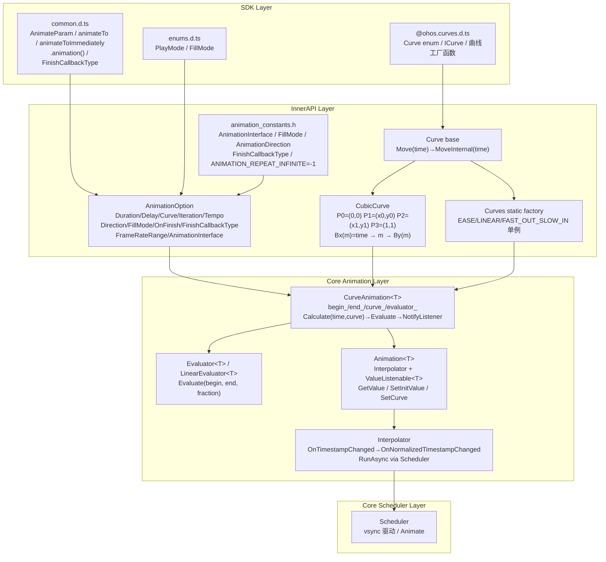
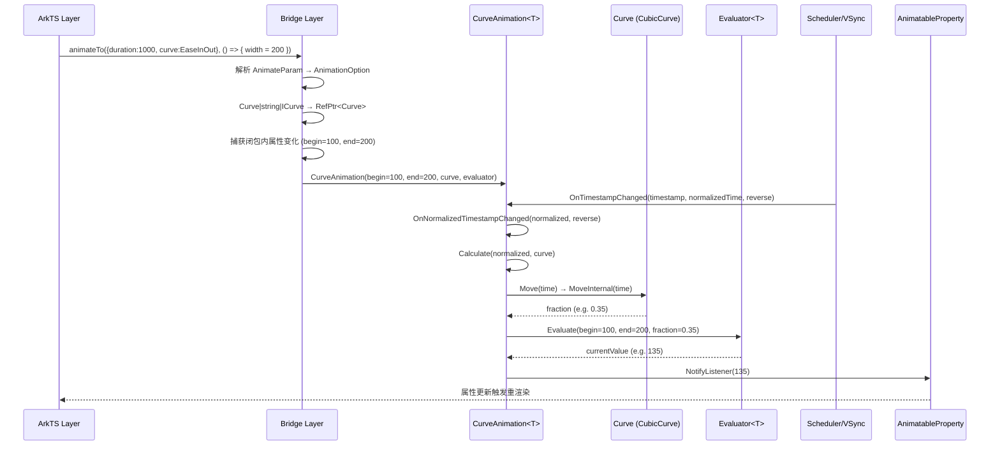
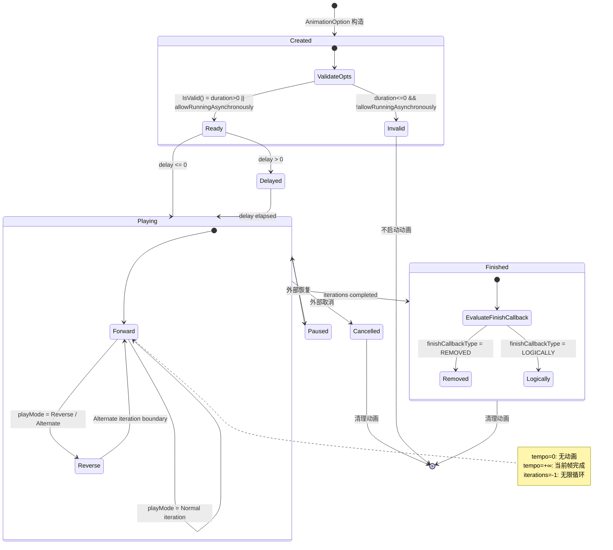

# 架构设计
> 动画接口能力域的架构设计文档，覆盖 animateTo / animateToImmediately / keyframeAnimateTo / .animation() 属性 / UIContext 动画接口的统一参数模型、曲线解析、求值管线和调度驱动。

## 设计元数据

| 字段 | 内容 |
|------|------|
| Design ID | DESIGN-Func-03-02-10 |
| 关联需求 | 已有能力补录（无独立 requirement.md） |
| 关联 Epic | 无 |
| 目标 Feature | Feat-01: 动画接口全量规格（animateTo / animateToImmediately / keyframeAnimateTo / .animation() / UIContext 动画接口） |
| 复杂度 | 复杂 |
| 目标版本 | API 7 ~ API 26+ |
| Owner | ArkUI SIG |
| 状态 | Baselined（已有实现补录） |

## 需求基线

> 需求基线详见 proposal.md。以下仅列出设计阶段需要额外强调的要点。

| 项 | 补充说明（如需） |
|----|------------------|
| 统一参数模型 | animateTo / animateToImmediately / keyframeAnimateTo / .animation() 均使用 AnimateParam 作为统一参数模型，C++ 侧对应 AnimationOption |
| 曲线解析 | AnimateParam.curve 支持 Curve \| string \| ICurve 三种形式，解析为 RefPtr<Curve>；Curve 子类包括 CubicCurve / StepsCurve / CustomCurve / SpringCurve / ResponsiveSpringMotion / InterpolatingSpring |
| 求值管线 | CurveAnimation<T>::Calculate(time, curve) → evaluator_->Evaluate(begin, end, curve->Move(time)) → NotifyListener(value) → 属性更新 |
| 调度驱动 | Scheduler 驱动 vsync，Interpolator::OnTimestampChanged → OnNormalizedTimestampChanged |
| AnimationInterface 枚举 | AnimationOption 通过 AnimationInterface 枚举标记动画来源（ANIMATE_TO / ANIMATE_TO_IMMEDIATELY / KEYFRAME_ANIMATE_TO / ANIMATION / TRANSITION / SHARED_TRANSITION / PAGE_TRANSITION）用于 metrics/tracing |
| 动画迁移 | animateTo @deprecated since 18 → UIContext.animateTo；string 返回值的曲线工厂 @deprecated since 9 → ICurve 版本 |
| duration 上限 | ArkTS widget duration 上限：API<26 为 1000ms，API≥26 为 2000ms |

## 上下文和现状

### 涉及仓和模块

| 仓库 | 补充架构说明 |
|------|-------------|
| ace_engine | `interfaces/inner_api/ace_kit/include/ui/animation/animation_option.h` — AnimationOption 类（Duration/Delay/Curve/Iteration/Tempo/Direction/FillMode/OnFinishEvent/AllowRunningAsynchronously/FinishCallbackType/FrameRateRange/AnimationInterface） |
| ace_engine | `interfaces/inner_api/ace_kit/include/ui/animation/animation_constants.h` — AnimationInterface / FillMode / AnimationDirection / AnimationOperation / AnimationType / FinishCallbackType / AnimationPropertyType / CancelAnimationStatus 枚举，ANIMATION_REPEAT_INFINITE=-1 |
| ace_engine | `interfaces/inner_api/ace_kit/include/ui/animation/curve.h` — Curve 基类（Move→MoveInternal）、LinearCurve / SineCurve / DecelerationCurve / ElasticsCurve / StepsCurve / CustomCurve / ResponsiveSpringMotion / InterpolatingSpring、ReverseCurve / ComplementaryCurve |
| ace_engine | `interfaces/inner_api/ace_kit/include/ui/animation/cubic_curve.h` — CubicCurve（P0=(0,0) P1=(x0,y0) P2=(x1,y1) P3=(1,1)，MoveInternal 解 Bx(m)=time 求 m 返回 By(m)，cubicErrorBound_=0.001） |
| ace_engine | `interfaces/inner_api/ace_kit/include/ui/animation/curves.h` — Curves 静态工厂（EASE/LINEAR/EASE_IN_OUT/FAST_OUT_SLOW_IN 等单例，ToString） |
| ace_engine | `frameworks/core/animation/curve_animation.h` — CurveAnimation<T>（begin/end/curve/evaluator，Calculate→evaluator_->Evaluate(begin,end,curve->Move(time))） |
| ace_engine | `frameworks/core/animation/evaluator.h` — Evaluator<T> 基类、LinearEvaluator<T>（lerp）、LinearEvaluator<Color>（gamma 线性空间插值） |
| ace_engine | `frameworks/core/animation/animation.h` — Animation<T>（Interpolator + ValueListenable<T>，GetValue 纯虚，SetInitValue，SetCurve 虚） |
| ace_engine | `frameworks/core/animation/interpolator.h` — Interpolator（TimeEvent 子类，OnTimestampChanged→OnNormalizedTimestampChanged，RunAsync via Scheduler） |
| interface/sdk-js | `api/@internal/component/ets/common.d.ts` — AnimateParam 接口、animateTo / animateToImmediately 函数、FinishCallbackType 枚举 |
| interface/sdk-js | `api/@internal/component/ets/enums.d.ts` — FillMode / PlayMode 枚举 |
| interface/sdk-js | `api/@ohos.curves.d.ts` — Curve 枚举、ICurve 接口、initCurve / stepsCurve / cubicBezierCurve / springCurve / springMotion / responsiveSpringMotion / interpolatingSpring / customCurve 函数 |

### 调用链层级分析

| 层 | 模块 | 职责 | 修改类型 |
|----|------|------|----------|
| SDK Layer | `common.d.ts` animateTo / animateToImmediately / .animation() / AnimateParam / FinishCallbackType | 公共 API 声明 | 无修改（规格补录） |
| SDK Layer | `enums.d.ts` FillMode / PlayMode | 枚举声明 | 无修改（规格补录） |
| SDK Layer | `@ohos.curves.d.ts` Curve / ICurve / 曲线工厂函数 | 曲线 API 声明 | 无修改（规格补录） |
| ArkTS Bridge | `frameworks/bridge/declarative_frontend/` animateTo / animation 属性解析 | AnimateParam → AnimationOption 解析 | 无修改（规格补录） |
| InnerAPI | `animation_option.h` AnimationOption | 统一参数模型（Duration/Delay/Curve/Iteration/Tempo/Direction/FillMode/OnFinish/...） | 无修改（规格补录） |
| InnerAPI | `animation_constants.h` 枚举 | AnimationInterface / FillMode / AnimationDirection / FinishCallbackType 枚举 | 无修改（规格补录） |
| InnerAPI | `curve.h` Curve 基类 / `cubic_curve.h` CubicCurve | Move(time)→MoveInternal(time) 曲线插值 | 无修改（规格补录） |
| InnerAPI | `curves.h` Curves 静态工厂 | EASE/LINEAR/FAST_OUT_SLOW_IN 等单例 | 无修改（规格补录） |
| Core Animation | `curve_animation.h` CurveAnimation<T> | Calculate(time,curve)→evaluator_->Evaluate(begin,end,curve->Move(time))→NotifyListener | 无修改（规格补录） |
| Core Animation | `evaluator.h` Evaluator<T> / LinearEvaluator<T> | Evaluate(begin, end, fraction) 线性插值 | 无修改（规格补录） |
| Core Animation | `animation.h` Animation<T> | Interpolator + ValueListenable<T>，GetValue/SetInitValue/SetCurve | 无修改（规格补录） |
| Core Animation | `interpolator.h` Interpolator | OnTimestampChanged→OnNormalizedTimestampChanged，RunAsync via Scheduler | 无修改（规格补录） |
| Core Scheduler | `frameworks/core/animation/scheduler.h` Scheduler | vsync 驱动，Animate | 无修改（规格补录） |

### 适用架构规则

| Rule ID | 适用原因 | 设计结论 | 验证方式 |
|---------|----------|----------|----------|
| OH-ARCH-LAYERING | 动画接口涉及 SDK → Bridge → InnerAPI → Core 多层调用 | 调用方向自上而下，Core Animation 不直接访问 Bridge 层 | 代码评审 |
| OH-ARCH-API-LEVEL | animateTo @since 7 @deprecated 18, animateToImmediately @since 12, keyframeAnimateTo @since 11, UIContext.animateTo @since 18 | 各版本 API 通过 @since/@deprecated/@useinstead 标注区分 | API 评审 / XTS |
| OH-ARCH-COMPONENT-BUILD | 动画接口为 ace_engine 核心能力，无独立组件化 | 无 BUILD.gn/bundle.json 变更 | 构建验证 |
| OH-ARCH-ERROR-LOG | AnimationOption::IsValid / Interpolator::RunAsync 等关键路径有 LOGE/LOGW | hilog 标签覆盖关键路径 | 单测/hilog |

## 不涉及项承接

> proposal.md 已完成 N/A 判定。本节仅对 proposal 中标记为"涉及"且需展开设计的维度给出结论。

| 维度 | 设计结论 |
|------|----------|
| 多设备适配 | 动画接口为引擎层能力，不依赖设备类型，行为一致 |
| 深色模式 | 动画接口无颜色/主题相关属性，不涉及 |
| 无障碍 | 动画接口为引擎内部能力，无直接无障碍接口 |
| 版本升级 | animateTo @deprecated since 18 → UIContext.animateTo；string 返回值的曲线工厂 @deprecated since 9 → ICurve 版本；duration 上限 API 26 变更 |

## 关键设计决策

| 决策 ID | 问题 | 推荐方案 | 探索过的替代方案 | 取舍理由 | 影响 |
|---------|------|----------|-----------------|----------|------|
| ADR-1 | 动画接口参数模型统一 | animateTo / animateToImmediately / keyframeAnimateTo / .animation() 均使用 AnimateParam，C++ 侧对应 AnimationOption | 每个接口独立参数类 | 统一参数模型降低维护成本，开发者学习一次即可用于所有动画接口 | AC-1.1, AC-2.1, AC-3.1, AC-4.1 |
| ADR-2 | AnimateParam.curve 多类型支持 | 支持 Curve \| string \| ICurve 三种形式，解析为 RefPtr<Curve> | 仅支持 Curve 枚举 | string 形式支持声明式动画语法糖，ICurve 支持动态创建曲线对象 | AC-5.1 ~ AC-5.3 |
| ADR-3 | 求值管线设计 | CurveAnimation<T>::Calculate(time, curve) → evaluator_->Evaluate(begin, end, curve->Move(time)) → NotifyListener(value) | 直接在属性上插值 | Evaluator 模式支持泛型类型插值（float/Color/Dimension 等），Color 在 gamma 线性空间插值 | AC-6.1, AC-6.2 |
| ADR-4 | CubicCurve 求值算法 | MoveInternal 解 Bx(m)=time 求 m（二分法），返回 By(m)，cubicErrorBound_=0.001 | 预计算查找表 | 二分法实现简洁，精度可调；查找表会增加内存开销 | AC-5.2 |
| ADR-5 | animateTo 废弃迁移 | @deprecated since 18 → UIContext.animateTo | 保留 animateTo | UIContext 版本绑定 UI 实例上下文，更安全；animateTo 全局函数在多实例场景有歧义 | AC-1.2 |
| ADR-6 | duration 上限变更 | API<26 上限 1000ms，API≥26 上限 2000ms | 统一 2000ms | 提升上限支持更复杂的动画场景；通过 PlatformVersion 保持旧版本行为不变 | AC-1.3 |
| ADR-7 | AnimationInterface 枚举用途 | AnimationOption 通过 AnimationInterface 标记动画来源（ANIMATE_TO / ANIMATE_TO_IMMEDIATELY / KEYFRAME_ANIMATE_TO / ANIMATION / TRANSITION / ...） | 不标记来源 | 用于 metrics/tracing 追踪动画来源，支持性能分析和问题定位 | AC-7.1 |
| ADR-8 | tempo=0 和 tempo=+∞ 行为 | tempo=0 无动画，tempo=+∞ 当前帧完成 | 禁止 0 和 +∞ | tempo=0 支持瞬时属性变更场景，tempo=+∞ 支持立即完成回调场景 | AC-1.4 |
| ADR-9 | iterations=-1 无限循环 | ANIMATION_REPEAT_INFINITE=-1 表示无限循环 | 使用 0 或特殊值 | -1 语义清晰，与 0（无动画）区分 | AC-1.5 |
| ADR-10 | string 返回值曲线工厂废弃 | init / steps / cubicBezier / spring @deprecated since 9 → initCurve / stepsCurve / cubicBezierCurve / springCurve（返回 ICurve） | 保留 string 形式 | ICurve 提供 interpolate() 方法支持运行时采样，string 形式无法采样 | AC-5.3 |
| ADR-11 | .animation() 不可在 attributeModifier 中调用 | .animation() 属性限制在 attributeModifier 之外使用 | 允许在 attributeModifier 中调用 | attributeModifier 的设计意图是属性设置而非动画声明，混用会导致动画上下文混乱 | AC-4.2 |
| ADR-12 | finishCallbackType 设计 | REMOVED（动画完全移除后回调）和 LOGICALLY（逻辑进入衰减态即回调）两种 | 仅 REMOVED | LOGICALLY 支持 spring 等长尾动画的及时回调，避免等待完全衰减 | AC-1.6 |

## 设计骨架

### 骨架范围

| 骨架项 | 目标 | 不包含 | 验证方式 |
|--------|------|--------|----------|
| AnimationOption 统一参数模型 | Duration/Delay/Curve/Iteration/Tempo/Direction/FillMode/OnFinish/FinishCallbackType/FrameRateRange/AnimationInterface | 具体动画属性 | UT |
| AnimateParam → AnimationOption 解析 | Curve\|string\|ICurve → RefPtr<Curve> 解析 | 具体曲线实现 | UT |
| Curve 求值管线 | CurveAnimation<T>::Calculate → evaluator_->Evaluate → NotifyListener | Motion-based 动画 | UT |
| CubicCurve 贝塞尔求解 | MoveInternal 解 Bx(m)=time 返回 By(m) | SpringCurve | UT |
| Curves 静态工厂 | EASE/LINEAR/FAST_OUT_SLOW_IN 等单例 | CustomCurve | UT |
| 动画接口入口 | animateTo / animateToImmediately / keyframeAnimateTo / .animation() | 页面转场/共享元素转场 | UT + 手工 |
| AnimationInterface 枚举 | UNKNOWN/ANIMATION/ANIMATE_TO/.../PAGE_TRANSITION 标记 | 具体追踪实现 | 代码审查 |

### 骨架 Spec 拆分

| Task ID | 目标 | 受影响文件 | AC |
|---------|------|-----------|-----|
| TASK-SKELETON-1 | 动画接口全量规格补录（animateTo / animateToImmediately / keyframeAnimateTo / .animation() / UIContext / AnimationOption / Curve / Evaluator） | Feat-01-animation-interface-spec.md | AC-1.1 ~ AC-7.2 |

## 后续 Task 拆分

| Task ID | 目标 | 受影响文件 | 依赖 |
|---------|------|-----------|------|
| TASK-ANIM-IFACE-01 | 动画接口全量规格补录 | Feat-01-animation-interface-spec.md, design.md | 无 |

## API 签名、Kit 与权限

### 新增 API

| API 签名 | 类型 | d.ts 位置 | 权限要求 | SysCap |
|----------|------|-----------|----------|--------|
| `declare function animateTo(value: AnimateParam, event: () => void): void` | Public | `common.d.ts:7082` | 无 | SystemCapability.ArkUI.ArkUI.Full |
| `declare function animateToImmediately(value: AnimateParam, event: () => void): void` | Public | `common.d.ts:7095` | 无 | SystemCapability.ArkUI.ArkUI.Full |
| `animation(value: AnimateParam): T` | Public | `common.d.ts:21450` | 无 | SystemCapability.ArkUI.ArkUI.Full |
| `declare interface AnimateParam` | Public | `common.d.ts:4301` | 无 | SystemCapability.ArkUI.ArkUI.Full |
| `declare enum FinishCallbackType { REMOVED = 0, LOGICALLY = 1 }` | Public | `common.d.ts:4216` | 无 | SystemCapability.ArkUI.ArkUI.Full |
| `declare enum PlayMode { Normal, Reverse, Alternate, AlternateReverse }` | Public | `enums.d.ts:1215` | 无 | SystemCapability.ArkUI.ArkUI.Full |
| `declare enum FillMode { None, Forwards, Backwards, Both }` | Public | `enums.d.ts:1149` | 无 | SystemCapability.ArkUI.ArkUI.Full |
| `curves.initCurve(curve?: Curve): ICurve` | Public | `@ohos.curves.d.ts:197` | 无 | SystemCapability.ArkUI.ArkUI.Full |
| `curves.stepsCurve(count: number, end: boolean): ICurve` | Public | `@ohos.curves.d.ts:226` | 无 | SystemCapability.ArkUI.ArkUI.Full |
| `curves.cubicBezierCurve(x1, y1, x2, y2): ICurve` | Public | `@ohos.curves.d.ts:277` | 无 | SystemCapability.ArkUI.ArkUI.Full |
| `curves.customCurve(interpolate: (fraction: number) => number): ICurve` | Public | `@ohos.curves.d.ts:245` | 无 | SystemCapability.ArkUI.ArkUI.Full |
| `interface ICurve { interpolate(fraction: number): number }` | Public | `@ohos.curves.d.ts:171` | 无 | SystemCapability.ArkUI.ArkUI.Full |

### 变更/废弃 API

| 原有 API | 变更类型 | 新 API | 迁移说明 |
|----------|----------|--------|----------|
| `animateTo(value: AnimateParam, event: () => void): void` | 废弃 | `UIContext.animateTo` | @deprecated since 18，@useinstead ohos.arkui.UIContext.UIContext#animateTo |
| `curves.init(curve?: Curve): string` | 废弃 | `curves.initCurve(curve?: Curve): ICurve` | @deprecated since 9，@useinstead initCurve |
| `curves.steps(count: number, end: boolean): string` | 废弃 | `curves.stepsCurve(count: number, end: boolean): ICurve` | @deprecated since 9，@useinstead stepsCurve |
| `curves.cubicBezier(x1, y1, x2, y2): string` | 废弃 | `curves.cubicBezierCurve(x1, y1, x2, y2): ICurve` | @deprecated since 9，@useinstead cubicBezierCurve |
| `curves.spring(velocity, mass, stiffness, damping): string` | 废弃 | `curves.springCurve(velocity, mass, stiffness, damping): ICurve` | @deprecated since 9，@useinstead springCurve |

## 构建系统影响

### BUILD.gn 变更

动画接口为 ace_engine 核心动画模块，无独立 BUILD.gn 变更：

```
# frameworks/core/animation/BUILD.gn
# curve_animation.h / evaluator.h / animation.h / interpolpolator.h
# 均为 ace_engine 核心编译目标的已有源文件
# interfaces/inner_api/ace_kit/include/ui/animation/ 下文件为 InnerAPI 头文件
```

### bundle.json 变更

动画接口作为 ace_engine 内部能力，无独立 bundle.json 变更。

## 可选设计扩展

### 架构图



### 数据流/控制流

| 步骤 | 调用方 | 被调用方 | 数据/接口 | 说明 |
|------|--------|----------|-----------|------|
| 1 | ArkTS | animateTo / animateToImmediately | AnimateParam, event closure | 动画入口 |
| 2 | Bridge | AnimationOption 构造 | Duration/Delay/Curve/Iteration/Tempo/... | 解析 AnimateParam 为 AnimationOption |
| 3 | Bridge | Curve 解析器 | Curve\|string\|ICurve → RefPtr<Curve> | 曲线类型解析 |
| 4 | Bridge | 属性变化检测 | begin/end value | 闭包内属性变更捕获 |
| 5 | Bridge | CurveAnimation<T> 构造 | begin, end, curve, evaluator | 创建动画对象 |
| 6 | Scheduler | Interpolator::OnTimestampChanged | timestamp, normalizedTime | vsync 驱动 |
| 7 | Interpolator | OnNormalizedTimestampChanged | normalized [0,1] | 归一化时间分发 |
| 8 | CurveAnimation<T> | Calculate(normalized, curve) | time, curve | 求值入口 |
| 9 | CurveAnimation<T> | curve->Move(time) | fraction | 曲线插值 |
| 10 | CurveAnimation<T> | evaluator_->Evaluate(begin, end, fraction) | currentValue | 求值 |
| 11 | CurveAnimation<T> | ValueListenable<T>::NotifyListener | currentValue | 通知属性更新 |
| 12 | 属性 | 触发重渲染 | currentValue | UI 更新 |

### 时序设计



### 算法与状态机



### 测试性设计

| 测试层级 | 测试目标 | Mock 策略 | 验证方式 |
|----------|----------|-----------|----------|
| UT - AnimationOption | Duration/Delay/Curve/Iteration/Tempo/Direction/FillMode 设置与获取 | 直接构造 AnimationOption | gtest_filter AnimationOptionTest |
| UT - CubicCurve | MoveInternal 贝塞尔求解精度、ToString、IsEqual | 直接构造 CubicCurve | gtest_filter CubicCurveTest |
| UT - CurveAnimation | Calculate 求值、NotifyListener 通知、SetCurve | MockEvaluator | gtest_filter CurveAnimationTest |
| UT - Evaluator | LinearEvaluator lerp、LinearEvaluator<Color> gamma 插值 | 直接构造 Evaluator | gtest_filter EvaluatorTest |
| UT - Curves 工厂 | EASE/LINEAR/FAST_OUT_SLOW_IN 单例非空、ToString | 直接访问 Curves:: 静态成员 | gtest_filter CurvesTest |
| UT - Interpolator | OnTimestampChanged→OnNormalizedTimestampChanged、RunAsync | MockScheduler | gtest_filter InterpolatorTest |
| UT - Animation<T> | GetValue、SetInitValue、OnInitNotify | 直接构造 Animation 子类 | gtest_filter AnimationTest |
| 手工 | animateTo 动画效果视觉验证 | 真机 | 视觉比对 |

### 接口参数规约

| 接口 | 参数 | 类型 | 合法范围 | 非法处理 | 边界说明 |
|------|------|------|----------|----------|----------|
| animateTo | duration | number | [0, +∞)，API<26 上限 1000ms，API≥26 上限 2000ms | <0 钳为 0，浮点取整，超上限钳为上限 | 默认 1000 |
| animateTo | tempo | number | [0, +∞) | <0 钳为 0 | 0=无动画，+∞=当前帧完成 |
| animateTo | delay | number | (-∞, +∞) | 浮点取整 | 负值提前播放 |
| animateTo | iterations | number | [-1, +∞) | 浮点取整 | -1=无限循环，0=无动画 |
| animateTo | curve | Curve\|string\|ICurve | 有效曲线 | 默认 EaseInOut | string 支持预定义名称和参数化形式 |
| animateTo | playMode | PlayMode | Normal/Reverse/Alternate/AlternateReverse | 默认 Normal | Alternate 建议奇数次 |
| animateTo | finishCallbackType | FinishCallbackType | REMOVED/LOGICALLY | 默认 REMOVED | LOGICALLY @since 11 |
| curves.cubicBezierCurve | x1 | number | [0, 1] | <0→0, >1→1 | P1 X 坐标 |
| curves.cubicBezierCurve | y1 | number | (-∞, +∞) | — | P1 Y 坐标 |
| curves.cubicBezierCurve | x2 | number | [0, 1] | <0→0, >1→1 | P2 X 坐标 |
| curves.cubicBezierCurve | y2 | number | (-∞, +∞) | — | P2 Y 坐标 |
| curves.stepsCurve | count | number | [1, +∞) | <1→1 | 正整数 |
| curves.customCurve | interpolate | function | (fraction: number) => number | — | fraction∈[0,1]，返回∈[0,1] |

## 详细设计

### AnimationOption 统一参数模型

`AnimationOption`（`animation_option.h:42-240`）是所有动画接口的 C++ 侧参数模型：

| 字段 | 类型 | 默认值 | 说明 | 源码行 |
|------|------|--------|------|--------|
| duration_ | int32_t | 0 | 动画时长（ms） | `:228` |
| delay_ | int32_t | 0 | 延迟（ms） | `:229` |
| iteration_ | int32_t | 1 | 迭代次数，-1=无限 | `:230` |
| tempo_ | float | 1.0f | 播放速度 | `:231` |
| fillMode_ | FillMode | FORWARDS | 填充模式 | `:232` |
| animationInterface_ | AnimationInterface | UNKNOWN | 动画来源标记 | `:233` |
| allowRunningAsynchronously_ | bool | false | 是否允许异步运行 | `:234` |
| curve_ | RefPtr<Curve> | nullptr | 动画曲线 | `:235` |
| onFinishEvent_ | function<void()> | — | 完成回调 | `:236` |
| direction_ | AnimationDirection | NORMAL | 播放方向 | `:237` |
| finishCallbackType_ | FinishCallbackType | REMOVED | 完成回调类型 | `:238` |
| rateRange_ | RefPtr<FrameRateRange> | — | 帧率范围 | `:239` |

`IsValid()`（`:137-140`）：`GetDuration() > 0 || GetAllowRunningAsynchronously()`

`SetIteration(int32_t)`（`:76-82`）：`iteration < 0 && iteration != ANIMATION_REPEAT_INFINITE` 时忽略

`SetTempo(float)`（`:89-95`）：`tempo < 0.0f` 时忽略

### AnimationInterface 枚举

`AnimationInterface`（`animation_constants.h:98-107`）用于追踪动画来源：

| 值 | 枚举 | 字符串映射 | 说明 |
|----|------|-----------|------|
| -1 | UNKNOWN | "unknown" | 未知来源 |
| 0 | ANIMATION | "animation" | .animation() 属性 |
| 1 | ANIMATE_TO | "animateTo" | animateTo 全局函数 |
| 2 | ANIMATE_TO_IMMEDIATELY | "animateToImmediately" | animateToImmediately |
| 3 | KEYFRAME_ANIMATE_TO | "keyframeAnimateTo" | keyframeAnimateTo |
| 4 | TRANSITION | "transition" | 组件转场 |
| 5 | SHARED_TRANSITION | "sharedTransition" | 共享元素转场 |
| 6 | PAGE_TRANSITION | "pageTransition" | 页面转场 |

字符串映射表 `animationTypeToStrMap`（`animation_option.h:31-40`）。

### Curve 基类与求值

`Curve`（`curve.h:36-67`）基类：
- `Move(float time)`（`:45-49`）→ `MoveInternal(time)`，time ∈ [0,1]
- `MoveInternal(float time)` 纯虚（`:52`）
- `ToString()` / `ToSimpleString()` 虚方法（`:53-61`）
- `IsEqual(const RefPtr<Curve>&)` 虚方法（`:63-66`）

`CubicCurve`（`cubic_curve.h:30-74`）：
- 三阶贝塞尔：`B(m) = (1-m)³*P0 + 3m(1-m)²*P1 + 3m²*(1-m)*P2 + m³*P3`
- `P0=(0,0), P1=(x0_,y0_), P2=(x1_,y1_), P3=(1,1)`
- `Bx(m) = 3m(1-m)²*x0_ + 3m²*x1_ + m³`
- `By(m) = 3m(1-m)²*y0_ + 3m²*y1_ + m³`
- MoveInternal: 解 `Bx(m) = time` 求 `m`（二分法，精度 `cubicErrorBound_=0.001f`），返回 `By(m)`（`:67`）
- `CalculateCubic(float a, float b, float m)` 静态方法（`:65`）

`Curves` 静态工厂（`curves.h:26-50`）：
- 单例：`LINEAR`（LinearCurve）、`EASE`/`EASE_IN`/`EASE_OUT`/`EASE_IN_OUT`/`FAST_OUT_SLOW_IN`/`LINEAR_OUT_SLOW_IN`/`FAST_OUT_LINEAR_IN`/`FRICTION`/`EXTREME_DECELERATION`/`SHARP`/`RHYTHM`/`SMOOTH`/`MAGNETIC`（CubicCurve）
- `DECELE`（DecelerationCurve）、`SINE`（SineCurve）、`ANTICIPATE`（AnticipateCurve）、`ELASTICS`（ElasticsCurve）
- `ToString(const RefPtr<Curve>&)` 静态方法（`:49`）

### CurveAnimation<T> 求值管线

`CurveAnimation<T>`（`curve_animation.h:27-130`）：
- 构造（`:29-39`）：`begin_`, `end_`, `currentValue_=begin`，curve 为空时用 `Curves::EASE`
- `Calculate(float time, const RefPtr<Curve>& curve)`（`:100-111`）：
  - `NearZero(time)` → `currentValue_ = begin_`
  - `NearEqual(time, 1.0)` → `currentValue_ = end_`
  - 否则 → `currentValue_ = evaluator_->Evaluate(begin_, end_, curve->Move(time))`
- `OnNormalizedTimestampChanged(float normalized, bool reverse)`（`:113-121`）：
  - 范围检查 `[NORMALIZED_DURATION_MIN, NORMALIZED_DURATION_MAX]`
  - `Calculate(normalized, reverse ? reverseCurve_ : curve_)`
  - `ValueListenable<T>::NotifyListener(currentValue_)`
- `SetCurve`（`:48-56`）/ `SetReverseCurve`（`:58-65`）/ `SetEvaluator`（`:67-73`）
- `RunAsync`（`:80-90`）：`isSupportedRunningAsync_` 为 false 时不可异步（设置 Evaluator 后禁用）
- 默认 evaluator：`LinearEvaluator<T>`（`:129`）

### Evaluator 模式

`Evaluator<T>`（`evaluator.h:30-33`）：`Evaluate(const T& begin, const T& end, float fraction)` 纯虚

`LinearEvaluator<T>`（`:36-46`）：`begin + (end - begin) * fraction`

`LinearEvaluator<Color>` 特化（`:48-74`）：
- 将 ARGB 转换到 gamma 线性空间（`ConvertGammaToLinear`）
- 在线性空间插值（`beginLinear + (endLinear - beginLinear) * fraction`）
- 转换回 gamma 空间（`ConvertLinearToGamma`）
- GAMMA_FACTOR=2.2（`:77`）

### Animation<T> 与 Interpolator

`Animation<T>`（`animation.h:26-58`）：
- 继承 `Interpolator` + `ValueListenable<T>`
- `GetValue()` 纯虚（`:30`）
- `OnInitNotify(float normalizedTime, bool reverse)`（`:32-40`）：若 `inited_` 则通知 `initValue_`，否则调用 `OnNormalizedTimestampChanged`
- `SetInitValue(const T& initValue)`（`:42-46`）

`Interpolator`（`interpolator.h:27-108`）：
- 继承 `TimeEvent`
- `OnTimestampChanged(float timestamp, float normalizedTime, bool reverse)` final（`:47-51`）→ `OnNormalizedTimestampChanged(normalizedTime, reverse)`
- `OnNormalizedTimestampChanged(float normalized, bool reverse)` 纯虚（`:54`）
- `RunAsync`（`:63-...`）：通过 `Scheduler::Animate` 异步运行
- `GetDuration()` / `SetDuration(float)`（`:36-44`）

### 动画接口入口

**animateTo**（`common.d.ts:7082`）：@since 7，@deprecated since 18，@useinstead `UIContext.animateTo`
- 参数：`AnimateParam` + `event` 闭包
- 行为：在闭包执行期间捕获属性变化，插入过渡动画

**animateToImmediately**（`common.d.ts:7095`）：@since 12
- 参数：`AnimateParam` + `event` 闭包
- 行为：立即交付显式动画

**.animation()**（`common.d.ts:21450`）：@since 7
- 参数：`AnimateParam`
- 行为：声明式动画属性，不可在 attributeModifier 中调用

**UIContext.animateTo / animateToImmediately**：@since 18
- 替代全局 animateTo，绑定 UI 实例上下文

**UIContext.keyframeAnimateTo**：@since 11
- 关键帧动画

### AnimateParam 接口

`AnimateParam`（`common.d.ts:4301-4518`）：

| 字段 | 类型 | 默认值 | @since | 说明 |
|------|------|--------|--------|------|
| duration | number | 1000 | 7 | API<26 上限 1000ms，API≥26 上限 2000ms |
| tempo | number | 1.0 | 7 | [0, +∞)，0=无动画，+∞=当前帧完成 |
| curve | Curve\|string\|ICurve | EaseInOut | 7(9) | string 支持预定义名称和参数化形式 |
| delay | number | 0 | 7 | (-∞, +∞)，负值提前播放 |
| iterations | number | 1 | 7 | [-1, +∞)，-1=无限，0=无动画 |
| playMode | PlayMode | Normal | 7 | Normal/Reverse/Alternate/AlternateReverse |
| onFinish | () => void | — | 7 | 完成回调 |
| finishCallbackType | FinishCallbackType | REMOVED | 11 | REMOVED/LOGICALLY |
| expectedFrameRateRange | ExpectedFrameRateRange | — | 11 | 帧率范围 |

### PlayMode / FillMode / FinishCallbackType 枚举

`PlayMode`（`enums.d.ts:1215`）：Normal / Reverse / Alternate / AlternateReverse

`FillMode`（`enums.d.ts:1149`）：None(0) / Forwards(1) / Backwards(2) / Both(3)

`FinishCallbackType`（`common.d.ts:4216`）：
- REMOVED(0)：动画完全移除后回调
- LOGICALLY(1)：逻辑进入衰减态即回调（可能仍有长尾状态）

## 风险和开放问题

| 项 | 类型 | 影响 | 处理方式 | Owner |
|----|------|------|----------|-------|
| animateTo @deprecated since 18 | API | 中 | 迁移到 UIContext.animateTo；旧应用保持兼容 | ArkUI SIG |
| string 返回值曲线工厂 @deprecated since 9 | API | 低 | 迁移到 ICurve 版本；string 形式仅旧版 API 7 动态模型 | ArkUI SIG |
| duration 上限 API 26 变更 | 兼容性 | 中 | API<26 钳为 1000ms，API≥26 钳为 2000ms；通过 PlatformVersion 分支 | ArkUI SIG |
| .animation() 不可在 attributeModifier 中调用 | API | 低 | 需在 SDK 文档中明确标注限制 | ArkUI SIG |
| CubicCurve 二分法精度 | 性能 | 低 | cubicErrorBound_=0.001 足够精确；极端参数可能多轮迭代 | ArkUI SIG |
| tempo=+∞ 当前帧完成 | 行为 | 低 | 需在文档中明确说明 +∞ 的行为语义 | ArkUI SIG |

## 设计审批

- [x] 需求基线已确认，设计覆盖 P0/P1 AC
- [x] 不涉及项已承接，N/A 和展开项都有结论
- [x] 涉及仓和模块职责清楚
- [x] 调用链层级分析完整，每层覆盖到位
- [x] 适用架构规则已识别并形成设计结论
- [x] 分层和子系统边界合规
- [x] API 变更有签名、权限、错误码和兼容性说明
- [x] BUILD.gn/bundle.json 影响明确
- [x] 设计输出和后续 Task 拆分明确
- [x] 关键设计决策有理由和影响说明
- [x] 风险和开放问题有 Owner

**结论:** 通过（已有实现补录）
