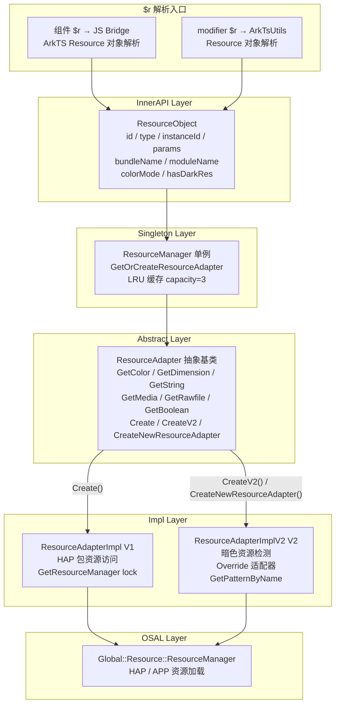
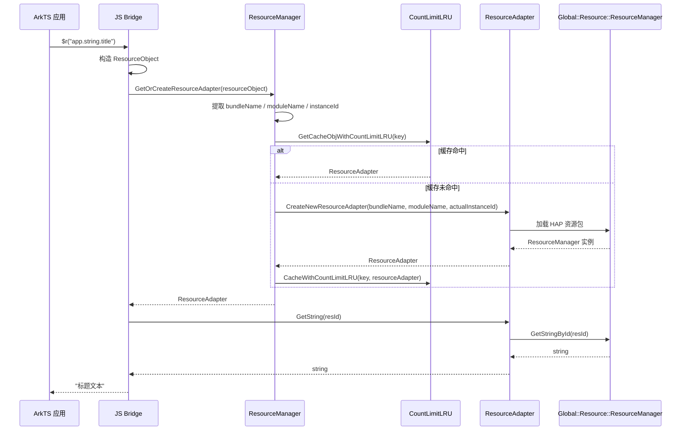
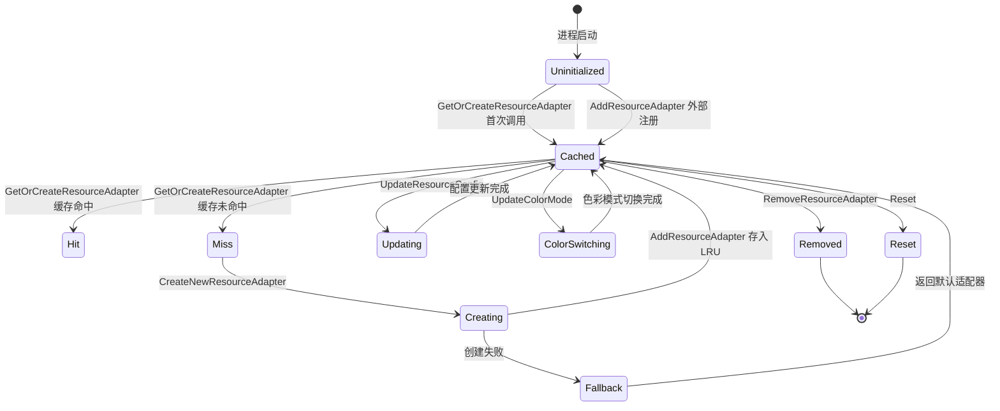
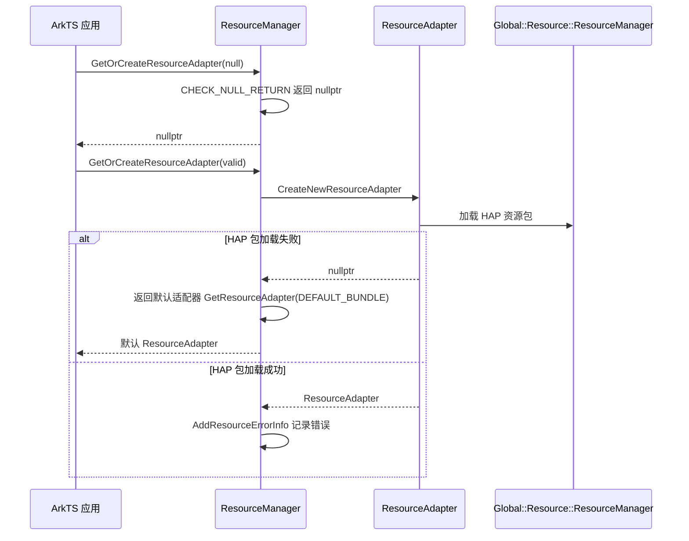

# 架构设计
> 资源访问域的架构设计文档，覆盖 ResourceManager 单例、ResourceAdapter 抽象、V1/V2 适配器实现、ResourceObject 跨实例隔离与 LRU 缓存。

## 设计元数据

| 字段 | 内容 |
|------|------|
| Design ID | DESIGN-Func-03-03-01 |
| 关联需求 | 已有能力补录（无独立 requirement.md） |
| 关联 Epic | 无 |
| 目标 Feature | Feat-01: 资源访问全量规格（ResourceManager / ResourceAdapter / ResourceObject / V1V2 适配器） |
| 复杂度 | 标准 |
| 目标版本 | API 6 ~ API 26+ |
| Owner | ArkUI SIG |
| 状态 | Baselined（已有实现补录） |

## 需求基线

> 需求基线详见 proposal.md。以下仅列出设计阶段需要额外强调的要点。

| 项 | 补充说明（如需） |
|----|------------------|
| Per-instanceId 隔离 | 每个 ArkUI 实例（instanceId）拥有独立的 ResourceAdapter，通过 ResourceManager 单例的 resourceAdapters_ 映射表隔离 |
| V1 与 V2 适配器共存 | ResourceAdapterImpl（V1）面向 HAP 包资源；ResourceAdapterImplV2（V2）支持暗色资源检测、override 适配器和 pattern 主题样式 |
| LRU 缓存 | ResourceManager 内置 CountLimitLRU 缓存（默认容量 3），按 bundleName.moduleName.instanceId 键管理 ResourceAdapter 实例 |

## 上下文和现状

### 涉及仓和模块

| 仓库 | 模块路径 | 当前职责 | 本 Feature 影响 |
|------|----------|----------|-----------------|
| ace_engine | `frameworks/core/common/resource/resource_manager.h/.cpp` | ResourceManager 单例：LRU 缓存、GetOrCreateResourceAdapter、AddResourceAdapter/RemoveResourceAdapter | 规格补录 |
| ace_engine | `frameworks/core/components/theme/resource_adapter.h` | ResourceAdapter 抽象基类：GetColor/GetDimension/GetString/GetMedia/GetRawfile/RawfileDescription，Create/CreateV2/CreateNewResourceAdapter 静态工厂 | 规格补录 |
| ace_engine | `adapter/ohos/osal/resource_adapter_impl.h/.cpp` | ResourceAdapterImpl V1 实现：封装 Global::Resource::ResourceManager，HAP 包资源访问 | 规格补录 |
| ace_engine | `adapter/ohos/osal/resource_adapter_impl_v2.h/.cpp` | ResourceAdapterImplV2 实现：暗色资源检测、override 适配器、pattern 主题样式、PreloadTheme | 规格补录 |
| ace_engine | `interfaces/inner_api/ace_kit/include/ui/resource/resource_object.h` | ResourceObject InnerAPI：id/type/instanceId/params/bundleName/moduleName/colorMode/hasDarkRes | 规格补录 |
| ace_engine | `frameworks/core/common/lru/count_limit_lru.h` | CountLimitLRU 模板：CacheWithCountLimitLRU / GetCacheObjWithCountLimitLRU / RemoveCacheObjFromCountLimitLRU | 规格补录 |
| interface/sdk-js | `api/@internal/component/ets/units.d.ts` | 公开 SDK：ResourceStr/ResourceColor/Length 类型别名 | 规格对照 |

### 调用链层级分析

> 仅组件中直接使用 `$r` 走 JsBridge 的 resource 解析层，modifier 中直接使用 `$r` 走 ArkTsUtils 的 resource 解析层；二者均构造 ResourceObject 传入 native。

| 层 | 模块 | 职责 | 修改类型 |
|----|------|------|----------|
| JS Bridge | `frameworks/bridge/declarative_frontend/` | 组件中 `$r` 走 JsBridge resource 解析层：ArkTS 层 Resource 对象解析，构造 ResourceObject 传入 native | 无修改（规格补录） |
| ArkTsUtils | ArkTsUtils resource 解析层 | modifier 中 `$r` 走 ArkTsUtils resource 解析层：构造 ResourceObject 传入 native | 无修改（规格补录） |
| InnerAPI Layer | `interfaces/inner_api/ace_kit/include/ui/resource/resource_object.h` | ResourceObject 数据载体：携带 id/type/instanceId/params/bundleName/moduleName/colorMode/hasDarkRes | 无修改（规格补录） |
| Singleton Layer | `frameworks/core/common/resource/resource_manager.h/.cpp` | ResourceManager 单例：GetOrCreateResourceAdapter 按 ResourceObject 获取或创建适配器，LRU 缓存管理 | 无修改（规格补录） |
| Abstract Layer | `frameworks/core/components/theme/resource_adapter.h` | ResourceAdapter 抽象基类：纯虚 GetColor/GetDimension/GetString/GetStringArray/GetDouble/GetInt，虚函数 GetRawfile/GetMediaPath/GetBoolean/GetResourceLimitKeys | 无修改（规格补录） |
| Impl V1 Layer | `adapter/ohos/osal/resource_adapter_impl.h/.cpp` | ResourceAdapterImpl V1：封装 Global::Resource::ResourceManager，Init/UpdateConfig/GetTheme + 全量 Get* 覆写 | 无修改（规格补录） |
| Impl V2 Layer | `adapter/ohos/osal/resource_adapter_impl_v2.h/.cpp` | ResourceAdapterImplV2 V2：暗色资源检测 ExistDarkResById/Name、override 适配器 CreateOverrideResourceAdapter、UpdateColorMode/GetResourceColorMode | 无修改（规格补录） |
| OSAL Layer | Global::Resource::ResourceManager（global_resource） | 底层 OHOS 资源管理器：HAP/APP 包资源加载、resConfig 管理 | 无修改（外部依赖） |

### 适用架构规则

| Rule ID | 适用原因 | 设计结论 | 验证方式 |
|---------|----------|----------|----------|
| OH-ARCH-LAYERING | 资源访问涉及 $r 解析 → Bridge → InnerAPI → Singleton → Abstract → Impl 多层调用 | 调用方向自上而下，Impl 层不直接访问 Bridge 层；ResourceAdapter 抽象隔离 Singleton 与 OSAL | 代码评审 / 依赖检查 |
| OH-ARCH-SUBSYSTEM | ace_engine 依赖 global_resource 子系统的 Global::Resource::ResourceManager | 通过 ResourceAdapter 抽象层隔离，不直接引用 Global::Resource 类型 | 依赖检查 |
| OH-ARCH-API-LEVEL | ResourceManager / ResourceAdapter @since 6（InnerAPI） | 各版本 API 通过 PlatformVersion 条件分支或 d.ts 声明实现兼容 | API 评审 |
| OH-ARCH-COMPONENT-BUILD | resource_manager.cpp / resource_adapter_impl.cpp / resource_adapter_impl_v2.cpp 均为 ace_engine 内部目标 | 无独立 SO 输出，作为 ace_engine 核心库编译 | 构建验证 |
| OH-ARCH-ERROR-LOG | ResourceManager 有 DumpResLoadError / AddResourceLoadError 机制 | 错误信息包含 nodeId/sourceKey/sourceTag/nodeTag/errorTime/state，最多保留 100 条 | 单测 / hilog |

## 不涉及项承接

> proposal.md 已完成 N/A 判定。本节仅对 proposal 中标记为"涉及"且需展开设计的维度给出结论。

| 维度 | 设计结论 |
|------|----------|
| 深色模式 | `appHasDarkRes_` 由上游元能力直接写入底层 ResourceManager，ResourceAdapterImplV2 仅记录此值（`SetAppHasDarkRes` 不影响深色资源可获取性；置 true 条件：应用 resource 目录含 dark 资源，或元能力调用 `setColorMode`）；ExistDarkResById/ExistDarkResByName 检测暗色资源；ResourceObject 携带 hasDarkRes_ 字段；UpdateColorMode 运行时切换色彩模式 |
| 多实例隔离 | ResourceManager 以 instanceId 为键隔离 ResourceAdapter，MakeCacheKey 将 bundleName.moduleName.instanceId 组合为缓存键 |
| 版本升级兼容 | V1→V2 适配器通过 ResourceAdapter::Create() / CreateV2() / CreateNewResourceAdapter() 三种工厂方法共存，按调用方选择 |

## 关键设计决策

| 决策 ID | 问题 | 推荐方案 | 探索过的替代方案 | 取舍理由 | 影响 |
|---------|------|----------|-----------------|----------|------|
| ADR-1 | ResourceManager 单例 vs 每实例独立管理器 | 单例 + per-instanceId 缓存键隔离 | 每实例独立 ResourceAdapter 管理器 | 单例减少跨实例通信开销；缓存键包含 instanceId 保证隔离 | AC-1.1, AC-2.1 |
| ADR-2 | ResourceAdapter 作为抽象基类 vs 接口 | 抽象基类（AceType 继承体系）+ 纯虚函数 | 纯接口（无状态） | 复用 AceType 引用计数；默认虚函数实现降低子类负担 | AC-3.1 ~ AC-3.4 |
| ADR-3 | V1 与 V2 适配器共存策略 | 保留 V1（ResourceAdapterImpl）和 V2（ResourceAdapterImplV2），通过 Create() / CreateV2() 工厂方法区分 | 废弃 V1，统一升级到 V2 | V1 仍被存量代码使用，废弃会引入回归风险；V2 增量添加暗色检测和 override 能力 | AC-4.1 ~ AC-4.4 |
| ADR-4 | LRU 缓存容量与淘汰策略 | CountLimitLRU 模板，默认容量 3，按计数淘汰 | 时间过期淘汰 | ResourceAdapter 实例数有限（通常 = 活跃 HAP 数），计数淘汰足够且实现简单；容量可通过 SetResourceCacheSize 动态调整 | AC-2.2, AC-2.3 |
| ADR-5 | ResourceObject 作为 InnerAPI 跨层传递载体 | ResourceObject 携带 id/type/instanceId/params/bundleName/moduleName/colorMode/hasDarkRes 全量上下文 | 仅传递 bundleName+moduleName | 携带完整上下文避免多次查询；colorMode/hasDarkRes 支持暗色资源即时判断 | AC-5.1 ~ AC-5.4 |

## 设计骨架

### 骨架范围

| 骨架项 | 目标 | 不包含 | 验证方式 |
|--------|------|--------|----------|
| ResourceManager 单例 | GetOrCreateResourceAdapter / AddResourceAdapter / RemoveResourceAdapter / UpdateResourceConfig / UpdateColorMode | 资源文件解析（委托 Global::Resource） | UT |
| ResourceAdapter 抽象 | GetColor/GetDimension/GetString/GetMedia/GetRawfile/GetBoolean/GetInt/GetDouble/GetResourceLimitKeys | ThemeStyle 加载（由 ThemeConstants 封装） | UT |
| V1 适配器实现 | ResourceAdapterImpl：Init/UpdateConfig + 全量 Get* 覆写 | 暗色资源检测（V2 能力） | UT |
| V2 适配器实现 | ResourceAdapterImplV2：ExistDarkResById/Name + UpdateColorMode + GetOverrideResourceAdapter + GetPatternByName | ThemeStyle 解析（委托 ResourceThemeStyle） | UT |
| ResourceObject InnerAPI | id/type/instanceId/params/bundleName/moduleName/colorMode/hasDarkRes 全字段 | ResourceObject 的 JSON 序列化 | UT |
| LRU 缓存 | CountLimitLRU：CacheWithCountLimitLRU / GetCacheObjWithCountLimitLRU / RemoveCacheObjFromCountLimitLRU | 基于时间的缓存过期 | UT |

### 骨架 Spec 拆分

| Task ID | 目标 | 受影响文件 | AC |
|---------|------|-----------|-----|
| TASK-SKELETON-1 | 资源访问全量规格补录（ResourceManager / ResourceAdapter / ResourceObject / V1V2 / LRU） | Feat-01-resource-access-spec.md | AC-1.1 ~ AC-6.4 |

## 后续 Task 拆分

| Task ID | 目标 | 受影响文件 | 依赖 |
|---------|------|-----------|------|
| TASK-RES-01 | 资源访问全量规格补录 | Feat-01-resource-access-spec.md, design.md | 无 |

## API 签名、Kit 与权限

### 新增 API

> 本特性为已有实现补录，以下列出已有的公开/InnerAPI 接口签名。

| API 签名 | 类型 | Kit | d.ts 位置 | 权限要求 | SysCap |
|----------|------|-----|-----------|----------|--------|
| `ResourceManager.getInstance(): ResourceManager` | InnerApi | ArkUI | `resource_manager.h:49` | 无 | N/A |
| `ResourceManager.getOrCreateResourceAdapter(resourceObject): ResourceAdapter` | InnerApi | ArkUI | `resource_manager.h:51` | 无 | N/A |
| `ResourceAdapter.create(): ResourceAdapter` | InnerApi | ArkUI | `resource_adapter.h:56` | 无 | N/A |
| `ResourceAdapter.createV2(): ResourceAdapter` | InnerApi | ArkUI | `resource_adapter.h:57` | 无 | N/A |
| `ResourceAdapter.createNewResourceAdapter(bundleName, moduleName, actualInstanceId): ResourceAdapter` | InnerApi | ArkUI | `resource_adapter.h:281-282` | 无 | N/A |
| `ResourceObject(id, type, params, bundleName, moduleName, instanceId)` | InnerApi | ArkUI | `resource_object.h:40-43` | 无 | N/A |

### 变更/废弃 API

| 原有 API | 变更类型 | 新 API | 迁移说明 |
|----------|----------|--------|----------|
| `ResourceAdapter.create()` | MODIFIED | `ResourceAdapter.createV2()` | V1 工厂保留兼容；V2 增加暗色资源检测和 override 能力，新增代码优先使用 CreateV2 |

## 构建系统影响

### BUILD.gn 变更

资源访问模块为 ace_engine 核心库的一部分，无独立 SO 输出：

```
# frameworks/core/common/resource/BUILD.gn
# 编译目标：ace_engine 核心库（libace_compatible.z.so / libace_napi.z.so）
# 包含文件：resource_manager.cpp, resource_object.cpp, count_limit_lru.h
# adapter/ohos/osal/BUILD.gn
# 包含文件：resource_adapter_impl.cpp, resource_adapter_impl_v2.cpp
```

### bundle.json 变更

资源访问作为 ace_engine 组件内部模块，无独立 bundle.json 变更。依赖 global_resource 子系统的 ResourceManager。

## 可选设计扩展

### 架构图



### 数据流/控制流

| 步骤 | 调用方 | 被调用方 | 数据/接口 | 说明 |
|------|--------|----------|-----------|------|
| 1 | ArkTS 层 | JS Bridge | Resource 对象 | 解析 $r/$rawfile 引用，构造 Resource 对象 |
| 2 | JS Bridge | ResourceObject 构造 | id, type, params, bundleName, moduleName, instanceId | 封装为 ResourceObject InnerAPI 载体 |
| 3 | JS Bridge | ResourceManager::GetOrCreateResourceAdapter | ResourceObject | 按 instanceId 查找缓存适配器 |
| 4 | ResourceManager | MakeCacheKey | bundleName, moduleName, instanceId → "bundle.module.instance" | 生成 LRU 缓存键 |
| 5 | ResourceManager | CountLimitLRU::GetCacheObjWithCountLimitLRU | cache key | 缓存命中返回适配器，未命中继续创建 |
| 6 | ResourceManager | ResourceAdapter::CreateNewResourceAdapter | bundleName, moduleName, actualInstanceId | 创建新适配器（V2 优先） |
| 7 | ResourceManager | AddResourceAdapter | key, resourceAdapter | 存入 LRU 缓存和 resourceAdapters_ 映射 |
| 8 | ResourceAdapter | Global::Resource::ResourceManager | resId / resName | 底层资源查询：GetColor/GetString/GetMedia 等 |
| 9 | ResourceAdapter | 返回调用方 | Color / Dimension / string / PixelMap | 资源值返回 |

### 时序设计



### 数据模型设计

**API 层类型 (TypeScript)**:

```typescript
// Resource 结构体（$r 解析输入）
interface Resource {
  bundleName: string;
  moduleName: string;
  id: number;
  params?: any[];
  type: number;  // 0=color, 1=float, 2=string, 3=media, ...
}

// 类型别名
type ResourceStr = string | Resource;
type ResourceColor = Color | number | string | Resource;
type Length = string | number | Resource;
```

**框架层结构 (C++)**:

```cpp
// ResourceObject 关键字段 (resource_object.h:35-146)
class ResourceObject : public AceType {
    int32_t id_;            // 资源 ID（-1 表示无资源 ID）
    int32_t type_;          // 资源类型
    int32_t instanceId_;    // ArkUI 实例 ID
    Color color_;           // 预解析颜色值
    std::vector<ResourceObjectParams> params_;  // 格式化参数
    std::string bundleName_;
    std::string moduleName_;
    std::string nodeTag_;
    ColorMode colorMode_ = ColorMode::COLOR_MODE_UNDEFINED;
    bool isResource_ = true;
    bool hasDarkRes_ = false;  // 是否有暗色资源
};

// ResourceManager 关键字段 (resource_manager.h:93-100)
class ResourceManager final : public AceType {
    std::unordered_map<std::string, RefPtr<ResourceAdapter>> resourceAdapters_;
    std::shared_mutex mutex_;
    std::atomic<size_t> capacity_ = 3;  // LRU 默认容量
    std::list<CacheNode<RefPtr<ResourceAdapter>>> cacheList_;
    std::unordered_map<std::string, std::list<CacheNode<RefPtr<ResourceAdapter>>>::iterator> cache_;
    std::list<ResourceErrorInfo> resourceErrorList_;  // 最多 100 条
};
```

### 算法与状态机



### 测试性设计

| 测试层级 | 测试目标 | Mock 策略 | 验证方式 |
|----------|----------|----------|----------|
| UT | ResourceManager LRU 缓存命中/未命中/淘汰 | Mock ResourceAdapter 和 ResourceObject | 验证 cache_ 和 cacheList_ 状态 |
| UT | ResourceAdapterImpl V1 GetColor/GetString/GetDimension | Mock Global::Resource::ResourceManager | 验证返回值和调用参数 |
| UT | ResourceAdapterImplV2 V2 ExistDarkResById/Name | Mock Global::Resource::ResourceManager | 验证暗色资源检测结果 |
| UT | ResourceObject 字段访问 | 无需 Mock | 验证 getter/setter 行为 |
| UT | CountLimitLRU 缓存淘汰顺序 | 无需 Mock | 验证 LRU 顺序正确性 |
| 集成 | 跨实例隔离 | 构造多个 instanceId | 验证不同实例获取不同适配器 |

### 异常传播时序图



### 资源所有权矩阵

| 资源 | 创建方 | 持有方 | 销毁触发 | 实际释放 | 异常回收 |
|------|--------|--------|----------|----------|----------|
| ResourceAdapter 实例 | ResourceAdapter::CreateNewResourceAdapter | ResourceManager LRU cache_ | RemoveResourceAdapter / Reset | LRU 淘汰或 Reset 时 RefPtr 引用计数归零 | 进程退出时自动释放 |
| Global::Resource::ResourceManager | OSAL 层 ResourceAdapterImpl::Init | ResourceAdapterImpl resourceManager_ | ResourceAdapterImpl 析构 | shared_ptr 引用计数归零 | 异常时 shared_ptr 自动释放 |
| ResourceObject | JS Bridge 构造 | 调用方持有 | 调用方释放 | RefPtr 引用计数归零 | 无跨模块传递风险 |
| ResourceErrorInfo | ResourceManager::AddResourceLoadError | ResourceManager resourceErrorList_ | 超过 MAX_DUMP_LIST_SIZE(100) | 列表前端弹出 | DumpResLoadError 输出后不清除 |

## 详细设计

### ResourceManager 单例与 LRU 缓存

ResourceManager 是线程安全的单例（`resource_manager.h:43`），通过 `std::shared_mutex mutex_` 保护 `resourceAdapters_` 映射表和 LRU 缓存。

**GetOrCreateResourceAdapter 核心流程** (`resource_manager.cpp:54-77`)：

1. 空值检查：`CHECK_NULL_RETURN(resourceObject, nullptr)`
2. 提取 instanceId / bundleName / moduleName
3. 查找已有适配器：`GetResourceAdapter(bundleName, moduleName, instanceId)`
4. 未找到时创建：`ResourceAdapter::CreateNewResourceAdapter(bundleName, moduleName, actualInstanceId)`
5. 创建失败回退：返回默认 bundle 的适配器
6. 创建成功注册：`AddResourceAdapter(bundleName, moduleName, actualInstanceId, resourceAdapter)`

**LRU 缓存键生成** (`resource_manager.cpp:79-86`)：
- 当 bundleName 和 moduleName 均为空时：键 = `to_string(instanceId)`
- 否则：键 = `bundleName + "." + moduleName + "." + to_string(instanceId)`

**LRU 容量管理** (`resource_manager.h:96`)：
- 默认容量 `capacity_ = 3`
- 通过 `SetResourceCacheSize(size_t cacheSize)` 动态调整
- 超容量时从 `cacheList_` 尾部淘汰

### ResourceAdapter 抽象基类

ResourceAdapter (`resource_adapter.h:49`) 继承 `virtual AceType`，提供：

**纯虚函数**（子类必须实现）：
- `GetColor(uint32_t resId)` → `Color` (`resource_adapter.h:88`)
- `GetDimension(uint32_t resId)` → `Dimension` (`resource_adapter.h:95`)
- `GetString(uint32_t resId)` → `string` (`resource_adapter.h:102`)
- `GetStringArray(uint32_t resId) const` → `vector<string>` (`resource_adapter.h:114`)
- `GetDouble(uint32_t resId)` → `double` (`resource_adapter.h:121`)
- `GetInt(uint32_t resId)` → `int32_t` (`resource_adapter.h:128`)

**虚函数**（有默认实现，子类可覆写）：
- `GetRawfile(string fileName)` → `string` (`resource_adapter.h:160`)
- `GetRawFileDescription(string, RawfileDescription&) const` → `bool` (`resource_adapter.h:240`)
- `GetBoolean(uint32_t resId) const` → `bool` (`resource_adapter.h:198`)
- `GetResourceLimitKeys() const` → `uint32_t` (`resource_adapter.h:261`)
- `UpdateColorMode(ColorMode)` (`resource_adapter.h:284`)
- `GetResourceColorMode() const` → `ColorMode` (`resource_adapter.h:286`)
- `GetOverrideResourceAdapter(config, change)` → `RefPtr<ResourceAdapter>` (`resource_adapter.h:291`)
- `ExistDarkResById(string)` → `bool` (`resource_adapter.h:297`)
- `ExistDarkResByName(string, string)` → `bool` (`resource_adapter.h:302`)

**静态工厂方法**：
- `Create()` → V1 适配器 (`resource_adapter.h:56`)
- `CreateV2()` → V2 适配器 (`resource_adapter.h:57`)
- `CreateNewResourceAdapter(bundleName, moduleName, actualInstanceId)` → V2 适配器带实例 ID (`resource_adapter.h:281-282`)

### V1 适配器实现（ResourceAdapterImpl）

ResourceAdapterImpl (`resource_adapter_impl.h:29`) 封装 `Global::Resource::ResourceManager`：

- `resourceManager_`：主 HAP 包资源管理器
- `sysResourceManager_`：系统资源管理器
- `resourceManagers_`：跨 bundle/module 的资源管理器映射
- `resourceMutex_`：读写锁保护 resourceManager_

关键覆写方法均委托给 `Global::Resource::ResourceManager`，通过 `GetResourceManager()` 获取（带 shared_lock）。

### V2 适配器实现（ResourceAdapterImplV2）

ResourceAdapterImplV2 (`resource_adapter_impl_v2.h:30`) 在 V1 基础上增加：

- `appHasDarkRes_`：应用是否有暗色资源标志，由上游元能力直接写入底层 ResourceManager，适配器仅记录此值（`SetAppHasDarkRes` 不影响深色资源可获取性；置 true 条件：应用 resource 目录含 dark 资源或元能力调用 `setColorMode`）(`resource_adapter_impl_v2.h:113`)
- `isOverrideResourceAdapter_`：是否为 override 适配器 (`resource_adapter_impl_v2.h:114`)
- `patternNameMap_`：pattern 名称到资源 ID 的映射 (`resource_adapter_impl_v2.h:99`)
- `ExistDarkResById/ExistDarkResByName`：暗色资源检测
- `GetOverrideResourceAdapter`：创建 override 适配器（配置变更时）
- `UpdateColorMode/GetResourceColorMode`：运行时色彩模式切换
- `GetPatternByName`：获取 pattern 主题样式
- `PreloadTheme`：主题预加载
- `DumpColorMode`：色彩模式调试输出

## 风险和开放问题

| 项 | 类型 | 影响 | 处理方式 | Owner |
|----|------|------|----------|-------|
| V1 适配器长期维护成本 | 架构 | 中 | V1 仍被存量代码使用，无法安全废弃；新增能力统一走 V2 | ArkUI SIG |
| LRU 默认容量 3 是否足够 | 架构 | 低 | 多实例场景下可能频繁淘汰；可通过 SetResourceCacheSize 动态调整 | ArkUI SIG |
| Global::Resource::ResourceManager 线程安全 | 架构 | 中 | ace_engine 通过 shared_mutex 保护，但底层 Global::Resource 的线程安全由其自身保证 | Global Resource 团队 |
| ResourceErrorList 上限 100 可能丢失错误 | 测试 | 低 | DumpResLoadError 仅用于调试，不影响功能；可通过 hilog 持久化补全 | ArkUI SIG |

## 设计审批

- [x] 需求基线已确认，设计覆盖 P0/P1 AC
- [x] 不涉及项已承接，N/A 和展开项都有结论
- [x] 涉及仓和模块职责清楚
- [x] 调用链层级分析完整，每层覆盖到位
- [x] 适用架构规则已识别并形成设计结论
- [x] 分层和子系统边界合规
- [x] API 变更有签名、权限、错误码和兼容性说明
- [x] BUILD.gn/bundle.json 影响明确
- [x] 设计输出和后续 Task 拆分明确
- [x] 关键设计决策有理由和影响说明
- [x] 风险和开放问题有 Owner

**结论:** 通过（已有实现补录）
