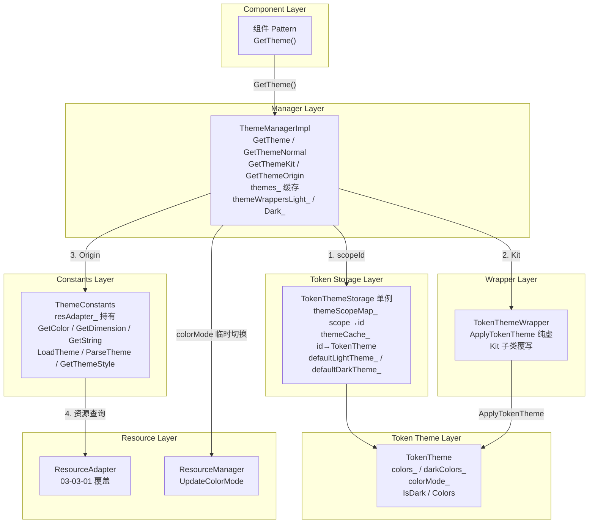
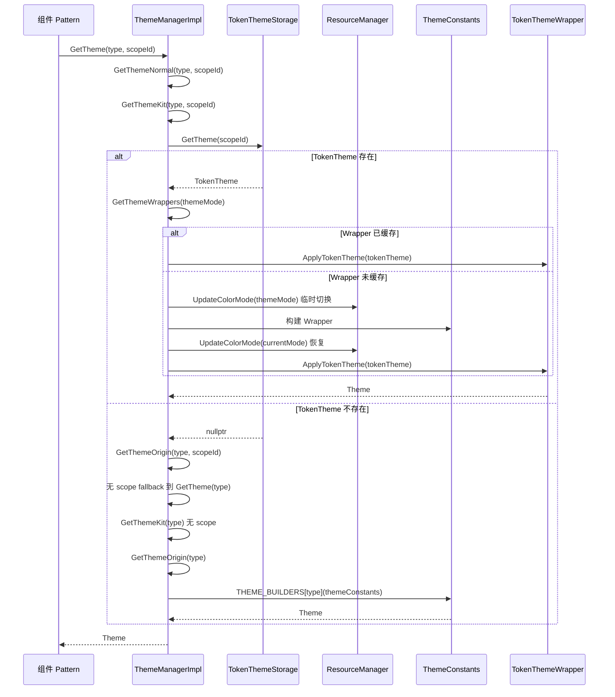
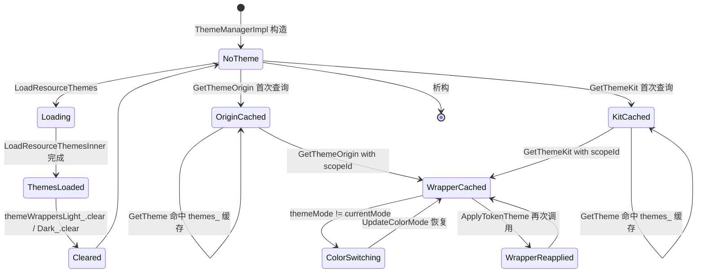
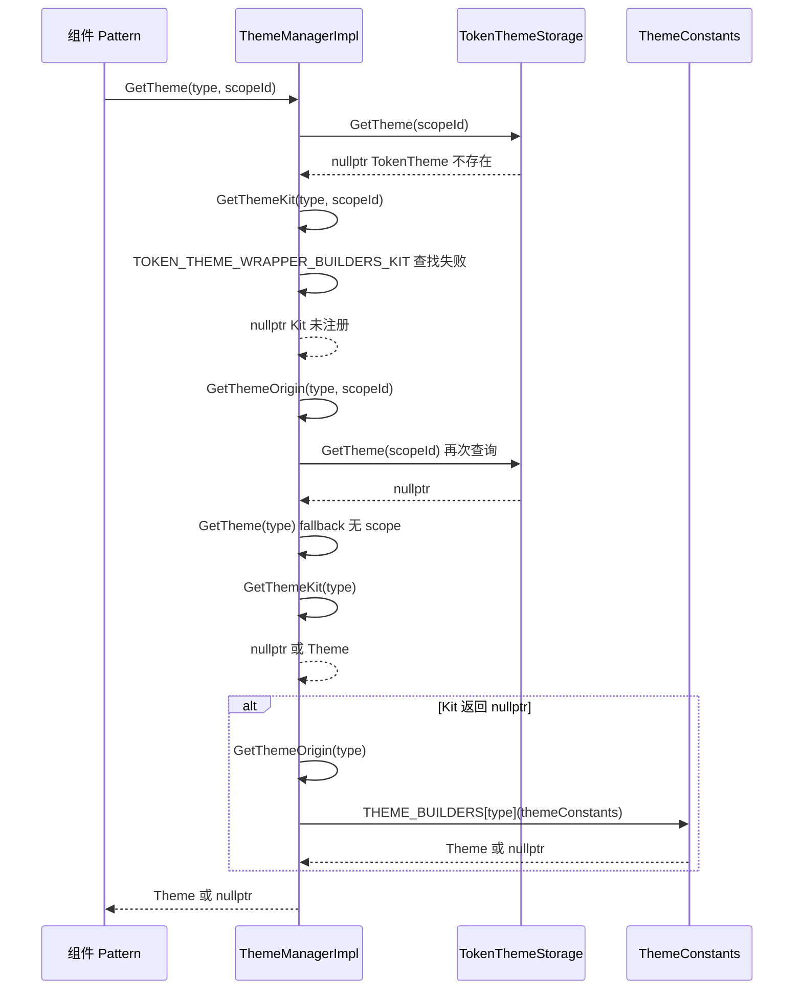

# 架构设计
> 主题分层访问域的架构设计文档，覆盖 ThemeManager 四层解析、TokenTheme/TokenThemeStorage/TokenThemeWrapper、ThemeConstants、本地与系统色彩模式切换。

## 设计元数据

| 字段 | 内容 |
|------|------|
| Design ID | DESIGN-Func-03-03-02 |
| 关联需求 | 已有能力补录（无独立 requirement.md） |
| 关联 Epic | 无 |
| 目标 Feature | Feat-01: 主题分层访问全量规格（ThemeManager / TokenTheme / ThemeConstants / 四层解析 / 色彩模式切换） |
| 复杂度 | 复杂 |
| 目标版本 | API 7 ~ API 26+ |
| Owner | ArkUI SIG |
| 状态 | Baselined（已有实现补录） |

## 需求基线

> 需求基线详见 proposal.md。以下仅列出设计阶段需要额外强调的要点。

| 项 | 补充说明（如需） |
|----|------------------|
| 四层解析优先级 | TokenTheme scope → Kit/registered theme → Origin theme → Resource adapter，上层命中则不继续下沉 |
| 本地色彩模式 vs 系统色彩模式 | TokenTheme 可携带 colorMode（本地模式），与系统 colorMode 不同时通过 ResourceManager::UpdateColorMode 临时切换，查询后恢复 |
| 主题缓存双层结构 | ThemeManagerImpl themes_ 缓存 origin/kit 主题实例；TokenThemeStorage themeCache_ 缓存 TokenTheme 实例（按 themeId 键） |
| 无公开 SDK 主题命名空间 | 主题不通过独立公开 SDK 命名空间暴露；通过 resourceManager.ColorMode 和 ArkUI 组件属性间接访问 |
| Light/Dark Wrapper 分离 | ThemeManagerImpl 通过 themeWrappersLight_ 和 themeWrappersDark_ 分别缓存明暗模式下的 TokenThemeWrapper |

## 上下文和现状

### 涉及仓和模块

| 仓库 | 模块路径 | 当前职责 | 本 Feature 影响 |
|------|----------|----------|-----------------|
| ace_engine | `frameworks/core/components/theme/theme_manager.h` | ThemeManager 抽象基类：GetTheme/GetThemeConstants/LoadResourceThemes/GetResourceLimitKeys/RegisterThemeKit/RegisterCustomThemeKit | 规格补录 |
| ace_engine | `frameworks/core/components/theme/theme_manager_impl.h/.cpp` | ThemeManagerImpl 实现：themes_ 缓存、themeWrappersLight_/themeWrappersDark_、GetThemeNormal/GetThemeKit/GetThemeOrigin 分层、多线程构建 | 规格补录 |
| ace_engine | `frameworks/core/components/theme/theme_constants.h` | ThemeConstants：封装 ResourceAdapter，GetColor/GetDimension/GetString/LoadTheme/ParseTheme/GetThemeStyle | 规格补录 |
| ace_engine | `frameworks/core/components/theme/theme.h` | Theme 抽象基类：TypeId 机制、主题类型枚举 | 规格补录 |
| ace_engine | `interfaces/inner_api/ace_kit/include/ui/view/theme/token_theme.h` | TokenTheme InnerAPI：colors_/darkColors_、colorMode_、IsDark/Colors、SetResObjs/SetDarkResObjs | 规格补录 |
| ace_engine | `frameworks/core/components_ng/token_theme/token_theme_storage.h/.cpp` | TokenThemeStorage 单例：themeScopeMap_/themeCache_、StoreThemeScope/GetTheme/SetDefaultTheme/CacheClear | 规格补录 |
| ace_engine | `interfaces/inner_api/ace_kit/include/ui/view/theme/token_theme_wrapper.h` | TokenThemeWrapper：继承 Theme，ApplyTokenTheme 纯虚函数 | 规格补录 |
| ace_engine | `frameworks/core/components_ng/token_theme/token_theme_wrapper.h` | TokenThemeWrapper 框架层实现（与 InnerAPI 对应） | 规格补录 |
| ace_engine | `frameworks/core/components_ng/token_theme/token_colors.h` | TokenColors：主题色彩集合、colorMode、resObjs | 规格补录 |
| interface/sdk-js | `api/@ohos.resourceManager.d.ts` | 公开 SDK：ColorMode 枚举间接访问主题模式 | 规格对照 |

### 调用链层级分析

| 层 | 模块 | 职责 | 修改类型 |
|----|------|------|----------|
| Component Layer | `frameworks/core/components_ng/pattern/*/pattern.cpp` | 组件 Pattern 通过 `ThemeManager::GetTheme<T>()` 获取主题 | 无修改（规格补录） |
| Manager Layer | `frameworks/core/components/theme/theme_manager_impl.h/.cpp` | ThemeManagerImpl：GetTheme/GetThemeNormal/GetThemeKit/GetThemeOrigin 四层解析、themes_ 缓存 | 无修改（规格补录） |
| Token Storage Layer | `frameworks/core/components_ng/token_theme/token_theme_storage.h/.cpp` | TokenThemeStorage 单例：scope→themeId 映射、themeCache_ 缓存、defaultTheme 管理 | 无修改（规格补录） |
| Token Theme Layer | `interfaces/inner_api/ace_kit/include/ui/view/theme/token_theme.h` | TokenTheme：colors_/darkColors_ 持有、colorMode_ 判定、IsDark/Colors 切换 | 无修改（规格补录） |
| Wrapper Layer | `interfaces/inner_api/ace_kit/include/ui/view/theme/token_theme_wrapper.h` | TokenThemeWrapper：ApplyTokenTheme 纯虚，Kit 子类覆写 | 无修改（规格补录） |
| Constants Layer | `frameworks/core/components/theme/theme_constants.h` | ThemeConstants：封装 ResourceAdapter，GetColor/GetDimension/GetString/LoadTheme/ParseTheme | 无修改（规格补录） |
| Resource Layer | `frameworks/core/components/theme/resource_adapter.h` | ResourceAdapter：底层资源查询（由 03-03-01 覆盖） | 无修改（规格补录） |
| Singleton Layer | `frameworks/core/common/resource/resource_manager.h/.cpp` | ResourceManager：UpdateColorMode 色彩模式切换（由 03-03-01 覆盖） | 无修改（规格补录） |

### 适用架构规则

| Rule ID | 适用原因 | 设计结论 | 验证方式 |
|---------|----------|----------|----------|
| OH-ARCH-LAYERING | 主题解析涉及 Component → Manager → TokenStorage → TokenTheme → Wrapper → Constants → ResourceAdapter 多层调用 | 调用方向自上而下；每层职责明确，TokenStorage 不直接访问 ResourceAdapter | 代码评审 / 依赖检查 |
| OH-ARCH-SUBSYSTEM | 主题依赖资源管理子系统（global_resource） | 通过 ThemeConstants → ResourceAdapter 抽象隔离，不直接引用 Global::Resource 类型 | 依赖检查 |
| OH-ARCH-API-LEVEL | 主题无独立公开 SDK 命名空间，通过组件属性间接暴露 | 无 @since 版本标注的公开 API；InnerAPI 通过 ace_kit 暴露 | API 评审 |
| OH-ARCH-COMPONENT-BUILD | theme_manager_impl.cpp / token_theme_storage.cpp 为 ace_engine 核心库目标 | 无独立 SO 输出 | 构建验证 |
| OH-ARCH-ERROR-LOG | 主题构建失败时返回 nullptr 或回退到 GetTheme(type) | 无独立错误码；通过 CHECK_NULL_RETURN 回退 | 单测 / hilog |
| OH-ARCH-IPC-SAF | 不涉及跨进程/SA | N/A | N/A |

## 不涉及项承接

> proposal.md 已完成 N/A 判定。本节仅对 proposal 中标记为"涉及"且需展开设计的维度给出结论。

| 维度 | 设计结论 |
|------|----------|
| 深色模式 | 主题系统通过 themeWrappersLight_/themeWrappersDark_ 双缓存支持明暗模式；TokenTheme 携带 colorMode_ 支持本地色彩模式；GetThemeOrigin 中检测 themeMode != currentMode 时通过 ResourceManager::UpdateColorMode 临时切换 |
| 多实例隔离 | ThemeManagerImpl 按 instance 隔离（每个 PipelineContext 持有独立 ThemeManagerImpl）；TokenThemeStorage 为全局单例但通过 themeScopeId 区分不同实例的 scope |
| 版本升级兼容 | 四层解析为增量演进：Origin → Kit → TokenTheme scope，各层可独立存在，新层不影响旧层 |
| 无障碍 | 主题色彩通过 TokenColors 传递，无障碍属性从主题获取前景/背景色，无独立逻辑 |

## 关键设计决策

| 决策 ID | 问题 | 推荐方案 | 探索过的替代方案 | 取舍理由 | 影响 |
|---------|------|----------|-----------------|----------|------|
| ADR-1 | 主题解析采用几层结构 | 四层：TokenTheme scope → Kit → Origin → Resource adapter | 两层（TokenTheme + Resource） | 四层结构保留 Kit 层的注册式扩展能力，允许第三方主题覆盖 origin 主题；每层有明确 fallback | AC-1.1 ~ AC-1.4 |
| ADR-2 | TokenTheme 是否独立于 ThemeManager | TokenThemeStorage 作为全局单例，ThemeManager 通过 scopeId 查询 | TokenTheme 内嵌于 ThemeManager | 全局单例允许跨实例共享主题缓存；scopeId 机制支持局部主题覆盖 | AC-2.1 ~ AC-2.4 |
| ADR-3 | 本地色彩模式与系统色彩模式冲突如何处理 | 查询时临时切换 ResourceManager 到本地模式，查询后恢复系统模式 | 仅使用系统模式，忽略本地差异 | 支持 TokenTheme 级别的独立色彩模式（如某 scope 固定暗色），恢复机制保证系统全局一致性 | AC-3.1 ~ AC-3.4 |
| ADR-4 | Light/Dark Wrapper 是否分离缓存 | themeWrappersLight_ 和 themeWrappersDark_ 分别缓存 | 单一 wrappers 缓存 + colorMode 标记 | 分离缓存避免频繁切换时重建 Wrapper；代价是双倍内存但 Wrapper 实例轻量 | AC-4.1 ~ AC-4.3 |
| ADR-5 | 主题多线程构建策略 | 通过 MultiThreadBuildManager::IsThreadSafeNodeScope 判断是否启用多线程构建，themeMultiThreadMutex_ 保护 | 始终单线程构建 | 大型主题构建可并行加速；小主题单线程避免锁开销 | AC-5.1 ~ AC-5.3 |
| ADR-6 | TokenThemeStorage 系统主题 ID 约定 | SYSTEM_THEME_LIGHT_ID = -1, SYSTEM_THEME_DARK_ID = -2, INVALID_THEME_SCOPE_ID = -3 | 使用正数 ID | 负数 ID 避免与用户自定义 themeId 冲突；INVALID = -3 作为哨兵值 | AC-2.3, AC-2.4 |
| ADR-7 | Kit 主题与 Origin 主题优先级 | GetThemeNormal 先查 Kit（GetThemeKit），Kit 返回 nullptr 时 fallback 到 Origin（GetThemeOrigin） | Origin 优先 | Kit 主题为注册式扩展，应覆盖 Origin；保证向后兼容（无 Kit 注册时回退 Origin） | AC-1.1, AC-1.2 |

## 设计骨架

### 骨架范围

| 骨架项 | 目标 | 不包含 | 验证方式 |
|--------|------|--------|----------|
| 四层主题解析 | GetTheme/GetThemeNormal/GetThemeKit/GetThemeOrigin + TokenThemeStorage::GetTheme 分层查询 | 主题资源文件解析（委托 ResourceAdapter） | UT |
| TokenTheme 管理 | TokenTheme colors_/darkColors_ 持有、colorMode_ 判定、IsDark/Colors 切换 | TokenColors 内部色彩结构定义 | UT |
| TokenThemeStorage 单例 | themeScopeMap_ scope→themeId 映射、themeCache_ 缓存、defaultLightTheme_/defaultDarkTheme_ | 跨进程 TokenTheme 同步 | UT |
| TokenThemeWrapper | ApplyTokenTheme 纯虚、Kit 子类覆写、WRAPPER_BUILDERS_KIT 注册 | Wrapper 内部色彩应用细节 | UT |
| ThemeConstants 封装 | ResourceAdapter 持有、GetColor/GetDimension/GetString/LoadTheme/ParseTheme/GetThemeStyle | ResourceAdapter 底层实现（由 03-03-01 覆盖） | UT |
| 本地色彩模式切换 | GetThemeOrigin/GetThemeKit 中 themeMode != currentMode 时临时切换并恢复 | 全局色彩模式监听 | UT |
| Light/Dark 双缓存 | themeWrappersLight_/themeWrappersDark_ 分离缓存 + GetThemeWrappers 切换 | Wrapper 创建逻辑 | UT |
| 多线程构建 | MultiThreadBuildManager + themeMultiThreadMutex_ 保护 | 线程池调度策略 | UT |

### 骨架 Spec 拆分

| Task ID | 目标 | 受影响文件 | AC |
|---------|------|-----------|-----|
| TASK-SKELETON-1 | 主题分层访问全量规格补录（四层解析、TokenTheme、ThemeConstants、色彩模式切换） | Feat-01-theme-layered-access-spec.md | AC-1.1 ~ AC-7.4 |

## 后续 Task 拆分

| Task ID | 目标 | 受影响文件 | 依赖 |
|---------|------|-----------|------|
| TASK-THEME-01 | 主题分层访问全量规格补录 | Feat-01-theme-layered-access-spec.md, design.md | 依赖 03-03-01 资源访问规格 |

## API 签名、Kit 与权限

### 新增 API

> 本特性为已有实现补录，以下列出已有的 InnerAPI 接口签名。无公开 SDK 主题命名空间。

| API 签名 | 类型 | Kit | d.ts 位置 | 权限要求 | SysCap |
|----------|------|-----|-----------|----------|--------|
| `ThemeManager::GetTheme(ThemeType type): RefPtr<Theme>` | InnerApi | ArkUI | `theme_manager.h:63` | 无 | SystemCapability.ArkUI.ArkUI.Full |
| `ThemeManager::GetTheme(ThemeType type, int32_t themeScopeId): RefPtr<Theme>` | InnerApi | ArkUI | `theme_manager.h:65` | 无 | 同上 |
| `ThemeManager::GetThemeConstants(): RefPtr<ThemeConstants>` | InnerApi | ArkUI | `theme_manager.h:61` | 无 | 同上 |
| `ThemeManager::LoadResourceThemes()` | InnerApi | ArkUI | `theme_manager.h:67` | 无 | 同上 |
| `ThemeManager::GetResourceLimitKeys() const: uint32_t` | InnerApi | ArkUI | `theme_manager.h:81` | 无 | 同上 |
| `ThemeManager::RegisterThemeKit(ThemeType type, BuildFunc func)` | InnerApi | ArkUI | `theme_manager.h:86` | 无 | 同上 |
| `ThemeManager::RegisterCustomThemeKit(ThemeType type, BuildThemeWrapperFunc func)` | InnerApi | ArkUI | `theme_manager.h:88` | 无 | 同上 |
| `ThemeConstants::GetColor(uint32_t key) const: Color` | InnerApi | ArkUI | `theme_constants.h:60` | 无 | 同上 |
| `ThemeConstants::GetDimension(uint32_t key) const: Dimension` | InnerApi | ArkUI | `theme_constants.h:76` | 无 | 同上 |
| `ThemeConstants::GetString(uint32_t key) const: string` | InnerApi | ArkUI | `theme_constants.h:124` | 无 | 同上 |
| `ThemeConstants::LoadTheme(int32_t themeId)` | InnerApi | ArkUI | `theme_constants.h:302` | 无 | 同上 |
| `ThemeConstants::ParseTheme()` | InnerApi | ArkUI | `theme_constants.h:52` | 无 | 同上 |
| `ThemeConstants::GetThemeStyle() const: RefPtr<ThemeStyle>` | InnerApi | ArkUI | `theme_constants.h:304` | 无 | 同上 |
| `TokenThemeStorage::GetInstance(): TokenThemeStorage*` | InnerApi | ArkUI | `token_theme_storage.h:33` | 无 | 同上 |
| `TokenThemeStorage::StoreThemeScope(scopeId, themeId)` | InnerApi | ArkUI | `token_theme_storage.h:37` | 无 | 同上 |
| `TokenThemeStorage::GetTheme(scopeId): RefPtr<TokenTheme>` | InnerApi | ArkUI | `token_theme_storage.h:39` | 无 | 同上 |
| `TokenThemeStorage::SetDefaultTheme(theme, colorMode)` | InnerApi | ArkUI | `token_theme_storage.h:42` | 无 | 同上 |
| `TokenThemeStorage::CacheClear()` | InnerApi | ArkUI | `token_theme_storage.h:47` | 无 | 同上 |
| `TokenTheme::Colors() const: RefPtr<TokenColors>&` | InnerApi | ArkUI | `token_theme.h:47-50` | 无 | 同上 |
| `TokenTheme::IsDark() const: bool` | InnerApi | ArkUI | `token_theme.h:104-110` | 无 | 同上 |
| `TokenThemeWrapper::ApplyTokenTheme(TokenTheme&): void` | InnerApi | ArkUI | `token_theme_wrapper.h:30` | 无 | 同上 |

### 变更/废弃 API

| 原有 API | 变更类型 | 新 API | 迁移说明 |
|----------|----------|--------|----------|
| `ThemeManager::GetTheme(ThemeType)` | MODIFIED | `ThemeManager::GetTheme(ThemeType, int32_t themeScopeId)` | 新增带 scopeId 的重载，原重载保留兼容 |
| `ThemeConstants::GetColor(uint32_t)` | MODIFIED | `ThemeConstants::GetColorByName(string)` | 新增按名称查询重载，原按 ID 查询保留 |

## 构建系统影响

### BUILD.gn 变更

主题分层访问模块为 ace_engine 核心库的一部分，无独立 SO 输出：

```
# frameworks/core/components/theme/BUILD.gn
# 编译目标：ace_engine 核心库
# 包含文件：theme_manager.cpp, theme_manager_impl.cpp, theme_constants.cpp, theme_style.cpp
# frameworks/core/components_ng/token_theme/BUILD.gn
# 包含文件：token_theme_storage.cpp, token_theme_wrapper.cpp
# interfaces/inner_api/ace_kit/BUILD.gn
# 头文件路径：ui/view/theme/token_theme.h, token_theme_wrapper.h
```

### bundle.json 变更

主题分层访问作为 ace_engine 组件内部模块，无独立 bundle.json 变更。

## 可选设计扩展

### 架构图



### 数据流/控制流

| 步骤 | 调用方 | 被调用方 | 数据/接口 | 说明 |
|------|--------|----------|-----------|------|
| 1 | 组件 Pattern | ThemeManager::GetTheme(type, scopeId) | ThemeType, int32_t | 获取带 scopeId 的主题 |
| 2 | ThemeManager | GetThemeNormal(type, scopeId) | ThemeType, TokenThemeScopeId | 正常路径入口 |
| 3 | GetThemeNormal | GetThemeKit(type, scopeId) | ThemeType, scopeId | 第二层：Kit 主题查询 |
| 4 | GetThemeKit | TokenThemeStorage::GetTheme(scopeId) | scopeId → RefPtr<TokenTheme> | 查询 scope 对应的 TokenTheme |
| 5 | GetThemeKit | GetThemeWrappers(themeMode) | ColorMode → themeWrappersLight_/Dark_ | 获取对应模式的 Wrapper 缓存 |
| 6 | GetThemeKit | wrapper->ApplyTokenTheme(tokenTheme) | TokenTheme& | 应用 TokenTheme 到 Wrapper |
| 7 | GetThemeNormal | GetThemeOrigin(type, scopeId) | 无 Kit 注册时 fallback | 第三层：Origin 主题查询 |
| 8 | GetThemeOrigin | TOKEN_THEME_WRAPPER_BUILDERS[type] | ThemeType → BuildFunc | 创建新 Wrapper |
| 9 | GetThemeOrigin | ResourceManager::UpdateColorMode | bundleName, moduleName, instanceId, themeMode | 临时切换色彩模式 |
| 10 | GetThemeOrigin | wrapper->ApplyTokenTheme(tokenTheme) | TokenTheme& | 应用并缓存到 themeWrappers |
| 11 | GetThemeNormal | GetThemeOrigin(type) | 无 scopeId TokenTheme 时 fallback | 第四层：无 scope 的 Origin |
| 12 | GetThemeOrigin | THEME_BUILDERS[type] | ThemeType → BuildFunc | 通过 ThemeConstants 构建 Origin 主题 |

### 时序设计



### 数据模型设计

**InnerAPI 层类型 (C++)**:

```cpp
// TokenTheme 关键字段 (token_theme.h:27-111)
class TokenTheme : public virtual AceType {
    int32_t id_;                        // 主题 ID
    RefPtr<TokenColors> colors_;        // 亮色色彩集合
    RefPtr<TokenColors> darkColors_;    // 暗色色彩集合
    ColorMode colorMode_ = COLOR_MODE_UNDEFINED;  // 本地色彩模式
    std::vector<RefPtr<ResourceObject>> resObjs;
    bool IsDark() const;  // colorMode_ == UNDEFINED 时用 IsDarkMode()，否则 == DARK
};

// TokenThemeStorage 关键字段 (token_theme_storage.h:29-85)
class TokenThemeStorage final {
    static constexpr int32_t SYSTEM_THEME_LIGHT_ID = -1;
    static constexpr int32_t SYSTEM_THEME_DARK_ID = -2;
    static constexpr int32_t INVALID_THEME_SCOPE_ID = -3;
    std::unordered_map<TokenThemeScopeId, int32_t> themeScopeMap_;  // scopeId → themeId
    std::map<int32_t, RefPtr<TokenTheme>> themeCache_;               // themeId → TokenTheme
    inline static RefPtr<TokenTheme> defaultLightTheme_ = nullptr;
    inline static RefPtr<TokenTheme> defaultDarkTheme_ = nullptr;
};

// ThemeManagerImpl 关键字段 (theme_manager_impl.h:148-162)
class ThemeManagerImpl : public ThemeManager {
    using ThemeWrappers = std::unordered_map<ThemeType, RefPtr<TokenThemeWrapper>>;
    std::unordered_map<ThemeType, RefPtr<Theme>> themes_;  // origin/kit 主题缓存
    ThemeWrappers themeWrappersLight_;                     // 亮色 Wrapper 缓存
    ThemeWrappers themeWrappersDark_;                       // 暗色 Wrapper 缓存
    RefPtr<ThemeConstants> themeConstants_;
    int32_t currentThemeId_ = -1;
    std::recursive_mutex themeMultiThreadMutex_;
};

// ThemeConstants 关键字段 (theme_constants.h:317-321)
class ThemeConstants : public AceType {
    RefPtr<ResourceAdapter> resAdapter_;       // 底层资源适配器
    RefPtr<ThemeStyle> currentThemeStyle_;      // 当前主题样式
};
```

### 算法与状态机



### 测试性设计

| 测试层级 | 测试目标 | Mock 策略 | 验证方式 |
|----------|----------|----------|----------|
| UT | ThemeManagerImpl 四层解析优先级 | Mock TokenThemeStorage::GetTheme 返回不同结果 | 验证 Kit > Origin fallback 逻辑 |
| UT | TokenThemeStorage scope 映射和缓存 | 无需 Mock（纯数据操作） | 验证 StoreThemeScope/GetTheme/CacheSet/CacheGet |
| UT | TokenTheme IsDark/Colors 切换 | Mock TokenColors 实例 | 验证 colorMode_ 不同值时的色彩选择 |
| UT | 本地色彩模式临时切换与恢复 | Mock ResourceManager::UpdateColorMode 和 PipelineContext | 验证切换和恢复调用序列 |
| UT | Light/Dark Wrapper 缓存分离 | 构造不同 colorMode 的 TokenTheme | 验证 themeWrappersLight_/Dark_ 正确路由 |
| UT | 多线程构建保护 | Mock MultiThreadBuildManager::IsThreadSafeNodeScope | 验证 themeMultiThreadMutex_ 加锁行为 |
| 集成 | TokenThemeWrapper ApplyTokenTheme 覆写 | 实现 TestTokenThemeWrapper 子类 | 验证 ApplyTokenTheme 被调用且色彩正确 |

### 异常传播时序图



### 资源所有权矩阵

| 资源 | 创建方 | 持有方 | 销毁触发 | 实际释放 | 异常回收 |
|------|--------|--------|----------|----------|----------|
| Theme 实例 | THEME_BUILDERS[type](themeConstants_) | ThemeManagerImpl themes_ | ThemeManagerImpl 析构 | RefPtr 引用计数归零 | 无跨模块传递 |
| TokenTheme 实例 | TokenThemeStorage::CreateSystemTokenTheme 或外部注册 | TokenThemeStorage themeCache_ / defaultLightTheme_ / defaultDarkTheme_ | CacheClear 或进程退出 | RefPtr 引用计数归零 | 全局静态变量在进程退出时自动释放 |
| TokenThemeWrapper 实例 | TOKEN_THEME_WRAPPER_BUILDERS[type](themeConstants_) | ThemeManagerImpl themeWrappersLight_/Dark_ | themeWrappers.clear() 或析构 | RefPtr 引用计数归零 | 无跨模块传递 |
| ThemeConstants 实例 | ThemeManagerImpl 构造函数 | ThemeManagerImpl themeConstants_ | ThemeManagerImpl 析构 | RefPtr 引用计数归零 | 无跨模块传递 |
| ThemeStyle 实例 | ThemeConstants::ParseTheme/LoadTheme | ThemeConstants currentThemeStyle_ | ThemeConstants 析构 | RefPtr 引用计数归零 | 无跨模块传递 |

### 接口参数规约

| 接口 | 参数 | 类型 | 合法范围 | 非法处理 | 边界说明 |
|------|------|------|----------|----------|----------|
| GetTheme(type, scopeId) | type | ThemeType | 枚举值范围 | 未注册返回 nullptr | 无 |
| GetTheme(type, scopeId) | scopeId | int32_t | >= -3（INVALID_THEME_SCOPE_ID） | -3 返回无 scope 主题；正数为用户 scope | -1=LIGHT, -2=DARK, -3=INVALID |
| StoreThemeScope(scopeId, themeId) | scopeId | TokenThemeScopeId | >= 0 | 负值忽略 | 0 为全局 scope |
| StoreThemeScope(scopeId, themeId) | themeId | int32_t | 任意 | 无 | 负值为系统主题 |
| SetDefaultTheme(theme, colorMode) | theme | RefPtr<TokenTheme> | 非空 | 空指针忽略 | 无 |
| SetDefaultTheme(theme, colorMode) | colorMode | ColorMode | LIGHT/DARK | 其他值忽略 | 无 |
| ApplyTokenTheme(theme) | theme | TokenTheme& | 有效引用 | 纯虚由子类实现 | 无 |

### 线程与并发模型

| 操作 | 发起线程 | 回调线程 | 跨进程边界 | 线程安全 | 重入约束 |
|------|----------|----------|-----------|----------|----------|
| GetTheme(type) | UI 线程 | 同步返回 | 否 | themeMultiThreadMutex_ 保护 | 可重入（recursive_mutex） |
| GetTheme(type, scopeId) | UI 线程 | 同步返回 | 否 | themeMultiThreadMutex_ 保护 | 可重入 |
| LoadResourceThemes | UI 线程 | 同步返回 | 否 | themeMultiThreadMutex_ 保护 | 可重入 |
| TokenThemeStorage::GetTheme | 任意线程 | 同步返回 | 否 | themeCacheMutex_ 保护 | 不可重入 |
| TokenThemeStorage::StoreThemeScope | 任意线程 | 同步返回 | 否 | themeCacheMutex_ 保护 | 不可重入 |
| ResourceManager::UpdateColorMode | UI 线程 | 同步返回 | 否 | mutex_ 保护 | 可重入（shared_mutex） |

| 并发场景 | 处理方式 |
|-----------|----------|
| 多线程同时 GetTheme(type) | recursive_mutex 保证 themes_ 缓存安全 |
| 多线程同时 GetTheme(type, scopeId) | recursive_mutex 保证 themeWrappers 安全 |
| 多线程同时 TokenThemeStorage::GetTheme | themeCacheMutex_ 保证 themeCache_ 安全 |
| LoadResourceThemes 与 GetTheme 并发 | recursive_mutex 保证顺序一致性 |

## 详细设计

### 四层主题解析流程

ThemeManagerImpl 的 `GetThemeNormal(type, scopeId)` (`theme_manager_impl.cpp:369-374`) 实现四层解析：

1. **第一层：TokenTheme scope**（`GetThemeKit(type, scopeId)`，`theme_manager_impl.cpp:421-443`）
   - 查询 `TokenThemeStorage::GetInstance()->GetTheme(themeScopeId)` 获取 TokenTheme
   - 若 TokenTheme 存在：查询 `TOKEN_THEME_WRAPPER_BUILDERS_KIT` 获取 builder
   - 若 Wrapper 已缓存：直接 `wrapper->ApplyTokenTheme(*tokenTheme)` 并返回
   - 若 Wrapper 未缓存：创建新 Wrapper → ApplyTokenTheme → 存入 themeWrappers

2. **第二层：Kit 主题**（`GetThemeKit(type)`，`theme_manager_impl.cpp:317-348`）
   - 查询 `THEME_BUILDERS_KIT` 获取 Kit builder
   - 处理本地色彩模式 vs 系统色彩模式冲突
   - 若 localMode != COLOR_MODE_UNDEFINED 且 localMode != systemMode：临时切换 ResourceManager 到 systemMode 构建，构建后恢复 localMode

3. **第三层：Origin 主题 with scope**（`GetThemeOrigin(type, scopeId)`，`theme_manager_impl.cpp:376-419`）
   - 查询 TokenThemeStorage::GetTheme(scopeId) 获取 TokenTheme
   - 若 TokenTheme 不存在：fallback 到 `GetTheme(type)`
   - 获取当前模式 GetCurrentColorMode() 和 TokenTheme 模式 tokenTheme->GetColorMode()
   - 查询 `GetThemeWrappers(themeMode)` 获取对应明暗模式的 Wrapper 缓存
   - 若 Wrapper 已缓存：`wrapper->ApplyTokenTheme(*tokenTheme)` 并返回
   - 若 Wrapper 未缓存：查询 `TOKEN_THEME_WRAPPER_BUILDERS` 获取 builder
   - 若 themeMode != COLOR_MODE_UNDEFINED 且 themeMode != currentMode：临时切换 ResourceManager → 构建 Wrapper → 恢复
   - `wrapper->ApplyTokenTheme(*tokenTheme)` → 存入 themeWrappers

4. **第四层：Origin 主题 without scope**（`GetThemeOrigin(type)`，`theme_manager_impl.cpp:305-315`）
   - 查询 `THEME_BUILDERS` 获取 origin builder
   - `builder->second(themeConstants_)` 构建主题
   - 存入 `themes_` 缓存并返回

### 本地色彩模式切换与恢复

`GetThemeKit(type)` (`theme_manager_impl.cpp:317-348`) 中的色彩模式切换逻辑：

1. 获取 PipelineContext
2. 读取 `localMode = pipeline->GetLocalColorMode()` 和 `systemMode = pipeline->GetColorMode()`
3. 若 `localMode != COLOR_MODE_UNDEFINED` 且 `localMode != systemMode`：
   - 调用 `ResourceManager::GetInstance().UpdateColorMode(bundleName, moduleName, instanceId, systemMode)` 切换到系统模式
   - 调用 `pipeline->SetLocalColorMode(COLOR_MODE_UNDEFINED)` 清除本地模式
   - 标记 `needRestore = true`
4. 执行 `builderIterKit->second()` 构建 Kit 主题
5. 若 `needRestore`：恢复 localMode 并调用 `ResourceManager::UpdateColorMode(..., localMode)` 切换回本地模式

`GetThemeOrigin(type, scopeId)` (`theme_manager_impl.cpp:376-419`) 中的色彩模式切换逻辑类似，但基于 `tokenTheme->GetColorMode()` 判断。

### TokenThemeStorage 单例

TokenThemeStorage (`token_theme_storage.h:29`) 是全局单例：

- **themeScopeMap_**：`unordered_map<TokenThemeScopeId, int32_t>`，scopeId → themeId 映射
- **themeCache_**：`map<int32_t, RefPtr<TokenTheme>>`，themeId → TokenTheme 实例缓存
- **defaultLightTheme_ / defaultDarkTheme_**：静态内联变量，系统默认明暗主题
- **系统主题 ID 约定**：LIGHT = -1, DARK = -2, INVALID = -3
- **systemTokenThemeCreated_**：`bool[3]`，记录三种色彩模式（light/dark/undefined）的系统 TokenTheme 是否已创建

关键方法：
- `StoreThemeScope(scopeId, themeId)`：注册 scope → themeId 映射
- `GetTheme(scopeId)`：通过 scopeId 查找 TokenTheme（先查 themeScopeMap_ 获取 themeId，再查 themeCache_）
- `SetDefaultTheme(theme, colorMode)`：设置系统默认主题
- `CacheClear()`：清空 themeCache_
- `ObtainSystemTheme(colorMode)`：获取或创建系统 TokenTheme

### ThemeConstants 资源封装

ThemeConstants (`theme_constants.h:41`) 封装 ResourceAdapter：

- **resAdapter_**：`RefPtr<ResourceAdapter>`，底层资源适配器
- **currentThemeStyle_**：`RefPtr<ThemeStyle>`，当前主题样式

关键方法：
- `GetColor(uint32_t key)` → `Color`（`theme_constants.h:60`）：委托 `resAdapter_->GetColor(key)`
- `GetDimension(uint32_t key)` → `Dimension`（`theme_constants.h:76`）：委托 `resAdapter_->GetDimension(key)`
- `GetString(uint32_t key)` → `string`（`theme_constants.h:124`）：委托 `resAdapter_->GetString(key)`
- `LoadTheme(int32_t themeId)`（`theme_constants.h:302`）：从系统资源加载主题
- `ParseTheme()`（`theme_constants.h:52`）：解析主题样式
- `GetThemeStyle()` → `RefPtr<ThemeStyle>`（`theme_constants.h:304`）：获取当前主题样式
- `UpdateResourceAdapter(adapter)`（`theme_constants.h:310`）：更新底层资源适配器

## 风险和开放问题

| 项 | 类型 | 影响 | 处理方式 | Owner |
|----|------|------|----------|-------|
| TokenThemeStorage 全局单例与多实例隔离 | 架构 | 中 | scopeId 机制区分不同实例，但全局 themeCache_ 可能导致跨实例缓存干扰 | ArkUI SIG |
| 本地色彩模式切换的原子性 | 架构 | 高 | UpdateColorMode + 构建 + 恢复非原子操作，若中间异常可能残留错误模式 | ArkUI SIG |
| THEME_BUILDERS / THEME_BUILDERS_KIT / TOKEN_THEME_WRAPPER_BUILDERS 静态注册顺序 | 架构 | 中 | 静态初始化顺序未定义可能导致 builder 未注册时查询失败 | ArkUI SIG |
| themeMultiThreadMutex_ recursive_mutex 性能 | 性能 | 低 | 大型主题构建场景可能持锁过久 | ArkUI SIG |
| 无公开 SDK 主题命名空间 | API | 中 | 开发者无法直接通过 SDK 操作主题，只能通过组件属性间接影响 | ArkUI SIG |

## 设计审批

- [x] 需求基线已确认，设计覆盖 P0/P1 AC
- [x] 不涉及项已承接，N/A 和展开项都有结论
- [x] 涉及仓和模块职责清楚
- [x] 调用链层级分析完整，每层覆盖到位
- [x] 适用架构规则已识别并形成设计结论
- [x] 分层和子系统边界合规
- [x] API 变更有签名、权限、错误码和兼容性说明
- [x] BUILD.gn/bundle.json 影响明确
- [x] 设计输出和后续 Task 拆分明确
- [x] 关键设计决策有理由和影响说明
- [x] 风险和开放问题有 Owner

**结论:** 通过（已有实现补录）
