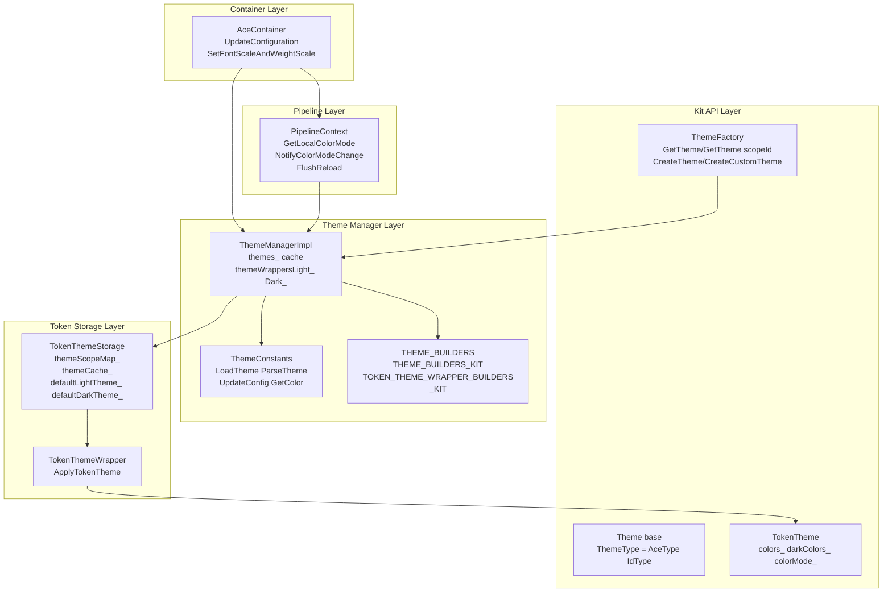
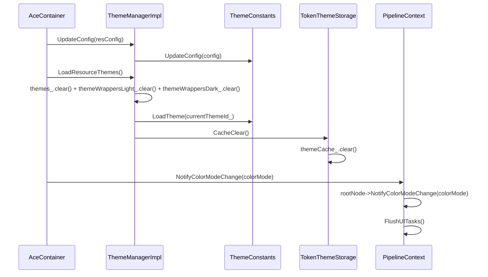
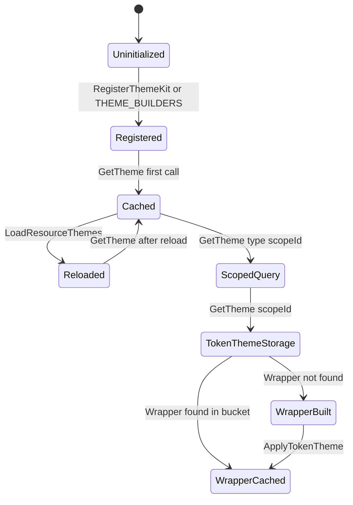

# 架构设计
> Theme 框架的架构设计文档，覆盖 Theme 注册、缓存、Token 主题存储、颜色模式切换和主题变更通知全链路。

## 设计元数据

| 字段 | 内容 |
|------|------|
| Design ID | DESIGN-Func-03-03-03 |
| 关联需求 | 已有能力补录（无独立 requirement.md） |
| 关联 Epic | 无 |
| 目标 Feature | Feat-01: Theme 框架全量规格（注册/缓存/Token/颜色模式/通知） |
| 复杂度 | 复杂 |
| 目标版本 | API 7 ~ API 26+ |
| Owner | ArkUI SIG |
| 状态 | Baselined（已有实现补录） |

## 需求基线

> 需求基线详见 proposal.md。以下仅列出设计阶段需要额外强调的要点。

| 项 | 补充说明（如需） |
|----|------------------|
| 双轨制注册 | 既有主题通过 THEME_BUILDERS 静态表注册（`theme_manager_impl.cpp:134-206`），组件化主题通过 THEME_BUILDERS_KIT 动态注册（`theme_manager_impl.cpp:256`），两套注册表共存 |
| 三级缓存 | themes_ 全局缓存、themeWrappersLight_/Dark_ 按颜色模式分桶的 Wrapper 缓存、TokenThemeStorage::themeCache_ 按 themeId 缓存 |
| 颜色模式临时切换 | Build 主题时若 localColorMode 与 systemMode 不一致，临时切换 ResourceManager 颜色模式，Build 完成后恢复（`theme_manager_impl.cpp:328-340, 400-415`） |

## 上下文和现状

### 涉及仓和模块

| 仓库 | 补充架构说明 |
|------|-------------|
| ace_engine | `frameworks/core/components/theme/theme_manager_impl.h/.cpp` — ThemeManagerImpl 实现，管理 themes_/themeWrappersLight_/Dark_ 缓存，RegisterThemeKit/RegisterCustomThemeKit 注册入口 |
| ace_engine | `frameworks/core/components/theme/theme_constants.h/.cpp` — ThemeConstants 资源常量管理，LoadTheme/ParseTheme/UpdateConfig/UpdateResourceAdapter |
| ace_engine | `frameworks/core/components/theme/theme_manager.h` — ThemeManager 抽象基类，定义 GetTheme/LoadResourceThemes/RegisterThemeKit 等虚接口 |
| ace_engine | `interfaces/inner_api/ace_kit/include/ui/view/theme/theme.h` — Theme 基类，ThemeType = AceType::IdType RTTI 类型标识 |
| ace_engine | `interfaces/inner_api/ace_kit/include/ui/view/theme/theme_factory.h` — ThemeFactory 静态工厂，CreateTheme/CreateCustomTheme/GetTheme/GetTheme(scopeId) |
| ace_engine | `interfaces/inner_api/ace_kit/include/ui/view/theme/token_theme.h` — TokenTheme，colors_/darkColors_/colorMode_，运行时颜色 Token 容器 |
| ace_engine | `frameworks/core/components_ng/token_theme/token_theme_storage.h/.cpp` — TokenThemeStorage 单例，themeScopeMap_/themeCache_/defaultLightTheme_/defaultDarkTheme_，系统主题 ID -1/-2 |
| ace_engine | `frameworks/core/components_ng/token_theme/token_theme_wrapper.h` — TokenThemeWrapper 基类，ApplyTokenTheme 应用 Token 主题到 Wrapper |

### 调用链层级分析

| 层 | 模块 | 职责 | 修改类型 |
|----|------|------|----------|
| Kit API | `interfaces/inner_api/ace_kit/include/ui/view/theme/theme_factory.h` | ThemeFactory::GetTheme/GetTheme(scopeId) 对外接口 | 无修改（规格补录） |
| Kit API | `interfaces/inner_api/ace_kit/include/ui/view/theme/theme.h` | Theme 基类定义，ThemeType = AceType::IdType | 无修改（规格补录） |
| Kit API | `interfaces/inner_api/ace_kit/include/ui/view/theme/token_theme.h` | TokenTheme 颜色容器，colors_/darkColors_/colorMode_ | 无修改（规格补录） |
| Theme Manager | `frameworks/core/components/theme/theme_manager_impl.h/.cpp` | ThemeManagerImpl: 注册/缓存/GetTheme 分发/LoadResourceThemes 清理重建 | 无修改（规格补录） |
| Theme Constants | `frameworks/core/components/theme/theme_constants.h/.cpp` | ThemeConstants: 资源解析、LoadTheme/ParseTheme/UpdateConfig | 无修改（规格补录） |
| Token Storage | `frameworks/core/components_ng/token_theme/token_theme_storage.h/.cpp` | TokenThemeStorage: scope→themeId 映射、themeCache_ 缓存、系统默认主题 | 无修改（规格补录） |
| Container | `adapter/ohos/entrance/ace_container.h/.cpp` | AceContainer: UpdateConfiguration → themeManager->UpdateConfig → LoadResourceThemes | 无修改（规格补录） |
| Pipeline | `frameworks/core/pipeline_ng/pipeline_context.h/.cpp` | PipelineContext: NotifyColorModeChange/FlushReload，GetLocalColorMode | 无修改（规格补录） |

### 适用架构规则

| Rule ID | 适用原因 | 设计结论 | 验证方式 |
|---------|----------|----------|----------|
| OH-ARCH-LAYERING | Theme 涉及 Kit API → ThemeManager → ThemeConstants/TokenThemeStorage 多层调用 | 调用方向自上而下，TokenThemeStorage 不直接访问 Kit API 层 | 代码评审 |
| OH-ARCH-SUBSYSTEM | TokenThemeStorage 通过 Container::CurrentColorMode 和 PipelineContext::GetLocalColorMode 获取颜色模式 | 跨模块查询通过 Container/PipelineContext 间接访问，无直接依赖 | 依赖检查 |
| OH-ARCH-API-LEVEL | ThemeFactory 和 TokenTheme 为 InnerApi 级别 | 组件化 Kit 通过 RegisterThemeKit 动态注册，不暴露 Public API | API 评审 |

## 不涉及项承接

> proposal.md 已完成 N/A 判定。本节仅对 proposal 中标记为"涉及"且需展开设计的维度给出结论。

| 维度 | 设计结论 |
|------|----------|
| 深色模式 | 双颜色集合：TokenTheme 持有 colors_ 和 darkColors_，通过 IsDark() 运行时选择。ThemeManagerImpl 通过 themeWrappersLight_/Dark_ 分桶缓存 Wrapper |
| 大字体 | 字体缩放通过 AceContainer::SetFontScaleAndWeightScale 处理，不在 Theme 框架内 |
| 版本升级兼容 | API 7 起支持基础 Theme，API 12+ 引入 TokenTheme/TokenThemeStorage，API 26+ 通过 ThemeFactory 统一入口 |

## 关键设计决策

| 决策 ID | 问题 | 推荐方案 | 探索过的替代方案 | 取舍理由 | 影响 |
|---------|------|----------|-----------------|----------|------|
| ADR-1 | 主题注册如何支持组件化 Kit | 双轨制：THEME_BUILDERS 静态表 + THEME_BUILDERS_KIT 动态注册，GetThemeKit 优先查询 Kit 注册表 | 仅静态表 | 动态注册允许组件化 Kit 延迟注册，避免修改 ace_engine 核心代码 | AC-1.1, AC-1.2 |
| ADR-2 | Token 主题如何缓存 | TokenThemeStorage 单例，themeCache_ 按 themeId 缓存 + themeScopeMap_ scope→themeId 映射 | 每 PipelineContext 独立缓存 | Token 主题全局共享，跨 Pipeline 复用；系统主题 ID -1/-2 特殊处理 | AC-3.1 ~ AC-3.4 |
| ADR-3 | Wrapper 缓存如何按颜色模式分桶 | themeWrappersLight_ 和 themeWrappersDark_ 两个 map，GetThemeWrappers(mode) 按模式选择 | 单 map + 运行时切换颜色 | 避免颜色模式切换时反复重建 Wrapper，分桶缓存各自独立 | AC-4.1 ~ AC-4.3 |
| ADR-4 | Build 主题时颜色模式不一致如何处理 | 临时切换 ResourceManager::UpdateColorMode 到 localColorMode，Build 完成后恢复到 systemMode | 始终使用系统颜色模式 | 保证 WithTheme 场景下资源解析使用局部颜色模式，同时不影响其他组件 | AC-5.1, AC-5.2 |
| ADR-5 | LoadResourceThemes 如何处理缓存 | 清空 themes_/themeWrappersLight_/Dark_ 三个缓存，重新 LoadTheme(currentThemeId_) | 增量更新 | 主题切换需要全量重建，增量更新复杂度高且容易遗漏；清空+重建最安全 | AC-6.1, AC-6.2 |
| ADR-6 | 系统主题默认值如何管理 | TokenThemeStorage 持有 defaultLightTheme_/defaultDarkTheme_，系统主题 ID -1(light)/-2(dark)，INVALID_THEME_SCOPE_ID=-3 | 每次从 ThemeConstants 实时读取 | 默认主题创建后缓存，避免重复 IO；GetDefaultTheme 惰性创建 | AC-3.1, AC-3.5 |
| ADR-7 | 多线程 Build 主题如何安全 | GetTheme 检查 MultiThreadBuildManager::IsThreadSafeNodeScope()，若是则走 GetThemeMultiThread，否则 std::recursive_mutex 保护 | 无锁 | 多线程场景下安全构建，普通场景使用递归锁保证重入安全 | AC-7.1, AC-7.2 |

## 设计骨架

### 骨架范围

| 骨架项 | 目标 | 不包含 | 验证方式 |
|--------|------|--------|----------|
| 主题注册 | THEME_BUILDERS + THEME_BUILDERS_KIT 双轨注册，TOKEN_THEME_WRAPPER_BUILDERS + _KIT 双轨注册 | 组件 Kit 内部 Build 逻辑 | UT |
| 主题缓存 | themes_ + themeWrappersLight_/Dark_ + TokenThemeStorage::themeCache_ 三级缓存 | Pipeline 级别缓存 | UT |
| GetTheme 分发 | GetTheme(type) → themes_ → Kit → Origin；GetTheme(type, scopeId) → TokenThemeStorage → Wrapper | 跨 Pipeline 主题共享 | UT |
| 颜色模式切换 | GetCurrentColorMode vs localColorMode，临时切换 ResourceManager::UpdateColorMode | 全局颜色模式设置 | UT |
| LoadResourceThemes | 清空三级缓存 + 重新 LoadTheme | 增量更新 | UT |
| Token 主题存储 | TokenThemeStorage: scopeMap/cache/defaultTheme/systemTheme | 用户自定义 Token 主题创建 | UT |

### 骨架 Spec 拆分

| Task ID | 目标 | 受影响文件 | AC |
|---------|------|-----------|-----|
| TASK-SKELETON-1 | Theme 框架全量规格补录（注册/缓存/Token/颜色模式/通知） | Feat-01-theme-framework-spec.md | AC-1.1 ~ AC-7.4 |

## 后续 Task 拆分

| Task ID | 目标 | 受影响文件 | 依赖 |
|---------|------|-----------|------|
| TASK-THEME-01 | Theme 框架全量规格补录 | Feat-01-theme-framework-spec.md, design.md | 无 |

## API 签名、Kit 与权限

### 新增 API

| API 签名 | 类型 | Kit | d.ts 位置 | 权限要求 | SysCap |
|----------|------|-----|-----------|----------|--------|
| `ThemeFactory::GetTheme(ThemeType type): RefPtr<Theme>` | InnerApi | ArkUI Kit | `interfaces/inner_api/ace_kit/include/ui/view/theme/theme_factory.h:33` | 无 | SystemCapability.ArkUI.ArkUI.Full |
| `ThemeFactory::GetTheme(ThemeType type, int32_t themeScopeId): RefPtr<Theme>` | InnerApi | ArkUI Kit | `interfaces/inner_api/ace_kit/include/ui/view/theme/theme_factory.h:41` | 无 | 同上 |
| `ThemeFactory::CreateTheme(ThemeType type, BuildFunc func): bool` | InnerApi | ArkUI Kit | `interfaces/inner_api/ace_kit/include/ui/view/theme/theme_factory.h:26` | 无 | 同上 |
| `ThemeFactory::CreateCustomTheme(ThemeType type, BuildThemeWrapperFunc func): bool` | InnerApi | ArkUI Kit | `interfaces/inner_api/ace_kit/include/ui/view/theme/theme_factory.h:27` | 无 | 同上 |
| `ThemeFactory::GetThemeScopeId(RefPtr<FrameNode>& node): int32_t` | InnerApi | ArkUI Kit | `interfaces/inner_api/ace_kit/include/ui/view/theme/theme_factory.h:49` | 无 | 同上 |
| `ThemeManager::RegisterThemeKit(ThemeType type, BuildFunc func)` | InnerApi | ArkUI Kit | `frameworks/core/components/theme/theme_manager.h:86` | 无 | 同上 |
| `ThemeManager::RegisterCustomThemeKit(ThemeType type, BuildThemeWrapperFunc func)` | InnerApi | ArkUI Kit | `frameworks/core/components/theme/theme_manager.h:88` | 无 | 同上 |

### 变更/废弃 API

| 原有 API | 变更类型 | 新 API | 迁移说明 |
|----------|----------|--------|----------|
| 无 | — | — | — |

## 构建系统影响

### BUILD.gn 变更

Theme 框架为 ace_engine 核心模块，无独立 SO 变更：

```
# frameworks/core/components/theme/BUILD.gn
# 无变更，theme_manager_impl.cpp 编译进 ace_engine 核心
# frameworks/core/components_ng/token_theme/BUILD.gn
# 无变更，token_theme_storage.cpp 编译进 ace_engine 核心
```

### bundle.json 变更

无新增 component，Theme 框架作为 ace_engine 内部模块。

## 可选设计扩展

### 架构图



### 数据流/控制流

| 步骤 | 调用方 | 被调用方 | 数据/接口 | 说明 |
|------|--------|----------|-----------|------|
| 1 | ThemeFactory | ThemeManagerImpl::GetTheme(type) | ThemeType | 主题查询入口 |
| 2 | ThemeManagerImpl | themes_.find(type) | RefPtr<Theme> | 先查全局缓存 |
| 3 | ThemeManagerImpl | GetThemeKit(type) → THEME_BUILDERS_KIT | BuildFunc | 再查 Kit 注册表 |
| 4 | ThemeManagerImpl | GetThemeOrigin(type) → THEME_BUILDERS | ThemeBuildFunc | 最后查静态注册表 |
| 5 | ThemeFactory | ThemeManagerImpl::GetTheme(type, scopeId) | ThemeType + scopeId | 带作用域的主题查询 |
| 6 | ThemeManagerImpl | TokenThemeStorage::GetTheme(scopeId) | RefPtr<TokenTheme> | 查 Token 主题 |
| 7 | ThemeManagerImpl | GetThemeWrappers(mode).find(type) | TokenThemeWrapper | 查 Wrapper 缓存 |
| 8 | ThemeManagerImpl | TOKEN_THEME_WRAPPER_BUILDERS.find(type) | BuildWrapperFunc | 构建 Wrapper |
| 9 | ThemeManagerImpl | wrapper->ApplyTokenTheme(tokenTheme) | TokenTheme& | 应用 Token 到 Wrapper |
| 10 | AceContainer | themeManager->LoadResourceThemes() | — | 主题变更后清理重建 |

### 时序设计



### 数据模型设计

**Kit 层类型 (C++)**:

```cpp
// Theme 基类 (theme.h:25)
class Theme : public virtual AceType {
    DECLARE_ACE_TYPE(Theme, AceType);
};
using ThemeType = AceType::IdType; // RTTI 类型标识

// TokenTheme (token_theme.h:27-111)
class TokenTheme : public virtual AceType {
    int32_t id_;                           // 主题 ID
    RefPtr<TokenColors> colors_;           // 亮色集合
    RefPtr<TokenColors> darkColors_;        // 暗色集合
    ColorMode colorMode_;                  // 颜色模式
    std::vector<RefPtr<ResourceObject>> resObjs;
    // IsDark(): colorMode_ == UNDEFINED ? IsDarkMode() : colorMode_ == DARK
    // Colors(): IsDark() ? darkColors_ : colors_
};

// TokenThemeStorage (token_theme_storage.h:29-85)
class TokenThemeStorage final {
    static constexpr int32_t INVALID_THEME_SCOPE_ID = -3;
    static constexpr int32_t SYSTEM_THEME_LIGHT_ID = -1;
    static constexpr int32_t SYSTEM_THEME_DARK_ID = -2;
    std::unordered_map<TokenThemeScopeId, int32_t> themeScopeMap_;  // scope → themeId
    std::map<int32_t, RefPtr<TokenTheme>> themeCache_;               // themeId → instance
    inline static RefPtr<TokenTheme> defaultLightTheme_ = nullptr;
    inline static RefPtr<TokenTheme> defaultDarkTheme_ = nullptr;
};
```

**框架层结构 (C++)**:

```cpp
// ThemeManagerImpl 缓存 (theme_manager_impl.h:148-156)
std::unordered_map<ThemeType, RefPtr<Theme>> themes_;        // 全局主题缓存
ThemeWrappers themeWrappersLight_;                           // 亮色 Wrapper 缓存
ThemeWrappers themeWrappersDark_;                             // 暗色 Wrapper 缓存
RefPtr<ThemeConstants> themeConstants_;                      // 资源常量
int32_t currentThemeId_ = -1;                                // 当前系统主题 ID
std::recursive_mutex themeMultiThreadMutex_;                 // 多线程保护
```

### 算法与状态机



### 测试性设计

| 测试层级 | 测试目标 | Mock 策略 | 验证方式 |
|----------|----------|----------|----------|
| UT | ThemeManagerImpl 双轨注册分发 | Mock ThemeConstants 和 ResourceAdapter | 验证 GetTheme 返回正确类型 |
| UT | TokenThemeStorage 缓存生命周期 | Mock PipelineContext::GetLocalColorMode | 验证 CacheClear/CacheSet/CacheGet 行为 |
| UT | 颜色模式临时切换 | Mock ResourceManager::UpdateColorMode | 验证 needRestore 路径 |
| UT | 多线程 GetTheme | Mock MultiThreadBuildManager::IsThreadSafeNodeScope | 验证 GetThemeMultiThread 分支 |

### 资源所有权矩阵

| 资源 | 创建方 | 持有方 | 销毁触发 | 实际释放 | 异常回收 |
|------|--------|--------|----------|----------|----------|
| Theme 实例 | ThemeManagerImpl::GetThemeOrigin/GetThemeKit | themes_ map | LoadResourceThemes clear | RefPtr 引用计数归零 | 自动释放 |
| TokenTheme 实例 | TokenThemeStorage::CreateSystemTokenTheme | themeCache_ map | CacheClear | RefPtr 引用计数归零 | 自动释放 |
| TokenThemeWrapper | ThemeManagerImpl::GetThemeOrigin(scopeId) | themeWrappersLight_/Dark_ | LoadResourceThemes clear | RefPtr 引用计数归零 | 自动释放 |
| ThemeConstants | ThemeManagerImpl 构造函数 | ThemeManagerImpl themeConstants_ | ThemeManagerImpl 析构 | RefPtr 引用计数归零 | 自动释放 |
| defaultLightTheme_/defaultDarkTheme_ | TokenThemeStorage::CreateSystemTokenTheme | TokenThemeStorage static | 进程退出 | 静态 RefPtr | 进程级 |

## 详细设计

### 双轨注册机制

Theme 注册使用两套并行的注册表（`theme_manager_impl.cpp:134-257`）：

1. **静态注册表** (`THEME_BUILDERS`, `TOKEN_THEME_WRAPPER_BUILDERS`): 编译时固定，映射 ThemeType → BuildFunc。通过 `T().Build(themeConstants)` 或 `T().BuildWrapper(themeConstants)` 构建主题。
2. **动态注册表** (`THEME_BUILDERS_KIT`, `TOKEN_THEME_WRAPPER_BUILDERS_KIT`): 运行时通过 `RegisterThemeKit`/`RegisterCustomThemeKit` 注册，允许组件化 Kit 延迟注册。

GetTheme 分发优先级（`theme_manager_impl.cpp:293-348`）：
```
GetThemeNormal(type):
  1. themes_.find(type) → 命中则直接返回
  2. GetThemeKit(type) → 查 THEME_BUILDERS_KIT
  3. GetThemeOrigin(type) → 查 THEME_BUILDERS 静态表
```

带 scopeId 的分发（`theme_manager_impl.cpp:369-419`）：
```
GetThemeNormal(type, scopeId):
  1. GetThemeKit(type, scopeId) → 查 TOKEN_THEME_WRAPPER_BUILDERS_KIT
  2. GetThemeOrigin(type, scopeId) → 查 TOKEN_THEME_WRAPPER_BUILDERS 静态表
  3. 两者都 miss → 回退到 GetTheme(type)
```

### 颜色模式临时切换

当 WithTheme 设置了局部颜色模式（localColorMode），而系统颜色模式（systemMode）不同时，Build 主题前需要临时切换 ResourceManager 的颜色模式（`theme_manager_impl.cpp:400-415`）：

```
needRestore = false
if themeMode != UNDEFINED and themeMode != currentMode:
    ResourceManager::UpdateColorMode(bundle, module, instanceId, themeMode)
    pipeline->SetLocalColorMode(themeMode)
    needRestore = true
// Build wrapper...
if needRestore:
    pipeline->SetLocalColorMode(UNDEFINED)
    ResourceManager::UpdateColorMode(bundle, module, instanceId, currentMode)
```

对于普通主题（非 Wrapper），GetThemeKit 中有类似逻辑（`theme_manager_impl.cpp:328-340`），但方向相反：将 localColorMode 临时恢复到 systemMode 进行 Build，然后恢复 localColorMode。

### TokenThemeStorage 缓存管理

系统主题使用特殊 ID（`token_theme_storage.h:61-62`）：
- `SYSTEM_THEME_LIGHT_ID = -1`
- `SYSTEM_THEME_DARK_ID = -2`
- `INVALID_THEME_SCOPE_ID = -3`

GetTheme(scopeId) 查询逻辑（`token_theme_storage.cpp:61-71`）：
```
if scopeId == 0:
    return GetDefaultTheme()  // 返回系统默认主题
iter = themeScopeMap_.find(scopeId)
if iter == end:
    return nullptr  // INVALID_THEME_SCOPE_ID 场景
return CacheGet(iter->second)  // 从 themeCache_ 获取
```

CacheClear（`token_theme_storage.cpp:121-125`）在 LoadResourceThemes 时被调用，清空 themeCache_。CacheResetColor（`token_theme_storage.cpp:153-175`）在颜色模式切换的快速路径中被调用，重新解析所有缓存主题的颜色。

## 风险和开放问题

| 项 | 类型 | 影响 | 处理方式 | Owner |
|----|------|------|----------|-------|
| 双注册表一致性 | 架构 | 中 | THEME_BUILDERS_KIT 和 THEME_BUILDERS 可能注册相同 ThemeType，GetThemeKit 优先 | 通过 RegisterThemeKit 中的 findIter 检查避免重复注册 | ArkUI SIG |
| 多线程递归锁性能 | 架构 | 低 | std::recursive_mutex 在高并发场景可能成为瓶颈 | MultiThreadBuildManager::IsThreadSafeNodeScope 分流 | ArkUI SIG |
| defaultLightTheme_/defaultDarkTheme_ 生命周期 | 架构 | 中 | 静态 inline 变量，进程级生命周期 | 已有设计，通过 systemTokenThemeCreated_ 标记避免重复创建 | ArkUI SIG |
| 颜色模式临时切换的线程安全 | 架构 | 中 | UpdateColorMode 是全局操作，临时切换可能影响其他线程 | 仅在 UI 线程执行，PipelineContext 线程绑定 | ArkUI SIG |

## 设计审批

- [x] 需求基线已确认，设计覆盖 P0/P1 AC
- [x] 不涉及项已承接，N/A 和展开项都有结论
- [x] 涉及仓和模块职责清楚
- [x] 调用链层级分析完整，每层覆盖到位
- [x] 适用架构规则已识别并形成设计结论
- [x] 分层和子系统边界合规
- [x] API 变更有签名、权限、错误码和兼容性说明
- [x] BUILD.gn/bundle.json 影响明确
- [x] 设计输出和后续 Task 拆分明确
- [x] 关键设计决策有理由和影响说明
- [x] 风险和开放问题有 Owner

**结论:** 通过（已有实现补录）
