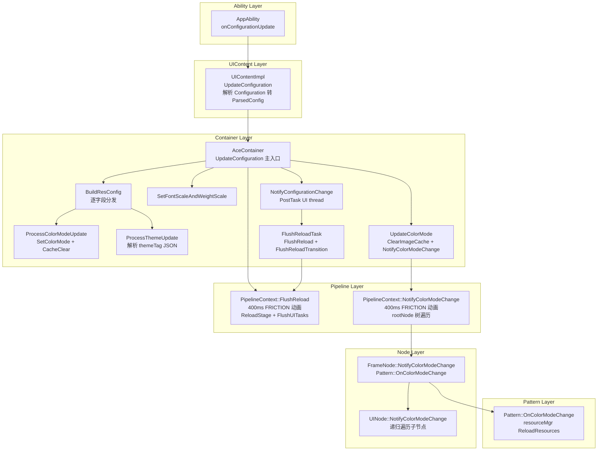
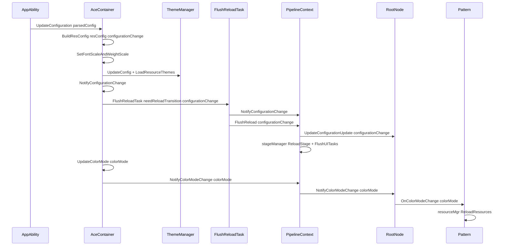
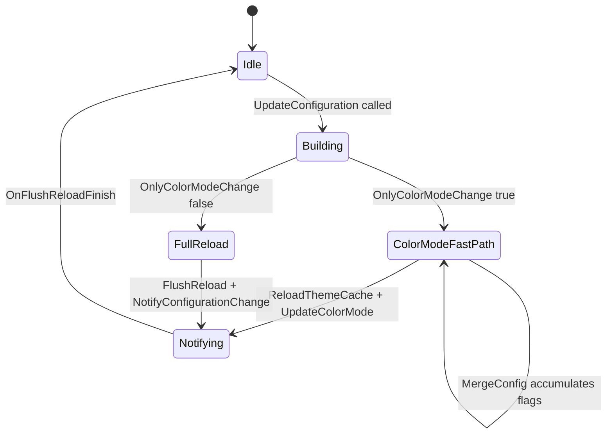

# 架构设计
> 资源动态切换的架构设计文档，覆盖 ConfigurationChange 位域分发、颜色模式快速路径、FlushReload 全量重建和颜色模式变更树遍历通知全链路。

## 设计元数据

| 字段 | 内容 |
|------|------|
| Design ID | DESIGN-Func-03-03-04 |
| 关联需求 | 已有能力补录（无独立 requirement.md） |
| 关联 Epic | 无 |
| 目标 Feature | Feat-01: 资源动态切换全量规格（ConfigurationChange/颜色模式/FlushReload/通知） |
| 复杂度 | 复杂 |
| 目标版本 | API 7 ~ API 26+ |
| Owner | ArkUI SIG |
| 状态 | Baselined（已有实现补录） |

## 需求基线

> 需求基线详见 proposal.md。以下仅列出设计阶段需要额外强调的要点。

| 项 | 补充说明（如需） |
|----|------------------|
| 位域分发 | ConfigurationChange 使用 bool 位域标记 10 种配置变更类型，BuildResConfig 逐字段分发设置对应标志（`ace_container.cpp:3629-3667`） |
| 快速路径 | OnlyColorModeChange 为 true 时跳过完整 FlushReload，走 ReloadThemeCache + UpdateColorMode 快速路径（`ace_container.cpp:3789-3793`） |
| 后台 vsync 强制 | 后台应用切换深浅色时，白名单应用强制 vsync 请求（`ace_container.cpp:3719-3728`） |
| MergeConfig 累积 | ConfigurationChange::MergeConfig 使用 |= 操作符累积多个配置变更标志（`resource_configuration.h:44-55`） |

## 上下文和现状

### 涉及仓和模块

| 仓库 | 补充架构说明 |
|------|-------------|
| ace_engine | `interfaces/inner_api/ace_kit/include/ui/resource/resource_configuration.h` — ConfigurationChange 位域结构，10 个 bool 标志 + IsNeedUpdate/OnlyColorModeChange/MergeConfig |
| ace_engine | `adapter/ohos/entrance/ace_container.h/.cpp` — AceContainer: UpdateConfiguration/BuildResConfig/ProcessColorModeUpdate/ProcessThemeUpdate/UpdateColorMode/FlushReloadTask/NotifyConfigurationChange，ParsedConfig 结构 |
| ace_engine | `frameworks/core/pipeline_ng/pipeline_context.h/.cpp` — PipelineContext: NotifyColorModeChange(400ms FRICTION)/FlushReload/OnFlushReloadFinish/OnSurfaceChanged |
| ace_engine | `frameworks/core/components_ng/base/frame_node.h/.cpp` — FrameNode: SetColorModeUpdateCallback/HandleColorModeConfigurationUpdate/NotifyColorModeChange 树遍历 |
| ace_engine | `frameworks/core/components_ng/base/ui_node.h/.cpp` — UINode: NotifyColorModeChange 递归遍历子节点/HandleColorModeChange |
| ace_engine | `frameworks/core/components_ng/pattern/pattern.h/.cpp` — Pattern: OnColorModeChange 虚函数，默认 ReloadResources |

### 调用链层级分析

| 层 | 模块 | 职责 | 修改类型 |
|----|------|------|----------|
| Ability | AppAbility::onConfigurationUpdate | 接收系统配置变更事件 | 无修改（规格补录） |
| UIContent | `adapter/ohos/entrance/ui_content_impl.cpp` | UIContentImpl::UpdateConfiguration 解析 Configuration 转 ParsedConfig | 无修改（规格补录） |
| Container | `adapter/ohos/entrance/ace_container.cpp` | AceContainer::UpdateConfiguration 主入口，BuildResConfig 逐字段分发 | 无修改（规格补录） |
| Container | `ace_container.cpp:ProcessColorModeUpdate` | 颜色模式更新：SetColorMode/SetColorScheme/TokenThemeStorage::CacheClear | 无修改（规格补录） |
| Container | `ace_container.cpp:ProcessThemeUpdate` | 主题更新：解析 themeTag JSON，设置 fontUpdate/iconUpdate/skinUpdate | 无修改（规格补录） |
| Container | `ace_container.cpp:SetFontScaleAndWeightScale` | 字体缩放和字重缩放设置 | 无修改（规格补录） |
| Container | `ace_container.cpp:UpdateColorMode` | 颜色模式更新：ClearImageCache/SetAppBgColor/NotifyColorModeChange | 无修改（规格补录） |
| Container | `ace_container.cpp:FlushReloadTask` | 重建任务：SetAppBgColor/NotifyConfigurationChange/FlushReload/FlushReloadTransition | 无修改（规格补录） |
| Pipeline | `frameworks/core/pipeline_ng/pipeline_context.cpp` | FlushReload: 400ms FRICTION 动画 + rootNode->UpdateConfigurationUpdate + stageManager->ReloadStage | 无修改（规格补录） |
| Pipeline | `pipeline_context.cpp:NotifyColorModeChange` | 颜色模式变更：400ms FRICTION 动画 + rootNode->NotifyColorModeChange 树遍历 | 无修改（规格补录） |
| FrameNode | `frameworks/core/components_ng/base/frame_node.cpp` | NotifyColorModeChange: Pattern::OnColorModeChange + configurationUpdateCallback_ + colorModeUpdateCallback_ | 无修改（规格补录） |
| UINode | `frameworks/core/components_ng/base/ui_node.cpp` | NotifyColorModeChange 递归遍历子节点 + HandleColorModeChange | 无修改（规格补录） |
| Pattern | `frameworks/core/components_ng/pattern/pattern.cpp` | OnColorModeChange: resourceMgr_->ReloadResources() | 无修改（规格补录） |

### 适用架构规则

| Rule ID | 适用原因 | 设计结论 | 验证方式 |
|---------|----------|----------|----------|
| OH-ARCH-LAYERING | 配置变更涉及 Ability → UIContent → AceContainer → Pipeline → FrameNode → Pattern 多层调用 | 调用方向自上而下，Pattern 不直接访问 Container | 代码评审 |
| OH-ARCH-SUBSYSTEM | AceContainer 通过 ResourceManager 跨模块更新资源适配器 | 通过 ResourceManager 单例间接调用，不直接依赖 resource 子系统 | 依赖检查 |
| OH-ARCH-ERROR-LOG | 配置变更使用 TAG_LOGI/LOGI/LOGW 记录关键节点 | 日志覆盖 UpdateConfiguration/FlushReload/NotifyColorModeChange | hilog |
| OH-ARCH-COMPONENT-BUILD | 配置变更影响所有组件的 Pattern::OnColorModeChange | 通过虚函数分发，各 Pattern 自行处理颜色模式变更 | 集成测试 |

## 不涉及项承接

> proposal.md 已完成 N/A 判定。本节仅对 proposal 中标记为"涉及"且需展开设计的维度给出结论。

| 维度 | 设计结论 |
|------|----------|
| 深色模式 | 颜色模式变更是核心场景，通过 ProcessColorModeUpdate → UpdateColorMode → NotifyColorModeChange 链路处理。OnlyColorModeChange 走快速路径 |
| 大字体 | fontScale/fontWeightScale 变更通过 SetFontScaleAndWeightScale 处理，设置 configurationChange.fontScaleUpdate/fontWeightScaleUpdate |
| 多窗口 | 子容器通过 NotifyConfigToSubContainers 传递配置变更，UpdateSubContainerDensity 同步密度 |
| 版本升级 | ConfigChangePerform() 为 true 时启用颜色模式快速路径，API 7 基础框架 → API 12+ 增强路径 |

## 关键设计决策

| 决策 ID | 问题 | 推荐方案 | 探索过的替代方案 | 取舍理由 | 影响 |
|---------|------|----------|-----------------|----------|------|
| ADR-1 | 配置变更如何标记影响范围 | ConfigurationChange 使用 10 个 bool 位域，BuildResConfig 逐字段判断设置 | 枚举 + set 容器 | 位域紧凑高效，MergeConfig 用 |= 累积，OnlyColorModeChange 快速判断 | AC-1.1 ~ AC-1.3 |
| ADR-2 | 仅颜色模式变更是否走完整重建 | 不走，OnlyColorModeChange 走快速路径：ReloadThemeCache + OnFrontUpdated + UpdateColorMode | 统一走 FlushReload | 颜色模式变更只需更新颜色相关资源，全量重建开销过大 | AC-2.1, AC-2.2 |
| ADR-3 | FlushReload 是否使用动画 | 是，400ms FRICTION 曲线包裹 changeTask | 同步执行无动画 | 颜色/主题切换有视觉过渡，FRICTION 曲线符合自然感知 | AC-3.1, AC-3.2 |
| ADR-4 | 颜色模式变更如何通知到所有节点 | rootNode->NotifyColorModeChange(colorMode) 递归遍历整棵树，每个 FrameNode 调用 Pattern::OnColorModeChange | 仅通知可见节点 | 确保所有节点（含懒加载/缓存）颜色一致，但通过 Rerenderable 优化跳过不可见分支 | AC-4.1 ~ AC-4.3 |
| ADR-5 | 后台应用颜色模式切换如何处理 | 白名单应用强制 vsync 请求，非白名单延迟到前台再处理 | 始终处理 | 后台处理避免用户切回时看到闪烁，但消耗后台资源；仅白名单应用 | AC-5.1, AC-5.2 |
| ADR-6 | 图片缓存是否在颜色模式变更时清理 | 是，pipelineContext_->ClearImageCache() + ImageDecoder::ClearPixelMapCache() | 不清理 | 深浅色模式下图片资源可能不同，缓存需同步清理避免显示旧资源 | AC-6.1, AC-6.2 |
| ADR-7 | 子容器配置变更如何传递 | NotifyConfigToSubContainers 遍历 configurationChangedCallbacks_ map | 每 Pipeline 独立监听 | 统一入口管理，子容器注册回调即可接收 | AC-7.1, AC-7.2 |
| ADR-8 | themeTag 如何解析 | JsonUtil::ParseJsonString 解析 fonts/icons/skin 字段，设置对应 ConfigurationChange 标志 | 平铺配置 | themeTag 是 JSON 复合格式，支持多维度主题变更标记 | AC-8.1 ~ AC-8.3 |

## 设计骨架

### 骨架范围

| 骨架项 | 目标 | 不包含 | 验证方式 |
|--------|------|--------|----------|
| ConfigurationChange 位域 | 10 个 bool 标志 + IsNeedUpdate/OnlyColorModeChange/MergeConfig | 标志的语义解释 | UT |
| BuildResConfig 分发 | colorMode/deviceAccess/language/fontFamily/direction/dpi/themeTag/fontScale/fontWeightScale 逐字段分发 | Mcc/Mnc 处理 | UT |
| 颜色模式更新链路 | ProcessColorModeUpdate → UpdateColorMode → NotifyColorModeChange | 主题构建（Theme 框架域） | UT + 集成测试 |
| FlushReload 重建 | FlushReloadTask → pipeline->FlushReload → stageManager->ReloadStage → FlushUITasks | 前端 FlushReload | UT |
| 颜色模式树遍历 | rootNode->NotifyColorModeChange → Pattern::OnColorModeChange → resourceMgr_->ReloadResources | 单个 Pattern 的 OnColorModeChange 重写 | UT |
| 快速路径 | OnlyColorModeChange → ReloadThemeCache + UpdateColorMode，跳过 FlushReload | 完整 FlushReload | UT |
| 后台 vsync | CheckForceVsync → window->SetForceVsyncRequests(true) | 前台动画 | UT |

### 骨架 Spec 拆分

| Task ID | 目标 | 受影响文件 | AC |
|---------|------|-----------|-----|
| TASK-SKELETON-1 | 资源动态切换全量规格补录 | Feat-01-resource-dynamic-switching-spec.md | AC-1.1 ~ AC-8.3 |

## 后续 Task 拆分

| Task ID | 目标 | 受影响文件 | 依赖 |
|---------|------|-----------|------|
| TASK-RES-SWITCH-01 | 资源动态切换全量规格补录 | Feat-01-resource-dynamic-switching-spec.md, design.md | 无 |

## API 签名、Kit 与权限

### 新增 API

| API 签名 | 类型 | Kit | d.ts 位置 | 权限要求 | SysCap |
|----------|------|-----|-----------|----------|--------|
| `ConfigurationChange::IsNeedUpdate(): bool` | InnerApi | ArkUI Kit | `interfaces/inner_api/ace_kit/include/ui/resource/resource_configuration.h:32` | 无 | SystemCapability.ArkUI.ArkUI.Full |
| `ConfigurationChange::OnlyColorModeChange(): bool` | InnerApi | ArkUI Kit | `interfaces/inner_api/ace_kit/include/ui/resource/resource_configuration.h:38` | 无 | 同上 |
| `ConfigurationChange::MergeConfig(const ConfigurationChange&): void` | InnerApi | ArkUI Kit | `interfaces/inner_api/ace_kit/include/ui/resource/resource_configuration.h:44` | 无 | 同上 |
| `AceContainer::UpdateConfiguration(ParsedConfig&, string&, bool)` | InnerApi | ArkUI Kit | `adapter/ohos/entrance/ace_container.h:648` | 无 | 同上 |
| `AceContainer::FlushReloadTask(bool, ConfigurationChange&)` | InnerApi | ArkUI Kit | `adapter/ohos/entrance/ace_container.h:1014` | 无 | 同上 |
| `PipelineContext::FlushReload(ConfigurationChange&, bool)` | InnerApi | ArkUI Kit | `frameworks/core/pipeline_ng/pipeline_context.h:650` | 无 | 同上 |
| `PipelineContext::NotifyColorModeChange(uint32_t)` | InnerApi | ArkUI Kit | `frameworks/core/pipeline_ng/pipeline_context.h:1073` | 无 | 同上 |
| `FrameNode::SetColorModeUpdateCallback(function<void()>&&)` | InnerApi | ArkUI Kit | `frameworks/core/components_ng/base/frame_node.h:853` | 无 | 同上 |
| `Pattern::OnColorModeChange(uint32_t)` | InnerApi | ArkUI Kit | `frameworks/core/components_ng/pattern/pattern.h:466` | 无 | 同上 |

### 变更/废弃 API

| 原有 API | 变更类型 | 新 API | 迁移说明 |
|----------|----------|--------|----------|
| 无 | — | — | — |

## 构建系统影响

### BUILD.gn 变更

资源动态切换为 ace_engine 核心模块，无独立 SO 变更：

```
# adapter/ohos/entrance/BUILD.gn
# 无变更，ace_container.cpp 编译进 ace_engine 核心
# frameworks/core/pipeline_ng/BUILD.gn
# 无变更，pipeline_context.cpp 编译进 ace_engine 核心
```

### bundle.json 变更

无新增 component，资源动态切换作为 ace_engine 内部模块。

## 可选设计扩展

### 架构图



### 数据流/控制流

| 步骤 | 调用方 | 被调用方 | 数据/接口 | 说明 |
|------|--------|----------|-----------|------|
| 1 | AppAbility | UIContentImpl::UpdateConfiguration | Configuration 对象 | 系统配置变更入口 |
| 2 | UIContentImpl | AceContainer::UpdateConfiguration | ParsedConfig + configuration name | 解析后传递 |
| 3 | AceContainer | BuildResConfig | resConfig + configurationChange | 逐字段分发设置标志 |
| 4 | BuildResConfig | ProcessColorModeUpdate | colorMode → configurationChange.colorModeUpdate | 颜色模式分发 |
| 5 | BuildResConfig | ProcessThemeUpdate | themeTag → fontUpdate/iconUpdate/skinUpdate | 主题标签解析 |
| 6 | AceContainer | SetFontScaleAndWeightScale | fontScale/fontWeightScale | 字体缩放设置 |
| 7 | AceContainer | themeManager->UpdateConfig + LoadResourceThemes | resConfig | 主题更新 |
| 8 | AceContainer | NotifyConfigurationChange | needReloadTransition + configurationChange | PostTask 到 UI 线程 |
| 9 | NotifyConfigurationChange | FlushReloadTask | configurationChange | 重建任务 |
| 10 | FlushReloadTask | pipeline->FlushReload | configurationChange | Pipeline 重建 |
| 11 | PipelineContext | rootNode->UpdateConfigurationUpdate | configurationChange | 树遍历配置更新 |
| 12 | PipelineContext | stageManager->ReloadStage | — | Stage 重建 |
| 13 | AceContainer | UpdateColorMode | colorMode | 颜色模式更新 |
| 14 | UpdateColorMode | pipeline->NotifyColorModeChange | colorMode | 颜色模式通知 |
| 15 | NotifyColorModeChange | rootNode->NotifyColorModeChange | colorMode | 树遍历颜色变更 |
| 16 | FrameNode | pattern_->OnColorModeChange | colorMode | Pattern 颜色处理 |
| 17 | Pattern | resourceMgr_->ReloadResources | — | 资源重载 |

### 时序设计



### 数据模型设计

**Kit 层类型 (C++)**:

```cpp
// ConfigurationChange (resource_configuration.h:20-56)
struct ConfigurationChange {
    bool colorModeUpdate = false;
    bool languageUpdate = false;
    bool directionUpdate = false;
    bool dpiUpdate = false;
    bool fontUpdate = false;
    bool iconUpdate = false;
    bool skinUpdate = false;
    bool fontScaleUpdate = false;
    bool fontWeightScaleUpdate = false;
    bool hotReloadUpdate = false;

    bool IsNeedUpdate() const;        // 任一标志为 true
    bool OnlyColorModeChange() const; // 仅 colorModeUpdate 为 true
    void MergeConfig(const ConfigurationChange& config); // |= 累积
};

// ParsedConfig (ace_container.h:86-108)
struct ParsedConfig {
    std::string colorMode;
    std::string deviceAccess;
    std::string languageTag;
    std::string direction;
    std::string densitydpi;
    std::string themeTag;
    std::string fontFamily;
    std::string fontScale;
    std::string fontWeightScale;
    std::string colorModeIsSetByApp;
    std::string mcc;
    std::string mnc;
    std::string preferredLanguage;
    std::string fontId;
    bool IsValid() const; // 所有字段非空则有效
};
```

### 算法与状态机



### 测试性设计

| 测试层级 | 测试目标 | Mock 策略 | 验证方式 |
|----------|----------|----------|----------|
| UT | ConfigurationChange 位域逻辑 | 无需 Mock | 验证 IsNeedUpdate/OnlyColorModeChange/MergeConfig |
| UT | BuildResConfig 逐字段分发 | Mock ThemeConstants/FontManager | 验证各字段设置正确标志 |
| UT | FlushReload 动画包裹 | Mock AnimationUtils::Animate | 验证 changeTask 执行和回调 |
| UT | NotifyColorModeChange 树遍历 | Mock FrameNode 树结构 | 验证递归调用到叶子节点 |
| 集成测试 | 端到端配置变更 | Mock AppAbility 配置 | 验证 UI 更新一致性 |

### 资源所有权矩阵

| 资源 | 创建方 | 持有方 | 销毁触发 | 实际释放 | 异常回收 |
|------|--------|--------|----------|----------|----------|
| ConfigurationChange | AceContainer::UpdateConfiguration 栈上构造 | 调用链传递（值传递） | 函数返回 | 自动 | 自动 |
| ParsedConfig | UIContentImpl 构造 | 调用链传递（const 引用） | 函数返回 | 自动 | 自动 |
| ImageCache | PipelineContext | PipelineContext | ClearImageCache 调用 | 清空缓存 map | 自动 |
| colorModeUpdateCallback_ | FrameNode::SetColorModeUpdateCallback | FrameNode 成员 | FrameNode 析构 | std::function 析构 | 自动 |

### 线程与并发模型

| 操作 | 发起线程 | 回调线程 | 跨进程边界 | 线程安全 | 重入约束 |
|------|----------|----------|------------|----------|----------|
| UpdateConfiguration | Ability 线程 | UI 线程 | 无 | PostTask 到 UI | 不可重入 |
| FlushReloadTask | UI 线程 | UI 线程 | 无 | UI 线程绑定 | 不可重入 |
| NotifyColorModeChange | UI 线程 | UI 线程 | 无 | UI 线程绑定 | 不可重入 |
| NotifyConfigToSubContainers | UI 线程 | UI 线程 | 可能跨容器 | configurationChangedCallbacks_ 加锁 | 可重入 |

## 详细设计

### BuildResConfig 逐字段分发

BuildResConfig（`ace_container.cpp:3629-3667`）按 ParsedConfig 各字段非空判断，逐一设置 ConfigurationChange 标志和 ResourceConfiguration 值：

1. **colorMode** → `ProcessColorModeUpdate`（设置 colorModeUpdate + CacheClear）
2. **deviceAccess** → `SystemProperties::SetDeviceAccess` + `resConfig.SetDeviceAccess`
3. **languageTag** → `ParseLanguage` + `resConfig.SetLanguage`
4. **fontFamily** → `fontManager->SetAppCustomFont` + `configurationChange.fontUpdate = true`
5. **direction** → `ProcessDirectionUpdate` + `resConfig.SetOrientation`
6. **densitydpi** → `configurationChange.dpiUpdate = true`
7. **themeTag** → `ProcessThemeUpdate`（解析 JSON 设置 fontUpdate/iconUpdate/skinUpdate）
8. **colorModeIsSetByApp** → `resConfig.SetColorModeIsSetByApp(true)`
9. **mcc/mnc** → `resConfig.SetMcc/SetMnc`

### 颜色模式快速路径

当 `SystemProperties::ConfigChangePerform()` 为 true 且 `configurationChange.OnlyColorModeChange()` 为 true 时（`ace_container.cpp:3789-3793`），跳过完整 FlushReload：

```
// 快速路径
ReloadThemeCache()         // TokenThemeStorage::CacheResetColor()
OnFrontUpdated()           // front->OnConfigurationUpdated(configuration)
UpdateColorMode(colorMode) // ClearImageCache + SetAppBgColor + NotifyColorModeChange
return                     // 跳过完整 FlushReload
```

否则走完整路径（`ace_container.cpp:3795-3809`）：
```
OnFrontUpdated()
PluginManager::UpdateConfigurationInPlugin(resConfig)
pipelineContext_->SaveConfigurationConfig(configurationChange)
NotifyConfigurationChange(deviceAccess, configurationChange)
NotifyConfigToSubContainers(parsedConfig, configuration)
pipelineContext_->ClearImageCache()
ImageDecoder::ClearPixelMapCache()
NotifyArkoalaConfigurationChange(configurationChange)
```

### FlushReload 动画包裹

FlushReload（`pipeline_context.cpp:5891-5939`）根据 onShow_ 决定执行方式：

- **后台（!onShow_）**: 同步执行 changeTask，无动画
- **前台（onShow_）**: 400ms FRICTION 动画包裹 changeTask + OnFlushReloadFinish 回调

changeTask 内容：
1. `fontManager->UpdateStyleOptimizeFlagInCurrentLanguage()`（语言变更时）
2. `rootNode->UpdateConfigurationUpdate(configurationChange)`（配置变更或图标变更时）
3. `overlay->ReloadBuilderNodeConfig()`（overlay 变更时）
4. `stageManager->ReloadStage()` + `FlushUITasks()`（fullUpdate 且 IsNeedUpdate 时）

### NotifyColorModeChange 树遍历

NotifyColorModeChange（`pipeline_context.cpp:7621-7657`）使用 400ms FRICTION 动画包裹：

```
AnimationOption option(duration=400, curve=FRICTION)
AnimationUtils::Animate(option, {
    rootNode->SetDarkMode(rootColorMode == DARK)
    rootNode->NotifyColorModeChange(colorMode)  // 递归遍历
    pipeline->FlushUITasks()
}, {
    pipeline->OnFlushReloadFinish()
})
```

FrameNode::NotifyColorModeChange（`frame_node.cpp:1949-1991`）：
1. `FireColorNDKCallback()` — 触发 NDK 颜色回调
2. 若 `GetLocalColorMode() != UNDEFINED` → 直接委托 UINode 递归
3. 否则：`SetRerenderable` + `SetDarkMode` + `configurationUpdateCallback_` + `pattern_->OnColorModeChange` + `UINode::NotifyColorModeChange`（递归子节点）

UINode::NotifyColorModeChange（`ui_node.cpp:2221-2250`）递归遍历所有子节点，传播 `shouldClearCache`/`rerenderable`/`measureAnyway`/`forceDarkAllowed` 标志。

Pattern::OnColorModeChange（`pattern.cpp:62-67`）默认行为：`resourceMgr_->ReloadResources()`。各子类可重写以添加特定颜色处理逻辑。

## 风险和开放问题

| 项 | 类型 | 影响 | 处理方式 | Owner |
|----|------|------|----------|-------|
| 400ms 动画期间用户操作 | 架构 | 中 | 动画期间 UI 线程忙碌，可能丢帧 | FRICTION 曲线平滑过渡，OnFlushReloadFinish 回调清理 | ArkUI SIG |
| 后台 vsync 资源消耗 | 架构 | 中 | 白名单应用后台 vsync 消耗 GPU | 仅白名单应用启用，CheckForceVsync 严格判断 | ArkUI SIG |
| 树遍历性能 | 架构 | 中 | 大型 UI 树 NotifyColorModeChange 递归耗时 | Rerenderable 标志跳过不可见分支 | ArkUI SIG |
| MergeConfig 累积语义 | 架构 | 低 | 多次 MergeConfig 后无法区分单次变更 | 位域累积设计，仅标记"是否变更"不记录次数 | ArkUI SIG |

## 设计审批

- [x] 需求基线已确认，设计覆盖 P0/P1 AC
- [x] 不涉及项已承接，N/A 和展开项都有结论
- [x] 涉及仓和模块职责清楚
- [x] 调用链层级分析完整，每层覆盖到位
- [x] 适用架构规则已识别并形成设计结论
- [x] 分层和子系统边界合规
- [x] API 变更有签名、权限、错误码和兼容性说明
- [x] BUILD.gn/bundle.json 影响明确
- [x] 设计输出和后续 Task 拆分明确
- [x] 关键设计决策有理由和影响说明
- [x] 风险和开放问题有 Owner

**结论:** 通过（已有实现补录）
