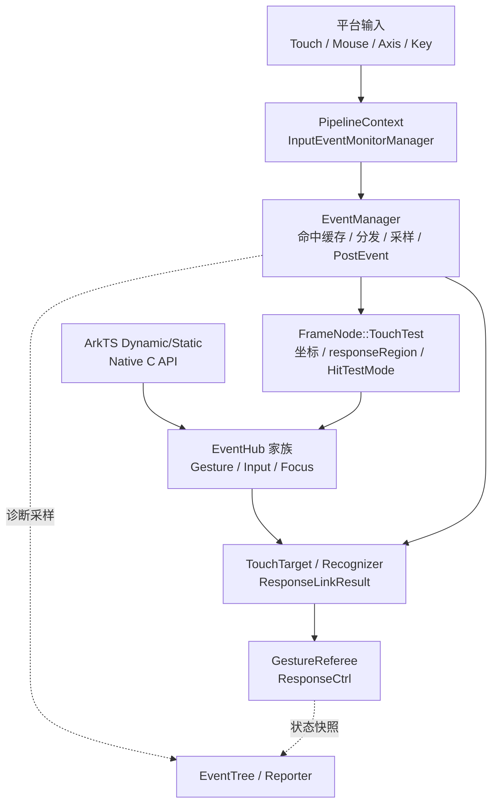
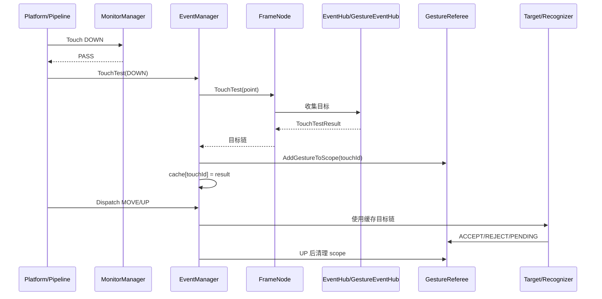
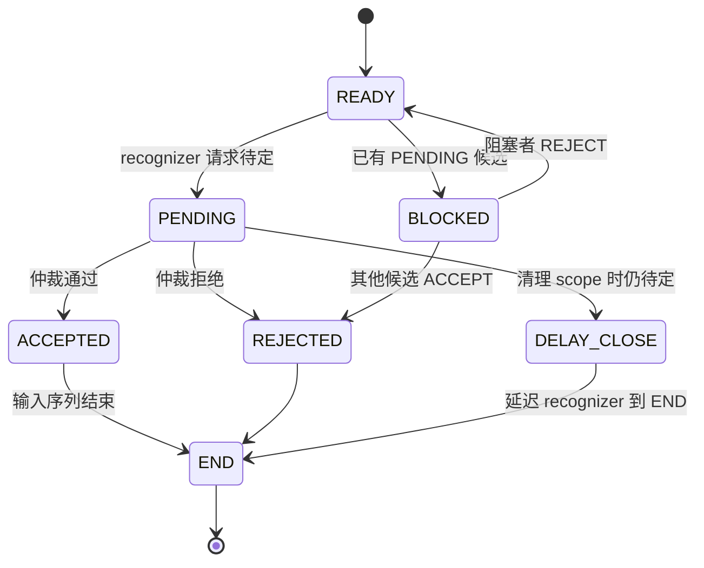
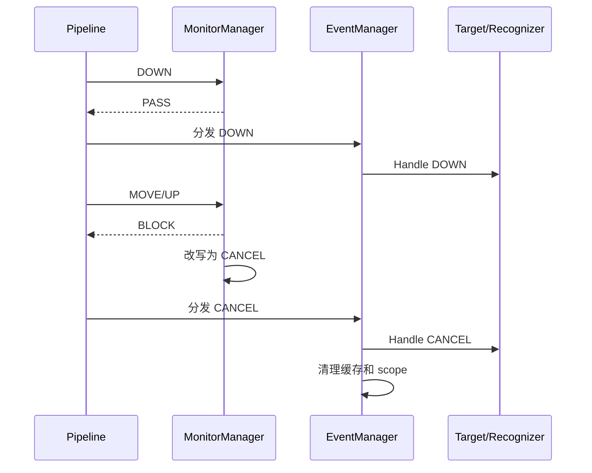

# 架构设计
> 确认事件基础框架的目标仓、模块边界、关键设计决策和五个 Spec 的共享设计基线。

## 设计元数据

| 字段 | 内容 |
|------|------|
| Design ID | DESIGN-Func-03-04-01 |
| 关联需求 | 已有能力补录（无独立 requirement.md） |
| 关联 Epic | 无 |
| 目标 Feature | Feat-01 事件数据模型与节点事件中心；Feat-02 命中测试与事件目标链构建；Feat-03 输入事件分发与采样管线；Feat-04 手势仲裁与响应控制；Feat-05 事件诊断与维测 |
| 复杂度 | 关键 |
| 目标版本 | Dynamic API 8-23、Static API 23、Native API 现有版本、当前主干 |
| Owner | ArkUI SIG |
| 状态 | Baselined（已有实现补录） |

## 需求基线

> 本功能域为已有实现补录，当前源码与 canonical SDK 声明共同构成基线。

| 项 | 补充说明（如需） |
|----|------------------|
| 全量输入类型 | 覆盖 Touch、Mouse、Axis、Key 及由平台入口转换出的基础事件 |
| 全量框架路径 | 覆盖 NG 与仍在生效的 Legacy 分发、Dynamic/Static ArkTS、Native C API |
| 命中与仲裁 | 覆盖 FrameNode 命中、目标链缓存、PostEvent、GestureReferee、ResponseCtrl |
| 诊断与维测 | 覆盖 EventTree、输入时间跟踪、Reporter、Dump 和 Inspector 编译裁剪 |
| 范围边界 | 拖拽框架、焦点机制、公开通用事件行为和 Native Gesture API 细节由相邻 Func 承接；多态样式由 Func-04-03-07 承接；鼠标光标请求由 Func-04-04-05-Feat-04 承接 |

## 上下文和现状

### 涉及仓和模块

| 仓库 | 补充架构说明 |
|------|--------------|
| `arkui/ace_engine/frameworks/base` | 定义输入事件基础结构、坐标和公共工具 |
| `arkui/ace_engine/frameworks/core/common` | EventManager 聚合命中、分发、监控、采样、仲裁入口和诊断 |
| `arkui/ace_engine/frameworks/core/components_ng` | FrameNode、EventHub、GestureEventHub 和识别器等 NG 事件实现 |
| `arkui/ace_engine/frameworks/core/components` | Legacy 事件目标和旧管线兼容路径 |
| `arkui/ace_engine/frameworks/bridge/declarative_frontend` | Dynamic ArkTS/JS 事件对象构造与声明式入口桥接 |
| `arkui/ace_engine/frameworks/bridge/arkts_frontend` | Static ArkTS 增量前端与生成桥接消费方 |
| `arkui/ace_engine/interfaces/native` | ArkUI_UIInputEvent、Pointer/Mouse/Axis/Key getter 和节点事件注册 |
| `interface/sdk-js/api` | Dynamic/Static ArkTS 事件类型与 HitTest 公共声明的权威来源 |
| 平台 Adapter | 将平台 Touch/Mouse/Axis/Key 输入转换为 Ace 事件并提交 Pipeline/EventManager |

### 调用链层级分析

| 层 | 模块 | 职责 | 修改类型 |
|----|------|------|----------|
| 1. 公共声明层 | Dynamic `common.d.ts`、Static `common.static.d.ets`、Native headers | 定义 EventTarget/BaseEvent、HitTest、UIInputEvent 和 history getter | 存量分析 |
| 2. 前端桥接层 | `declarative_frontend/engine/functions`、jsview、ark_modifier；Static 生成桥接 | 将 C++ EventInfo 转换为 ArkTS 对象，注册组件回调和属性 | 存量分析 |
| 3. 平台输入层 | adapter/pipeline input entry | 转换平台事件、补充窗口/显示屏/设备信息，进入引擎 | 存量分析 |
| 4. 管线管理层 | `PipelineContext`、`EventManager`、`InputEventMonitorManager` | 组织命中、目标缓存、分发、批处理、重采样、PostEvent、监控 | 存量分析 |
| 5. 节点树层 | `FrameNode::TouchTest` | 坐标变换、响应区域、HitTestMode、子节点遍历和目标链生成 | 存量分析 |
| 6. 节点事件层 | `EventHub`、`GestureEventHub`、`InputEventHub`、`FocusHub` | 管理节点监听、目标对象和事件子中心 | 存量分析 |
| 7. 手势识别层 | recognizers、`GestureReferee`、`ResponseCtrl` | 识别器组合、竞争、阻塞、胜负和独占响应 | 存量分析 |
| 8. 诊断与测试层 | `EventTree`、`EventTouchInfoRecord`、Reporter、event/input 单测、C API 单测 | 有界记录输入、命中、手势状态和处理时间，提供文本/JSON Dump | 存量分析 |

- [x] 调用链每一层都已覆盖
- [x] 每层职责边界清晰，无跨层违规调用
- [x] 每层修改类型明确

### 适用架构规则

| Rule ID | 适用原因 | 设计结论 | 验证方式 |
|---------|----------|----------|----------|
| OH-ARCH-LAYERING | 输入经过声明/桥接/管线/节点/识别器多层 | 依赖方向保持平台与 API → EventManager → FrameNode/EventHub → recognizer；诊断旁路只读取状态 | 架构评审/依赖检查 |
| OH-ARCH-SUBSYSTEM | 平台输入与 ArkUI 核心存在边界 | 平台专属类型在 adapter 转换，核心层不新增外部系统模块依赖 | 代码评审 |
| OH-ARCH-IPC-SAF | 多窗口/跨屏信息可能来自系统输入 | 本功能域不新增 IPC/SA；只消费转换后的 eventHandleId、window/display 信息 | 集成测试 |
| OH-ARCH-API-LEVEL | Dynamic/Static/Native 存在版本差异 | 以 canonical SDK 声明为准，内部实现差异不得扩展为未声明公共字段 | API 评审/XTS |
| OH-ARCH-COMPONENT-BUILD | 诊断受编译宏控制 | 不新增 BUILD.gn target 或 bundle 依赖，保留现有宏隔离 | 构建验证 |
| OH-ARCH-ERROR-LOG | Native getter 和事件诊断涉及错误状态 | C API 保持场景校验和现有错误码；EventTree/日志容量有界 | 单测/hilog |

## 不涉及项承接

| 维度 | 设计结论 |
|------|----------|
| 拖拽框架 | 由 Func-03-04-02 承接；本设计仅说明 EventManager 中与拖拽清理相邻的通用输入行为 |
| 焦点与按键焦点链 | 由 Func-04-09-01 承接；本设计只覆盖 Key 基础数据、监控和 EventManager 聚合边界 |
| 公开触摸/按键/鼠标/手势行为 | 由 Func-04-04-* 承接；本设计聚焦引擎内部基础框架 |
| 公开分发和拦截能力 | 由 Func-04-04-03 承接；此处只记录 HitTest 构链和 Native intercept 接入点 |
| Native Gesture API | 由 Func-08-01-07 承接；此处只描述 GestureReferee 内部仲裁 |
| 多态样式与状态效果 | 由 Func-04-03-07 承接，包括 stateStyles、attributeModifier 多态样式、StateStyleManager、pressed/hovered 状态时序和 excludeInner |
| 鼠标光标请求与自定义光标 | 由 Func-04-04-05-Feat-04 承接，包括 MouseStyleManager、VSync 仲裁、用户/内部优先级、hold-node 和平台适配 |
| API/ABI 变更 | 无新增、变更或废弃公共 API/ABI |
| 持久化与迁移 | 事件状态均为进程内、交互轮次内数据，无持久化格式 |

## 关键设计决策

| 决策 ID | 问题 | 推荐方案 | 探索过的替代方案 | 取舍理由 | 影响 |
|---------|------|----------|-----------------|----------|------|
| ADR-1 | EventHub 生命周期和 enabled 如何保持兼容 | appear 使用 UI task 异步执行，disappear 同步执行；developerEnabled 与内部 enabled 分离 | 方案A：生命周期全部同步；方案B：enabled 只保留一个值 | 当前时序已被组件依赖；分离开发者值允许内部临时禁用后恢复 | 生命周期测试必须验证异步/同步差异，内部禁用不得覆盖开发者配置 |
| ADR-2 | EventTarget 应持有节点还是事件时快照 | 回调触发时从 GeometryNode 构造 area/id 快照，公共桥接不暴露内部 type | 方案A：长期持有 FrameNode；方案B：直接暴露内部 EventTarget 全字段 | 快照避免延长节点生命周期，并保持 SDK 声明边界 | 几何变化只影响后续事件；Dynamic id 自 API 15，Static 自 API 23 |
| ADR-3 | 一轮触摸是否每次重新命中 | DOWN 构建目标链并按 pointer ID 缓存，加入对应 referee scope；PostEvent/eventHandle 使用隔离域 | 方案A：每个 MOVE 重新遍历节点树；方案B：所有事件共享单一全局目标链 | 缓存保证 DOWN-MOVE-UP 目标稳定并减少树遍历；隔离域防止误清理 | UP/CANCEL 必须清理缓存和 scope，跨管线追加需保留偏移 |
| ADR-4 | Monitor 后续 BLOCK 如何结束已透传交互 | DOWN 已透传时，把首次阻断的 Mouse/Touch/Key 后续事件改写为 CANCEL 后继续下发 | 方案A：直接丢弃后续事件；方案B：回溯撤销 DOWN | 直接丢弃会让组件或识别器停留在已开始状态；CANCEL 是既有恢复语义 | Monitor 测试必须覆盖三类输入和 DOWN_BLOCKED/透传两条路径 |
| ADR-5 | GestureReferee 与独占响应如何确定轮次 | pending scope 延迟关闭；accept 排斥同 scope 非 bridge recognizer；ResponseCtrl 由首响应节点锁定 ON/OFF 到 Reset | 方案A：pending 时立即销毁 scope；方案B：每次请求重新选择独占节点 | 延迟关闭保留异步 recognizer 决策，首节点锁定避免响应结果抖动 | scope 清空是 ResponseCtrl 新轮次边界 |
| ADR-6 | 事件诊断如何避免影响正常分发并控制容量 | EventTree/Reporter 作为旁路观察者，主事件与 PostEvent 使用独立记录；各容器固定容量且采集受编译宏控制 | 方案A：诊断逻辑直接参与分发状态机；方案B：所有诊断数据无限增长；方案C：只保留日志不保留结构化事件树 | 旁路设计避免诊断改变业务结果；结构化、有界记录兼顾定位能力和内存上限；编译宏允许产品裁剪 | EventTree 最多 5 轮，smartGesture 最多 5 条，touch history 达 2048 后清空 |

## 设计骨架

### 骨架范围

| 骨架项 | 目标 | 不包含 | 验证方式 |
|--------|------|--------|----------|
| 事件模型 | 统一 Touch/Mouse/Axis/Key 公共字段和 EventTarget 快照 | 各组件业务回调语义 | Dynamic/Static/Native 声明与转换测试 |
| 命中构链 | FrameNode 树命中、GestureEventHub 目标收集和 pointer 缓存 | 拖拽专属命中 | FrameNode/EventManager 单测 |
| 输入管线 | Monitor、批处理、分发、history/resample | 平台驱动实现细节 | EventManager/C API 测试 |
| 仲裁控制 | GestureScope、状态竞争、ResponseCtrl | 具体手势参数与公开 Gesture API | recognizer/referee 单测 |
| 事件诊断 | EventTree、EventTouchInfoRecord、Reporter、Dump | 鼠标光标、多态样式和产品日志系统 | EventDump 单测与编译矩阵 |

### 骨架 Spec 拆分

| Task ID | 目标 | 受影响文件 | AC |
|---------|------|------------|-----|
| TASK-SKELETON-1 | 固化事件对象和节点事件中心 | `event_hub.*`、桥接和 Native event | Feat-01 全部 AC |
| TASK-SKELETON-2 | 固化命中与目标链 | `frame_node.cpp`、`gesture_event_hub.cpp`、`event_manager.cpp` | Feat-02 全部 AC |
| TASK-SKELETON-3 | 固化输入分发与采样 | `event_manager.cpp`、`input_event_monitor_manager.cpp` | Feat-03 全部 AC |
| TASK-SKELETON-4 | 固化仲裁状态机 | `gesture_referee.*`、`response_ctrl.cpp` | Feat-04 全部 AC |
| TASK-SKELETON-5 | 固化事件诊断与维测 | `event_dump.h/cpp`、`event_manager.cpp` | Feat-05 全部 AC |

## 后续 Task 拆分

| Task ID | 目标 | 受影响文件 | 依赖 |
|---------|------|------------|------|
| TASK-F1 | `Feat-01-event-model-and-event-hub-spec.md` | EventHub、ArkTS bridge、Native UIInputEvent | 本 Design |
| TASK-F2 | `Feat-02-hit-test-and-event-target-chain-spec.md` | FrameNode、GestureEventHub、EventManager | 本 Design、TASK-F1 |
| TASK-F3 | `Feat-03-input-dispatch-and-sampling-pipeline-spec.md` | EventManager、InputEventMonitorManager、Native history | 本 Design、TASK-F2 |
| TASK-F4 | `Feat-04-gesture-referee-and-response-control-spec.md` | GestureReferee、recognizers、ResponseCtrl | 本 Design、TASK-F2 |
| TASK-F5 | `Feat-05-event-diagnostics-and-inspection-spec.md` | EventTree、EventTouchInfoRecord、Reporter、EventManager Dump | 本 Design、TASK-F2/TASK-F3/TASK-F4 |

## API 签名、Kit 与权限

### 新增 API

无新增 API。以下列出现有公共签名，作为跨层核验基线。

| API 签名 | 类型 | Kit | d.ts 位置 | 权限要求 | SysCap |
|----------|------|-----|------------|----------|--------|
| `interface EventTarget { area: Area; id?: string }` | Public | ArkUI | Dynamic `common.d.ts:7506`；Static `common.static.d.ets:3283` | 无 | `SystemCapability.ArkUI.ArkUI.Full` |
| `interface BaseEvent { target; timestamp; source; ... }` | Public | ArkUI | Dynamic `common.d.ts:9261`；Static `common.static.d.ets:4527` | 无 | `SystemCapability.ArkUI.ArkUI.Full` |
| `hitTestBehavior(value: HitTestMode): T` | Public | ArkUI | `common.d.ts:19841`；Static `common.static.d.ets:11603` | 无 | `SystemCapability.ArkUI.ArkUI.Full` |
| `onChildTouchTest(callback): T` | Public | ArkUI | `common.d.ts:19862`；Static `common.static.d.ets:11613` | 无 | `SystemCapability.ArkUI.ArkUI.Full` |
| `OH_ArkUI_PointerEvent_GetHistorySize(event)` | Public | ArkUI Native | `interfaces/native/ui_input_event.h:850` | 无 | Native ArkUI |
| `OH_ArkUI_PointerEvent_GetHistoryX/Y(...)` | Public | ArkUI Native | `interfaces/native/ui_input_event.h:898-911` | 无 | Native ArkUI |
| `OH_ArkUI_PointerEvent_SetInterceptHitTestMode(event, mode)` | Public | ArkUI Native | 实现 `interfaces/native/event/ui_input_event.cpp:3093` | 无 | Native ArkUI |

### 变更/废弃 API

| 原有 API | 变更类型 | 新 API | 迁移说明 |
|----------|----------|--------|----------|
| 无 | 无 | 无 | 本次仅补录存量规格 |

## 构建系统影响

### BUILD.gn 变更

```text
无变更。事件基础框架、桥接、Native 和测试目标均由现有 BUILD.gn 配置覆盖。
ENABLE_INSPECTOR_EVENT_REPORTING 继续作为现有编译期诊断开关。
```

### bundle.json 变更

无变更，不新增或替换依赖。

## 可选设计扩展

### 架构图



### 数据流/控制流

| 步骤 | 调用方 | 被调用方 | 数据/接口 | 说明 |
|------|--------|----------|-----------|------|
| 1 | 平台 Adapter | PipelineContext/EventManager | TouchEvent/MouseEvent/AxisEvent/KeyEvent | 完成平台类型和坐标转换 |
| 2 | Pipeline | InputEventMonitorManager | 事件包装器、subTypeMask | Monitor 可 PASS/BLOCK |
| 3 | EventManager | FrameNode::TouchTest | point、TouchRestrict、responseLinkResult | DOWN/BEGIN 构建目标链 |
| 4 | FrameNode | GestureEventHub/InputEventHub | 本地坐标、HitTestMode、响应区 | 收集普通 target 和 recognizer |
| 5 | EventManager | GestureReferee | touchId、hitTestResult | 建 scope 并缓存结果 |
| 6 | EventManager | TouchTarget/Recognizer | 当前事件和 history | MOVE/UP/CANCEL 复用缓存分发 |
| 7 | EventManager/Referee | EventTree/Reporter | touch/axis/hitTest/gesture/smartGesture snapshot | 有界记录并按编译配置上报 |
| 8 | EventManager | EventTouchInfoRecord | sensor/process/dispatch time | 记录输入处理阶段耗时并支持 DumpAndClear |

### 时序设计



### 数据模型设计

```cpp
// 结构示意，字段以真实实现为准。
struct EventTarget {
    std::string id;
    std::string type;     // 内部字段，不直接进入公共 Dynamic 对象
    EventTargetArea area; // 触发时几何快照
};

using TouchTestResult = std::list<RefPtr<TouchEventTarget>>;
std::unordered_map<size_t, TouchTestResult> touchTestResults_;
std::unordered_map<size_t, TouchTestResult> postEventTouchTestResults_;
std::unordered_map<size_t, RefPtr<GestureScope>> gestureScopes_;
```

| 数据 | 所有者 | 生命周期 | 容量/清理 |
|------|--------|----------|-----------|
| EventTarget 快照 | EventInfo/桥接回调 | 单次回调 | 回调对象释放 |
| touchTestResults_ | EventManager | pointer 交互轮次 | UP/CANCEL 清理 |
| postEventTouchTestResults_ | EventManager | PostEvent 交互轮次 | PostEvent UP/CANCEL 清理 |
| GestureScope | GestureReferee | recognizer 完成前 | pending 可 delay close |
| EventTree records | EventTree | 进程内诊断窗口 | 最多 5 轮 |

### 算法与状态机



重采样算法基线：

1. 合并 history 与当前样本。
2. 样本数量大于 1 时只取末尾两个作为插值输入（`event_manager.cpp:2827`）。
3. targetDisplay 不一致时返回原事件。
4. 分别计算 local、screen 和 globalDisplay 坐标；成功后将当前样本写入 history。

### 测试性设计

| 测试层级 | 测试目标 | Mock 策略 | 验证方式 |
|----------|----------|-----------|----------|
| Core UT | EventHub 生命周期、FrameNode 命中、EventManager 分发 | Mock FrameNode/Pipeline/TaskExecutor | gtest |
| Gesture UT | referee 状态迁移和 ResponseCtrl | 构造 recognizer/group | gtest |
| Dump UT | 5/10/20/100/2048 容量 | 批量填充事件 | `event_dump_test_ng` |
| C API UT | UIInputEvent getter、history、intercept | 构造 ArkUI_UIInputEvent | `linux_unittest_capi` |
| SDK 编译 | Dynamic/Static 声明与版本 | ArkTS 编译用例 | SDK/API 检查 |

### 异常传播时序图



| 异常场景 | 检测点 | 恢复行为 |
|----------|--------|----------|
| Monitor 阻断已开始交互 | InputEventMonitorManager | 改写后续事件为 CANCEL |
| 缓存不存在 | EventManager::DispatchTouchEvent | 返回 false，并执行必要结束状态检查 |
| Native event/type 不匹配 | UIInputEvent getter | 返回无效值/错误状态 |
| pending scope 被请求清理 | GestureReferee | SetDelayClose，等待状态结束 |
| 跨显示屏样本 | resample | 不插值，保留原事件 |

### 资源所有权矩阵

| 资源 | 创建方 | 持有方 | 销毁触发 | 实际释放 | 异常回收 |
|------|--------|--------|----------|----------|----------|
| EventHub 子中心 | EventHub GetOrCreate | EventHub | FrameNode/EventHub 销毁 | RefPtr 归零 | 节点离树不立即销毁 |
| TouchTestResult | FrameNode/EventManager | EventManager map | UP/CANCEL | map erase | source change/clear 路径 |
| GestureScope | GestureReferee | GestureReferee map | recognizer 完成 | CleanGestureScope | pending delay close |
| PostEvent referee | EventManager | 独立字段/strategy map | 对应处理域完成 | Clean/erase | 按同一 referee 分组清理 |
| EventTree record | EventTree | eventTreeList | 超过上限 | erase oldest | 编译未启用时不创建采集 |
| Touch time history | EventTouchInfoRecord | touchHistory_ | 达到 2048 或 DumpAndClear | clear/move | 溢出时增加计数并记录警告 |

### 接口参数规约

| 接口 | 参数 | 类型 | 合法范围 | 非法处理 | 边界说明 |
|------|------|------|----------|----------|----------|
| hitTestBehavior | value | HitTestMode | SDK 声明枚举 | 桥接层按现有规则忽略/回退 | API 20 增加层级阻断值 |
| onChildTouchTest | callback result id | string | 已命名候选子节点 id | 无匹配时回退默认命中 | API 11；attributeModifier API 20 |
| History getter | historyIndex | uint32_t | 小于 history size | 返回 0/无效值和状态 | Native API 12 |
| SetInterceptHitTestMode | event/mode | UIInputEvent/HitTestMode | touch intercept 支持场景 | 参数无效或类型不支持错误 | 仅受支持 eventType |

### 线程与并发模型

| 操作 | 发起线程 | 回调线程 | 跨进程边界 | 线程安全 | 重入约束 |
|------|----------|----------|------------|----------|----------|
| 平台输入分发 | 平台/Pipeline 调度 | UI 线程 | 无新增 | EventManager 按容器 UI 线程使用 | target 回调可停止传播 |
| onAppear | UI 生命周期 | UI task | 无 | 异步任务使用节点/回调安全检查 | 不保证与当前栈同步 |
| onDisappear | UI 生命周期 | 当前 UI 调用栈 | 无 | 同步调用 | 回调可能触发节点操作 |
| Inspector Dump | 输入处理 | 当前处理线程/受宏控制 | 无 | 容量有界 | 只记录，不改变仲裁 |

| 并发场景 | 设计约束 |
|----------|----------|
| 多 pointer 同时触摸 | 分别按 pointer/touchId 缓存目标链和 scope |
| 多 PostEvent 处理域 | eventHandle 映射 referee，清理按 referee 分组 |
| 主事件与 PostEvent 同时存在 | 使用 eventTree_ 与 postEventTree_ 分离记录 |

## 详细设计

### 事件数据模型与节点事件中心

- `EventManager` 继承 `NG::KeyEventManager` 并聚合多输入类型、监控、referee、重采样和诊断（`frameworks/core/common/event_manager.h:106`）。
- `EventHub` 是 FrameNode 的通用事件集合，按需创建 Gesture/Input/Focus 子中心（`frameworks/core/components_ng/event/event_hub.h:136`）。
- `CreateGetEventTargetImpl` 使用 inspector id、tag 和 GeometryNode frame 构造内部 target（`event_hub.cpp:145`）；Dynamic 桥接仅输出 area/id（`js_common_utils.cpp:48`）。
- appear 异步投递 UI task（`event_hub.cpp:608`），disappear 同步调用（`event_hub.cpp:634`）。
- `enabled_` 和 `developerEnabled_` 分离，`SetEnabledInternal` 不覆盖开发者值（`event_hub.cpp:1073`）。

### 命中测试与目标链

- `EventManager::TouchTest` 调用根 FrameNode 构建 `TouchTestResult` 和 `ResponseLinkResult`（`event_manager.cpp:112-180`）。
- `ProcessTouchTestWithReferee` 把 recognizer 加入当前 scope，并按 pointer id 写入缓存（`event_manager.cpp:183-192`）。
- `FrameNode::TouchTest` 负责变换、响应区域、拦截回调、HitTestMode 和子树遍历（`frame_node.cpp:3888`）。
- responseRegion 可按 SourceTool 选择，无匹配时回退节点 rect（`frame_node.cpp:4256`）。
- `GestureEventHub` 收集 scrollable、touch、click、pan、drag 等目标，并将同节点多个 recognizer 组成 ExclusiveRecognizer（`gesture_event_hub.cpp:296,739`）。
- PostEvent 使用 `postEventTouchTestResults_` 和 `postEventRefereeNG_`；策略事件通过 `GetCurrentReferee` 选择独立或继承 referee（`event_manager.cpp:530-568,612-631`）。

### 输入事件分发与采样

- Touch 分发读取 pointer 缓存，依次处理多容器、NG 和 Legacy，并在 UP/CANCEL 后清理（`event_manager.cpp:1208-1292`）。
- Axis BEGIN 非 rotation 时加入 referee scope（`event_manager.cpp:1650-1674`）。
- Mouse API 13+ 使用 `{event.id, event.button}` 保存 press 目标；旧版使用左键单一列表（`event_manager.cpp:2067-2108`）。
- Monitor 若放行 DOWN 后阻断后续 Mouse/Touch/Key，会分别构造 CANCEL（`input_event_monitor_manager.cpp:94-181`）。
- Touch/Mouse 重采样使用最近两个样本，禁止跨 targetDisplay 插值（`event_manager.cpp:2809-2945`）。

### 手势仲裁与响应控制

- `GestureScope` 以 touchId 分组，disposal 值为 ACCEPT/REJECT/PENDING/NONE（`gesture_referee.h:34-124`）。
- 已有 pending 候选时，新请求进入 blocked；pending reject 后解阻下一候选（`gesture_referee.cpp:45,561`）。
- 一个 recognizer accept 后拒绝其他非 bridge recognizer（`gesture_referee.cpp:67`）。
- pending scope 清理采用 delay close，延迟 recognizer END 后 recall（`gesture_referee.cpp:306,610`）。
- ResponseCtrl 未锁定时由首响应节点决定 ON/OFF；ON 后仅首节点响应，直到 Reset（`response_ctrl.cpp:21`）。

### 事件诊断与维测

- 多态样式、`stateStyles`、pressed/hovered 状态切换和 `StateStyleManager` 的完整设计归属 `specs/04-common-capability/03-common-attributes/07-style-attributes/`，本功能域不重复定义。
- 鼠标光标请求、`MouseStyleManager`、VSync 仲裁、用户/内部优先级和 hold-node 的完整设计归属 `specs/04-common-capability/04-common-events/05-mouse-events/Feat-04-mouse-cursor-style-custom-cursor-spec.md`，本功能域不重复定义。
- EventTree 最大 5 轮，内部 touch/axis/gesture 亦有上限，history 最大 2048；受宏保护的采集只在 `ENABLE_INSPECTOR_EVENT_REPORTING` 启用时执行（`event_dump.cpp:22-30,630`、`event_manager.cpp:1210`）。
- `EventTree` 同时保存 touch、axis、hitTest、gesture 和 smartGesture 结构化快照（`event_dump.h:93-105`）；主事件与 PostEvent 分别由 `eventTree_` 和 `postEventTree_` 持有（`event_manager.h:604-605`）。
- `EventTreeRecord::Dump` 支持文本和 JSON 输出，并按 `startNumber` 跳过前序轮次（`event_dump.h:130-140`、`event_dump.cpp:604-622`）。
- `EventTouchInfoRecord` 记录 sensor/process/dispatch 三阶段时间，达到 2048 条时清空并记录溢出（`event_dump.h:147-159`、`event_dump.cpp:624-640`）。

## 风险和开放问题

| 项 | 类型 | 影响 | 处理方式 | Owner |
|----|------|------|----------|-------|
| appear 异步而 disappear 同步，业务可能观察到非对称时序 | 架构 | 中 | 作为兼容行为固定并增加时序测试，不修改实现 | ArkUI SIG |
| 内部 EventTarget 含 type，公共 Dynamic/Static 声明不含该字段 | API | 中 | Spec 明确公共边界，桥接测试禁止依赖内部字段 | ArkUI SIG |
| PostEvent/eventHandle referee 映射规则复杂，错误清理可能影响并发交互 | 测试 | 高 | 增加多处理域、继承/独立 referee 和定向清理测试 | ArkUI SIG |
| Monitor 补发 CANCEL 与直接 BLOCK 的差异易被新增输入类型遗漏 | 架构 | 高 | 新输入类型接入时必须审查 active interaction 恢复路径 | ArkUI SIG |
| Inspector 编译宏导致不同产品诊断能力不同 | 构建 | 中 | 构建矩阵明确宏状态，关闭时不把无 EventTree 视为分发失败 | ArkUI SIG |
| Dynamic/Static API 版本不对齐 | API | 中 | 以各自 canonical 声明为准，分别执行编译检查 | ArkUI SIG |

## 设计审批

- [x] 需求基线已确认，设计覆盖 P0/P1 AC
- [x] 不涉及项已承接，N/A 和展开项都有结论
- [x] 涉及仓和模块职责清楚
- [x] 调用链层级分析完整，每层覆盖到位
- [x] 适用架构规则已识别并形成设计结论
- [x] 分层和子系统边界合规
- [x] API 变更有签名、权限、错误码和兼容性说明
- [x] BUILD.gn/bundle.json 影响明确
- [x] 设计输出和后续 Task 拆分明确
- [x] 关键设计决策有理由和影响说明
- [x] 风险和开放问题有 Owner

**结论:** 通过（已有实现补录）。
