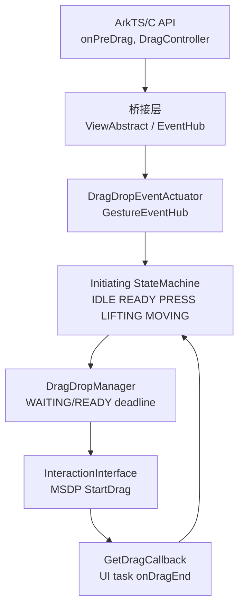
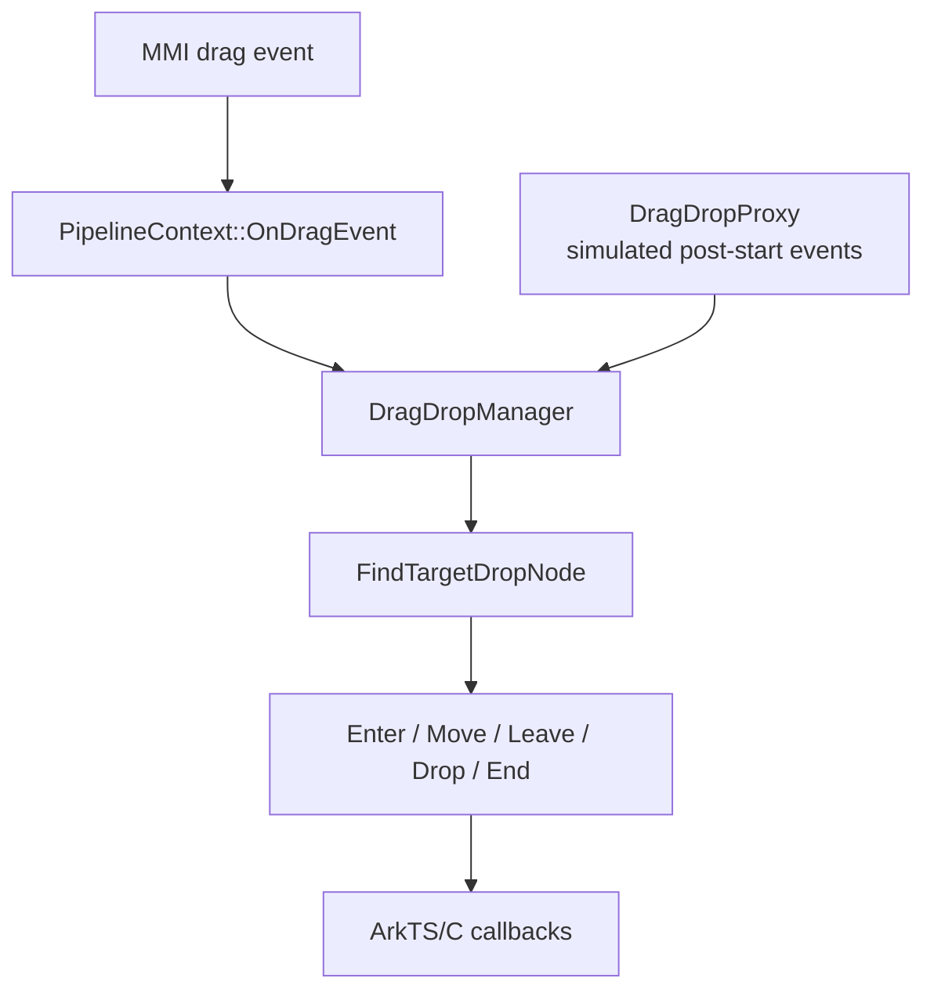
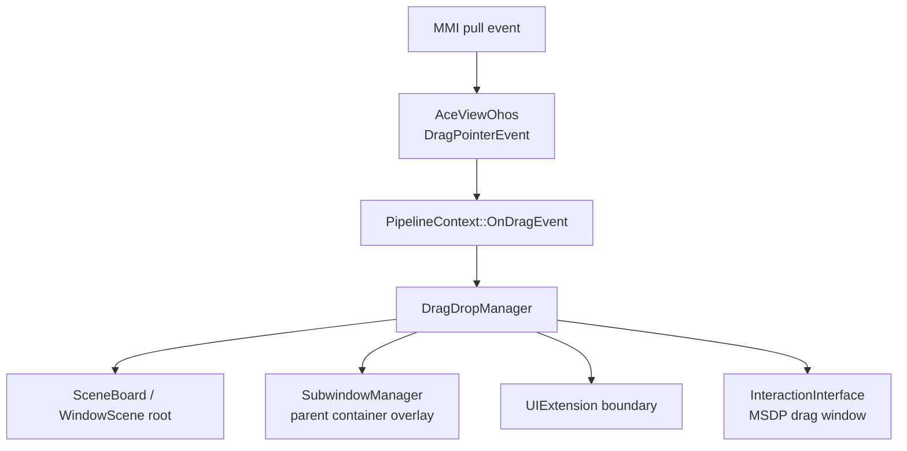
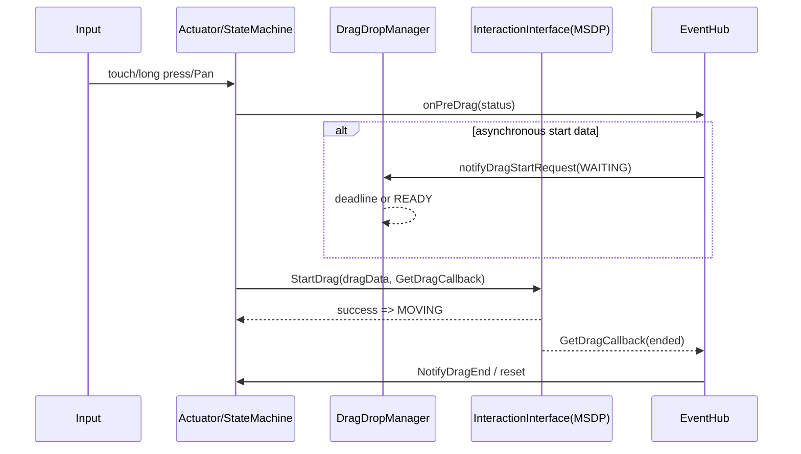
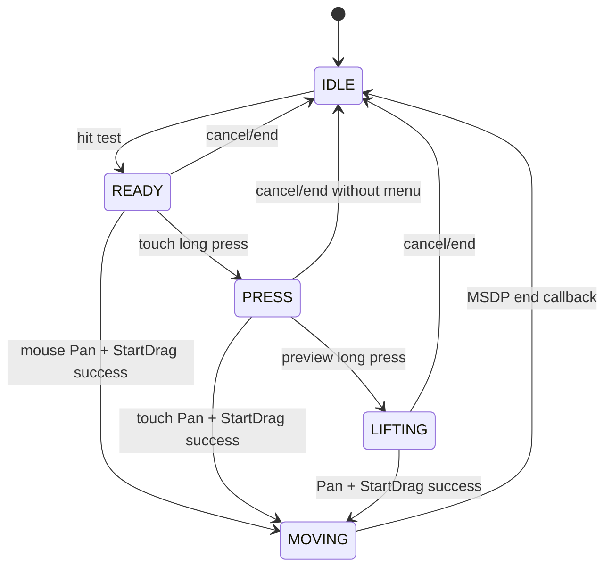

# 架构设计

> 确认拖拽框架的分层约束、关键设计决策和 Spec 拆分方向；本设计基于现有实现补录，不改变产品行为。

## 设计元数据

| 字段 | 内容 |
|---|---|
| Design ID | DESIGN-Func-03-04-02 |
| 关联需求 | 已有能力补录（无独立 requirement.md） |
| 关联 Epic | 03-engine-framework / 04-event-framework / 02-drag-framework |
| 目标 Feature | Feat-01 拖拽发起与预拖拽状态机，Feat-02 拖拽源目标路由与生命周期派发，Feat-06 拖拽多显示设备与容器集成 |
| 复杂度 | 关键 |
| 目标版本 | 存量实现；外部 API 版本差异覆盖 10/12/18/20/23 |
| Owner | ArkUI SIG |
| 状态 | Baselined（已有实现补录） |

## 需求基线

| 项 | 补充说明 |
|---|---|
| 实现即规格 | 所有规则以 `DragDropInitiatingStateMachine`、`DragEventActuator`、`GestureEventHub` 与 `DragDropManager` 的当前实现为准。 |
| 真实拖拽边界 | ArkUI 负责起拖、预览和落入交互；MSDP 通过 `InteractionInterface` 管理真实拖拽会话并回调结束。 |
| 多显示与容器边界 | （Feat-06）ArkUI 保留 MMI 事件的窗口、显示器及全局显示坐标，在 SceneBoard、UIExtension 和子窗口内选择对应根节点/预览；MSDP 仅承接系统拖拽窗口与真实会话。 |

## 上下文和现状

### 涉及仓和模块

| 仓库 | 补充架构说明 |
|---|---|
| `arkui_ace_engine` | 手势识别、起拖状态机、节点事件桥接和 DragDropManager。 |
| `interface_sdk-js` | ArkTS `onPreDrag`、`PreDragStatus`、UIContext DragController 契约。 |
| `interface_sdk_c` | C `ArkUI_PreDragStatus` 和节点事件读取契约。 |
| `docs` | ArkTS/C API 文档和版本说明。 |
| `arkui_ace_engine`（Feat-06） | `AceViewOhos` MMI 转换、`PipelineContext` 事件分派、`DragPointerEvent` 坐标载体，以及 DragDropManager 的 SceneBoard/UIExtension/子窗口交接。 |

### 调用链层级分析

| 层 | 模块 | 职责 | 修改类型 |
|---|---|---|---|
| ArkTS/C API | `onPreDrag`、`DragController`、`NODE_ON_PRE_DRAG` | 注册回调、异步放行和读取状态 | 存量接口行为补录 |
| 桥接层 | `arkts_native_common_bridge.cpp`、`node_drag_modifier.cpp` | 将回调和 C 事件桥接到 EventHub | 存量桥接补录 |
| 组件事件层 | `ViewAbstract`、`EventHub`、`GestureEventHub` | 保存 draggable/预拖拽回调、创建 DragDrop actuator | 存量行为补录 |
| 发起层 | `DragDropEventActuator`、`DragDropInitiatingHandler` | 收集输入目标、构造长按/Pan 识别序列 | 存量状态机补录 |
| 状态机层 | `DragDropInitiatingStateMachine` | 管理 IDLE/READY/PRESS/LIFTING/MOVING 与取消 | 存量状态机补录 |
| 管理层 | `DragDropManager` | 处理 WAITING/READY deadline、维护会话协作状态 | 存量控制流补录 |
| 系统交互层 | `InteractionInterface` | 向 MSDP 发起真实拖拽，接收结束通知 | 已有跨子系统边界补录 |
| 平台输入层 | `AceViewOhos`、`DragPointerEvent` | （Feat-06）把 MMI pull 事件转换为包含窗口、显示器、全局显示坐标和 `displayId` 的拖拽事件。 | 存量多显示事件补录 |
| 容器/窗口层 | `PipelineContext`、`DragDropManager`、`SubwindowManager` | （Feat-06）按 SceneBoard、UIExtension、子窗口和父容器选择目标根、VSync、overlay 与交接分支。 | 存量容器协同补录 |

### 适用架构规则

| Rule ID | 适用原因 | 设计结论 | 验证方式 |
|---|---|---|---|
| OH-ARCH-LAYERING | 存在 ArkTS/C → bridge → event → state machine → system 调用链 | 上层不得绕过 EventHub/状态机直接管理 MSDP 会话。 | 调用链审查 |
| OH-ARCH-SUBSYSTEM | ArkUI 与 MSDP 协作 | ArkUI 只通过 `InteractionInterface` 进入系统拖拽。 | Mock/集成测试 |
| OH-ARCH-API-LEVEL | 动态、静态和 C API 有版本差异 | 将 SDK 视为外部契约，差异显式列入风险。 | SDK 对照 |
| OH-ARCH-ERROR-LOG | 存在取消、起拖失败和 deadline | 失败/取消必须复位预览、timer 和状态机。 | Host 单元测试 |

## 不涉及项承接

| 维度 | 设计结论 |
|---|---|
| 目标命中、enter/move/leave/drop 派发 | 由 Feat-02 承接。 |
| UDMF 数据协商与落放结果 | 由 Feat-03 承接。 |
| 预览材质、动画与视觉效果 | 由 Feat-04 承接；本 Feat 仅覆盖预览在起拖时的状态作用。 |
| 弹簧加载和文本专用模式 | 由 Feat-05 承接。 |
| 多显示器、远端和容器集成 | 由 Feat-06 承接。 |

## 关键设计决策

| 决策ID | 问题 | 推荐方案 | 探索过的替代方案 | 取舍理由 | 影响 |
|---|---|---|---|---|---|
| ADR-1 | 什么事件表示真实拖拽已开始？ | 仅在 `InteractionInterface::StartDrag` 成功后进入 `MOVING`。 | Pan 开始即进入 MOVING；预览完成即进入 MOVING。 | 系统会话创建失败时不能把手势识别误报为拖拽成功。 | Feat-01 AC-1.3 |
| ADR-2 | 触摸和鼠标如何共用发起流程？ | 共用状态机，按输入源选择识别器及进入点。 | 两套独立状态机；统一强制长按。 | 保留鼠标 Pan 发起与触摸预览长按的现有差异。 | AC-1.1、AC-1.4 |
| ADR-3 | 异步起拖如何放行？ | WAITING 安装 deadline，READY/timeout 仅对已保存回调执行放行并清理。 | READY 无条件复位；无 deadline。 | 防止无回调 READY 覆盖等待状态并防止 timer 泄漏。 | AC-2.3~AC-2.5 |
| ADR-4 | 取消如何表达？ | 以状态机和 actuator 的现有取消分支复位资源；无效预拖拽不走正常状态推进。 | 静默忽略；全部强制 onDragEnd。 | 取消发生在正式 MSDP 会话前后，回调语义不同。 | AC-2.2、AC-2.5 |
| ADR-5 | 主动拖拽与手势预拖拽的关系？ | C `DragAction` 保持独立适配入口；菜单 restart 合入既有起拖链。 | 一律模拟 `onPreDrag`；一律分离。 | 两类实际调用图不同，保持源码边界。 | AC-3.3 |
| ADR-6 | 如何处理预拖拽枚举不对称？ | 在兼容风险中保留动态 ArkTS preparing 状态与 C 枚举缺失的差异。 | 隐藏差异；推断 C 枚举可表达该值。 | SDK/C ABI 事实不同，不能静默合并。 | AC-2.1 |
| ADR-F2-1 | 谁负责系统拖拽事件主派发？ | 由 `PipelineContext::OnDragEvent` 分发给 DragDropManager。 | 由 DragDropProxy 主派发；由 EventHub 直接派发。 | Proxy 只模拟起拖后的 Manager 事件入口，不能替代系统 MMI 事件链。 | Feat-02 AC-3.1、AC-3.2 |
| ADR-F2-2 | 父子目标切换是否总是 Leave 父目标？ | 默认保留父目标；仅 strict reporting 时 Leave。 | 总是 Leave；从不 Leave。 | 保持现有嵌套目标与严格上报的可观察差异。 | Feat-02 AC-1.3 |
| ADR-F2-3 | 无目标/拒绝数据时是否派发 Drop？ | 不派发 Drop，重置拖拽状态。 | 派发空 Drop；仅隐藏预览。 | Drop 必须同时满足命中与数据允许条件。 | Feat-02 AC-2.1 |
| ADR-F6-1 | 多显示位置如何传递？ | 保留 `DragPointerEvent` 的窗口、显示器、全局显示坐标和 `displayId`，由 MMI 输入提供。 | 仅保留组件局部坐标；由 ArkUI 推算其他显示器拓扑。 | 事件字段由系统输入确定，ArkUI 不拥有显示器拓扑。 | Feat-06 AC-1.1、AC-1.2 |
| ADR-F6-2 | 子窗口动画和预览归属哪个容器？ | 通过父容器取得菜单子窗口 overlay；子窗口不接收事件时从主 Pipeline 取得 VSync。 | 直接使用子容器 overlay/VSync。 | 子窗口与主窗口的渲染归属不同，现有实现已显式回溯父容器。 | Feat-06 AC-2.3 |
| ADR-F6-3 | ArkUI 何时将预览交给系统窗口？ | 离窗、UIExtension 或文件夹子窗口边界触发时，清理 ArkUI 预览并经 `InteractionInterface` 使 MSDP 窗口可见。 | ArkUI 继续持有预览；定义 MSDP 内部流程。 | 保持 ArkUI/MSDP 职责边界。 | Feat-06 AC-3.1~AC-3.3 |

## 设计骨架

### 骨架范围

| 骨架项 | 目标 | 不包含 | 验证方式 |
|---|---|---|---|
| 发起状态机 | 建立输入到 MSDP StartDrag 成功的状态边界 | 落放目标处理 | 状态机 Host 测试 |
| 预拖拽与异步放行 | 规定状态通知和 WAITING/READY 清理 | UDMF 数据内容 | DragEvent/Manager 测试 |
| MSDP 回调桥 | 规定真实拖拽结束由 GetDragCallback 进入 UI 线程 | MSDP 内部实现 | InteractionInterface Mock |

### 骨架 Spec 拆分

| Task ID | 目标 | 受影响文件 | AC |
|---|---|---|---|
| TASK-SKELETON-1 | 基线化起拖、预拖拽、异步放行和 MSDP 回调边界 | `drag_event.cpp`、`gesture_event_hub_drag.cpp`、`drag_drop_manager.cpp` | AC-1.1~AC-3.3 |

## 后续 Task 拆分

| Task ID | 目标 | 受影响文件 | 依赖 |
|---|---|---|---|
| Feat-01 | 拖拽发起与预拖拽状态机 | `frameworks/core/components_ng/event/drag_event.cpp`、`gesture_event_hub_drag.cpp`、`manager/drag_drop/drag_drop_initiating/` | 基线任务 |
| Feat-02 | 拖拽源目标路由与生命周期派发 | `pipeline_context.cpp`、`drag_drop_manager.cpp`、`drag_drop_proxy.cpp`、`node_drag_modifier.cpp` | Feat-01 |
| Feat-02 | 源目标路由与生命周期派发 | `drag_drop_manager.cpp`、EventHub | Feat-01 |
| Feat-03 | 数据传输与落放协商 | UDMF、DragDropManager | Feat-02 |
| Feat-04 | 预览覆盖层与动画 | overlay/subwindow/drag preview | Feat-01 |
| Feat-05 | 弹簧加载与专用模式 | spring_loading/text_drag | Feat-01 |
| Feat-06 | 多设备和容器集成 | InteractionInterface/container/window | Feat-01 |

## API 签名、Kit 与权限

### 新增 API

| API签名 | 类型 | Kit | d.ts 位置 | 权限要求 | SysCap |
|---|---|---|---|---|---|
| `onPreDrag(callback: Callback<PreDragStatus>): T` | Public | ArkUI | `@internal/component/ets/common.d.ts:22718` | 无额外权限 | `SystemCapability.ArkUI.ArkUI.Full` |
| `notifyDragStartRequest(status): void` | Public | ArkUI UIContext | `@ohos.arkui.UIContext.d.ts:3588` | 无额外权限 | `SystemCapability.ArkUI.ArkUI.Full` |
| `OH_ArkUI_NodeEvent_GetPreDragStatus` | Public C API | ArkUI Native | `drag_and_drop.h:211` | 无额外权限 | ArkUI Native |

### 变更/废弃 API

| 原有 API | 变更类型 | 新 API | 迁移说明 |
|---|---|---|---|
| `PreDragStatus` | 变更 | API 18 dynamic 增加 `PREPARING_FOR_DRAG_DETECTION` | C 调用方需接受 C 枚举未表达该状态的事实。 |
| `notifyDragStartRequest` | 变更 | dynamic API 18 / static API 23 | 按目标前端和 SDK 版本可用性调用。 |

## 构建系统影响

### BUILD.gn 变更

无。规格补录不改变 `BUILD.gn`、依赖或构建图。

### bundle.json 变更

无。规格补录不新增组件或依赖。

## 可选设计扩展

### 架构图

#### 路由与派发架构图（Feat-02）

#### 多显示与容器交接架构图（Feat-06）

### 数据流/控制流

| 步骤 | 调用方 | 被调用方 | 数据/接口 | 说明 |
|---|---|---|---|---|
| 1 | 输入系统 | `DragDropEventActuator` | touch/mouse、Pan/LongPress | 收集可拖拽目标。 |
| 2 | actuator | state machine | 触摸/长按/Pan 事件 | 推进起拖前状态。 |
| 3 | state machine | EventHub | `PreDragStatus` | 派发预拖拽状态。 |
| 4 | GestureEventHub | InteractionInterface | `StartDrag(DragData, GetDragCallback)` | MSDP 接管真实拖拽。 |
| 5 | MSDP | GetDragCallback | `DragNotifyMsgCore` | UI 线程派发结束回调并复位状态机。 |
| 6 | MMI/Adapter | `PipelineContext` | `DragPointerEvent` | （Feat-06）保留窗口/显示器/全局显示坐标及目标显示 ID 后分派给当前容器的 Manager。 |
| 7 | `DragDropManager` | `SubwindowManager`/`InteractionInterface` | parent container、overlay、drag-window visible | （Feat-06）子窗口或扩展窗口边界时清理 ArkUI 预览并交接 MSDP 系统拖拽窗口。 |

### 时序设计

### 算法与状态机

### 测试性设计

| 测试层级 | 测试目标 | Mock 策略 | 验证方式 |
|---|---|---|---|
| Host 单元 | 预拖拽状态和取消 | Mock Pipeline/EventHub | `drag_event_test_ng.cpp` |
| Host 单元 | 状态机输入/转移 | Mock GestureHub/manager | `drag_drop_initiating_state_*_test_ng.cpp` |
| Host 单元 | WAITING/READY/deadline | Mock callback | `new_drag_drop_manager_test_ng.cpp` |
| 集成 | MSDP 起停和 callback | Mock InteractionInterface | 观察 onDragEnd/UI task |
| Host 单元 | （Feat-06）子窗口不接收事件时 VSync 来源 | Mock Subwindow/MainPipeline | `DoDragStartAnimationVsyncTime002` |
| 集成 | （Feat-06）SceneBoard/UIExtension/离窗交接 | Mock Container/InteractionInterface | 观察根节点、Leave、预览清理和系统窗口可见性 |

### 线程与并发模型

| 操作 | 发起线程 | 回调线程 | 跨进程边界 | 线程安全/重入约束 |
|---|---|---|---|---|
| 输入识别和状态机 | UI | UI | 否 | 状态迁移必须串行。 |
| WAITING deadline | UI 任务调度 | UI | 否 | 取消、READY、超时三者都要移除同一 timer。 |
| MSDP StartDrag/结束 | UI | 回调后投递 UI | 是 | `GetDragCallback` 不直接在系统回调线程调用 EventHub。 |

## 详细设计

### 输入识别与状态迁移

`GestureEventHub::InitDragDropEvent` 选择 DragDrop framework 后，`DragDropEventActuator` 创建 handler 和 state machine。触摸按 IDLE→READY→PRESS→LIFTING 的预览链准备，鼠标可由 Pan 进入起拖；只有 `InteractionInterface::StartDrag` 成功后才切到 MOVING。证据：`frameworks/core/components_ng/event/gesture_event_hub_drag.cpp:140-160,1270-1322`，`frameworks/core/components_ng/event/drag_drop_event.cpp:218-263`。

### 预拖拽、放行与取消

`DragEventActuator::ExecutePreDragAction` 对有效状态派发 EventHub 回调；重复/无效状态降级为取消。`DragDropManager::HandleSyncOnDragStart` 对 WAITING/READY 和 deadline 维护异步放行。取消路径清理 preview 和 deadline。证据：`frameworks/core/components_ng/event/drag_event.cpp:1584-1677,647-780`，`frameworks/core/components_ng/manager/drag_drop/drag_drop_manager.cpp:161-202`。

### MSDP 会话与结束回调

ArkUI 将 `DragData` 和 `GetDragCallback` 交给 `InteractionInterface::StartDrag`；MSDP 结束通知进入 callback 后投递 UI 任务，派发 `onDragEnd`、调用框架收尾并通知 state machine。`actionEndTask` 是手势 recognizer 的任务，不定义真实系统拖拽结束。证据：`frameworks/core/components_ng/event/gesture_event_hub_drag.cpp:1289,1642-1697`。

### 源目标命中与事件派发

系统 MMI 拖拽事件由 `PipelineContext::OnDragEvent` 分发至 `DragDropManager`。Manager 逆序命中 active、visible 且可接收 drop 的 FrameNode；同目标派发 Move，切换目标按 Leave 后 Enter 处理。父子嵌套时只有 strict reporting 会使父目标 Leave。无目标或数据拒绝不派发 Drop，而是 reset。`DragDropProxy` 用于模拟起拖后的 Manager Start/Move/End，不是系统事件主派发。证据：`frameworks/core/pipeline_ng/pipeline_context.cpp:6248-6275`，`frameworks/core/components_ng/manager/drag_drop/drag_drop_manager.cpp:449-547,1072-1145,1291-1382`。

### 数据传输与落放协商

源端将 UnifiedData 或延迟加载参数封装为 UDMF key/summary；目标用 allowDrop 与摘要协商准入。本地预取、禁用预取和远端重试形成不同的 Drop 数据路径。Drop 结果最终经 `InteractionInterface::StopDrag` 交给系统；C pending 协议仅限 Drop phase 且有 2 秒 deadline。证据：`frameworks/core/components_ng/manager/drag_drop/drag_drop_func_wrapper.cpp:206-277`，`drag_drop_manager.cpp:1364-1500,1526-1608`。

### 预览承载与动画交接

预览按多选、缓存、配置 PixelMap、自定义节点及兜底来源解析。ArkUI Overlay、子窗口预览和 MSDP 系统拖拽窗口是不同承载，按输入源和动画模式交接；默认/定制/follow-hand-morph 路径均须回收 map、gather、filter 和窗口可见性。证据：`frameworks/core/components_ng/event/gesture_event_hub_drag.cpp:786-870,1362-1442`，`drag_drop_manager.cpp:1652-1810,2845-2960`。

### 通用弹簧加载

仅注册客户回调的目标启用通用 detector。它以 IDLE、BEGIN、UPDATE、END、CANCEL 管理悬停，支持 abort/配置更新；具体 Text/TextField 专用拖拽不属于本功能域规格。证据：`frameworks/core/components_ng/manager/drag_drop/drag_drop_spring_loading/drag_drop_spring_loading_detector.cpp:27-126`，`drag_drop_manager.cpp:1928-1949,3610`。

### 多显示、容器与系统窗口交接

`AceViewOhos::ProcessDragEvent` 将 MMI pull action 转为 `DragPointerEvent` 和 `DragEventAction`；事件对象携带窗口、显示器、全局显示坐标与 `displayId`。`PipelineContext::OnDragEvent` 将其分发给当前 Manager。SceneBoard 为项目拖拽预览选择 `WindowScene` 根；子窗口 overlay 由父容器取得，未接收事件时 move-out 被跳过且动画使用主 Pipeline VSync。离窗、UIExtension 或文件夹子窗口边界时，Manager 清理 ArkUI 预览并通过 `InteractionInterface::SetDragWindowVisible(true)` 交接系统拖拽窗口。MSDP 内部真实会话不在 ace_engine 中定义。证据：`adapter/ohos/entrance/ace_view_ohos.cpp:376-413`，`frameworks/core/event/pointer_event.h:72-162`，`frameworks/core/pipeline_ng/pipeline_context.cpp:6248-6281`，`frameworks/core/components_ng/manager/drag_drop/drag_drop_manager.cpp:322-339,832-910,1160-1171,2517-2562,2645-2656,2814-2819,3348-3354,3541-3564`。

## 风险和开放问题

| 项 | 类型 | 影响 | 处理方式 | Owner |
|---|---|---|---|---|
| Dynamic `PREPARING_FOR_DRAG_DETECTION` 与 C 枚举不对称 | API | 中 | 在 Feat-01 兼容声明、AC 和后续 C API 评审中保留差异，不改写当前 ABI。 | ArkUI API owner |
| InteractionInterface/MSDP 行为不在 ace_engine 内 | 架构 | 高 | 规格只定义 ArkUI 边界与 callback 观察点；系统侧语义由集成测试验证。 | ArkUI/Interaction owner |
| 长按、deadline 参数受设备输入时序影响 | 测试 | 中 | 以 Host 状态机测试验证顺序，设备侧验证用户可感知交互。 | Drag framework owner |
| strict reporting 改变嵌套父子目标 Leave | API | 中 | 在 Feat-02 明确默认与严格上报两种事件顺序并覆盖 Host 测试。 | Drag framework owner |
| 多显示拓扑及 MSDP 系统窗口内部语义不在 ace_engine 中 | 架构 | 中 | Feat-06 仅约束 MMI 事件字段、容器选择及 `InteractionInterface` 交接观察点；以系统集成测试验证其余语义。 | ArkUI/Interaction owner |

## 设计审批

- [x] 需求基线已确认，设计覆盖 P0/P1 AC。
- [x] 不涉及项已承接，N/A 和展开项均有结论。
- [x] 涉及仓和模块职责清晰。
- [x] 调用链层级分析完整，覆盖到 InteractionInterface/MSDP 边界。
- [x] 适用架构规则已识别并形成结论。
- [x] 分层和子系统边界合规。
- [x] API 版本差异、C ABI 风险已说明。
- [x] BUILD.gn/bundle.json 影响明确。
- [x] 后续 Task 拆分明确。
- [x] 关键设计决策包含理由和影响。
- [x] 风险和开放问题有 Owner。

**结论:** 通过（已有实现补录）
