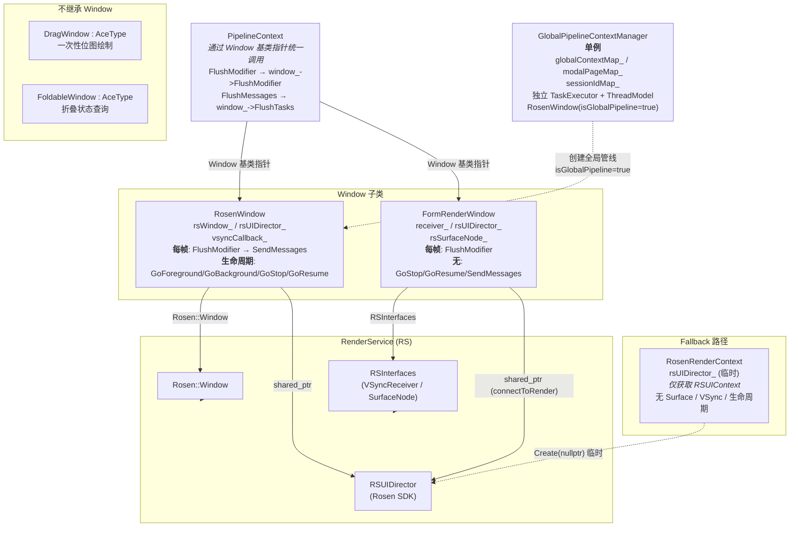
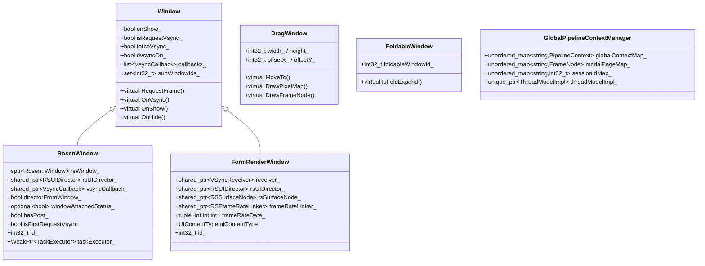
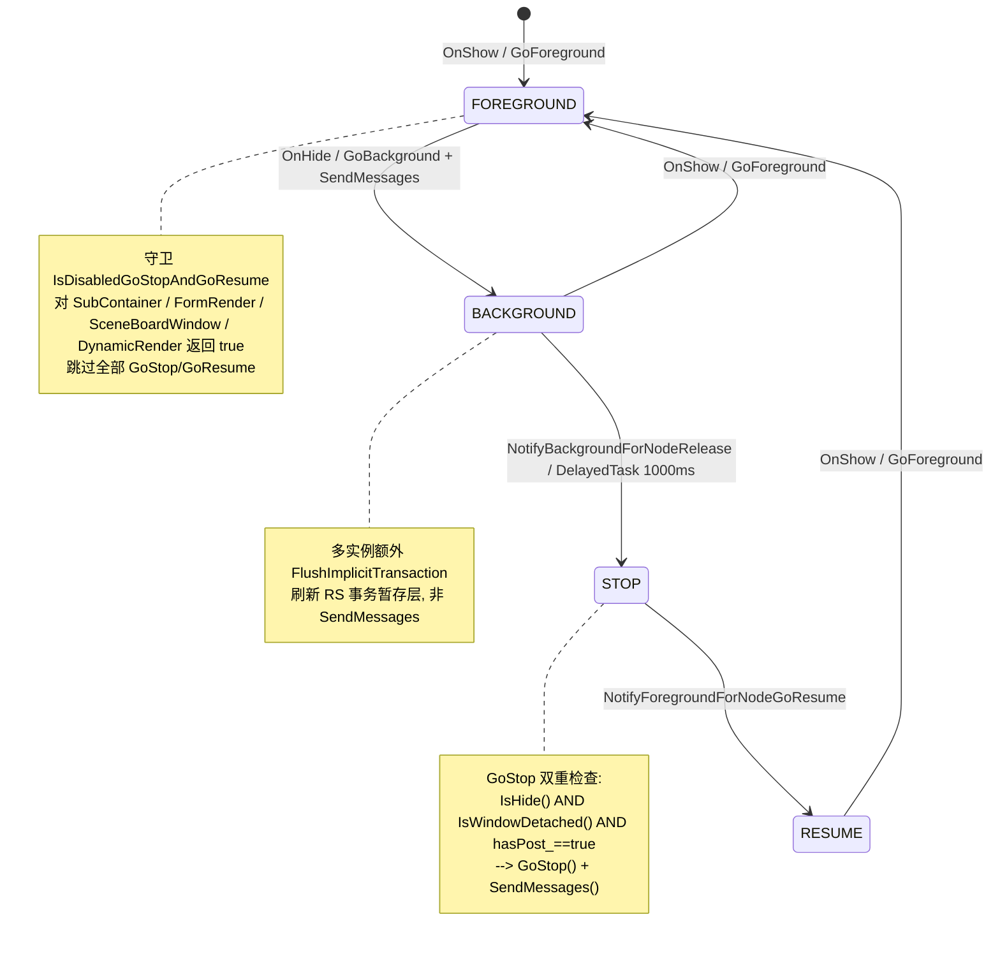

# 架构设计

> ArkUI NG 窗口机制——Window 抽象基类、RosenWindow 创建/初始化/销毁、RSUIDirector 生命周期状态机、全局管线管理、以及三种特殊窗口类型（FormRenderWindow / DragWindow / FoldableWindow）。

## 术语约定

本设计中存在两类名称相近的 "Window"，为避免歧义，约定如下：

| 术语 | 完整限定名 | 定义位置 | 说明 |
|------|-----------|---------|------|
| **Window** | `OHOS::Ace::Window` | `frameworks/core/common/window.h` | ace_engine 内部窗口抽象基类，50+ 虚方法。PipelineContext 通过此基类指针统一调用各子类 |
| **RosenWindow** | `OHOS::Ace::NG::RosenWindow` | `frameworks/core/components_ng/render/adapter/rosen_window.h` | `Window` 的 NG 实现，持有 `sptr<Rosen::Window> rsWindow_` 成员 |
| **Rosen::Window** | `OHOS::Rosen::Window` | 外部窗口管理模块（`window_manager`） | OpenHarmony 系统级窗口，提供 surface / vsync / 生命周期回调。ace_engine 不定义此类，仅通过 `rsWindow_` 消费 |
| **FormRenderWindow** | `OHOS::Ace::NG::FormRenderWindow` | `frameworks/core/components_ng/render/adapter/form_render_window.h` | `Window` 的表单渲染实现，自建 VSync + Surface，不包装 `Rosen::Window` |
| **DragWindow** | `OHOS::Ace::DragWindow` | `frameworks/base/window/drag_window.h` | 继承 `AceType`，**不继承** `Window`，一次性位图绘制 |
| **FoldableWindow** | `OHOS::Ace::FoldableWindow` | `frameworks/base/window/foldable_window.h` | 继承 `AceType`，**不继承** `Window`。**名称含 "Window" 但无任何窗口功能**（无 surface / vsync / 渲染 / 生命周期），仅为折叠状态查询接口（`IsFoldExpand()` + `foldableWindowId_`） |

> **关键区分**：`RosenWindow`（ace_engine 类）vs `Rosen::Window`（系统类）—— 前者继承 `Ace::Window`，后者是外部系统窗口。`RosenWindow` 通过成员 `rsWindow_` 持有 `Rosen::Window`。正文中的 "Window 基类" 均指 `Ace::Window`。

## 设计元数据

| 字段 | 内容 |
|------|------|
| Design ID | DESIGN-Func-03-05-01 |
| 关联需求 | 已有能力补录（无独立 requirement.md） |
| 关联 Epic | 无 |
| 目标 Feature | Feat-01 Window抽象与RosenWindow创建初始化, Feat-02 窗口生命周期与前后台状态转换, Feat-03 多实例窗口与全局管线, Feat-04 特殊窗口类型 |
| 复杂度 | 复杂 |
| 目标版本 | API 9 及以后（基线以 master HEAD 行为为准，关键差异标注 API target version） |
| Owner | ArkUI SIG / 窗口与渲染团队 |
| 状态 | Baselined（已有实现补录） |

## 需求基线

| 字段 | 内容 |
|------|------|
| 问题陈述 | NG 框架下，PipelineContext 需要通过窗口抽象与 RenderService 交互：接收 VSync、提交 RS 消息、管理前后台状态。不同场景（普通页面、表单卡片、拖拽预览、折叠屏）需要不同的窗口类型，但 PipelineContext 必须通过统一的 Window 基类指针无感调用。此外，跨窗口模态和 UEC 需要独立于任何实例容器的全局渲染管线。 |
| 核心目标 | （Feat-01）锁定 Window 基类 50+ 虚方法契约、RosenWindow 构造函数资源获取链（vsyncCallback / RSUIDirector / SurfaceNode / UITaskRunner）、directorFromWindow_ 所有权模型、Init 的 VSync 回调注册与多实例扇出、Destroy 按所有权差异化清理；（Feat-02）锁定 RSUIDirector 生命周期状态机（GoForeground/GoBackground/GoStop/GoResume）、windowAttachedStatus_ 三态语义、延迟节点释放（1000ms GoStop）、恢复路径、IsDisabledGoStopAndGoResume 守卫；（Feat-03）锁定 GlobalPipelineContextManager 单例、全局 PipelineContext 创建（isGlobalPipeline=true RosenWindow）、WindowLifeCycle 清理链、ProcessModalPageNode 模态页面转移、子窗口 VSync 扇出；（Feat-04）锁定 FormRenderWindow（自建 VSyncReceiver + RSSurfaceNode）、DragWindow（AceType 继承，一次性绘制）、FoldableWindow（AceType 继承，折叠状态查询）三种特殊窗口类型 |
| P0 AC | （Feat-01）AC-2.3 isGlobalPipeline 强制创建独立 RSUIDirector；AC-4.4 Destroy 按所有权差异化销毁 director。（Feat-02）AC-5.4 延迟 GoStop 双重检查；AC-8.1..8.5 IsDisabledGoStopAndGoResume 守卫四种容器类型。（Feat-03）AC-2.3 全局管线使用 isGlobalPipeline=true。 |

## 上下文和现状

### 涉及仓和模块

| 仓库 | 模块路径 | 当前职责 | 本 Feature 影响 |
|------|----------|----------|----------------|
| foundation/arkui/ace_engine | frameworks/core/common/window.h / window.cpp | Window 基类抽象（50+ 虚方法、callbacks_ 列表、subWindowIds_） | 锁定虚方法契约与默认实现 |
| foundation/arkui/ace_engine | frameworks/core/components_ng/render/adapter/rosen_window.h / .cpp | RosenWindow 实现（VSync 接收、RSUIDirector 管理、生命周期状态机） | 锁定构造/Init/Destroy/生命周期全链路 |
| foundation/arkui/ace_engine | frameworks/core/components_ng/render/adapter/form_render_window.h / .cpp | FormRenderWindow 实现（自建 VSyncReceiver + RSSurfaceNode） | 锁定独立 vsync 驱动与简化生命周期 |
| foundation/arkui/ace_engine | frameworks/base/window/drag_window.h | DragWindow 抽象（继承 AceType） | 锁定独立窗口类型架构 |
| foundation/arkui/ace_engine | frameworks/base/window/foldable_window.h | FoldableWindow 抽象（继承 AceType） | 锁定折叠状态查询接口 |
| foundation/arkui/ace_engine | adapter/ohos/entrance/global_pipeline_context_manager.h / .cpp | 全局管线管理器单例 | 锁定全局 PipelineContext 创建与清理 |
| foundation/arkui/ace_engine | adapter/ohos/entrance/window/drag_window_ohos.h / .cpp | DragWindowOhos 平台实现 | 锁定浮动 Rosen::Window 创建 |
| foundation/arkui/ace_engine | adapter/ohos/entrance/window/foldable_window_ohos.h / .cpp | FoldableWindowOhos 平台实现 | 锁定系统折叠状态查询 |

### 调用链层级分析

| 层 | 模块 | 职责 | 修改类型 |
|----|------|------|----------|
| Window 抽象 | `frameworks/core/common/window.h / .cpp` | Window 接口抽象（50+ 虚方法）、callbacks_ 多容器 VSync 扇出、subWindowIds_ 子窗口管理 | 无修改（规格补录） |
| RosenWindow 实现 | `frameworks/core/components_ng/render/adapter/rosen_window.h / .cpp` | RosenWindow 完整实现：构造（资源获取）、Init（VSync 回调注册）、Destroy（差异化清理）、生命周期（OnShow/OnHide/GoStop/GoResume）、FlushTasks（RS 提交） | 无修改（规格补录） |
| 全局管线管理 | `adapter/ohos/entrance/global_pipeline_context_manager.h / .cpp` | 全局 PipelineContext 创建/管理/销毁、模态页面转移、SessionId 映射 | 无修改（规格补录） |
| 表单渲染窗口 | `frameworks/core/components_ng/render/adapter/form_render_window.h / .cpp` | FormRenderWindow 自建 VSyncReceiver + RSSurfaceNode + RSUIDirector + RSFrameRateLinker | 无修改（规格补录） |
| 拖拽窗口抽象 | `frameworks/base/window/drag_window.h` | DragWindow 抽象基类（继承 AceType），8 个纯虚绘制方法 | 无修改（规格补录） |
| 折叠窗口抽象 | `frameworks/base/window/foldable_window.h` | FoldableWindow 抽象基类（继承 AceType），IsFoldExpand 查询 | 无修改（规格补录） |

### 适用架构规则

| Rule ID | 适用原因 | 设计结论 | 验证方式 |
|---------|----------|----------|----------|
| OH-ARCH-Window-抽象 | PipelineContext 通过 Window 基类指针统一调用各子类 | 50+ 虚方法契约确保 PipelineContext 不感知具体子类（RosenWindow / FormRenderWindow） | 代码评审 |
| OH-ARCH-RSUIDirector-所有权 | RSUIDirector 可能由 Rosen::Window 或 ArkUI 创建 | `directorFromWindow_` 标记所有权来源：true=Rosen::Window 拥有（Destroy 不销毁），false=ArkUI 拥有（Destroy 必须销毁）。isGlobalPipeline=true 强制 false | ownership 单测 |
| OH-ARCH-Lifecycle-状态机 | RSUIDirector 生命周期需要多态驱动 | GoForeground/GoBackground/GoStop/GoResume 四方法 + `windowAttachedStatus_` 三态控制 GoStop/GoResume 触发 | lifecycle 单测 |
| OH-ARCH-Special-Window | DragWindow 和 FoldableWindow 不参与渲染管线 | 继承 AceType 而非 Window，不参与 PipelineContext 渲染管线、不接收标准 VSync | 代码评审 |
| OH-ARCH-Global-Pipeline | 全局管线需要独立于实例容器 | isGlobalPipeline=true 创建独立 RosenWindow + 独立 TaskExecutor + ThreadModel，不复用实例容器资源 | 集成测试 |

## 不涉及项承接

| 维度 | 结论 |
|------|------|
| 性能 | 展开设计：GoStop 延迟 1000ms 确保 detach→attach 抖动不触发频繁 STOP/Resume；不在本 Feat 中量化指标，仅锁定行为。 |
| 安全与权限 | N/A：窗口机制不涉及权限检查，权限由上层 API 控制。 |
| 兼容性 | 展开设计：GetMultiInstanceEnabled() 影响子窗口 VSync 扇出与全局管线行为；ENABLE_ROSEN_BACKEND 影响 FormRenderWindow 是否编译为空壳。 |
| API/SDK | N/A：窗口机制为框架内部能力，不对外暴露 ArkTS / C-API。 |
| IPC/跨进程 | FormRenderWindow 通过 connectToRender (IRemoteObject) 支持跨进程表单渲染；GlobalPipelineContextManager 的 WindowLifeCycle 通过 Rosen::Window 的生命周期回调驱动清理。 |
| 构建与部件 | N/A：不引入新部件/BUILD.gn 变更，纯属补录。 |
| 子窗口创建/管理 | N/A：子窗口的创建/管理（SubwindowManager）属于 FuncID 03-05-02，不在本 Feat 覆盖范围。本 Feat 仅覆盖子窗口的 VSync 扇出机制（RegisterSubWindow / SetRequestVsyncCallback）。 |

## 关键设计决策

| 决策 ID | 问题 | 推荐方案 | 探索过的替代方案 | 取舍理由 | 影响 |
|---------|------|----------|------------------|----------|------|
| ADR-1 | RSUIDirector 所有权如何管理 | directorFromWindow_ bool 标记：true=Rosen::Window 提供（Destroy 不销毁），false=ArkUI 创建（Destroy 必须销毁）。isGlobalPipeline=true 强制创建独立 director（directorFromWindow_=false），即使 Rosen::Window 提供了 director | 统一由 ArkUI 创建和销毁 | Rosen::Window 已在某些场景管理 director 生命周期（如 SceneBoard），统一创建会导致双重销毁。所有权标记是最小侵入方案 | rosen_window.cpp:116-128, 365-368 |
| ADR-2 | windowAttachedStatus_ 为何使用 std::optional<bool> 而非 enum | 三态语义：true(attached) / false(detached) / nullopt(初始)。nullopt 被视为"非 detached"——不触发 GoStop，也不触发 GoResume。使用 optional<bool> 避免引入新 enum 类型，且 bool 语义清晰 | 自定义 enum WindowAttachStatus { INITIAL, ATTACHED, DETACHED } | optional<bool> 复用标准库，减少类型定义；nullopt 的"初始态非 detached"语义在注释中明确 | rosen_window.h:242-247 |
| ADR-3 | GoStop 为何延迟 1000ms | NotifyBackgroundForNodeRelease 使用 PostDelayedTask(1000ms) 调度 GoStop，到期时双重检查 IsHide() && IsWindowDetached()。detach→attach 抖动在 1000ms 内恢复时，NotifyForegroundForNodeGoResume 会取消延迟任务 | 立即 GoStop | 短暂的 detach（如 RS node 重建）不应触发 GoStop→GoResume 抖动；1000ms 延迟提供足够的抖动吸收窗口 | rosen_window.cpp:538-562 |
| ADR-4 | IsDisabledGoStopAndGoResume 守卫哪些容器类型 | SubContainer / FormRender / SceneBoardWindow / DynamicRender 四种容器类型的 RSUIDirector 生命周期由外部系统管理，ArkUI 不干预。null container 也返回 true（安全默认） | 所有容器统一管理 | SubContainer 的 director 来自父窗口；FormRender 使用 FormRenderWindow 有独立生命周期；SceneBoardWindow 由系统 WindowManager 管理；DynamicRender 有特殊管理路径 | rosen_window.cpp:59-64 |
| ADR-5 | 焦点与可见性为何分离 | OnActive/OnInactive 是焦点转换（调用 WindowFocus(true/false)），不映射到 OnShow/OnHide。OnForeground/OnBackground 映射到 OnShow/OnHide。焦点≠可见性：失焦窗口仍可见，不触发 GoBackground | 合并为单一 OnVisible 回调 | 焦点和可见性是正交概念：窗口可以可见但失焦（如弹窗后面的窗口），也可以不可见但保持 RSUIDirector 活跃（如画中画） | ace_container.cpp:977-1156 |
| ADR-6 | 全局管线为何使用 isGlobalPipeline=true | GlobalPipelineContextManager 创建的 RosenWindow 使用 isGlobalPipeline=true，强制创建独立 RSUIDirector（directorFromWindow_=false），不复用 Rosen::Window 的 director。全局管线拥有独立 TaskExecutor 和 ThreadModel | 复用 Rosen::Window 的 director | 全局管线窗口的渲染需要完全独立于实例容器：独立线程、独立 director、独立消息提交。复用 director 会导致消息串扰 | global_pipeline_context_manager.cpp:83；rosen_window.cpp:125-128 |
| ADR-7 | FormRenderWindow 为何不包装 Rosen::Window | FormRenderWindow 通过 RSInterfaces 自建 VSyncReceiver 和 RSSurfaceNode，通过 RSUIDirector::Create 自建 director。表单卡片渲染在没有 WindowManager 参与的场景下运行（如服务卡片），不需要 Rosen::Window 的窗口管理能力 | 统一使用 RosenWindow | 表单渲染的场景约束（固定尺寸、无窗口装饰、跨进程）使得 Rosen::Window 的窗口管理能力是冗余的。自建 VSync + Surface 更轻量 | form_render_window.cpp:47-90 |
| ADR-8 | DragWindow 为何不继承 Window | DragWindow 继承 AceType，创建独立的浮动 Rosen::Window 进行一次性位图绘制。它不参与 PipelineContext 渲染管线、不接收标准 VSync 回调、不管理 RSUIDirector 生命周期 | 继承 Window 基类 | 拖拽预览是一次性绘制（DrawPixelMap/DrawFrameNode），不需要持续渲染管线。继承 Window 会引入大量无意义的 override | drag_window.h:37-38 |
| ADR-9 | FormRenderWindow::OnHide 为何不调用 GoBackground | 表单卡片隐藏时仅设 onShow_=false，不调用 GoBackground。与 RosenWindow::OnHide（调用 GoBackground + SendMessages）不同。IsDisabledGoStopAndGoResume 对 FormRender 返回 true，表单的 RSUIDirector 生命周期完全由 FormRenderWindow 自身管理 | 与 RosenWindow 一致调用 GoBackground | 表单卡片的 RSUIDirector 是通过 connectToRender 跨进程创建的，GoBackground 可能影响跨进程渲染会话。简化生命周期更安全 | form_render_window.cpp:164-169；rosen_window.cpp:59-64 |
| ADR-10 | 模态页面如何在全局管线与实例管线之间转移 | ProcessModalPageNode 从全局管线 OverlayManager 的 GetModalStackTop 摘取模态节点，存入 modalPageMap_ 备查，然后挂载到实例管线的 RootElement 并触发 RebuildRenderContextTree + MarkDirtyNode | 深拷贝模态节点 | 节点转移（move）比深拷贝更高效，且保持 RSNode ID 不变，避免 RS 端重建。modalPageMap_ 在 AfterDestroyed 时用于将模态页面挂回全局管线 | global_pipeline_context_manager.cpp:137-164 |

## 设计骨架

### 骨架范围

| 骨架项 | 目标 | 不包含 | 验证方式 |
|--------|------|--------|----------|
| Window 抽象基线 | 锁定 50+ 虚方法契约与默认实现 | 各子类的 override 细节 | 代码评审 |
| RosenWindow 资源获取基线 | 锁定构造函数资源获取链与所有权模型 | VSync 超时兜底（已在 03-01-01 Feat-05 覆盖） | 代码评审 + ownership ut |
| 生命周期状态机基线 | 锁定 GoForeground/GoBackground/GoStop/GoResume 触发条件与守卫 | RSUIDirector 内部状态实现 | 代码评审 + lifecycle ut |
| 全局管线基线 | 锁定 GlobalPipelineContextManager 创建与清理链 | 全局管线的具体使用场景（UEC 等） | 集成测试 |
| 特殊窗口基线 | 锁定 FormRenderWindow/DragWindow/FoldableWindow 架构差异 | 各特殊窗口的绘制细节 | 代码评审 |

### 骨架 Spec 拆分

| Task ID | 目标 | 受影响文件 | AC |
|---------|------|------------|----|
| TASK-SKELETON-1 | Window 抽象 + RosenWindow 构造/Init/Destroy | window.h, rosen_window.cpp | Feat-01 AC-1.x..6.x |
| TASK-SKELETON-2 | 生命周期状态机 | rosen_window.cpp | Feat-02 AC-1.x..8.x |
| TASK-SKELETON-3 | 全局管线 + 多实例扇出 | global_pipeline_context_manager.cpp, rosen_window.cpp | Feat-03 AC-1.x..6.x |
| TASK-SKELETON-4 | 特殊窗口类型 | form_render_window.cpp, drag_window.h, foldable_window.h | Feat-04 AC-1.x..8.x |

## 后续 Task 拆分

| Task ID | 目标 | 受影响文件 | 依赖 |
|---------|------|------------|------|
| TASK-1 | Window 抽象与 RosenWindow 创建初始化 | Feat-01-window-abstraction-rosen-window-init-spec.md | 无（基线） |
| TASK-2 | 窗口生命周期与前后台状态转换 | Feat-02-window-lifecycle-state-transition-spec.md | TASK-1 |
| TASK-3 | 多实例窗口与全局管线 | Feat-03-multi-instance-global-pipeline-spec.md | TASK-1 |
| TASK-4 | 特殊窗口类型 | Feat-04-special-window-types-spec.md | TASK-1 |

## API 签名、Kit 与权限

### 新增 API

N/A —— 窗口机制为框架内部能力，不对外暴露 ArkTS / C-API。PipelineContext 通过 `Window` 基类指针（C++ 虚函数）调用各子类，无 SDK 接口。

### 变更/废弃 API

N/A —— 纯补录，无 API 变更。

## 构建系统影响

### BUILD.gn 变更

N/A —— 纯补录，不引入新的 BUILD.gn target 或依赖变更。所有涉及文件已在现有 target 中编译。

### bundle.json 变更

N/A —— 不引入新部件，不修改依赖关系。

## 可选设计扩展

### 架构图



### 数据模型设计



### 算法与状态机

#### RSUIDirector 生命周期状态机 (RosenWindow)



**状态转换溯源表：**

| 转换 | 触发方法 | RSUIDirector 调用 | 源码 |
|------|---------|------------------|------|
| `[*] → FOREGROUND` | `OnShow()` | `GoForeground()` | `rosen_window.cpp:303,309` |
| `FOREGROUND → BACKGROUND` | `OnHide()` | `GoBackground()` + `SendMessages()` | `rosen_window.cpp:317-320` |
| `BACKGROUND → FOREGROUND` | `OnShow()` | `GoForeground()` | `rosen_window.cpp:309` |
| `BACKGROUND → STOP` | `NotifyBackgroundForNodeRelease` | `PostDelayedTask(1000ms)` → 双重检查 → `GoStop()` + `SendMessages()` | `rosen_window.cpp:551-574` |
| `STOP → RESUME` | `NotifyForegroundForNodeGoResume` | 前置检查 `GetCurrentState()==STOP` → `GoResume()` | `rosen_window.cpp:609-610` |
| `RESUME → FOREGROUND` | `OnShow()` | `GoForeground()` | `rosen_window.cpp:309` |
| 守卫 | — | `IsDisabledGoStopAndGoResume()` 对 SubContainer / FormRender / SceneBoardWindow / DynamicRender 返回 true | `rosen_window.cpp:59-64` |
| 多实例额外 | `OnShow()` | `FlushImplicitTransaction()` 刷新 RS 事务暂存层（非 SendMessages） | `rosen_window.cpp:311` |

## 详细设计

### RSUIDirector 方法清单

RSUIDirector 是 Rosen Graphics SDK 的类（`render_service_client/core/ui/rs_ui_director.h`，命名空间 `OHOS::Rosen`），ace_engine 仅通过 `shared_ptr<RSUIDirector>` 消费，不定义任何包装/别名。下表列出 ace_engine 中 3 个所有者类对 RSUIDirector 的完整方法调用清单：

#### 所有者 1: RosenWindow（主窗口路径）

| 方法 | 调用位置 | 用途 |
|------|----------|------|
| `Create(nullptr)` | `rosen_window.cpp:126` | 创建独立 director（ArkUI 拥有），无 IPC 连接 |
| `rsWindow->GetRSUIDirector()` | `rosen_window.cpp:116-122` | 从 Rosen::Window 复用 director（RS 拥有），`directorFromWindow_=true` |
| `SetRSSurfaceNode(surfaceNode)` | `rosen_window.cpp:129-133` | 绑定 RS SurfaceNode 到 director |
| `SetCacheDir(dataFileDirPath)` | `rosen_window.cpp:134` | 设置 RS 缓存目录 |
| `GetRSUIContext()` → `AttachFromUI()` | `rosen_window.cpp:138-139` | 通过 RSUIContext 挂载到 RS UI 线程 |
| `HasTaskRunner()` | `rosen_window.cpp:141` | 检查 RS 端是否已有 task runner |
| `SetUITaskRunner(lambda)` | `rosen_window.cpp:145-150` | 注入 ArkUI TaskExecutor 的 PostDelayedTask 回调 |
| `SetRequestVsyncCallback(lambda)` | `rosen_window.cpp:173-187` | 注册 VSync 请求回调（含子窗口扇出） |
| `SetRSRootNode(rootNode)` | `rosen_window.cpp:384-388` | 设置 RS 渲染树根节点 |
| `GoForeground()` | `rosen_window.cpp:309` | 生命周期：进入前台 |
| `GoBackground()` | `rosen_window.cpp:318` | 生命周期：进入后台 |
| `GoStop()` | `rosen_window.cpp:568` | 生命周期：停止渲染（延迟 1000ms） |
| `GoResume()` | `rosen_window.cpp:610` | 生命周期：从 STOP 恢复 |
| `GetCurrentState()` | `rosen_window.cpp:609` | 检查是否处于 STOP 状态 |
| `SendMessages()` / `SendMessages(callback)` | `rosen_window.cpp:319, 401-403, 573` | 每帧 RS 消息提交边界 |
| `FlushModifier()` | `rosen_window.h:100-104` | 每帧 RS 属性暂存更新（不提交） |
| `GetRSSurfaceNode()` | `rosen_window.cpp:329` | 获取 SurfaceNode（FlushImplicitTransaction 内部） |
| `Destroy()` | `rosen_window.cpp:366` | 条件销毁（仅 `directorFromWindow_==false` 时调用） |

#### 所有者 2: FormRenderWindow（表单卡片路径）

| 方法 | 调用位置 | 用途 |
|------|----------|------|
| `Create(connectToRender)` | `form_render_window.cpp:73` | 创建 IPC 连接的 director（跨进程表单渲染） |
| `GetRSUIContext()` | `form_render_window.cpp:77` | 获取 RSUIContext 用于创建 SurfaceNode |
| `SetRSSurfaceNode(rsSurfaceNode_)` | `form_render_window.cpp:79` | 绑定自建的 "ArkTSCardNode" SurfaceNode |
| `SetUITaskRunner(lambda, 0, useMultiInstance)` | `form_render_window.cpp:80-85` | 设置 UI 任务 runner（第 3 参数受 GetMultiInstanceEnabled 控制） |
| `GoForeground()` | `form_render_window.cpp:161` | 生命周期：进入前台 |
| `FlushModifier()` | `form_render_window.h:80-84` | 每帧 RS 属性暂存更新 |
| `Destroy()` | `form_render_window.cpp:126` | 销毁 director（无条件，FormRenderWindow 始终拥有） |

> **关键差异**：FormRenderWindow 不调用 `GoBackground` / `GoStop` / `GoResume` / `SendMessages` / `SetRequestVsyncCallback` / `SetRSRootNode`。它的 VSync 通过自建 VSyncReceiver 驱动，RS 消息提交由 RS 内部在 FlushModifier 后自动处理。

#### 所有者 3: RosenRenderContext（Fallback 路径）

| 方法 | 调用位置 | 用途 |
|------|----------|------|
| `Create(nullptr)` | `rosen_render_context.cpp:647` | 创建临时 director，仅为获取 RSUIContext |
| `GetRSUIContext()` | `rosen_render_context.cpp:648` | 提取 RSUIContext 用于 RSNode 创建 |

> **Fallback 语义**：当 RSNode 在 RosenWindow 构造之前被创建时（如纹理导出、离线程渲染），`RosenRenderContext::InitContext` 创建一个 throwaway `RSUIDirector::Create(nullptr)`，仅提取其 `RSUIContext` 传递给 `RSSurfaceNode::Create`。此 director 无 Surface 绑定、无 VSync 回调、无生命周期管理，是非渲染导向的临时对象。日志标记：`"rsnode create before rosenwindow"`（`rosen_render_context.cpp:646`）。

#### RSUIDirector 静态方法（非实例调用）

| 方法 | 调用位置 | 用途 |
|------|----------|------|
| `SetTypicalResidentProcess(true)` | `ace_container.cpp:1737` | SceneBoard 窗口标记为常驻进程 |
| `SetTypicalResidentProcess(isFormRender)` | `ace_container.cpp:2764` | 表单渲染进程标记为常驻 |
| `IsHybridRenderEnabled()` | `ace_container.cpp:5186`, `text_pattern.cpp:225`, `text_pattern_multi_thread.cpp:121`, `text_layout_algorithm.cpp:218` | 检查混合渲染开关，影响高对比度订阅和多线程文本布局 |

### FlushModifier / SendMessages / FlushImplicitTransaction 语义区分

三者均为 RS 消息/属性的提交通道，但语义层次不同：

| 方法 | 语义 | 调用时机 | 管线位置 | 源码 |
|------|------|----------|----------|------|
| **FlushModifier** | RS 属性暂存更新（staging）——将 modifier/property 变更推送到 RS，但**不提交** | 每帧 Flush 阶段 | `pipeline_context.cpp:1561-1564` → `window_->FlushModifier()` → `rsUIDirector_->FlushModifier()` | `rosen_window.h:100-104`, `form_render_window.h:80-84` |
| **SendMessages** | RS 消息提交边界（commit）——刷新 RS 消息队列，触发实际渲染合成 | 每帧 Flush 尾部 | `pipeline_context.cpp:1290/1296` → `FlushMessages` → `window_->FlushTasks()` → `rsUIDirector_->SendMessages()` | `rosen_window.cpp:396-406` |
| **FlushImplicitTransaction** | RS 事务隐式刷新——刷新 `rsUIContext->GetRSTransaction()` 的暂存事务，**非** director 消息队列提交 | 仅多实例启用时，OnShow 和 attach 状态变更 | `rosen_window.cpp:327-336`，受 `GetMultiInstanceEnabled()` 门控（`:311, 602`） | `rosen_window.cpp:327-336` |

> **重要纠正**：`FlushImplicitTransaction` 内部调用链为 `rsUIDirector->GetRSSurfaceNode()` → `surfaceNode->GetRSUIContext()` → `rsUIContext->GetRSTransaction()` → `rsTransaction->FlushImplicitTransaction()`。它**不**调用 `rsUIDirector_->SendMessages()`。其目的是在帧外（off-frame）刷新 RS 事务暂存层，避免多实例窗口切换时的属性丢失。

### RosenRenderContext Fallback Director 路径

在标准流程中，RosenWindow 构造时创建/获取 RSUIDirector，PipelineContext 通过 `window_->GetRSUIDirector()` 访问。但在以下场景中，RSNode 在 RosenWindow 构造之前就需要 RSUIContext：

- **纹理导出**（TextureExport）：离线程创建 RSNode 用于纹理渲染
- **组件预渲染**：在窗口尚未 attach 时预创建渲染节点
- **多实例 RSNode 复用**：跨容器共享 RSNode 时需要独立 RSUIContext

此时 `RosenRenderContext::InitContext`（`rosen_render_context.cpp:644-649`）创建临时 director：

```cpp
auto pipeline = GetPipelineContext();
std::shared_ptr<Rosen::RSUIContext> rsContext = GetRSUIContext(pipeline);
if (rsContext == nullptr) {
    TAG_LOGW(AceLogTag::ACE_DEFAULT_DOMAIN, "rsnode create before rosenwindow");
    rsUIDirector_ = OHOS::Rosen::RSUIDirector::Create(nullptr);
    rsContext = rsUIDirector_->GetRSUIContext();
}
```

此 fallback director 存储在 `RosenRenderContext::rsUIDirector_`（`rosen_render_context.h:1016`），**不参与**渲染管线：无 Surface 绑定、无 VSync 回调、无 GoForeground/GoBackground 生命周期。当后续 RosenWindow 构造完成后，PipelineContext 切换到真正的渲染导向 director。

## 风险和开放问题

| 项 | 类型 | 影响 | 处理方式 | Owner |
|----|------|------|----------|-------|
| 所有权冲突：Rosen::Window 和 ArkUI 同时尝试销毁 RSUIDirector | 架构 | 高 | `directorFromWindow_` 标记确保仅一方销毁 | ArkUI SIG |
| GoStop/GoResume 抖动：频繁 detach→attach 导致状态抖动 | 架构 | 中 | 1000ms 延迟 + 双重检查 + `hasPost_` 幂等 | ArkUI SIG |
| 全局管线泄漏：WindowLifeCycle 未触发导致 pipeline 未清理 | 架构 | 高 | Rosen::Window 的 `RegisterLifeCycleListener` 保证 AfterDestroyed 回调 | ArkUI SIG |
| FormRenderWindow VSyncReceiver 创建失败导致表单无法渲染 | 异常 | 中 | 构造函数安全返回，后续 RequestFrame 无操作 | ArkUI SIG |
| `GetDisplayRefreshRate` 硬编码 60Hz | 兼容性 | 低 | 文档化，后续应从 RSInterfaces 获取真实刷新率 | ArkUI SIG |
| RosenRenderContext fallback director 泄漏 | 架构 | 低 | 当前实现安全：director 存于 `RosenRenderContext::rsUIDirector_`，随 RenderContext 生命周期析构。无 Surface/VSync 绑定，不持有 RS 资源 | ArkUI SIG |
| `FlushImplicitTransaction` 语义混淆 | 架构 | 低 | 已在设计文档中明确区分三者语义（FlushModifier / SendMessages / FlushImplicitTransaction） | ArkUI SIG |
| `SetTypicalResidentProcess` 影响进程优先级 | 架构 | 中 | 由上层 AceContainer 在 SetUIWindow / SetIsFormRender 时设置，窗口机制不干预 | ArkUI SIG |
| `IsHybridRenderEnabled` 影响文本渲染路径 | 架构 | 低 | 由 RS 全局配置控制，窗口机制仅消费不设置 | ArkUI SIG |

## 设计审批

- [x] 需求基线已确认，设计覆盖 P0/P1 AC
- [x] 不涉及项已承接，N/A 和展开项都有结论
- [x] 涉及仓和模块职责清楚
- [x] 调用链层级分析完整，每层覆盖到位
- [x] 适用架构规则已识别并形成设计结论
- [x] 分层和子系统边界合规
- [x] API 变更有签名、权限、错误码和兼容性说明
- [x] BUILD.gn/bundle.json 影响明确
- [x] 设计输出和后续 Task 拆分明确
- [x] 关键设计决策有理由和影响说明
- [x] 风险和开放问题有 Owner

**结论:** 通过（已有实现补录）
