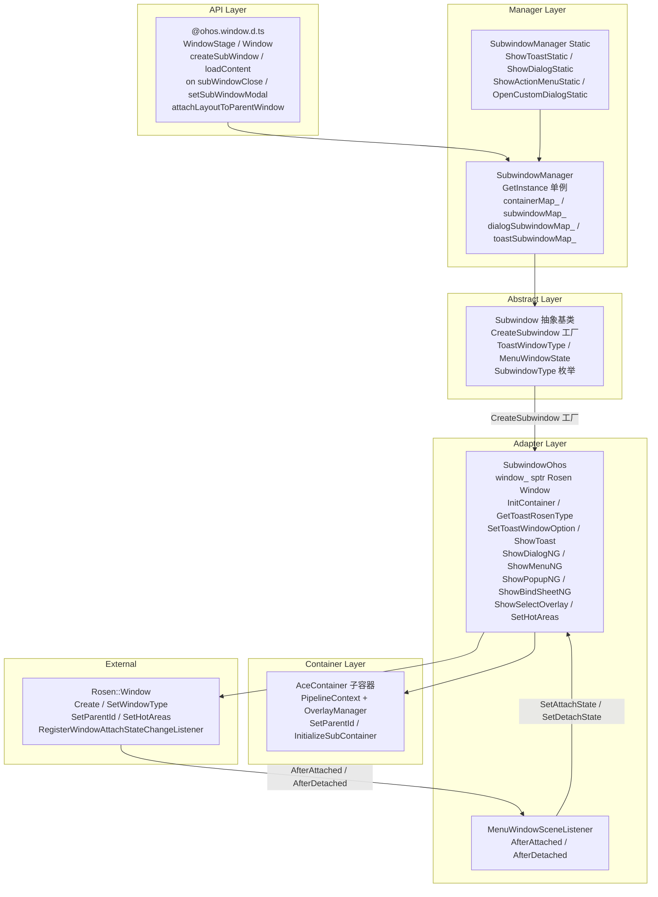
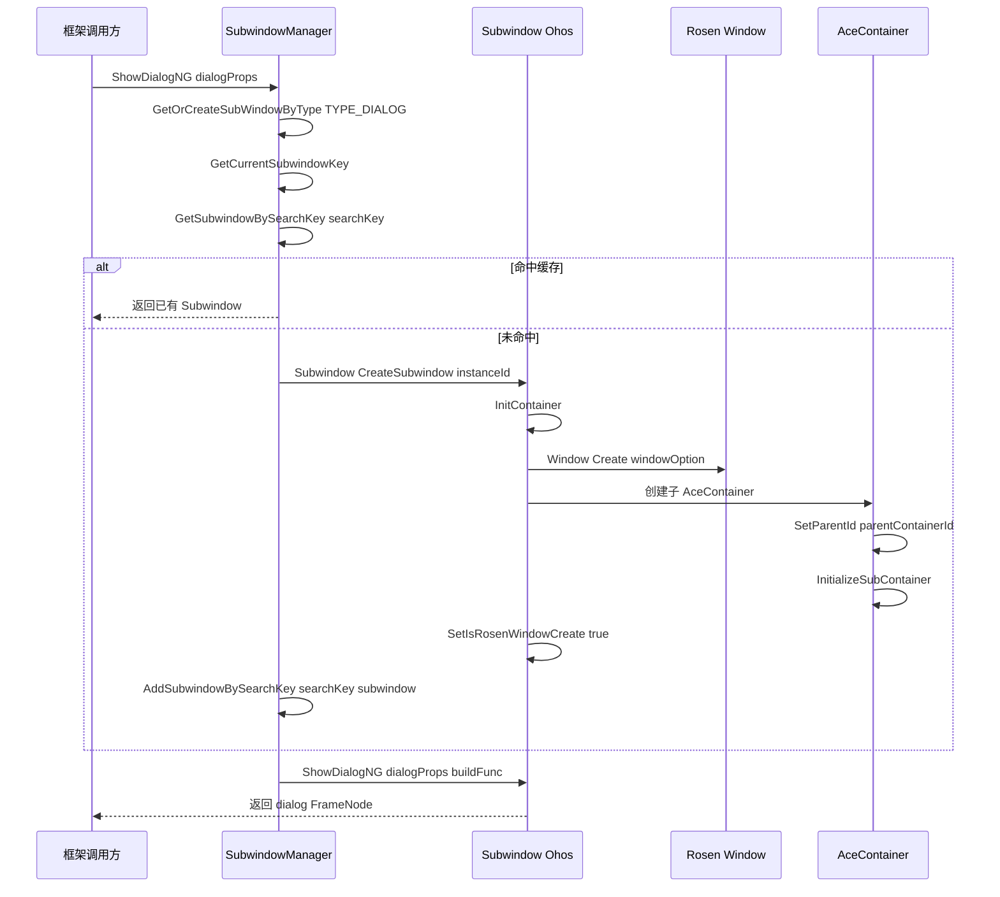
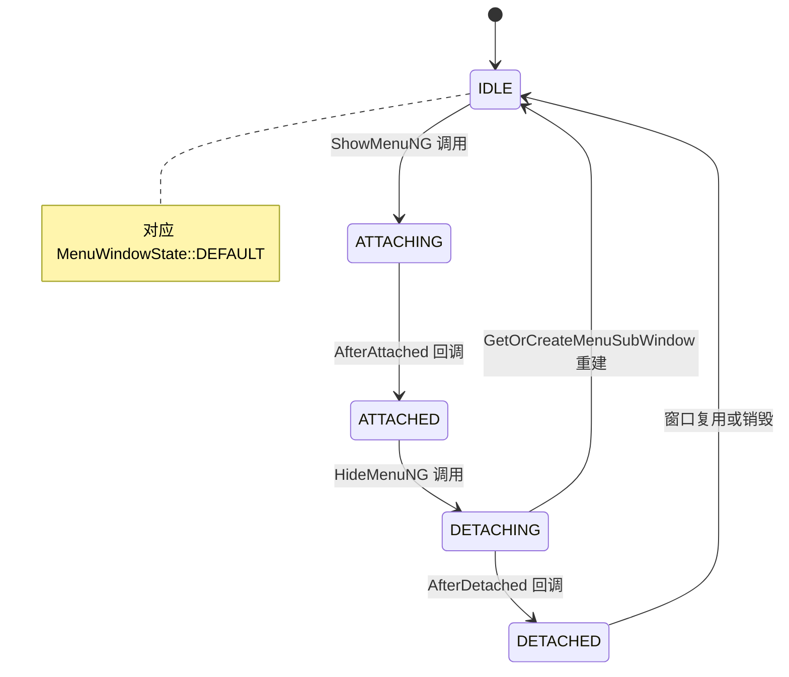

# 架构设计
> ArkUI NG 子窗机制——Subwindow 抽象基类、SubwindowOhos 适配层（封装 Rosen::Window）、SubwindowManager 单例管理器（子窗生命周期/复用/Z 序/触摸热区）、以及 Toast/Menu/Dialog/Popup/Sheet/SelectOverlay/Tips 七类子窗的创建路由与窗口类型映射。

## 术语约定

| 术语 | 完整限定名 | 定义位置 | 说明 |
|------|-----------|---------|------|
| **Subwindow** | `OHOS::Ace::Subwindow` | `frameworks/base/subwindow/subwindow.h` | ace_engine 内部子窗抽象基类，继承 AceType，定义 60+ 虚方法 |
| **SubwindowOhos** | `OHOS::Ace::SubwindowOhos` | `adapter/ohos/entrance/subwindow/subwindow_ohos.h` | Subwindow 的 OHOS 适配实现，持有 `sptr<Rosen::Window> window_` |
| **SubwindowManager** | `OHOS::Ace::SubwindowManager` | `frameworks/base/subwindow/subwindow_manager.h` | 单例管理器，管理子窗创建/复用/查找/销毁全生命周期 |
| **Rosen::Window** | `OHOS::Rosen::Window` | 外部窗口管理模块（`window_manager`） | OpenHarmony 系统级窗口，SubwindowOhos 通过 `window_` 成员持有 |
| **SubwindowKey** | `OHOS::Ace::SubwindowKey` | `frameworks/base/subwindow/subwindow_manager.h:40` | 子窗查找键，包含 instanceId/displayId/foldStatus/windowType/nodeId |
| **MenuWindowSceneListener** | `OHOS::Ace::MenuWindowSceneListener` | `adapter/ohos/entrance/subwindow/subwindow_ohos.h:377` | 菜单窗口 attach/detach 状态监听器，继承 Rosen::IWindowAttachStateChangeListner |

## 设计元数据

| 字段 | 内容 |
|------|------|
| Design ID | DESIGN-Func-03-05-02 |
| 关联需求 | 已有能力补录（无独立 requirement.md） |
| 关联 Epic | 无 |
| 目标 Feature | Feat-01: 子窗机制全量规格（Subwindow 抽象/Manager 单例/七类子窗路由/Toast 窗口类型映射/Menu 状态机/热区与折叠适配） |
| 复杂度 | 复杂 |
| 目标版本 | API 9 ~ API 26+ |
| Owner | ArkUI SIG / 窗口与渲染团队 |
| 状态 | Baselined（已有实现补录） |

## 需求基线

> 需求基线详见 proposal.md。以下仅列出设计阶段需要额外强调的要点。

| 项 | 补充说明（如需） |
|----|------------------|
| 七类子窗类型 | SubwindowType 枚举定义 7 种子窗（TYPE_SYSTEM_TOP_MOST_TOAST/TYPE_TOP_MOST_TOAST/TYPE_MENU/TYPE_POPUP/TYPE_DIALOG/TYPE_SELECT_MENU/TYPE_SHEET/TYPE_TIPS），各类子窗有独立的创建路由和复用策略 |
| Toast 窗口类型映射 | ToastWindowType 4 种（TOAST_IN_TYPE_APP_SUB_WINDOW/SYSTEM_SUB_WINDOW/TOAST/SYSTEM_FLOAT）通过 GetToastRosenType 映射到 Rosen::WindowType，路径复杂 |
| Menu 窗口复用与重建 | GetOrCreateMenuSubWindow 在 DETACHING 状态或 reuse=false 时销毁旧窗并重建，涉及异步销毁 |
| 子窗 Z 序 | GetSortSubwindow 按 SubwindowType 遍历 NORMAL_SUBWINDOW_TYPE 集合并按 subwindowId 降序排序 |
| UIExtension 子窗 | UIExtension 窗口下子窗 SetParentId 使用 hostWindowId，notReuseFlag 控制是否复用 |

## 上下文和现状

### 涉及仓和模块

| 仓库 | 模块路径 | 当前职责 | 本 Feature 影响 |
|------|----------|----------|-----------------|
| ace_engine | `frameworks/base/subwindow/subwindow.h` | Subwindow 抽象基类，ToastWindowType/MenuWindowState/SubwindowType 枚举定义 | 规格补录 |
| ace_engine | `frameworks/base/subwindow/subwindow_manager.h/.cpp` | SubwindowManager 单例，子窗创建/复用/查找/销毁管理，containerMap/subwindowMap/dialogSubwindowMap 等多映射维护 | 规格补录 |
| ace_engine | `frameworks/base/subwindow/subwindow_manager_static.cpp` | ArkTS 1.2 Static 变体（ShowToastStatic/ShowDialogStatic 等） | 规格补录 |
| ace_engine | `adapter/ohos/entrance/subwindow/subwindow_ohos.h/.cpp` | SubwindowOhos 适配实现，封装 sptr<Rosen::Window>，InitContainer/GetToastRosenType/SetToastWindowOption/窗口创建 | 规格补录 |
| ace_engine | `adapter/preview/entrance/subwindow/subwindow_preview.cpp` | Preview 环境桩实现 | 规格补录 |
| interface/sdk-js | `api/@ohos.window.d.ts` | WindowStage: createSubWindow/getSubWindow/loadContent, Window: on('subWindowClose')/setSubWindowModal/attachLayoutToParentWindow | 规格对照 |
| window_manager | `Rosen::Window` / `Rosen::WindowOption` | 系统级窗口创建/管理/父子关系/热区 | 外部依赖 |

### 调用链层级分析

| 层 | 模块 | 职责 | 修改类型 |
|----|------|------|----------|
| API 层 | `@ohos.window.d.ts` (WindowStage) | createSubWindow/getSubWindow/loadContent/on('subWindowClose')/setSubWindowModal/attachLayoutToParentWindow | 无修改（规格补录） |
| Manager 层 | `frameworks/base/subwindow/subwindow_manager.cpp` | 单例管理器，GetOrCreateSubWindowByType/GetOrCreateMenuSubWindow/GetOrCreateToastWindowNG/GetOrCreateSelectOverlayWindow 路由分发 | 无修改（规格补录） |
| Manager 层 (Static) | `frameworks/base/subwindow/subwindow_manager_static.cpp` | ArkTS 1.2 Static 变体的 ShowToastStatic/ShowDialogStatic/ShowActionMenuStatic/OpenCustomDialogStatic | 无修改（规格补录） |
| 抽象层 | `frameworks/base/subwindow/subwindow.h` | Subwindow 抽象基类，CreateSubwindow 工厂，ToastWindowType/MenuWindowState/SubwindowType 枚举 | 无修改（规格补录） |
| 适配层 | `adapter/ohos/entrance/subwindow/subwindow_ohos.h/.cpp` | SubwindowOhos 实现，InitContainer（Rosen::Window 创建+AceContainer 初始化）、GetToastRosenType 路由、SetToastWindowOption、ShowToast/ShowDialogNG/ShowMenuNG/ShowPopupNG/ShowBindSheetNG/ShowSelectOverlay | 无修改（规格补录） |
| 适配层 (Preview) | `adapter/preview/entrance/subwindow/subwindow_preview.cpp` | Preview 环境桩实现 | 无修改（规格补录） |
| 容器层 | `adapter/ohos/entrance/ace_container.h` | AceContainer（子容器），子窗 InitContainer 中创建 child AceContainer+PipelineContext | 无修改（规格补录） |
| Pipeline 层 | `frameworks/core/pipeline_ng/pipeline_context.h` | PipelineContext，子管线 SetParentPipeline/SetupSubRootElement | 无修改（规格补录） |
| Overlay 层 | `frameworks/core/components_ng/pattern/overlay/overlay_manager.h` | OverlayManager，子窗内 Overlay 节点管理 | 无修改（规格补录） |

### 适用架构规则

| Rule ID | 适用原因 | 设计结论 | 验证方式 |
|---------|----------|----------|----------|
| OH-ARCH-LAYERING | 子窗涉及 API → Manager → Subwindow 抽象 → SubwindowOhos 适配 → Rosen::Window 多层调用 | 调用方向自上而下，SubwindowOhos 不直接暴露给 API 层；Manager 层通过 Subwindow 抽象指针调用 | 代码评审 |
| OH-ARCH-SUBSYSTEM | SubwindowOhos 依赖 window_manager 的 Rosen::Window/Rosen::WindowOption | 跨子系统依赖（ace_engine → window_manager），通过 sptr<Rosen::Window> 持有 | 依赖检查 |
| OH-ARCH-API-LEVEL | @ohos.window.d.ts 有 @since 9/11/12/14/24/26 等多版本 API | 各版本 API 通过 PlatformVersion 条件分支实现兼容 | API 评审 / XTS |
| OH-ARCH-COMPONENT-BUILD | 子窗代码在 ace_engine 内部 BUILD.gn 中编译，无独立 SO | frameworks/base/subwindow 和 adapter/ohos/entrance/subwindow 分别编译 | 构建验证 |
| OH-ARCH-ERROR-LOG | 子窗创建/查找失败使用 TAG_LOGE/TAG_LOGW 记录 hilog（AceLogTag::ACE_SUB_WINDOW） | 关键路径日志覆盖（创建失败/查找失败/窗口类型验证失败） | hilog 检查 |

## 不涉及项承接

> proposal.md 已完成 N/A 判定。本节仅对 proposal 中标记为"涉及"且需展开设计的维度给出结论。

| 维度 | 设计结论 |
|------|----------|
| 多窗口/分屏 | SubwindowOhos::IsFreeMultiWindow() 查询父窗 FreeMultiWindowModeEnabledState；SwitchFollowParentWindowLayout 在自由多窗模式下切换子窗跟随父窗布局策略 |
| 折叠屏适配 | ResizeWindowForFoldStatus 在折叠状态变化时调整子窗尺寸；SubwindowKey 包含 foldStatus 字段用于区分折叠状态下的子窗实例 |
| UIExtension | UIExtension 窗口下子窗 SetParentId 使用 hostWindowId；notReuseFlag 控制 UIExtension 模态子窗不复用；SetIsUIExtAnySubWindow 标记 |
| 深色模式 | 子窗 AceContainer 继承父容器 ColorMode，无需特殊处理 |
| 版本升级兼容 | API 9 基线 createSubWindow/loadContent；API 12 on('subWindowClose')/setSubWindowModal；API 24 attachLayoutToParentWindow；API 26 createSubWindowAndBindParent；ArkTS 1.2 Static 变体 |

## 关键设计决策

| 决策 ID | 问题 | 推荐方案 | 探索过的替代方案 | 取舍理由 | 影响 |
|---------|------|----------|-----------------|----------|------|
| ADR-1 | 七类子窗如何统一管理 | SubwindowType 枚举 + SubwindowManager 单例 + SubwindowKey 混合查找（instanceId/displayId/foldStatus/windowType/nodeId） | 每类子窗独立管理器 | 统一管理降低复杂度；SubwindowKey 支持同类型多实例（nodeId 区分）；Toast/Dialog 等旧路径保持 dialogSubwindowMap_/toastSubwindowMap_ 兼容 | AC-1.1 ~ AC-1.4 |
| ADR-2 | Toast 窗口类型如何路由 | ToastWindowType 4 枚举 → GetToastRosenType 按 SceneBoard/SelectOverlay 条件映射到 Rosen::WindowType（WINDOW_TYPE_TOAST/WINDOW_TYPE_APP_SUB_WINDOW/WINDOW_TYPE_SYSTEM_FLOAT） | 统一使用 WINDOW_TYPE_TOAST | 不同父容器类型（主窗/系统窗/SceneBoard/UIExtension）需要不同 Rosen 窗口类型才能正确显示 Z 序和触摸传递 | AC-3.1 ~ AC-3.4 |
| ADR-3 | Menu 子窗复用策略 | GetOrCreateMenuSubWindow 在 DETACHING 状态或 reuse=false 时销毁旧窗并异步重建（PostTask 到 UI 线程 DestroyWindow） | 始终复用同一窗口 | DETACHING 表示窗口正在脱离 FrameNode，复用会导致状态不一致；reuse=false 允许开发者显式禁用复用 | AC-4.1 ~ AC-4.3 |
| ADR-4 | 子窗与父窗的关系如何维护 | 双映射：containerMap_（windowId→containerId）+ parentContainerMap_（containerId→parentContainerId）+ subwindowMap_（SubwindowKey→Subwindow）+ dialogSubwindowMap_（containerId→dialog Subwindow） | 仅 subwindowMap_ 统一管理 | 旧代码依赖 dialogSubwindowMap_/toastSubwindowMap_ 等独立映射，统一改造影响面大；双映射保持兼容 | AC-1.3, AC-1.4 |
| ADR-5 | UIExtension 模态子窗是否复用 | notReuseFlag = container->IsUIExtensionWindow() && isModal 时不复用，每次创建新 Subwindow | 始终复用 | UIExtension 模态子窗需要独立窗口实例确保模态隔离；非模态可复用以减少窗口创建开销 | AC-6.1, AC-6.2 |
| ADR-6 | 子窗触摸热区如何设置 | SetHotAreas 通过 Rosen::Window API 设置触摸热区，按 nodeId 维护 hotAreasMap_ | 全窗可触摸 | SelectOverlay 等子窗需要精确控制触摸区域，避免遮挡父窗交互 | AC-7.1, AC-7.2 |
| ADR-7 | ArkTS 1.2 Static 变体如何实现 | SubwindowOhos 增加 ShowToastStatic/CloseToastStatic/ShowDialogStatic/ShowActionMenuStatic/OpenCustomDialogStatic 虚方法，SubwindowManager 增加对应 Static 方法 | 复用非 Static 方法 | ArkTS 1.2 Static 模式需要独立的 vsync 监听和容器初始化路径（SetSubWindowVsyncListener） | AC-8.1, AC-8.2 |

## 设计骨架

### 骨架范围

| 骨架项 | 目标 | 不包含 | 验证方式 |
|--------|------|--------|----------|
| Subwindow 抽象与工厂 | CreateSubwindow 工厂 + ToastWindowType/MenuWindowState/SubwindowType 枚举 | Rosen::Window 具体创建 | UT |
| SubwindowManager 单例 | GetInstance + containerMap_/subwindowMap_/dialogSubwindowMap_ 多映射管理 | 子窗内部 UI 渲染 | UT |
| 子窗创建路由 | GetOrCreateSubWindowByType/GetOrCreateMenuSubWindow/GetOrCreateToastWindowNG/GetOrCreateSelectOverlayWindow | 子窗内容布局 | UT |
| Toast 窗口类型映射 | GetToastWindowType + GetToastRosenType + SetToastWindowOption | Toast 布局算法 | UT |
| Menu 窗口状态机 | MenuWindowState 五态 + MenuWindowSceneListener 回调 | Menu 菜单项交互 | UT + 手工 |
| 子窗容器初始化 | InitContainer（Rosen::Window 创建 + AceContainer + PipelineContext + OverlayManager） | PipelineContext 内部管线 | UT |
| 热区与折叠适配 | SetHotAreas/DeleteHotAreas + ResizeWindowForFoldStatus + SwitchFollowParentWindowLayout | 折叠状态检测本身 | UT |
| ArkTS 1.2 Static 变体 | ShowToastStatic/ShowDialogStatic 等 + SetSubWindowVsyncListener | Static 编译模式 | UT |

### 骨架 Spec 拆分

| Task ID | 目标 | 受影响文件 | AC |
|---------|------|-----------|-----|
| TASK-SKELETON-1 | 子窗机制全量规格补录（抽象/Manager/路由/Toast 映射/Menu 状态机/热区/折叠/UIExtension/Static） | Feat-01-subwindow-mechanism-spec.md | AC-1.1 ~ AC-8.4 |

## 后续 Task 拆分

| Task ID | 目标 | 受影响文件 | 依赖 |
|---------|------|-----------|------|
| TASK-SUBWINDOW-01 | 子窗机制全量规格补录 | Feat-01-subwindow-mechanism-spec.md, design.md | 无 |

## API 签名、Kit 与权限

### 新增 API

| API 签名 | 类型 | d.ts 位置 | 权限要求 | SysCap |
|----------|------|-----------|----------|--------|
| `WindowStage.createSubWindow(name: string): Promise<Window>` | Public | `@ohos.window.d.ts` | 无 | SystemCapability.Window.SessionManager |
| `WindowStage.getSubWindow(): Promise<Window[]>` | Public | `@ohos.window.d.ts` | 无 | 同上 |
| `WindowStage.createSubWindowWithOptions(options: SubWindowOptions): Promise<Window>` | Public | `@ohos.window.d.ts` (@since 11) | 无 | 同上 |
| `Window.loadContent(path: string): Promise<void>` | Public | `@ohos.window.d.ts` | 无 | 同上 |
| `Window.on('subWindowClose')(cb: Callback<void>): void` | Public | `@ohos.window.d.ts` (@since 12) | 无 | 同上 |
| `Window.setSubWindowModal(modal: boolean): Promise<void>` | Public | `@ohos.window.d.ts` (@since 12) | 无 | 同上 |
| `Window.getSubWindowZLevel(): Promise<number>` | Public | `@ohos.window.d.ts` (@since 14) | 无 | 同上 |
| `Window.setSubWindowZLevel(zLevel: number): Promise<void>` | Public | `@ohos.window.d.ts` (@since 14) | 无 | 同上 |
| `Window.createSubWindowWithOptions(options: SubWindowOptions): Promise<Window>` | Public | `@ohos.window.d.ts` (@since 14) | 无 | 同上 |
| `Window.attachLayoutToParentWindow(options: SubWindowAttachOptions): Promise<void>` | Public | `@ohos.window.d.ts` (@since 24) | 无 | 同上 |
| `WindowStage.createSubWindowAndBindParent(parentId: number, options: SubWindowOptions): Promise<Window>` | Public | `@ohos.window.d.ts` (@since 26) | 无 | 同上 |

### 变更/废弃 API

| 原有 API | 变更类型 | 新 API | 迁移说明 |
|----------|----------|--------|----------|
| 无 | — | — | — |

## 构建系统影响

### BUILD.gn 变更

子窗代码在 ace_engine 内部 BUILD.gn 中编译，无独立 SO：

```
# frameworks/base/subwindow/BUILD.gn
# 构建目标：ace_engine_base（静态库）
# 包含 Subwindow 抽象 + SubwindowManager 单例

# adapter/ohos/entrance/subwindow/BUILD.gn
# 构建目标：ace_engine_adapter_ohos（静态库）
# 包含 SubwindowOhos 适配实现 + MenuWindowSceneListener
```

### bundle.json 变更

子窗机制作为 ace_engine 的内部能力，无独立 bundle.json 变更。

## 可选设计扩展

### 架构图



### 数据流/控制流

| 步骤 | 调用方 | 被调用方 | 数据/接口 | 说明 |
|------|--------|----------|-----------|------|
| 1 | ArkTS / 框架内部 | SubwindowManager | ShowToastNG / ShowMenuNG / ShowDialogNG / ShowBindSheetNG / ShowSelectOverlay | 子窗显示入口 |
| 2 | SubwindowManager | GetCurrentSubwindowKey | instanceId / displayId / foldStatus / windowType / nodeId | 构建 SubwindowKey 查找键 |
| 3 | SubwindowManager | GetSubwindowBySearchKey | SubwindowKey | 在 subwindowMap_ 中查找已有子窗 |
| 4 | SubwindowManager | Subwindow::CreateSubwindow | instanceId | 未命中时创建新 SubwindowOhos |
| 5 | SubwindowManager | subwindow->InitContainer | — | 初始化子窗容器（Rosen::Window + AceContainer） |
| 6 | SubwindowOhos | Rosen::Window::Create | windowName / windowOption | 创建系统级窗口 |
| 7 | SubwindowOhos | Platform::AceContainer | childContainerId_ / parentContainerId_ | 创建子 AceContainer |
| 8 | SubwindowOhos | subwindow->ShowToast / ShowMenuNG / ShowDialogNG | 业务数据 | 在子窗中显示内容 |
| 9 | Rosen::Window | MenuWindowSceneListener | AfterAttached / AfterDetached 回调 | 菜单窗口 attach/detach 状态通知 |

### 时序设计



### 数据模型设计

**API 层类型 (TypeScript)**:

```typescript
// SubWindowOptions (@since 11)
interface SubWindowOptions {
  title?: string;
}

// SubWindowAttachOptions (@since 24)
interface SubWindowAttachOptions {
  parentId?: number;
  modal?: boolean;
  onSubWindowClose?: Callback<void>;
}

// WindowType 枚举
enum WindowType {
  TYPE_APP = 0, TYPE_SYSTEM = 1,
  TYPE_INPUT_METHOD = 2, TYPE_STATE_BAR = 3,
  TYPE_NAVIGATION_BAR = 4, TYPE_FLOATING = 8,
  TYPE_APP_SUB_WINDOW = 9, TYPE_SYSTEM_SUB_WINDOW = 10,
  TYPE_TOAST = 11, TYPE_SYSTEM_TOAST = 12,
  TYPE_SCREEN_LOCK = 13, TYPE_SYSTEM_FLOAT = 15,
  TYPE_DIALOG = 14, TYPE_UI_EXTENSION = 16
}

// ModalityType 枚举 (@since 12)
enum ModalityType {
  WINDOW_MODAL = 1, APPLICATION_MODAL = 2
}
```

**框架层结构 (C++)**:

```cpp
// SubwindowType 枚举 (subwindow.h:47)
enum class SubwindowType {
    TYPE_SYSTEM_TOP_MOST_TOAST = 0,
    TYPE_TOP_MOST_TOAST,
    TYPE_MENU,
    TYPE_POPUP,
    TYPE_DIALOG,
    TYPE_SELECT_MENU,
    TYPE_SHEET,
    TYPE_TIPS,
    SUB_WINDOW_TYPE_COUNT,
};

// ToastWindowType 枚举 (subwindow.h:32)
enum class ToastWindowType {
    TOAST_IN_TYPE_APP_SUB_WINDOW = 0,
    TOAST_IN_TYPE_SYSTEM_SUB_WINDOW,
    TOAST_IN_TYPE_TOAST,
    TOAST_IN_TYPE_SYSTEM_FLOAT,
    TOAST_WINDOW_COUNT
};

// MenuWindowState 枚举 (subwindow.h:39)
enum class MenuWindowState : int32_t {
    DEFAULT = 0,
    ATTACHING = 1,
    ATTACHED = 2,
    DETACHING = 3,
    DETACHED = 4
};

// SubwindowKey 结构 (subwindow_manager.h:40)
struct SubwindowKey {
    int32_t instanceId;
    uint64_t displayId;
    FoldStatus foldStatus;
    SubwindowType windowType = SubwindowType::TYPE_DIALOG;
    int32_t subwindowType;
    int32_t nodeId = -1;
};

// SubwindowOhos 关键成员 (subwindow_ohos.h)
sptr<OHOS::Rosen::Window> window_;
sptr<OHOS::Rosen::Window> dialogWindow_;
sptr<OHOS::Rosen::Window> parentWindow_;
int32_t parentContainerId_ = -1;
int32_t childContainerId_ = -1;
MenuWindowState attachState_ = MenuWindowState::DEFAULT;
MenuWindowState detachState_ = MenuWindowState::DEFAULT;
std::unordered_map<int32_t, std::vector<Rosen::Rect>> hotAreasMap_;
std::list<int32_t> followParentWindowLayoutNodeIds_;
```

### 算法与状态机

**子窗复用与独立模式总览**:

> 七类子窗均通过 `subwindowMap_`（SubwindowMixMap，键为 SubwindowKey）统一管理，采用 GetOrCreate 模式（先按 SubwindowKey 查找已有窗口，命中则复用，未命中则创建）。各类型的复用策略、独立创建条件、状态机归属差异如下：

| 子窗类型 | SubwindowType | 创建/复用入口 | 常规策略 | 独立创建条件 | 窗口级状态机 | 内容生命周期管理 |
|---------|---------------|-------------|---------|------------|------------|---------------|
| Menu | TYPE_MENU | `GetOrCreateMenuSubWindow`(`:2037`) | 复用（SubwindowKey 查找） | `reuse=false` 或 `GetDetachState()==DETACHING` 时销毁旧窗并重建 | **MenuWindowState 五态**（仅 Menu 有） | `MenuWindowSceneListener` 的 `AfterAttached`/`AfterDetached` 回调驱动窗口 attach/detach 状态 |
| Dialog | TYPE_DIALOG | `GetOrCreateSubWindowByType`(`:2009`) | 复用（SubwindowKey 查找） | UIExtension 模态（`notReuseFlag=true`）时不加入 `subwindowMap_`，每次独立创建 | 无 | OverlayManager 按 `dialogId` 管理多个 Dialog FrameNode，窗口持久复用 |
| Popup | TYPE_POPUP | `ShowPopupNG`(`:494`) 内联 GetOrCreate | 复用（SubwindowKey 查找） | 无 | 无 | OverlayManager 按 `targetId` 管理多个 Popup，窗口持久复用 |
| Sheet | TYPE_SHEET | `ShowBindSheetNG`(`:746`) 内联 GetOrCreate | 复用（SubwindowKey / `instanceSubwindowMap_` 查找） | 无 | 无 | `subwindow->ShowBindSheetNG` 管理 sheet 内容，窗口持久复用 |
| Tips | TYPE_TIPS | `ShowTipsNG`(`:574`) 内联 GetOrCreate | 复用（SubwindowKey 查找） | 无 | 无 | OverlayManager `TipsInfoList` 队列（`targetId` 级 appearing/disappearing 计数） |
| Toast | TYPE_TOP_MOST_TOAST | `GetOrCreateToastWindowNG`(`:1274`) | 复用（`GetToastSubwindow` → SubwindowKey 查找） | 无 | 无（有 `ToastWindowType` 4 类→Rosen::WindowType 路由） | `subwindow->ShowToast`/`CloseToast` 按 `toastId` 队列管理 |
| SelectOverlay | TYPE_SELECT_MENU | `GetOrCreateSelectOverlayWindow`(`:1752`) | 复用（`GetSelectOverlaySubwindow` → SubwindowKey 查找） | 无 | 无 | `ShowSelectOverlay`/`HideSelectOverlay` + `SetHotAreas`/`DeleteHotAreas` 热区管理 |

**关键区分**:

- **仅 Menu 有窗口级状态机**：Menu 子窗涉及 Rosen::Window 的异步 attach/detach 回调（`MenuWindowSceneListener`，`subwindow_ohos.h:377`），需要状态机协调"窗口正在脱离"（DETACHING）期间的复用与重建决策。其余 6 类（Dialog/Popup/Sheet/Tips/Toast/SelectOverlay）窗口一旦创建即持久复用，无窗口级状态转换，内容由 OverlayManager 或 subwindow 内部接口按 ID 队列管理。
- **"独立创建"两种场景**：
  1. **Menu 销毁重建**（`:2047-2067`）：`GetDetachState() == DETACHING`（旧窗正在脱离 FrameNode，复用会导致状态不一致）或 `reuse=false`（开发者显式禁用复用）时，先 `RemoveSubwindowBySearchKey` 移除映射，旧窗已显示则 `SetDestroyInHide(true)`、未显示则 PostTask `DestroyWindow()` 异步销毁，再创建新 Subwindow 并 `AddSubwindowBySearchKey`。
  2. **Dialog UIExtension 模态独立**（`:2017,2030-2031`）：`notReuseFlag = container->IsUIExtensionWindow() && isModal` 为 true 时，创建新 Subwindow 但**不加入** `subwindowMap_`（`if (!notReuseFlag) { AddSubwindowBySearchKey(...) }`），确保 UIExtension 模态子窗窗口实例隔离，每次独立创建、不可复用。

**MenuWindowState 状态机（Menu 独有）**:



**其他子窗生命周期管理（无窗口级状态机）**:

Dialog/Popup/Sheet/Tips/Toast/SelectOverlay 六类子窗无需窗口级状态机的原因：这六类子窗的显示/隐藏由上层组件（OverlayManager 或 subwindow 内部接口）同步驱动，不涉及 Rosen::Window 的异步 attach/detach 回调。窗口创建后持久存在于 `subwindowMap_` 中，多次显示/隐藏复用同一窗口实例，内容由 OverlayManager 按 `targetId`/`dialogId`/`toastId` 等业务 ID 队列管理，窗口本身无状态转换需求。

**GetOrCreateSubWindowByType 算法伪代码**（Dialog 通用路径）:

```
function GetOrCreateSubWindowByType(windowType, isModal):
    containerId = Container.CurrentId()
    container = Container.GetContainer(containerId)
    searchKey = GetCurrentSubwindowKey(containerId, windowType)
    subWindow = GetSubwindowBySearchKey(containerId, searchKey)

    notReuseFlag = false
    if container:
        notReuseFlag = container.IsUIExtensionWindow() && isModal
        if container.IsSubContainer():
            parentContainerId = GetParentContainerId(containerId)
            parentContainer = Container.GetContainer(parentContainerId)
            notReuseFlag = parentContainer && parentContainer.IsUIExtensionWindow() && isModal

    if notReuseFlag || !IsSubwindowExist(subWindow):
        subWindow = Subwindow.CreateSubwindow(containerId)
        subWindow.InitContainer()
        if !notReuseFlag:
            AddSubwindowBySearchKey(searchKey, subWindow)

    return subWindow
```

**GetOrCreateMenuSubWindow 算法伪代码**（Menu 销毁重建路径）:

```
function GetOrCreateMenuSubWindow(instanceId, reuse):
    searchKey = GetCurrentSubwindowKey(instanceId, TYPE_MENU)
    subwindow = GetSubwindowBySearchKey(searchKey)

    if !IsSubwindowExist(subwindow):
        subwindow = Subwindow.CreateSubwindow(instanceId)
        subwindow.InitContainer()
        AddSubwindowBySearchKey(searchKey, subwindow)
    else if subwindow.GetDetachState() == DETACHING || !reuse:
        RemoveSubwindowBySearchKey(searchKey)
        if subwindow.GetShown():
            subwindow.SetDestroyInHide(true)        // 窗口已显示，延迟到 hide 时销毁
        else:
            PostTask([subwindow] { subwindow.DestroyWindow() }, UI)  // 异步销毁
        subwindow = Subwindow.CreateSubwindow(instanceId)
        subwindow.InitContainer()
        AddSubwindowBySearchKey(searchKey, subwindow)

    return subwindow
```

### 测试性设计

| 测试层级 | 测试目标 | Mock 策略 | 验证方式 |
|----------|----------|-----------|----------|
| UT - Manager | GetOrCreateSubWindowByType/GetOrCreateMenuSubWindow/GetOrCreateToastWindowNG 路由分发 | MockContainer + MockSubwindow | gtest_filter |
| UT - Adapter | SubwindowOhos::InitContainer / GetToastRosenType 路由 | MockRosenWindow | gtest_filter |
| UT - Key | SubwindowKey 构造/哈希/比较 | 直接构造 SubwindowKey | gtest_filter |
| UT - Toast 路由 | GetToastWindowType 按 container 类型返回正确 ToastWindowType | MockContainer 设置 IsSubWindow/IsSystemWindow/IsSceneBoardWindow | gtest_filter |
| UT - Menu 状态 | MenuWindowState 转换 + GetOrCreateMenuSubWindow DETACHING 重建 | MockSubwindow 设置 GetDetachState | gtest_filter |
| UT - HotAreas | SetHotAreas/DeleteHotAreas 按 nodeId 管理 | MockRosenWindow | gtest_filter |
| UT - Static | ShowToastStatic/ShowDialogStatic 路由 | MockSubwindow | gtest_filter |
| 手工 | 子窗 Z 序 / Toast 显示效果 / 折叠屏适配 | 真机 | 视觉比对 |

### 接口参数规约

| 接口 | 参数 | 类型 | 合法范围 | 非法处理 | 边界说明 |
|------|------|------|----------|----------|----------|
| CreateSubwindow | instanceId | int32_t | 有效容器 ID | 返回 nullptr | — |
| GetOrCreateSubWindowByType | windowType | SubwindowType | 0~SUB_WINDOW_TYPE_COUNT-1 | 越界返回 nullptr | — |
| GetOrCreateSubWindowByType | isModal | bool | true/false | — | UIExtension 模态不复用 |
| GetOrCreateMenuSubWindow | instanceId | int32_t | 有效容器 ID | 返回 nullptr | — |
| GetOrCreateMenuSubWindow | reuse | bool | true/false | false 触发重建 | DETACHING 状态强制重建 |
| GetOrCreateToastWindowNG | windowType | ToastWindowType | 0~TOAST_WINDOW_COUNT-1 | — | — |
| GetOrCreateToastWindowNG | mainWindowId | uint32_t | 有效窗口 ID | 0 时回退 parentWindowId | — |
| GetToastRosenType | IsSceneBoardEnabled | bool | true/false | — | SelectOverlay 子窗走 APP_SUB_WINDOW |
| SetHotAreas | rects | vector<Rect> | 有效矩形列表 | 空列表清除 | 按 nodeId 维护 |
| SetHotAreas | nodeId | int32_t | 有效节点 ID | — | — |

### 线程与并发模型

| 操作 | 发起线程 | 回调线程 | 跨进程边界 | 线程安全 | 重入约束 |
|------|----------|----------|-----------|----------|----------|
| GetOrCreateSubWindowByType | UI | UI | 无（同进程） | mutex_ 保护 subwindowMap_ | 不可重入 |
| GetOrCreateMenuSubWindow | UI | UI | 无 | mutex_ 保护 subwindowMap_ | DETACHING 重建 PostTask 到 UI |
| ShowToastNG | PLATFORM | UI | 无 | taskExecutor PostTask 切换到 PLATFORM | — |
| InitContainer | UI | UI | Rosen::Window::Create 跨 IPC | eventRunnerMutex_ 保护 | — |
| OnWindowSizeChanged | UI | UI | 无 | mutex_ 保护 | — |
| ResizeWindowForFoldStatus | UI | UI | 无 | — | — |
| MenuWindowSceneListener::AfterAttached | Rosen 回调线程 | UI | 跨 IPC | WeakPtr 升级检查 | — |

**并发场景**:

| 场景 | 线程安全策略 |
|------|-------------|
| 多线程同时创建同类型子窗 | subwindowMutex_ 保护 subwindowMap_ 查找和插入 |
| Menu 窗口 DETACHING 时新 ShowMenuNG 到来 | RemoveSubwindowBySearchKey 移除旧条目，异步 PostTask DestroyWindow |
| Toast 异步创建（PLATFORM 线程） | PostTask 到 PLATFORM 线程执行，GetOrCreateToastWindowNG 在 PLATFORM 线程调用 |
| 子窗销毁与查找并发 | instanceSubwindowMutex_ 保护 instanceSubwindowMap_ |

## 详细设计

### Subwindow 抽象基类

`Subwindow`（`subwindow.h:59`）继承 `AceType`，定义子窗抽象接口：

- **工厂方法**: `CreateSubwindow(int32_t instanceId)`（`subwindow_ohos.cpp:124-127`）返回 `MakeRefPtr<SubwindowOhos>`
- **容器初始化**: `InitContainer()` 纯虚方法，由 SubwindowOhos 实现
- **七大显示接口**: `ShowMenuNG` / `ShowPopupNG` / `ShowDialogNG` / `ShowToast` / `OpenCustomDialogNG` / `ShowBindSheetNG` / `ShowSelectOverlay`
- **窗口管理**: `Close()` / `DestroyWindow()` / `HideSubWindowNG()` / `ResizeWindowForFoldStatus()`
- **焦点管理**: `IsFocused()` / `RequestFocus()`
- **热区管理**: `SetHotAreas(rects, nodeId)` / `DeleteHotAreas(nodeId)`
- **Overlay 获取**: `GetOverlayManager()` 返回子窗内 OverlayManager
- **跟随父窗布局**: `SetFollowParentWindowLayoutEnabled(enable)` / `SwitchFollowParentWindowLayout(freeMultiWindowEnable)` / `NeedFollowParentWindowLayout()`
- **ArkTS 1.2 Static 变体**: `ShowToastStatic` / `CloseToastStatic` / `ShowDialogStatic` / `ShowActionMenuStatic` / `OpenCustomDialogStatic`（`#if !defined(IOS_PLATFORM) && !defined(ANDROID_PLATFORM)` 条件编译，`subwindow.h:291-300`）

关键状态成员：
- `toastWindowType_`（默认 `TOAST_IN_TYPE_TOAST`，`:309`）
- `isAboveApps_` / `isSystemTopMost_` / `isRosenWindowCreate_` / `isSelectOverlaySubWindow_`（`:305-308`）
- `mainWindowId_`（`:311`）

### SubwindowManager 单例

`SubwindowManager`（`subwindow_manager.h:78`）继承 `NonCopyable`，线程安全单例：

**多映射管理**:
- `containerMap_`（`unordered_map<uint32_t, int32_t>`，windowId→containerId，`:296`）
- `reverseContainerMap_`（containerId→windowId，`:297`）
- `parentContainerMap_`（containerId→parentContainerId，`:300`）
- `subwindowMap_`（`SubwindowMixMap` = `unordered_map<SubwindowKey, RefPtr<Subwindow>>`，`:304`）
- `instanceSubwindowMap_`（`SubwindowMap` = `unordered_map<int32_t, RefPtr<Subwindow>>`，`:308`）
- `dialogSubwindowMap_`（containerId→dialog Subwindow，`:312`）
- `currentDialogSubwindow_`（thread_local currentSubwindow_，`:305` + `currentDialogSubwindow_` `:314`）

**创建路由函数**:
- `GetOrCreateSubWindowByType(SubwindowType windowType, bool isModal)`（`:2009`）：构建 SubwindowKey → 查找 subwindowMap_ → 未命中时 CreateSubwindow + InitContainer → AddSubwindowBySearchKey
- `GetOrCreateMenuSubWindow(int32_t instanceId, bool reuse)`（`:2037`）：查找 → 未命中创建 → DETACHING 或 !reuse 时销毁重建（PostTask DestroyWindow）
- `GetOrCreateToastWindowNG(int32_t containerId, ToastWindowType windowType, uint32_t mainWindowId)`（`:1274`）：查找 toastSubwindowMap_ → 未命中创建 + SetToastWindowType + SetMainWindowId + InitContainer
- `GetOrCreateSelectOverlayWindow(int32_t containerId, ToastWindowType windowType, uint32_t mainWindowId)`（`:1752`）：查找 → 未命中创建 + SetIsSelectOverlaySubWindow(true) + InitContainer

**SubwindowKey 构建**:
`GetCurrentSubwindowKey`（`:1665`）构建查找键：
- instanceId = 传入参数
- displayId = container->GetCurrentDisplayId()
- foldStatus = SuperFoldDisplayDevice ? container->GetFoldStatusFromListener() : UNKNOWN
- windowType = TYPE_POPUP/TYPE_MENU 统一映射为 TYPE_DIALOG（`:1673-1675`）
- TYPE_SHEET 的 foldStatus 强制 UNKNOWN（`:1686-1688`）
- nodeId = 传入参数（默认 -1）

**GetSubwindowByType**（`:1850`）:
- instanceId >= MIN_SUBCONTAINER_ID 且非 TOP_MOST_TOAST 类型时，走 GetSubwindowById 快速路径（`:1853-1860`）
- 否则构建 SubwindowKey 在 subwindowMap_ 中查找

### SubwindowOhos 适配层

`SubwindowOhos`（`subwindow_ohos.h:53`）继承 `Subwindow`：

**InitContainer**（`subwindow_ohos.cpp:310`）核心流程：
1. 获取 parentContainer 和 parentPipeline（`:311-314`）
2. 创建 Rosen::WindowOption（`:316`）
3. 根据 IsSystemTopMost/GetAboveApps/默认 三分支设置窗口类型（`:327-366`）：
   - IsSystemTopMost → WINDOW_TYPE_SYSTEM_TOAST（`:328`）
   - GetAboveApps → GetToastRosenType 路由（`:333`）→ SetToastWindowOption（`:340`）
   - 默认 → GetAndVerifyWindowTypeForArkUI 验证 → WINDOW_TYPE_APP_SUB_WINDOW 或 WINDOW_TYPE_SYSTEM_SUB_WINDOW（`:345-357`）
4. UIExtension 处理：SetParentId(hostWindowId) + SetIsUIExtFirstSubWindow（`:360-365`）
5. Rosen::Window::Create 创建窗口（`:402`）
6. RegisterWindowAttachStateChangeListener 注册 MenuWindowSceneListener（`:408`）
7. NapiSetUIContent 初始化 UIContent（`:418`）
8. 创建子 AceContainer（`:423-441`）：SetParentId / Initialize / InitializeSubContainer
9. AceViewOhos 创建和 SetView（`:446-458`）
10. PipelineContext 设置：SetParentPipeline / SetupSubRootElement / SetMinPlatformVersion（`:482-488`）

**GetToastRosenType**（`:137-153`）路由逻辑：
| ToastWindowType | SceneBoardEnabled | SelectOverlay | Rosen::WindowType |
|----------------|-------------------|----------------|-------------------|
| TOAST_IN_TYPE_APP_SUB_WINDOW | false | false | WINDOW_TYPE_TOAST |
| TOAST_IN_TYPE_APP_SUB_WINDOW | true | false | WINDOW_TYPE_APP_SUB_WINDOW |
| TOAST_IN_TYPE_APP_SUB_WINDOW | any | true | WINDOW_TYPE_APP_SUB_WINDOW |
| TOAST_IN_TYPE_SYSTEM_SUB_WINDOW | — | — | WINDOW_TYPE_TOAST |
| TOAST_IN_TYPE_SYSTEM_FLOAT | — | — | WINDOW_TYPE_SYSTEM_FLOAT |
| TOAST_IN_TYPE_TOAST (default) | — | — | WINDOW_TYPE_TOAST |

**SetToastWindowOption**（`:155-178`）:
- WINDOW_TYPE_APP_SUB_WINDOW → SetWindowMode FLOATING + WINDOW_FLAG_IS_TOAST/WINDOW_FLAG_IS_TEXT_MENU（`:159-165`）
- UIExtension → SetParentId(hostWindowId) + SetIsUIExtAnySubWindow（`:168-174`）
- 非 UIExtension → SetParentId(mainWindowId)（`:176`）

**MenuWindowSceneListener**（`subwindow_ohos.h:377-398`）:
- `AfterAttached()` → `sub->SetAttachState(MenuWindowState::ATTACHED)`（`:386`）
- `AfterDetached()` → `sub->SetDetachState(MenuWindowState::DETACHED)`（`:394`）

### Toast 窗口类型路由

`GetToastWindowType`（`subwindow_manager.cpp:1155-1178`）按容器类型路由：
| 容器类型 | ToastWindowType |
|----------|----------------|
| IsSubWindow / IsMainWindow / IsDialogWindow | TOAST_IN_TYPE_APP_SUB_WINDOW |
| IsSceneBoardWindow | TOAST_IN_TYPE_SYSTEM_FLOAT |
| IsSystemWindow | TOAST_IN_TYPE_SYSTEM_SUB_WINDOW |
| IsUIExtensionWindow + IsHostSubWindow/HostMainWindow/HostDialogWindow | TOAST_IN_TYPE_APP_SUB_WINDOW |
| IsUIExtensionWindow + IsHostSceneBoardWindow | TOAST_IN_TYPE_SYSTEM_FLOAT |
| IsUIExtensionWindow + IsHostSystemWindow | TOAST_IN_TYPE_SYSTEM_SUB_WINDOW |
| 其他 | TOAST_IN_TYPE_TOAST |

### Menu 子窗复用与重建

`GetOrCreateMenuSubWindow`（`:2037-2070`）流程：
1. 构建 SubwindowKey（TYPE_MENU）（`:2039`）
2. `GetSubwindowBySearchKey` 查找已有子窗（`:2040`）
3. 不存在 → CreateSubwindow + InitContainer + AddSubwindowBySearchKey（`:2041-2046`）
4. 存在但 `GetDetachState() == DETACHING || !reuse`（`:2047`）:
   - `RemoveSubwindowBySearchKey` 移除旧条目（`:2050`）
   - 旧窗已显示 → `SetDestroyInHide(true)`（`:2051-2052`）
   - 旧窗未显示 → PostTask `DestroyWindow()`（`:2054-2062`）
   - 创建新 Subwindow + InitContainer + AddSubwindowBySearchKey（`:2063-2067`）

### 子窗 Z 序

`GetSortSubwindow`（`:1931-1950`）:
1. 遍历 `NORMAL_SUBWINDOW_TYPE = {TYPE_MENU, TYPE_DIALOG, TYPE_POPUP, TYPE_SHEET}`（`:33-34`）
2. 调用 `GetSubwindowByType` 获取每类子窗
3. 按 `subwindowId` 降序排序（`:1941-1948`）

### 热区管理

`SetHotAreas`（`subwindow_ohos.h:119`）:
- 按 nodeId 维护 `hotAreasMap_`（`unordered_map<int32_t, vector<Rosen::Rect>>`，`:336`）
- 调用 `window_->SetTouchHotAreas(hotAreas)`

`DeleteHotAreas`（`subwindow_ohos.h:120`）:
- 从 `hotAreasMap_` 移除指定 nodeId
- 更新窗口热区

### 折叠屏适配

`ResizeWindowForFoldStatus`（`subwindow_manager.cpp:1484`）:
- PA Service 容器（< 0 或 >= MIN_PA_SERVICE_ID）→ GetDialogSubwindow
- 正常容器 → GetToastSubwindow
- GetSystemToastWindow 获取系统级 Toast 窗
- 遍历所有子窗调用 `window->ResizeWindowForFoldStatus(parentContainerId)`（`:1504-1505`）

### 自由多窗与跟随父窗布局

`IsFreeMultiWindow`（`subwindow_ohos.cpp:2589`）:
- 查询 `parentWindow_->GetFreeMultiWindowModeEnabledState()`

`SwitchFollowParentWindowLayout`（`:2728`）:
- nodeId_ != DEFAULT_NODE_ID 时，UEC 模态子窗始终跟随父窗（`:2732-2734`）
- NeedFollowParentWindowLayout() && !expandDisplay && !freeMultiWindowEnable → SetFollowParentWindowLayoutEnabled(true)（`:2737-2738`）
- 否则 SetFollowParentWindowLayoutEnabled(false) + ResizeWindow()（`:2739-2741`）

`AddFollowParentWindowLayoutNode` / `RemoveFollowParentWindowLayoutNode`（`:2744-2759`）:
- 维护 `followParentWindowLayoutNodeIds_` 列表
- 首次添加/最后移除时触发 SwitchFollowParentWindowLayout

### ArkTS 1.2 Static 变体

`SubwindowManager` Static 方法（`subwindow_manager_static.cpp`）:
- `ShowToastStatic` → 路由到 `GetOrCreateSubWindowByType(TYPE_DIALOG)` 或 `GetOrCreateSubWindow(true)`（`:141-148, 173-180, 200-207`）
- SubwindowOhos 实现对应的 Static 虚方法（`subwindow_ohos.h:261-267`）
- Static 模式需要 `SetSubWindowVsyncListener`（`subwindow_ohos.h:374`）为子窗设置独立 vsync 监听

## 风险和开放问题

| 项 | 类型 | 影响 | 处理方式 | Owner |
|----|------|------|----------|-------|
| Menu DETACHING 重建时异步 DestroyWindow 可能竞态 | 架构 | 中 | PostTask 到 UI 线程执行 DestroyWindow；RemoveSubwindowBySearchKey 先移除映射条目 | ArkUI SIG |
| UIExtension 模态子窗不复用导致窗口泄漏 | 可靠性 | 中 | notReuseFlag 仅在 isModal=true 时生效；非模态 UIExtension 子窗复用 | ArkUI SIG |
| Toast 窗口类型路由复杂（6+ 条件分支） | 可维护性 | 中 | GetToastWindowType + GetToastRosenType 双层路由，需文档化 | ArkUI SIG |
| subwindowMap_ 与 dialogSubwindowMap_ 双映射可能不一致 | 架构 | 低 | 旧路径 dialogSubwindowMap_ 仅用于 PA Service；正常路径走 subwindowMap_ | ArkUI SIG |
| attachLayoutToParentWindow (API 24) 与 SetFollowParentWindowLayoutEnabled 关系未文档化 | API | 低 | 两者底层都调用 Rosen::Window API，需确认行为差异 | ArkUI SIG |
| ArkTS 1.2 Static vsync 监听路径与非 Static 不同 | 架构 | 低 | SetSubWindowVsyncListener 仅在 ARK_TS/DYNAMIC_HYBRID_STATIC/STATIC_HYBRID_DYNAMIC 前端类型下触发 | ArkUI SIG |

## 设计审批

- [x] 需求基线已确认，设计覆盖 P0/P1 AC
- [x] 不涉及项已承接，N/A 和展开项都有结论
- [x] 涉及仓和模块职责清楚
- [x] 调用链层级分析完整，每层覆盖到位
- [x] 适用架构规则已识别并形成设计结论
- [x] 分层和子系统边界合规
- [x] API 变更有签名、权限、错误码和兼容性说明
- [x] BUILD.gn/bundle.json 影响明确
- [x] 设计输出和后续 Task 拆分明确
- [x] 关键设计决策有理由和影响说明
- [x] 风险和开放问题有 Owner

**结论:** 通过（已有实现补录）
