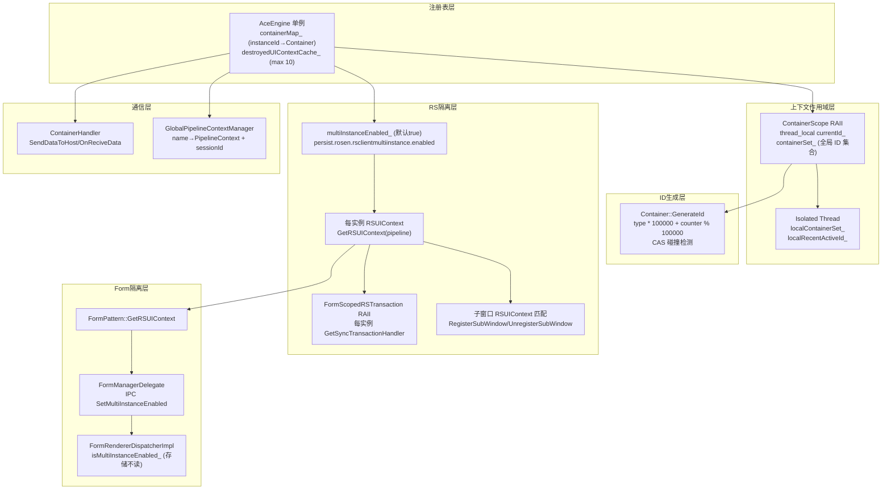
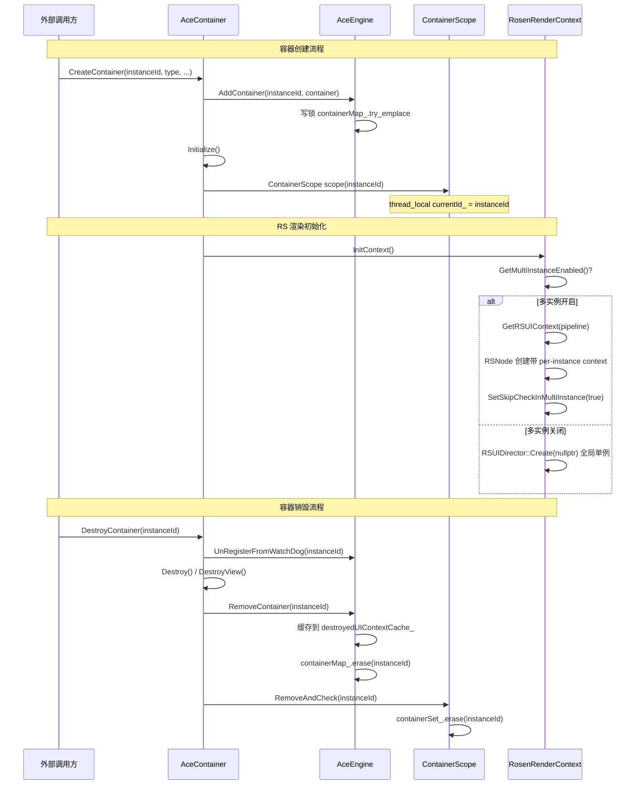

# 架构设计

> 确认目标仓和模块的架构约束、关键设计决策、Spec 拆分方向。

## 设计元数据

| Field | Content |
|-------|---------|
| Design ID | `DESIGN-Func-03-06-01` |
| 关联需求 | 已有能力补录（无独立 requirement.md） |
| 关联 Epic | 无 |
| 目标 Feature | Feat-01: 多实例管理全能力 |
| 复杂度 | 关键 |
| 目标版本 | API 10+ |
| Owner | ArkUI SIG |
| 状态 | Baselined（已有实现补录） |

## 需求基线

| 项 | 补充说明 |
|----|------------------|
| 多实例容器架构 | AceEngine 单例维护 instanceId→Container 映射，支持多窗口/子窗口/对话框/卡片等同进程共存 |
| RS 图形实例隔离 | 系统参数 `persist.rosen.rsclientmultiinstance.enabled` 控制每实例 RSUIContext vs 全局单例，默认开启 |
| 线程级实例隔离 | Dynamic Component / Form 场景使用 `MarkIsolatedThread()` 切换为线程局部实例集 |
| 跨实例通信 | ContainerHandler 同步请求/回复 + GlobalPipelineContextManager 会话 ID 映射 |

## 上下文和现状

### 涉及仓和模块

| 仓库 | 补充架构说明 |
|------|-------------|
| ace_engine | 全部实现均在 ace_engine 仓库内，无跨仓依赖。RS 图形层通过 Rosen SDK 接口调用 |

### 调用链层级分析

| 层 | 模块 | 职责 | 修改类型 |
|----|------|------|----------|
| 容器注册表层 | `frameworks/core/common/ace_engine.h/cpp` | AceEngine 单例：containerMap_ 注册表、destroyedUIContextCache_ 缓存、NotifyContainers 广播、GC 分发 | 已有实现（补录） |
| 容器基类层 | `frameworks/core/common/container.h/cpp` | Container 抽象基类：GenerateId 模板（类型分区 ID 生成）、Current/GetActive/GetByWindowId/GetFocused 静态查找 | 已有实现（补录） |
| 上下文作用域层 | `frameworks/core/common/container_scope.h/cpp` | ContainerScope RAII：thread_local currentId_ 管理、6 种 ID 解析策略、isolated thread 线程局部集 | 已有实现（补录） |
| 容器常量层 | `frameworks/core/common/container_consts.h` | ContainerType 枚举（10 种）、CONTAINER_ID_DIVIDE_SIZE（100000）、INSTANCE_ID_UNDEFINED/PLATFORM 哨兵值 | 已有实现（补录） |
| 容器间通信层 | `frameworks/core/common/container_handler.h` | ContainerHandler：SendDataToHost/OnReciveData 同步请求/回复 | 已有实现（补录） |
| 平台适配层 | `adapter/ohos/entrance/ace_container.h/cpp` | AceContainer：CreateContainer/DestroyContainer 静态工厂、生命周期分发 | 已有实现（补录） |
| UI 内容层 | `adapter/ohos/entrance/ui_content_impl.cpp` | UIContentImpl：DC 初始化 MarkIsolatedThread、SetUITaskRunner 多实例路由、SetRSSyncTransaction | 已有实现（补录） |
| 全局管线管理层 | `adapter/ohos/entrance/global_pipeline_context_manager.h/cpp` | GlobalPipelineContextManager：name→PipelineContext 映射、sessionId 映射（UIExtension） | 已有实现（补录） |
| 系统属性层 | `adapter/ohos/osal/system_properties.cpp` | multiInstanceEnabled_ 弱符号、GetMultiInstanceEnabled/SetMultiInstanceEnabled | 已有实现（补录） |
| 无窗口容器层 | `adapter/ohos/entrance/window_free_container.cpp` | WindowFreeContainer：单例无窗口容器创建/销毁（NAPI 暴露） | 已有实现（补录） |
| RS 渲染上下文层 | `frameworks/core/components_ng/render/adapter/rosen_render_context.cpp` | RSUIContext 每实例获取、isSkipCheckInMultiInstance 标志、FlushImplicitTransaction | 已有实现（补录） |
| RS 窗口层 | `frameworks/core/components_ng/render/adapter/rosen_window.cpp` | RosenWindow：多实例子窗口注册/注销、vsync 传播、隐式事务刷新 | 已有实现（补录） |
| Form 渲染窗口层 | `frameworks/core/components_ng/render/adapter/form_render_window.cpp` | FormRenderWindow：多实例 RSUIDirector 创建、SetUITaskRunner | 已有实现（补录） |
| Form 事务层 | `frameworks/core/components_ng/pattern/form/form_scoped_rs_transaction.h/cpp` | FormScopedRSTransaction RAII：每实例 GetSyncTransactionHandler vs 全局 RSSyncTransactionController | 已有实现（补录） |
| Form 管理层 | `frameworks/core/components/form/resource/form_manager_delegate.h/cpp` | FormManagerDelegate：RSUIContext 设置、IPC SetMultiInstanceEnabled 传播、NotifySurfaceChange 每实例事务路由 | 已有实现（补录） |
| Form Pattern 层 | `frameworks/core/components_ng/pattern/form/form_pattern.cpp` | FormPattern：GetRSUIContext 获取、SetRSUIContext 到 form surface node | 已有实现（补录） |
| Form IPC 层 | `interfaces/inner_api/form_render/` | FormRendererDispatcherInterface/Impl/Stub/Proxy：SetMultiInstanceEnabled IPC 消息链 | 已有实现（补录） |
| NAPI 层 | `interfaces/napi/kits/container_utils/js_container_utils.cpp` | containerUtils.createContainerWithoutWindow/destroyContainerWithoutWindow | 已有实现（补录） |
| 内部 API 层 | `interfaces/inner_api/ace/ui_content.h/cpp` | UIContent::GetUIContent(instanceId) 静态查找（dlsym 跨库） | 已有实现（补录） |

检查项：
- [x] 调用链每一层都已覆盖（从最上层到最底层）
- [x] 每层职责边界清晰，无跨层违规调用
- [x] 每层修改类型明确

### 适用架构规则

| Rule ID | 适用原因 | 设计结论 | 验证方式 |
|---------|----------|----------|----------|
| OH-ARCH-LAYERING | NAPI→UIContent→AceContainer→AceEngine→Container 6层调用链 | 调用方向严格自顶向下，Container 反向查询通过 AceEngine 单例 | 代码评审 |
| OH-ARCH-SUBSYSTEM | RS 图形引擎通过 RSUIContext 接口调用，非直接子系统依赖 | 通过 Rosen SDK 接口隔离，无直接子系统编译依赖 | 依赖检查 |
| OH-ARCH-IPC-SAF | Form 多实例通过 IPC（FormRendererDispatcher）跨进程传播标志 | IPC 消息 SET_MULTI_INSTANCE_ENABLED 已定义 | 集成测试 |
| OH-ARCH-COMPONENT-BUILD | 无 BUILD.gn / bundle.json 变更（已有实现补录） | 无新增构建目标 | 构建验证 |
| OH-ARCH-ERROR-LOG | destroyedUIContextCache_ + GetEnhancedContextBNotFoundMessage 提供诊断 | 无错误码，通过日志增强 | hilog 验证 |

## 不涉及项承接

| 维度 | 设计结论 |
|------|----------|
| 公共 API 变更 | 不涉及。该能力为框架内部架构，无 SDK API。仅有 InnerAPI（ui_content.h、form_renderer_dispatcher_interface.h）和 NAPI（containerUtils） |
| 构建系统影响 | 不涉及。所有源文件已在现有 BUILD.gn 中注册 |
| 跨子系统依赖 | 不涉及。RS 图形引擎通过 Rosen SDK 接口调用，非直接子系统依赖 |

## 关键设计决策

| 决策 ID | 问题 | 推荐方案 | 探索过的替代方案 | 取舍理由 | 影响 |
|---------|------|----------|-----------------|----------|------|
| ADR-1 | 容器注册表应使用单一还是双重数据结构？ | 双重并行注册表：`AceEngine::containerMap_`（instanceId→Container 对象，`ace_engine.h:82`）+ `ContainerScope::containerSet_`（仅 ID 集合，`container_scope.cpp:100`）。两者手动保持同步，在不同生命周期位置分别更新 | (A) 合并为单一注册表 — ContainerScope 查询需要快速判断"哪些实例存在"，从 containerMap_ 拷贝开销大<br/>(B) ContainerScope 直接引用 AceEngine — 引入循环依赖 | 双注册表允许 ContainerScope 在不依赖 AceEngine 的情况下快速查询实例存在性（用于 ID 解析策略）。代价是一致性依赖调用顺序（Add/AddContainer 和 Remove/RemoveContainer 分别在不同位置调用） | 一致性风险：若调用顺序错误，两个注册表可能不同步 |
| ADR-2 | 容器实例 ID 如何分配以避免跨类型冲突？ | 按类型分区：`type * CONTAINER_ID_DIVIDE_SIZE (100000) + atomic_counter % 100000`（`container.h:820-829`）。每种类型独占 10 万 ID 空间，`GenerateId` 带 CAS 碰撞检测循环（`IsIdAvailable` 查询 `AceEngine::GetContainer`） | (A) 全局自增 ID — 无类型隔离，调试困难<br/>(B) UUID — 不可读，不便于调试<br/>(C) 连续分配无碰撞检测 — ID 复用可能导致幽灵引用 | 类型分区允许从 ID 范围快速推断容器类型（用于调试和诊断）。碰撞检测确保即使计数器回绕也不会冲突。PLUGIN_SUBCONTAINER 委托给 PluginManager 特殊处理（`container.h:831-832`） | ID 空间上限：每类型最多 100000 个实例。枚举值 8 被跳过（`container_consts.h:22-33`） |
| ADR-3 | RS 图形实例隔离是否应默认开启？ | 默认开启。系统参数 `persist.rosen.rsclientmultiinstance.enabled` 默认 `"1"`（true）（`system_properties.cpp:335-338`）。multiInstanceEnabled_ 为弱符号，允许产品覆盖 | (A) 默认关闭 — 安全但多窗口性能差<br/>(B) 不提供开关 — 灵活性差 | OHOS 默认多窗口场景（分屏、浮动窗口、UIExtension）需要 RS 实例隔离以保证渲染独立性。默认开启避免每个场景都需手动配置。弱符号允许特定产品线关闭 | 兼容性风险：依赖全局 RS 单例的旧代码可能需要适配。开关变更需重启生效（`ReadSystemParametersCallOnce`，`system_properties.cpp:979`） |
| ADR-4 | 当线程未显式设置 ContainerScope 时如何解析当前实例？ | SafelyId() 六级回退链（`container_scope.cpp:383-401`）：ContainerCount==0→UNDEFINED；==1→SingletonId()；RecentActiveId()≥0→返回；RecentForegroundId()≥0→返回；DefaultId()（set 末尾）→返回；否则 UNDEFINED。`CurrentIdWithReason()` 返回 reason 枚举用于诊断 | (A) 仅返回 CurrentId() — 无回退，易返回 -1<br/>(B) 固定返回第一个容器 — 多实例时错误<br/>(C) 抛异常 — 过于激进 | 六级回退覆盖从精确到模糊的场景。reason 枚举（SCOPE/ACTIVE/DEFAULT/SINGLETON/FOREGROUND/UNDEFINED）使调用方能诊断 ID 来源。isolated thread 场景下所有回退自动切换为线程局部值 | 行为不确定性：同一方法在不同上下文可能返回不同实例的 ID。调用方需了解回退优先级 |
| ADR-5 | Dynamic Component 线程如何隔离实例上下文？ | `MarkIsolatedThread()` 设置 thread_local 标志（`container_scope.cpp:466-469`），使所有 ID 解析策略切换为线程局部值。UINode 和 PipelineContext 在构造时快照该标志（`ui_node.cpp:94-97`），后续跨域操作检测不匹配并报错/告警 | (A) 每个线程独立 Container 单例 — 架构变更大<br/>(B) 进程级锁串行化 — 性能差<br/>(C) 不隔离 — DC 线程可能操作错误实例 | 线程局部集允许同进程不同线程独立操作不同实例。快照+验证机制防止跨域节点操作。DC 初始化时调用（`ui_content_impl.cpp:1745-1752`） | 构造后不可变更隔离状态。跨域节点操作产生 error 日志（`ui_node.cpp:749-753`） |
| ADR-6 | 全局容器操作是否应为每个容器设置 ContainerScope？ | NotifyContainers/NotifyContainersOrderly 设置 ContainerScope（`ace_engine.cpp:244-274`）。GC 操作（TriggerGarbageCollection/DumpJsHeap/ForceFullGC）不设置 ContainerScope（`ace_engine.cpp:213-242,276-310`） | (A) 全部设置 ContainerScope — GC 操作不依赖实例上下文，设置反而可能干扰<br/>(B) 全部不设置 — NotifyContainers 回调可能依赖正确的实例上下文 | NotifyContainers 回调通常访问容器特定资源（需正确 scope）；GC 操作是全局资源清理（不依赖 scope）。两种策略各得其所 | GC 回调中 `CurrentId()` 可能不正确。回调实现方不应依赖 CurrentId() |
| ADR-7 | FormManagerDelegate 如何传播多实例标志？ | `SetMultiInstanceFlag()` 声明在 `form_manager_delegate.h:159` 但无实现（死声明）。实际传播路径：直接调用 `SystemProperties::GetMultiInstanceEnabled()` 读取标志，通过 IPC `SetMultiInstanceEnabled` 推送到 dispatcher（`form_manager_delegate.cpp:240`） | (A) 实现死声明 — 当前已有替代方案，实现会造成冗余<br/>(B) 删除声明 — 可能被外部引用，ABI 风险 | 死声明是历史遗留。`SystemProperties::GetMultiInstanceEnabled()` + IPC 推送是实际使用的路径。保留声明避免 ABI 问题但文档标注为未实现 | 调用 `SetMultiInstanceFlag()` 无效果。FormRendererDispatcherImpl 存储 `isMultiInstanceEnabled_` 但实际不读取（`form_renderer_dispatcher_impl.h:77`） |

## 设计骨架

### 骨架范围

| 骨架项 | 目标 | 不包含 | 验证方式 |
|--------|------|--------|----------|
| 实例生命周期管理 | 容器创建/销毁/注册表维护 | 容器内部资源初始化细节 | 单元测试 + 手动验证 |
| ID 解析与上下文作用域 | 6 种策略 + RAII + 线程隔离 | 前端桥接层 ID 使用 | 单元测试 |
| RS 图形实例隔离 | per-instance RSUIContext + 事务隔离 + 子窗口注册 | RS 内部实现 | 集成测试 |
| Form 多实例渲染 | RSUIContext 获取 + IPC 传播 + 事务路由 | Form 业务逻辑 | 集成测试 |
| 容器级全局操作 | 广播 + GC + Watchdog + 诊断缓存 | 具体 GC 算法 | 单元测试 |
| 跨实例通信 | ContainerHandler + GlobalPipelineContextManager | 具体业务数据格式 | 集成测试 |

### 骨架 Spec 拆分

| Task ID | 目标 | 受影响文件 | AC |
|---------|------|-----------|-----|
| TASK-SKELETON-1 | 注册 Feat-01 spec 并建立设计基线 | `Feat-01-multi-instance-management-spec.md`, `design.md` | 全部 AC |

## 后续 Task 拆分

| Task ID | 目标 | 受影响文件 | 依赖 |
|---------|------|-----------|------|
| TASK-1 | 补录多实例管理全能力规格（本次） | `Feat-01-multi-instance-management-spec.md`, `design.md` | 无（已有实现补录） |

## API 签名、Kit 与权限

### 新增 API

无新增公共 API。该功能为框架内部架构能力。相关 InnerAPI：

| API 签名 | 类型 | Kit | d.ts 位置 | 权限要求 | SysCap |
|---------|------|-----|----------|---------|--------|
| `UIContent::GetUIContent(int32_t instanceId)` | InnerApi | ACE | `interfaces/inner_api/ace/ui_content.h:134` | 无 | N/A |
| `UIContent::GetUIContentWindowID(int32_t instanceId)` | InnerApi | ACE | `interfaces/inner_api/ace/ui_content.h:137` | 无 | N/A |
| `FormRendererDispatcherInterface::SetMultiInstanceEnabled(bool)` | InnerApi | FormRender | `interfaces/inner_api/form_render/include/form_renderer_dispatcher_interface.h:55` | 无 | N/A |

NAPI 模块（框架内部 NAPI，非公开 SDK API）：

| API 签名 | 类型 | Kit | d.ts 位置 | 权限要求 | SysCap |
|---------|------|-----|----------|---------|--------|
| `containerUtils.createContainerWithoutWindow(context)` | 框架内部 NAPI | ArkUI | ace_engine 内无 d.ts；NAPI 源码：`interfaces/napi/kits/container_utils/js_container_utils.cpp:88`（`nm_modname = "arkui.containerUtils"`） | 无 | N/A |
| `containerUtils.destroyContainerWithoutWindow()` | 框架内部 NAPI | ArkUI | 同上 | 无 | N/A |

> **说明**：`containerUtils` 模块编译产出 `libcontainerutils.z.so`（与其他 NAPI 模块相同的构建路径），但**不在** `bundle.json` `inner_kits` 中、**不在** SDK KB 公开 d.ts 映射表中（仅在"其他 NAPI 子目录"列表）。唯一消费方为框架自身的 `frameworks/bridge/declarative_frontend/engine/jsUIContext.js:469-484`，通过引擎内部 `globalThis.requireNapi('arkui.containerUtils')` 加载，包装为公开 API `UIContext.createUIContextWithoutWindow()` / `destroyUIContextWithoutWindow()`。应用不直接 import 此模块。

### 变更/废弃 API

无。

## 构建系统影响

### BUILD.gn 变更

无。所有源文件已在现有 BUILD.gn 中注册。

### bundle.json 变更

无。

## 可选设计扩展

### 架构图



### 数据流/控制流

| 步骤 | 调用方 | 被调用方 | 数据/接口 | 说明 |
|------|--------|---------|-----------|------|
| 1 | 外部调用方 | `Container::GenerateId<type>()` | ContainerType | 生成类型分区 ID（CAS+碰撞检测） |
| 2 | `AceContainer::CreateContainer` | `AceEngine::AddContainer` | instanceId, RefPtr\<Container\> | 写锁插入 containerMap_，清除旧缓存 |
| 3 | `UIContentImpl::Initialize` | `ContainerScope::Add` | instanceId | 插入全局 containerSet_（保持与 containerMap_ 同步） |
| 4 | 任意线程 | `ContainerScope scope(id)` | id | RAII 设置 thread_local currentId_ |
| 5 | 任意线程 | `Container::Current()` | — | CurrentId() → AceEngine::GetContainer(id) |
| 6 | RS 渲染 | `RosenRenderContext::InitContext` | — | 若 multiInstanceEnabled_: GetRSUIContext(pipeline) 创建每实例 RS 节点 |
| 7 | Form 渲染 | `FormScopedRSTransaction::OpenSyncTransaction` | scopeId | 每实例 GetSyncTransactionHandler vs 全局 RSSyncTransactionController |
| 8 | DC 初始化 | `ContainerScope::MarkIsolatedThread` | — | thread_local 标志，切换 ID 解析为线程局部 |
| 9 | `AceContainer::DestroyContainer` | `AceEngine::RemoveContainer` | instanceId | 写锁删除 containerMap_，缓存到 destroyedUIContextCache_ |
| 10 | `UIContentImpl` 销毁 | `ContainerScope::RemoveAndCheck` | instanceId | 从 containerSet_ 删除 |
| 11 | `UIContentImpl` 销毁（DC 线程） | `ContainerScope::RemoveLocal` | instanceId | 从 localContainerSet_ 删除 + 重置线程局部缓存（`ui_content_impl.cpp:3141-3143`） |

### 时序设计



### 线程与并发模型

| 操作 | 发起线程 | 执行线程 | 跨进程边界 | 线程安全 | 重入约束 |
|------|---------|---------|-----------|---------|---------|
| `AddContainer` / `RemoveContainer` | 任意 | 调用方线程 | 无 | `shared_mutex` 写锁 | 不可重入（写锁互斥） |
| `GetContainer` | 任意 | 调用方线程 | 无 | `shared_mutex` 读锁 | 安全（读锁共享） |
| `ContainerScope(id)` 构造/析构 | 任意 | 调用方线程 | 无 | thread_local | 安全（线程隔离） |
| `NotifyContainers` | 任意 | 调用方线程 | 无 | 快照后无锁迭代 | 安全（快照一致性） |
| `GenerateId<type>()` | 任意 | 调用方线程 | 无 | `atomic` CAS + 读锁查询 | 安全 |
| `GetMultiInstanceEnabled()` | 任意 | 调用方线程 | 无 | 非原子读取（推测安全：标志低频变更） | 安全 |
| `FormScopedRSTransaction` | UI 线程 | UI 线程 | 无 | RAII 栈对象 | 不可重入（事务嵌套由 needCloseSync_ 守卫） |
| `MarkIsolatedThread` | DC 线程 | DC 线程 | 无 | thread_local | 安全（线程隔离） |
| `UIContent::GetUIContent` | 任意 | 调用方线程 | 同进程跨库 | dlsym 解析 + containerMap_ 读锁 | 安全 |

并发场景：

| 场景 | 线程交互 | 安全保证 |
|------|---------|---------|
| 多窗口同时渲染 | UI 线程 A 操作实例 1 vs UI 线程 B 操作实例 2 | thread_local currentId_ 隔离 + shared_mutex 保护 containerMap_ |
| DC 线程与主 UI 线程共存 | DC 线程（isolated） vs 主 UI 线程 | isIsolatedThread_ 切换查询为线程局部值 |
| NotifyContainers 遍历时容器被销毁 | 遍历线程 vs 销毁线程 | 快照（copy）后无锁遍历，销毁操作修改原始 map |
| RS 渲染线程访问实例资源 | RS 线程 vs UI 线程 | per-instance RSUIContext 隔离 RS 命令队列 |

### 资源所有权矩阵

| 资源 | 创建方 | 持有方 | 销毁触发 | 实际释放 | 异常回收 |
|------|--------|--------|---------|---------|---------|
| Container 对象 | `AceContainer::CreateContainer` | AceEngine (RefPtr) | `DestroyContainer` | `RemoveContainer` 从 map 删除，RefPtr 引用归零释放 | destroyedUIContextCache_ 保留元数据 10 条 |
| RSUIContext | `RSUIDirector::Create` | RSUIDirector | Container 销毁 | RSUIDirector 析构 | RS 自动回收 |
| ContainerScope 栈帧 | 调用方栈 | 调用方栈 | RAII 析构 | 构造/析构成对 | 跨域不匹配产生 error 日志 |

## 详细设计

### 实例生命周期管理

**容器创建流程**（`ace_container.cpp:1626-1644`）：
1. `AceType::MakeRefPtr<AceContainer>(instanceId, type, ...)` — instanceId 由外部传入
2. `AceEngine::Get().AddContainer(instanceId, aceContainer)` — 写锁 try_emplace（`ace_engine.cpp:124-135`）
3. `aceContainer->Initialize()` — 初始化前端/管线/窗口
4. `ContainerScope scope(instanceId)` — 设置当前线程上下文
5. `ContainerScope::Add(instanceId)` — 插入全局 containerSet_（`ui_content_impl.cpp:2502`）

**容器销毁流程**（`ace_container.cpp:1646-1675`）：
1. `SubwindowManager::CloseDialog(instanceId)` — 清理子窗口
2. `container->Destroy()` — 前端/管线清理
3. `AceEngine::UnRegisterFromWatchDog(instanceId)` — 注销看门狗
4. `container->DestroyView()` — 停止 UI/GPU/IO 线程
5. `AceEngine::RemoveContainer(instanceId)` — 写锁删除 + 缓存元数据（`ace_engine.cpp:137-164`）
6. `ContainerScope::RemoveAndCheck(instanceId)` — 从 containerSet_ 删除

**销毁实例缓存**（`ace_engine.h:83-85`）：
- 容量：`MAX_DESTROYED_CACHE_SIZE = 10`（`ace_engine.cpp:83`）
- 淘汰策略：最早 destroyTime_（`ace_engine.cpp:150-159`）
- 缓存条目结构：`UIContextCacheInfo { instanceId_, createTime_, destroyTime_, windowId_, windowName_ }`（`ace_engine.h:40-47`）
- 用途：`GetEnhancedContextBNotFoundMessage`（`ace_engine.cpp:327-334`）提供诊断信息

### ID 分区方案

| 类型 | 枚举值 | ID 范围 | 说明 |
|------|--------|---------|------|
| STAGE_CONTAINER | 1 | 100000–199999 | Stage 模型主容器 |
| FA_CONTAINER | 2 | 200000–299999 | FA 模型主容器 |
| PA_SERVICE_CONTAINER | 3 | 300000–399999 | PA Service 容器 |
| PA_DATA_CONTAINER | 4 | 400000–499999 | PA Data 容器 |
| PA_FORM_CONTAINER | 5 | 500000–599999 | PA Form 容器 |
| FA_SUBWINDOW_CONTAINER | 6 | 600000–699999 | FA 子窗口容器 |
| DC_CONTAINER | 7 | 700000–799999 | Dynamic Component 容器 |
| (skipped) | 8 | — | 枚举值 8 被跳过 |
| WINDOW_FREE_CONTAINER | 9 | 900000–999999 | 无窗口容器 |
| COMPONENT_SUBWINDOW_CONTAINER | 10 | 1000000–1099999 | 组件子窗口容器 |
| PLUGIN_SUBCONTAINER | 20 | PluginManager 分配 | 委托给 PluginManager |

哨兵值：`INSTANCE_ID_UNDEFINED = -1`（`container_consts.h:35`）、`INSTANCE_ID_PLATFORM = -2`（`:36`）

### SafelyId() 六级回退链

```
SafelyId():
  count = ContainerCount()
  if count == 0: return INSTANCE_ID_UNDEFINED     // 级别 1：无容器
  if count == 1: return SingletonId()              // 级别 2：唯一容器
  id = RecentActiveId()
  if id >= 0: return id                            // 级别 3：最近活跃
  id = RecentForegroundId()
  if id >= 0: return id                            // 级别 4：最近前台
  return DefaultId()                               // 级别 5：集合末尾
  // 级别 6：DefaultId() 可能返回 UNDEFINED
```

（`container_scope.cpp:383-401`）

`CurrentIdWithReason()` 返回 `{id, reason}` 对（`container_scope.cpp:403-425`），reason 枚举：
- `SCOPE`（0）：显式 ContainerScope 设置
- `ACTIVE`（1）：最近活跃实例
- `DEFAULT`（2）：集合末尾
- `SINGLETON`（3）：唯一容器
- `FOREGROUND`（4）：最近前台实例
- `UNDEFINED`（5）：无法解析

### RS 图形隔离行为矩阵

| 行为 | multiInstanceEnabled_=true | multiInstanceEnabled_=false |
|------|---------------------------|----------------------------|
| RSUIContext | 每实例独立（`GetRSUIContext(pipeline)`） | 全局单例（`RSUIDirector::Create(nullptr)`） |
| RS TaskRunner | `SetUITaskRunner(cb, 0, true)` | `SetUITaskRunner(cb, instanceId)` |
| RS 事务 | 每实例 `GetSyncTransactionHandler()` | 全局 `RSSyncTransactionController::GetInstance()` |
| 子窗口注册 | RSUIContext 匹配检查 → RegisterSubWindow | 标准初始化 |
| Surface 节点 | `isSkipCheckInMultiInstance=true` | 不设置标志 |
| 隐式事务刷新 | `FlushImplicitTransaction(rsUIDirector_)` | 不刷新 |

### 线程级隔离切换

当 `MarkIsolatedThread()` 被调用后（`container_scope.cpp:466-469`），基础查询函数切换为线程局部值：

| 函数 | 正常模式 | 隔离模式 |
|------|---------|---------|
| `DefaultId()` | `*containerSet_.rbegin()` | `*localContainerSet_.rbegin()` |
| `SingletonId()` | `containerSet_.size()==1` | `localContainerSet_.size()==1` |
| `RecentActiveId()` | `recentActiveId_.load()` | `localRecentActiveId_` |
| `RecentForegroundId()` | `recentForegroundId_.load()` | `localRecentForegroundId_` |
| `ContainerCount()` | `containerSet_.size()` | `localContainerSet_.size()` |

写操作与例外函数：

| 函数 | 正常模式 | 隔离模式 | 说明 |
|------|---------|---------|------|
| `UpdateRecentActive(id)` | `recentActiveId_.store(id)` | **双写**：`recentActiveId_.store(id)` + `localRecentActiveId_ = id` | 保证非隔离线程可见性的同时维护线程局部缓存（`container_scope.cpp:622-630`） |
| `UpdateRecentForeground(id)` | `recentForegroundId_.store(id)` | **双写**：`recentForegroundId_.store(id)` + `localRecentForegroundId_ = id` | 同上（`container_scope.cpp:632-638`） |
| `GetAllUIContextes()` | 返回 `containerSet_` | **不隔离**：仍返回全局 `containerSet_` | 与其他 5 个基础查询函数不同，此函数不检查 `isIsolatedThread_`（`container_scope.cpp:447-450`） |

`IsIsolatedThread()` getter（`container_scope.cpp:471-476`）返回当前线程的 `isIsolatedThread_` 标志。UINode 和 PipelineContext 在构造时调用此方法快照隔离身份，该快照在对象整个生命周期内不可变：

- UINode 快照：`ui_node.cpp:94-97`（`isIsolatedThread_ = ContainerScope::IsIsolatedThread()`），getter `ui_node.h:1155-1162`
- PipelineContext 快照：`pipeline_context.cpp:436,475,509`（三个构造函数各一处），getter `pipeline_context.h:944-951`

UINode 跨域验证点（快照 `isIsolatedThread_` 不匹配时输出日志）：

| 方法 | 级别 | 源码 |
|------|------|------|
| `UINode::AttachContext()` | LOGW | `ui_node.cpp:201-205` |
| `UINode::AdoptChild()` | LOGE | `ui_node.cpp:749-753` |
| `UINode::DoAddChild()` | LOGE | `ui_node.cpp:801-804` |
| `UINode::GetContext()` | LOGW | `ui_node.cpp:1910-1913` |
| `UINode::GetAttachedContext()` | LOGW | `ui_node.cpp:1922-1925` |
| `UINode::GetContextWithCheck()`（缓存路径） | LOGW | `ui_node.cpp:1935-1938` |
| `UINode::GetContextWithCheck()`（fallback 路径） | LOGW | `ui_node.cpp:1945-1948` |

PipelineContext 跨域验证点（pipeline 快照与 node 快照不匹配时输出 LOGW）：

| 方法 | 源码 |
|------|------|
| `PipelineContext::AddDirtyPropertyNode()` | `pipeline_context.cpp:671-675` |
| `PipelineContext::AddDirtyCustomNode()` | `pipeline_context.cpp:689-693` |
| `PipelineContext::AddDirtyLayoutNode()` | `pipeline_context.cpp:719-723` |
| `PipelineContext::AddDirtyRenderNode()` | `pipeline_context.cpp:784-788` |
| `PipelineContext::AddDirtyFreezeNode()` | `pipeline_context.cpp:817-820` |

以上所有验证点仅输出日志（observability-only），不阻断操作。

### 全局操作 ContainerScope 矩阵

| 操作 | 设置 ContainerScope | 数据结构 | 排序 |
|------|-------------------|---------|------|
| `NotifyContainers` | 是（每容器） | `unordered_map` 快照 | 任意顺序 |
| `NotifyContainersOrderly` | 是（每容器） | `std::map`（有序） | instanceId 升序 |
| `TriggerGarbageCollection` | 否 | `unordered_map` 快照 | 任意顺序 |
| `DumpJsHeap` | 否 | `unordered_map` 快照 | 任意顺序 |
| `ForceFullGC` | 否 | `unordered_map` 快照 | 任意顺序 |

## 风险和开放问题

| 项 | 类型 | 影响 | 处理方式 | Owner |
|----|------|------|---------|-------|
| ADR-1 双注册表一致性依赖调用顺序 | 架构 | 高 | 文档标注维护规则；未来可考虑合并 | ArkUI SIG |
| ADR-3 多实例默认开启可能影响旧代码 | 兼容性 | 中 | 弱符号允许产品覆盖；文档标注默认值 | ArkUI SIG |
| ADR-4 SafelyId() 回退链行为不确定 | 架构 | 中 | CurrentIdWithReason() 提供诊断；文档标注优先级 | ArkUI SIG |
| ADR-5 隔离状态构造后不可变更 | 架构 | 低 | 快照验证机制检测跨域操作；文档标注约束 | ArkUI SIG |
| ADR-6 GC 操作无 ContainerScope | 架构 | 低 | 文档标注回调中不应依赖 CurrentId() | ArkUI SIG |
| ADR-7 SetMultiInstanceFlag() 死声明 | API | 中 | 保留声明避免 ABI 问题；文档标注为未实现 | ArkUI SIG |
| 枚举值 8 被跳过 | 兼容性 | 低 | 历史遗留，不影响功能 | ArkUI SIG |
| GetAllUIContexts() 不加锁（`container_scope.cpp:447-450`） | 并发 | 低 | 推测为低风险（调用频率低）；文档标注 | ArkUI SIG |
| WindowFreeContainer 单例限制 | 功能 | 低 | g_WindowFreeContainer 静态指针确保唯一；文档标注约束 | ArkUI SIG |
| 静态 DC 路径未隔离 | 兼容性 | 中 | `arkts_dynamic_uicontext_impl.cpp:489-491` 仅调 `UpdateLocalCurrent`，不调 `MarkIsolatedThread`/`AddLocal`，与动态 DC 路径（`ui_content_impl.cpp:1745-1752`）行为不对称。推测：静态前端 DC 可能运行在主 UI 线程故无需隔离，待确认 | ArkUI SIG |

## 设计审批

- [x] 需求基线已确认，设计覆盖 P0/P1 AC
- [x] 不涉及项已承接，N/A 和展开项都有结论
- [x] 涉及仓和模块职责清楚
- [x] 调用链层级分析完整，每层覆盖到位
- [x] 适用架构规则已识别并形成设计结论
- [x] 分层和子系统边界合规
- [x] API 变更有签名、权限、错误码和兼容性说明
- [x] BUILD.gn/bundle.json 影响明确
- [x] 设计输出和后续 Task 拆分明确
- [x] 关键设计决策有理由和影响说明
- [x] 风险和开放问题有 Owner

**结论:** 通过（已有实现补录）
