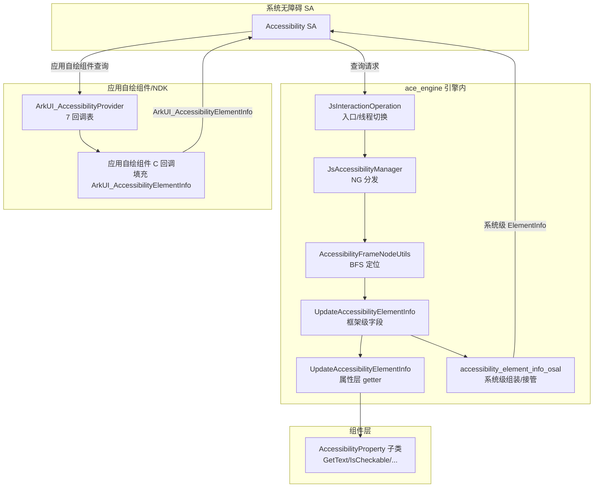
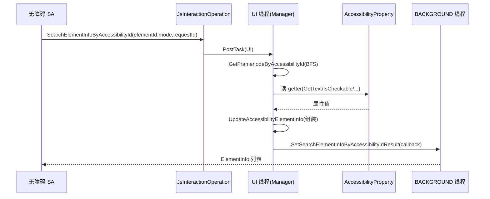

# 架构设计

> 确认目标仓和模块的架构约束、关键设计决策、Spec 拆分方向。

## 设计元数据

| Field | Content |
|-------|---------|
| Design ID | DESIGN-Func-03-07-01 |
| 关联需求 | 已有能力补录（无独立 requirement.md） |
| 关联 Epic | 无 |
| 目标 Feature | Feat-01 无障碍元素信息查询响应、Feat-02 无障碍动作执行、Feat-03 无障碍焦点移动、Feat-04 无障碍悬停探测、Feat-05 无障碍子树注册与跨进程接入、Feat-06 应用自绘组件无障碍接入（NDK Provider）、Feat-07 无障碍事件通知 |
| 复杂度 | 复杂 |
| 目标版本 | API 13 起（NDK Provider 基线），关键增强见 API 版本策略 |
| Owner | ArkUI SIG / 无障碍子系统 |
| 状态 | Baselined（已有实现补录） |

## 需求基线

| 项 | 补充说明 |
|----|----------|
| 能力定位 | 按系统无障碍服务的查询请求提供 ArkUI 组件树信息（属性、状态、位置、动作集），并支持应用自绘组件经 NDK Provider 自行按需提供 |
| 实现即规格 | 本域为**框架内部能力**，当前实现即契约；存疑行为仅以风险/注释记录，不在本设计中提议修改 |
| 数据流方向 | 双向：① OSAL 组装方向（FrameNode → 系统无障碍 ElementInfo）；② NDK Provider 方向（应用自绘组件 → ArkUI_AccessibilityElementInfo） |

## 上下文和现状

### 涉及仓和模块

| 仓库 | 补充架构说明 |
|------|--------------|
| `arkui_ace_engine` | 引擎内自闭环：系统无障碍 SA 在运行时通过 NDK/Operator 回调进入引擎，引擎**不**对 `barrierfree/*` 形成编译期依赖 |

核心模块（ace_engine 内）：

| 层 | 模块/目录 | 职责 |
|----|-----------|------|
| Core 抽象 | `frameworks/core/accessibility/accessibility_provider.h` | 节点查询/动作/焦点的抽象接口 |
| Core 实现 | `frameworks/core/accessibility/native_interface_accessibility_impl.*` | NDK `ArkUI_AccessibilityElementInfo` 引擎实现类 |
| Core Provider | `frameworks/core/accessibility/native_interface_accessibility_provider.*` | NDK Provider 回调注册与分发 |
| Core 工具 | `frameworks/core/accessibility/accessibility_utils.*`、`accessibility_constants.h` | 角色/动作/事件枚举与映射 |
| Core 节点工具 | `frameworks/core/accessibility/node_utils/accessibility_frame_node_utils.*` | FrameNode 定位（BFS 遍历） |
| NG 属性 | `frameworks/core/components_ng/property/accessibility_property.*` | 属性基类与 getter 契约 |
| OSAL | `adapter/ohos/osal/js_accessibility_manager.*` | 查询入口、遍历、ElementInfo 组装 |
| OSAL element_info | `adapter/ohos/osal/accessibility/element_info/accessibility_element_info_osal.cpp` | 系统级 ElementInfo 组装/接管处理 |
| OSAL 应用自绘组件 | `adapter/ohos/osal/js_third_provider_interaction_operation.*` | 应用自绘组件/跨进程查询分发 |
| NDK 头 | `interfaces/native/native_interface_accessibility.h` | C API 契约 |
| Inner API | `interfaces/inner_api/ace_kit/include/ui/accessibility/accessibility_constants.h` | `AccessibilityRoleType`（125 值） |

### 调用链层级分析

| 层 | 模块 | 职责 | 修改类型 |
|----|------|------|----------|
| SA Operator | `JsInteractionOperation`（js_accessibility_manager.cpp:6205+） | 接收系统查询请求，PostTask 到 UI 线程 | 不修改 |
| Manager 分发 | `JsAccessibilityManager::SearchElementInfoByAccessibilityIdNG`（:7040） | NG/旧 DOM 分支、定位节点、生成 commonProperty | 不修改 |
| 节点定位 | `AccessibilityFrameNodeUtils::GetFramenodeByAccessibilityId`（node_utils/...:333） | BFS 层序遍历含 Overlay 与 VirtualNode | 不修改 |
| 属性提取（框架级） | `UpdateAccessibilityElementInfo`（4 参，:2086） | Parent/Children/Tag/Rect/Window/Page 等框架字段 | 不修改 |
| 属性提取（属性层） | `UpdateAccessibilityElementInfo`（2 参，:1561） | 读 `AccessibilityProperty` getter，组装文本/值/状态/动作 | 不修改 |
| 系统级组装/接管 | `accessibility_element_info_osal.cpp:135`（`UpdateUserAccessibilityElementInfo`） | user 覆盖、StateController/ActionController 接管 | 不修改 |
| NDK Provider | `native_interface_accessibility_provider.*` + `ArkUI_AccessibilityProvider` | 应用自绘组件回调分发（WithInstance 优先） | 不修改 |
| 组件属性 | 各 `pattern/<comp>/*_accessibility_property.*` | 组件差异化 override（GetText/IsCheckable/...） | 不修改 |

检查项：
- [x] 调用链每一层都已覆盖（SA Operator → 分发 → 定位 → 双层属性提取 → 系统级组装；NDK 方向：Provider → 应用自绘组件回调）
- [x] 每层职责边界清晰
- [x] 每层修改类型明确（本设计为补录，无修改）

### 适用架构规则

| Rule ID | 适用原因 | 设计结论 | 验证方式 |
|---------|----------|----------|----------|
| OH-ARCH-LAYERING | SA→OSAL→Core→属性层 调用链 | 调用方向自上而下单向；属性层不反向调用 OSAL | 代码评审 |
| OH-ARCH-SUBSYSTEM | 跨子系统（系统无障碍 SA） | 仅运行时回调接入，无编译期跨仓依赖 | 依赖检查 |
| OH-ARCH-IPC-SAF | 跨进程查询（应用自绘组件/扩展组件） | 经 `AccessibilitySessionAdapter` 与 NDK Provider 边界隔离 | 集成测试 |
| OH-ARCH-API-LEVEL | NDK C API（@since 13/15/23/24） | 级别=NDK/Public，错误码见 design 详细设计 | API 评审 |
| OH-ARCH-ERROR-LOG | 多套错误码命名空间并存 | 见「风险和开放问题」R-3 | 单测/hilog |

## 不涉及项承接

| 维度 | 设计结论 |
|------|----------|
| 应用侧无障碍属性（accessibilityText 等） | 属 04-03-09 主题，本域仅消费其写入结果，不定义属性语义 |
| 焦点移动算法 | 属 Feat-03（后续） |
| 悬停探测 | 属 Feat-04（后续） |
| 动作执行 | 属 Feat-02（后续）；本 Feat-01 仅涉及动作集的**提供**，不含执行 |
| 事件上报 | 属 Feat-07（后续） |

## 关键设计决策

| 决策 ID | 问题 | 推荐方案 | 探索过的替代方案 | 取舍理由 | 影响 |
|---------|------|----------|------------------|----------|------|
| ADR-1 | 组件信息如何提供给系统 SA | 引擎在 OSAL 层把 FrameNode 组装为系统级 `OHOS::Accessibility::AccessibilityElementInfo`（非 NDK 类型） | 统一使用 NDK 类型贯穿 | 系统类型字段更全（InspectorKey/LiveRegion 等），且 SA 直接消费系统类型；NDK 类型服务于应用自绘组件 | 两条数据流、两套 ElementInfo 类型并存 |
| ADR-2 | 应用自绘组件如何提供 | NDK Provider 回调表（7 回调），应用自绘组件填充 `ArkUI_AccessibilityElementInfo` | 仅支持 FrameNode 路径 | XComponent/Custom 需自绘无障碍树，无法用 FrameNode 表达 | 引入 NDK Provider 边界与 WithInstance(@since15) 双回调表 |
| ADR-3 | componentType 取值优先级 | customProperty.role > accessibilityRole API > node tag | 仅用 tag | 需支持应用/自定义节点覆盖角色 | 三级回退链（js_accessibility_manager.cpp:1565-1577） |
| ADR-4 | 遍历阶段是否按 accessibilityLevel 过滤 | 否——`CheckFrameNodeByAccessibilityLevel` 为 stub（:943-946），level 影响仅在 HoverTest 与 GetGroupText | 在遍历即过滤 | 当前实现如此（实现即规格）；level 的可见性语义推迟到悬停/聚合判定 | 本 Feat 的「节点查询过滤」实际由 IsActive/IsInternal/IsVisible 驱动，非 level |
| ADR-5 | 查询坐标基准 | 屏幕绝对坐标（含窗口偏移、祖先 transform 累加、scale、rotate 后的轴对齐外包矩形） | 窗口相对坐标 | 读屏需屏幕坐标定位；旋转取 AABB 是既有实现 | 旋转移序时取 min/max（GetFinalRealRect） |
| ADR-6 | 动作集来源 | 自动推导（focusable/clickable/longClickable）+ 组件 `SetSpecificSupportAction` + 用户自定义；按 Enabled 门控 | 仅自动推导 | 需支持组件特异性动作（如 Slider 滚动）与 C API 注入 | disabled 节点动作集为空但可聚焦 |
| ADR-F2-1 | 动作分发顺序 | 布尔/焦点动作（ConvertActionTypeToBoolen）优先，属性动作（ActAccessibilityAction）兜底 | 统一属性路径 | CLICK 需既执行手势又触发属性回调（结果取或） | LONG_CLICK 仅手势，失败才兜底（不对称） |
| ADR-F2-2 | 动作门控例外组 | disabled 例外为无障碍焦点对；IgnoreAllAction 例外为输入焦点对 | 单一例外组 | 两套场景例外组不同，避免混淆 | 预览 UIExtension 与 disabled 行为分离 |
| ADR-F3-1 | 焦点搜索算法 | 先序(forward)/逆先序(backward) 树搜索（非几何方向） | 几何择优 | 树搜索稳定可预测，与读屏语义一致 | 绝对方向仅旧链路支持，新链路 NOT_SUPPORT |
| ADR-F3-2 | 焦点不回绕 | 到根 ROOT_TYPE 即停，回绕由 SA 二次发起 | 引擎内回绕 | 与旧链路相对方向回绕行为不同 | 新链路为标准路径 |
| ADR-F4-1 | 悬停命中几何 | 反变换坐标 + 未变换矩形（GetPaintRectWithoutTransform + GetPointWithRevert） | 变换后 paintRect | 支持 rotate/scale/skew/translate/perspective 下命中 | DISPLAY_NODE 旋转豁免 |
| ADR-F4-2 | 组语义传播 | ancestorGroupFlag 使非 YES 子节点 shouldSearchSelf=false | 无 | 读屏把一组读成一个的核心机制 | 组语义沿子树传播 |
| ADR-F5-1 | 跨进程接入双管道 | SessionAdapter 仅承载悬停转发；查询/动作走 ChildTree/Provider 注册管道 | 统一管道 | 职责清晰，避免转发与分发耦合 | Web 路径完全独立 |
| ADR-F5-2 | 应用自绘组件子树为叶子 | SetChildTreeIdAndWinId/GetParentWindowId 为 no-op，不向上回灌 | 双向回灌 | 应用自绘组件 Provider 自治子树 | 与普通 JsInteractionOperation 子树行为不同 |
| ADR-F6-1 | 事件按帧聚合 | 同帧同节点同类变化合并为一次上报 | 逐次上报 | 最小上报粒度每节点每帧一次，避免重复 IPC | accessibilityEvents_ set 去重 |
| ADR-F6-2 | 支持事件类型=转换表覆盖集合 | 未在 ConvertAceEventType 列出的内部类型丢弃 | 全量上报 | 仅有效类型到达 SA | 内部枚举值≠NDK 枚举值 |

## 设计骨架

### 骨架范围

| 骨架项 | 目标 | 不包含 | 验证方式 |
|--------|------|--------|----------|
| 元素信息查询响应链路 | 文档化 SA→OSAL→属性→组装 与 NDK Provider 两条链路 | 动作执行、焦点移动、悬停、事件上报 | 源码核验 + 现有用例 |
| ElementInfo 字段契约 | 固化系统级与 NDK 两套字段集及来源优先级 | 应用自绘组件业务字段含义 | 单测 |

### 骨架 Spec 拆分

| Task ID | 目标 | 受影响文件 | AC |
|---------|------|------------|----|
| TASK-SKELETON-1 | Feat-01 元素信息查询响应规格 | registry/features.yaml、Feat-01-*-spec.md | 见 Feat-01 |

## 后续 Task 拆分

| Task ID | 目标 | 受影响文件 | 依赖 |
|---------|------|------------|------|
| TASK-1 | Feat-01 无障碍元素信息查询响应（本提交） | `Feat-01-accessibility-element-info-query-spec.md`、registry | — |
| TASK-2 | Feat-02 无障碍动作执行 | `Feat-02-accessibility-action-execution-spec.md` | Feat-01 |
| TASK-3 | Feat-03 无障碍焦点移动 | `Feat-03-accessibility-focus-move-spec.md` | Feat-01 |
| TASK-4 | Feat-04 无障碍悬停探测 | `Feat-04-accessibility-hover-exploration-spec.md` | Feat-01 |
| TASK-5 | Feat-05 无障碍子树注册与跨进程接入 | `Feat-05-accessibility-childtree-cross-process-spec.md` | Feat-01 |
| TASK-6 | Feat-06 应用自绘组件无障碍接入（NDK Provider） | `Feat-06-accessibility-native-provider-spec.md` | Feat-01、Feat-05 |
| TASK-7 | Feat-07 无障碍事件通知 | `Feat-07-accessibility-event-notification-spec.md` | Feat-01 |

## API 签名、Kit 与权限

### 新增 API

> 本设计为已有实现补录，API 均为既有公开/系统接口，列其契约归属。

| API 签名 | 类型 | Kit | d.ts/头位置 | 权限要求 | SysCap |
|----------|------|-----|-----------|----------|--------|
| `OH_ArkUI_AccessibilityProviderRegisterCallback` (@since13) | NDK/Public | ArkUI_NativeModule | `interfaces/native/native_interface_accessibility.h` | 无 | ArkUI |
| `OH_ArkUI_AccessibilityProviderRegisterCallbackWithInstance` (@since15) | NDK/Public | ArkUI_NativeModule | 同上 | 无 | ArkUI |
| `OH_ArkUI_AddAndGetAccessibilityElementInfo` / `OH_ArkUI_CreateAccessibilityElementInfo` (@since13) | NDK/Public | ArkUI_NativeModule | 同上 | 无 | ArkUI |
| `OH_ArkUI_AccessibilityElementInfoSetComponentIdentifier` (@since24) | NDK/Public | ArkUI_NativeModule | 同上 | 无 | ArkUI |
| `OH_ArkUI_NativeModule_GetNativeAccessibilityProvider` (@since23) | NDK/Public | ArkUI_NativeModule | 同上 | 无 | ArkUI |

### 变更/废弃 API

| 原有 API | 变更类型 | 新 API | 迁移说明 |
|----------|----------|--------|----------|
| 无 | — | — | 补录，无变更 |

## 构建系统影响

### BUILD.gn 变更

```text
无（已有实现补录，不涉及构建目标变更）
```

### bundle.json 变更

无新增 component，无依赖关系变更。

## 可选设计扩展

### 架构图



### 数据流/控制流

| 步骤 | 调用方 | 被调用方 | 数据/接口 | 说明 |
|------|--------|----------|-----------|------|
| 1 | SA | `JsInteractionOperation::SearchElementInfoByAccessibilityId` | elementId, mode, requestId | :6205，PostTask 到 UI 线程 |
| 2 | Manager | `SearchElementInfoByAccessibilityIdNG` | rootNode, nodeId | :7040，虚拟节点优先 |
| 3 | Manager | `GetFramenodeByAccessibilityId` | BFS 遍历 | :7069/node_utils:333 |
| 4 | Manager | `UpdateElementInfo`（框架级+属性级） | node, commonProperty | :2086/:1561 |
| 5 | OSAL | `UpdateUserAccessibilityElementInfo` | 接管/user 覆盖 | element_info_osal.cpp:135 |
| 6 | Manager | `SetSearchElementInfoByAccessibilityIdResult` | 回 callback（BACKGROUND） | :10143 |

### 时序设计



### 数据模型设计

系统级 `OHOS::Accessibility::AccessibilityElementInfo`（OSAL 方向，字段更全）与 NDK `ArkUI_AccessibilityElementInfo`（impl.h:30，应用自绘组件方向）字段对照见 Feat-01 规格「接口规格」。关键字段来源：

| 字段类别 | 来源 | 优先级 |
|----------|------|--------|
| 文本/内容 | userTextValue > GetGroupText > GetAccessibilityText > GetText | 高→低 |
| role/componentType | customProperty.role > accessibilityRole > node tag | 高→低 |
| checked/selected/checkable | userChecked > customProperty > IsChecked | 高→低 |
| 索引(min/max/current) | userRange/userCurrent > GetAccessibilityValue/GetCurrentIndex | 高→低 |
| Rect | GetFinalRealRect（祖先 transform 累加）+ window 偏移 + scale/rotate | — |

### 线程与并发模型

| 操作 | 发起线程 | 回调线程 | 跨进程边界 | 线程安全 | 重入约束 |
|------|----------|----------|------------|----------|----------|
| SA 查询 | SA 线程 | UI 线程（PostTask） | 是（SA→引擎） | UI 单线程串行 | 同一 elementId 查询串行 |
| 结果回传 | UI 线程 | BACKGROUND 线程 | 是 | callback 一次性 | — |
| NDK `ArkUI_AccessibilityElementInfoList` | 应用自绘组件回调线程 | 同 | 是 | `std::mutex`（impl.h:573）+ `std::list` 节点稳定 | 回调内可连续 add+填充前一指针 |
| children 排序 | UI 线程 | — | 否 | — | 读屏开启时按 accessibilityZIndex 升序（:1824） |

### 资源所有权矩阵

| 资源 | 创建方 | 持有方 | 销毁触发 | 实际释放 | 异常回收 |
|------|--------|--------|----------|----------|----------|
| `ArkUI_AccessibilityElementInfo*`（堆） | 应用自绘组件/引擎 `OH_ArkUI_CreateAccessibilityElementInfo` | 应用自绘组件 | `OH_ArkUI_DestoryAccessibilityElementInfo` | `delete` | 应用自绘组件负责 |
| `ArkUI_AccessibleAction.description`（`const char*`） | 应用自绘组件 | 引擎 vector（浅拷贝指针） | 回调结束 | 不释放 | 应用自绘组件保证生命周期内指针有效 |

## 详细设计

### 元素信息查询响应

**节点查询过滤规则**（实际生效条件，源自 `GetFrameNodeChildren`/`HoverTestRecursive`）：
- 必须 `IsActive()`（js_accessibility_manager.cpp:999）。
- 必须非 `IsInternal()`（:1006）——引擎内部辅助节点永不返回。
- `tag != "stage"`；`tag == "page"` 时需在 commonProperty.pageNodes 内（:1001）。
- `IsVisible()` 为 true（不可见节点不设置 Rect，:2022）。
- 注：`CheckFrameNodeByAccessibilityLevel` 当前为 stub（:943），**遍历阶段不按 accessibilityLevel 过滤**；level 语义仅在 HoverTest 的 `GetSearchStrategy`（accessibility_property.cpp:891-929）与 `GetGroupTextRecursive` 中生效。

**accessibilityLevel 四值语义**（accessibility_property.h:495-501）：
- `AUTO`：默认，按聚合规则推导。
- `yes`：自身定案返回。
- `no`：自身不参与查询结果，子树正常。
- `no-hide-descendants`：整棵子树不参与查询结果（accessibility_property.cpp:918-921）。
- 非法值归一为 AUTO（cpp:1599-1615）。

**mode 预取语义**（`UpdateCacheInfoNG` :2469-2490）：仅 `PREFETCH_RECURSIVE_CHILDREN(_REDUCED)` 非零才递归子树，否则仅返回节点自身；REDUCED 位为 reduce 模式（应用自绘组件 provider 将 REDUCED 降级为普通 RECURSIVE，js_third_provider_interaction_operation.cpp:335）。

**接管（Takeover）机制**（element_info_osal.cpp）：
- `CheckStateTakeOver`（:80）：StateController(CHECK/CHECK_WITH_EXTRA) 接管时，checked/selected/checkable/componentType/description 改取 controllerNode，并 `RemoveControllerTextFromGroup`（:59）避免重复朗读。
- `CheckActionTakeOver`（:110）：ActionController::CONTROLLER_CLICK 接管时，clickable 与 CLICK 动作改取 controller 的 gestureEventHub。
- checked/selected/checkable 三层优先级：`HasUserCheckedType` > `IsChecked()`；`customProperty` 优先级最高（:50-56）。

**VirtualNode ID 编码**：`VirtualNodeContainerIdManager::EncodeVirtualNodeAccessibilityId(containerId, nodeId)`（js_accessibility_manager.cpp:2351），虚拟节点 ID 体系独立于 FrameNode；pageId==0 时回退 `GetLastPageId`，且 pageId 与 treeId 有编码关系 `UpdateElementInfoPageIdWithTreeId`（:1410）。

**默认可聚焦组件**为 tag 白名单驱动（`TAGS_FOCUSABLE`/`TAGS_SUBTREE_COMPONENT` 等，accessibility_property.cpp:798-1006），非自动推导——新增组件需手动加入集合。

**API 版本策略**（NDK 头）：
- @since13：基线结构体/枚举/setter/`ArkUI_AccessibilityProviderCallbacks`/Create/Destroy。
- @since15：`PREVIOUS/NEXT_HTML_ITEM` 动作、`ArkUI_AccessibilityProviderCallbacksWithInstance`（每回调首参增 `instanceId`）。
- @since23：`ArkUI_NodeHandle` typedef、`OH_ArkUI_NativeModule_GetNativeAccessibilityProvider`（仅 `ARKUI_NODE_CUSTOM`）。
- @since24：`SetComponentIdentifier`（长度 >1024 字节截断）。

### 动作执行（Feat-02）

**分发顺序**：`ExecuteActionNG` 先 `ConvertActionTypeToBoolen`（FOCUS/CLEAR_FOCUS/CLICK/LONG_CLICK/ACCESSIBILITY_FOCUS/CLEAR_ACCESSIBILITY_FOCUS），失败再 `ActAccessibilityAction`（带参/属性动作兜底）。CLICK 在 `ActClick` 内部既执行 `gesture->ActClick()` 又执行属性 `ActActionClick`，结果 `result |=`（js_accessibility_manager.cpp:2604）；LONG_CLICK 仅手势，失败才兜底（不对称）。

**双重门控（例外组不同）**：disabled 拒绝除 ACCESSIBILITY_FOCUS/CLEAR_ACCESSIBILITY_FOCUS 外全部（:8108）；IgnoreAllAction（预览 UIExtension）拒绝除 FOCUS/CLEAR_FOCUS 外全部（:8079）。

**动作参数**：`ActAccessibilityAction` 按 key 解析填 `AccessibilityActionParam`（SET_SELECTION/SET_TEXT/NEXT_TEXT/PREVIOUS_TEXT/SET_CURSOR_POSITION/SCROLL_*/SPAN_CLICK/CUSTOM），经 ACTIONS 分发表（:251-307）调 `ActActionXxx`；缺参默认值（start/end=-1、dir=backward、moveUnit=STEP_CHARACTER、scrollType=SCROLL_DEFAULT、spanId=-1、setText=空）。

**动作期间事件抑制**：非 SET_TEXT 动作把节点 TEXT_CHANGE/COMPONENT_CHANGE 加入 `blockerInAction_` 阻塞集，渲染后 `ResetBlockedEvent` 解除（:7967-7988）；SET_TEXT 显式跳过。

**应用自绘组件动作**：CLICK 转发前 `RemoveKeysForClickAction` 剥离安全组件 hmac/timestamp（js_third_provider_interaction_operation.cpp:170）。

### 焦点移动（Feat-03）

**算法**：先序（FORWARD，自→子→右兄弟）/逆先序（BACKWARD，右→左→根）/最右下钻（FIND_LAST）。默认不回绕——到 ROOT_TYPE 即停（accessibility_focus_strategy.cpp:296）；回绕由 SA 二次发起。

**可滚动祖先**：到可滚动边界返回 FIND_FAIL_IN_SCROLL（target=parent）；GET_*_SCROLL_ANCESTOR 方向经 `ProcessGetScrollAncestor` 返回对应祖先；header/footer 在 scroll 中按 `CanScroll` 跳过。

**FocusRulesCheckNode**：IsChildTreeContainer(childTreeId>0)→FIND_CHILDTREE；IsEmbededTarget→FIND_EMBED_TARGET；不可见/NO_HIDE_DESCENDANTS→子树不搜索（NoNeedSearchChild）；CanAccessibilityFocus=可见∧focusType 匹配∧SA CheckNodeIsReadable。

**虚拟节点**：宿主 HasVirtualNodeTreeRoot 时子节点列表替换为虚拟树根；ID 由 EncodeVirtualNodeAccessibilityId 编码。

**自定义关系**：nextFocus/prevFocus 跳转要求 descendantMode 匹配，带环检测；子节点按 `GetAccessibilityZIndex` 升序决定焦点顺序。

**三路差异**：NG(FrameNodeRulesCheckNode，支持虚拟节点/zIndex/跨树回退)、旧 DOM(AccessibilityNodeRulesCheckNode，ChangeToRoot 返回 nullptr 不支持跨树)、应用自绘组件(ThirdRulesCheckNode，IsInChildTree 恒 true)。

### 悬停探测（Feat-04）

**命中链路**：Touch/Mouse/坐标事件→`HandleAccessibilityHoverEventInner`→`HoverTest`→`HoverTestRecursive` 自顶向下命中构建 path。过滤：!IsActive/!IsInternal(虚拟豁免)/!IsVisible return false；hasClip 且未命中自身→子树裁掉。

**搜索策略**：ResolveStrategyByLevel 四态（YES 搜自身定案/NO_HIDE 不搜自身不搜子/NO 不搜自身/AUTO 有文本搜自身），YES/NO_HIDE/有文本 AUTO 跳过 NodeState；UpdateStrategyByNodeState（disabled→children=false、HitTestMode BLOCK→children=false/NONE→self=false、virtualNode→children=true）。ancestorGroupFlag 使非 YES 子节点 self=false 并传播组语义。

**命中几何**：`GetPaintRectWithoutTransform` + `GetPointWithRevert`（rotate/scale/skew/translate/perspective 逆矩阵）；DISPLAY_NODE 且 degree≠0 返回单位矩阵（旋转豁免）。

**状态机**：HoverStateManager 按 accessibilityId 隔离；last≠current 发 EXIT/ENTER；CANCEL 跳过命中发 transparent exit 并 Reset。节流 THROTTLE_INTERVAL_HOVER_EVENT=10ms（直接处理转换 MOVE→EXIT/ENTER→EXIT 不受节流）；源切换 MIN_SOURCE_CHANGE_GAP_MS=1000ms；多指 Touch Reset。

**转发**：优先 NotifyHoverEventToVirtualNode（virtualRoot），其次 NotifyHoverEventToNodeSession（SessionAdapter.TransferHoverEvent），标记 transformHover。应用自绘组件悬停 HandleAccessibilityHoverForThird（BACKGROUND）基于 ElementInfo RectInScreen 命中。

**调试**：`hidumper --hover-test x y` 经 HoverTestDebug 输出命中链与每节点搜索明细。

### 子树注册与跨进程接入（Feat-05）

**双管道**：SessionAdapter（6 类：Form/UIExtension/Isolated/XComponent/Web/Custom）仅承载悬停转发（IgnoreHostNode 全 true；UIExtension/Isolated 系 IgnoreTransformMouseEvent=true）；查询/动作走 ChildTree/Provider 注册管道。

**ChildTree 注册**：组件 attach 注册 AccessibilityChildTreeCallback 到 childTreeCallbackMap_；父注册成功广播 NotifyChildTreeOnRegister；SetChildTreeIdAndWinId 分发；节点上报 SetChildTreeIdAndWinId/SetBelongTreeId；NeedRegisterChildTree 按 parent 三元组去重。

**Web 独立路径**：Web 不走 Provider 体系，独立 RegisterWebInteractionOperationAsChildTree + UpdateWebAccessibilityElementInfo。

### 应用自绘组件 NDK Provider 接入（Feat-06）

**应用自绘组件 Provider 注册（XComponent/Custom）**：ChildTreeCallback.OnRegister→创建 Provider+SessionAdapter→RegisterInteractionOperationAsChildTree(JS_THIRD_PROVIDER)→RegisterThirdProviderInteractionOperationAsChildTree 构造 JsThirdProviderInteractionOperation 注册 SA；注册与 callback 挂载双向补偿。

**NDK Provider（仅 Custom）**：`OH_ArkUI_NativeModule_GetNativeAccessibilityProvider` 仅 ARKUI_NODE_CUSTOM（@since23）；XComponent 有 NodeHandle V2 与 Legacy 双路径。

**自绘组件路径限制**：REDUCED 强制降级为全量递归；坐标默认叠加 host 变换（DrawBound/FOCUS_NODE_UPDATE 跳过）；SetChildTreeIdAndWinId/GetParentWindowId 为 no-op（叶子，不向上回灌）。

### 事件通知（Feat-07）

**上报链路**：属性 Setter→NotifyComponentChangeEvent→AddAccessibilityCallbackEvent 按帧入队→帧刷新 FireAccessibilityEvents→SendAccessibilityAsyncEvent→Inner→SendAccessibilitySyncEvent（BACKGROUND）client->SendEvent IPC。

**TEXT_CHANGE vs ELEMENT_INFO_CHANGE**：SetText/Description→TEXT_CHANGE；SetGroup/NextFocusInspectorKey/CustomActions/SetLevel(变化)→ELEMENT_INFO_CHANGE；Setter 内自身比对未变化不发；CustomAccessibilityProperty 的 Set 不发事件（Custom 侧自行上报）。

**按帧聚合**：accessibilityEvents_(set<pair<eventId,nodeId>>) emplace 去重——每节点每帧同类事件合并为一次上报。

**事件类型转换**：ConvertAceEventType 映射内部→系统 EventType；未列出类型→TYPE_VIEW_INVALID 丢弃（支持事件类型=转换表覆盖集合）；内部枚举值≠NDK 枚举值。

**多重门控**：总开关 IsAccessibilityEnabled；读屏关闭窄门控（仅丢 ELEMENT_INFO_CHANGE/COMPONENT_CHANGE/TEXT_CHANGE/FOCUS/SCROLLING_EVENT）；level=no/!IsActive 不发；CLICK+checked/selected 延时 AfterRender；动作期间 blockerInAction_ 阻塞；白名单 eventWhiteList_；SA 侧 IsRegister/IsEnabled。

**主动播报/请求焦点**：ANNOUNCE_FOR_ACCESSIBILITY（NOT_INTERRUPT 不打断）；焦点节点 detach 缓存候选经 ON_SEND_DETACH_FOCUS_FALLBACK 发 REQUEST_FOCUS_FOR_ACCESSIBILITY_NOT_INTERRUPT 或 FOCUS_INVISIBLE 回退。

**NDK 事件**：OH_ArkUI_SendAccessibilityAsyncEvent→provider→ThirdAccessibilityManager→JsThirdProviderInteractionOperation 转 OHOS EventInfo BACKGROUND SendEvent；EventInfo 经 SetEventType/SetText/SetRequestFocusId/SetElementInfo 填充；完成回调一次错误码。

## 风险和开放问题

| 项 | 类型 | 影响 | 处理方式 | Owner |
|----|------|------|----------|-------|
| 两套 ElementInfo 类型并存（系统级 vs NDK），字段集与 setter 命名均不同 | 架构 | 中 | 本设计显式区分两条链路；规格字段表分别列出 | 无障碍 SIG |
| `elementId`(int32) 与 `parentId`(int64) 位宽不对称；`SetElementId(int64)` 形参与字段(int32) 截断；C API `SetParentId` 形参为 int32 | API | 中 | 标注为 ABI 风险，规格明确取值范围；不修改（实现即规格） | 无障碍 SIG |
| `opacity` 默认 0.0f（impl.h:460），NDK 应用自绘组件不设置即为 0；OSAL 方向默认 1 | API | 低 | 规格明确 NDK 方向 opacity 默认语义 | 无障碍 SIG |
| 错误码命名空间混用：`ARKUI_ACCESSIBILITY_NATIVE_RESULT_*`、`ARKUI_ERROR_CODE_*`、Provider 内部 `NOT_REGISTERED=-10001`/`COPY_FAILED=-10002` | API | 中 | 规格按接口列出错误码集合 | 无障碍 SIG |
| 枚举名 `ArkUI_AcessbilityErrorCode` 缺 `s`（拼写） | API | 低 | 规格引用保持原拼写（既有公开 API） | 无障碍 SIG |
| 两套 Provider 回调校验策略不一致（@since13 不短路全检 / @since15 短路） | API | 低 | 规格明确「注册即要求 7 回调全非空」 | 无障碍 SIG |
| `ArkUI_AccessibleAction.description` 为浅拷贝指针，所有权归应用自绘组件 | API | 中 | 规格/资源所有权矩阵明确所有权契约 | 无障碍 SIG |
| `accessibilityAceRoleMap` 部分值硬编码字符串而非 V2 tag，且该表未被 NG 主查询链路调用 | 架构 | 低 | 标注为历史遗留，规格以 `node tag/accessibilityRole` 为 componentType 实际来源 | 无障碍 SIG |
| OSAL 组装方向不经过 NDK ElementInfo | 架构 | 低 | 已在架构图/数据流区分 | 无障碍 SIG |
| 动作门控双重且例外组不同（disabled=无障碍焦点对；IgnoreAllAction=输入焦点对） | API | 中 | 规格分别明确两组例外；不改实现 | 无障碍 SIG |
| CLICK 双执行（手势+属性回调结果取或），LONG_CLICK 仅手势兜底不对称 | API | 中 | 规格标注现状（实现即规格） | 无障碍 SIG |
| 动作参数 key 字面值定义在仓外 OHOS 无障碍 SDK 头文件，本仓仅引用 | API | 低 | 规格引用时以仓外 SDK 为准 | 无障碍 SIG |
| 新焦点链路默认不回绕，旧链路相对方向会回绕；绝对方向仅旧链路支持 | API | 中 | 规格声明 NG 为标准路径，旧 DOM 仅兼容 | 无障碍 SIG |
| FocusMoveDirection/FocusMoveResult/DetailCondition 等枚举定义在仓外 SDK | API | 低 | 仓内仅引用，跨仓确认 | 无障碍 SIG |
| 悬停命中 DISPLAY_NODE 旋转豁免（返回单位矩阵），与其他节点 rotate 参与命中不一致 | API | 低 | 规格标注豁免语义 | 无障碍 SIG |
| 读屏规则开启时实际 enter 节点可能与几何命中节点不同（NeedChangeToReadableNode） | 行为 | 中 | 规格/调试入口声明改写语义 | 无障碍 SIG |
| SessionAdapter 仅承载悬停转发，查询/动作走独立 ChildTree/Provider 管道 | 架构 | 中 | 架构图/数据流区分双管道 | 无障碍 SIG |
| Web 接入路径完全独立（不走 Provider 体系），与 XComponent/Custom 模板不同 | 架构 | 中 | 规格独立描述 Web，不套用应用自绘组件模板 | 无障碍 SIG |
| 应用自绘组件子树为"叶子"（SetChildTreeIdAndWinId/GetParentWindowId no-op） | 行为 | 低 | 规格声明不向上回灌 | 无障碍 SIG |
| 内部事件枚举值≠NDK 枚举值（如 REQUEST_FOCUS 0x800000 vs NDK 0x2000000） | API | 中 | 跨边界映射显式声明 | 无障碍 SIG |
| 支持事件类型=转换表覆盖集合，未列出内部类型（BLUR/MOUSE/KEYBOARD/TOUCH 等）丢弃 | 行为 | 中 | 规格以转换表为支持清单 | 无障碍 SIG |
| 应用层 announceForAccessibility/请求焦点 JS API 在 ace 仓内无实现，属仓外 SDK | API | 低 | 语义以 interface_sdk-js common.d.ts 为准 | 无障碍 SIG |

## 设计审批

- [x] 需求基线已确认，设计覆盖 P0/P1 AC
- [x] 不涉及项已承接，N/A 和展开项都有结论
- [x] 涉及仓和模块职责清楚
- [x] 调用链层级分析完整，每层覆盖到位
- [x] 适用架构规则已识别并形成设计结论
- [x] 分层和子系统边界合规
- [x] API 变更有签名、权限、错误码和兼容性说明
- [x] BUILD.gn/bundle.json 影响明确
- [x] 设计输出和后续 Task 拆分明确
- [x] 关键设计决策有理由和影响说明
- [x] 风险和开放问题有 Owner

**结论:** 通过（已有实现补录）
