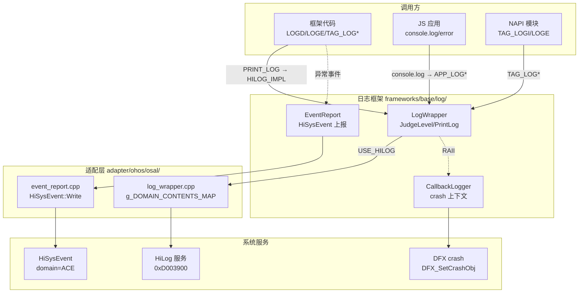

# 架构设计
> 确认目标仓和模块的架构约束、关键设计决策、Spec 拆分方向。

## 设计元数据

| Field | Content |
|-------|---------|
| Design ID | DESIGN-Func-03-08-01 |
| 关联需求 | 已有能力补录（无独立 requirement.md） |
| 关联 Epic | 无 |
| 目标 Feature | Feat-01 LogWrapper核心框架与HiLog适配; Feat-02 日志控制开关与前端日志桥接; Feat-03 HiSysEvent事件上报与异常诊断 |
| 复杂度 | 标准 |
| 目标版本 | API 9+（已有实现） |
| Owner | ArkUI SIG |
| 状态 | Baselined（已有实现补录） |

## 需求基线

| 项 | 补充说明 |
|----|----------|
| 日志输出后端 | 统一使用 OpenHarmony HiLog 服务，不直接使用 printf/std::cout |
| 日志分区体系 | 框架日志使用 ACE_DOMAIN (0xD003900) + 100+ 子标签；JS 应用日志使用 APP_DOMAIN (0xC0D0) |
| 异常事件上报 | 使用 HiSysEvent 上报组件异常、页面路由异常、渲染异常等 |

## 上下文和现状

### 涉及仓和模块

| 仓库 | 补充架构说明 |
|------|-------------|
| ace_engine/frameworks/base/log/ | 核心日志框架：LogWrapper、EventReport、AceTrace 等 |
| ace_engine/adapter/ohos/osal/ | OHOS 平台适配：HiLog 后端、g_DOMAIN_CONTENTS_MAP、CallbackLogger 实现 |
| ace_engine/frameworks/bridge/declarative_frontend/ | JS console.* 桥接（JSI + NAPI 双路径） |
| ace_engine/frameworks/bridge/js_frontend/ | JsLogPrint 标签化日志、APP_LOG* 输出 |
| ace_engine/adapter/ohos/services/uiservice/ | UIService 专用 HiLog 封装 |
| ace_engine/adapter/ohos/entrance/ui_session/ | UISession 专用 HiLog 封装 |
| ace_engine/interfaces/inner_api/form_render/ | FormRenderer 专用 HiLog 封装 |

### 调用链层级分析

| 层 | 模块 | 职责 | 修改类型 |
|----|------|------|----------|
| 宏定义层 | `LOGD/LOGI/LOGW/LOGE/LOGF`/`TAG_LOG*`/`APP_LOG*` (log_wrapper.h:80-118) | 编译期展开为 PRINT_LOG 调用，STRIP_RELEASE_LOG 可裁剪 | 已有实现 |
| 日志包装层 | `LogWrapper::PrintLog/JudgeLevel/GetBriefFileName` (log_wrapper.h:273-298) | 跨平台接口、级别判断、文件名简化 | 已有实现 |
| HiLog 宏层 | `PRINT_LOG` → `HILOG_IMPL` (log_wrapper.h) | 当 USE_HILOG 定义时直接调用 HiLog 宏 | 已有实现 |
| 适配后端层 | `adapter/ohos/osal/log_wrapper.cpp` | g_DOMAIN_CONTENTS_MAP 标签映射、CallbackLogger crash 上下文 | 已有实现 |
| 平台服务层 | HiLog 服务 (系统级) | 实际日志写入和持久化 | 外部依赖 |
| JS 桥接层 | `jsi_declarative_engine.cpp:294-298,1052-1061` | console.log/debug/info/warn/error → APP_LOG* | 已有实现 |
| 事件上报层 | `EventReport` (event_report.h:229-303) | HiSysEvent 异常/统计事件上报 | 已有实现 |
| 异常处理层 | `ExceptionHandler` (exception_handler.h) | JS 异常 → EventReport 桥接 | 已有实现 |

### 适用架构规则

| Rule ID | 适用原因 | 设计结论 | 验证方式 |
|---------|----------|----------|----------|
| OH-ARCH-LAYERING | 宏→包装→适配→平台 四层调用链 | 调用方向严格自上而下，不允许反向调用 | 代码评审 |
| OH-ARCH-ERROR-LOG | 框架内所有日志输出使用统一 LogWrapper | 禁止直接调用 printf 或 std::cout | 代码评审/grep 检查 |
| OH-ARCH-COMPONENT-BUILD | USE_HILOG 编译开关控制 HiLog 后端 | OHOS 构建强制启用，Preview 构建关闭 | 构建验证 |

## 不涉及项承接

| 维度 | 设计结论 |
|------|----------|
| IPC/SA | 日志输出为本地 HiLog API 调用，不涉及跨进程 |
| 持久化存储 | 日志持久化由 HiLog 服务负责，ArkUI 不参与 |
| 权限控制 | 日志输出不需要额外权限声明 |

## 关键设计决策

| 决策 ID | 问题 | 推荐方案 | 探索过的替代方案 | 取舍理由 | 影响 |
|---------|------|----------|-----------------|----------|------|
| ADR-1 | 日志后端选择 | 统一使用 HiLog 服务，ACE_DOMAIN=0xD003900 | 直接 printf、Android-style logcat、自定义文件日志 | 与 OpenHarmony DFX 体系统一，支持系统级日志收集和过滤 | 框架日志全部经过 HiLog 宏 |
| ADR-2 | 日志分区方式 | AceLogTag 枚举 100+ 子标签，每个标签映射为 ACE_DOMAIN+tag 的 HiLog 子域 | 单一域、按文件路径分区 | 支持按组件精确过滤（如 hilog -D AceText），调试效率高 | log_wrapper.h:149-256 枚举维护 |
| ADR-3 | 框架日志 vs 应用日志域分离 | FRAMEWORK 使用 ACE_DOMAIN(0xD003900)，JS_APP 使用 APP_DOMAIN(0xC0D0) + LOG_APP 类型 | 统一使用 ACE_DOMAIN | 应用日志需要独立过滤，避免框架日志干扰 | APP_LOG* 宏使用独立域 |
| ADR-4 | Release 版本日志裁剪策略 | STRIP_RELEASE_LOG 编译宏裁剪 LOGD/LOGI/LOGW（及 TAG_LOG*/APP_LOG* 对应级别），保留 LOGE/LOGF | 运行时级别控制 | Release 包体减小，同时保留错误日志用于线上诊断 | ace_config.gni:211-240 |
| ADR-5 | Crash 上下文捕获 | CallbackLogger 通过 DFX_SetCrashObj (dlsym) 注册 crash 前最后执行的回调信息 | 不捕获 crash 上下文 | 提供崩溃前的关键上下文，大幅提升崩溃分析效率 | log_wrapper.h:300-311 |
| ADR-F2-1 | DEBUG 级别运行时控制 | JudgeLevel 对 DEBUG 级额外检查 SystemProperties::GetDebugEnabled()，其余级别仅检查 level_<=level | 统一使用 level_ 控制 | DEBUG 日志含敏感信息，需要独立运行时开关 | log_wrapper.cpp:25-31 |
| ADR-F2-2 | JS console.* 实现路径 | JSI 模式注册全局 console 对象；NAPI 模式注册 napi 函数。两者最终调用 APP_LOG* | 仅 JSI 或仅 NAPI | 兼容两种引擎模式（JSI 动态版 / NAPI 静态版） | jsi_declarative_engine.cpp:294-298,1052-1061 |
| ADR-F2-3 | 标签化 JS 日志 | JsLogPrint 接受数字 tag 参数 (0=ACE_STATE_MGMT, 1=ACE_ARK_COMPONENT)，映射到 TAG_LOG* | 所有 JS 日志使用同一标签 | 状态管理和组件日志可独立过滤 | jsi_base_utils.cpp:769-800 |
| ADR-F3-1 | 异常事件上报通道 | EventReport 统一封装 HiSysEvent::Write，domain=ACE | 各模块直接调用 HiSysEvent | 统一上报格式，便于 DFX 平台聚合分析 | event_report.h:229-303 |
| ADR-F3-2 | 异常分类体系 | 按功能域分类 (AppStart/PageRouter/Component/APIChannel/Render/JS/Animation/Event/I18n/A11y/Form)，每类独立枚举 | 单一异常类型枚举 | 不同类型异常有不同的上报字段需求 | event_report.h:30-170 |

## 设计骨架

### 骨架范围

| 骨架项 | 目标 | 不包含 | 验证方式 |
|--------|------|--------|----------|
| LogWrapper 框架 | 跨平台日志接口 + OHOS HiLog 适配 | Preview 适配 | 编译验证 + 日志输出验证 |
| 日志控制 | 编译期/运行时级别控制 | 远程日志配置 | 编译变体验证 |
| 前端桥接 | JS console.* → APP_LOG* | console.trace/profile | 运行时验证 |
| 事件上报 | EventReport → HiSysEvent | DFX 平台处理 | 事件输出验证 |

### 骨架 Spec 拆分

| Task ID | 目标 | 受影响文件 | AC |
|---------|------|-----------|-----|
| TASK-SKELETON-1 | LogWrapper 核心 + HiLog 适配 | log_wrapper.h/.cpp, adapter/ohos/osal/log_wrapper.cpp | Feat-01 AC |
| TASK-SKELETON-2 | 日志控制 + 前端桥接 | ace_config.gni, jsi_declarative_engine.cpp, jsi_base_utils.cpp | Feat-02 AC |
| TASK-SKELETON-3 | HiSysEvent 事件上报 | event_report.h, exception_handler.h, adapter/ohos/osal/event_report.cpp | Feat-03 AC |

## 后续 Task 拆分

| Task ID | 目标 | 受影响文件 | 依赖 |
|---------|------|-----------|------|
| TASK-01 | LogWrapper核心框架与HiLog适配 | frameworks/base/log/log_wrapper.h/.cpp, adapter/ohos/osal/log_wrapper.cpp | 无 |
| TASK-02 | 日志控制开关与前端日志桥接 | ace_config.gni, jsi_declarative_engine.cpp, jsi_base_utils.cpp, 专用 HiLog 封装器 | TASK-01 |
| TASK-03 | HiSysEvent事件上报与异常诊断 | event_report.h, exception_handler.h | TASK-01 |

## API 签名、Kit 与权限

### 新增 API

> 本域为框架内部能力，无新增 Public/System API。所有接口为内部 C++ 接口。

### 变更/废弃 API

无。

## 构建系统影响

### BUILD.gn 变更

```text
文件: frameworks/base/log/BUILD.gn
变更说明: 定义 log_wrapper、ace_trace、event_report 等静态库目标，供框架各模块依赖
```

```text
文件: frameworks/base/BUILD.gn (ace_config.gni:211-240)
变更说明: use_hilog (默认 true)、STRIP_RELEASE_LOG、IS_RELEASE_VERSION、ACE_INSTANCE_LOG、ACE_DEBUG 编译开关定义
```

### bundle.json 变更

无新增 component 依赖。

## 可选设计扩展

### 架构图



#### Logging Data Flow (Feat-01)

| 步骤 | 调用方 | 被调用方 | 数据/接口 | 说明 |
|------|--------|----------|-----------|------|
| 1 | 业务代码 | LOGD/LOGE 宏 | fmt, args | 宏展开为 PRINT_LOG |
| 2 | PRINT_LOG 宏 | LogWrapper::JudgeLevel | LogLevel | DEBUG 额外检查 GetDebugEnabled |
| 3 | PRINT_LOG 宏 | HILOG_IMPL | domain, tag, level, fmt | 直接调用 HiLog 宏 |
| 4 | HILOG_IMPL | HiLog 服务 | 结构化日志 | 写入内核 buffer |

### 线程与并发模型

| 操作 | 发起线程 | 回调线程 | 线程安全 | 重入约束 |
|------|----------|----------|----------|----------|
| LOG* 宏调用 | 任意线程 | 同线程 | 安全（HiLog 内部加锁） | 可重入 |
| SetLogLevel | 任意线程 | 同线程 | LogWrapper::level_ 非原子，理论上有数据竞争（当前实现） | 不建议多线程并发调用 |
| CallbackLogger 构造/析构 | UI 线程为主 | 同线程 | dlsym 获取的 DFX_SetCrashObj 内部加锁 | 可重入 |
| EventReport 静态方法 | 任意线程 | 同线程 | HiSysEvent::Write 内部加锁 | 可重入 |

## 详细设计

### LogWrapper 核心框架 (Feat-01)

**AceLogTag 枚举体系** (`log_wrapper.h:149-256`):
- 100+ 组件标签，每个标签 = HiLog 子域号（ACE_DOMAIN + tag 值）
- 映射公式: `tag + ACE_DOMAIN` → 十六进制域 ID（如 ACE_TEXT=19 → C03913）
- g_DOMAIN_CONTENTS_MAP (`adapter/ohos/osal/log_wrapper.cpp:42-145`) 定义 tag→string 映射
- 保留 FORM_RENDER=255 → C039FF 为最后一个子域

**LogWrapper 类** (`log_wrapper.h:273-298`):
- `JudgeLevel(level)`: DEBUG 级别受 `GetDebugEnabled()` 控制；其余级别受 `level_ <= level` 控制
- `GetBriefFileName(name)`: 将完整路径截取为 `filename.ext` 格式
- `PrintLog(...)`: 非 HiLog 后端的 fallback 输出（va_list 变体）
- `level_`: 静态成员，默认 `LogLevel::DEBUG`，通过 SetLogLevel 运行时修改

**宏展开链**:
```
LOGD(fmt, ...) → TAG_LOGD(ACE_DEFAULT_DOMAIN, fmt, ...) 
  → [STRIP_RELEASE_LOG 定义时空操作]
  → PRINT_LOG(LogDomain::FRAMEWORK, LogLevel::DEBUG, ACE_DEFAULT_DOMAIN, fmt, ...)
    → [USE_HILOG 定义时] HILOG_IMPL(LOG_APP/LOG_CORE, level, domain, tag, fmt)

APP_LOGD(fmt, ...) → PRINT_LOG(LogDomain::JS_APP, LogLevel::DEBUG, fmt, ...)
  → [USE_HILOG 定义时] HILOG_IMPL(LOG_APP, level, APP_DOMAIN, "AceApp", fmt)
```

**CallbackLogger** (`log_wrapper.h:300-311`, `adapter/ohos/osal/log_wrapper.cpp:217-228`):
- 构造时通过 `dlsym("DFX_SetCrashObj")` 注册 crash 上下文消息
- 析构时调用 `dlsym("DFXResetCrashObj")` 清除
- 由 `LOG_CALLBACK(callback)` 宏触发

### 日志控制与前端桥接 (Feat-02)

**编译期开关** (`ace_config.gni:211-240`):

| 开关 | 条件 | 效果 |
|------|------|------|
| USE_HILOG | `use_hilog` (OHOS 默认 true) | 启用 HILOG_IMPL 直调 |
| IS_RELEASE_VERSION | `build_variant == "user"` | 裁剪文件名:行号前缀 |
| STRIP_RELEASE_LOG | 外部设置 | LOGD/LOGI/LOGW → no-op |
| ACE_INSTANCE_LOG | `enable_ace_instance_log` | 每条日志附加容器实例 ID |
| ACE_DEBUG | `enable_ace_debug` | 启用 ACE_DEBUG_SCOPED_TRACE |

**运行时控制** (`log_wrapper.cpp:25-31`):
- `JudgeLevel` 逻辑: `if (level == DEBUG) return GetDebugEnabled(); else return level_ <= level;`
- `SetLogLevel` / `GetLogLevel`: 运行时程序化级别控制

**JS console.* 桥接**:
- JSI 模式 (`jsi_declarative_engine.cpp:294-298`): 全局对象注册 console.log/debug/info/warn/error → JsiBaseUtils::App{Info,Debug,Warn,Error}LogPrint
- NAPI 模式 (`jsi_declarative_engine.cpp:1052-1061`): 同上，注册为 napi 函数
- 最终调用 `APP_LOG*` 宏 (APP_DOMAIN=0xC0D0, LOG_APP 类型)

**JsLogPrint 标签化日志** (`jsi_base_utils.cpp:769-800`):
- 接受数字 tag: 0=ACE_STATE_MGMT, 1=ACE_ARK_COMPONENT
- 使用 TAG_LOG* 宏（走 ACE_DOMAIN）
- GetLogTag (`:695-713`): 从 JS 参数解析 tag

**专用 HiLog 封装器**:

| 文件 | 域 | 标签 |
|------|-----|------|
| adapter/ohos/services/uiservice/include/ui_service_hilog.h | 0xD003935 | AceUIService |
| adapter/ohos/entrance/ui_session/include/ui_session_log.h | 0xD003936 | AceUISession |
| interfaces/inner_api/form_render/include/form_renderer_hilog.h | 0xD0039FF | FormRenderer |
| interfaces/inner_api/xcomponent_controller/xcomponent_controller_log.h | 0xD003931 | XComponentController |

### HiSysEvent 事件上报 (Feat-03)

**EventReport** (`event_report.h:229-303`):
- 全部为静态方法，直接调用 HiSysEvent::Write
- domain = "ACE"

**异常分类枚举** (`event_report.h:30-170`):
- AppStartExcepType: APP_START
- PageRouterExcepType: PAGE_ROUTER
- ComponentExcepType / ComponentExcepTypeNG: COMPONENT
- APIChannelExcepType: API_CHANNEL
- RenderExcepType: RENDER
- JsExcepType: JS
- AnimationExcepType: ANIMATION
- EventExcepType: EVENT
- InternalExcepType, AccessibilityExcepType, FormExcepType, VsyncExcepType, ScrollableErrorType, RichEditorErrorType, GeneralInteractionErrorType

**关键上报方法**:
- SendAppStartException / SendPageRouterException / SendComponentException[NG]
- JankFrameReport: 从 JankFrameReport 收集 jank 数据并上报
- JsEventReport / JsErrReport: JS 异常事件
- ANRRawReport / ANRShowDialog: ANR 检测与对话框
- ReportPageNodeOverflow / ReportPageDepthOverflow / ReportFunctionTimeout: 性能阈值违规
- ReportDragInfo / ReportScrollableErrorEvent / ReportGeneralInteractionError

**ExceptionHandler** (`exception_handler.h`):
- `HandleJsException(exceptionMsg, errorInfo)`: 桥接 JS 异常到 EventReport

## 风险和开放问题

| 项 | 类型 | 影响 | 处理方式 | Owner |
|----|------|------|----------|-------|
| SetLogLevel 非原子操作 | 架构 | 低 | 当前为单线程设置，理论上有多线程数据竞争风险。标注为已知限制 | ArkUI SIG |
| AceLogTag 枚举无版本管理 | API | 低 | 新增标签需手动维护枚举和 g_DOMAIN_CONTENTS_MAP，遗漏会导致 tag 显示为数字 | ArkUI SIG |
| 专用 HiLog 封装器绕过 LogWrapper | 架构 | 低 | UIService/UISession/FormRenderer 等直接使用 HILOG_IMPL，未走统一路径，级别控制不生效 | ArkUI SIG |
| STRIP_RELEASE_LOG 仅编译期生效 | 维测 | 中 | Release 包无法动态开启 DEBUG 日志，排查问题需依赖 GetDebugEnabled 运行时开关（仅影响 DEBUG 级别） | ArkUI SIG |

## 设计审批

- [x] 需求基线已确认，设计覆盖 P0/P1 AC
- [x] 不涉及项已承接，N/A 和展开项都有结论
- [x] 涉及仓和模块职责清楚
- [x] 调用链层级分析完整，每层覆盖到位
- [x] 适用架构规则已识别并形成设计结论
- [x] 分层和子系统边界合规
- [x] API 变更有签名、权限、错误码和兼容性说明
- [x] BUILD.gn/bundle.json 影响明确
- [x] 设计输出和后续 Task 拆分明确
- [x] 关键设计决策有理由和影响说明
- [x] 风险和开放问题有 Owner

**结论:** 通过（已有实现补录）
