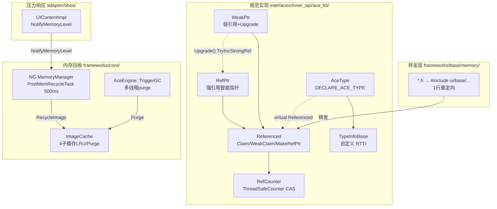
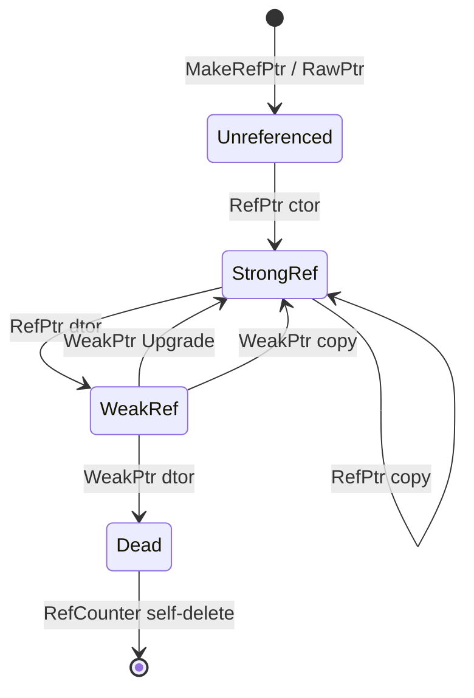

# 架构设计
> 确认目标仓和模块的架构约束、关键设计决策、Spec 拆分方向。

## 设计元数据

| Field | Content |
|-------|---------|
| Design ID | DESIGN-Func-03-08-02 |
| 关联需求 | 已有能力补录（无独立 requirement.md） |
| 关联 Epic | 无 |
| 目标 Feature | Feat-01 RefPtr/WeakPtr/AceType引用计数智能指针; Feat-02 MemoryMonitor调试分配监控; Feat-03 NG MemoryManager内存回收管线; Feat-04 系统内存压力监听与全局GC |
| 复杂度 | 复杂 |
| 目标版本 | API 9+（已有实现） |
| Owner | ArkUI SIG |
| 状态 | Baselined（已有实现补录） |

## 需求基线

| 项 | 补充说明 |
|----|----------|
| 智能指针体系 | 基于 Referenced 基类的侵入式引用计数，提供 RefPtr/WeakPtr 线程安全智能指针 |
| 内存回收 | 后台不可见页面图片数据回收 + 系统内存压力响应 + 全局 GC 协调 |
| 内存监控 | Debug 版本按类型聚合分配/释放统计 |
| ImageCache | 对象级 + 数据级 + PixelMap 级三层缓存，支持容量限制和 Purge |

## 上下文和现状

### 涉及仓和模块

| 仓库 | 补充架构说明 |
|------|-------------|
| ace_engine/interfaces/inner_api/ace_kit/include/ui/base/ | 智能指针规范实现：Referenced、RefPtr、WeakPtr、RefCounter、AceType、TypeInfoBase |
| ace_engine/frameworks/base/memory/ | 转发层（1 行 #include 重定向到 ace_kit） |
| ace_engine/frameworks/core/components_ng/manager/memory/ | NG MemoryManager：页面级图片回收管线 |
| ace_engine/frameworks/core/pipeline_ng/ | PipelineContext：持有 MemoryManager，处理 NotifyMemoryLevel |
| ace_engine/frameworks/core/image/ | ImageCache、ImageFileCache、SharedImageManager |
| ace_engine/frameworks/core/common/ | AceEngine：全局 GC 协调入口 |
| ace_engine/frameworks/base/thread/ | BackgroundTaskExecutor：多线程 GC purge 协调 |
| ace_engine/adapter/ohos/entrance/ | UIContentImpl::NotifyMemoryLevel、AceContainer::TriggerGarbageCollection |

### 调用链层级分析

| 层 | 模块 | 职责 | 修改类型 |
|----|------|------|----------|
| 规范实现层 | `interfaces/inner_api/ace_kit/include/ui/base/referenced.h` | RefPtr/WeakPtr/Referenced 完整实现 | 已有实现 |
| 规范实现层 | `interfaces/inner_api/ace_kit/include/ui/base/ref_counter.h` | 原子引用计数 (ThreadSafeCounter CAS) | 已有实现 |
| 规范实现层 | `interfaces/inner_api/ace_kit/include/ui/base/ace_type.h` | AceType 基类 + DECLARE_ACE_TYPE + DynamicCast | 已有实现 |
| 规范实现层 | `interfaces/inner_api/ace_kit/include/ui/base/type_info_base.h` | 自定义 RTTI (SafeCastById) | 已有实现 |
| 转发层 | `frameworks/base/memory/*.h` | #include 重定向到 ui/base/ | 已有实现 |
| 调试监控层 | `frameworks/base/memory/memory_monitor.cpp` | Debug-only 类型聚合分配跟踪 | 已有实现 |
| 回收管线层 | `frameworks/core/components_ng/manager/memory/memory_manager.cpp` | 页面级图片数据回收 | 已有实现 |
| Pipeline 层 | `frameworks/core/pipeline_ng/pipeline_context.cpp:5670-5671,5919,6250-6275` | PostMemRecycleTask / NotifyMemoryLevel 扇出 | 已有实现 |
| 图片回收层 | `frameworks/core/components_ng/pattern/image/image_pattern.cpp:1622` | RecycleImageData / LoadImageDataIfNeed | 已有实现 |
| 压力入口层 | `adapter/ohos/entrance/ui_content_impl.cpp:4847` | NotifyMemoryLevel 系统入口 | 已有实现 |
| 前端路由层 | `frameworks/bridge/declarative_frontend/frontend_delegate_declarative.cpp:662` | OnMemoryLevel → JS onMemoryLevel 回调 | 已有实现 |
| 全局 GC 层 | `frameworks/core/common/ace_engine.cpp:213` | TriggerGarbageCollection 多线程 purge | 已有实现 |
| 缓存层 | `frameworks/core/image/image_cache.cpp` | 4 子缓存 LRU + Purge | 已有实现 |

### 适用架构规则

| Rule ID | 适用原因 | 设计结论 | 验证方式 |
|---------|----------|----------|----------|
| OH-ARCH-LAYERING | 智能指针定义在 inner_api → 转发层 → 框架消费 | 严格自底向上引用，不允许反向 | 代码评审/依赖检查 |
| OH-ARCH-COMPONENT-BUILD | 智能指针定义在 ace_kit inner API | 框架通过 frameworks/base/memory/ 转发引用 | 构建验证 |

## 不涉及项承接

| 维度 | 设计结论 |
|------|----------|
| IPC/SA | 内存管理为进程内操作，不涉及跨进程通信 |
| 持久化存储 | 内存状态不持久化 |
| 权限控制 | 内存管理不需要额外权限 |

## 关键设计决策

| 决策 ID | 问题 | 推荐方案 | 探索过的替代方案 | 取舍理由 | 影响 |
|---------|------|----------|-----------------|----------|------|
| ADR-1 | 智能指针实现位置 | 规范实现在 `interfaces/inner_api/ace_kit/include/ui/base/`，框架通过 `frameworks/base/memory/` 转发 | 直接在 frameworks/base/ 实现 | ace_kit 为 inner API，外部模块也需要使用 RefPtr/AceType | 双层架构，转发层仅为 #include |
| ADR-2 | 引用计数线程安全 | RefCounter 使用 ThreadSafeCounter (std::atomic CAS)，WeakPtr::Upgrade 使用 TryIncStrongRef 原子操作 | 非原子操作、全局锁 | 细粒度无锁原子操作性能最优 | ref_counter.h:27,66 |
| ADR-3 | 自定义 RTTI 替代 C++ RTTI | TypeInfoBase + DECLARE_RELATIONSHIP_OF_CLASSES + SafeCastById 实现类型识别 | 标准 C++ RTTI (dynamic_cast) | C++ RTTI 在 ARM 上二进制开销大，且 -fno-rtti 编译选项下不可用 | 所有 ArkUI 对象继承 AceType |
| ADR-4 | WeakPtr→RefPtr 提升安全 | WeakPtr::Upgrade() 调用 refCounter_->TryIncStrongRef()，原子测试并递增，strongRef==0 时返回 nullptr | 直接检查 strongRef 然后 IncStrongRef（两步非原子） | 消除 check-then-act 竞争窗口 | referenced.h:412 |
| ADR-5 | RefCounter 自销毁 | 当 weakRef 降为 0 时，RefCounter 自行 delete（ref_counter.h:97） | 外部管理 RefCounter 生命周期 | 引用计数对象销毁时 RefCounter 自动清理，无需外部干预 | 全框架 RefPtr/WeakPtr |
| ADR-F2-1 | 内存分配监控启用条件 | MemoryMonitor 仅在 ACE_DEBUG 定义时编译，运行时受 SystemProperties::GetIsUseMemoryMonitor() 控制 | 始终启用 | Debug-only 避免性能影响 | memory_monitor.cpp:39,132 |
| ADR-F3-1 | 图片回收延迟策略 | PostMemRecycleTask 延迟 500ms 执行 TrimMemRecycle，跳过 SceneBoard 窗口 | 立即回收 | 延迟避免频繁切换页面时的抖动；SceneBoard 有独立回收逻辑 | memory_manager.cpp:22,119 |
| ADR-F3-2 | 单次回收数量限制 | RECYCLE_PAGE_IMAGE_NUM=20，每页最多回收 20 张图片 | 全量回收 | 分批回收避免单帧卡顿 | memory_manager.cpp:23 |
| ADR-F3-3 | 图片回收安全检查 | 网络图片需 loadingCtx_->IsNetworkImageSafeToRecycle() 通过才回收，避免缓存数据丢失 | 无条件回收 | 网络图片重新加载代价高，回收前需确认数据可恢复 | image_pattern.cpp:1639 |
| ADR-F4-1 | 内存压力通知注册模式 | PipelineContext 维护 nodesToNotifyMemoryLevel_ 列表，消费者自行注册/注销 | Pipeline 遍历所有节点 | 仅感兴趣节点收到通知，避免全树遍历开销 | pipeline_context.h:1473 |
| ADR-F4-2 | 全局 GC 多线程 purge | AceEngine::TriggerGarbageCollection 向 PLATFORM/GPU/IO/UI/JS 线程各投递 PurgeMallocCache + BackgroundTaskExecutor 全线程 purge | 单线程 purge | 多线程并行 purge 最大化内存回收效率 | ace_engine.cpp:213-241 |
| ADR-F4-3 | ImageCache 弱引用 PixelMap | ImageDecoder 使用 WeakPtr<PixelMap> 缓存解码结果 | 强引用缓存 | 弱引用缓存自动随内存压力释放，无需主动管理 | image_decoder.h:69 |

## 设计骨架

### 骨架范围

| 骨架项 | 目标 | 不包含 | 验证方式 |
|--------|------|--------|----------|
| 智能指针核心 | RefPtr/WeakPtr/AceType 引用计数体系 | 内存池 | 单元测试 |
| MemoryMonitor | Debug 分配跟踪 | Release 版监控 | 编译变体验证 |
| 回收管线 | 页面级图片回收 + 重建 | 非图片资源回收 | 功能验证 |
| 压力响应 | NotifyMemoryLevel 扇出 + 全局 GC | 系统级 OOM killer | 功能验证 |

### 骨架 Spec 拆分

| Task ID | 目标 | 受影响文件 | AC |
|---------|------|-----------|-----|
| TASK-SKELETON-1 | 智能指针核心 | referenced.h, ref_counter.h, ace_type.h, type_info_base.h | Feat-01 AC |
| TASK-SKELETON-2 | MemoryMonitor | memory_monitor.cpp | Feat-02 AC |
| TASK-SKELETON-3 | 回收管线 | memory_manager.cpp, image_pattern.cpp | Feat-03 AC |
| TASK-SKELETON-4 | 压力响应 + 全局 GC | ui_content_impl.cpp, pipeline_context.cpp, ace_engine.cpp, image_cache.cpp | Feat-04 AC |

## 后续 Task 拆分

| Task ID | 目标 | 受影响文件 | 依赖 |
|---------|------|-----------|------|
| TASK-01 | RefPtr/WeakPtr/AceType引用计数智能指针 | interfaces/inner_api/ace_kit/include/ui/base/, frameworks/base/memory/ | 无 |
| TASK-02 | MemoryMonitor调试分配监控 | frameworks/base/memory/memory_monitor.cpp | TASK-01 |
| TASK-03 | NG MemoryManager内存回收管线 | frameworks/core/components_ng/manager/memory/, image_pattern.cpp | TASK-01 |
| TASK-04 | 系统内存压力监听与全局GC | ui_content_impl.cpp, pipeline_context.cpp, ace_engine.cpp, image_cache.cpp | TASK-01, TASK-03 |

## API 签名、Kit 与权限

### 新增 API

> 本域为框架内部能力，无新增 Public/System API。智能指针定义在 ace_kit inner API 供框架内部使用。

### 变更/废弃 API

无。

## 构建系统影响

### BUILD.gn 变更

```text
文件: interfaces/inner_api/ace_kit/BUILD.gn
变更说明: 导出 ui/base/ 头文件（referenced.h, ref_counter.h, ace_type.h, type_info_base.h）作为 inner API
```

```text
文件: frameworks/base/memory/BUILD.gn
变更说明: memory_monitor.cpp 在 ACE_DEBUG 条件下编译
```

## 可选设计扩展

### 架构图



#### Smart Pointer Lifecycle (Feat-01)



**智能指针状态转换溯源表：**

| 转换 | 触发操作 | RefCounter 调用 | 语义 | 源码 |
|------|----------|------------------|------|------|
| `[*] → Unreferenced` | MakeRefPtr / RawPtr | strongRef_ 初始 0, weakRef_ 初始 1 | 对象创建，无人持有强引用 | `ref_counter.h:107-110` |
| `Unreferenced → StrongRef` | RefPtr 构造 | IncStrongRef() | 首次强引用绑定 | `referenced.h:341` |
| `StrongRef → StrongRef` | RefPtr 拷贝/赋值 | IncStrongRef() 新 + DecStrongRef() 旧 | 强引用计数递增 | `referenced.h:248-249` |
| `StrongRef → WeakRef` | RefPtr 析构 | DecStrongRef(), strongRef=0 → OnLastStrongRef | 最后一个强引用释放 | `ref_counter.h:107-110` |
| `WeakRef → StrongRef` | WeakPtr::Upgrade | TryIncStrongRef(), strongRef>0 时递增 | 弱引用升级为强引用 | `referenced.h:412` |
| `WeakRef → Dead` | WeakPtr 析构 | DecWeakRef(), weakRef=0 → delete this | 最后一个弱引用释放，RefCounter 自删 | `ref_counter.h:97` |
| `WeakRef → StrongRef` | WeakPtr 拷贝 | IncWeakRef() | 弱引用计数递增 | `referenced.h:361` |
| `Dead → [*]` | RefCounter self-delete | delete this | RefCounter 对象销毁 | `ref_counter.h:97` |

### 数据流/控制流

| 步骤 | 调用方 | 被调用方 | 数据/接口 | 说明 |
|------|--------|----------|-----------|------|
| 1 | UIContentImpl | PipelineContext | NotifyMemoryLevel(level) | 系统内存压力入口 |
| 2 | PipelineContext | registered UINodes | OnNotifyMemoryLevel(level) | 遍历 nodesToNotifyMemoryLevel_ |
| 3 | LazyForEachNode etc. | CleanCache(false) | — | LOW/CRITICAL 级别清缓存 |
| 4 | PipelineContext | Frontend | OnMemoryLevel(level) | 路由到前端 |
| 5 | FrontendDelegateDeclarative | JS callback | onMemoryLevel_(level) | 投递到 JS 线程 |

| 步骤 | 调用方 | 被调用方 | 数据/接口 | 说明 |
|------|--------|----------|-----------|------|
| 1 | PipelineContext | MemoryManager | PostMemRecycleTask() | 500ms 延迟 |
| 2 | MemoryManager | TrimMemRecycle | — | 遍历 pageNodes_ |
| 3 | TrimMemRecycle | RecycleImageByPage | node, 20 | 每页最多20张 |
| 4 | RecycleImageByPage | FrameNode::SetTrimMemRecycle(true) | — | 标记已回收 |
| 5 | RecycleImage | ImagePattern::RecycleImageData | — | 释放 PixelMap |
| 6 | (later) RebuildImageByPage | ImagePattern::LoadImageDataIfNeed | — | 重新加载 |

### 资源所有权矩阵

| 资源 | 创建方 | 持有方 | 销毁触发 | 实际释放 | 异常回收 |
|------|--------|--------|----------|----------|----------|
| RefCounter | Referenced 构造 | RefPtr/WeakPtr 共享 | weakRef=0 | RefCounter self-delete | 若 RefPtr 析构后 WeakPtr 仍持有，RefCounter 存活直到 WeakPtr 析构 |
| PixelMap (ImagePattern) | ImageDecoder | loadingCtx_ | RecycleImageData / OnWindowHide | loadingCtx_.Reset() | LoadImageDataIfNeed 重建 |
| ImageCache entry | ImageCache | cacheList_/dataCacheList_ | LRU 淘汰 / Purge | shared_ptr reset | WeakPtr<PixelMap> 自动失效 |
| SharedImage data | SharedImageManager | SharedImageMap | 超阈值淘汰 | vector clear | ImageProviderLoader 重载 |

## 详细设计

### RefPtr/WeakPtr/AceType 引用计数智能指针 (Feat-01)

**Referenced 基类** (`referenced.h:39`):
- 继承自 `virtual TypeInfoBase` (通过 AceType)
- 持有 `RefCounter* refCounter_` (`referenced.h:172`)
- 工厂方法: `Claim()` → RefPtr, `WeakClaim()` → WeakPtr, `MakeRefPtr()` → RefPtr (静态模板)

**RefCounter** (`ref_counter.h:66`):
- `ThreadSafeCounter` (`ref_counter.h:27`): `std::atomic<uint32_t>` CAS 操作
- `strongRef_` 初始 0, `weakRef_` 初始 1 (`ref_counter.h:107-110`)
- `IncStrongRef()`: 原子递增 strongRef_
- `DecStrongRef()`: 原子递减，strongRef_=0 时调用 OnLastStrongRef (虚方法)
- `TryIncStrongRef()`: 原子 CAS，strongRef_>0 时递增并返回 true，否则返回 false
- `DecWeakRef()`: 原子递减，weakRef_=0 时 `delete this` (`ref_counter.h:97`)

**RefPtr** (`referenced.h:182`):
- 构造: `IncStrongRef()` (`referenced.h:341`)
- 析构: `DecStrongRef()`
- 拷贝构造/赋值: 先 Inc 新对象，再 Dec 旧对象
- `Upgrade(const WeakPtr&)`: 调用 `TryIncStrongRef()`，失败返回空 RefPtr

**WeakPtr** (`referenced.h:361`):
- 构造: `IncWeakRef()` (不改变 strongRef)
- 析构: `DecWeakRef()`
- `Upgrade()`: 调用 `refCounter_->TryIncStrongRef()` (`referenced.h:412`)，成功构造 RefPtr，失败返回空

**AceType** (`ace_type.h:50`):
- 继承 `virtual TypeInfoBase` + `virtual Referenced`
- `DECLARE_ACE_TYPE(ClassName, ParentName)` 宏 (`ace_type.h:38`): 声明 TypeId、TypeIdHash、TypeName
- `DynamicCast<T>(obj)`: 通过 TypeInfoHelper::DynamicCast → SafeCastById 查表
- `InstanceOf<T>(obj)`: 类型检查

**TypeInfoBase** (`type_info_base.h`):
- 自定义 RTTI: `DECLARE_RELATIONSHIP_OF_CLASSES(ClassName, ...)` 声明继承链
- `SafeCastById(targetTypeId)`: 通过哈希表查找类型转换路径

### MemoryMonitor 调试分配监控 (Feat-02)

**MemoryMonitorImpl** (`memory_monitor.cpp:42`):
- `#ifdef ACE_DEBUG` 条件编译 (`memory_monitor.cpp:39,132`)
- `isEnable_ = SystemProperties::GetIsUseMemoryMonitor()` (`memory_monitor.cpp:40`)
- `memoryMap_`: `std::map<void*, MemInfo>` — 按地址跟踪分配 (`memory_monitor.cpp:119`)
- `typeMap_`: `std::map<std::string, TypeInfo>` — 按类型名聚合统计 (`memory_monitor.cpp:120`)
- `Add(ptr, typeName, size)`: 注册分配 (`memory_monitor.cpp:44`)
- `Remove(ptr)`: 注销分配 (`memory_monitor.cpp:55`)
- `Dump()`: 输出类型聚合统计 (`memory_monitor.cpp:90`)
- 所有方法 `std::mutex` 保护

**PurgeMallocCache** (`memory_monitor.cpp:30`):
- `mallopt(M_PURGE, 0)` (`memory_monitor.cpp:34`)
- 仅 `__BIONIC__` 平台 (`memory_monitor.cpp:32`)
- Windows/Mac/iOS/Linux host 构建排除 (`memory_monitor.cpp:22`)

### NG MemoryManager 内存回收管线 (Feat-03)

**MemoryManager** (`memory_manager.h:30`):
- 继承 AceType
- `pageNodes_`: `std::list<WeakPtr<FrameNode>>` (`memory_manager.h:51`)
- `isTrimMemWork_`: 防重入标志 (`memory_manager.h:52`)

**PostMemRecycleTask** (`memory_manager.cpp:119`):
- 延迟 `BACKGROUND_RECYCLE_WAIT_TIME_MS=500` (`memory_manager.cpp:22`) ms
- 投递 UI 任务 `"TrimMemManagerToRecycleImage"`
- **跳过 SceneBoard 窗口**

**TrimMemRecycle** (`memory_manager.cpp:139`):
- 遍历 `pageNodes_`
- 对每个不可见且未回收页面: `RecycleImageByPage(node, 20)`

**RecycleImageByPage** (`memory_manager.cpp:77`):
- `node->SetTrimMemRecycle(true)` (`frame_node.h:666-673`)
- `RecycleImage(node, RECYCLE_PAGE_IMAGE_NUM=20)` (`memory_manager.cpp:23`)

**RecycleImage** (`memory_manager.cpp:53`):
- 递归遍历子节点
- 找到 Image Pattern → `imagePattern->RecycleImageData()`

**RebuildImage / RebuildImageByPage** (`memory_manager.cpp:85-117`):
- `node->SetTrimMemRecycle(false)`
- `imagePattern->LoadImageDataIfNeed()`

**ImagePattern::RecycleImageData** (`image_pattern.cpp:1622`):
- 检查 `pipeline->GetIsRecycleInvisibleImageMemory()` 或 `SystemProperties::GetRecycleImageEnabled()` (`:1634`)
- 网络图片安全检查: `loadingCtx_->IsNetworkImageSafeToRecycle()` (`:1639`)
- 释放: `loadingCtx_`, `image_`, `alt*` 成员, 移除 content modifier (`:1642-1657`)
- 设置 `isRecycledImage_ = true`

**PipelineContext 集成**:
- `RefPtr<MemoryManager> memoryMgr_` (`pipeline_context.h:1612`)
- 构造: `MakeRefPtr<MemoryManager>()` (`pipeline_context.cpp:8398`)
- 触发: `memoryMgr_->PostMemRecycleTask()` (`pipeline_context.cpp:5671`)
- 销毁: `memoryMgr_.Reset()` (`pipeline_context.cpp:5919`)

### 系统内存压力监听与全局 GC (Feat-04)

**NotifyMemoryLevel 入口** (`ui_content_impl.cpp:4847`):
- 系统级内存压力入口
- `pipelineContext->NotifyMemoryLevel(level)` (`:4856`)

**PipelineContext::NotifyMemoryLevel** (`pipeline_context.cpp:6260`):
- 遍历 `nodesToNotifyMemoryLevel_` (`:6268`)
- 对每个存活节点: `node->OnNotifyMemoryLevel(level)`
- 清除已销毁节点
- `window_->FlushTasks()` (`:6273`)

**注册/注销 API** (`pipeline_context.cpp:6250-6255`):
- `AddNodesToNotifyMemoryLevel(node)`
- `RemoveNodesToNotifyMemoryLevel(node)`

**消费者注册与响应**:

| 消费者 | 注册位置 | 响应行为 |
|--------|----------|----------|
| LazyForEachNode | lazy_for_each_node.cpp:881 | LOW/CRITICAL → CleanCache(false) |
| RepeatVirtualScroll2Node | repeat_virtual_scroll_2_node.cpp:1074 | 同上 |
| ArkoalaLazyNode | arkoala_lazy_node.cpp:743 | 同上 |
| ImagePattern | image_pattern.cpp:1663 | (当前为占位实现) |
| SwiperPattern | swiper_pattern.h:1290 | override 声明 |
| WebPattern | web_pattern.h:1219 | isMemoryLevelEnable_ 标志 |
| CustomNode | custom_node.h:266 | register/unregister |

**前端路由** (`frontend_delegate_declarative.cpp:662`):
- `OnMemoryLevel(level)` → 投递到 JS 线程 `"ArkUIMemoryLevel"`
- 调用应用注册的 `onMemoryLevel_(level)` 回调

**AceEngine::TriggerGarbageCollection** (`ace_engine.cpp:213`):
1. PurgeMallocCache → PLATFORM 线程 (`:225`)
2. GPU + IO 线程 (ENABLE_NATIVE_VIEW 时) (`:229-232`)
3. 每个 Container::TriggerGarbageCollection (`:236`)
4. `ImageCache::Purge()` (`:239`)
5. `BackgroundTaskExecutor::TriggerGarbageCollection()` (`:240`)
6. `PurgeMallocCache()` (`:241`)

**BackgroundTaskExecutor GC** (`background_task_executor.cpp:228`):
- `purgeFlags_ = PURGE_FLAG_MASK` + `notify_all()`
- 每个后台线程: `purgeFlag = 1u << (threadNo-1)`，执行后清除对应位

**ImageCache** (`image_cache.h:49`):
- 4 子缓存: cacheList_/imageCache_ (CachedImage), dataCacheList_/imageDataCache_ (ImageData), cacheImgObjListNG_/imgObjCacheNG_, cacheImgObjList_/imgObjCache_ (`image_cache.cpp:109-125`)
- capacity_ 默认 0 (无限制), imgObjCapacity_ = 2000 (`image_cache.cpp:120`)
- `Purge()` (`image_cache.cpp:226`): 清空所有缓存
- `SetCapacity/SetDataCacheLimit`: 可从 ArkTS 配置 (`js_view_context.cpp:1431`)

**SharedImageManager** (`shared_image_manager.h:43`):
- `SharedImageMap`: `vector<uint8_t>` 共享图片数据 (`:37-38`)
- 阈值: `SystemProperties::getFormSharedImageCacheThreshold()` (`:49`)
- 超阈值淘汰 (`shared_image_manager.cpp:137`)
- 延迟自动清理: `PostDelayedTaskToClearImageData` (`:68`)

**ImageDecoder 弱引用缓存** (`image_decoder.h:69`):
- `weakPixelMapCache_`: `unordered_map<string, WeakPtr<PixelMap>>`
- 解码结果弱引用缓存，内存压力下自动释放

## 风险和开放问题

| 项 | 类型 | 影响 | 处理方式 | Owner |
|----|------|------|----------|-------|
| SetLogLevel 非原子（同 Log 域） | 架构 | 低 | 已知限制 | ArkUI SIG |
| MemoryMonitor 仅 ACE_DEBUG | 测试 | 中 | Release 版本无法获取分配统计，依赖 hidumper -memory 替代 | ArkUI SIG |
| SceneBoard 窗口跳过回收 | 架构 | 中 | SceneBoard 有独立回收逻辑，MemoryManager 不介入。若 SceneBoard 回收逻辑异常，此处无法兜底 | ArkUI SIG |
| ImagePattern::OnNotifyMemoryLevel 为占位实现 | 功能 | 中 | 内存压力通知对 ImagePattern 目前不生效，仅依赖 MemoryManager 回收管线 | ArkUI SIG |
| SharedImageManager 阈值由系统属性控制 | 配置 | 低 | 阈值变更需重启应用生效 | ArkUI SIG |

## 设计审批

- [x] 需求基线已确认，设计覆盖 P0/P1 AC
- [x] 不涉及项已承接，N/A 和展开项都有结论
- [x] 涉及仓和模块职责清楚
- [x] 调用链层级分析完整，每层覆盖到位
- [x] 适用架构规则已识别并形成设计结论
- [x] 分层和子系统边界合规
- [x] API 变更有签名、权限、错误码和兼容性说明
- [x] BUILD.gn/bundle.json 影响明确
- [x] 设计输出和后续 Task 拆分明确
- [x] 关键设计决策有理由和影响说明
- [x] 风险和开放问题有 Owner

**结论:** 通过（已有实现补录）
