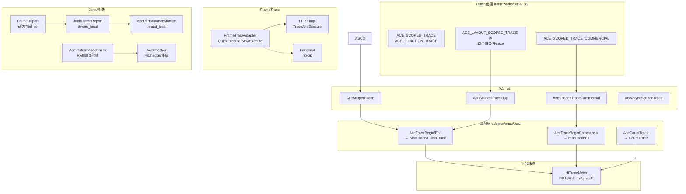

# 架构设计
> 确认目标仓和模块的架构约束、关键设计决策、Spec 拆分方向。

## 设计元数据

| Field | Content |
|-------|---------|
| Design ID | DESIGN-Func-03-08-03 |
| 关联需求 | 已有能力补录（无独立 requirement.md） |
| 关联 Epic | 无 |
| 目标 Feature | Feat-01 ACE Trace核心框架与FrameTrace适配; Feat-02 帧调度报告与Jank检测; Feat-03 性能检查与阈值监控 |
| 复杂度 | 复杂 |
| 目标版本 | API 9+（已有实现） |
| Owner | ArkUI SIG |
| 状态 | Baselined（已有实现补录） |

## 需求基线

| 项 | 补充说明 |
|----|----------|
| Trace 后端 | 统一使用 HiTraceMeter (HITRACE_TAG_ACE)，Commercial 级别使用 HITRACE_LEVEL_COMMERCIAL |
| Trace 分类 | 13 个域特定条件 trace 宏（SVG/Text/Syntax/Access/Layout/Image/Measure/SafeArea/VsyncMode/Event/ReuseDetection/Build/AttributeSet），各自受 SystemProperties 运行时开关控制 |
| Frame Trace | FrameTraceAdapter 抽象 + FFRT 实现，Quick/Slow 任务分类路由 |
| Jank 检测 | thread_local JankFrameReport，频率桶 (6~180Hz)，6.0x+ 告警 |
| 性能监控 | AcePerformanceMonitor thread_local 单例 (6 种 MonitorTag) + AcePerformanceCheck RAII 阈值检查 + AceChecker HiChecker 集成 |

## 上下文和现状

### 涉及仓和模块

| 仓库 | 补充架构说明 |
|------|-------------|
| ace_engine/frameworks/base/log/ace_trace.h/.cpp | 核心 trace 宏和 RAII 类 |
| ace_engine/adapter/ohos/osal/ace_trace.cpp | OHOS HiTraceMeter 适配 |
| ace_engine/frameworks/base/thread/frame_trace_adapter.h | FrameTraceAdapter 抽象接口 |
| ace_engine/adapter/ohos/osal/frame_trace_adapter_impl.h/.cpp | OHOS FFRT 实现 |
| ace_engine/adapter/ohos/osal/frame_trace_adapter_fake_impl.cpp | Fake 实现 |
| ace_engine/adapter/preview/osal/frame_trace_adapter_impl.cpp | Preview 实现（返回 null） |
| ace_engine/frameworks/base/log/frame_report.h | FrameReport 帧调度报告 |
| ace_engine/frameworks/base/log/jank_frame_report.h/.cpp | Jank 检测 |
| ace_engine/frameworks/base/log/frame_info.h | 每帧任务时序数据 |
| ace_engine/frameworks/base/perfmonitor/ | PerfMonitor DFX 性能监控 |
| ace_engine/frameworks/base/log/ace_performance_check.h/.cpp | 性能阈值检查 |
| ace_engine/frameworks/base/log/ace_performance_monitor.h/.cpp | 内部帧性能监控 |
| ace_engine/frameworks/base/log/ace_checker.h | HiChecker 集成 |
| ace_engine/adapter/ohos/osal/system_properties.cpp | Trace 开关初始化（系统属性读取） |

### 调用链层级分析

| 层 | 模块 | 职责 | 修改类型 |
|----|------|------|----------|
| 宏定义层 | ACE_SCOPED_TRACE / ACE_FUNCTION_TRACE 等 (ace_trace.h:29-99) | 编译期展开为 RAII 对象 | 已有实现 |
| RAII 层 | AceScopedTrace / AceScopedTraceFlag / AceAsyncScopedTrace (ace_trace.h:121-163) | 构造调 Begin，析构调 End | 已有实现 |
| 资源追踪层 | ResTracer / ContainerTracer / UINodeTracer (ace_trace.h:170-216) | 设置/恢复 ResTraceId | 已有实现 |
| 适配层 | AceTraceBegin/End/CountTrace (ace_trace.cpp → adapter/ohos/osal/ace_trace.cpp) | 桥接到 HiTraceMeter | 已有实现 |
| 平台层 | HiTraceMeter (HITRACE_TAG_ACE) | 系统级 trace 写入 | 外部依赖 |
| FrameTrace 层 | FrameTraceAdapter (frame_trace_adapter.h) | Quick/Slow 任务路由 | 已有实现 |
| FrameTrace 适配 | frame_trace_adapter_impl.cpp | FFRT TraceAndExecute | 已有实现 |
| 管线 trace 层 | pipeline_context.cpp / ui_task_scheduler.cpp / frame_node.cpp | 渲染管线各阶段打点 | 已有实现 |
| 帧调度报告层 | FrameReport (frame_report.h) | 动态加载 frame_scheduler .so | 已有实现 |
| Jank 层 | JankFrameReport (jank_frame_report.h/.cpp) | thread_local jank 检测与上报 | 已有实现 |
| 性能监控层 | AcePerformanceMonitor (ace_performance_monitor.h/.cpp) | thread_local 帧级耗时统计 | 已有实现 |
| 性能检查层 | AcePerformanceCheck / AceChecker (ace_performance_check.h, ace_checker.h) | 阈值检查 + HiChecker | 已有实现 |

### 适用架构规则

| Rule ID | 适用原因 | 设计结论 | 验证方式 |
|---------|----------|----------|----------|
| OH-ARCH-LAYERING | 宏→RAII→适配→平台 四层调用链 | 严格自上而下 | 代码评审 |
| OH-ARCH-ERROR-LOG | Trace 输出受系统属性开关控制 | 每个域特定 trace 宏有独立运行时开关 | hidumper/system properties |

## 不涉及项承接

| 维度 | 设计结论 |
|------|----------|
| IPC/SA | Trace 输出为本地 HiTraceMeter API 调用 |
| 持久化 | Trace 数据持久化由 HiTraceMeter 服务负责 |
| 权限 | Trace 输出不需要额外权限 |

## 关键设计决策

| 决策 ID | 问题 | 推荐方案 | 探索过的替代方案 | 取舍理由 | 影响 |
|---------|------|----------|-----------------|----------|------|
| ADR-1 | Trace 后端选择 | 统一使用 HiTraceMeter (HITRACE_TAG_ACE) | 自定义 trace、fprintf | 与 OpenHarmony DFX 体系统一，支持 trace 抓取工具 | 全部 trace 经适配层桥接 |
| ADR-2 | Trace 开关粒度 | 13 个域特定运行时开关 + Commercial 级别开关 | 全局统一开关 | 不同域可独立控制，减少不必要的 trace 开销 | system_properties.cpp 13 个参数读取 |
| ADR-3 | RAII 模式 trace | AceScopedTrace 构造调 Begin、析构调 End，编译器保证配对 | 手动 Begin/End 对 | 避免遗漏 End 导致 trace 不配对 | ACE_SCOPED_TRACE 宏 |
| ADR-4 | FrameTrace Quick/Slow 分类 | FrameTraceAdapter::QuickExecute/SlowExecute 路由到 FFRT，Quick 优先级高 | 统一优先级 | 帧感知调度优化关键路径 | BackgroundTaskExecutor 集成 |
| ADR-5 | Preview 模式禁用 FrameTrace | Preview 返回 null adapter | Preview 也启用 FFRT | Preview 无 FFRT 支持，禁用避免崩溃 | adapter/preview/osal/ |
| ADR-F2-1 | Jank 检测为 thread_local | JankFrameReport 是 thread_local 单例 | 全局单例 | 不同线程独立统计 jank，无需加锁 | jank_frame_report.h:32 |
| ADR-F2-2 | Jank 频率桶设计 | 6/15/20/36/48/60/120/180 Hz 分桶 | 线性分桶 | 覆盖常见屏幕刷新率，非线性桶更精确 | jank_frame_report.cpp:25-33 |
| ADR-F2-3 | PerfMonitor 场景化追踪 | PerfConstants 定义 60+ 场景 ID (LAUNCHER_APP_LAUNCH_FROM_ICON 等) | 自由文本 | 结构化场景 ID 便于 DFX 平台聚合 | perf_constants.h |
| ADR-F3-1 | 性能检查集成 HiChecker | AceChecker 通过 RULE_CHECK_ARKUI_PERFORMANCE 检查 | 自定义检查器 | 与系统 HiChecker 统一 | ace_checker.h |
| ADR-F3-2 | 性能监控 thread_local | ArkUIPerfMonitor 为 thread_local 单例 | 全局单例 | 避免多线程竞争 | ace_performance_monitor.h:61 |

## 设计骨架

### 骨架范围

| 骨架项 | 目标 | 不包含 | 验证方式 |
|--------|------|--------|----------|
| Trace 宏框架 | RAII trace + 13 域开关 + HiTraceMeter 适配 | 自定义 trace 格式 | 编译验证 + trace 抓取 |
| FrameTrace | Quick/Slow 任务分类 + FFRT 集成 | FFRT 内部实现 | 功能验证 |
| Jank 检测 | thread_local jank 统计 + 频率桶 + 上报 | GPU jank | 性能测试 |
| 性能监控 | 帧级耗时统计 + 阈值检查 + HiChecker | 远程性能分析 | 功能验证 |

### 骨架 Spec 拆分

| Task ID | 目标 | 受影响文件 | AC |
|---------|------|-----------|-----|
| TASK-SKELETON-1 | Trace 核心 + FrameTrace | ace_trace.h/.cpp, adapter ace_trace.cpp, frame_trace_adapter | Feat-01 AC |
| TASK-SKELETON-2 | 帧调度 + Jank | frame_report.h, jank_frame_report.h/.cpp, perf_monitor | Feat-02 AC |
| TASK-SKELETON-3 | 性能检查 | ace_performance_check, ace_checker, ace_performance_monitor | Feat-03 AC |

## 后续 Task 拆分

| Task ID | 目标 | 受影响文件 | 依赖 |
|---------|------|-----------|------|
| TASK-01 | ACE Trace核心框架与FrameTrace适配 | ace_trace.h/.cpp, adapter/ohos/osal/ace_trace.cpp, frame_trace_adapter_impl.cpp | 无 |
| TASK-02 | 帧调度报告与Jank检测 | frame_report.h, jank_frame_report.h/.cpp, perf_monitor.h/.cpp | TASK-01 |
| TASK-03 | 性能检查与阈值监控 | ace_performance_check.h/.cpp, ace_checker.h, ace_performance_monitor.h/.cpp | TASK-01 |

## API 签名、Kit 与权限

### 新增 API

> 本域为框架内部能力，无新增 Public/System API。

### 变更/废弃 API

无。

## 构建系统影响

### BUILD.gn 变更

```text
文件: frameworks/base/log/BUILD.gn
变更说明: ace_trace 编译为目标静态库
文件: adapter/ohos/osal/BUILD.gn
变更说明: frame_trace_adapter_impl.cpp 在 FRAME_TRACE_ENABLE 条件下编译
文件: frameworks/base/perfmonitor/BUILD.gn
变更说明: perf_monitor 编译为目标静态库
```

### bundle.json 变更

无。

## 可选设计扩展

### 架构图



#### Trace 调用流程 (Feat-01)

| 步骤 | 调用方 | 被调用方 | 数据/接口 | 说明 |
|------|--------|----------|-----------|------|
| 1 | 业务代码 | ACE_SCOPED_TRACE("name") | fmt | 宏展开为 AceScopedTrace 临时对象 |
| 2 | AceScopedTrace ctor | AceTraceBeginWithArgv | tag, fmt | 格式化 trace 名称 |
| 3 | AceTraceBegin | StartTrace | HITRACE_TAG_ACE, name | HiTraceMeter 写入 |
| 4 | (scope end) | AceScopedTrace dtor | — | — |
| 5 | AceTraceEnd | FinishTrace | HITRACE_TAG_ACE | 结束 trace |
| 6 | 域条件 trace | ACE_SCOPED_TRACE_FLAG(flag, ...) | flag | flag=false 时 RAII 对象不调用 Begin/End |

#### Jank 检测流程 (Feat-02)

| 步骤 | 调用方 | 被调用方 | 数据/接口 | 说明 |
|------|--------|----------|-----------|------|
| 1 | PipelineContext | JankFrameReport::SetFrameTime | timestamp, duration, vsyncId | 每帧调用 |
| 2 | JankFrameReport | JankFrameRecord | — | 计算 jank 比率 |
| 3 | JankFrameRecord | PerfMonitor::SetFrameTime | — | 同步到 PerfMonitor |
| 4 | JankFrameRecord | RecordJankStatus | — | jank >= 6.0x 时触发 |
| 5 | RecordJankStatus | ACE_SCOPED_TRACE | "JANK_STATS_APP..." | trace 输出 |
| 6 | FlushRecord | EventReport::JankFrameReport | — | HiSysEvent 上报 |

### 线程与并发模型

| 操作 | 发起线程 | 回调线程 | 线程安全 | 重入约束 |
|------|----------|----------|----------|----------|
| ACE_SCOPED_TRACE | 任意线程 | 同线程 | 安全（HiTraceMeter 内部加锁） | 可重入 |
| FrameTraceAdapter::QuickExecute | BackgroundTaskExecutor | 同线程 | 安全 | 可重入 |
| JankFrameReport | UI 线程 | 同线程 | thread_local，无需加锁 | 单线程内可重入 |
| AcePerformanceMonitor | 任意线程 | 同线程 | thread_local | 单线程内可重入 |
| AcePerformanceCheck | UI 线程 | 同线程 | RAII scope | 不可跨 scope |

## 详细设计

### ACE Trace 核心框架 (Feat-01)

**Scoped trace 宏** (`ace_trace.h:29-58`):
- `ACE_SCOPED_TRACE(fmt, ...)` → `AceScopedTrace` (always-on sync, HITRACE_TAG_ACE)
- `ACE_SCOPED_TRACE_COMMERCIAL(fmt, ...)` → `AceScopedTraceCommercial`
- `ACE_SCOPED_TRACE_FLAG(flag, fmt, ...)` → `AceScopedTraceFlag` (conditional)

**域特定条件 trace 宏** (`ace_trace.h:32-52`):
每个受 `SystemProperties::Get*TraceEnabled()` 控制:

| 宏 | 开关 | 系统属性 |
|----|------|----------|
| ACE_SVG_SCOPED_TRACE | GetSvgTraceEnabled() | persist.ace.trace.svg.enabled |
| ACE_TEXT_SCOPED_TRACE | GetTextTraceEnabled() | persist.ace.trace.text.enabled |
| ACE_SYNTAX_SCOPED_TRACE | GetSyntaxTraceEnabled() | persist.ace.trace.syntax.enabled |
| ACE_ACCESS_SCOPED_TRACE | GetAccessTraceEnabled() | persist.ace.trace.access.enabled |
| ACE_LAYOUT_SCOPED_TRACE | GetLayoutTraceEnabled() | persist.ace.trace.layout.enabled |
| ACE_IMAGE_SCOPED_TRACE | GetDebugEnabled() | debug flag |
| ACE_MEASURE_SCOPED_TRACE | GetMeasureDebugTraceEnabled() | persist.ace.trace.measure.debug.enabled |
| ACE_SAFE_AREA_SCOPED_TRACE | GetSafeAreaDebugTraceEnabled() | persist.ace.trace.safeArea.debug.enabled |
| ACE_VSYNC_MODE_SCOPED_TRACE | GetVsyncModeTraceEnabled() | persist.ace.trace.vsyncMode.debug.enabled |
| ACE_EVENT_SCOPED_TRACE | GetTraceInputEventEnabled() | persist.ace.trace.inputevent.enabled |
| ACE_REUSE_DETECTION_SCOPED_TRACE | GetDynamicDetectionTraceEnabled() | persist.ace.trace.dynamicdetection.enabled |

**RAII 类** (`ace_trace.h:121-216`):
- `AceScopedTrace` (:121): ctor AceTraceBeginWithArgv, dtor AceTraceEnd
- `AceScopedTraceCommercial` (:131): commercial level
- `AceScopedTraceFlag` (:141): flag=false 时不激活
- `AceAsyncScopedTrace` (:152): 异步 trace，std::atomic id_
- `ResTracer` (:170): 基础资源追踪，set/restore ResTraceId
- `ContainerTracer` (:183): 容器级
- `UINodeTracer` (:202): 节点级

**OHOS 适配** (`adapter/ohos/osal/ace_trace.cpp`):
- `AceTraceBegin()` → `StartTrace(HITRACE_TAG_ACE, ...)` (:33)
- `AceTraceEnd()` → `FinishTrace(HITRACE_TAG_ACE)` (:38)
- `AceTraceBeginCommercial()` → `StartTraceEx(HITRACE_LEVEL_COMMERCIAL, ACE_TRACE_COMMERCIAL, ...)` (:43)
- `AceAsyncTraceBegin()` → `StartAsyncTrace(HITRACE_TAG_ACE/HITRACE_TAG_ANIMATION, ...)` (:51-60)
- `AceCountTrace()` → `CountTrace(HITRACE_TAG_ACE, ...)` (:99)
- `AceSetResTraceId()` → 外部 C 函数 `setResTraceId()` (:104)
- `ACE_TRACE_COMMERCIAL = HITRACE_TAG_ACE | HITRACE_TAG_COMMERCIAL` (:25)

**FrameTraceAdapter** (`frame_trace_adapter.h:23`):
- `QuickExecute(std::function&&)` (:28): 高优先级执行
- `SlowExecute(std::function&&)` (:29): 低优先级执行
- `EnableFrameTrace(traceTag)` (:30): 启用
- `IsEnabled()` (:34)
- `SetFrameTraceLimit()` (:38): 设置 ffrt.interval.limit 系统参数

**OHOS FrameTrace 实现** (`frame_trace_adapter_impl.cpp`):
- `#ifdef FRAME_TRACE_ENABLE` (:28)
- QuickExecute → `FRAME_TRACE::TraceAndExecute(func, QUICK_TRACE)` (:38)
- SlowExecute → `FRAME_TRACE::TraceAndExecute(func, SLOW_TRACE)` (:45)
- SetFrameTraceLimit → 设置 `ffrt.interval.limit` (:71-78)

**Fake 实现** (`frame_trace_adapter_fake_impl.cpp`): 全部 no-op/return false

**Preview 实现** (`adapter/preview/osal/frame_trace_adapter_impl.cpp`): GetInstance() 返回 null

**BackgroundTaskExecutor 集成** (`background_task_executor.cpp`):
- 构造函数检查 FrameTrace 是否启用 (:52-64): 启用则跳过线程池创建
- PostTask (:93-103): LOW 优先级 → SlowExecute, 其他 → QuickExecute

**TraceId / HiTraceChain** (`frameworks/base/log/trace_id.h`, `adapter/ohos/osal/trace_id_impl.cpp`):
- `TraceIdImpl` wraps `HiTraceChain::GetId/SetId/ClearId` (:24,31,37)
- 用于跨线程 trace ID 传播

**Trace 开关初始化** (`adapter/ohos/osal/system_properties.cpp`):

| 系统属性 | 函数 | 行 |
|---------|------|-----|
| persist.ace.trace.svg.enabled | IsSvgTraceEnabled | 142 |
| persist.ace.trace.layout.enabled | IsLayoutTraceEnabled | 147 |
| persist.ace.trace.attribute_set.enabled | IsAttributeSetTraceEnabled | 152 |
| persist.ace.trace.text.enabled | IsTextTraceEnabled | 157 |
| persist.ace.trace.syntax.enabled | IsSyntaxTraceEnabled | 162 |
| persist.ace.trace.access.enabled | IsAccessTraceEnabled | 167 |
| persist.ace.trace.inputevent.enabled | IsTraceInputEventEnabled | 172 |
| persist.ace.trace.build.enabled | IsBuildTraceEnabled | 182 |
| persist.ace.trace.dynamicdetection.enabled | IsDynamicDetectionTraceEnabled | 187 |
| persist.ace.trace.measure.debug.enabled | IsMeasureDebugTraceEnabled | 197 |
| persist.ace.trace.safeArea.debug.enabled | IsSafeAreaDebugTraceEnabled | 207 |
| persist.ace.trace.vsyncMode.debug.enabled | IsVsyncModeDebugTraceEnabled | 212 |

### 帧调度报告与 Jank 检测 (Feat-02)

**FrameReport** (`frame_report.h:58`):
- 单例模式，动态加载 frame_scheduler `.so` 库
- `FrameSchedEvent` 枚举 (:26): INIT, UI_FLUSH_BEGIN/END, UI_SCB_WORKER_BEGIN/END
- 帧阶段钩子 (:63-78): BeginFlushAnimation/End, BeginFlushBuild/End, BeginFlushLayout/End, BeginFlushRender/End, BeginFlushRenderFinish/End, BeginProcessPostFlush, BeginListFling/End, FlushBegin/End
- 所有钩子为函数指针类型，从外部库加载 (:35-56)

**管线集成**:
- FlushBuild begin/end: `pipeline_context.cpp:893-929`
- FlushAnimation begin/end: `pipeline_context.cpp:1532-1540`
- FlushRender begin: `ui_task_scheduler.cpp:233-234`

**FrameInfo** (`frame_info.h:41`):
- `TaskInfo`: tag_, id_, time_ (:24)
- `FrameInfo`: frameRecvTime_, frameTimeStamp_, layoutInfos_, renderInfos_ (:41)
- AddTaskInfo(tag, id, time, type) (:49)
- 使用位置: `ui_task_scheduler.cpp:168-169`(layout), `:258`(render)

**JankFrameReport** (`jank_frame_report.h:32`):
- **thread_local** 单例
- `JankFrameFlag` (:27-30): JANK_IDLE, JANK_RUNNING_SCROLL, JANK_RUNNING_ANIMATOR, JANK_RUNNING_SWIPER
- 频率桶 (:25-33): 6, 15, 20, 36, 48, 60, 120, 180

**JankFrameReport::JankFrameRecord** (`jank_frame_report.cpp:134`):
- 计算 jank 比率
- 调用 `PerfMonitor::SetFrameTime()` (:)

**RecordJankStatus** (`jank_frame_report.cpp:160`):
- jank >= 6.0x 时触发
- `ACE_SCOPED_TRACE("JANK_STATS_APP skippedTime=...(ms)")` (:182)
- `ACE_COUNT_TRACE(jankFrameCount_, "JANK FRAME %s")` (:184)

**FlushRecord** (`jank_frame_report.cpp:245`):
- 上报 `EventReport::JankFrameReport()`
- 上报 `Rosen::RSInterfaces::ReportJankStats()`

**PerfInterfaces/PerfMonitor** (`frameworks/base/perfmonitor/`):
- `PerfInterfaces`: 静态门面 (:perf_interfaces.h:43-44)
  - Start(sceneId, type, note) / End(sceneId, isRsRender)
  - StartCommercial/EndCommercial
  - NotifyAppJankStatsBegin/End, ReportJankFrameApp
  - SetPageUrl/SetPageName
- `PerfMonitor` (perf_monitor.h:53): 单例
  - `PerfActionType` (:35): LAST_DOWN, LAST_UP, FIRST_MOVE
  - `PerfSourceType` (:42): TOUCH_EVENT, MOUSE_EVENT, TOUCH_PAD, JOY_STICK, KEY_EVENT
- `PerfConstants` (perf_constants.h): ~60 场景 ID 常量 (LAUNCHER_APP_LAUNCH_FROM_ICON 等)
- OHOS 适配 (`adapter/ohos/osal/perf_interfaces.cpp:174`): 委托给 `HiviewDFX::PerfMonitorAdapter::GetInstance()`

### 性能检查与阈值监控 (Feat-03)

**AcePerformanceCheck** (`ace_performance_check.h:39`):
- Start/Stop 静态接口
- `AceScopedPerformanceCheck` (:57): RAII scope 计时器
- `RecordPerformanceCheckData()`: 记录检查数据
- `RecordVsyncTimeout()`: vsync 超时
- `RecordFunctionTimeout()`: 函数超时

**PerformanceCheckNode** (`performance_check_types.h:24`):
- pageDepth, childrenSize, codeRow, codeCol, layoutTime, flexLayouts, foreachItems, nodeTag, pagePath

**AceChecker** (`ace_checker.h`):
- `IsPerformanceCheckEnabled()`: 检查 `RULE_CHECK_ARKUI_PERFORMANCE`
- `SetPerformanceCheckStatus()`
- 阈值: GetPageNodes(), GetPageDepth(), GetNodeChildren(), GetFunctionTimeout(), GetVsyncTimeout(), GetNodeTimeout(), GetForeachItems(), GetFlexLayouts()
- `NotifyCaution(tag)`: 上报到 `HiChecker::NotifyCaution()`
- `InitPerformanceParameters()`
- OHOS 适配 (`adapter/ohos/osal/ace_checker.cpp`): 委托 `HiviewDFX::HiChecker`

**AcePerformanceMonitor** (`ace_performance_monitor.h`):
- `MonitorTag` (:27): COMPONENT_CREATION, COMPONENT_LIFECYCLE, COMPONENT_UPDATE, JS_CALLBACK, STATIC_API, OTHER
- `ScopedMonitor` (:50): RAII 计时器
- `ArkUIPerfMonitor` (:61): **thread_local** 单例
- `FlushPerfMonitor()` (cpp:162): 计算总耗时 vs 框架开销，输出 `ACE_SCOPED_TRACE("ArkUIPerfMonitor %s")`
- `FlushPerfMonitorOutOfVsync()` (cpp:192): 输出 `ACE_SCOPED_TRACE("ArkUIOutOfVsyncPerfMonitor %s")`
- 宏 (:41-46): COMPONENT_CREATION_DURATION(), COMPONENT_LIFECYCLE_DURATION(), COMPONENT_UPDATE_DURATION(), JS_CALLBACK_DURATION(), STATIC_API_DURATION(), OTHER_DURATION()

**AceTracker** (`ace_tracker.h`):
- `ACE_FUNCTION_TRACK()` 宏 (:28)
- `AceTracker`: Start/Stop JSON 计时
- `AceScopedTracker` (:48): RAII 微秒计时

**AceScoringLog** (`ace_scoring_log.h`):
- `ACE_SCORING_EVENT(event)` (:24), `ACE_SCORING_COMPONENT(page, component, proc)` (:25)
- 受 `SystemProperties::IsScoringEnabled()` 控制

## 风险和开放问题

| 项 | 类型 | 影响 | 处理方式 | Owner |
|----|------|------|----------|-------|
| FrameReport 依赖动态加载 .so | 可靠性 | 中 | .so 缺失时所有帧阶段钩子为空，不影响功能但 trace 数据缺失 | ArkUI SIG |
| Jank 频率桶硬编码 | 维护 | 低 | 新增屏幕刷新率需手动添加桶 | ArkUI SIG |
| AcePerformanceMonitor thread_local 无法跨线程聚合 | 架构 | 低 | 每个线程独立统计，无法得到全局视图 | ArkUI SIG |
| 大部分 trace 开关需 developerModeOn_ | 可用性 | 中 | 非开发者模式无法启用 trace，排查线上问题受限 | ArkUI SIG |

## 设计审批

- [x] 需求基线已确认，设计覆盖 P0/P1 AC
- [x] 不涉及项已承接，N/A 和展开项都有结论
- [x] 涉及仓和模块职责清楚
- [x] 调用链层级分析完整，每层覆盖到位
- [x] 适用架构规则已识别并形成设计结论
- [x] 分层和子系统边界合规
- [x] API 变更有签名、权限、错误码和兼容性说明
- [x] BUILD.gn/bundle.json 影响明确
- [x] 设计输出和后续 Task 拆分明确
- [x] 关键设计决策有理由和影响说明
- [x] 风险和开放问题有 Owner

**结论:** 通过（已有实现补录）
