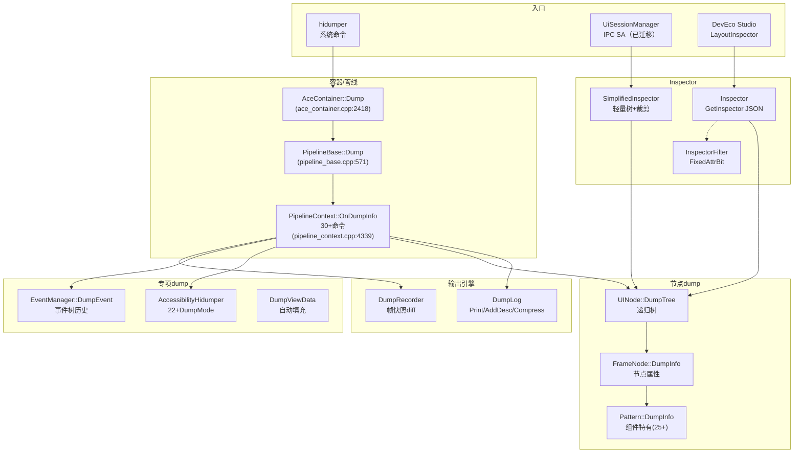

# 架构设计
> 确认目标仓和模块的架构约束、关键设计决策、Spec 拆分方向。

## 设计元数据

| Field | Content |
|-------|---------|
| Design ID | DESIGN-Func-03-08-04 |
| 关联需求 | 已有能力补录（无独立 requirement.md） |
| 关联 Epic | 无 |
| 目标 Feature | Feat-01 DumpLog核心引擎与Pipeline命令路由; Feat-02 Inspector树形诊断系统; Feat-03 SimplifiedInspector与简化树; Feat-04 可访问性Dump与事件Dump |
| 复杂度 | 复杂 |
| 目标版本 | API 9+（已有实现） |
| Owner | ArkUI SIG |
| 状态 | Baselined（已有实现补录） |

## 需求基线

| 项 | 补充说明 |
|----|----------|
| Dump 输出引擎 | DumpLog 单例，支持文本/JSON/压缩格式，超 100KB 溢出到文件 |
| Pipeline 命令路由 | PipelineContext::OnDumpInfo 支持 30+ dump 命令（-element/-inspector/-accessibility/-event/-simplify 等） |
| Inspector 系统 | 全量组件树 JSON 诊断，支持按 key 查找、InspectorFilter 属性过滤 |
| 简化树 | SimplifiedInspector 轻量 JSON 树，支持视口裁剪和透明度裁剪 |
| 无障碍 Dump | 22+ DumpMode 枚举，支持树/节点/事件注入/自定义动作等模式 |
| 事件 Dump | EventManager 事件树历史记录和文本/JSON dump |

## 上下文和现状

### 涉及仓和模块

| 仓库 | 补充架构说明 |
|------|-------------|
| ace_engine/frameworks/base/log/dump_log.h/.cpp | DumpLog 单例核心 |
| ace_engine/frameworks/base/log/dump_recorder.h/.cpp | DumpRecorder 帧快照记录 |
| ace_engine/adapter/ohos/entrance/ace_container.cpp:2418-2591 | AceContainer::Dump 入口 |
| ace_engine/frameworks/core/pipeline/pipeline_base.cpp:571-603 | PipelineBase::Dump 基类路由 |
| ace_engine/frameworks/core/pipeline_ng/pipeline_context.cpp:4339-4593 | PipelineContext::OnDumpInfo NG 命令路由 (30+) |
| ace_engine/frameworks/core/components_ng/base/inspector.h/.cpp | Inspector 全量树诊断 |
| ace_engine/interfaces/inner_api/ace_kit/include/ui/base/inspector_filter.h | InspectorFilter 属性过滤 |
| ace_engine/frameworks/core/components_ng/base/simplified_inspector.h/.cpp | SimplifiedInspector |
| ace_engine/frameworks/core/components_ng/base/ui_node.h/.cpp | UINode dump 方法 (DumpTree/DumpSimplify) |
| ace_engine/frameworks/core/components_ng/base/frame_node.h/.cpp | FrameNode dump 方法 |
| ace_engine/frameworks/core/components_ng/pattern/pattern.h:335-342 | Pattern dump 虚方法 |
| ace_engine/frameworks/core/accessibility/hidumper/ | AccessibilityHidumper |
| ace_engine/adapter/ohos/osal/js_accessibility_manager.cpp | NG 无障碍树 dump |
| ace_engine/frameworks/core/common/event_manager.h/.cpp | EventManager dump |
| ace_engine/frameworks/core/common/event_dump.h | 事件 dump 数据结构 |
| ace_engine/frameworks/core/common/layout_inspector.h | LayoutInspector IDE 集成 |

### 调用链层级分析

| 层 | 模块 | 职责 | 修改类型 |
|----|------|------|----------|
| 入口层 | AceContainer::Dump (ace_container.cpp:2418) | hidumper 系统入口 | 已有实现 |
| 基类路由层 | PipelineBase::Dump (pipeline_base.cpp:571) | 跨域命令路由 (-memory/-jscrash/-frontend) | 已有实现 |
| NG 命令层 | PipelineContext::OnDumpInfo (pipeline_context.cpp:4339) | 30+ NG dump 命令 | 已有实现 |
| 输出引擎层 | DumpLog (dump_log.h/.cpp) | 格式化输出 + 文件溢出 + 压缩 | 已有实现 |
| Inspector 层 | Inspector (inspector.h/.cpp) | 全量 JSON 树构建 | 已有实现 |
| 节点 dump 层 | UINode::DumpTree / FrameNode::DumpInfo (ui_node.cpp, frame_node.cpp) | 递归节点信息 | 已有实现 |
| 组件 dump 层 | Pattern::DumpInfo/DumpSimplifyInfo (pattern.h:335-342) | 组件特有属性 dump | 已有实现 |
| 简化树层 | SimplifiedInspector (simplified_inspector.h/.cpp) | 轻量 JSON + 裁剪 | 已有实现 |
| 无障碍层 | AccessibilityHidumper + JsAccessibilityManager | 22+ DumpMode | 已有实现 |
| 事件层 | EventManager::DumpEvent (event_manager.cpp) | 事件树历史 dump | 已有实现 |
| IPC 服务层 | UiSessionManager (interfaces/inner_api/ui_session/) → 已迁移至 Func-03-09-01 | 现代 IPC 检查服务 | 迁移至 03-09-01 |
| IDE 集成层 | LayoutInspector (layout_inspector.h) | DevEco Studio 集成 | 已有实现 |

### 适用架构规则

| Rule ID | 适用原因 | 设计结论 | 验证方式 |
|---------|----------|----------|----------|
| OH-ARCH-LAYERING | 入口→路由→命令→输出→节点→组件 六层调用链 | 严格自上而下 | 代码评审 |
| OH-ARCH-IPC-SAF | UiSessionManager 为 IPC 系统能力（已迁移至 Func-03-09-01） | SA 模式实现 | 集成测试 |

## 不涉及项承接

| 维度 | 设计结论 |
|------|----------|
| 持久化 | dump 输出为即时文本/JSON，不持久化（DumpRecorder 除外） |
| 权限 | hidumper 由系统权限控制；UiSessionManager 权限校验已迁移至 Func-03-09-01 |

## 关键设计决策

| 决策 ID | 问题 | 推荐方案 | 探索过的替代方案 | 取舍理由 | 影响 |
|---------|------|----------|-----------------|----------|------|
| ADR-1 | Dump 输出引擎设计 | DumpLog 单例，支持 Print/AddDesc/Append 文本模式和 JSON 模式 | 每个模块自行输出 | 统一格式化、深度缩进、文件溢出 | dump_log.h:32-189 |
| ADR-2 | Dump 输出大小限制 | MAX_DUMP_LENGTH=100000，超限时溢出到 arkui.dump 文件 | 无限制 | 防止 oom 和 hidumper buffer 溢出 | dump_log.h |
| ADR-3 | Inspector 双格式 | 每个节点同时支持文本 (DumpInfo) 和 JSON (DumpInfo(json)) dump | 仅文本或仅 JSON | 文本用于 hidumper，JSON 用于 IDE 和自动化测试 | pattern.h:335-342 |
| ADR-4 | InspectorFilter 属性过滤 | FixedAttrBit 位掩码 + CheckExtAttr 字符串匹配，支持深度限制和节点 ID 过滤 | 全量 dump 后客户端过滤 | 减少不必要属性遍历，大幅提升大树的 dump 性能 | inspector_filter.h:49-71 |
| ADR-5 | SimplifiedInspector 视口裁剪 | RectCullingState 计算视口和裁剪矩形，跳过屏外节点 | 全量 dump 后客户端裁剪 | 大幅减少大树（如长列表）的 dump 体积 | ui_node.cpp:1519-1608 |
| ADR-F2-1 | Pattern 虚方法覆盖 | 25+ Pattern 子类覆盖 DumpInfo/DumpSimplifyInfo，按组件类型输出特有属性 | 反射/注册表 | 编译期绑定，无运行时开销 | pattern.h:335-342 |
| ADR-F4-1 | 无障碍 DumpMode 体系 | 22+ DumpMode 枚举（TREE/NODE/HANDLE_EVENT/HOVER_TEST/EVENT_TEST/INJECT_ACTION_TEST 等） | 单一 dump 格式 | 支持精细化的无障碍调试和测试 | accessibility_hidumper.h:37-60 |
| ADR-F4-2 | 事件树历史记录 | EventTreeRecord 保存事件树历史，支持 text/JSON dump 和深度/起始编号控制 | 仅当前帧 | 支持回溯分析事件分发链路 | event_dump.h:108-145 |
| ADR-F5-2 | DumpRecorder 帧快照差异 | DumpRecorder 记录每帧 JSON 快照，支持 Compare/Diff 对比 | 仅单帧 dump | 支持调试帧间状态变化 | dump_recorder.h |

## 设计骨架

### 骨架范围

| 骨架项 | 目标 | 不包含 | 验证方式 |
|--------|------|--------|----------|
| DumpLog 引擎 | 统一输出 + 文件溢出 + 压缩 | 远程 dump | 功能验证 |
| Pipeline 命令 | 30+ dump 命令路由 | 新增命令 | hidumper 验证 |
| Inspector | 全量树 + 过滤 + IDE 集成 | 截图渲染 | Inspector 输出验证 |
| 简化树 | 轻量树 + 视口裁剪 | 完整属性 | Simplified 输出验证 |
| 无障碍 dump | 22+ 模式 | 无障碍运行时 | hidumper -accessibility 验证 |
| 事件 dump | 事件树历史 | 事件重放 | hidumper -event 验证 |

### 骨架 Spec 拆分

| Task ID | 目标 | 受影响文件 | AC |
|---------|------|-----------|-----|
| TASK-SKELETON-1 | DumpLog + Pipeline 命令路由 | dump_log.h/.cpp, ace_container.cpp, pipeline_context.cpp | Feat-01 AC |
| TASK-SKELETON-2 | Inspector 树形诊断 | inspector.h/.cpp, ui_node.cpp, frame_node.cpp, pattern.h | Feat-02 AC |
| TASK-SKELETON-3 | SimplifiedInspector | simplified_inspector.h/.cpp | Feat-03 AC |
| TASK-SKELETON-4 | 无障碍 + 事件 dump | accessibility_hidumper.h, js_accessibility_manager.cpp, event_manager.cpp | Feat-04 AC |

## 后续 Task 拆分

| Task ID | 目标 | 受影响文件 | 依赖 |
|---------|------|-----------|------|
| TASK-01 | DumpLog核心引擎与Pipeline命令路由 | dump_log.h/.cpp, dump_recorder.h/.cpp, ace_container.cpp, pipeline_context.cpp | 无 |
| TASK-02 | Inspector树形诊断系统 | inspector.h/.cpp, inspector_filter.h, ui_node.cpp, frame_node.cpp, pattern.h, layout_inspector.h | TASK-01 |
| TASK-03 | SimplifiedInspector与简化树 | simplified_inspector.h/.cpp | TASK-02 |
| TASK-04 | 可访问性Dump与事件Dump | accessibility_hidumper.h, js_accessibility_manager.cpp, event_manager.cpp, event_dump.h | TASK-02 |

## API 签名、Kit 与权限

### 新增 API

> 本域为框架内部能力。UiSessionManager IPC 接口已迁移至 Func-03-09-01。

### 变更/废弃 API

无。

## 构建系统影响

### BUILD.gn 变更

```text
文件: frameworks/base/log/BUILD.gn
变更说明: dump_log、dump_recorder 编译为目标静态库
文件: interfaces/inner_api/ui_session/BUILD.gn
变更说明: UiSessionManager 系统能力 (SA) 编译为共享库
```

### bundle.json 变更

无。

## 可选设计扩展

### 架构图



#### Dump 命令路由流程 (Feat-01)

| 步骤 | 调用方 | 被调用方 | 命令 | 说明 |
|------|--------|----------|------|------|
| 1 | hidumper | AceContainer::Dump | params | 入口 |
| 2 | AceContainer | aceView_->Dump | params | 平台特定 |
| 3 | AceContainer | PipelineBase::Dump | params | 基类路由 |
| 4 | PipelineBase | OnDumpInfo | params | NG 命令分发 |
| 5 | OnDumpInfo | UINode::DumpTree | -element/-default | 递归树 |
| 6 | OnDumpInfo | Inspector::GetInspector | -inspector | JSON 全量树 |
| 7 | OnDumpInfo | JsAccessibilityManager | -accessibility | 无障碍树 |
| 8 | OnDumpInfo | EventManager::DumpEvent | -event | 事件树 |
| 9 | OnDumpInfo | SimplifiedInspector | -simplify/-allInfo | 简化树 |

### 线程与并发模型

| 操作 | 发起线程 | 回调线程 | 线程安全 | 重入约束 |
|------|----------|----------|----------|----------|
| AceContainer::Dump | binder 线程 | 同线程 | 投递到 UI 线程执行 | 安全 |
| DumpLog::Print | UI 线程 | 同线程 | 非线程安全（单例，设计为 UI 线程使用） | 不建议多线程并发 |
| Inspector::GetInspector | UI 线程 | 同线程 | 读操作，安全 | 可重入 |

## 详细设计

### DumpLog 核心引擎与 Pipeline 命令路由 (Feat-01)

**DumpLog** (`dump_log.h:32-189`):
- 单例模式
- `Print(depth, content)`: 带缩进打印 (`dump_log.cpp:75`)
- `Print(depth, className, childSize)`: 树节点头 (`dump_log.cpp:37`)
- `AddDesc<T>(...)`: 模板化描述累积 (`dump_log.h:131-166`)
- `Append(depth, className, childSize)`: 格式化树节点 (`dump_log.cpp:98`)
- `OutPutBySize()`: 超过 MAX_DUMP_LENGTH(100000) 溢出到 arkui.dump 文件 (`dump_log.cpp:122`)
- `OutPutDefault()`: 直接输出到 ostream (`dump_log.cpp:153`)
- `OutPutByCompress()`: zlib 压缩输出 (`dump_log.h:175`)
- `ShowDumpHelp(info)`: 帮助文本 (`dump_log.cpp:89-96`):
  `-element`, `-render`, `-inspector`, `-frontend`, `-navigation`
- `SetDumpAllNodes(bool)` / `IsDumpAllNodes()`: 控制不可见节点 dump
- DumpFileBuf / DumpFile 内部类 (`:36-73`): 文件输出流

**DumpRecorder** (`dump_recorder.h`):
- 帧级 JSON 快照记录
- Start(dumpFunc) / Stop() / Record(timestamp, json)
- Compare / CompareDumpParam: 连续帧差异对比
- GetFrameDumpFunc()

**AceContainer::Dump** (`ace_container.cpp:2418-2591`):
- 入口: DumpCommon() / DumpDynamicUiContent()
- DumpCommon (:2428): 设置 DumpLog ostringstream → DumpInfo()
- DumpInfo (:2472): 依次尝试:
  - aceView_->Dump(params)
  - OnDumpInfo(params) → -basicinfo (:2552): InstanceId, FrontendType, NewPipeline, WindowName, WindowState, Language, RTL, ColorMode, DeviceOrientation, Resolution, AppBgColor, Density, ViewScale, DisplayWindowRect, vsyncID, ApiVersion, ReleaseType, DeviceType
  - DumpRSNodeByStringID(params) → -rsnodebyid (:2531)
  - DumpExistDarkRes(params) → -existdarkresbyid/-byname (:2493)
  - pipelineContext_->Dump(params)

**PipelineBase::Dump** (`pipeline_base.cpp:571-603`):
- -memory → MemoryMonitor dump + DumpUIExt (:577)
- -jscrash → 报告 JS crash (:584)
- -hiviewreport → 发送 hiview event (:590)
- -frontend → Dump frontend page info (:597)
- Otherwise → OnDumpInfo(params) (:602)

**PipelineContext::OnDumpInfo** (`pipeline_context.cpp:4339-4593`):
- 始终打印 (:4347-4359): LastRequestVsyncTime, transactionFlags, last vsyncId, finishCount, UINodeCount

| 命令 | 行 | 功能 |
|------|-----|------|
| -element | 4360 | 元素树 (JSON/文本) |
| -navigation | 4362 | 导航路径栈 |
| -focus | 4367 | 焦点树 |
| -focuswindowscene | 4369 | 窗口场景焦点 |
| -focusmanager | 4375 | 焦点管理器状态 |
| -accessibility | 4379 | 无障碍 dump |
| -inspector | 4384 | 全量 Inspector JSON |
| -pipeline | 4391 | 帧任务信息 |
| -jsdump | 4393 | JS 页面级 dump |
| -event | 4418 | 触摸事件树 |
| -imagecache | 4431 | 图片缓存信息 |
| -imagefilecache | 4436 | 文件图片缓存 |
| -allelements | 4439 | 所有容器元素树 |
| -default/-default -all | 4449 | 默认树 dump |
| -overlay | 4461 | Overlay 管理器 |
| -simplify | 4467 | 简化树 dump |
| -allInfo | 4480 | 全量简化 JSON |
| -allInfoWithParamConfig | 4484 | 参数控制简化 dump |
| -visibleInfoHasTopNavNode | 4494 | 可见树含顶部导航 |
| -visibleInfoWithModifiedParam | 4530 | 可见树自定义参数 |
| -infoOfRootNode | 4537 | 根节点简化信息 |
| -featuremanager | 4542 | 特性标志值 |
| -resource | 4555 | 资源加载错误 |
| -start/-end | 4557-4560 | DumpRecorder 开始/停止 |
| -injection | 4561 | 事件注入 |
| -forcedark | 4567 | 强制深色模式 |
| -compname | 4571 | 按组件名 dump 树 |
| -contentChange | 4581 | 内容变更管理器 |
| -relaxedinteractioncmd/log | 4586-4589 | 宽松交互 |

**DumpPipelineInfo** (`pipeline_context.cpp:4654-4678`):
- DisplayRefreshRate, LastRequestVsyncTime, NowTime
- dumpFrameInfos_ (帧任务历史，含 layout/render 任务时序)

### Inspector 树形诊断系统 (Feat-02)

**Inspector 类** (`inspector.h:56-87`):

| API | 行 | 功能 |
|-----|-----|------|
| GetInspector(isLayoutInspector) | inspector.cpp:780 | 当前页面全量 Inspector JSON |
| GetInspector(isLayoutInspector, filter, needThrow) | :787 | 过滤后的 Inspector JSON |
| GetInspectorOfNode(RefPtr<UINode>) | :834 | 指定节点 Inspector JSON |
| GetInspectorNodeByKey(key, filter) | :663 | 按 key/id 查找节点 |
| GetFrameNodeByKey(key) | :636 | 按 key 查找 FrameNode |
| GetInspectorByKey(root, key) | :857 | BFS 搜索 |
| GetSubWindowInspector() | :907 | 子窗口 Inspector |
| GetInspectorTree(InspectorTreeMap&) | :1010 | 树结构 (Layout Inspector) |

**GetInspector 流程** (`:787-832`):
1. 创建 JSON root (type "root")
2. PipelineContext → GetContextInfo() (Width, Height, Resolution)
3. 获取最后一页 via StageManager
4. GetFrameNodeChildren() 收集子节点
5. GetInspectorInfo() → GetInspectorChildren() 递归遍历

**InspectorFilter** (`inspector_filter.h:49-71`):
- CheckFixedAttr(FixedAttrBit): 位掩码检查
- FixedAttrBit (:38-47): FIXED_ATTR_ID, FIXED_ATTR_CONTENT, FIXED_ATTR_SRC, FIXED_ATTR_EDITABLE, FIXED_ATTR_SCROLLABLE, FIXED_ATTR_SELECTABLE, FIXED_ATTR_FOCUSABLE, FIXED_ATTR_FOCUSED
- CheckExtAttr(string): 字符串匹配
- IsFastFilter(): 仅请求 FixedAttr 时快速路径
- AddFilterAttr(string), SetFilterID(string), SetFilterDepth(size_t), EnableFreeNodes()

**InspectorOffscreenNodesMgr** (`inspector.h:44-54`):
- AddOffscreenNode/RemoveOffscreenNode/GetOffscreenNodes/ClearOffscreenNodes

**UINode::DumpTree** (`ui_node.cpp:1385-1435`):
- JSON 模式: childSize, ID, Depth, InstanceId, AccessibilityId, IsDisappearing, DumpInfo()
- 文本模式: DumpBasicInfo(), DumpInfo(), Append(depth, name, childSize)
- 不可见/非活跃节点: IsDumpAllNodes() 时跳过
- LazyForEach/Repeat: GetChildrenForInspector()
- 递归: children, disappearing children, overlay nodes, corner mark nodes

**FrameNode::DumpInfo** (`frame_node.cpp:1579,8320`):
- 文本 (:1579): LastParent, CommonInfo, OnSizeChange, KeyboardShortcut, Pattern, RenderContext
- JSON (:8320): CommonInfo(json), OnSizeChange(json), Pattern(json), RenderContext(json)

**FrameNode::DumpCommonInfo** (:1186, :8289):
- 文本: FrameRect, PaintRect, BackgroundColor, ParentLayoutConstraint, Active, Freeze, Visible
- JSON: FrameRect, PaintRect, BackgroundColor, LayoutInfo, SafeArea, VisibleArea, Constraints, compid, AlignRules, DragInfo, OverlayInfo

**Pattern dump 虚方法** (`pattern.h:335-342`):
```cpp
virtual void DumpInfo() {}
virtual void DumpInfo(std::unique_ptr<JsonValue>&) {}
virtual void DumpSimplifyInfo(std::unique_ptr<JsonValue>&) {}
virtual void DumpAdvanceInfo() {}
virtual void DumpAdvanceInfo(std::unique_ptr<JsonValue>&) {}
virtual void DumpViewDataPageNode(...) {}
virtual void DumpSimplifyInfoOnlyForParamConfig(...) {}
```
覆盖的 Pattern: TextPattern, ImagePattern, WebPattern, TextFieldPattern, ListPattern, SwiperPattern, ScrollablePattern, MenuPattern, BadgePattern, VideoPattern, DividerPattern, CheckboxPattern, RadioPattern, BubblePattern, SelectPattern, QrcodePattern, ToastPattern, CounterPattern, BlankPattern, RelativeContainerPattern, FolderStackPattern, CheckboxGroupPattern, MenuWrapperPattern, LoadingProgressPattern, IndexerPattern, ContainerReaderPattern, CustomPattern, StackPattern

**LayoutInspector IDE 集成** (`layout_inspector.h:39-104`):
- SupportInspector(), SetlayoutInspectorStatus(containerId)
- GetInspectorTreeJsonStr(treeJsonStr, containerId, isNeedFreeNodes)
- CreateLayoutInfo(containerId) / CreateLayoutInfoByWinId(windId)
- GetSnapshotJson(containerId, message): 含 PixelMap 截图
- ProcessMessages(message): IDE 消息处理
- StateProfiler: GetStateProfilerStatus/SetStateProfilerStatus
- RSProfiler: HandleStartRecord/HandleStopRecord
- NodeTrace: GetEnableNodeTrace/SetEnableNodeTrace
- 3D Layout: CreateContainer3DLayoutInfo

### SimplifiedInspector 与简化树 (Feat-03)

**SimplifiedInspector** (`simplified_inspector.h:28-78`):

| API | 行 | 功能 |
|-----|-----|------|
| GetInspector() | cpp:277 | 同步简化 JSON 树 |
| GetInspectorAsync(collector) | cpp:526 | 异步树收集 |
| GetInspectorBackgroundAsync(collector) | cpp:548 | 后台树收集 |
| ExecuteUICommand(collector) | h:37 | UI 命令执行 |
| GetComponentImageInfo(result) | h:39 | 组件截图 |

三种构造模式: TreeParams (全树), UICommandParams (命令), ComponentParams (单组件)
InspectorConfig: contentOnly, callingOnMain

**UINode 简化树方法**:

| 方法 | cpp:行 | 功能 |
|------|--------|------|
| DumpSimplifyTreeBase(json) | 1495 | $type, $ID, type (custom/built-in) |
| DumpSimplifyTreeNode(json, config) | 1506 | Base + SimplifyInfo + ParamConfig |
| DumpSimplifyTree(depth, json) | 1742 | 全递归简化树 |
| DumpSimplifyTreeWithParamConfig(depth, json, visible, config, ...) | 1725 | 配置控制可见树 (rect/opacity culling) |
| DumpSimplifyTreeWithParamConfigInner(...) | 1610 | 内部递归 (viewport/clip rect 计算) |

**RectCullingState** (`ui_node.cpp:1519-1608`):
- 计算视口矩形和裁剪矩形
- 跳过屏外节点
- 显著减少大树输出体积

**FrameNode 简化信息**:

| 方法 | cpp:行 | 输出 |
|------|--------|------|
| DumpSimplifyCommonInfo(json) | 1396 | $rect, compid, active, visible, opacity, backgroundColor |
| DumpSimplifyCommonInfoOnlyForParamConfig(json, config) | 1419 | clickable, longClickable, focusable, accessibilityContent, scrollable, editable |
| DumpSimplifySafeAreaInfo(json) | 1467 | SafeAreaExpandOpts, SafeAreaInsets, SelfAdjust, ParentSelfAdjust, KeyboardInset, IgnoreSafeArea |

**AceContainer::DumpSimplifyTreeWithParamConfig** (`ace_container.cpp:2593`):
- 委托到 pipeline root node
- 支持子窗口上下文

### 可访问性 Dump 与事件 Dump (Feat-04)

**AccessibilityHidumper** (`accessibility_hidumper.h:99-115`):

**DumpMode 枚举** (:37-60):
TREE, NODE, HANDLE_EVENT, HOVER_TEST, EVENT_TEST, INJECT_ACTION_TEST, EMBED_SEARCH_TEST, EMBED_HOVER_TEST, SPECIFIC_SEARCH_TEST, SET_CHECKLIST_TEST, GET_CHECKLIST_TEST, EXECUTE_ACTION_TEST, WEB_ACC_DUMP, CUSTOM_ACTION_TEST, SET_COMPONENT_TYPE_TEST, CLEAR_COMPONENT_TYPE_TEST, SET_CUSTOM_PROPERTY, GET_CUSTOM_PROPERTY, ADD_VIRTUAL_NODE, REMOVE_VIRTUAL_NODE, GET_VIRTUAL_NODE, PERFORM_VIRTUAL_NODE_ACTION_TEST

**DumpInfoArgument** (:62-91): useWindowId, mode, isDumpSimplify, verbose, rootId, pointX/Y, nodeId, action, eventId, containerId, virtual node params, custom accessibility text/level/role, webAccId, webAccFun, focusMoveRule

**JsAccessibilityManager NG dump** (`js_accessibility_manager.cpp`):

| 方法 | cpp:行 | 功能 |
|------|--------|------|
| OnDumpInfoNG(params, windowId, hasJson) | 5036 | 参数解析，按 DumpMode 分发 |
| ChooseDumpEvent(params, argument, windowId) | 5055 | DumpMode 分发 |
| DumpTreeNG(useWindowId, windowId, rootId, isDumpSimplify) | 4834 | NG 无障碍树 |
| DumpTreeNG(parent, depth, nodeID, commonProperty, isDumpSimplify) | 5859 | 递归 NG 树节点 |
| DumpTreeNodeInfoNG(...) | 5666 | 每节点信息 |
| DumpTreeNodeSafeAreaInfoNg(node) | 5706 | 安全区信息 |
| DumpTreeNodeCommonInfoNg(node, commonProperty) | 5780 | 通用属性 |
| DumpTreeNodeSimplifyInfoNG(...) | 5827 | 简化信息 |
| DumpTreeNodeInfoInJson(...) | 10211 | JSON 格式 |

**第三方无障碍 Dump** (`js_third_accessibility_hover_ng.cpp:361,403-461`):
- -simplify flag (:361)
- DumpTreeNodeInfoForThird() (:403)
- DumpTreeForThird() (:438)
- IsDumpTreeForThird() (:461)

**EventManager Dump** (`event_manager.h:286-299,436-442`):

| 方法 | cpp:行 | 功能 |
|------|--------|------|
| DumpEvent(type, hasJson) | 2523 | 事件树 (touch/post-event) |
| DumpEventWithCount(params, type, hasJson) | 3115 | 带 count 限制 |
| DumpTouchInfo(params, hasJson) | 3169 | 触摸点历史 |
| AddDumpTouchInfo(event) | h:299 | 记录触摸事件 |

**事件 dump 数据结构** (`event_dump.h`):
- FrameNodeSnapshot (34-49): nodeId, parentNodeId, tag, comId, monopolizeEvents, isHit, hitTestMode, responseRegionList, active, strategy, id
- TouchPointSnapshot (51-64): id, point, screenPoint, type, timestamp, isInjected, downFingerIds
- AxisSnapshot (66-78): id, point, screenPoint, action, timestamp, isInjected
- SmartGestureExecutionSnapshot (80-91): trigger, hasMonitor, proposal types, executeResult
- EventTree (93-106): axis, touchPoints, hitTestTree, gestureTree, gestureMap, smartGestureExecutions, touchDownCount
- EventTreeRecord (108-145): 事件树历史，支持 Dump() (text/JSON) with depth/startNumber
- EventTouchInfo (147-152): pointerID, creatTime, processTime, dispatchTime
- EventTouchInfoRecord (154-162): 触摸历史 deque

## 风险和开放问题

| 项 | 类型 | 影响 | 处理方式 | Owner |
|----|------|------|----------|-------|
| DumpLog 非线程安全 | 架构 | 低 | 设计为 UI 线程单线程使用，hidumper 调用通过 PostTask 投递到 UI 线程 | ArkUI SIG |
| MAX_DUMP_LENGTH=100000 可能截断大树 | 边界 | 中 | 超限时溢出到 arkui.dump 文件，但文件内容可能被截断 | ArkUI SIG |
| Pattern DumpInfo 覆盖不完整 | 质量 | 低 | 部分 Pattern 未覆盖 DumpAdvanceInfo，dump 输出缺少组件特有高级信息 | ArkUI SIG |
| 事件树历史内存占用 | 性能 | 低 | EventTreeRecord deque 有上限，但高频事件场景仍可能占用较多内存 | ArkUI SIG |

## 设计审批

- [x] 需求基线已确认，设计覆盖 P0/P1 AC
- [x] 不涉及项已承接，N/A 和展开项都有结论
- [x] 涉及仓和模块职责清楚
- [x] 调用链层级分析完整，每层覆盖到位
- [x] 适用架构规则已识别并形成设计结论
- [x] 分层和子系统边界合规
- [x] API 变更有签名、权限、错误码和兼容性说明
- [x] BUILD.gn/bundle.json 影响明确
- [x] 设计输出和后续 Task 拆分明确
- [x] 关键设计决策有理由和影响说明
- [x] 风险和开放问题有 Owner

**结论:** 通过（已有实现补录）
