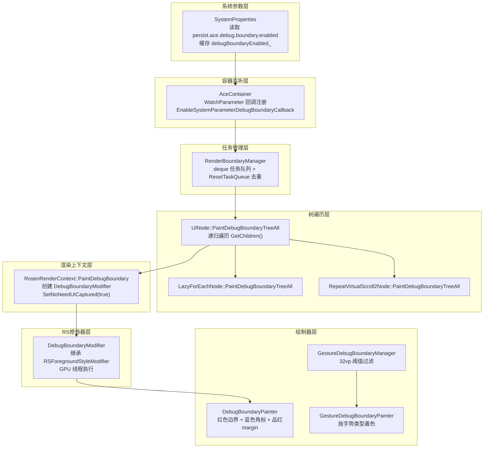
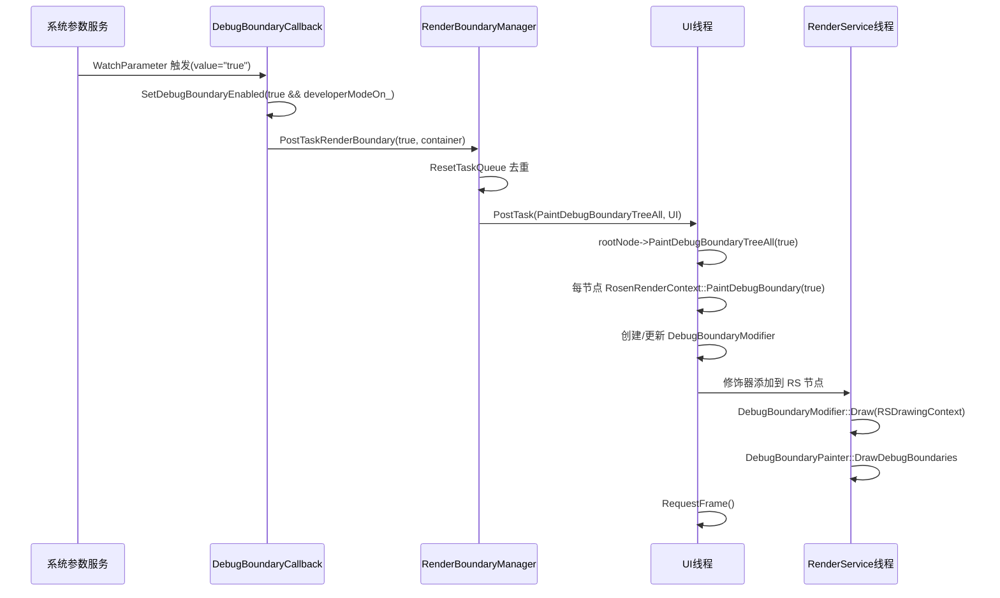

# 架构设计

> 确认目标仓和模块的架构约束、关键设计决策、Spec 拆分方向。

## 设计元数据

| Field | Content |
|-------|---------|
| Design ID | `DESIGN-Func-03-08-06` |
| 关联需求 | 已有能力补录（无独立 requirement.md） |
| 关联 Epic | 无 |
| 目标 Feature | Feat-01: 布局边界显示调试能力 |
| 复杂度 | 复杂 |
| 目标版本 | API 10+（开发者模式系统参数调控） |
| Owner | ArkUI SIG |
| 状态 | Baselined（已有实现补录） |

## 需求基线

| 项 | 补充说明 |
|----|------------------|
| DFX 调试能力 | 通过系统参数开关控制布局边界和手势边界的可视化显示，仅供开发者模式使用 |
| 双管线覆盖 | NG 管线（components_ng）和 Legacy 管线（components）均需支持 |
| 运行时切换 | 布局边界支持运行时通过系统参数动态切换；手势边界需重启生效 |

## 上下文和现状

### 涉及仓和模块

| 仓库 | 补充架构说明 |
|------|-------------|
| ace_engine | 全部实现均在 ace_engine 仓库内，无跨仓依赖 |

### 调用链层级分析

| 层 | 模块 | 职责 | 修改类型 |
|----|------|------|----------|
| 系统参数层 | `adapter/ohos/osal/system_properties.cpp` | 读取 `persist.ace.debug.boundary.enabled` 和 `persist.ace.debug.gesture.boundary.enabled`，缓存标志，提供门控判断 | 已有实现（补录） |
| 容器监听层 | `adapter/ohos/entrance/ace_container.cpp` | 注册 `WatchParameter` 回调，运行时响应参数变更，委托 `RenderBoundaryManager` | 已有实现（补录） |
| 任务管理层 | `frameworks/core/common/render_boundary_manager.cpp` | 任务队列管理、去重合并、PostTask 到 UI 线程执行全树遍历 | 已有实现（补录） |
| 树遍历层 | `frameworks/core/components_ng/base/ui_node.cpp` | `PaintDebugBoundaryTreeAll` 递归遍历节点树，对每个节点调用 `PaintDebugBoundary` | 已有实现（补录） |
| 渲染上下文层 | `frameworks/core/components_ng/render/adapter/rosen_render_context.cpp` | 创建 `DebugBoundaryModifier`，设置绘制任务 lambda，添加到 RS 节点 | 已有实现（补录） |
| RS 修饰器层 | `frameworks/core/components_ng/render/adapter/debug_boundary_modifier.h` | 继承 `RSForegroundStyleModifier`，在 RenderService 线程执行绘制 | 已有实现（补录） |
| 绘制器层（NG） | `frameworks/core/components_ng/render/debug_boundary_painter.cpp` | 绘制布局边界（红色矩形）、角标（蓝色 L 型）、margin 区域（品红色半透明） | 已有实现（补录） |
| 绘制器层（Legacy） | `frameworks/core/components/common/painter/debug_boundary_painter.h` | Legacy 管线的静态绘制方法，功能与 NG 对齐 | 已有实现（补录） |
| 手势边界管理器 | `frameworks/core/components_ng/manager/gesture_debug/gesture_debug_boundary_manager.cpp` | 收集活跃手势状态，构建渲染信息，32vp 最小尺寸过滤 | 已有实现（补录） |
| 手势边界绘制器 | `frameworks/core/components_ng/render/gesture_debug_boundary_painter.cpp` | 按手势类型着色绘制手势响应区域边界 | 已有实现（补录） |

### 适用架构规则

| Rule ID | 适用原因 | 设计结论 | 验证方式 |
|---------|----------|----------|----------|
| OH-ARCH-LAYERING | 系统参数→容器→任务管理→树遍历→渲染上下文→RS修饰器→绘制器，7层调用链 | 调用方向严格自顶向下，无跨层或反向调用 | 代码评审 |
| OH-ARCH-SUBSYSTEM | 无跨子系统调用（RenderService 为同进程图形引擎） | 不涉及跨子系统 | N/A |
| OH-ARCH-COMPONENT-BUILD | 无 BUILD.gn / bundle.json 变更（已有实现补录） | 无新增构建目标 | 构建验证 |
| OH-ARCH-ERROR-LOG | 无错误码定义（调试功能，静默降级） | 参数读取失败时默认 "false"（关闭），不产生错误码 | 代码评审 |

## 不涉及项承接

| 维度 | 设计结论 |
|------|----------|
| 公共 API 变更 | 不涉及。该能力为框架内部 DFX 功能，通过系统参数 `persist.ace.debug.boundary.enabled` 和 `persist.ace.debug.gesture.boundary.enabled` 控制，无 SDK API |
| 构建系统影响 | 不涉及。所有源文件已在现有 BUILD.gn 中注册 |
| 跨子系统依赖 | 不涉及。全部逻辑在 ace_engine 内完成 |

## 关键设计决策

| 决策 ID | 问题 | 推荐方案 | 探索过的替代方案 | 取舍理由 | 影响 |
|---------|------|----------|-----------------|----------|------|
| ADR-1 | 布局边界标志是否应受开发者模式门控？ | 是。初始化时 AND 运算 `IsDebugBoundaryEnabled() && developerModeOn_`（`system_properties.cpp:770`），`SetDebugBoundaryEnabled` 再次 AND（`:1330`）。手势边界不受门控（`:771`） | (A) 两个标志都不门控 — 安全风险：生产环境可能泄露布局信息 (B) 两个标志都门控 — 手势边界功能受限 | 布局边界包含完整的组件几何信息（margin/border/padding），泄露风险高；手势边界仅显示手势响应区域，风险较低。这种不对称设计是 **推测** 的安全分级策略 | 开发者可能预期两个参数行为一致；AC-1.4 需明确记录此差异 |
| ADR-2 | 边界开关是否支持运行时切换？ | 布局边界：支持。通过 `WatchParameter` 注册回调（`ace_container.cpp:4668-4669`），参数变更时即时触发 `RenderLayoutBoundary`（`:4645-4651`）。手势边界：不支持。仅在初始化时读取一次（`system_properties.cpp:118-124`），无 `WatchParameter` 注册 | (A) 两者都运行时切换 — 手势边界需要监听所有手势事件路由，运行时开启开销大 (B) 两者都重启切换 — 布局边界调试体验差 | 布局边界绘制开销恒定（树遍历 + RS 修饰器），适合运行时切换；手势边界需要在每次手势分发时检查状态，重启模式更安全 | 手势边界修改后需重启应用；AC-2.4 需明确此约束 |
| ADR-3 | 快速 toggle 参数时如何避免重复全树重绘？ | 使用 deque 任务队列 + `ResetTaskQueue` 去重机制（`render_boundary_manager.cpp:26,53-73`）。如果新任务的目标值与队首相同，则取消队尾冗余任务；如果不同，则取消队首任务 | (A) 无去重，每个参数变更都触发全树遍历 — 大型 UI 树可能卡顿 (B) 使用 debounce/throttle — 延迟不够灵活 | deque 方案保证最终状态一致（最后一个有效任务的目标值生效），同时最小化中间态重绘 | 高频 toggle 场景下任务被合并；AC-1.5 需验证 |
| ADR-4 | 惰性列表（LazyForEach/Repeat）的离屏/回收项如何绘制边界？ | 4 种语法节点覆盖 `PaintDebugBoundaryTreeAll`，遍历内部缓存而非 `GetChildren()`：`LazyForEachNode`、`LazyForEachBuilder`、`RepeatVirtualScroll2Node`、`RepeatVirtualScrollNode` | (A) 不覆盖 — 离屏项不显示边界，调试盲区 (B) 强制加载所有项 — 性能开销巨大，破坏惰性加载语义 | 覆盖方案仅遍历已缓存的活跃项，不触发额外创建，保持惰性语义 | 惰性列表中仅缓存项显示边界；AC-1.6 需验证 |
| ADR-5 | NG 与 Legacy 两套实现如何保持视觉一致性？ | 两套独立实现：NG 使用 `DebugBoundaryPainter` 实例化对象（`debug_boundary_painter.cpp:20-26`），Legacy 使用 `DebugBoundaryPainter` 静态方法（`components/common/painter/debug_boundary_painter.h:38-46`）。颜色常量相同：RED `0xFFFA2A2D`、BLUE `0xFF007DFF`、MAGENTA `0x3FFF00AA`。Legacy 额外需 per-component 标志 `needPaintDebugBoundary_`，NG 依赖全局标志 + per-node `needDebugBoundary_`（默认 `true`，基类默认 `false`） | (A) 共享一套绘制代码 — 两管线数据结构差异大（SizeF/Size、OffsetF/Offset），合并成本高 (B) 完全独立不约束一致性 — 视觉不一致风险 | 两套独立实现但颜色/尺寸常量对齐，接受类型差异（float vs double）。NG 的 `needDebugBoundary_` 默认 `true`（`rosen_render_context.h:929`），Legacy 基类默认 `false`（`render_context.h:121-124`） | 跨管线迁移时需注意默认值差异；AC-1.7 需验证视觉一致性 |
| ADR-6 | 边界绘制应在哪个线程执行？ | 使用 `RSForegroundStyleModifier`（`debug_boundary_modifier.h:25`），在 RenderService/GPU 线程执行绘制。`SetNoNeedUICaptured(true)`（`rosen_render_context.cpp:1052`）确保修饰器不出现在 UI 截图中 | (A) 在 UI 线程直接绘制到 canvas — 阻塞 UI 线程，性能差 (B) 使用独立的 overlay 层 — 增加层级复杂度 | RS 修饰器利用 RenderService 线程的 GPU 加速，通过 `RSProperty<bool>` 驱动失效重绘，不阻塞 UI 线程 | 截图功能不包含调试边界；AC-1.8 需验证截图排除 |
| ADR-7 | 手势边界是否应有最小尺寸阈值？ | 是。`GestureDebugBoundaryManager` 跳过小于 32vp x 32vp 的节点（`gesture_debug_boundary_manager.h:59`，`gesture_debug_boundary_manager.cpp:121-124`）。布局边界无此限制 | (A) 不设阈值 — 小组件边界重叠密集，可读性差 (B) 使用更大的阈值（如 48vp） — 过多组件被跳过，调试覆盖不足 | 32vp 是 OHOS 触控目标最小尺寸标准，低于此尺寸的节点手势边界信息量有限 | 小于 32vp 的组件不显示手势边界；AC-2.5 需验证 |

## 设计骨架

### 骨架范围

| 骨架项 | 目标 | 不包含 | 验证方式 |
|--------|------|--------|----------|
| 布局边界绘制 | 为每个 FrameNode 绘制布局边界（margin + border + corner） | 性能分析、自动化截图对比 | 手动验证 + 单元测试 |
| 手势边界绘制 | 为活跃手势节点绘制着色边界 | 手势事件分发逻辑修改 | 手动验证 + 单元测试 |
| 运行时切换 | 布局边界支持参数变更即时生效 | 手势边界运行时切换 | 手动验证 |
| 开发者模式门控 | 布局边界受开发者模式保护 | 手势边界门控（设计决策不门控） | 手动验证 |

### 骨架 Spec 拆分

| Task ID | 目标 | 受影响文件 | AC |
|---------|------|-----------|-----|
| TASK-SKELETON-1 | 注册 Feat-01 spec 并建立设计基线 | `specs/03-engine-framework/08-dfx-foundation/06-layout-boundary-display/Feat-01-layout-boundary-display-spec.md` | 全部 AC |

## 后续 Task 拆分

| Task ID | 目标 | 受影响文件 | 依赖 |
|---------|------|-----------|------|
| TASK-1 | 补录布局边界显示调试能力规格（本次） | `Feat-01-layout-boundary-display-spec.md`, `design.md` | 无（已有实现补录） |

## API 签名、Kit 与权限

### 新增 API

无新增 API。该功能为框架内部 DFX 能力，通过系统参数控制：

- `persist.ace.debug.boundary.enabled`（布局边界开关，`"true"`/`"false"`）
- `persist.ace.debug.gesture.boundary.enabled`（手势边界开关，`"true"`/`"false"`，需编译宏 `GESTURE_DEBUG_BOUNDARY_SUPPORTED`）

### 变更/废弃 API

无。

## 构建系统影响

### BUILD.gn 变更

无。所有源文件已在现有 BUILD.gn 中注册。

### bundle.json 变更

无。

## 可选设计扩展

### 架构图

### 数据流/控制流

| 步骤 | 调用方 | 被调用方 | 数据/接口 | 说明 |
|------|--------|---------|-----------|------|
| 1 | 系统参数服务 | `IsDebugBoundaryEnabled()` | `GetParameter("persist.ace.debug.boundary.enabled", "false")` | 进程启动时读取初始值 |
| 2 | 进程初始化 | `SystemProperties` 静态成员初始化 | `debugBoundaryEnabled_ = IsDebugBoundaryEnabled() && developerModeOn_` | AND 门控缓存标志 |
| 3 | `AceContainer::AddWatchSystemParameter` | `SystemProperties::AddWatchSystemParameter` | `ENABLE_DEBUG_BOUNDARY_KEY`, `EnableSystemParameterDebugBoundaryCallback` | 注册运行时监听 |
| 4 | 参数变更 | `EnableSystemParameterDebugBoundaryCallback` | `key`, `value`, `context` | 回调被触发 |
| 5 | 回调 | `SystemProperties::SetDebugBoundaryEnabled` | `isDebugBoundary` | 更新缓存标志（再次 AND developerModeOn_） |
| 6 | 回调 | `container->RenderLayoutBoundary(isDebugBoundary)` | bool | 委托任务管理器 |
| 7 | `RenderLayoutBoundary` | `renderBoundaryManager_->PostTaskRenderBoundary` | bool, container | 进入任务队列 |
| 8 | `PostTaskRenderBoundary` | `ResetTaskQueue` | bool | 去重检查 |
| 9 | UI 线程 | `rootNode->PaintDebugBoundaryTreeAll(flag)` | bool | 全树递归遍历 |
| 10 | `PaintDebugBoundaryTreeAll` | `child->PaintDebugBoundary(flag)` | bool | 每节点调用 |
| 11 | `FrameNode::PaintDebugBoundary` | `RosenRenderContext::PaintDebugBoundary(true)` | bool | 委托渲染上下文 |
| 12 | `PaintDebugBoundary` | `DebugBoundaryModifier` 创建/更新 | paintTask lambda | 添加 RS 修饰器 |
| 13 | RenderService 线程 | `DebugBoundaryModifier::Draw` | `RSDrawingContext` | GPU 线程执行绘制 |
| 14 | `Draw` | `DebugBoundaryPainter::DrawDebugBoundaries` | `RSCanvas`, `OffsetF` | 实际绘制边界 |

### 时序设计

### 线程与并发模型

| 操作 | 发起线程 | 回调/执行线程 | 跨进程边界 | 线程安全 | 重入约束 |
|------|---------|-------------|-----------|---------|---------|
| `WatchParameter` 回调 | 系统参数服务线程 | 系统参数服务线程 | 无（同进程 SDK） | `debugBoundaryEnabled_` 为 `std::atomic<bool>` | 安全 |
| `SetDebugBoundaryEnabled` | 任意线程 | 调用方线程 | 无 | 原子存储 | 安全 |
| `PostTaskRenderBoundary` | 系统参数服务线程 | — | 无 | `renderLayoutBoundaryTaskMutex_` 保护 | 安全 |
| `PaintDebugBoundaryTreeAll` | — | UI 线程（PostTask） | 无 | 单线程访问 | 不可重入 |
| `DebugBoundaryModifier::Draw` | — | RenderService 线程 | 同进程跨线程 | paintTask lambda 值捕获，无共享状态 | 安全 |

并发场景：

| 场景 | 线程交互 | 安全保证 |
|------|---------|---------|
| 快速 toggle 参数 | 系统参数线程入队 vs UI 线程出队 | `renderLayoutBoundaryTaskMutex_` 互斥锁 |
| UI 线程树遍历 vs RS 线程绘制 | UI 线程创建修饰器 vs RS 线程执行 Draw | RS 框架内部同步，`RSProperty<bool>` 驱动失效 |

### 测试性设计

| 测试层级 | 测试目标 | Mock 策略 | 验证方式 |
|---------|---------|-----------|---------|
| 单元测试 | `RenderBoundaryManager` 任务去重逻辑 | Mock TaskExecutor | 验证 `ResetTaskQueue` 返回值和队列状态 |
| 单元测试 | `DebugBoundaryPainter` 绘制坐标 | 无 Mock，直接调用绘制方法 | 验证 RSRect 参数（坐标、尺寸） |
| 单元测试 | `GestureDebugBoundaryManager` 32vp 阈值 | Mock GeometryNode + PipelineContext | 验证小节点返回空 info |
| 集成测试 | 运行时 toggle 全流程 | Mock SystemParameter | 验证 `PaintDebugBoundaryTreeAll` 被调用 |
| 手动验证 | 视觉效果 | 无 | 开启参数后肉眼检查边界颜色和位置 |

## 详细设计

### 布局边界绘制参数

绘制常量定义在 `frameworks/core/components_ng/render/debug_boundary_painter.cpp:20-26`：

| 元素 | 颜色值 | 线宽 | 说明 |
|------|--------|------|------|
| 布局边界框 | `0xFFFA2A2D`（红色） | 1.0 px | `BOUNDARY_COLOR`, `BOUNDARY_STROKE_WIDTH` |
| 四角角标 | `0xFF007DFF`（蓝色） | 1.0 px | `BOUNDARY_CORNER_COLOR`，长度 8.0 px（`BOUNDARY_CORNER_LENGTH`） |
| Margin 区域 | `0x3FFF00AA`（品红色半透明） | 填充 | `BOUNDARY_MARGIN_COLOR`，alpha = 0x3F |

绘制流程（`debug_boundary_painter.cpp:35-40`）：
1. `PaintDebugBoundary` — 红色矩形框，覆盖 marginFrameSize 区域
2. `PaintDebugCorner` — 蓝色 L 型角标，四角各画两条线
3. `PaintDebugMargin` — 品红色半透明填充，绘制上/下/左/右四块 margin 区域

### NG 管线门控链路

1. **全局标志检查**：`rosen_render_context.cpp:1006` — `if (SystemProperties::GetDebugBoundaryEnabled())` 在 `SyncGeometryProperties` 中检查
2. **per-node 标志检查**：`rosen_render_context.cpp:1025` — `if (!NeedDebugBoundary()) return` 在 `PaintDebugBoundary` 中检查
3. **修饰器创建**：`rosen_render_context.cpp:1049-1061` — 仅对 `RSCanvasNode` 类型创建修饰器
4. **绘制区域更新**：`rosen_render_context.cpp:1055-1058` — 通过 `UpdateDrawRegion` 设置绘制区域

### Legacy 管线门控链路

Legacy 管线通过 `RosenRenderBox` 的 `needPaintDebugBoundary_` 标志控制，需在组件级别设置该标志。全局 `GetDebugBoundaryEnabled()` 标志也需要为 `true`。

`needDebugBoundary_` 默认值差异：
- NG（`RosenRenderContext`）：`true`（`rosen_render_context.h:929`）
- 基类（`RenderContext`）：`false`（`render_context.h:121-124`）

### 手势边界着色策略

手势边界按手势类型着色，颜色通过 `ResolveGestureColor` 从资源系统获取（`gesture_debug_boundary_manager.cpp:140-144`）。如果资源查找失败，回退到 `Color::RED`（`:144`）。

手势掩码使用 `std::bitset<6>`（`GESTURE_DEBUG_TYPE_COUNT = 6`，`gesture_debug_boundary_manager.h:32`），每位对应一种 `GestureListenerType`。

### 惰性列表特殊遍历

| 节点类型 | 覆盖方法 | 遍历对象 | 源文件 |
|---------|---------|---------|--------|
| `LazyForEachNode` | `PaintDebugBoundaryTreeAll` | 内部缓存项 | `lazy_for_each_node.h` |
| `LazyForEachBuilder` | `PaintDebugBoundaryTreeAll` | 活跃 builder 项 | `lazy_for_each_builder.h` |
| `RepeatVirtualScroll2Node` | `PaintDebugBoundaryTreeAll` | 活跃虚拟滚动项 | `repeat_virtual_scroll_2_node.cpp` |
| `RepeatVirtualScrollNode` | `PaintDebugBoundaryTreeAll` | 活跃虚拟滚动项 | `repeat_virtual_scroll_node.h` |

这些覆盖确保已缓存的活跃项被绘制边界，但不会触发额外项的创建。

## 风险和开放问题

| 项 | 类型 | 影响 | 处理方式 | Owner |
|----|------|------|---------|-------|
| ADR-1 门控不对称可能导致用户困惑 | 架构 | 中 | 规格文档明确记录差异；未来版本可考虑统一 | ArkUI SIG |
| ADR-2 手势边界不支持运行时切换 | 架构 | 低 | 规格文档约束声明；未来版本可增加 WatchParameter | ArkUI SIG |
| ADR-5 NG/Legacy needDebugBoundary_ 默认值不同 | 兼容性 | 中 | 规格文档记录；跨管线迁移时需注意 | ArkUI SIG |
| ADR-7 小组件（<32vp）不显示手势边界 | 测试 | 低 | 规格文档记录阈值；测试用例需覆盖边界值 | ArkUI SIG |
| DebugBoundaryModifier 仅对 RSCanvasNode 创建 | 架构 | 低 | 非 RSCanvasNode 类型节点不显示边界（推测为设计意图） | ArkUI SIG |

## 设计审批

- [x] 需求基线已确认，设计覆盖 P0/P1 AC
- [x] 不涉及项已承接，N/A 和展开项都有结论
- [x] 涉及仓和模块职责清楚
- [x] 调用链层级分析完整，每层覆盖到位
- [x] 适用架构规则已识别并形成设计结论
- [x] 分层和子系统边界合规
- [x] API 变更有签名、权限、错误码和兼容性说明
- [x] BUILD.gn/bundle.json 影响明确
- [x] 设计输出和后续 Task 拆分明确
- [x] 关键设计决策有理由和影响说明
- [x] 风险和开放问题有 Owner

**结论:** 通过（已有实现补录）
