# 架构设计
> 确认目标仓和模块的架构约束、关键设计决策、Spec 拆分方向。

## 设计元数据

| Field | Content |
|-------|---------|
| Design ID | DESIGN-Func-03-09-01 |
| 关联需求 | 已有能力补录（无独立 requirement.md） |
| 关联 Epic | 无 |
| 目标 Feature | Feat-01 IPC安全框架; Feat-02 InspectorTree查询与Web子树聚合; Feat-03 事件上报与注册计数门控; Feat-04 命令下发与同步请求保护; Feat-05 翻译能力与DFX并发保护; Feat-06 内容变化检测与阈值管理; Feat-07 查询能力与辅助Dump; Feat-08 SA验证服务与hidumper命令路由; Feat-09 页面场景规则化感知; Feat-10 WM UIContentRemoteObj验证链路 |
| 复杂度 | 关键 |
| 目标版本 | API 9+（已有实现） |
| Owner | ArkUI SIG |
| 状态 | Baselined（已有实现补录） |

## 需求基线

| 项 | 补充说明 |
|----|----------|
| IUiContentService IPC 接口 | 52 个 IPC 事务码，44 个纯虚方法 + 10 个带默认实现 |
| ReportService IPC 接口 | 25 个 IPC 事务码，23 个纯虚方法 + 2 个带默认实现 |
| SA-only 访问门控 | OnRemoteRequest 入口处 IsSACalling + interface token 校验，无 per-method 权限区分 |
| 事件上报广播 | 9 类事件 atomic<int32_t> 注册计数门控（另有 webTaskNums_ atomic 子树聚合计数器，非事件门控），上报时广播至所有已连接 SA 进程 |
| webFocusEvent 门控 | bool + mutex 全局开关（非 per-process），与其他 9 类 atomic 计数器不一致 |
| InspectorTree 查询 | GetInspectorTree / GetVisibleInspectorTree，1500ms 超时，ParamConfig 过滤 |
| Web 子树聚合 | webTaskNums_ atomic 计数器控制异步 Web 子树合并 |
| HitTest 分包 IPC | 128KB 阈值分段传输（Ashmem），区别于 InspectorTree 常规单包上报 |
| SendCommandAsync 错误码 | 返回 11（无回调）/ 12（自处理错误）/ 13（节点空），Code 10 已文档化但当前 lambda 未产出 |
| 翻译双并发门控 | RegisterPageTranslateTextCallback（single-slot mutex）+ SyncRequestGuard（CAS atomic_bool） |
| SA 死亡清理 | ordered locks → state reset → manager calls（ResetTranslate / ResetPageTransition） |
| InspectorJsonValue cJSON 所有权 | isRoot_ 标志：root 对象拥有整棵 cJSON 树（析构时 cJSON_Delete），child 引用非拥有 |
| ContentChangeConfig | 5 字段阈值配置（默认 minReportTime=100ms, reportDelayTime=600ms, textContentRatio=0.15, minWidth=100px, minHeight=100px），ChangeType 9 值枚举，页面场景规则化感知规则检测 |
| UiSaService SA | SA_ID=16666，DECLEAR_SYSTEM_ABILITY，Dump + DUMP_MAP 25 条路由 |
| UiSessionManager | Meyers singleton (static UiSessionManagerOhos)，~116 虚方法，21 个 Save* + 2 个 Set* + 2 个 Register* = 25 个回调注册方法 |

### 设计目标

| 目标 | 说明 |
|------|------|
| 跨进程隔离 | `UiContentStub::OnRemoteRequest` 先校验调用方 token 为 native SA，再校验 interface token。 |
| 按需上报 | 事件注册使用原子计数；组件变化事件还通过 `ComponentEventType` mask 控制上报类型。 |
| UI线程收敛 | `UIContentImpl` 保存的回调通过 `TaskExecutor` 投递到 UI 线程，再访问 `PipelineContext` 和节点树。 |
| 多实例翻译 | `UiSessionManagerOhos` 通过当前 instanceId 回调从 `translateManagerMap_` 选择 `UiTranslateManager`。 |
| 大数据保护 | HitTest 信息按 `ONCE_IPC_SEND_DATA_MAX_SIZE` 分段回传，InspectorTree 用 Web 任务计数聚合异步 Web 子树。 |

## 上下文和现状

### 涉及仓和模块

| 仓库 | 补充架构说明 |
|------|-------------|
| ace_engine/interfaces/inner_api/ui_session/ui_content_service_interface.h | IUiContentService + ReportService 双 IPC 接口定义（52 + 25 事务码） |
| ace_engine/interfaces/inner_api/ui_session/ui_session_manager.h:47-381 | UiSessionManager 虚基类，~116 虚方法，10 atomic<int32_t>（9 事件计数器 + webTaskNums_），21 个 Save* + 2 个 Set* + 2 个 Register* |
| ace_engine/adapter/ohos/entrance/ui_session/ui_session_manager_ohos.h | UiSessionManagerOhos 实现类，IPC 路由，reportObjectMap_ |
| ace_engine/adapter/ohos/entrance/ui_session/ui_session_manager_ohos.cpp | 2002 行，事件上报、session 管理、翻译并发门控、SA 死亡清理 |
| ace_engine/adapter/ohos/entrance/ui_session/ui_content_stub.cpp | OnRemoteRequest 分发，IsSACalling + interface token 校验 |
| ace_engine/adapter/ohos/entrance/ui_session/ui_content_stub_impl.cpp | 委托转发至 UiSessionManager::GetInstance() |
| ace_engine/adapter/ohos/entrance/ui_session/ui_content_proxy.cpp | 1447 行，SendPageTranslateRequest、SyncRequestGuard、HitTest 分包 |
| ace_engine/adapter/ohos/entrance/ui_session/ui_report_stub.cpp | PageTranslate callback 注册、超时、watchdog |
| ace_engine/adapter/ohos/entrance/ui_content_impl.cpp:6253-6378 | InitUISessionManagerCallbacks ~25 回调注册 |
| ace_engine/interfaces/inner_api/ui_session/param_config.h | ParamConfig / ContentChangeConfig / ComponentEventType / ChangeType |
| ace_engine/interfaces/inner_api/ui_session/ui_session_json_util.h | InspectorJsonValue (cJSON RAII) + InspectorJsonUtil 工厂 |
| ace_engine/adapter/ohos/entrance/ui_session/ui_session_json_util.cpp | InspectorJsonValue 实现细节（isRoot_ 所有权） |
| ace_engine/interfaces/inner_api/ui_session/ui_translate_manager.h | UiTranslateManager 翻译管理器虚基类 |
| ace_engine/adapter/ohos/entrance/ace_translate_manager.cpp | UiTranslateManagerImpl 实现 |
| ace_engine/frameworks/core/components_ng/manager/content_change_manager/ | ContentChangeManager 内容变更检测 |
| ace_engine/interfaces/inner_api/ui_session/ui_session_sample/ | UiSaService SA 示例（SA_ID=16666） |
| ace_engine/interfaces/inner_api/ui_session/ui_session_request_guard.h | SyncRequestGuard RAII compare_exchange_strong |
| ace_engine/interfaces/inner_api/ui_session/ui_session_ipc_util.h | UiSessionIpcUtil（Ashmem 64KB / 128KB 阈值） |

### 调用链层级分析

| 层 | 模块 | 职责 | 修改类型 |
|----|------|------|----------|
| SA 入口层 | UiSaService (ui_sa_service.h:28) | SA_ID=16666 单例，OnStart/OnStop/Dump，DUMP_MAP 25 条命令路由 | 已有实现 |
| IPC 客户端层 | UIContentServiceProxy (ui_content_proxy.h:28) | 54 方法 IPC 代理，SendRemoteRequest | 已有实现 |
| IPC Stub 层 | UiContentStub (ui_content_stub.cpp) | OnRemoteRequest 分发 52 事务码，IsSACalling + interface token 校验 | 已有实现 |
| Stub 实现层 | UIContentServiceStubImpl (ui_content_stub_impl.h:26) | 委托 UiSessionManager::GetInstance() | 已有实现 |
| Hub 层 | UiSessionManager (ui_session_manager.h:47) | Meyers singleton，~116 虚方法，10 atomic<int32_t>，21 Save* + 2 Set* + 2 Register* | 已有实现 |
| Hub 实现层 | UiSessionManagerOhos (ui_session_manager_ohos.cpp) | 2002 行，IPC 路由 + reportObjectMap_ + 并发门控 | 已有实现 |
| Report IPC 层 | UiReportProxy (ui_report_proxy.h) | 25 方法反向 IPC 代理（app→SA 上报） | 已有实现 |
| Report Stub 层 | UiReportStub (ui_report_stub.cpp) | OnRemoteRequest 分发 25 事务码 + Register*Callback 管理 | 已有实现 |
| JSON 工具层 | InspectorJsonValue (ui_session_json_util.h:30) | cJSON RAII 包装，isRoot_ 所有权控制 | 已有实现 |
| 管线回调层 | UIContentImpl::InitUISessionManagerCallbacks (ui_content_impl.cpp:6253) | ~25 回调注册到 UiSessionManager | 已有实现 |
| 管线执行层 | PipelineContext::GetInspectorTree (pipeline_context.cpp:7510) | Inspector/SimplifiedInspector 树生成 + PostSyncTaskTimeout 1500ms | 已有实现 |
| 翻译层 | UiTranslateManager (ui_translate_manager.h) | WebView + Page 双通道翻译管理 | 已有实现 |
| 翻译实现层 | UiTranslateManagerImpl (ace_translate_manager.cpp) | 翻译回调存储 + 并发门控 | 已有实现 |
| 内容变更层 | ContentChangeManager | ChangeType 检测 + ContentChangeConfig 阈值 | 已有实现 |
| 预览层 | InspectorClient + JsInspectorManager | preview-only 回调机制 | 已有实现 |
| IPC 工具层 | SyncRequestGuard (ui_session_request_guard.h:23) | RAII compare_exchange_strong 单请求互斥 | 已有实现 |
| IPC 工具层 | UiSessionIpcUtil (ui_session_ipc_util.h:27) | Ashmem 大字符串传输 64KB/128KB 阈值 | 已有实现 |

### 适用架构规则

| Rule ID | 适用原因 | 设计结论 | 验证方式 |
|---------|----------|----------|----------|
| OH-ARCH-IPC-SAF | UiSaService 为 IPC 系统能力 (SA_ID=16666) | SA 模式实现，OnRemoteRequest 入口 IsSACalling + interface token 校验 | 集成测试 |
| OH-ARCH-LAYERING | SA→Proxy→Stub→StubImpl→Hub→Pipeline→Node→Pattern 八层调用链 | 严格自上而下，不允许跨层 | 代码评审 |
| OH-ARCH-SUBSYSTEM | inner_api(ui_session) vs core(pipeline) vs adapter(preview/ohos) | inner_api 仅通过 callback 解耦，不直接依赖 core | 依赖检查 |
| OH-ARCH-ERROR-LOG | ErrorCode + SendCommandAsync(11/12/13) + MultiImageQueryErrorCode + WebRequestErrorCode | 统一错误码枚举，IPC 失败返回 FAILED | 单测 / hilog |
| OH-ARCH-COMPONENT-BUILD | ui_session inner_api 编译为共享库 SA | BUILD.gn 独立目标 | 构建验证 |

## 不涉及项承接

| 维度 | 设计结论 |
|------|----------|
| 持久化 | IPC 数据为即时传输，不持久化 |
| Public/System API | 全部为 InnerApi，无 Public/System API 变更 |
| SDK d.ts 验证 | 框架内部能力，无 SDK .d.ts 文件需交叉验证 |
| per-method 权限 | OnRemoteRequest 仅做 SA-level 门控，不区分具体方法权限——当前实现不涉及方法级权限需求 |
| 第三方进程接入 | 仅 SA 进程可接入，非 SA 进程调用 IsSACalling 返回 false 直接拒绝 |

## 关键设计决策

| 决策 ID | 问题 | 推荐方案 | 探索过的替代方案 | 取舍理由 | 影响 |
|---------|------|----------|-----------------|----------|------|
| ADR-1 | IPC 访问门控模型 | OnRemoteRequest 入口统一 IsSACalling + interface token 校验，不做 per-method 权限区分；事件上报广播至所有已连接 SA 进程 | per-method 权限表 / 事件按进程定向发送 | SA 进程已通过系统能力注册验证可信；per-method 权限增加维护成本且当前无需求；广播模式保证所有 SA 工具同步收到事件 | ui_content_stub.cpp OnRemoteRequest |
| ADR-2 | 事件注册计数门控不一致 | 9 类事件使用 atomic<int32_t> per-process 引用计数（Click/Search/TextChange/Router/ComponentChange/Scroll/LifeCycle/SelectText/PageSceneRule），但 webFocusEvent 使用 bool + mutex 全局开关而非 per-process 计数器 | 统一为 atomic 计数器 | webFocusEvent 在当前实现中被作为全局开关处理（所有进程共享一个 bool），而非 per-process 注册计数；规格需标注此不一致 | ui_session_manager.h:310-380 |
| ADR-3 | 双并发门控模式 | RegisterPageTranslateTextCallback 使用 single-slot mutex（互斥占位）；GetCurrentAbilityLanguageInfo 使用 SyncRequestGuard（CAS atomic_bool compare_exchange_strong） | 统一为 SyncRequestGuard 或统一为 mutex | Page 翻译为单回调插槽，mutex 保护"谁占位"；语言查询为一次性同步请求，CAS 保证"谁先到谁执行"——两种语义不同 | ui_session_manager_ohos.cpp RegisterPageTranslateTextCallback vs ui_session_request_guard.h:25-41 |
| ADR-4 | Web 子树聚合与分包 | InspectorTree 使用 webTaskNums_ atomic 计数器等待异步 Web 子树合并后单包上报；HitTest 使用 128KB 阈值分段 IPC（Ashmem 分割） | InspectorTree 也采用分段上报 | InspectorTree JSON 通常 < 1MB 不需分包；HitTest 数据可达 131KB+ 需分段；接口预留 partNum/isLastPart 分包参数但当前 InspectorTree 始终单包 | ui_session_manager_ohos.cpp:1023-1024 vs :1098-1118 |
| ADR-5 | SendCommandAsync 错误码语义 | 返回 11（TaskExecutor null / 回调未注册）/ 12（自处理错误 / 默认返回值）/ 13（node null）；Code 10 在接口注释中文档化但当前 lambda 未产出 | 统一返回 bool 或单一错误码 | 不同错误类型需不同处理策略：11 表示回调未注册需重新初始化，13 表示节点已销毁需 UI 更新；Code 10 为 Pipeline null 但当前 lambda 在 Pipeline 为空时不执行到返回路径 | ui_content_service_interface.h:206-217 |
| ADR-6 | SA 死亡清理顺序 | ordered locks → state reset → manager calls（ResetTranslate / ResetPageTransition） | 无序清理或仅 reset state 不调 manager | 有序清理保证：先持锁防止并发访问已失效数据，再重置状态使后续请求立即失败，最后调 manager 清理回调资源避免悬空引用 | ui_content_proxy.cpp OnRemoteDied |
| ADR-7 | InspectorJsonValue cJSON 所有权 | isRoot_ 标志控制：root 对象析构时 cJSON_Delete 释放整棵树，child 引用析构时不释放（非拥有） | 引用计数共享所有权 | cJSON 库不支持引用计数，isRoot_ 方式最简单且与 cJSON_Delete 语义匹配；child 引用生命周期由 root 保证 | ui_session_json_util.h:30-70, ui_session_json_util.cpp |
| ADR-8 | 页面场景规则化感知检测收敛模式 | 页面场景规则化感知复用 ContentChange 的页面级稳定上报点，检测统一收敛到 OnVsyncEnd FlushPageSceneNodeChanged | 页面场景规则化感知独立定时检测 | 复用稳定上报点保证检测仅在页面内容真正稳定后触发，避免帧率影响；独立定时检测增加额外调度开销和不确定性 | ui_session_manager_ohos.h:181-197, content_change_manager.cpp |
| ADR-9 | WM 验证链路跨仓定界 | 本规格为跨仓验证性规格，WindowSessionImpl fallback 为验证性逻辑，正式修复需由 window_manager 评估焦点窗口选择和安全边界 | 将 WM 变更纳入 ace_engine 规格 | WM 仓独立维护窗口策略和安全边界；ace_engine 仅定义 UIContent::GetRemoteObj 返回值语义 | ui_sa_service.cpp:241, ui_content_impl.h:383 |

## 设计骨架

### 骨架范围

| 骨架项 | 目标 | 不包含 | 验证方式 |
|--------|------|--------|----------|
| IPC 安全框架与连接生命周期 | UiSaService SA + OnRemoteRequest IsSACalling 门控 + UiSessionManager 单例 + SA 死亡清理 + 连接管理 | 翻译/事件/查询业务逻辑 | IPC 连通与门控验证 |
| InspectorTree 查询与 Web 子树聚合 | GetInspectorTree / GetVisibleInspectorTree + webTaskNums_ + ParamConfig 过滤 + 分包接口预留 | HitTest 分包 | Inspector 输出验证 |
| 事件上报与注册计数门控 | 9 类 atomic 计数器 + webFocusEvent bool+mutex + 广播模式 + SA 死亡计数恢复 | InspectorTree 查询 | 事件接收验证 |
| 命令下发与同步请求保护 | SendCommand sync/async/relaxed + 错误码 11/12/13 + SyncRequestGuard | InspectorTree / 翻译 | 命令下发验证 |
| 翻译能力与 DFX 并发保护 | WebView/Page 双通道 + TranslateContentScope + RegisterPageTranslateTextCallback mutex + SyncRequestGuard | 内容变更检测 | 翻译结果验证 |
| 内容变化检测与阈值管理 | ContentChangeConfig 6 字段 + ChangeType 9 值 + 页面场景规则化感知规则检测 | 查询能力 | 变更检测验证 |
| 查询能力与辅助 Dump | 页面名/图片/AI/StateMgmt/WebInfo/内容偏移/高亮内容 + NavigationManager dump + UIExtension dump | SA 验证 | 查询结果验证 |
| SA 验证服务与 hidumper 命令路由 | UiSaService::Dump DUMP_MAP 25 条 + IsSACalling + InspectorJsonValue cJSON 所有权 + UiSessionIpcUtil | 事件上报 | 命令路由验证 |
| 页面场景规则化感知能力 | TEXT_EDITOR 首批场景 + COUNT_GTE 规则运算符 + PageSceneRuleInfo/PageSceneRuleSetInfo + OnVsyncEnd FlushPageSceneNodeChanged 收敛 + TEXT_EDITOR_EXIT 退出上报 | 翻译/内容变化检测 | 页面场景规则检测验证 |
| WM UIContentRemoteObj 验证链路 | unified/sceneboard WindowSessionImpl fallback + separated WMS IPC 链路 + GetUIContentRemoteObj 权限校验 + 真机验证判据 | SA 验证 | WM remote 获取验证 |

### 骨架 Spec 拆分

| Task ID | 目标 | 受影响文件 | AC |
|---------|------|-----------|-----|
| TASK-SKELETON-1 | IPC 安全框架与连接生命周期 | ui_content_stub.cpp, ui_content_proxy.cpp, ui_session_manager.h, ui_session_manager_ohos.cpp, ui_sa_service.h, ui_session_request_guard.h | Feat-01 AC |
| TASK-SKELETON-2 | InspectorTree 查询与 Web 子树聚合 | ui_session_manager_ohos.cpp, pipeline_context.cpp, ui_session_json_util.h, ui_session_json_util.cpp, param_config.h | Feat-02 AC |
| TASK-SKELETON-3 | 事件上报与注册计数门控 | ui_session_manager.h, ui_session_manager_ohos.cpp, ui_report_stub.cpp, ui_content_proxy.cpp | Feat-03 AC |
| TASK-SKELETON-4 | 命令下发与同步请求保护 | ui_content_service_interface.h, ui_content_proxy.cpp, ui_session_request_guard.h, ui_content_impl.cpp | Feat-04 AC |
| TASK-SKELETON-5 | 翻译能力与 DFX 并发保护 | ui_translate_manager.h, ui_translate_type.h, ace_translate_manager.cpp, ui_report_stub.cpp, ui_session_manager_ohos.cpp | Feat-05 AC |
| TASK-SKELETON-6 | 内容变化检测与阈值管理 | param_config.h, content_change_manager.h, page_scene_rule_manager.h, ui_session_manager_ohos.cpp | Feat-06 AC |
| TASK-SKELETON-7 | 查询能力与辅助 Dump | ui_content_service_interface.h, navigation_manager.cpp, pipeline_context.cpp, ui_content_impl.cpp | Feat-07 AC |
| TASK-SKELETON-8 | SA 验证服务与 hidumper 命令路由 | ui_sa_service.h, ui_sa_service.cpp, ui_content_stub.cpp, ui_session_json_util.h, ui_session_ipc_util.h | Feat-08 AC |
| TASK-SKELETON-9 | 页面场景规则化感知能力 | ui_session_manager_ohos.h:181-197, content_change_manager.cpp, ui_content_impl.cpp:6817 | Feat-09 AC |
| TASK-SKELETON-10 | WM UIContentRemoteObj 验证链路 | ui_sa_service.cpp:241, ui_content.h:518, ui_content_impl.h:383, window_manager (跨仓) | Feat-10 AC |

## 后续 Task 拆分

| Task ID | 目标 | 受影响文件 | 依赖 |
|---------|------|-----------|------|
| TASK-01 | IPC 安全框架与连接生命周期 | interfaces/inner_api/ui_session/, adapter/ohos/entrance/ui_session/ | 无 |
| TASK-02 | InspectorTree 查询与 Web 子树聚合 | interfaces/inner_api/ui_session/, frameworks/core/pipeline_ng/, adapter/ohos/entrance/ui_session/ | TASK-01 |
| TASK-03 | 事件上报与注册计数门控 | interfaces/inner_api/ui_session/, adapter/ohos/entrance/ui_session/ | TASK-01 |
| TASK-04 | 命令下发与同步请求保护 | interfaces/inner_api/ui_session/, adapter/ohos/entrance/ui_session/ | TASK-01 |
| TASK-05 | 翻译能力与 DFX 并发保护 | interfaces/inner_api/ui_session/, adapter/ohos/entrance/, frameworks/core/common/ | TASK-01 |
| TASK-06 | 内容变化检测与阈值管理 | interfaces/inner_api/ui_session/, frameworks/core/components_ng/manager/ | TASK-01 |
| TASK-07 | 查询能力与辅助 Dump | interfaces/inner_api/ui_session/, frameworks/core/, adapter/ohos/entrance/ | TASK-01 |
| TASK-08 | SA 验证服务与 hidumper 命令路由 | interfaces/inner_api/ui_session/ui_session_sample/, adapter/ohos/entrance/ui_session/ | TASK-01 |
| TASK-09 | 页面场景规则化感知能力 | interfaces/inner_api/ui_session/, frameworks/core/components_ng/manager/ | TASK-01 |
| TASK-10 | WM UIContentRemoteObj 验证链路 | interfaces/inner_api/ui_session/ui_session_sample/, interfaces/inner_api/ace/, adapter/ohos/entrance/, window_manager (跨仓) | TASK-08 |

## API 签名、Kit 与权限

### 新增 API

> 本域全部为 InnerApi（框架内部 IPC 接口）。无 Public/System API 变更。

| API 签名 | 类型 | Kit | d.ts 位置 | 权限要求 | SysCap |
|----------|------|-----|----------|----------|--------|
| UiSessionManager::GetInstance() | InnerApi | ArkUI | N/A | N/A | N/A |
| UiSaService::GetInstance() | InnerApi | ArkUI | N/A | N/A | N/A |
| IUiContentService 44 纯虚方法 + 10 带默认实现 | InnerApi | ArkUI | N/A | N/A | N/A |
| ReportService 23 纯虚方法 + 2 带默认实现 | InnerApi | ArkUI | N/A | N/A | N/A |
| InspectorJsonValue 27 方法 | InnerApi | ArkUI | N/A | N/A | N/A |
| InspectorJsonUtil 5 工厂方法 | InnerApi | ArkUI | N/A | N/A | N/A |
| SyncRequestGuard | InnerApi | ArkUI | N/A | N/A | N/A |

### 变更/废弃 API

无。

## 构建系统影响

### BUILD.gn 变更

```text
文件: interfaces/inner_api/ui_session/BUILD.gn
变更说明: UiSessionManager 系统能力 (SA) 编译为共享库
```

### bundle.json 变更

无。

## 可选设计扩展

### 架构图

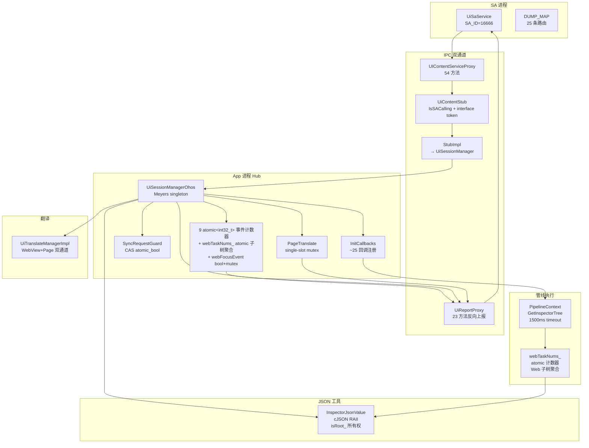

### 数据流/控制流

| 步骤 | 调用方 | 被调用方 | 数据/接口 | 说明 |
|------|--------|----------|-----------|------|
| 1 | UiSaService | UIContentServiceProxy | GetInspectorTree(config) | SA 发起树查询 |
| 2 | UIContentServiceProxy | IPC Binder | SendRemoteRequest(code=0) | IPC 传输 |
| 3 | UiContentStub | UIContentServiceStubImpl | GetInspectorTreeInner(parcel) | Stub 分发，先校验 IsSACalling |
| 4 | UIContentServiceStubImpl | UiSessionManager::GetInstance() | GetInspectorTree(config) | 委托 Hub |
| 5 | UiSessionManagerOhos | inspectorFunction_ | inspectorFunction_(false, config) | 回调触发 |
| 6 | inspectorFunction_ callback | PipelineContext | PostSyncTaskTimeout(1500ms) | UI 线程同步执行 |
| 7 | PipelineContext | SimplifiedInspector | DumpSimplifyTreeWithParamConfig | 树生成 |
| 8 | PipelineContext BACKGROUND | UiSessionManager | ReportInspectorTreeValue(json) | 上报结果，webTaskNums_ 等待 Web 子树 |
| 9 | UiSessionManagerOhos | UiReportProxy | ReportInspectorTreeValue(data,1,true) | 反向 IPC，广播至所有 SA |
| 10 | UiReportProxy | UiSaService | IPC REPORT_INSPECTOR_VALUE | 回传 SA |

### 时序设计

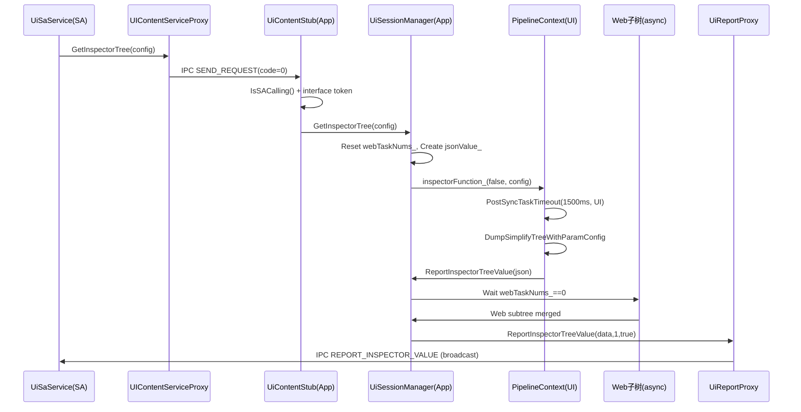

### 性能与优化

| 优化策略 | 说明 | 效果 |
|---------|------|------|
| 按需上报 | 注册计数为 0 或组件 mask 未命中时不发送相关事件。 | 降低无消费者场景下 JSON 构造和 IPC 回调成本。 |
| InspectorTree Web 聚合 | `webTaskNums_` 归零后才调用 `ReportInspectorTreeValue`。 | 避免 Web 子树异步填充未完成时提前返回。 |
| HitTest 分段发送 | HitTest 数据按 `ONCE_IPC_SEND_DATA_MAX_SIZE` 切片并标记最后一段。 | 避免单次 IPC 数据过大。 |
| 内容变化节流 | `minReportTime`、`reportDelayTime`、滚动/过渡状态共同控制上报窗口。 | 降低连续滚动、过渡、文本变化带来的重复上报。 |
| 页面翻译版本过滤 | 文本 hash 未变化时返回 `-1` 跳过发送，变化后递增 version。 | 降低重复文本发送给 AI 的成本。 |

### 核心接口索引

| 方法 | 功能 | 源码位置 |
|------|------|---------|
| `UiSessionManager::GetInstance()` | 返回进程内 UISession 单例，OHOS 实现为静态 `UiSessionManagerOhos`。 | `ui_session_manager_ohos.cpp:57` |
| `UiContentStub::OnRemoteRequest()` | IPC 统一入口，完成 SA/token 校验并按 transaction code 分发。 | `ui_content_stub.cpp:42` |
| `UIContentServiceStubImpl::RegisterComponentChangeEventCallback()` | 注册组件变化事件并设置组件事件 mask。 | `ui_content_stub_impl.cpp:51` |
| `UiSessionManagerOhos::ReportComponentChangeEvent()` | 根据远端对象、注册状态和 mask 过滤后上报组件变化 JSON。 | `ui_session_manager_ohos.cpp:115` |
| `UiSessionManagerOhos::GetInspectorTree()` | 初始化 InspectorTree 聚合 JSON，触发保存的 Pipeline 查询回调。 | `ui_session_manager_ohos.cpp:360` |
| `UiSessionManagerOhos::GetPageTranslateText()` | 解析页面翻译请求，并投递到当前 `UiTranslateManager`。 | `ui_session_manager_ohos.cpp:819` |
| `UiSessionManagerOhos::StartPageTranslate()` | 校验请求后记录页面翻译会话 scope 与 started 状态。 | `ui_session_manager_ohos.cpp:837` |
| `UIContentImpl::InitializeCallback()` | 注册 InspectorTree、Web、图片、页面名、HitTest、内容变化等回调。 | `ui_content_impl.cpp:6180` |
| `ContentChangeManager::StartContentChangeReport()` | 开启内容变化检测，修正非法阈值并通知已注册节点。 | `content_change_manager.cpp:247` |

### 核心数据结构索引

| 成员/结构 | 类型 | 说明 | 源码位置 |
|------|------|------|------|
| `processMap_` | `std::map<std::string, std::set<int32_t>>` | 按能力记录等待回调的请求进程，如 `getInspectorTree`、`translate`、`contentChange`。 | `ui_session_manager.h:270` |
| `reportObjectMap_` | `std::map<int32_t, sptr<IRemoteObject>>` | 保存调用进程 pid 到远端 `ReportService` 对象的映射。 | `ui_session_manager_ohos.h:156` |
| `*EventRegisterProcesses_` | `std::atomic<int32_t>` | 各事件注册计数，大于 0 表示该类事件需要上报。 | `ui_session_manager.h:272` |
| `componentChangeEventMask_` | `uint32_t` | 组件变化事件类型过滤 mask。 | `ui_session_manager.h:277` |
| `jsonValue_` / `webTaskNums_` | JSON 指针 / 原子计数 | InspectorTree 聚合容器和 Web 子任务计数。 | `ui_session_manager.h:299` |
| `translateManagerMap_` | `std::map<int32_t, std::shared_ptr<UiTranslateManager>>` | 按 instanceId 保存翻译管理器。 | `ui_session_manager.h:304` |
| `pageTranslateScope_` / `pageTranslateStarted_` | `int32_t` / `bool` | 页面连续翻译会话状态。 | `ui_session_manager_ohos.h:153` |
| `ParamConfig` | struct | 控制 InspectorTree 是否包含交互、无障碍、Web、UIExtension 等信息。 | `param_config.h:23` |
| `ContentChangeConfig` | struct | 控制内容变化检测最小间隔、文本比例、图片尺寸和延迟上报时间。 | `param_config.h:47` |

### 调试断点索引

| 关注点 | 断点位置 | 说明 |
|--------|----------|------|
| IPC 入口 | `ui_content_stub.cpp:42` | OnRemoteRequest，检查 code、SA token、interface token |
| 连接链路 | `ui_content_stub.cpp:266` + `ui_session_manager_ohos.cpp:208` | ConnectInner / SaveReportStub |
| 事件注册 | `ui_content_stub_impl.cpp:30-80` | 各类事件注册回调 |
| 组件事件过滤 | `ui_session_manager_ohos.cpp:115` + `:340` | mask 过滤与广播上报 |
| InspectorTree | `ui_content_impl.cpp:6182` + `ui_session_manager_ohos.cpp:360` + `:429` | 查询与 Web 聚合 |
| 页面翻译 | `ui_session_manager_ohos.cpp:819` + `:837` + `:903` | Get/Start/End/Reset |
| 翻译 DFX | `ui_content_proxy.cpp:691` + `ui_report_stub.cpp:496` + `:618` + `:640` | callback 超时与 watchdog |
| 翻译高频调用限制 | `ui_content_proxy.cpp:717` + `ui_report_stub.cpp:568` | 重复 Get/Start 返回 LAST_UNFINISH |
| 语言查询高频调用限制 | `ui_content_proxy.cpp:1296` | 重复查询返回 LAST_UNFINISH |
| 死亡恢复 | `ui_session_manager_ohos.cpp:208` | OnRemoteDied ordered cleanup |
| 内容变化 | `pipeline_context.cpp:4382` | 非 release 版 `-contentChange` DumpInfo 入口 |

### 数据模型设计

| 类型定义 | 源码位置 | 用途 |
|----------|----------|------|
| ParamConfig (7 fields) | param_config.h:23-31 | InspectorTree 过滤配置 |
| InteractionParamConfig (1 field) | param_config.h:33-35 | 命中测试查询配置 |
| ContentChangeConfig (6 fields) | param_config.h:49-56 | 内容变更检测阈值 |
| ComponentEventType (16 bitmask + NONE + ALL) | param_config.h:58-78 | 组件变更事件过滤掩码 |
| ChangeType (9 values) | param_config.h:37-47 | 内容变更事件类型 |
| ErrorCode (6 values) | ui_content_errors.h:24 | IPC 错误码 |
| MultiImageQueryErrorCode (5 values) | ui_content_proxy_error_code.h:21-27 | 图片查询错误码 |
| WebRequestErrorCode (3 values) | ui_content_proxy_error_code.h:29-33 | WebInfo 请求错误码 |
| TranslateContentScope (6 bitmask) | ui_translate_type.h:23-31 | 翻译范围掩码 |
| TranslateTextRequest | ui_translate_type.h:33-36 | 翻译文本请求 |
| TranslateTextNode | ui_translate_type.h:38-42 | 翻译文本节点 |
| TranslateResult | ui_translate_type.h:44-48 | 翻译结果 |
| AbilityLanguageInfo | ui_translate_type.h:50-53 | 应用语言信息 |
| InspectorFunction | ui_session_manager.h:49 | Inspector 树回调签名 |
| NotifySendCommandFunction | ui_session_manager.h:52 | 同步命令回调签名 |
| NotifySendCommandAsyncFunction | ui_session_manager.h:53 | 异步命令回调签名 |
| PageSceneRuleInfo | ui_session_manager_ohos.h:181-189 | 页面场景规则信息 |
| PageSceneRuleSetInfo | ui_session_manager_ohos.h:191-197 | 页面场景规则集信息 |

### 算法与状态机

#### 事件注册计数门控状态机

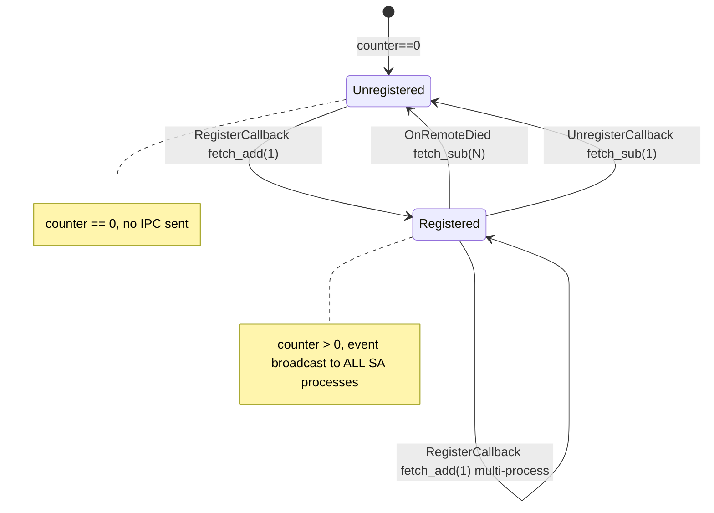

#### webFocusEvent 门控状态机 (bool + mutex)

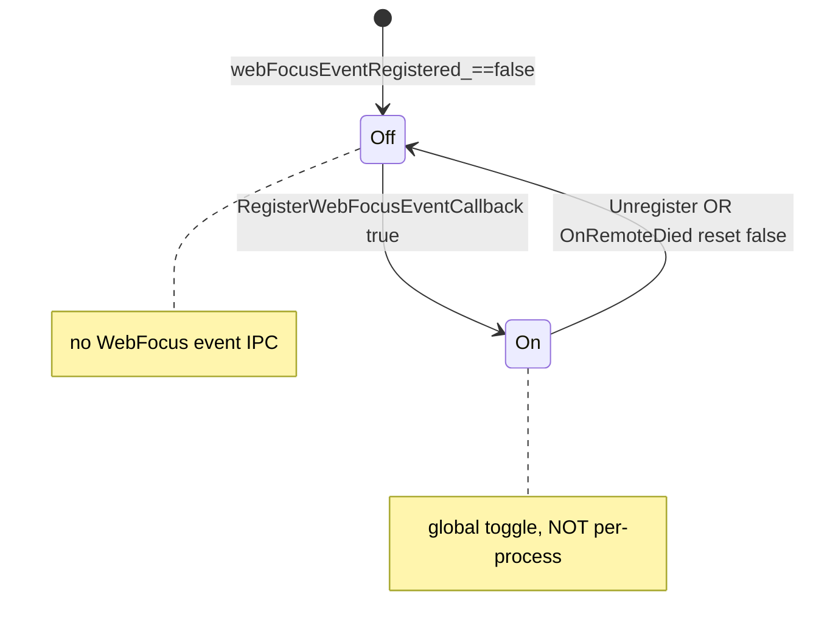

#### SA 死亡清理顺序

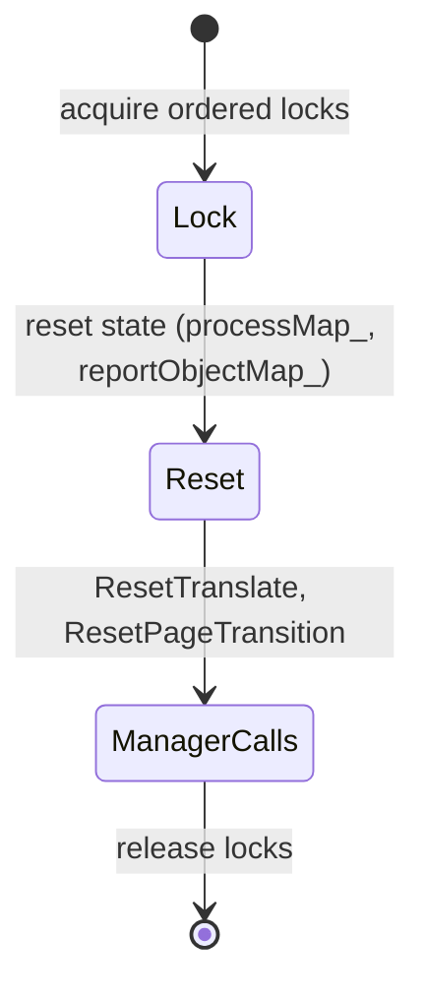

### 测试性设计

| 测试场景 | 测试方法 | 覆盖 ADR |
|----------|----------|----------|
| 非 SA 进程 IPC 调用被拒绝 | 集成测试：mock 非 SA caller | ADR-1 |
| 多 SA 进程同时注册同一事件，广播验证 | 集成测试：2 SA proxy 注册，触发事件，验证均收到 | ADR-1 |
| webFocusEvent 门控不一致性 | 单测：验证 bool+mutex vs atomic 计数器行为差异 | ADR-2 |
| PageTranslate mutex 互斥占位 vs SyncRequestGuard CAS | 并发单测：两线程同时注册 / 两线程同时查询 | ADR-3 |
| InspectorTree 单包 vs HitTest 128KB 分包 | 集成测试：构造 > 128KB HitTest 数据验证分段 | ADR-4 |
| SendCommandAsync 错误码 11/12/13 路径 | 单测：mock null callback / default return / null node | ADR-5 |
| SA 死亡清理 ordered locks 顺序 | 集成测试：触发 OnRemoteDied，验证 reset 后 manager calls | ADR-6 |
| InspectorJsonValue isRoot_ 所有权 | 单测：root 析构释放 cJSON tree，child 析构不释放 | ADR-7 |

### 异常传播时序图

```mermaid
sequenceDiagram
    participant App as App进程
    participant SA as SA进程

    Note over App: 进程死亡(OnRemoteDied)
    App->>SA: (death notification)
    SA->>SA: acquire ordered locks
    SA->>SA: EraseProcessId(key, pid)
    SA->>SA: reportObjectMap_ erase pid
    SA->>SA: fetch_sub all 9 atomic counters
    SA->>SA: webFocusEventRegistered_ reset false
    SA->>SA: if pageTranslateOwnerPid_: ResetTranslate
    SA->>SA: ResetPageTransition
    SA->>SA: release locks
```

### 资源所有权矩阵

| 资源 | 创建方 | 持有方 | 销毁触发 | 实际释放 | 异常回收 |
|------|--------|--------|----------|----------|----------|
| cJSON tree | InspectorJsonUtil::Create | InspectorJsonValue (isRoot_=true) | root InspectorJsonValue 析构 | cJSON_Delete | child 引用 (isRoot_=false) 不释放，依赖 root 存活 |
| UiReportProxy remote object | UiSessionManagerOhos | reportObjectMap_ per-pid | OnRemoteDied | EraseProcessId → fetch_sub counters | 进程死亡时批量清理 |
| PageTranslate callback slot | RegisterPageTranslateTextCallback | single-slot mutex 保护 | Unregister OR OnRemoteDied | ResetTranslate → slot cleared | SA 死亡时 mutex 保护下 reset |
| SyncRequestGuard pending flag | CAS atomic_bool | UiSessionManager | 析构 RAII → pending_=false | 析构自动恢复 | 请求失败时 acquired_=false，析构不操作 |

### 接口参数规约

| IPC 方法 | 入参 | 出参 | 传输阈值 | 分包策略 |
|----------|------|------|----------|----------|
| GetInspectorTree | ParamConfig (7 fields) | InspectorJsonValue string | 64KB Ashmem | 单包 (partNum=1, isLastPart=true) |
| GetVisibleInspectorTree | ParamConfig | InspectorJsonValue string | 64KB Ashmem | 单包 |
| ReportHitTestNodeInfos | InteractionParamConfig + json | HitTest result json | 128KB Ashmem | 分包 (> 128KB 分割) |
| SendCommandAsync | command, params | int32_t (11/12/13) | 普通 Parcel | N/A |
| GetCurrentAbilityLanguageInfo | void | AbilityLanguageInfo | 普通 Parcel | N/A |
| SendPageTranslateRequest | TranslateTextRequest | TranslateResult | 普通 Parcel | N/A |

### 线程与并发模型

| 操作 | 发起线程 | 回调线程 | 跨进程边界 | 线程安全 | 重入约束 |
|------|----------|----------|------------|----------|----------|
| UiSaService::Dump | binder 线程 | 同线程 | SA→app IPC | 投递到 UI 线程 | 安全 |
| UIContentServiceProxy 请求 | binder 线程(app Stub) | UI 线程(回调) | SA→app IPC | Hub mutex 保护 | SyncRequestGuard 单请求互斥 |
| UiReportProxy 上报 | binder 线程(SA Stub) | 同线程 | app→SA IPC | atomic 计数器 | 计数器 > 0 时广播上报 |
| GetInspectorTree callback | binder→UI(PostSyncTaskTimeout) | UI 线程 | app 内部 | inspectorFunctionMutex_ | 互斥 |
| RegisterPageTranslateTextCallback | binder 线程 | 同线程 | SA→app IPC | single-slot mutex | 占位互斥，第二注册失败 |
| GetCurrentAbilityLanguageInfo | binder 线程 | UI 线程 | SA→app IPC | SyncRequestGuard CAS | 第二请求立即失败 |
| SendCommandAsync | binder 线程 | UI 线程(PostSyncTask) | SA→app IPC | mutex 保护 | RAII 互斥 |
| SA 死亡清理 | binder 线程 | 同线程 | death notification | ordered locks | 严格顺序 |

并发场景：

| 场景 | 互斥机制 | 预期行为 |
|------|----------|----------|
| 两个 SA 进程同时 GetInspectorTree | SyncRequestGuard(atomic_bool CAS) | 第二个请求立即失败 (acquired_=false) |
| 多进程同时 RegisterClickEventCallback | atomic<int32_t> fetch_add | 计数器递增，所有注册进程收到事件广播 |
| 进程死亡后注册计数恢复 | OnRemoteDied → EraseProcessId → fetch_sub | 计数器递减，归零停止上报 |
| 两个 SA 进程同时 RegisterPageTranslateTextCallback | single-slot mutex | 第二个注册被 mutex 阻塞或返回失败 |
| 两个 SA 进程同时 GetCurrentAbilityLanguageInfo | SyncRequestGuard CAS | 第二个请求立即失败 |
| InspectorJsonValue child 引用在 root 析构后访问 | isRoot_=false 不释放 | UB——规格要求 child 生命周期不超过 root |

## 详细设计

### IPC安全框架与连接生命周期

**OnRemoteRequest SA 门控** (`ui_content_stub.cpp`):

OnRemoteRequest 入口统一校验：

1. `IsSACalling()` — 验证调用方为 SA 进程
2. `interface token` 校验 — 验证 IPC 接口标识匹配
3. 校验失败直接返回错误，不区分具体方法权限

无 per-method 权限表：当前 52 个事务码统一通过 SA-level 门控，不做方法级区分。

**UiSessionManager 单例** (`ui_session_manager.h:47-381`):

```cpp
// adapter/ohos/entrance/ui_session/ui_session_manager_ohos.cpp:245-249
static UiSessionManagerOhos instance; // Meyers singleton
return &instance;
```

Callback 注册方法 (21 个 Save* + 2 个 Set* + 2 个 Register* = 25 个回调注册)：
- SaveInspectorTreeFunction (h:132): InspectorFunction → inspectorFunction_ (mutex 保护)
- SaveForSendCommandFunction (h:130): NotifySendCommandFunction → notifySendCommandFunction_
- SaveForSendCommandAsyncFunction (h:131): NotifySendCommandAsyncFunction → notifySendCommandAsyncFunction_
- SaveRegisterForWebFunction (h:133): NotifyAllWebFunction → notifyWebFunction_
- SaveGetPixelMapFunction (h:198), SaveGetImagesByIdFunction (h:199)
- SaveTranslateManager (h:200-201): shared_ptr<UiTranslateManager> → translateManagerMap_
- SaveGetCurrentInstanceIdCallback (h:202)
- SaveArkUIPageTranslateFunctions (h:204-206): 5 个 PageTranslate 回调
- SaveGetCurrentAbilityLanguageInfoFunction (h:237)
- SaveSendCommandFunction (h:248), SaveRelaxedCommandFunction (h:249)
- SaveGetStateMgmtInfoFunction (h:250)
- SaveGetWebInfoByRequestFunction (h:252)
- SaveGetSpecifiedContentOffsetsFunction (h:271-272)
- SaveHighlightSpecifiedContentFunction (h:273-274)
- SaveSelectTextFunction (h:275)
- SetStartContentChangeDetectCallback (h:280), SetStopContentChangeDetectCallback (h:281)
- RegisterPipeLineExeAppAIFunction (h:263)
- SavePageSceneDetectFunction (h:304)
- RegisterPipeLineGetCurrentPageName (h:212)
- SaveGetHitTestInfoCallback (h:134)

Protected member fields (h:310-380)：
- processMap_: map<string, set<int32_t>> + processMapMutex_: shared_mutex
- 9 atomic<int32_t> 事件计数器 (click/search/textChange/router/componentChange/scroll/lifeCycle/selectText/pageSceneRule)
- webFocusEventRegistered_: bool + webFocusEventMutex_: mutex（全局开关，非 per-process）
- componentChangeEventMask_: uint32_t (位掩码)
- inspectorFunction_ + inspectorFunctionMutex_ (+ ~15 个其他回调 + mutex)

**事件广播模型**：

所有 9 类事件上报均广播至 reportObjectMap_ 中所有已注册 SA 进程，不做定向发送。Report 方法内：
- 9 类 atomic 计数器事件：计数器 > 0 时遍历 reportObjectMap_ 发送 IPC
- webFocusEvent bool+mutex 门控：registered_==true 时遍历发送

**SA 死亡清理** (`ui_content_proxy.cpp OnRemoteDied`)：

ordered cleanup sequence:
1. acquire ordered locks (processMapMutex_, webFocusEventMutex_, etc.)
2. reset state — EraseProcessId(key, pid), reportObjectMap_ erase pid, fetch_sub all 9 atomic counters, webFocusEventRegistered_ reset false
3. manager calls — if pageTranslateOwnerPid_ matches: ResetTranslate(), ResetPageTransition()

### InspectorTree查询与Web子树聚合

**GetInspectorTree** (`ui_session_manager_ohos.cpp:939-955`)：

1. Reset webTaskNums_ (atomic counter for Web subtree count)
2. Create jsonValue_ (InspectorJsonValue, isRoot_=true, owns cJSON tree)
3. Call inspectorFunction_(false, config) → PipelineContext::PostSyncTaskTimeout(1500ms)
4. Pipeline 生成 SimplifiedInspector tree with ParamConfig filtering
5. BACKGROUND thread: ReportInspectorTreeValue(json) — wait for webTaskNums_==0 before reporting
6. Report via UiReportProxy: ReportInspectorTreeValue(data, partNum=1, isLastPart=true)

**GetVisibleInspectorTree** (`ui_session_manager_ohos.cpp:958-968`)：

1. 不重置 webTaskNums_，不创建 jsonValue_
2. Call inspectorFunction_(true, config) — onlyNeedVisible=true
3. 轻量裁剪版 InspectorTree，不涉及 Web 异步子树合并

**webTaskNums_ 子树聚合**：

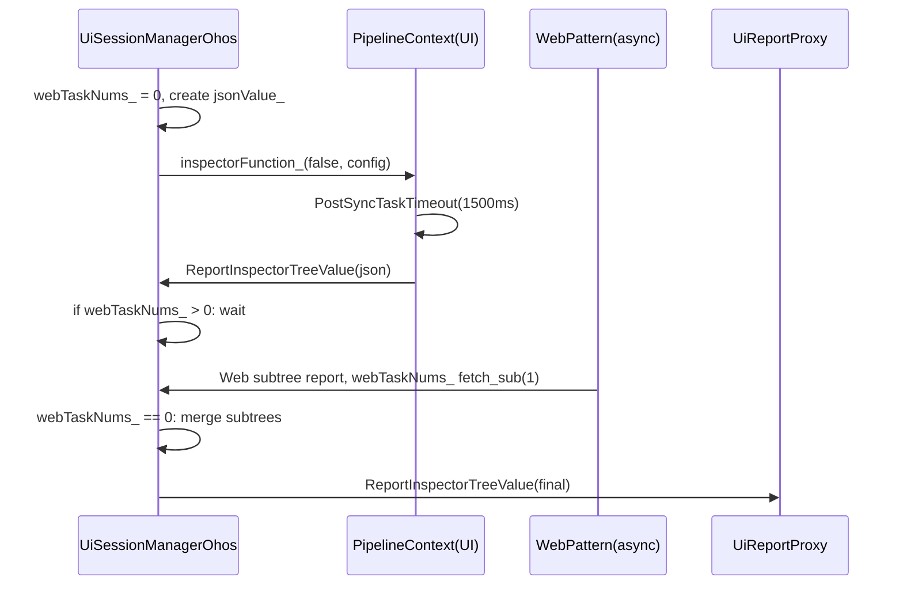

**InspectorJsonValue cJSON 所有权** (`ui_session_json_util.h:30-70`, `ui_session_json_util.cpp`)：

- InspectorJsonUtil::Create / CreateArray / CreateObject → isRoot_=true → 析构时 cJSON_Delete 释放整棵树
- InspectorJsonValue::GetArrayItem → isRoot_=false → 析构时不释放（非拥有引用）；GetJsonObject → 返回 const JsonObject* 原始指针（非 InspectorJsonValue 包装）
- child 引用生命周期必须不超过 root 对象

27 方法: Put(9 重载) + Replace + ToString + IsXxx(5) + Contains + GetJsonObject + GetString(2) + GetValue + GetArraySize + GetArrayItem + GetInt(2) + GetInt64(2)

InspectorJsonUtil 5 静态工厂方法: Create / CreateArray / CreateObject / ParseJsonData / ParseJsonString

**分包接口预留**：

ReportInspectorTreeValue 接口支持 partNum / isLastPart 参数，但当前 InspectorTree 始终单包发送 (partNum=1, isLastPart=true)。

### 事件上报与注册计数门控

**9 类事件计数器** (`ui_session_manager.h:310-380`)：

| 事件类型 | 计数器 | 门控方式 | 广播模式 |
|----------|--------|----------|----------|
| Click | atomic<int32_t> clickEventRegisteredProcesses_ | fetch_add / fetch_sub + Get*Registered() | 广播所有 SA |
| Search | atomic<int32_t> searchEventRegisteredProcesses_ | 同上 | 广播所有 SA |
| TextChange | atomic<int32_t> textChangeEventRegisteredProcesses_ | 同上 | 广播所有 SA |
| Router | atomic<int32_t> routerEventRegisteredProcesses_ | 同上 | 广播所有 SA |
| ComponentChange | atomic<int32_t> componentChangeEventRegisteredProcesses_ | 同上 + mask 检查 | 广播所有 SA |
| Scroll | atomic<int32_t> scrollEventRegisteredProcesses_ | 同上 | 广播所有 SA |
| LifeCycle | atomic<int32_t> lifeCycleEventRegisteredProcesses_ | 同上 | 广播所有 SA |
| SelectText | atomic<int32_t> selectTextEventRegisteredProcesses_ | 同上 | 广播所有 SA |
| PageSceneRule | atomic<int32_t> pageSceneRuleRegisterProcesses_ | 同上 | 广播所有 SA |
| WebFocus | bool webFocusEventRegistered_ + mutex | global toggle, not per-process | 广播所有 SA |

门控差异（ADR-2）：
- 9 类 atomic 计数器：per-process 引用计数，每进程注册/注销独立递增递减
- webFocusEvent bool+mutex：全局开关，所有进程共享，Register 时设 true，Unregister 或 SA 死亡时 reset false

**Register / Unregister 流程**：

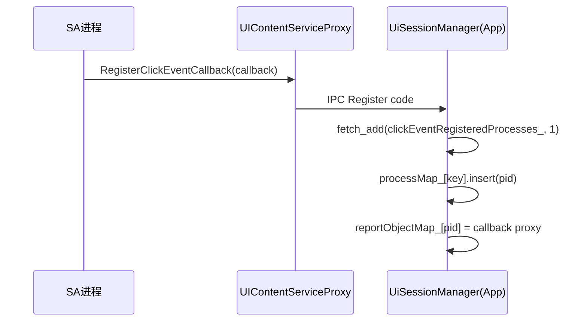

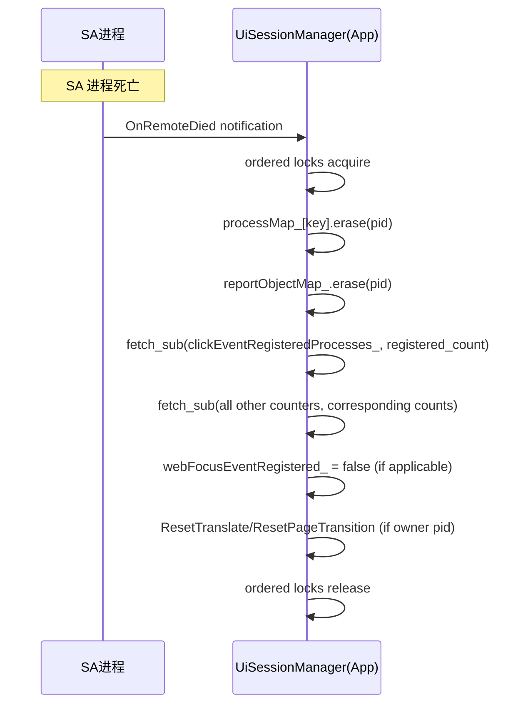

**ComponentEventType mask** (`param_config.h:58-78`)：

16 位掩码 + NONE + ALL，ComponentChange 事件上报时额外检查 mask：
- Get*Registered() 计数器门控 + ComponentEventType mask 双重过滤

### 命令下发与同步请求保护

**SendCommand 三变体** (`ui_content_service_interface.h`)：

| 变体 | 签名 | 说明 |
|------|------|------|
| SendCommand | NotifySendCommandFunction | 同步命令，UI 线程 PostSyncTask |
| SendCommandAsync | NotifySendCommandAsyncFunction | 异步命令，UI 线程 PostSyncTask |
| SendCommandRelaxed | SaveRelaxedCommandFunction | 宽松命令，不保证 UI 线程执行 |

**SendCommandAsync 错误码** (`ui_content_service_interface.h:206-217`)：

| 错误码 | 含义 | 产出条件 |
|--------|------|----------|
| 0 | 成功 | 命令正常执行 |
| 10 | Pipeline null（已文档化） | 当前 lambda 未产出此值 |
| 11 | TaskExecutor null / 回调未注册 | 默认基类返回值，回调未注册场景 |
| 12 | 自处理错误 | 默认结果值，组件自处理返回 |
| 13 | node null | 目标节点已销毁 |

Code 10 在接口注释中文档化但当前 lambda 实现中 Pipeline 为空时不执行到返回路径。

**SyncRequestGuard** (`ui_session_request_guard.h:23-49`)：

```cpp
// RAII compare_exchange_strong
SyncRequestGuard(std::atomic_bool& pending)
    : acquired_(pending.compare_exchange_strong(false, true)) {}
~SyncRequestGuard() {
    if (acquired_) pending_.store(false);
}
bool IsAcquired() const { return acquired_; }
```

用于 GetCurrentAbilityLanguageInfo：CAS 保证同一时间仅一个请求执行，第二个请求立即失败 (IsAcquired()==false)。

### 翻译职责边界

| 类 | 职责 | 不应承担的职责 |
|----|------|---------------|
| UiTranslateManagerImpl | 保存 PageTranslateNode 监听表；分发 ArkWeb 脚译/语言查询/Web 图片查询；ForEachArkUITranslateFrameNode | 不直接获取 PipelineContext，不直接调用 ContentChangeManager，不维护 ArkUI 文本版本与译文缓存 |
| PipelineContext | 承接 ArkUI 页面翻译入口；注册/反注册翻译监听；通知 ContentChangeManager | 不处理跨进程 report callback 生命周期，不解析 SA 连接状态 |
| ContentChangeManager | 管理 ArkUI 文本翻译快照/连续上报缓存/text hash/version/可见性过滤/译文应用与原文恢复 | 不管理 ArkWeb 脚译，不选择当前 Ability 实例，不保存 SA callback |
| UiSessionManagerOhos | 解析 SA 请求；维护连续翻译会话 scope 与死亡清理；按 scope 分发 ArkWeb/ArkUI | 不直接遍历组件树，不持有 FrameNode 或 ContentChangeManager |

### 翻译能力与DFX并发保护

**双通道翻译**：

| 通道 | 入口 | 回调存储 | 并发门控 |
|------|------|----------|----------|
| WebView 翻译 | SendWebViewTranslateRequest | UiTranslateManager::translateCallback_ | 单实例 mutex |
| Page 翻译 | SendPageTranslateRequest | RegisterPageTranslateTextCallback | single-slot mutex |

**RegisterPageTranslateTextCallback 并发门控** (`ui_session_manager_ohos.cpp`)：

single-slot mutex 模式：仅允许一个 SA 进程占位注册 Page 翻译回调。第二个注册请求被 mutex 保护，返回失败或等待。

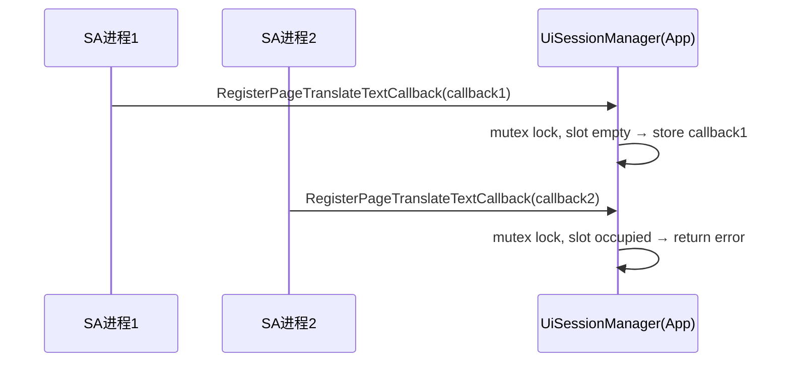

**SyncRequestGuard for GetCurrentAbilityLanguageInfo**：

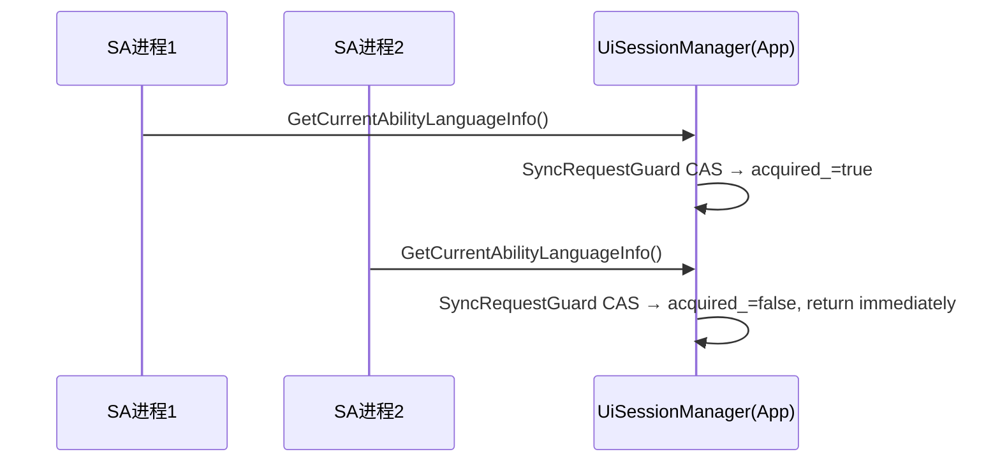

**TranslateContentScope** (`ui_translate_type.h:23-31`)：

6 值位掩码：TEXT / IMAGE / VIDEO / AUDIO / ICON / ALL，控制翻译范围。

**SA 死亡时翻译清理** (`ui_content_proxy.cpp OnRemoteDied`)：

if pageTranslateOwnerPid_ matches dead process → ResetTranslate() + ResetPageTransition()

**UiReportStub PageTranslate 回调管理** (`ui_report_stub.cpp`)：

- RegisterPageTranslateTextCallback：注册 + 5s 超时 + watchdog
- UnregisterPageTranslateTextCallback：注销回调

### 内容变化检测与阈值管理

**ContentChangeConfig** (`param_config.h:49-56`)：

6 字段阈值配置（源码默认值 param_config.h:49-56）：
- minReportTime = 100ms — 最小上报间隔
- reportDelayTime = 600ms — 过渡后延迟上报时间
- textContentRatio = 0.15 — 文本面积比率阈值
- minWidth = 100px — 图片最小宽度
- minHeight = 100px — 图片最小高度
- ignoreEventType — 需忽略的事件类型（JSON 格式）

**ChangeType** (`param_config.h:37-47`)：

9 值枚举：PAGE / SCROLL / SWIPER / TABS / TEXT / DIALOG / ARKWEB_PAGE / ARKWEB_TEXT / IMAGE_LOADED

**ContentChangeManager** (`frameworks/core/components_ng/manager/content_change_manager/`)：

- 检测节点属性变化，对比 ContentChangeConfig 阈值
- 超阈值时触发 ReportContentChangeEvent IPC 上报

**页面场景规则化感知规则检测** (`ui_session_manager_ohos.h:181-197`)：

- PageSceneRuleInfo / PageSceneRuleSetInfo：页面场景规则信息结构
- SavePageSceneDetectFunction (h:304)：注册 PageScene 检测回调
- RegisterPageSceneRules / UnregisterPageSceneRules：atomic 计数器 pageSceneRuleRegisterProcesses_ 门控

### 查询能力与辅助Dump

**SA 查询接口** (`ui_content_service_interface.h`)：

| 查询能力 | IPC 事务码 | 返回类型 |
|----------|------------|----------|
| GetCurrentPageName | GET_CURRENT_PAGE_NAME | string |
| GetCurrentImagesShowing | GET_CURRENT_IMAGES_SHOWING | MultiImageQueryErrorCode / images |
| GetImagesById | GET_IMAGES_BY_ID | MultiImageQueryErrorCode / images |
| ExeAppAIFunction | EXE_APP_AI_FUNCTION | AI result |
| GetStateMgmtInfo | GET_STATE_MGMT_INFO | StateMgmt info json |
| GetWebInfoByRequest | GET_WEB_INFO_BY_REQUEST | WebRequestErrorCode / WebInfo |
| GetSpecifiedContentOffsets | GET_SPECIFIED_CONTENT_OFFSETS | content offsets json |
| HighlightSpecifiedContent | HIGHLIGHT_SPECIFIED_CONTENT | highlight result |
| GetHitTestInfo | GET_HIT_TEST | HitTest result (128KB 分包) |

**NavigationManager dump** (`navigation_manager.cpp:235-279`)：

- NavigationManager::OnDumpInfo：文本树 DFS 输出
- 用于辅助调试场景

**UIExtension 跨进程 dump** (`pipeline_context.cpp:4683-4689`)：

- PipelineContext::DumpUIExt (WINDOW_SCENE_SUPPORTED)
- UIExtension 组件跨进程 dump 支持

**DumpViewData 自动填充链路** (`ui_content_impl.cpp:5321-5374`)：

5 层递归委托：UIContentImpl → PipelineContext → UINode → FrameNode → Pattern

### SA验证服务与hidumper命令路由

**UiSaService** (`ui_sa_service.h:26-77`)：

| 方法 | 说明 |
|------|------|
| GetInstance | static UiSaService (SA 单例, SA_ID=16666) |
| OnStart | SA 启动 |
| OnStop | SA 停止 |
| Dump | hidumper 集成入口，args → DUMP_MAP 路由 |
| getArkUIService | windowId → IUiContentService 代理查找 |
| EnsureConnected | 校验 IUiContentService 远程对象有效性 |

**DUMP_MAP 25 条** (`ui_sa_service.cpp:220-246`)：

Connect, GetVisibleInspectorTree, GetCurrentPageName, SendCommand, SendCommandAsync, RegisterContentChangeCallback, UnregisterContentChangeCallback, GetCurrentImagesShowing, GetImagesById, GetWebInfoByRequest, RegisterComponentChangeEventCallback, UnregisterComponentChangeEventCallback, ExeAppAIFunction, GetWebViewCurrentLanguage, StartWebViewTranslate, GetStateMgmtInfo, RegisterTextChangeEventCallback, UnregisterTextChangeEventCallback, RegisterSelectTextEventCallback, UnregisterSelectTextEventCallback, RegisterPageSceneRules, UnregisterPageSceneRules, GetPageScene, GetSpecifiedContentOffsets, HighlightSpecifiedContent

**IsSACalling 校验** (`ui_content_stub.cpp`)：

OnRemoteRequest 入口处统一校验：
- 验证调用方进程为已注册 SA
- 验证 interface token 与 IUiContentService 定义匹配
- 校验失败直接返回 IPC 错误

**UiSessionIpcUtil** (`ui_session_ipc_util.h:27-35`)：

- DEFAULT_ASHMEM_THRESHOLD = 64KB (64*1024) — InspectorTree / 大字符串传输
- HitTest 分包阈值 = 128KB — 区别于 InspectorTree
- WriteLargeString / ReadLargeString / WriteStringWithAshmemFlag / ReadStringWithAshmemFlag

## DFX 与鲁棒性设计

### 翻译 DFX 序列图

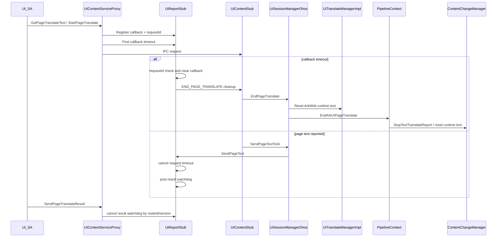

### DFX 统一降级场景表

| 场景 | 机制 | 清理/降级行为 | 关键源码 |
|------|------|---------------|----------|
| Connect 后 DFX handler 建立 | `UIContentServiceProxy::Connect` 在 IPC 成功后 `report_->SetEventHandler(eventHandler)` | 后续 InspectorTree、页面翻译 callback timeout、译文 watchdog 都依赖该 handler；handler 为空时相关 timeout 投递失败并清 pending | `lushi/translate:adapter/ohos/entrance/ui_session/ui_content_proxy.cpp:154,160`, `ui_report_stub.cpp:645` |
| 页面翻译请求发起 | `SendPageTranslateRequest` 校验 callback/request，通过 `UiReportStub::RegisterPageTranslateTextCallback` 注册 `PageTranslateTextCallback`，再按单次 Get 需要注册 timeout cleanup callback | callback 为空或 scope 非法返回 `PARAM_INVALID`；同一 report 已有未完成 Get/Start callback 时注册失败并返回 `LAST_UNFINISH`；timeout cleanup callback 发送 `END_PAGE_TRANSLATE` | `lushi/translate:adapter/ohos/entrance/ui_session/ui_content_proxy.cpp:691,717,723` |
| timeout 任务投递失败 | `PostPageTranslateCallbackRemoveTask` 通过 weak `EventHandler` 投递延时任务 | handler 为空或投递失败时清 `pageTranslateTextCallback_`、`pageTranslateTimeoutCallback_` 和 `pageTranslateContinuous_`，proxy 返回 `FAILED`，避免请求进入半注册状态 | `lushi/translate:adapter/ohos/entrance/ui_session/ui_report_stub.cpp:496,508,528` |
| callback timeout | timeout task 携带 `requestId` 调用 `HandlePageTranslateCallbackTimeout` | requestId 过期说明是旧任务，直接忽略；当前请求超时时清 callback 和连续标志，并按需触发 cleanup callback | `lushi/translate:adapter/ohos/entrance/ui_session/ui_report_stub.cpp:584,618,623` |
| 单次请求完成 | `SendPageTranslateResult` IPC 成功后，proxy 取消可解析 nodeId/version 的 result watchdog，并调用 `UiReportStub::FinishPageTranslateTextRequest` | 非连续 Get 释放页面翻译 callback 和 timeout callback，允许下一次 Get/Start；连续 Start 下该释放函数保持 no-op，直到 End/SA death/清理路径注销 callback | `lushi/translate:adapter/ohos/entrance/ui_session/ui_content_proxy.cpp:1253,1272`, `ui_report_stub.cpp:595` |
| 原文已发出但译文长时间未回 | `SendPageText` 正常回调 SA 后为 `nodeId/version` 投递 result watchdog | watchdog 仅输出不含正文的 nodeId/version 告警；不强制结束连续翻译，不恢复原文，迟到译文仍按 nodeId/version 校验 | `lushi/translate:adapter/ohos/entrance/ui_session/ui_report_stub.cpp:541,640,825` |
| 译文回填成功发送 | `SendPageTranslateResult` 解析 result 中可识别的 nodeId/version identity | IPC 发送成功后取消对应 result watchdog；单次 Get 释放 callback 并解除并发限制；解析失败不影响 IPC 失败返回码，但无法取消 watchdog | `lushi/translate:adapter/ohos/entrance/ui_session/ui_content_proxy.cpp:1253,1258,1272` |
| 当前 Ability 语言地区查询 | `GetCurrentAbilityLanguageInfo` 在 proxy 侧使用同步 in-flight guard，再发送 `GET_CURRENT_ABILITY_LANGUAGE_INFO` IPC | 上一笔同步查询未返回前重复调用返回 `LAST_UNFINISH`；`SendRequest` 返回或错误路径自动释放 guard；不注册 report callback、不改变翻译会话状态 | `lushi/translate:adapter/ohos/entrance/ui_session/ui_content_proxy.cpp:1296`, `ui_content_stub.cpp:713`, `ui_session_manager_ohos.cpp:948` |
| End/Reset 主动清理 | `EndPageTranslate` 清会话 scope 后按 scope 分发；`ResetPageTranslate` 按 nodeId 或全量投递 UI 线程 | ArkWeb 分支复用 `UiTranslateManagerImpl::ResetTranslate`；ArkUI 分支通过 `PipelineContext::EndArkUIPageTranslate` 或 `ResetArkUIPageTranslate` 调用 `ContentChangeManager::StopTextTranslateReport` / `ResetTranslateTextNode` 恢复运行时译文 | `lushi/translate:adapter/ohos/entrance/ui_session/ui_session_manager_ohos.cpp:906`, `ace_translate_manager.cpp:194`, `pipeline_context.cpp:7930`, `content_change_manager.cpp:345` |
| SA/report 进程死亡 | `SaveReportStub` 为 SA report remote 增加 `UiReportProxyRecipient` 死亡监听 | 若死亡进程是唯一 translate owner，则调用 `ResetTranslate(-1)` 和 `ResetPageTranslate(-1)`，清 `pageTranslateStarted_` / `pageTranslateScope_`，并从 report/process map 删除该 pid | `lushi/translate:adapter/ohos/entrance/ui_session/ui_session_manager_ohos.cpp:208,215,224` |
| UIContent remote 死亡 | `UiContentProxyRecipient::OnRemoteDied` 和 `UiReportProxyRecipient::OnRemoteDied` 是通用死亡回调包装 | 透传到注册的 handler，由上层清理缓存的 remote object 或 report object | `lushi/translate:adapter/ohos/entrance/ui_session/ui_content_proxy.cpp:1304`, `ui_report_proxy.cpp:448` |

### 翻译高频调用限制方法

1. 以 `UiReportStub::RegisterPageTranslateTextCallback` 作为唯一并发闸门。该函数在 `pageTranslateCallbackMutex_` 保护下判断 `pageTranslateTextCallback_` 是否为空；若不为空，说明同一 `report` 连接上仍存在未完成 Get/Start 请求，注册失败。
2. `UIContentServiceProxy::SendPageTranslateRequest` 必须先完成 callback 注册，再发送 `GET_PAGE_TRANSLATE_TEXT` 或 `START_PAGE_TRANSLATE` IPC。注册失败时直接返回 `LAST_UNFINISH`，不得发送 IPC。
3. 不在 `UiSessionManagerOhos` 或 `ContentChangeManager` 再维护一套 Get/Start pending 变量。manager 只处理已经通过 report callback 闸门的合法请求。
4. 单次 Get 的释放点是 `SendPageTranslateResult` 成功发送后调用 `FinishPageTranslateTextRequest`、请求 timeout cleanup、IPC 发送失败或连接/死亡清理。
5. 连续 Start 的 callback 生命周期跨越初始快照和后续增量；`FinishPageTranslateTextRequest` 在连续模式下保持 no-op，直到 `EndPageTranslate`、SA death/连接断开或清理路径调用 `UnregisterPageTranslateTextCallback`。因此 Start 期间重复 Get/Start 都返回 `LAST_UNFINISH`。
6. SA 侧应对 Get/Start 做节流，不用高频重复 Get/Start 模拟批处理；多个节点译文应通过一次 `SendPageTranslateResult` 的 `results` 数组批量回填。

### 语言地区查询高频调用限制方法

1. `GetCurrentAbilityLanguageInfo` 是同步 IPC 简单查询，不注册 `ReportService` callback，因此不能复用页面翻译的 callback 闸门。
2. 在 `UIContentServiceProxy::GetCurrentAbilityLanguageInfo` 入口创建 proxy 侧 in-flight guard。guard 用原子状态记录当前同步查询是否在途；若上一笔查询尚未从 `Remote()->SendRequest` 返回，新的查询直接返回 `LAST_UNFINISH`。
3. guard 必须覆盖写 parcel、`SendRequest`、读取 reply 和错误返回全过程，通过析构或等价 RAII 自动释放。
4. 该限制不进入 `UiSessionManagerOhos`，不改变 `getAbilityLanguageInfoCallback_`，不影响页面翻译 Get/Start/End/Reset 状态。

### DFX 清理顺序不变量

1. 先校验 requestId，过期 timeout 或迟到 callback 不得影响新请求。
2. 再移除 pending callback 和 timeout/watchdog task，避免二次触发。
3. 最后通知 manager 执行 End/Reset，并切 UI 线程恢复 Pattern 运行时译文。
4. 所有 DFX 日志只打印 requestId、nodeId、version、长度、scope、processId 和错误码，不打印原文/译文正文。

## 风险和开放问题

| 项 | 类型 | 影响 | 处理方式 | Owner |
|----|------|------|----------|-------|
| 事件门控模型不一致（ADR-2） | 架构 | 中 | webFocusEvent 使用 bool+mutex 全局开关而非 per-process atomic 计数器，规格需标注此差异；后续统一为 atomic 计数器为可选改进 | ArkUI SIG |
| 无 per-method 权限区分（ADR-1） | 安全 | 低 | 当前所有 IPC 方法统一 SA-level 门控；若后续需方法级权限，需扩展 OnRemoteRequest 校验逻辑 | ArkUI SIG |
| SendCommandAsync Code 10 未产出 | API | 低 | 接口注释文档化 Code 10 (Pipeline null) 但当前 lambda 未产出；下游工具需注意实际可返回 11/12/13 | ArkUI SIG |
| 分包接口 vs 实现不一致 | 架构 | 低 | ReportInspectorTreeValue 接口预留分包但当前始终单包；仅 HitTest 实际 128KB 分包；后续大树场景可能启用 InspectorTree 分包 | ArkUI SIG |
| SA 死亡清理 ordered locks 依赖顺序 | 架构 | 中 | 清理顺序必须为 locks → state reset → manager calls，违反顺序可能导致悬空引用；规格需标注严格顺序要求 | ArkUI SIG |
| InspectorJsonValue child 引用 UB 风险 | 架构 | 低 | isRoot_=false 的 child 引用在 root 析构后访问为 UB；使用方需保证 child 生命周期不超过 root | ArkUI SIG |
| 双并发门控模式差异 | 架构 | 中 | PageTranslate mutex 占位 vs SyncRequestGuard CAS 语义不同；规格需明确两种门控适用场景 | ArkUI SIG |
| UiSessionManager 与 hidumper 双通道并存 | 兼容 | 中 | 两套 dump 路径可能产生不一致输出，需注意同步 | ArkUI SIG |
| 页面场景规则化感知为特性分支内容 | 兼容 | 中 | 主线可能尚未包含全部实现，核对代码时以特性分支源码为准 | ArkUI SIG |
| WM 验证链路跨仓依赖 | 架构 | 中 | WindowSessionImpl fallback 和 WMS IPC 变更属于 window_manager 仓，正式修复需 WM 评估 | ArkUI SIG |

## 设计审批

- [x] 需求基线已确认，设计覆盖 P0/P1 AC
- [x] 不涉及项已承接，N/A 和展开项都有结论
- [x] 涉及仓和模块职责清楚
- [x] 调用链层级分析完整，每层覆盖到位
- [x] 适用架构规则已识别并形成设计结论
- [x] 分层和子系统边界合规
- [x] API 变更有签名、权限、错误码和兼容性说明
- [x] BUILD.gn/bundle.json 影响明确
- [x] 设计输出和后续 Task 拆分明确
- [x] 关键设计决策有理由和影响说明
- [x] 风险和开放问题有 Owner

**结论:** 通过（已有实现补录）
