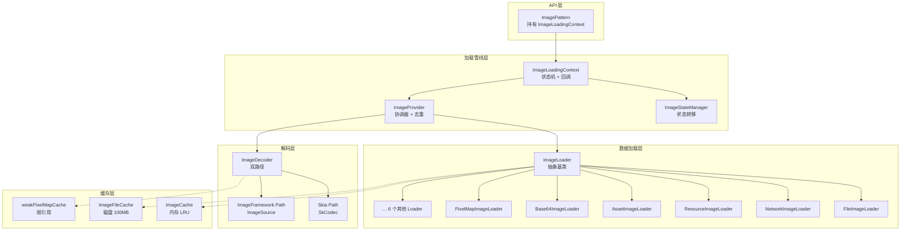
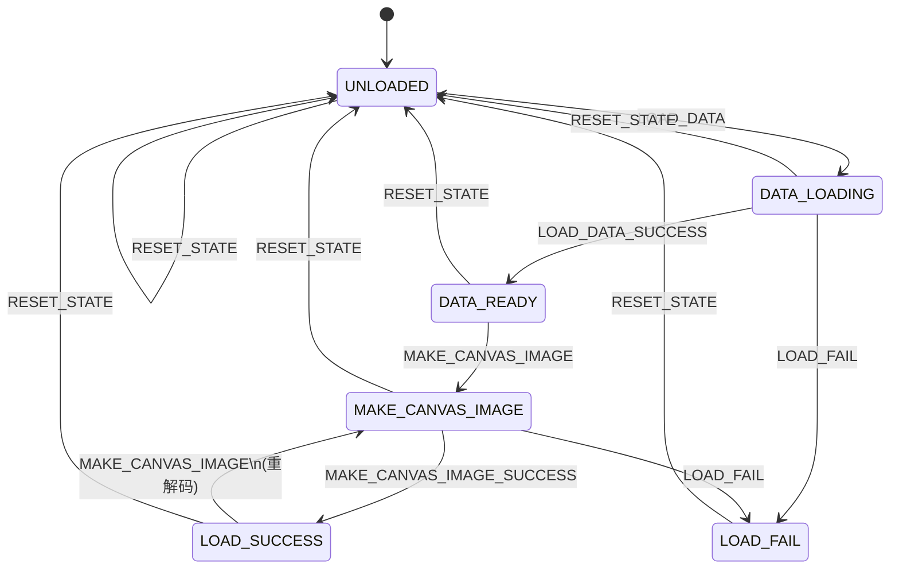

# 架构设计

> 图片加载机制功能域的架构设计文档，补录已有 NG 图片加载管线实现。

## 设计元数据

| 字段 | 内容 |
|------|------|
| Design ID | DESIGN-Func-04-01-01 |
| 关联需求 | 已有能力补录（无独立 requirement.md） |
| 关联 Epic | 无 |
| 目标 Feature | Feat-01 图片加载机制 |
| 复杂度 | 复杂 |
| 目标版本 | API 7 起支持 |
| Owner | ArkUI SIG |
| 状态 | Baselined（已有实现补录） |

## 需求基线

> 需求基线详见 proposal.md。以下仅列出设计阶段需要额外强调的要点。

| 项 | 补充说明 |
|----|----------|
| 核心目标 | 提供 NG 图片加载管线，支持多源加载（12 种 SrcType）、状态机驱动生命周期、四级缓存、双路径解码、任务去重和 autoResize 功率对齐 |

## 上下文和现状

### 涉及仓和模块

| 仓库 | 模块/路径 | 当前职责 | 本 Feature 影响 |
|------|-----------|----------|-----------------|
| ace_engine | `frameworks/core/components_ng/image_provider/` | NG 图片加载管线核心：ImageProvider、ImageLoadingContext、ImageStateManager、ImageObject 子类、ImageDecoder | 状态机、去重、回调、解码 |
| ace_engine | `frameworks/core/image/image_loader.h/.cpp` | ImageLoader 抽象基类 + 12 个具体 Loader + 工厂方法 | 多源加载 |
| ace_engine | `frameworks/core/image/image_cache.h/.cpp` | 内存 LRU 缓存（四隔离室：解码图像、原始数据、NG/旧 ImageObject） | 缓存体系 |
| ace_engine | `frameworks/core/image/image_file_cache.h/.cpp` | 磁盘文件缓存（100MB 默认，LRU 淘汰） | 缓存体系 |
| ace_engine | `frameworks/core/image/image_source_info.h/.cpp` | 图片源描述（URI、SrcType、缓存键、SVG/HDR 标志） | 数据结构 |
| ace_engine | `frameworks/core/image/image_compressor.h/.cpp` | GPU 加速 ASTC 压缩（OpenCL） | 解码管线（可选） |
| ace_engine | `frameworks/core/components_ng/pattern/image/` | Image 组件 Pattern，持有 ImageLoadingContext，编排加载生命周期 | 消费层 |
| ace_engine | `frameworks/core/components_ng/render/adapter/` | CanvasImage 实现层：DrawingImage、PixelMapImage、AnimatedImage、SvgCanvasImage | 渲染输出 |

### 适用架构规则

| Rule ID | 适用原因 | 设计结论 | 验证方式 |
|---------|----------|----------|----------|
| OH-ARCH-LAYERING | 图片加载涉及 API 层 → 数据加载层 → 解码层 → 渲染层 | ImagePattern → ImageLoadingContext → ImageProvider → ImageLoader，严格单向 | 架构评审/依赖检查 |
| OH-ARCH-COMPONENT-BUILD | 图片加载属于 ace_core_ng，所有组件依赖 | 无需新增 BUILD.gn target | 构建验证 |
| OH-ARCH-ERROR-LOG | 加载失败需携带错误信息和诊断配置 | ImageErrorInfo + ImageDfxConfig 提供结构化错误 | 代码审查/hilog |

## 不涉及项承接

| 维度 | 设计结论 |
|------|----------|
| 性能 | 是 — 展开：autoResize 功率对齐减少重解码；任务去重避免重复 I/O；四级缓存分层 |
| 安全与权限 | N/A — 网络图片无权限要求，磁盘缓存路径由框架控制 |
| 兼容性 | N/A — 无外部 API 版本差异 |
| IPC/跨进程 | N/A — 图片加载仅在 UI 进程内处理 |

## 关键设计决策

| 决策 ID | 问题 | 推荐方案 | 探索过的替代方案 | 取舍理由 | 影响 |
|---------|------|----------|-----------------|----------|------|
| ADR-1 | 加载生命周期如何管理 | 有限状态机（5 状态 + 7 命令），严格顺序转移 | 方案A：自由回调链（状态不一致风险）；方案B：Promise/Future（过度抽象） | 状态机保证阶段不可跳跃，状态可审计 | `image_state_manager.cpp:54-121` |
| ADR-2 | Static 和 Animated 图片的内存策略 | Static 解码后 ClearData 释放原始字节；Animated 保留数据用于逐帧解码 | 方案A：统一保留（Static 浪费内存）；方案B：统一释放（Animated 帧解码失败） | StaticImageObject 数据一次性消费（GPU 上传后可丢弃）；AnimatedImageObject 需持续访问帧数据 | Static 节省内存；Animated 以内存换功能 |
| ADR-3 | 缓存默认策略 | ImageObject 缓存默认 2000（活跃）；ImageData 和解码图像缓存默认 0（禁用） | 方案A：全部默认启用（内存不可控）；方案B：全部默认禁用（性能退化） | ImageObject 是轻量元数据（size/frameCount，数据已清除），缓存成本低；原始数据和解码图像大小不可控，需开发者按需启用 | 默认仅缓存 ImageObject 元数据 |
| ADR-4 | autoResize 尺寸变化时如何减少重解码 | RoundUp 功率对齐：将目标宽度映射到原始宽度的 2^N 分之一，仅跨级触发重解码 | 方案A：每次尺寸变化都重解码（性能差）；方案B：固定解码尺寸（浪费内存或模糊） | 功率对齐在精度和性能间取得平衡：2048px 图像仅产生 2048/1024/512/256/128 五个解码级别 | `image_loading_context.cpp:319-328` |
| ADR-5 | 多组件请求同一图片如何避免重复加载 | 进程级 static tasks_ 映射（key → Task），Task 持有 CancelableCallback 和 WeakPtr<context> 集合 | 方案A：无去重（N 个请求产生 N 次网络下载）；方案B：全局请求队列（过度复杂） | WeakPtr 确保已销毁的 context 不接收通知；CancelableCallback 支持最后一个等待者取消任务 | `image_provider.h:170-177` |
| ADR-6 | 解码路径如何选择 | 编译期通过 `SystemProperties::GetImageFrameworkEnabled()` 选择 Skia 或 ImageFramework | 方案A：仅 Skia（无法利用平台 YUV/DMA）；方案B：运行时按图片格式切换（逻辑复杂） | Skia 路径跨平台通用；ImageFramework 路径支持 OHOS 特有优化（YUV 解码、DMA 分配） | `image_provider.cpp:674-677` |

## 设计骨架

### 骨架范围

| 骨架项 | 目标 | 不包含 | 验证方式 |
|--------|------|--------|----------|
| 状态机 | 5 状态 + 7 命令的完整转移表 | RETRY_LOADING 实现（当前未接线） | 单元测试 |
| 多源加载 | 12 种 SrcType → Loader 工厂映射 | 各 Loader 内部实现细节 | 工厂单测 |
| 缓存 | 四级缓存层次和 LRU 淘汰 | GPU 纹理缓存细节 | 单元测试 |
| 解码 | 双路径分支 + autoResize 功率对齐 | ASTC 压缩内部实现 | 单元测试 |

### 骨架 Spec 拆分

| Task ID | 目标 | 受影响文件 | AC |
|---------|------|-----------|-----|
| TASK-SKELETON-1 | 状态机完整转移验证 | `image_state_manager.cpp` | AC-2.1 ~ AC-2.8 |
| TASK-SKELETON-2 | 工厂映射验证 | `image_loader.cpp` | AC-1.1 ~ AC-1.6 |
| TASK-SKELETON-3 | 缓存淘汰验证 | `image_cache.cpp`, `image_file_cache.cpp` | AC-3.1 ~ AC-3.6 |
| TASK-SKELETON-4 | 解码路径和功率对齐验证 | `image_decoder.cpp`, `image_loading_context.cpp` | AC-4.1 ~ AC-4.6 |

## 后续 Task 拆分

| Spec | 目的 | 依赖 | 输出 |
|------|------|------|------|
| Feat-01-image-loading-mechanism-spec.md | 固化 NG 图片加载管线的行为规格 | 本 Design | 完整行为规格与 AC |

---

## API 签名与权限

### 新增 API

无外部 Public API。图片加载为框架内部能力，外部入口为 Image 组件的 `src` 属性。

### 变更/废弃 API

无。

## 构建系统影响

### BUILD.gn 变更

无新增 target。图片加载管线代码已在 `ace_core_ng_source_set` 中。

### bundle.json 变更

无新增 component 或依赖变更。

## 可选设计扩展

### 架构图



### 数据流/控制流

| 步骤 | 调用方 | 被调用方 | 数据/接口 | 说明 |
|------|--------|----------|-----------|------|
| 1 | ImagePattern | ImageLoadingContext | LoadImageData() | 发起加载 |
| 2 | ImageLoadingContext | ImageStateManager | LOAD_DATA command | 状态转移 UNLOADED → DATA_LOADING |
| 3 | ImageLoadingContext | ImageProvider | CreateImageObject(src) | 查缓存或创建 ImageObject |
| 4 | ImageProvider | ImageLoader::CreateImageLoader | SrcType → Loader | 工厂映射 |
| 5 | ImageLoader | ImageCache / ImageFileCache | 缓存查询 | 命中则跳过 I/O |
| 6 | ImageLoader | 文件系统/网络 | 原始字节 RSData | 未命中时实际加载 |
| 7 | ImageProvider | BuildImageObject | ImageData → ImageObject | 解析 size/frameCount/isSvg |
| 8 | ImageLoadingContext | ImageStateManager | LOAD_DATA_SUCCESS | DATA_LOADING → DATA_READY |
| 9 | ImageLoadingContext | ImageProvider | MakeCanvasImage(size) | 发起解码 |
| 10 | ImageProvider | ImageDecoder | MakeDrawingImage / MakePixmapImage | 双路径分支 |
| 11 | ImageLoadingContext | ImageStateManager | MAKE_CANVAS_IMAGE_SUCCESS | → LOAD_SUCCESS |
| 12 | ImageLoadingContext | StaticImageObject | ClearData() | 释放原始字节 |

### 算法与状态机



### 线程与并发模型

| 操作 | 发起线程 | 回调线程 | 跨线程边界 | 线程安全 | 重入约束 |
|------|----------|----------|-----------|----------|----------|
| CreateImageObject | UI | BG (PostTask) | UI→BG | taskMtx_ 保护 tasks_ | 同一 URI 去重 |
| MakeCanvasImage | UI | BG (PostTask) | UI→BG | taskMtx_ 保护 tasks_ | 同一 key 去重 |
| DataReadyCallback | BG | UI (PostToUI) | BG→UI | 无竞态（单次回调） | — |
| SuccessCallback | BG | UI (PostToUI) | BG→UI | 无竞态（单次回调） | — |
| CacheImageData | BG | BG | 无 | dataCacheMutex_ (timed_mutex) | — |
| CacheImgObjNG | BG | BG | 无 | imgObjMutex_ | — |
| weakPixelMapCache 读写 | BG | BG | 无 | pixelMapMtx_ (shared_mutex) | 读共享，写独占 |

## 详细设计

### ImageSourceInfo 数据结构

ImageSourceInfo 是图片源的统一描述，贯穿整个加载管线。

核心字段：

| 字段 | 类型 | 默认值 | 用途 |
|------|------|--------|------|
| `src_` | `std::string` | "" | 原始 URI/路径 |
| `srcType_` | `SrcType` | UNSUPPORTED | 源类型（14 种枚举） |
| `cacheKey_` | `std::string` | "" | 派生缓存键 |
| `isSvg_` | `bool` | false | 是否 SVG |
| `isHdr_` | `bool` | false | 是否 HDR |
| `pixmap_` | `RefPtr<PixelMap>` | nullptr | PIXMAP 源的像素数据 |
| `buffer_` / `bufferSize_` | `uint8_t[]` / `size_t` | nullptr/0 | STREAM 源的原始缓冲区 |
| `needCache_` | `bool` | true | 是否参与缓存 |
| `skipCacheRead_` | `bool` | false | 加载时跳过缓存读取 |
| `containerId_` | `int32_t` | 0 | 多实例隔离 ID |

→ `image_source_info.h:147-175`

`ResolveSrcType()` 方法根据 src_、pixmap_、resourceId_、buffer_ 的非空状态自动判定 SrcType。

### ImageLoader 工厂

```cpp
RefPtr<ImageLoader> ImageLoader::CreateImageLoader(const ImageSourceInfo& info)
```

映射关系 → `image_loader.cpp:116-161`：

| SrcType | Loader | 关键行为 |
|---------|--------|----------|
| FILE, INTERNAL | FileImageLoader | 本地文件读取 |
| NETWORK | NetworkImageLoader | HTTP 下载 + 磁盘缓存写入 |
| ASSET | AssetImageLoader | 应用 asset 目录 |
| BASE64 | Base64ImageLoader | Base64 解码 |
| RESOURCE | ResourceImageLoader | $r() 资源引用 |
| DATA_ABILITY | DataProviderImageLoader | 数据能力扩展 |
| DATA_ABILITY_DECODED | DecodedDataProviderImageLoader | 已解码数据能力 |
| MEMORY | SharedMemoryImageLoader | 共享内存 |
| RESOURCE_ID | InternalImageLoader | 内部资源 ID |
| PIXMAP | PixelMapImageLoader | 直接 PixelMap |
| ASTC | AstcImageLoader | ASTC 压缩纹理 |
| STREAM | StreamImageLoader | 流式数据（跳过缓存） |

`GetImageData()` 统一入口 → `image_loader.cpp:214-236`：
1. PIXMAP → LoadDecodedImageData
2. STREAM → 直接 LoadImageData（跳过缓存）
3. 其他 → 先查 ImageCache，未命中再 LoadImageData 并写入缓存

### 状态机转移表

完整转移表 → `image_state_manager.cpp:74-121`：

| 当前状态 | LOAD_DATA | LOAD_DATA_SUCCESS | MAKE_CANVAS_IMAGE | MAKE_CANVAS_IMAGE_SUCCESS | LOAD_FAIL | RESET_STATE |
|----------|-----------|-------------------|-------------------|---------------------------|-----------|-------------|
| UNLOADED | DATA_LOADING | — | — | — | — | UNLOADED |
| DATA_LOADING | — | DATA_READY | — | — | LOAD_FAIL | UNLOADED |
| DATA_READY | — | — | MAKE_CANVAS_IMAGE | — | — | UNLOADED |
| MAKE_CANVAS_IMAGE | — | — | — | LOAD_SUCCESS | LOAD_FAIL | UNLOADED |
| LOAD_SUCCESS | — | — | MAKE_CANVAS_IMAGE | — | — | UNLOADED |
| LOAD_FAIL | — | — | — | — | — | UNLOADED |

"—" 表示命令被静默忽略（default: break）。

RETRY_LOADING（ordinal 5）在 LOAD_FAIL 中也走 default: break，即**未实现**。

### 任务去重机制

数据结构 → `image_provider.h:170-177`：

```cpp
struct Task {
    CancelableCallback<void()> bgTask_;
    std::set<WeakPtr<ImageLoadingContext>> ctxs_;
};
static std::timed_mutex taskMtx_;
static std::unordered_map<std::string, Task> tasks_;
```

三个关键操作：

1. **RegisterTask(key, ctx)** → `image_provider.cpp:250-266`：key 已存在则追加 ctx 到 ctxs_ 返回 false；不存在则新建返回 true
2. **EndTask(key)** → `image_provider.cpp:268-286`：取出全部 ctxs_，删除条目，返回所有等待者
3. **CancelTask(key, ctx)** → `image_provider.cpp:288-309`：仅一个等待者时取消 bgTask_ 并删除条目；多等待者时仅移除该 ctx

### 缓存体系

四级缓存层次（从热到冷）：

| 层级 | 缓存 | 默认容量 | 存储内容 | 驱逐策略 |
|------|------|----------|----------|----------|
| 1 | ImageObject 缓存 | 2000 | 解析后的 ImageObject（数据已清除） | LRU 计数 |
| 2 | ImageData 缓存 | 0 (禁用) | 原始编码字节 | 数据大小 + LRU |
| 3 | ImageFileCache | 100MB | 网络图片文件 | 文件大小 + accessTime |
| 4 | weakPixelMapCache | 无限制 | 解码后 PixelMap 弱引用 | 弱引用自动失效 |

关键默认值：
- 解码图像缓存 `capacity_ = 0` → `image_cache.h:107`
- 原始数据缓存 `dataSizeLimit_ = 0` → `image_cache.h:113-114`
- ImageObject 缓存 `imgObjCapacity_ = 2000` → `image_cache.h:120`
- 磁盘缓存 `fileLimit_ = 100MB`, `clearCacheFileRatio_ = 0.5` → `image_file_cache.h:80-82`

### ImageObject 层次结构

```
ImageObject (abstract)
├── StaticImageObject     — 单帧 (JPEG/PNG)
├── AnimatedImageObject   — 多帧 (GIF/WebP animation)
├── SvgImageObject        — SVG 矢量
└── PixelMapImageObject   — 直接 PixelMap
```

关键差异 → `image_object.h:35-125`：

| 子类 | ClearData | MakeCanvasImage | Clone | 数据生命周期 |
|------|-----------|-----------------|-------|-------------|
| StaticImageObject | 基类：data_.Reset() | 委托 ImageProvider::MakeCanvasImage | 深拷贝 | 解码后释放 |
| AnimatedImageObject | 空操作（保留数据） | 创建 AnimatedImage | Claim(this) 共享 | 永久保留 |
| SvgImageObject | 不适用（data_ 为 nullptr） | 创建 SvgCanvasImage | Claim(this) 共享 | SVG DOM 替代 |
| PixelMapImageObject | 不适用（data_ 为 nullptr） | 从 pixmap_ 直接创建 | Claim(this) 共享 | 外部管理 |

### 解码双路径

分支点 → `image_provider.cpp:674-677`：

| 特性 | Skia 路径 | ImageFramework 路径 |
|------|----------|-------------------|
| 解码器 | SkCodec | ImageSource::CreatePixelMap |
| 输出类型 | DrawingImage | PixelMapImage |
| ASTC 压缩 | 支持（压缩 + 解压） | 仅支持缓存查询 |
| YUV/DMA | 不支持 | 支持 |
| weakPixelMapCache | 不写入 | 写入 |

### autoResize 功率对齐算法

`RoundUp(value)` → `image_loading_context.cpp:319-328`：

```
输入: value (目标宽度)
输出: 原始图像宽度的 2^N 分之一中 >= value 的最小值

res = imageObj_.GetImageSize().Width()
while res / 2 >= value:
    res = res / 2
return res
```

示例：原始宽度 2048px
- value=300 → res=512 (2048→1024→512, 512/2=256<300 停止)
- value=600 → res=1024
- value=1200 → res=2048

`MakeCanvasImageIfNeed()` 仅在 `RoundUp(newWidth) != sizeLevel_` 时触发重解码。

## 风险和开放问题

| 项 | 类型 | 影响 | 处理方式 | Owner |
|----|------|------|----------|-------|
| RETRY_LOADING 未实现 | 架构 | 中 | 命令已定义但 LOAD_FAIL 处理器无 case，重试功能不可用。当前实现即规格，标注此限制 | ArkUI SIG |
| ImageData/解码图像缓存默认禁用 | 架构 | 低 | 需开发者显式调用 SetCapacity/SetDataSizeLimit 启用，可能被误认为缓存不工作 | 文档/标注 |
| AnimatedImageObject 保留全部数据在内存 | 内存 | 中 | 动画图片的原始字节在整个生命周期中不被释放，大量动画图会显著增加内存占用 | ArkUI SIG |
| SVG 不支持 resizeTarget | 架构 | 低 | SVG 渲染尺寸完全由绘制时的 ApplyImageFit 决定，MakeCanvasImage 忽略 resizeTarget 参数 | 标注 |
| 任务去重 key 含回调标志 | 架构 | 低 | 网络图片的 task key 附加 onProgress 回调标志位（"1"/"0"），有无回调的同一 URL 被视为不同任务 | 标注 |

## 设计审批

- [x] 需求基线已确认，设计覆盖 P0/P1 AC
- [x] 不涉及项已承接，N/A 和展开项都有结论
- [x] 涉及仓和模块职责清楚
- [x] 适用架构规则已识别并形成设计结论
- [x] 分层和子系统边界合规
- [x] API 变更有签名、权限、错误码和兼容性说明
- [x] BUILD.gn/bundle.json 影响明确
- [x] 设计输出和后续 Task 拆分明确
- [x] 关键设计决策有理由和影响说明
- [x] 风险和开放问题有 Owner

**结论:** 通过（已有实现补录）
