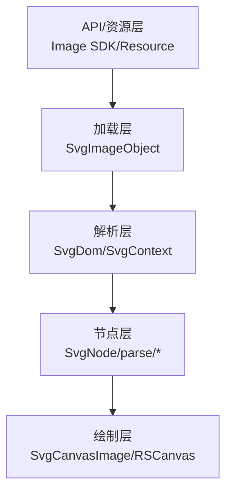
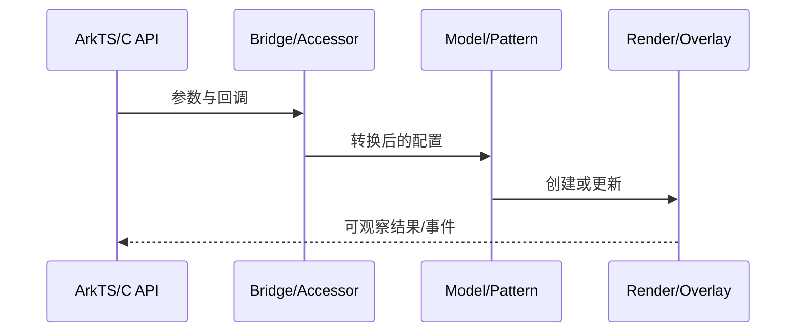
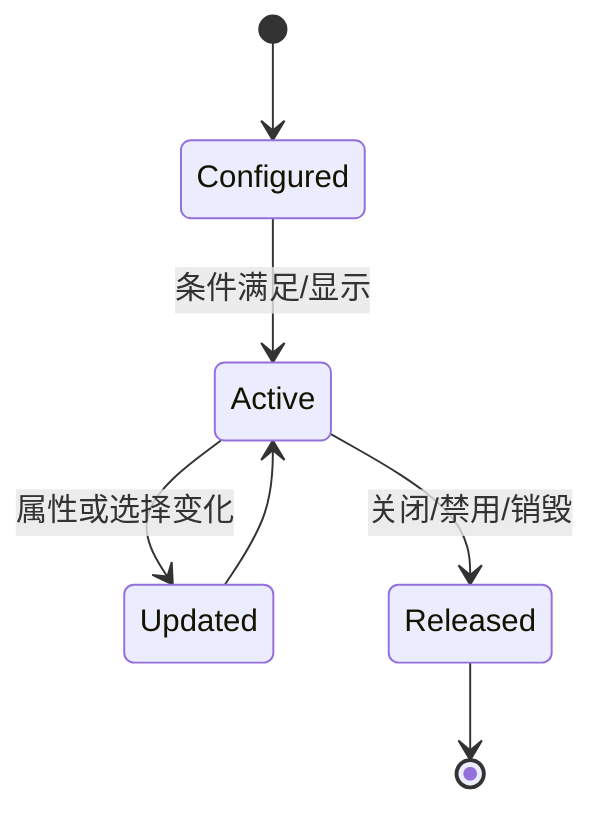
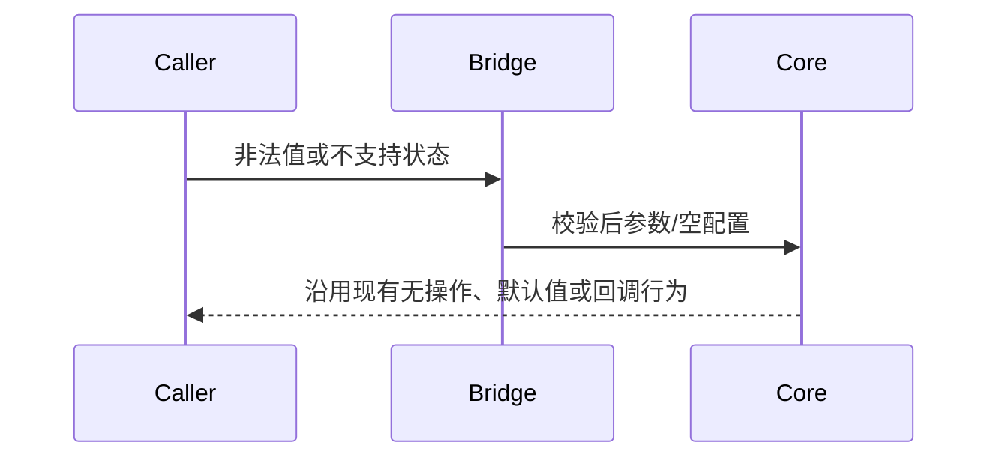

# 架构设计

> 确认目标仓和模块的架构约束、关键设计决策、Spec 拆分方向。

## 设计元数据

| 字段 | 内容 |
|---|---|
| Design ID | DESIGN-Func-04-01-02 |
| 关联需求 | 已有能力补录（无独立 requirement.md） |
| 关联 Epic | 无 |
| 目标 Feature | Feat-01 SVG DOM、标签、属性与样式解析, Feat-02 SVG 坐标缩放、基础图形与文本绘制, Feat-03 SVG 引用、渐变、裁剪、遮罩与滤镜效果, Feat-04 SVG 动画、版本兼容与 Image 集成 |
| 复杂度 | 关键 |
| 目标版本 | 现有 SVG/Image 实现 |
| Owner | ArkUI SIG |
| 状态 | Baselined（已有实现补录） |

## 需求基线

> 本设计记录现有实现，不提出产品行为修改。

| 项 | 补充说明（如需） |
|---|---|
| 实现即规格 | 覆盖 NG SvgDom 与 compatible SVG 文本路径 |
| 版本兼容 | SVG2 切换渐变工厂和完整根绘制路径；legacy filter 目标 API 12 门控 |

## 上下文和现状

### 涉及仓和模块

| 仓库 | 补充架构说明 |
|---|---|
| ace_engine/frameworks/core/components_ng/svg | NG SVG DOM、节点、坐标和效果 |
| ace_engine/frameworks/core/components_ng/image_provider | SVG ImageObject 集成 |
| ace_engine/frameworks/core/components_ng/render/adapter | SvgCanvasImage 绘制与动画桥接 |
| ace_engine/frameworks/compatible/components/svg | compatible 文本 SVG 路径 |

### 调用链层级分析

| 层 | 模块 | 职责 | 修改类型 |
|---|---|---|---|
| API/资源层 | Image SDK/Resource | 提供 SVG 图像源和 ImageFit | 文档补录 |
| 加载层 | SvgImageObject | 由 ImageData 创建 SvgDom | 文档补录 |
| 解析层 | SvgDom/SvgContext | 构建节点、属性、ID 和样式 | 文档补录 |
| 节点层 | SvgNode/parse/* | 生成路径、引用和效果 | 文档补录 |
| 绘制层 | SvgCanvasImage/RSCanvas | 适配尺寸、绘制和动画刷新 | 文档补录 |

- [x] 调用链每一层都已覆盖
- [x] 每层职责边界清晰
- [x] 每层修改类型明确

### 适用架构规则

| Rule ID | 适用原因 | 设计结论 | 验证方式 |
|---|---|---|---|
| OH-ARCH-LAYERING | 涉及前端到渲染/弹窗链路 | 保持现有单向分层调用 | 架构评审/源码审查 |
| OH-ARCH-SUBSYSTEM | 实现位于 ArkUI 仓内 | 不新增跨子系统依赖 | 依赖检查 |
| OH-ARCH-IPC-SAF | 无新增 IPC/SA | N/A | 源码审查 |
| OH-ARCH-API-LEVEL | 涉及存量公开 API | SDK 声明为契约，内部 accessor 不扩展为 NDK | API 评审 |
| OH-ARCH-COMPONENT-BUILD | 不修改构建边界 | BUILD.gn/bundle.json 无变更 | 索引校验 |
| OH-ARCH-ERROR-LOG | 沿用现有返回/降级行为 | 不新增错误码 | 定向测试 |

## 不涉及项承接

| 维度 | 设计结论 |
|---|---|
| 权限/隐私 | 无新增权限、隐私数据或外部网络访问 |
| 持久化/迁移 | 不新增持久化数据和迁移逻辑 |
| 跨进程 | 不新增 IPC、SA 或跨进程协议 |

## 关键设计决策

| 决策 ID | 问题 | 推荐方案 | 探索过的替代方案 | 取舍理由 | 影响 |
|---|---|---|---|---|---|
| ADR-1 | 标签和属性如何解析 | 保持 TAG_FACTORIES 白名单与 SvgContext 集中映射 | 通用 XML DOM、反射工厂、自定义脚本解析 | 现有实现可控且未知标签安全忽略 | Feat-01 |
| ADR-F2-1 | 坐标如何适配 | 保持 SvgFitConvertor + SvgLengthScaleRule | 仅画布缩放、预转换所有坐标 | 兼容 ImageFit 与百分比长度 | Feat-02 |
| ADR-F2-2 | 文本能力如何表述 | 明确 NG 无 text 工厂、compatible 管线保留文本绘制 | 将 compatible 行为误归入 NG、宣称不支持任何文本 | 与真实双管线一致 | Feat-02 |
| ADR-F3-1 | SVG2 渐变实现 | 由 SVG2 flag 优先选择专用 gradient 节点 | 始终 legacy、全局强制新实现 | 保持资源级兼容 | Feat-03 |
| ADR-F3-2 | legacy filter 兼容边界 | 目标 API >= 12 才执行 | 所有版本执行、解析期丢弃 | 与 SvgNode 现有门控一致 | Feat-03 |
| ADR-F4-1 | SVG2 绘制切换范围 | 同时切换根 Draw 签名与长度上下文 | 只切渐变类 | 源码显示完整绘制路径变化 | Feat-04 |
| ADR-F4-2 | Image 集成方式 | SvgImageObject 封装 DOM，SvgCanvasImage 负责绘制/动画 | 转位图后绘制、由 ImagePattern 直接解析 | 避免无谓 rasterize 并保持动画 | Feat-04 |

## 设计骨架

### 骨架范围

| 骨架项 | 目标 | 不包含 | 验证方式 |
|---|---|---|---|
| 规格补录 | 固定现有 API、边界和兼容行为 | 不修改产品实现 | spec 校验 + 源码审查 |
| 共享设计 | 同一 FuncID 的 Feat 共用 design.md | 不建立 Feat 独立 H2 | 章节检查 |

### 骨架 Spec 拆分

| Task ID | 目标 | 受影响文件 | AC |
|---|---|---|---|
| TASK-SKELETON-1 | Feat-01 SVG DOM、标签、属性与样式解析 | Feat-01-svg-dom-parsing-spec.md | 见对应 spec |
| TASK-SKELETON-2 | Feat-02 SVG 坐标缩放、基础图形与文本绘制 | Feat-02-svg-coordinate-shape-text-spec.md | 见对应 spec |
| TASK-SKELETON-3 | Feat-03 SVG 引用、渐变、裁剪、遮罩与滤镜效果 | Feat-03-svg-reference-effects-spec.md | 见对应 spec |
| TASK-SKELETON-4 | Feat-04 SVG 动画、版本兼容与 Image 集成 | Feat-04-svg-animation-image-integration-spec.md | 见对应 spec |

## 后续 Task 拆分

| Task ID | 目标 | 受影响文件 | 依赖 |
|---|---|---|---|
| TASK-040102-01 | Feat-01 SVG DOM、标签、属性与样式解析 | Feat-01-svg-dom-parsing-spec.md | 源码与 SDK 契约 |
| TASK-040102-02 | Feat-02 SVG 坐标缩放、基础图形与文本绘制 | Feat-02-svg-coordinate-shape-text-spec.md | 源码与 SDK 契约 |
| TASK-040102-03 | Feat-03 SVG 引用、渐变、裁剪、遮罩与滤镜效果 | Feat-03-svg-reference-effects-spec.md | 源码与 SDK 契约 |
| TASK-040102-04 | Feat-04 SVG 动画、版本兼容与 Image 集成 | Feat-04-svg-animation-image-integration-spec.md | 源码与 SDK 契约 |

## API 签名、Kit 与权限

### 新增 API

> 本次不新增 API；下表记录存量开放面。

| API 签名 | 类型 | Kit | d.ts 位置 | 权限要求 | SysCap |
|---|---|---|---|---|---|
| Image(src: ResourceStr | ...) | Public | ArkUI | interface/sdk-js/api/@internal/component/ets/image.d.ts | 无 | SystemCapability.ArkUI.ArkUI.Full |

### 变更/废弃 API

| 原有 API | 变更类型 | 新 API | 迁移说明 |
|---|---|---|---|
| N/A | 无 | N/A | 无 |

## 构建系统影响

### BUILD.gn 变更

```text
无。本文档补录现有实现，不修改 BUILD.gn。
```

### bundle.json 变更

无新增 component 或依赖关系。

## 可选设计扩展

### 架构图



### 数据流/控制流

| 步骤 | 调用方 | 被调用方 | 数据/接口 | 说明 |
|---|---|---|---|---|
| 1 | Image SDK/Resource | SvgImageObject | 提供 SVG 图像源和 ImageFit | 沿现有链路传递 |
| 2 | SvgImageObject | SvgDom/SvgContext | 由 ImageData 创建 SvgDom | 沿现有链路传递 |
| 3 | SvgDom/SvgContext | SvgNode/parse/* | 构建节点、属性、ID 和样式 | 沿现有链路传递 |
| 4 | SvgNode/parse/* | SvgCanvasImage/RSCanvas | 生成路径、引用和效果 | 沿现有链路传递 |
| 5 | SvgCanvasImage/RSCanvas | 渲染结果/回调 | 适配尺寸、绘制和动画刷新 | 沿现有链路传递 |

### 时序设计



### 数据模型设计

`SvgDom` 持有 `SvgContext`、根 `SvgNode`、viewBox/layout 和静态标记；`SvgContext` 保存 ID/样式、viewport、动画回调；`SvgCanvasImage` 持有 `RefPtr<SvgDomBase>`。

### 算法与状态机



### 测试性设计

| 测试层级 | 测试目标 | Mock 策略 | 验证方式 |
|---|---|---|---|
| 源码契约 | SDK 与实现映射 | 无 | 路径和行号审查 |
| 组件/预览 | 主路径与边界条件 | 平台能力按现有 mock | 定向 UT 或 previewer 用例 |
| 兼容性 | API 版本差异 | 设置 target API | 版本矩阵审查 |

### 异常传播时序图



### 资源所有权矩阵

| 资源 | 创建方 | 持有方 | 销毁触发 | 实际释放 | 异常回收 |
|---|---|---|---|---|---|
| SvgDom/SvgNode 树 | ImageData/SvgDom | SvgImageObject/SvgCanvasImage | ImageObject/CanvasImage 销毁 | RefPtr 计数归零 | 空引用 CHECK_NULL |
| Animator | SvgAnimation/SvgContext | SvgContext | CanvasImage/DOM 销毁或控制停止 | 现有 Animator 生命周期 | 无 Context 时无操作 |

### 接口参数规约

| 接口 | 参数 | 类型 | 合法范围 | 非法处理 | 边界说明 |
|---|---|---|---|---|---|
| SvgDom::CreateSvgDom | SkStream/src | 流+ImageSourceInfo | 合法 SVG/XML | 返回 nullptr | SVG2 flag 来自 src |
| SvgDom::DrawImage | ImageFit/layout | 枚举+Size | 有效 canvas | 无操作返回 | viewBox 无效时回退 viewport |

### 线程与并发模型

| 操作 | 发起线程 | 回调线程 | 跨进程边界 | 线程安全 | 重入约束 |
|---|---|---|---|---|---|
| API 调用 | UI/ArkTS 线程 | UI/ArkTS 线程 | 无 | 沿用容器与 UI 线程约束 | 回调内修改配置按 SDK 生命周期说明生效 |

## 详细设计

### DOM 与样式解析

显式栈遍历 XML；节点创建后设置 Context/ImagePath，并处理 id/class/style/fill。

实现证据：`frameworks/core/components_ng/svg/svg_dom.cpp:146`。
### 坐标与图形

FitImage 负责裁剪和 ImageFit；各基础图形通过 AsPath 生成 RSRecordingPath。

实现证据：`frameworks/core/components_ng/svg/svg_dom.cpp:385`。
### 引用与效果

ID 映射驱动 use/clip/mask/filter；legacy filter 在目标 API 12 前直接返回。

实现证据：`frameworks/core/components_ng/svg/parse/svg_node.cpp:600`。
### 动画与 Image 集成

动画节点令 DOM 非静态；SvgCanvasImage 转接刷新、完成和播放控制。

实现证据：`frameworks/core/components_ng/render/adapter/svg_canvas_image.cpp:46`。

## 风险和开放问题

| 项 | 类型 | 影响 | 处理方式 | Owner |
|---|---|---|---|---|
| NG SvgDom 未注册 text 标签，文本由 compatible 路径承担 | 架构 | 中 | 规格明确双管线边界，不修改实现 | ArkUI SIG |
| SVG2 同时改变渐变和根绘制路径 | API | 高 | 兼容性测试覆盖 legacy/SVG2 | ArkUI SIG |
| legacy filter 目标 API 12 前无效果 | 测试 | 中 | 加入 target API 11/12 资源用例 | ArkUI SIG |

## 设计审批

- [x] 需求基线已确认，设计覆盖 P0/P1 AC
- [x] 不涉及项已承接，N/A 和展开项都有结论
- [x] 涉及仓和模块职责清楚
- [x] 调用链层级分析完整，每层覆盖到位
- [x] 适用架构规则已识别并形成设计结论
- [x] 分层和子系统边界合规
- [x] API 变更有签名、权限、错误码和兼容性说明
- [x] BUILD.gn/bundle.json 影响明确
- [x] 设计输出和后续 Task 拆分明确
- [x] 关键设计决策有理由和影响说明
- [x] 风险和开放问题有 Owner

**结论:** 通过（已有实现补录）。
