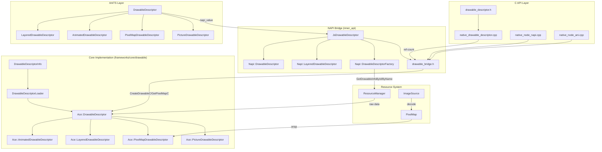
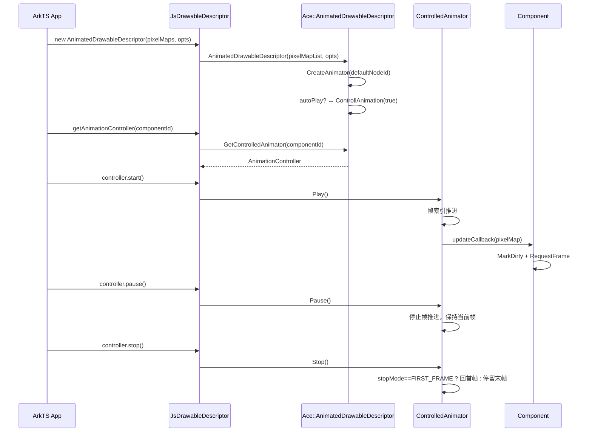
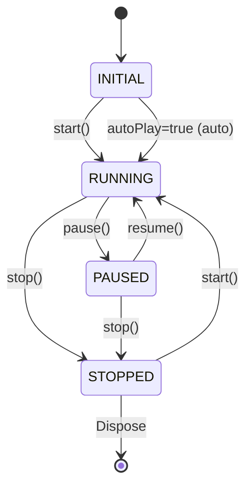

# 架构设计

> DrawableDescriptor 是 ArkUI 中用于表示和管理 drawable 资源的抽象描述符层次，提供资源加载、PixelMap 获取、分层合成、帧动画控制和跨前端桥接能力。

## 设计元数据

| 字段 | 内容 |
|------|------|
| Design ID | `DESIGN-Func-04-01-03` |
| 关联需求 | 已有能力补录（无独立 requirement.md） |
| 关联 Epic | 无 |
| 目标 Feature | Feat-01: DrawableDescriptor 能力 (TS + C API) |
| 复杂度 | 标准 |
| 目标版本 | API 10 ~ 26 |
| Owner | ArkUI SIG |
| 状态 | Baselined（已有实现补录） |

## 需求基线

> 需求基线详见 proposal.md（本特性为已有实现补录，无 proposal）。以下仅列出设计阶段需要额外强调的要点。

| 项 | 补充说明（如需） |
|----|------------------|
| TS API 覆盖 5 个类 + 3 接口/枚举 | DrawableDescriptor / Layered / PixelMap / Animated / Picture |
| C API 覆盖 20+ 函数 | 生命周期、PixelMap 访问、动画配置、动画控制 |
| 跨前端 Bridge 覆盖 4 个函数 | NAPI 通道 2 个 + ANI 通道 2 个 |
| 核心实现为 frameworks/core/drawable | 6 个类：Base + 4 子类 + Info + Loader |
| 旧 inner_api 桥接层保留 | 作为 NAPI 到新核心的过渡层 |

## 上下文和现状

### 涉及仓和模块

| 仓库 | 模块路径 | 当前职责 | 本 Feature 影响 |
|------|----------|----------|----------------|
| ace_engine | `interfaces/inner_api/drawable_descriptor/` | TS 侧 NAPI 桥接层（旧架构）、JsDrawableDescriptor、drawable_bridge | 行为定义 |
| ace_engine | `interfaces/native/drawable_descriptor.h` | C API 公开头文件 | API 契约 |
| ace_engine | `interfaces/native/native_node_napi.h` | NAPI Bridge 声明 | Bridge 契约 |
| ace_engine | `interfaces/native/native_node_ani.h` | ANI Bridge 声明 | Bridge 契约 |
| ace_engine | `interfaces/native/node/` | C API 实现（native_drawable_descriptor.cpp 等） | 实现 |
| ace_engine | `frameworks/core/drawable/` | 新核心实现（Ace::DrawableDescriptor 层次） | 全量实现 |
| interface_sdk_js | `interface/sdk-js/api/@ohos.arkui.drawableDescriptor.d.ts` | 动态 TS API 声明 | API 契约 |
| interface_sdk_js | `interface/sdk-js/api/@ohos.arkui.drawableDescriptor.static.d.ets` | 静态 TS API 声明 | API 契约 |

### 适用架构规则

| Rule ID | 适用原因 | 设计结论 | 验证方式 |
|---------|----------|----------|----------|
| OH-ARCH-LAYERING | inner_api → frameworks/core 跨层调用 | 旧 inner_api(Napi::*) 作为 NAPI 桥接层，新 core(Ace::*) 为实际实现。TS→NAPI→inner_api→core | 架构评审 |
| OH-ARCH-API-LEVEL | C API Public 接口，TS API System 接口 | C API 为 @since 12 NDK 公开接口；TS API 为 @systemapi 内部使用。ABI/API 兼容性受 NDK 规则约束 | API 评审/XTS |
| OH-ARCH-COMPONENT-BUILD | 涉及 `interfaces/inner_api/drawable_descriptor/BUILD.gn` 和 `frameworks/core/drawable/` 构建目标 | 旧 inner_api 和 新 core 共享底层依赖，不引入新外部依赖 | 构建验证 |
| OH-ARCH-ERROR-LOG | 资源加载失败、PixelMap 获取失败等错误路径 | 使用 `HILOGE` 记录失败原因，不暴露敏感路径或资源内容 | 单测/hilog |

## 不涉及项承接

> 本特性为已有实现补录，无 proposal N/A 判定。以下直接给出各维度的设计结论。

| 维度 | 设计结论 |
|------|----------|
| 无障碍 | 不适用——DrawableDescriptor 为数据对象，不直接参与无障碍树 |
| 大字体 | 不适用——不涉及文本渲染 |
| 深色模式 | 不适用——资源选择由 ResourceManager 负责，DrawableDescriptor 不感知主题 |
| 多窗口/分屏 | 不适用——DrawableDescriptor 不感知窗口状态 |
| 多用户 | 不适用——不涉及用户数据隔离 |
| 版本升级 | API 版本差异见兼容性声明。关键版本节点: 10(基础)/12(动画+C API)/21(AnimationController)/22(C动画控制)/23(Static)/24(StopMode)/26(release+Pictue+HDR) |
| 生态兼容 | C API 自 @since 12 起保持 ABI 兼容；TS API 为 System API，不承诺应用级兼容 |

## 关键设计决策

| 决策 ID | 问题 | 推荐方案 | 探索过的替代方案 | 取舍理由 | 影响 |
|---------|------|----------|------------------|----------|------|
| ADR-1 | TS 侧 DrawableDescriptor 的 C++ 实现层如何组织？ | 新旧双架构共存：`interfaces/inner_api/` 保留旧 Napi::DrawableDescriptor 作为 NAPI 桥接，`frameworks/core/drawable/` 承载新 Ace::DrawableDescriptor 核心实现 | 直接在 inner_api 重构为新架构 | 旧 inner_api 涉及 NAPI 绑定和 Factory 模式，重构风险高且收益低。新核心独立演进，旧层仅做转发，逐步迁移 | 两个命名空间的 DrawableDescriptor 共存（Napi:: vs Ace::），通过 JsDrawableDescriptor 和 drawable_bridge 桥接 |
| ADR-2 | LayeredDrawableDescriptor 合成路径如何选择？ | 基于 foreground 尺寸自动判定：288x288→非自适应（固定 192x192 输出），其他→自适应缩放 | 全部使用自适应；或提供参数让调用方选择 | 288x288 为 legacy 图标标准尺寸，非自适应路径保证 backward compatibility | 两条代码路径需独立测试，尺寸判断在 `CreatePixelMap()` 中执行 |
| ADR-3 | 同一 AnimatedDrawableDescriptor 被多组件共享时动画状态如何管理？ | 每个 nodeId 独立维护 ControlledAnimator（`unordered_map<int32_t, RefPtr<ControlledAnimator>>`） | 共享单一 animator 状态；或禁止多组件共享 | per-node 独立状态支持"同一数据源、不同播放进度"的场景，是图标动画的常见需求 | `animators_` map 随组件绑定/解绑增删；内存开销与绑定组件数成正比 |
| ADR-4 | C API 中 ArkTS→Native 的 DrawableDescriptor 传递方向？ | 单向：仅 ArkTS→Native。Native 侧不可创建子类型 DrawableDescriptor | 双向传递（Native 可创建并传回 ArkTS） | C API 仅提供从 PixelMap 创建基础包装的能力；子类型创建依赖资源管理系统，Native 侧不具备该上下文 | Bridge 函数 4 个（NAPI*2 + ANI*2），方向均为 get from ArkTS value → ArkUI_DrawableDescriptor* |
| ADR-5 | 资源加载路径如何统一？ | `DrawableDescriptorInfo` 解析 src 类型（RESOURCE/BASE64/FILE）→ `DrawableDescriptorLoader` 统一加载为 `MediaData` | 各子类自行解析加载 | 集中式加载便于错误处理一致性和缓存策略统一 | 支持 AnimatedDrawableDescriptor(src: ResourceStr) 和 PixelMapDrawableDescriptor(src: ResourceStr) |
| ADR-6 | 内存释放模型？ | TS 侧: API 26 新增 `release()`/`isReleased()` 显式释放 + GC fallback。C 侧: `OH_ArkUI_DrawableDescriptor_Dispose` 显式释放。Bridge 层引用计数 `IncreaseRefCountDrawableC`/`DecreaseRefCountDrawableC` | 纯 GC 管理；或纯手动管理 | 显式 release 允许大数据（PixelMap）提前释放，GC 保证兼容性。引用计数防止 Bridge 传递时过早销毁 | release 后调用任何方法抛出 BusinessError 111002 |

## 设计骨架

### 骨架范围

| 骨架项 | 目标 | 不包含 | 验证方式 |
|--------|------|--------|----------|
| TS API 5 个类 | API 契约定义，行为规则 | 实现细节（Loader/Info 内部） | SDK 编译 + XTS |
| C API 20+ 函数 | NDK 公开接口 | 内部辅助函数 | C API unittest |
| Bridge 4 个函数 | ArkTS↔Native 映射 | 序列化格式 | XTS |
| Core 6 个类 | 核心实现 | 渲染管线集成细节 | C API unittest + SpecTest |

### 骨架 Spec 拆分

| Task ID | 目标 | 受影响文件 | AC |
|---------|------|------------|-----|
| TASK-SKELETON-1 | DrawableDescriptor 全量能力（TS + C API + Bridge） | 见 API 变更分析 | AC-1.1 ~ AC-7.4 |

## 后续 Task 拆分

| Task ID | 目标 | 受影响文件 | 依赖 |
|---------|------|------------|------|
| TASK-SKELETON-1 | [Feat-01] DrawableDescriptor 能力补录 | `specs/04-common-capability/01-image-loading/03-drawable-descriptor/Feat-01-drawable-descriptor-spec.md` | 无（已有实现） |

## API 签名与权限

> 本节承接 spec.md "API 变更分析"中识别的 API，给出签名、权限和 d.ts 位置等实现细节。

### 新增 API

**TS API：**

| API 签名 | 类型 | d.ts 位置 | 权限要求 | SysCap |
|----------|------|-----------|----------|--------|
| `class DrawableDescriptor` | System | `@ohos.arkui.drawableDescriptor.d.ts:83` | 无 | `SystemCapability.ArkUI.ArkUI.Full` |
| `class LayeredDrawableDescriptor extends DrawableDescriptor` | System | `@ohos.arkui.drawableDescriptor.d.ts:199` | 无 | `SystemCapability.ArkUI.ArkUI.Full` |
| `class PixelMapDrawableDescriptor extends DrawableDescriptor` | System | `@ohos.arkui.drawableDescriptor.d.ts:332` | 无 | `SystemCapability.ArkUI.ArkUI.Full` |
| `class AnimatedDrawableDescriptor extends DrawableDescriptor` | System | `@ohos.arkui.drawableDescriptor.d.ts:545` | 无 | `SystemCapability.ArkUI.ArkUI.Full` |
| `class PictureDrawableDescriptor extends DrawableDescriptor` | System | `@ohos.arkui.drawableDescriptor.d.ts:613` | 无 | `SystemCapability.ArkUI.ArkUI.Full` |
| `interface AnimationOptions` | System | `@ohos.arkui.drawableDescriptor.d.ts:408` | 无 | `SystemCapability.ArkUI.ArkUI.Full` |
| `interface AnimationController` | System | `@ohos.arkui.drawableDescriptor.d.ts:477` | 无 | `SystemCapability.ArkUI.ArkUI.Full` |
| `enum AnimationStopMode` | System | `@ohos.arkui.drawableDescriptor.d.ts:375` | 无 | `SystemCapability.ArkUI.ArkUI.Full` |

**C API：**

| API 签名 | 类型 | 头文件位置 | 权限要求 | SysCap |
|----------|------|-----------|----------|--------|
| `ArkUI_DrawableDescriptor* OH_ArkUI_DrawableDescriptor_CreateFromPixelMap(OH_PixelmapNativeHandle)` | Public | `interfaces/native/drawable_descriptor.h:123` | 无 | `SystemCapability.ArkUI.ArkUI.Full` |
| `ArkUI_DrawableDescriptor* OH_ArkUI_DrawableDescriptor_CreateFromAnimatedPixelMap(OH_PixelmapNativeHandle*, int32_t)` | Public | `interfaces/native/drawable_descriptor.h:133` | 无 | `SystemCapability.ArkUI.ArkUI.Full` |
| `void OH_ArkUI_DrawableDescriptor_Dispose(ArkUI_DrawableDescriptor*)` | Public | `interfaces/native/drawable_descriptor.h:142` | 无 | `SystemCapability.ArkUI.ArkUI.Full` |
| `OH_PixelmapNativeHandle OH_ArkUI_DrawableDescriptor_GetStaticPixelMap(ArkUI_DrawableDescriptor*)` | Public | `interfaces/native/drawable_descriptor.h:151` | 无 | `SystemCapability.ArkUI.ArkUI.Full` |
| `OH_PixelmapNativeHandle* OH_ArkUI_DrawableDescriptor_GetAnimatedPixelMapArray(ArkUI_DrawableDescriptor*)` | Public | `interfaces/native/drawable_descriptor.h:160` | 无 | `SystemCapability.ArkUI.ArkUI.Full` |
| `int32_t OH_ArkUI_DrawableDescriptor_GetAnimatedPixelMapArraySize(ArkUI_DrawableDescriptor*)` | Public | `interfaces/native/drawable_descriptor.h:170` | 无 | `SystemCapability.ArkUI.ArkUI.Full` |
| `void OH_ArkUI_DrawableDescriptor_SetAnimationDuration(ArkUI_DrawableDescriptor*, int32_t)` | Public | `interfaces/native/drawable_descriptor.h:179` | 无 | `SystemCapability.ArkUI.ArkUI.Full` |
| `int32_t OH_ArkUI_DrawableDescriptor_GetAnimationDuration(ArkUI_DrawableDescriptor*)` | Public | `interfaces/native/drawable_descriptor.h:188` | 无 | `SystemCapability.ArkUI.ArkUI.Full` |
| `void OH_ArkUI_DrawableDescriptor_SetAnimationIteration(ArkUI_DrawableDescriptor*, int32_t)` | Public | `interfaces/native/drawable_descriptor.h:197` | 无 | `SystemCapability.ArkUI.ArkUI.Full` |
| `int32_t OH_ArkUI_DrawableDescriptor_GetAnimationIteration(ArkUI_DrawableDescriptor*)` | Public | `interfaces/native/drawable_descriptor.h:207` | 无 | `SystemCapability.ArkUI.ArkUI.Full` |
| `int32_t OH_ArkUI_DrawableDescriptor_SetAnimationFrameDurations(ArkUI_DrawableDescriptor*, uint32_t*, size_t)` | Public | `interfaces/native/drawable_descriptor.h:219` | 无 | `SystemCapability.ArkUI.ArkUI.Full` |
| `int32_t OH_ArkUI_DrawableDescriptor_GetAnimationFrameDurations(ArkUI_DrawableDescriptor*, uint32_t*, size_t*)` | Public | `interfaces/native/drawable_descriptor.h:232` | 无 | `SystemCapability.ArkUI.ArkUI.Full` |
| `int32_t OH_ArkUI_DrawableDescriptor_SetAnimationAutoPlay(ArkUI_DrawableDescriptor*, uint32_t)` | Public | `interfaces/native/drawable_descriptor.h:246` | 无 | `SystemCapability.ArkUI.ArkUI.Full` |
| `int32_t OH_ArkUI_DrawableDescriptor_GetAnimationAutoPlay(ArkUI_DrawableDescriptor*, uint32_t*)` | Public | `interfaces/native/drawable_descriptor.h:258` | 无 | `SystemCapability.ArkUI.ArkUI.Full` |
| `int32_t OH_ArkUI_DrawableDescriptor_SetAnimationStopMode(ArkUI_DrawableDescriptor*, DrawableDescriptor_AnimationStopMode)` | Public | `interfaces/native/drawable_descriptor.h:272` | 无 | `SystemCapability.ArkUI.ArkUI.Full` |
| `int32_t OH_ArkUI_DrawableDescriptor_GetAnimationStopMode(const ArkUI_DrawableDescriptor*, DrawableDescriptor_AnimationStopMode*)` | Public | `interfaces/native/drawable_descriptor.h:284` | 无 | `SystemCapability.ArkUI.ArkUI.Full` |
| `int32_t OH_ArkUI_DrawableDescriptor_CreateAnimationController(ArkUI_DrawableDescriptor*, ArkUI_NodeHandle, ArkUI_DrawableDescriptor_AnimationController**)` | Public | `interfaces/native/drawable_descriptor.h:297` | 无 | `SystemCapability.ArkUI.ArkUI.Full` |
| `void OH_ArkUI_DrawableDescriptor_DisposeAnimationController(ArkUI_DrawableDescriptor_AnimationController*)` | Public | `interfaces/native/drawable_descriptor.h:306` | 无 | `SystemCapability.ArkUI.ArkUI.Full` |
| `int32_t OH_ArkUI_DrawableDescriptor_StartAnimation(ArkUI_DrawableDescriptor_AnimationController*)` | Public | `interfaces/native/drawable_descriptor.h:317` | 无 | `SystemCapability.ArkUI.ArkUI.Full` |
| `int32_t OH_ArkUI_DrawableDescriptor_StopAnimation(ArkUI_DrawableDescriptor_AnimationController*)` | Public | `interfaces/native/drawable_descriptor.h:327` | 无 | `SystemCapability.ArkUI.ArkUI.Full` |
| `int32_t OH_ArkUI_DrawableDescriptor_ResumeAnimation(ArkUI_DrawableDescriptor_AnimationController*)` | Public | `interfaces/native/drawable_descriptor.h:337` | 无 | `SystemCapability.ArkUI.ArkUI.Full` |
| `int32_t OH_ArkUI_DrawableDescriptor_PauseAnimation(ArkUI_DrawableDescriptor_AnimationController*)` | Public | `interfaces/native/drawable_descriptor.h:347` | 无 | `SystemCapability.ArkUI.ArkUI.Full` |
| `int32_t OH_ArkUI_DrawableDescriptor_GetAnimationStatus(ArkUI_DrawableDescriptor_AnimationController*, DrawableDescriptor_AnimationStatus*)` | Public | `interfaces/native/drawable_descriptor.h:358` | 无 | `SystemCapability.ArkUI.ArkUI.Full` |

**Bridge API：**

| API 签名 | 类型 | 头文件位置 | 权限要求 | SysCap |
|----------|------|-----------|----------|--------|
| `int32_t OH_ArkUI_GetDrawableDescriptorFromNapiValue(napi_env, napi_value, ArkUI_DrawableDescriptor**)` | Public | `interfaces/native/native_node_napi.h:106` | 无 | `SystemCapability.ArkUI.ArkUI.Full` |
| `int32_t OH_ArkUI_GetDrawableDescriptorFromResourceNapiValue(napi_env, napi_value, ArkUI_DrawableDescriptor**)` | Public | `interfaces/native/native_node_napi.h:121` | 无 | `SystemCapability.ArkUI.ArkUI.Full` |
| `int32_t OH_ArkUI_NativeModule_GetDrawableDescriptorFromAniValue(ani_env*, ani_object, ArkUI_DrawableDescriptor**)` | Public | `interfaces/native/native_node_ani.h:88` | 无 | `SystemCapability.ArkUI.ArkUI.Full` |
| `int32_t OH_ArkUI_NativeModule_GetDrawableDescriptorFromResourceAniValue(ani_env*, ani_object, ArkUI_DrawableDescriptor**)` | Public | `interfaces/native/native_node_ani.h:100` | 无 | `SystemCapability.ArkUI.ArkUI.Full` |

### 变更/废弃 API

无。本特性为已有实现补录。

## 构建系统影响

### BUILD.gn 变更

本特性为已有实现补录，无新增构建变更。关键构建位置：

- `interfaces/inner_api/drawable_descriptor/BUILD.gn` — 旧 NAPI 桥接层编译目标
- `frameworks/core/drawable/` 相关 GN 目标 — 新核心实现

### bundle.json 变更

无。本特性为已有实现补录。

## 可选设计扩展

### 架构图



### 数据模型设计

**TS 侧类层次：**

```
DrawableDescriptor                  // 基类，含 PixelMap + 加载状态
├── LayeredDrawableDescriptor       // foreground + background + mask + blendMode
├── AnimatedDrawableDescriptor      // pixelMapList + animators per nodeId
├── PixelMapDrawableDescriptor      // 单个 PixelMap 包装
└── PictureDrawableDescriptor       // Picture + HDR config
```

**C++ Core 侧类层次（`frameworks/core/drawable/`）：**

```cpp
// drawable_descriptor.h — 基类
class DrawableDescriptor : public AceType {
    ImageSize imageSize_;
    virtual RefPtr<PixelMap> GetPixelMap();
    virtual DrawableType GetDrawableType() const;  // → BASE
    virtual DrawableDescriptorLoadResult LoadSync();
    virtual void LoadAsync(const LoadCallback&& callback);
};

// animated_drawable_descriptor.h — 帧动画
class AnimatedDrawableDescriptor : public DrawableDescriptor {
    bool autoPlay_ = true;
    AnimationStopMode stopMode_ = FIRST_FRAME;
    int32_t totalDuration_ = -1;
    int32_t iterations_ = 1;
    std::vector<RefPtr<PixelMap>> pixelMapList_;
    std::unordered_map<int32_t, RefPtr<ControlledAnimator>> animators_;  // per nodeId
    std::unordered_map<int32_t, UpdateCallback> updateCallbacks_;
};

// layered_drawable_descriptor.h — 分层合成
class LayeredDrawableDescriptor : public DrawableDescriptor {
    RefPtr<PixelMap> foreground_, background_, mask_;
    RefPtr<PixelMap> composePixelMap_;
    bool foregroundOverBackground_ = false;
    int32_t blendMode_ = -1;
    // 合成路径选择: 288x288 → 非自适应 / 其他 → 自适应
};

// pixel_map_drawable_descriptor.h — PixelMap 包装
class PixelMapDrawableDescriptor : public DrawableDescriptor {
    RefPtr<PixelMap> pixelmap_;
    MediaData rawData_;
};

// picture_drawable_descriptor.h — Picture + HDR
class PictureDrawableDescriptor : public DrawableDescriptor {
    RefPtr<Picture> picture_;
    RefPtr<PixelMap> cachedPixelMap_;
    HdrCompositionConfig hdrConfig_;
};

// drawable_descriptor_info.h — 资源源信息
struct DrawableDescriptorInfo : public AceType {
    enum class SrcType { UNDEFINED=-1, RESOURCE=0, BASE64=1, FILE=2 };
    std::string path_;
    SrcType srcType_;
    RefPtr<ResourceObject> resource_;
};

// drawable_descriptor_loader.h — 统一加载器
class DrawableDescriptorLoader : public AceType {
    MediaData LoadData(const RefPtr<DrawableDescriptorInfo>& info);
    // 内部分发: LoadFileData / LoadBase64Data / LoadResourceData
};
```

**C API 侧数据结构（Opaque Handle）：**

```c
typedef struct ArkUI_DrawableDescriptor ArkUI_DrawableDescriptor;        // 不透明句柄
typedef struct ArkUI_DrawableDescriptor_AnimationController
    ArkUI_DrawableDescriptor_AnimationController;                         // 不透明句柄
typedef enum { INITIAL=0, RUNNING=1, PAUSED=2, STOPPED=3 }
    DrawableDescriptor_AnimationStatus;
typedef enum { FIRST_FRAME=0, LAST_FRAME=1 }
    DrawableDescriptor_AnimationStopMode;
```

### 数据流/控制流

| 步骤 | 调用方 | 被调用方 | 数据/接口 | 说明 |
|------|--------|----------|-----------|------|
| 1 | App (ArkTS) | `new AnimatedDrawableDescriptor(src, opts)` | ResourceStr \| PixelMap[] + AnimationOptions | 创建动画描述符 |
| 2 | AnimatedDrawableDescriptor ctor | `DrawableDescriptorInfo(src)` | 解析 src 类型 (RESOURCE/BASE64/FILE) | 判定数据来源 |
| 3 | AnimatedDrawableDescriptor ctor | `DrawableDescriptorLoader::LoadData(info)` | MediaData | 统一加载原始数据 |
| 4 | `getAnimationController(id)` | `ControlledAnimator(nodeId)` | per-nodeId map 查找/创建 | 获取或创建控制器 |
| 5 | `controller.start()` | `ControlledAnimator::Play()` | 帧索引推进 | 开始播放 |
| 6 | 帧更新回调 | `updateCallbacks_[nodeId](pixelMap)` | RefPtr<PixelMap> | 通知组件刷新 |
| 7 | App (Native) | `OH_ArkUI_GetDrawableDescriptorFromNapiValue(env, val, &dd)` | napi_value → ArkUI_DrawableDescriptor* | Bridge 获取 |
| 8 | App (Native) | `OH_ArkUI_DrawableDescriptor_CreateAnimationController(dd, node, &ctrl)` | node handle → controller | 创建 C 侧控制器 |
| 9 | App (Native) | `OH_ArkUI_DrawableDescriptor_StartAnimation(ctrl)` | controller → play | C API 控制播放 |

### 时序设计



### 动画状态机



### 测试性设计

| 测试层级 | 测试目标 | Mock 策略 | 验证方式 |
|----------|----------|-----------|----------|
| C API unittest | C API 生命周期/动画配置/控制 20+ 函数 | PixelMap mock | `capi_all_modifiers_test` |
| 组件 unittest | DrawableDescriptor 绑定到 Image 组件的渲染行为 | ResourceManager mock | `//foundation/arkui/ace_engine/test/unittest` |
| XTS | TS API 完整功能 + 跨前端 Bridge | 真实资源 | `test/xts/` |
| SpecTest | AnimatedDrawableDescriptor 动画播放后的 UI 状态 | Host Preview + Inspector | `examples/SpecTest` |

### 资源所有权矩阵

| 资源 | 创建方 | 持有方 | 销毁触发 | 实际释放 | 异常回收 |
|------|--------|--------|----------|----------|----------|
| `RefPtr<PixelMap>` (per frame) | AnimatedDrawableDescriptor::LoadSync | AnimatedDrawableDescriptor::pixelMapList_ | DrawableDescriptor 析构 | RefPtr 引用计数归零 | RefPtr RAII 保证 |
| `ControlledAnimator` | AnimatedDrawableDescriptor::CreateAnimator | animators_ map (per nodeId) | UnRegisterUpdateCallback 或 析构 | RefPtr 引用计数归零 | RefPtr RAII 保证 |
| `ArkUI_DrawableDescriptor*` (C) | CreateFromPixelMap / Bridge | 调用方 (NDK App) | OH_ArkUI_DrawableDescriptor_Dispose | Dispose 内部释放 | 显式 Dispose |
| `ArkUI_DrawableDescriptor_AnimationController*` (C) | CreateAnimationController | 调用方 (NDK App) | DisposeAnimationController | Dispose 内部释放 | 显式 Dispose |
| `napi_ref` (constructor ref) | JsDrawableDescriptor::Init* | 线程局部 static | 进程退出 | napi_delete_reference | NAPI 生命周期管理 |

### 线程与并发模型

| 操作 | 发起线程 | 回调线程 | 跨进程边界 | 线程安全 | 重入约束 |
|------|----------|----------|------------|----------|----------|
| getPixelMap() | UI 线程 / 任意线程 | 同步返回 | 否 | PixelMap 读写需外部同步 | 无 |
| loadSync() | 调用线程 | 同步返回 | 否（本地 ImageSource） | 否 | 无 |
| load() | 调用线程 | 回调线程（NAPI 微任务） | 否 | callback 不可重入 | callback 只触发一次 |
| AnimationController::start/stop/pause/resume | UI 线程 | UI 线程 (帧回调) | 否 | `animators_` 由 shared_mutex 保护 | 单 nodeId 的 controller 操作需串行 |
| C API Create/Dispose | 任意线程 | 同步返回 | 否 | 调用方保证不并发操作同一 handle | 无 |
| Bridge (GetFromNapiValue) | UI 线程 | 同步返回 | 否 | napi_env 线程安全由 NAPI 保证 | 无 |

## 详细设计

### DrawableDescriptor 基类

**设计要点：**

`Ace::DrawableDescriptor`（`frameworks/core/drawable/drawable_descriptor.h`）是所有描述符的基类，继承自 `AceType`。采用虚函数接口模式，子类覆盖关键行为：

- `GetPixelMap()`: 返回当前 PixelMap，基类默认返回 `nullptr`
- `GetDrawableType()`: 返回子类型枚举（BASE/LAYERED/ANIMATED/PIXELMAP/PICTURE）
- `LoadSync()`: 同步加载，基类默认返回空 `DrawableDescriptorLoadResult`
- `LoadAsync(callback)`: 异步加载
- `RegisterUpdateCallback(nodeId, callback)` / `UnRegisterUpdateCallback(nodeId)`: 注册帧更新回调

**DrawableType 枚举：**

```cpp
enum class DrawableType {
    BASE = 0,       // 基础类型（普通图片）
    LAYERED = 1,    // 分层类型
    ANIMATED = 2,   // 动画类型
    PIXELMAP = 3,   // PixelMap 直接封装
    PICTURE = 4,    // Picture 类型（HDR）
};
```

### LayeredDrawableDescriptor 分层合成

**设计要点：**

`Ace::LayeredDrawableDescriptor`（`frameworks/core/drawable/layered_drawable_descriptor.h`）管理三层独立图像和合成逻辑。

- 三层成员: `foreground_`, `background_`, `mask_`（均为 `RefPtr<PixelMap>`）
- `foregroundOverBackground_` 控制前景合成顺序（默认 false → 前景后于 mask 合成）
- `blendMode_` 设置前景混合模式（默认 -1 → 使用 SRC_ATOP 或不合成前景）

**合成路径选择（`CreatePixelMap()`）：**

```
if (foreground.size == 288x288) → CompositeIconNotAdaptive()  // 固定 192x192 输出
else → CompositeIconAdaptive()                                // 自适应缩放
```

**非自适应合成（`CompositeIconNotAdaptive`）：**
1. 创建 192x192 RSBitmap + Canvas
2. background → SRC blend
3. foregroundOverBackground && foreground → 自定义 blendMode
4. mask → DST_IN
5. !foregroundOverBackground && foreground → SRC_ATOP
6. ReadPixels → PixelMap

**自适应合成（`CompositeIconAdaptive`）：**
1. 创建 background 尺寸的 RSBitmap + Canvas
2. background → SRC blend（等比缩放）
3. foregroundOverBackground && foreground → 自定义 blendMode（等比缩放）
4. mask → DST_IN（拉伸到 background 尺寸）
5. !foregroundOverBackground && foreground → SRC_ATOP（等比缩放）
6. ReadPixels → PixelMap

### AnimatedDrawableDescriptor 动画引擎

**设计要点：**

`Ace::AnimatedDrawableDescriptor`（`frameworks/core/drawable/animated_drawable_descriptor.h`）实现帧动画。

**帧数据管理：**
- `pixelMapList_`: 帧 PixelMap 数组（直接传入或从 ImageSource 解码）
- `userDurations_`: 用户设置的逐帧时长（可选）
- `selfDurations_`: 从 ImageSource 自动获取的逐帧时长

**总时长计算：**
```
if (totalDuration_ >= 0) → 使用 totalDuration_
else if (userDurations_ not empty) → sum(userDurations_)
else → sum(selfDurations_)
```

**per-nodeId Animator 模型：**
```
animators_: unordered_map<int32_t, RefPtr<ControlledAnimator>>
updateCallbacks_: unordered_map<int32_t, UpdateCallback>
```

当组件绑定到 AnimatedDrawableDescriptor 时：
1. `CreateAnimator(nodeId)` 创建 ControlledAnimator
2. `RegisterUpdateCallback(nodeId, callback)` 注册帧更新回调
3. 若 `autoPlay_ == true` → `ControllAnimation(nodeId, true)`

当组件解绑时：
1. `UnRegisterUpdateCallback(nodeId)` 移除并销毁对应 animator

**ControlledAnimator** 封装动画播放控制，由 `base/image/controlled_animator.h` 定义，支持 Play/Pause/Stop/GetStatus。

### DrawableDescriptorInfo + Loader 资源加载

**DrawableDescriptorInfo**（`frameworks/core/drawable/drawable_descriptor_info.h`）：

解析输入 src 的三种类型：

| SrcType | 格式 | 示例 |
|---------|------|------|
| RESOURCE | `$r('app.media.icon')` | 资源管理系统引用 |
| BASE64 | `data:image/png;base64,...` | Base64 编码的图像数据 |
| FILE | `/data/storage/...` | 文件系统路径 |

**DrawableDescriptorLoader**（`frameworks/core/drawable/drawable_descriptor_loader.h:23-40`）：

单例模式，根据 SrcType 分发到对应加载方法：
```
LoadData(info)
  ├── SrcType::FILE     → LoadFileData     (读文件)
  ├── SrcType::BASE64   → LoadBase64Data   (Base64 解码)
  └── SrcType::RESOURCE → LoadResourceData (从 ResourceManager 获取)
```

返回统一的 `MediaData{data, len}` 结构。

### C API 与 Bridge 实现

**C API 实现**（`interfaces/native/node/native_drawable_descriptor.cpp`）：

`ArkUI_DrawableDescriptor` 是不透明句柄，内部持有核心对象的引用。通过 `drawable_bridge.h` 的函数访问核心能力：
- `CreateDrawableC(type)` → 创建对应子类型
- `GetPixelMapC(object, pixelmap)` → 获取 PixelMap
- `AnimatedStartC/StopC/PauseC/ResumeC(object)` → 动画控制
- `IncreaseRefCountDrawableC/DecreaseRefCountDrawableC` → 引用计数管理

**Bridge 实现**（`interfaces/native/node/native_node_napi.cpp` + `native_node_ani.cpp`）：

NAPI Bridge: `OH_ArkUI_GetDrawableDescriptorFromNapiValue`
1. 从 `napi_value` 中提取 JsDrawableDescriptor 的 native 对象
2. 调用 `OH_ArkUI_CreateFromNapiDrawable` 创建 `ArkUI_DrawableDescriptor*`
3. 返回给调用方

ANI Bridge: 同理，从 `ani_object` 提取。

### 旧 inner_api 层（Napi::DrawableDescriptor）

**设计要点：**

旧架构位于 `interfaces/inner_api/drawable_descriptor/`，命名空间 `OHOS::Ace::Napi`：

- `Napi::DrawableDescriptor`: 基于 raw buffer 的基础描述符。持有 `mediaData_` (raw bytes) + `pixelMap_` (Optional)。`GetPixelMap()` 从 buffer 解码或返回缓存。
- `Napi::LayeredDrawableDescriptor`: 从 JSON 资源 buffer 解析 foreground/background/mask。通过 `DrawableDescriptorFactory` 创建。
- `Napi::DrawableDescriptorFactory`: 静态工厂，提供 5 个 `Create` 重载，从资源 ID/name/DataInfo 创建描述符。

旧层通过 `JsDrawableDescriptor` 暴露给 TS 侧，并通过 `drawable_bridge.h` 将功能映射到新核心实现。

## 风险和开放问题

| 项 | 类型 | 影响 | 处理方式 | Owner |
|----|------|------|----------|-------|
| 新旧双架构共存增加维护成本 | 架构 | 中 | 旧 inner_api 层逐步废弃，新功能仅在新核心实现。长期迁移到纯 Ace::DrawableDescriptor。inner_api/drawable_descriptor/ 下的 adapter/base/core/loader/utils 已废弃 | ArkUI SIG |
| C API 不支持 DrawableType 查询 | API | 低 | Native 侧使用时需预先知道类型（创建时已确定）。如需类型查询可后续扩展 C API | ArkUI SIG |
| AnimatedDrawableDescriptor per-node map 无限增长 | 性能 | 低 | 组件解绑时通过 UnRegisterUpdateCallback 移除。长期运行需监控 map 大小 | ArkUI SIG |
| Dynamic vs Static API 签名差异 | 兼容性 | 低 | 差异为语言特性约束（如 `undefined` 支持），语义等价。已记录在兼容性声明中 | ArkUI SIG |
| PictureDrawableDescriptor HDR 合成依赖硬件能力 | 兼容性 | 中 | 在不支持 HDR 的设备上 `getPixelMap()` 返回 SDR 版本 | ArkUI SIG |

## 设计审批

- [x] 需求基线已确认，设计覆盖 P0/P1 AC
- [x] 不涉及项已承接，N/A 和展开项都有结论
- [x] 涉及仓和模块职责清楚
- [x] 适用架构规则已识别并形成设计结论
- [x] 分层和子系统边界合规
- [x] API 变更有签名、权限、错误码和兼容性说明
- [x] BUILD.gn/bundle.json 影响明确
- [x] 设计输出和后续 Task 拆分明确
- [x] 关键设计决策有理由和影响说明
- [x] 风险和开放问题有 Owner

**结论:** 通过（已有实现补录）。
