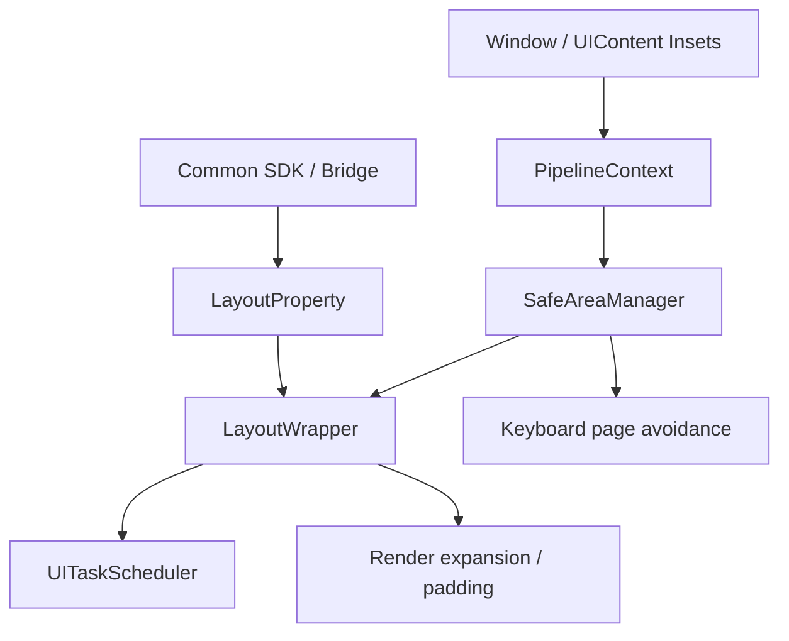
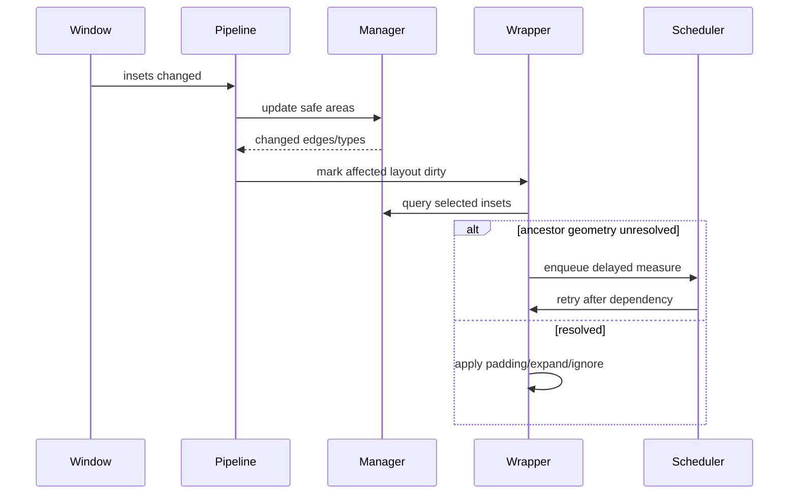
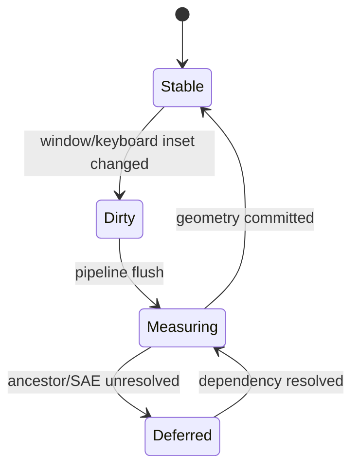
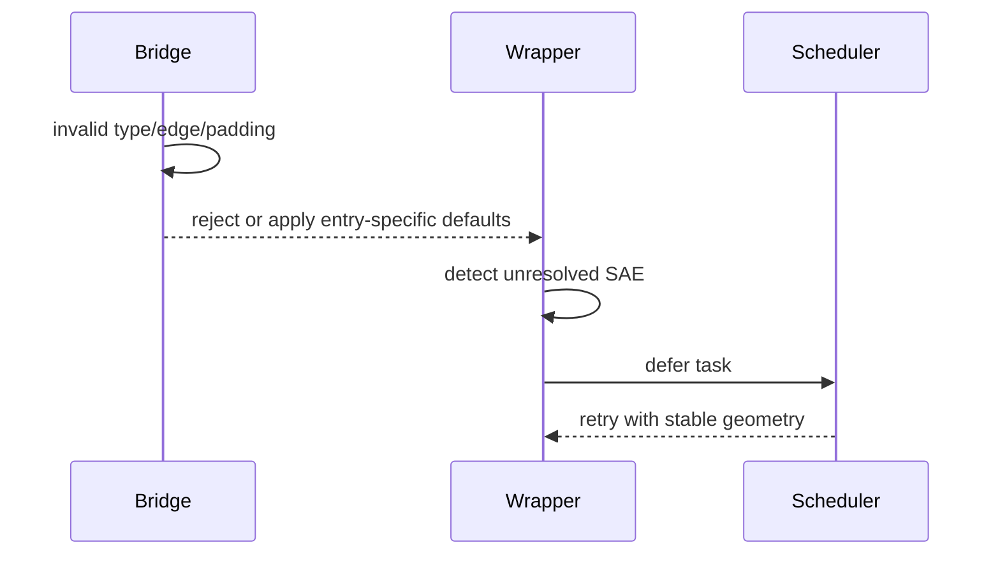

# 架构设计

> ArkUI 安全区机制的架构设计基线，依据窗口输入、Pipeline、SafeAreaManager、LayoutWrapper 与 SDK 既有实现补录。

## 设计元数据

| 字段 | 内容 |
|------|------|
| Design ID | DESIGN-Func-04-02-01 |
| 关联需求 | 已有能力补录（无独立 requirement.md） |
| 关联 Epic | 无 |
| 目标 Feature | Feat-01 数据源与窗口同步；Feat-02 渲染扩展；Feat-03 padding/SAE；Feat-04 ignore layout 调度；Feat-05 键盘避让 |
| 复杂度 | 关键 |
| 目标版本 | API 10–26 |
| Owner | ArkUI SIG |
| 状态 | Baselined（已有实现补录） |

## 需求基线

> 本功能域无 proposal.md；以下承接已批准的存量规格。

| 项 | 补充说明（如需） |
|----|------------------|
| 数据基线 | 聚合 system/cutout/keyboard/navIndicator 等窗口 inset 并同步 Pipeline |
| 组件基线 | expandSafeArea、safeAreaPadding、ignoreLayoutSafeArea 各自处理渲染、padding 和布局调度 |
| 键盘基线 | 键盘 inset 与 resize/offset/none 等页面避让模式协作 |
| 可见契约 | 公共 `LayoutSafeAreaType` 只开放 SYSTEM；KEYBOARD/ALL 等为框架内部分类，不升格为公共枚举 |

## 上下文和现状

### 涉及仓和模块

| 仓库 | 补充架构说明 |
|------|--------------|
| interface_sdk-js — `common.d.ts` / `common.static.d.ets` | 三类组件级安全区属性与公共类型 |
| interface_sdk-js — `@ohos.arkui.UIContext.d.ts` | 键盘避让模式等上层控制 |
| ace_engine adapter — `ui_content_impl.cpp` | 窗口系统 inset 输入 |
| ace_engine — `pipeline_context.cpp` | 同步、脏标记、键盘避让和页面偏移 |
| ace_engine — `safe_area_manager.cpp` | 类型/边合并、缓存、键盘和 SceneBoard 状态 |
| ace_engine — `layout_wrapper.cpp` / `layout_property.cpp` | expansion、padding、SAE 累积和 ignore 处理 |
| ace_engine — `ui_task_scheduler.cpp` | 多阶段布局和未决安全区任务 |

### 调用链层级分析

| 层 | 模块 | 职责 | 修改类型 |
|----|------|------|----------|
| Window/Adapter | UIContent/Window | 提供 system/cutout/keyboard inset | 存量分析 |
| SDK/Bridge | common API 与 JS/Static bridge | 解析类型、边、padding、ignore options | 存量分析 |
| Pipeline | PipelineContext | 接收窗口更新并发起布局/避让 | 存量分析 |
| Manager | SafeAreaManager | 聚合、边缘归一、缓存和查询安全区 | 存量分析 |
| Property | LayoutProperty | 保存 expansion/padding/ignore 选项 | 存量分析 |
| LayoutWrapper | LayoutWrapper | 计算扩展、SAE 累积和节点几何 | 存量分析 |
| Scheduler | UITaskScheduler | 调度依赖未决安全区的附加测量 | 存量分析 |
| Render/Page | RenderContext/PagePattern | 应用扩展和键盘页面避让结果 | 存量分析 |

检查结论：窗口输入至布局/渲染/页面避让的各层均已覆盖。

### 适用架构规则

| Rule ID | 适用原因 | 设计结论 | 验证方式 |
|---------|----------|----------|----------|
| OH-ARCH-LAYERING | 跨 Adapter、Pipeline、Manager、Layout | 窗口数据只经 Pipeline/Manager 下发，节点不直接访问 Window | 架构评审 |
| OH-ARCH-SUBSYSTEM | Window 与 ArkUI 协作 | 使用既有 UIContent 接口，不新增反向依赖 | 集成测试 |
| OH-ARCH-IPC-SAF | 窗口输入可能来自系统服务边界 | adapter 将 Rect 转为边区间；不同类型按现有贴边规则归一，不承诺统一根边界裁剪 | 审查 |
| OH-ARCH-API-LEVEL | 公共类型与内部分类不同 | 以 SDK 公共枚举为准，内部 KEYBOARD/ALL 不外泄 | API 评审/XTS |
| OH-ARCH-COMPONENT-BUILD | 无新 target | 沿用 core/pipeline/adapter 源集 | 构建验证 |
| OH-ARCH-ERROR-LOG | 非法 type/edge/padding 和未决几何 | 按入口分别拒绝、默认写入或调度；C ignore 的非空非法字段回退默认值后仍写入 | UT/Fuzz |

## 不涉及项承接

| 维度 | 设计结论 |
|------|----------|
| 性能 | 涉及；固定类型/边合并，祖先 SAE 首次线性计算后缓存 |
| 兼容性 | 涉及；公共/内部枚举、padding/ignore 的 RTL 映射、expand 的固定物理边、滚动容器、键盘模式和 SceneBoard 分支均保留 |
| 安全与权限 | 不新增权限；窗口数据限几何 inset |
| IPC | 涉及但本域不新增 IPC，只消费窗口归一结果 |
| 构建/持久化/分布式 | N/A，无构建变更和磁盘状态 |

## 关键设计决策

| 决策 ID | 问题 | 推荐方案 | 探索过的替代方案 | 取舍理由 | 影响 |
|---------|------|----------|-----------------|----------|------|
| ADR-1 | 安全区数据由谁统一 | SafeAreaManager 聚合类型与边，Pipeline 负责更新调度 | 节点直接查 Window；各 Pattern 自算 | 避免跨层耦合并保持单一快照 | 所有组件查询同一帧状态 |
| ADR-2 | 组件避让与扩展如何分工 | padding 占布局空间，expand 扩渲染边界，ignore 改布局依赖 | 合并为一个属性；全部转 padding | 三者当前可观察语义和调度不同 | 组合优先级必须单测 |
| ADR-3 | 公共 LayoutSafeAreaType 是否包含键盘 | 仅记录 SDK 的 SYSTEM；KEYBOARD/ALL 保持内部 | 暴露所有内部枚举；文档偷换为同一类型 | 公共契约不能由实现枚举推断扩大 | SDK/Native/内部代码分层描述 |
| ADR-4 | 未决安全区几何如何处理 | 登记附加 measure/layout task，依赖满足后再执行 | 使用零值继续；同步递归测量 | 防止错误几何和重入 | scheduler 多阶段测试 |
| ADR-5 | 键盘避让的优先级 | Manager/Pipeline 按 Page 模式、焦点、caret/Web 等现有分支计算；RESIZE+expand(KEYBOARD,BOTTOM) 仍 resize 且 expansion 不生效，OverlayManager 独立处理浮层 | 一律 resize；一律 translate | 兼容多模式、Page/Overlay 边界和既有 expansion 例外 | 键盘、导航条与安全区组合回归 |

## 设计骨架

### 骨架范围

| 骨架项 | 目标 | 不包含 | 验证方式 |
|--------|------|--------|----------|
| 数据源 | 窗口 inset 聚合与同步 | Window 内部策略 | Manager/Pipeline UT |
| 组件扩展 | expand/padding/ignore | 通用 padding/layout spec | Layout UT |
| 调度 | SAE 缓存和未决任务 | 通用 Pipeline 调度 | Scheduler UT |
| 键盘 | inset 与页面避让 | IME 输入法实现 | 模式集成测试 |

### 骨架 Spec 拆分

| Task ID | 目标 | 受影响文件 | AC |
|---------|------|------------|-----|
| TASK-SKELETON-1 | 窗口同步 | `Feat-01-safe-area-source-window-sync-spec.md` | Feat-01 全部 AC |
| TASK-SKELETON-2 | 渲染扩展 | `Feat-02-render-safe-area-expansion-spec.md` | Feat-02 全部 AC |
| TASK-SKELETON-3 | padding/SAE | `Feat-03-safe-area-padding-sae-accumulation-spec.md` | Feat-03 全部 AC |
| TASK-SKELETON-4 | ignore 调度 | `Feat-04-ignore-layout-safe-area-scheduling-spec.md` | Feat-04 全部 AC |
| TASK-SKELETON-5 | 键盘避让 | `Feat-05-keyboard-safe-area-page-avoidance-spec.md` | Feat-05 全部 AC |

## 后续 Task 拆分

| Task ID | 目标 | 受影响文件 | 依赖 |
|---------|------|------------|------|
| TASK-FEAT-01 | 基线化数据源 | Feat-01 spec | Window/Manager/Pipeline |
| TASK-FEAT-02 | 基线化 expansion | Feat-02 spec | SDK/LayoutWrapper |
| TASK-FEAT-03 | 基线化 padding/SAE | Feat-03 spec | LayoutWrapper |
| TASK-FEAT-04 | 基线化 ignore/scheduling | Feat-04 spec | LayoutProperty/Scheduler |
| TASK-FEAT-05 | 基线化 keyboard avoidance | Feat-05 spec | Manager/Pipeline/Page |

## API 签名、Kit 与权限

### 新增 API

| API 签名 | 类型 | Kit | d.ts 位置 | 权限要求 | SysCap |
|----------|------|-----|------------|----------|--------|
| `expandSafeArea(types?, edges?)` | Public | ArkUI | `api/@internal/component/ets/common.d.ts:8996-9093` | 无 | ArkUI.Full |
| `safeAreaPadding(value)` | Public | ArkUI | `api/@internal/component/ets/common.d.ts:19938-19968` | 无 | ArkUI.Full |
| `ignoreLayoutSafeArea(types?, edges?)` | Public | ArkUI | `api/@internal/component/ets/common.d.ts:9104-9205` | 无 | ArkUI.Full |
| `LayoutSafeAreaType.SYSTEM` | Public | ArkUI | `common.d.ts` | 无 | ArkUI.Full |

### 变更/废弃 API

| 原有 API | 变更类型 | 新 API | 迁移说明 |
|----------|----------|--------|----------|
| 无 | 无 | 无 | 本次只补录；内部 KEYBOARD/ALL 不构成新增公共 API |

## 构建系统影响

### BUILD.gn 变更

```text
无变更；沿用 safe_area manager、pipeline、layout 和 adapter 既有源集。
```

### bundle.json 变更

无新增 component 或依赖。

## 可选设计扩展

### 架构图



### 数据流/控制流

| 步骤 | 调用方 | 被调用方 | 数据/接口 | 说明 |
|------|--------|----------|-----------|------|
| 1 | Window | Pipeline | system/cutout/keyboard insets | Rect 转区间；按类型做贴边归一，不统一裁剪到 rootSize |
| 2 | Pipeline | Manager | SafeAreaInsets | 合并并比较变化 |
| 3 | SDK/Bridge | LayoutProperty | type/edge/padding/ignore | 节点选项 |
| 4 | LayoutWrapper | Manager/祖先 wrapper | 当前安全区与 SAE | 计算几何 |
| 5 | Scheduler | 未决节点 | measure/layout task | 依赖满足后补测 |
| 6 | Pipeline | Page/Render | keyboard offset/resize | 页面避让 |

### 时序设计



### 数据模型设计

```cpp
struct SafeAreaInsets { SafeAreaEdge left, top, right, bottom; };
struct SafeAreaExpandOpts { uint32_t typeMask; uint32_t edgeMask; };
// Public LayoutSafeAreaType currently exposes SYSTEM only.
// Internal masks additionally represent keyboard/all for framework scheduling.
```

### 算法与状态机



### 测试性设计

| 测试层级 | 测试目标 | Mock 策略 | 验证方式 |
|----------|----------|-----------|----------|
| Adapter/Pipeline | inset 更新 | Mock Window | 集成 UT |
| Manager | 类型/边合并 | 注入 Insets | UT |
| Layout | expand/padding/ignore/方向 | LayoutWrapper 树 | expand 固定物理边与 padding/ignore RTL 映射分别断言 |
| Scheduler | 未决依赖 | Mock bundle | 多阶段 UT |
| Page/Overlay | keyboard modes | Mock focus/caret/Web/Overlay | Page 模式、Overlay 独立策略及 RESIZE expansion 例外矩阵 |

### 异常传播时序图



### 资源所有权矩阵

| 资源 | 创建方 | 持有方 | 销毁触发 | 实际释放 | 异常回收 |
|------|--------|--------|----------|----------|----------|
| Insets snapshot | Pipeline | SafeAreaManager | Pipeline 销毁/更新 | 值对象 | 新快照替换 |
| SAE cache | LayoutWrapper | Wrapper | 节点/布局失效 | 值对象 | 脏标记重算 |
| delayed task | Wrapper | Scheduler | 执行/节点销毁 | 队列释放 | 弱节点失效跳过 |

### 接口参数规约

| 接口 | 参数 | 类型 | 合法范围 | 非法处理 | 边界说明 |
|------|------|------|----------|----------|----------|
| expand | types/edges | SafeAreaType[]/SafeAreaEdge[] | SDK 公共枚举 | 按入口默认/忽略 | START/END 固定为物理左/右；KEYBOARD 受页面键盘模式约束 |
| ignore | types/edges | LayoutSafeAreaType[]/LayoutSafeAreaEdge[] | SDK 公共枚举 | ArkTS 按 parser；C null/size=0 拒绝，非空非法字段默认写入 | START/END 按 RTL 映射；edge=0 为 NONE，size>2 忽略额外项 |
| safeAreaPadding | padding | Length/Resource | 可解析非负值 | reset/忽略 | 参与 SAE 累积 |

### 线程与并发模型

| 操作 | 发起线程 | 回调线程 | 跨进程边界 | 线程安全 | 重入约束 |
|------|----------|----------|------------|----------|----------|
| Window 更新 | 平台回调/UI | UI | 输入边界外部 | Pipeline 串行 | 合并后标脏 |
| Layout/keyboard avoidance | UI | UI | 无 | UI 线程串行 | 未决任务延后，不递归布局 |

## 详细设计

### 数据聚合与组件几何

窗口 AvoidArea Rect 经 adapter 转为边区间后由 Pipeline 更新到 SafeAreaManager。区间以 `start<end` 判定有效；SYSTEM/NAVIGATION 的根外有效区间不会被统一裁剪，CUTOUT/FLOAT_NAVIGATION 只按贴边条件归一端点。Manager 按类型和边归并；组件通过 LayoutProperty 选择 expansion、padding 或 ignore。expand 的 START/END 固定为物理左/右，而 padding/ignore 在相应阶段按 RTL 映射。优先顺序和适用限制以各入口、滚动容器及祖先 SAE 状态为准，不将三类属性简单相加。证据：`adapter/ohos/entrance/utils.cpp:130-152`；`frameworks/core/components_ng/manager/safe_area/safe_area_manager.cpp:23-42,78-100,157-177,210-217,285-353`；`frameworks/core/components_ng/layout/layout_wrapper.cpp:324-390,550-605,639-679`。

### 调度与键盘避让

依赖祖先几何的节点进入 Scheduler 附加阶段；键盘 inset 更新后 Pipeline 按 Page 避让模式、焦点/caret 和 Web 特例计算 resize 或 offset。`UIContext.setKeyboardAvoidMode` 不统一控制 OverlayManager 管理的 Dialog/Popup/Menu；RESIZE 下即使设置 `expandSafeArea([KEYBOARD], [BOTTOM])`，Page 仍执行 resize 且该 expansion 不生效。证据：`frameworks/core/pipeline_ng/ui_task_scheduler.cpp:195-227`；`frameworks/core/pipeline_ng/pipeline_context.cpp:3274-3509`；`interface/sdk-js/api/@ohos.arkui.UIContext.d.ts:5437-5447`。

## 风险和开放问题

| 项 | 类型 | 影响 | 处理方式 | Owner |
|----|------|------|----------|-------|
| 公共 SYSTEM 与内部 KEYBOARD/ALL 易混淆 | API | 高 | 文档、SDK 审查和 XTS 明确分层 | ArkUI SIG |
| expansion/padding/ignore 组合优先级复杂 | 架构 | 高 | 组合矩阵与滚动容器回归 | ArkUI SIG |
| 键盘/caret/Web 特殊路径 | 测试 | 中 | 模式化集成用例 | ArkUI SIG |
| 多阶段调度可能漏测 | 测试 | 中 | dependency 未决故障注入 | ArkUI SIG |
| SYSTEM/NAVIGATION 根外区间未统一裁剪 | 可靠性 | 中 | 保留当前输入契约并增加根外区间回归 | ArkUI SIG |
| expand 与 padding/ignore 的 START/END 方向语义不同 | 兼容性 | 高 | 分属性执行 LTR/RTL 矩阵测试 | ArkUI SIG |
| C ignore 非空非法字段会默认写入而非拒绝 | API | 中 | 单列 PARAM_INVALID 与默认写入用例 | ArkUI SIG |
| Page/Overlay 键盘策略与 RESIZE expansion 例外易混淆 | 兼容性 | 高 | Page/Overlay/模式/expand 组合矩阵 | ArkUI SIG |

## 设计审批

- [x] 需求基线已确认，设计覆盖 P0/P1 AC
- [x] 不涉及项已承接，N/A 和展开项都有结论
- [x] 涉及仓和模块职责清楚
- [x] 调用链层级分析完整，每层覆盖到位
- [x] 适用架构规则已识别并形成设计结论
- [x] 分层和子系统边界合规
- [x] API 变更有签名、权限、错误码和兼容性说明
- [x] BUILD.gn/bundle.json 影响明确
- [x] 设计输出和后续 Task 拆分明确
- [x] 关键设计决策有理由和影响说明
- [x] 风险和开放问题有 Owner

**结论:** 通过（已有实现补录）。
