# 架构设计

> 布局属性功能域的架构设计文档，补录已有实现。

## 设计元数据

| 字段 | 内容 |
|------|------|
| Design ID | DESIGN-Func-04-03-01 |
| 关联需求 | 已有能力补录（无独立 requirement.md） |
| 关联 Epic | 无 |
| 目标 Feature | Feat-01 尺寸属性, Feat-02 位置属性, Feat-03 Flex 相关属性 |
| 复杂度 | 复杂 |
| 目标版本 | API 7 起支持，API 10/12/15/21 有行为变更 |
| Owner | ArkUI SIG |
| 状态 | Baselined（已有实现补录） |

## 需求基线

| 项 | 内容 |
|----|------|
| 问题陈述 | 开发者需要通过声明式 API 控制组件的宽高、约束尺寸、内外间距以及组件在父容器中的位置和对齐方式 |
| 核心目标 | （Feat-01）提供 width/height/size/constraintSize/padding/margin 六个核心尺寸属性，支持多种长度单位和百分比，行为与 W3C Box Model 对齐；（Feat-02）提供 position/offset/markAnchor/align/direction 五个位置属性，支持绝对定位、相对偏移、锚点调整、内容对齐和布局方向控制；（Feat-03）提供 flexGrow/flexShrink/flexBasis/alignSelf/layoutWeight/displayPriority 六个 Flex 子项属性，支持弹性空间分配、按比例收缩、主轴基础尺寸、交叉轴对齐覆盖、权重布局和显示优先级淘汰 |
| P0 AC | （Feat-01）所有组件均可设置 width/height/padding/margin，设置后布局正确；constraintSize 约束生效；百分比相对父组件生效；（Feat-02）position 使组件脱离布局流并按坐标定位；offset 在布局位置基础上追加偏移；align 控制子组件对齐方式；direction 控制 Row/Flex 子组件排列方向；（Feat-03）flexGrow/flexShrink 按比例分配/收缩剩余空间；flexBasis 设置主轴基础尺寸；alignSelf 覆盖交叉轴对齐；layoutWeight 按权重分配空间；displayPriority 按优先级淘汰子组件 |

## 上下文和现状

### 涉及仓和模块

| 仓库 | 模块/路径 | 当前职责 | 本 Feature 影响 |
|------|-----------|----------|-----------------|
| ace_engine | `frameworks/core/components_ng/property/measure_property.h` | 存储 CalcLength 格式的用户尺寸约束（MeasureProperty） | 核心数据结构 |
| ace_engine | `frameworks/core/components_ng/layout/layout_property.h/cpp` | 聚合所有布局属性，构建像素级 LayoutConstraintF | 约束构建管线 |
| ace_engine | `frameworks/core/components_ng/property/layout_constraint.h` | 像素级约束数据结构 LayoutConstraintF | 约束传播 |
| ace_engine | `frameworks/core/components_ng/base/view_abstract.h/cpp` | API 入口，SetWidth/SetHeight/SetPadding/SetMargin 等 | API 层 |
| ace_engine | `frameworks/core/components_ng/layout/box_layout_algorithm.cpp` | 默认布局算法，消费约束确定最终尺寸 | 尺寸决策 |
| ace_engine | `frameworks/core/components_ng/base/frame_node.cpp` | Measure/Layout 调度入口 | 执行管线 |
| ace_engine | `frameworks/bridge/declarative_frontend/jsview/js_view_abstract.cpp` | ArkTS API 桥接层，参数解析与校验 | 输入校验 |
| ace_engine | `interfaces/native/native_node.h` | C-API (NDK) 接口定义 | 多语言入口 |
| ace_engine | `frameworks/core/interfaces/native/node/node_common_modifier.cpp` | C-API 到框架层的桥接 | 多语言入口 |
| ace_engine | `frameworks/core/components_ng/render/render_context.h` | 渲染上下文，存储 RenderPositionProperty | Feat-02: position/offset/markAnchor 存储 |
| ace_engine | `frameworks/core/components_ng/render/render_property.h` | 渲染属性组定义（RenderPositionProperty） | Feat-02: 位置属性数据结构 |
| ace_engine | `frameworks/core/components_ng/render/adapter/rosen_render_context.cpp` | Rosen 渲染上下文实现，AdjustPaintRect | Feat-02: 位置属性最终绘制位置计算 |
| ace_engine | `frameworks/core/components_ng/property/position_property.h` | 布局位置属性组（Alignment、LayoutGravity） | Feat-02: align 存储 |
| ace_engine | `frameworks/core/components/common/layout/position_param.h` | EdgesParam 数据结构定义 | Feat-02: edges 定位参数 |
| ace_engine | `frameworks/core/components_ng/pattern/pattern.cpp` | CheckLocalized 本地化属性解析 | Feat-02: RTL 方向解析 |
| ace_engine | `frameworks/core/components_ng/property/flex_property.h` | FlexItemProperty 类定义（FlexGrow/Shrink/Basis/AlignSelf/DisplayIndex） | Feat-03: Flex 子项属性存储 |
| ace_engine | `frameworks/core/components_ng/property/magic_layout_property.h` | MagicItemProperty 结构（LayoutWeight） | Feat-03: layoutWeight 存储 |
| ace_engine | `frameworks/core/components_ng/pattern/flex/flex_layout_algorithm.h/cpp` | Flex 布局算法，消费 Flex 子项属性 | Feat-03: grow/shrink/basis/alignSelf 消费 |
| ace_engine | `frameworks/core/components_ng/pattern/flex/wrap_layout_algorithm.cpp` | FlexWrap 布局算法 | Feat-03: Wrap 容器仅支持 flexGrow |
| ace_engine | `frameworks/core/components_ng/pattern/linear_layout/linear_layout_algorithm.h` | LinearLayoutAlgorithm（Row/Column），继承 FlexLayoutAlgorithm | Feat-03: isLinearLayoutFeature_ 差异化 |
| sdk-js | `api/@internal/component/ets/common.d.ts` | ArkTS 接口声明 | 类型定义 |
| sdk-js | `api/@internal/component/ets/units.d.ts` | Length/SizeOptions/ConstraintSizeOptions 类型 | 类型定义 |

### 调用链层级分析

| 层 | 模块 | 职责 | 修改类型 |
|----|------|------|----------|
| JS Bridge | `declarative_frontend/jsview/js_view_abstract` | 解析 ArkTS 属性调用（JsWidth/JsHeight/JsPadding/JsMargin/JsPosition/JsOffset 等），参数校验、负值处理、API 版本分支 | 存量分析 |
| C-API 定义 | `interfaces/native/native_node.h` | 定义 NDK 属性枚举（NODE_WIDTH/NODE_HEIGHT/NODE_PADDING/NODE_MARGIN/NODE_POSITION/NODE_OFFSET 等） | 存量分析 |
| C-API 桥接 | `core/interfaces/native/node/node_common_modifier` | 将 C-API 调用转换为框架层 ViewAbstract::Set* 调用，执行参数单位转换 | 存量分析 |
| API 层 | `core/components_ng/base/view_abstract` | 框架属性设置统一入口（SetWidth/SetHeight/SetPadding/SetMargin/SetPosition/SetOffset/SetFlexGrow 等），更新 LayoutProperty 或 RenderContext | 存量分析 |
| Property 层 (尺寸) | `core/components_ng/property/measure_property` + `layout/layout_property` | 存储 CalcLength 格式的用户尺寸约束（MeasureProperty: selfIdealSize/minSize/maxSize），聚合 padding/margin | 存量分析 |
| Property 层 (位置) | `core/components_ng/render/render_property` + `property/position_property` | 存储渲染位置属性（RenderPositionProperty: Position/Offset/Anchor/PositionEdges/OffsetEdges）和布局对齐属性（PositionProperty: Alignment/LayoutGravity） | 存量分析 |
| Property 层 (Flex) | `core/components_ng/property/flex_property` + `property/magic_layout_property` | 存储 Flex 子项属性（FlexItemProperty: FlexGrow/FlexShrink/FlexBasis/AlignSelf/DisplayIndex）和权重属性（MagicItemProperty: LayoutWeight） | 存量分析 |
| 约束构建 | `core/components_ng/layout/layout_property` | 约束管线：UpdateLayoutConstraint → SubtractMargin → CheckCalcLayoutConstraint → CheckSelfIdealSize → CheckBorderAndPadding → UpdateContentConstraint，CalcLength 转像素级 LayoutConstraintF | 存量分析 |
| 布局调度 | `core/components_ng/base/frame_node` | Measure/Layout 调度入口，驱动约束构建和布局算法执行，管理脏标记和帧调度 | 存量分析 |
| 布局算法 (默认) | `core/components_ng/layout/box_layout_algorithm` | 默认布局算法，消费 LayoutConstraintF 确定最终 frameSize，执行尺寸决策优先级：selfIdealSize > MATCH_PARENT > contentSize | 存量分析 |
| 布局算法 (Flex) | `core/components_ng/pattern/flex/flex_layout_algorithm` + `wrap_layout_algorithm` + `linear_layout/linear_layout_algorithm` | Flex/Row/Column 布局算法，消费 FlexGrow/FlexShrink/FlexBasis/AlignSelf/LayoutWeight/DisplayPriority，执行 Weight/Priority/Grow-Shrink 三种模式选择 | 存量分析 |
| 渲染定位 | `core/components_ng/render/adapter/rosen_render_context` | AdjustPaintRect 计算最终绘制矩形，消费 position/offset/markAnchor，按优先级（Position > PositionEdges > Offset > OffsetEdges > Anchor）确定 paintRect | 存量分析 |
| 约束数据结构 | `core/components_ng/property/layout_constraint` | 像素级约束数据结构 LayoutConstraintF（minSize/maxSize/selfIdealSize/parentIdealSize/percentReference/scaleProperty） | 存量分析 |

### 适用架构规则

| Rule ID | 适用原因 | 设计结论 | 验证方式 |
|---------|----------|----------|----------|
| OH-ARCH-LAYERING | 尺寸属性涉及 API 层 → Property 层 → Layout 层单向调用 | API(ViewAbstract) → Property(LayoutProperty) → Layout(Algorithm)，严格单向 | 代码评审/依赖检查 |
| OH-ARCH-API-LEVEL | width/height 从 API 7 起支持，API 15 新增 LayoutPolicy 重载 | 各 API 标注 @since 版本号，新重载不破坏旧签名 | API 评审/XTS |
| OH-ARCH-COMPONENT-BUILD | 尺寸属性属于 ace_core_ng，所有组件依赖 | 无需新增 BUILD.gn target，已在 ace_core_ng_source_set 中 | 构建验证 |

## 不涉及项承接

| 维度 | 需求阶段结论 | 设计阶段处理方式 | 设计结论 |
|------|---------|-------------|----------|
| 性能 | 是 | 展开设计 | 尺寸变更触发 PROPERTY_UPDATE_MEASURE，仅脏节点重新测量 |
| 安全与权限 | N/A | 保持 N/A | 尺寸属性无权限要求 |
| 兼容性 | 是 | 展开设计 | API 12 负值行为变更、API 15 LayoutPolicy 重载需关注 |
| API/SDK | 是 | 展开设计 | CommonMethod 接口 + C-API 双通道 |
| IPC/跨进程 | N/A | 保持 N/A | 尺寸属性仅在 UI 线程内处理 |
| 构建与部件 | N/A | 保持 N/A | 无新增部件或 target |

## 关键设计决策

| 决策 ID | 问题 | 推荐方案 | 探索过的替代方案 | 取舍理由 | 影响 |
|---------|------|----------|-----------------|------|------|
| ADR-1 | 长度单位系统如何设计 | CalcDimension/CalcLength 统一类型，支持 VP/PX/FP/LPX/PERCENT/CALC 六种单位 + calc() 表达式 | 方案A：仅支持 VP+PX（简单但灵活性不足）；方案B：运行时字符串解析（性能差） | CalcLength 编译期解析单位、运行期数值转换，兼顾灵活性与性能 | 所有长度属性统一使用 CalcLength |
| ADR-2 | 用户设置的尺寸约束如何存储 | MeasureProperty 存储 CalcLength 格式的 minSize/maxSize/selfIdealSize，延迟到测量阶段转换为像素 | 方案A：设置时立即转换为像素（无法支持百分比/动态 VP 缩放） | 延迟转换支持响应式百分比和屏幕旋转 | MeasureProperty 仅存储 CalcLength，LayoutConstraintF 存储像素值 |
| ADR-3 | padding 和 border 与 selfIdealSize 的关系（Box Model） | border-box 模型：selfIdealSize 包含 padding+border，但保证不小于 padding+border 之和 | 方案A：content-box 模型（padding 额外增加总尺寸）；方案B：不强制最小值 | border-box 对齐主流 UI 框架（CSS border-box），CheckBorderAndPadding 保证可用性 | width(50) + padding(30,30) → selfIdealSize 扩展到 60（不小于 padding+border） |
| ADR-4 | constraintSize 与 width/height 的优先级 | selfIdealSize 受 min/max 约束夹紧：先设置 selfIdealSize，再 Clamp 到 [minSize, maxSize] | 方案A：constraintSize 完全覆盖 width/height（用户困惑）；方案B：width/height 忽略 constraintSize（约束失效） | Clamp 语义清晰：width(100) + maxWidth(50) → 最终 50，符合直觉 | CheckSelfIdealSize 执行 Clamp |
| ADR-5 | 负值和 undefined 的处理策略 | API 12+ 负值重置为默认（ClearWidthOrHeight）；API 12 前负值 Clamp 到 0；undefined 重置为默认 | 方案A：负值一律忽略（静默失败）；方案B：负值抛异常（破坏链式调用） | API 12+ 重置语义更合理（开发者通过负值/undefined 显式清除）；旧版 Clamp 到 0 保持兼容 | 存在 API 版本行为差异，需注意兼容性 |
| ADR-6 | 百分比参照系如何确定 | percentReference 从父节点 contentConstraint 的 parentIdealSize 继承 | 方案A：相对父节点 maxSize（在无固定尺寸的父节点中不确定）；方案B：相对视口大小（不符合层级语义） | 相对父节点已确定尺寸更符合 CSS 百分比语义 | 父节点未设置明确尺寸时百分比可能为 0 |
| ADR-7 | margin 是否参与约束传播 | margin 从父级约束中扣除后传递给子节点：maxSize -= margin, percentReference -= margin | 方案A：margin 不影响约束（布局可能溢出）；方案B：margin 仅影响位置不影响尺寸约束 | 扣除 margin 后传递确保子节点不会超出父节点可用区域 | margin 影响子节点可用空间 |
| ADR-F2-1 | position/offset/markAnchor 存储在哪一层 | 存储在 RenderContext::RenderPositionProperty（渲染属性层） | 方案A：存储在 LayoutProperty（布局属性层）| position/offset/markAnchor 不参与约束计算管线，仅影响最终绘制位置。存储在 RenderContext 避免不必要的 Measure 触发 | position/offset/markAnchor 变更不触发 PROPERTY_UPDATE_MEASURE，仅触发渲染层回调 |
| ADR-F2-2 | position 和 offset 如何区分布局流行为 | position(x/y) 使组件脱离布局流（outOfLayout=true）；position(edges) 在 Flex/Row/Column 算法中**不脱离布局流**；offset 保持在布局流中 | 方案A：两者都脱离布局流（offset 失去意义）；方案B：两者都保持在布局流中（position 无法绝对定位） | position(x/y) 对标 CSS absolute，需要脱离流；但 `frame_node.cpp:3021` 创建 LayoutWrapper 时仅基于 `HasPosition()` 设置 `outOfLayout_` 标志，不含 `HasPositionEdges()`。Flex 算法读的是 LayoutWrapper 的 `outOfLayout_` 标志，因此 position(edges) 在 Flex/Row/Column 中实际不脱离布局流 | 注意：`FrameNode::IsOutOfLayout()` 检查 `HasPosition() \|\| HasPositionEdges()`，与 LayoutWrapper 路径不一致，存在两条 `IsOutOfLayout` 路径 |
| ADR-F2-3 | position 属性支持哪些输入形式 | 支持三种形式：x/y 坐标、edges 边缘距离、localizedEdges 本地化边缘，三者互斥 | 方案A：仅支持 x/y（简单但无法从右/下边缘定位）| x/y 适合简单场景，edges 支持从任意边缘定位（类似 CSS inset），localizedEdges 支持 RTL | Position 和 PositionEdges 互斥存储 |
| ADR-F2-4 | markAnchor 如何影响布局 | markAnchor 仅影响视觉绘制位置（paintRect），不影响布局盒（frameRect） | 方案A：markAnchor 影响布局盒（导致兄弟组件重新布局） | markAnchor 用于微调视觉效果，不应干扰布局流 | 兄弟组件按 markAnchor 不存在的方式布局 |
| ADR-F2-5 | align 存储在哪一层 | 存储在 LayoutProperty::PositionProperty（布局属性层），触发 PROPERTY_UPDATE_LAYOUT | 方案A：存储在 RenderContext（无法参与布局算法） | align 直接影响子组件在 PerformLayout 阶段的偏移计算，必须在 LayoutProperty 中 | align 变更仅触发 Layout（不触发 Measure），性能友好 |
| ADR-F2-6 | direction(AUTO) 的解析策略 | AUTO 解析为系统语言环境（AceApplicationInfo::IsRightToLeft()），不继承父组件 | 方案A：继承父组件 direction（需要向上遍历） | 直接读取系统设置简单高效，避免向上遍历。实际场景中 RTL 通常是全局一致的 | 每个组件独立解析 AUTO，父子 direction 不联动 |
| ADR-F2-7 | position(undefined) 的重置行为 | API ≥ 12: ResetPosition（清除属性，回到布局流）；API < 12: SetPosition(0,0)（仍脱离布局流） | 统一行为（破坏兼容性） | API 12+ 语义更合理（undefined 表示清除），旧版保持兼容 | 存在 API 版本行为差异，重点标注 |
| ADR-F3-1 | layoutWeight 与 flexGrow 互斥优先级 | layoutWeight 存储在 MagicItemProperty，flexGrow 存储在 FlexItemProperty。当 totalFlexWeight > 0 时进入 weight 模式，跳过 grow/shrink 模式 | 方案A：layoutWeight 内部转为 flexGrow（统一但丢失权重语义）；方案B：flexGrow 优先（不符合权重简化设计初衷） | layoutWeight 作为 Row/Column 的简化 API 独立于 flexGrow，权重模式更简单直观（无需考虑内容尺寸），优先满足简化场景 | layoutWeight 和 flexGrow 不应同时使用，混用时 layoutWeight 静默优先 |
| ADR-F3-2 | flexShrink 默认值因父容器而异 | Row/Column（isLinearLayoutFeature_=true）默认 flexShrink=0（不收缩），Flex 默认 flexShrink=1（按比例收缩） | 方案A：统一默认为 0（Flex 容器溢出不收缩，违反 CSS 语义）；方案B：统一默认为 1（Row/Column 意外收缩，破坏旧版兼容性） | Row/Column 定位为简单线性布局（不应意外收缩子组件），Flex 定位为标准 Flexbox（默认收缩对齐 CSS 规范） | 迁移 Row/Column → Flex 时需注意 flexShrink 行为变化 |
| ADR-F3-3 | flexGrow/flexShrink undefined 重置行为不一致 | flexGrow(undefined) 设值为 0.0（不 Reset），flexShrink(undefined) 调用 ResetFlexShrink（清除属性） | 方案A：统一为 Reset（flexGrow undefined 也 Reset）；方案B：统一为设值（flexShrink undefined 也设为 0） | 历史实现差异，修改会破坏兼容性。当前实现即规格 | 开发者应显式使用正值而非依赖 undefined 语义 |
| ADR-F3-4 | flexBasis 拒绝百分比 + layoutWeight API 12 类型差异 | flexBasis 百分比被转为 AUTO（JS 桥接层和 C-API 层均处理）；layoutWeight API < 12 解析为 int32，API ≥ 12 解析为 float | 方案A：flexBasis 支持百分比（需参照系，实现复杂）；方案B：统一使用 float（破坏旧版 int 截断行为） | flexBasis 百分比参照系在约束构建阶段不明确，转为 AUTO 避免歧义。layoutWeight float 升级是渐进增强 | API 12+ layoutWeight 精度变化可能影响布局结果 |
| ADR-F3-5 | alignSelf:STRETCH/BASELINE 二次测量机制 | STRETCH 触发二次测量（needSecondMeasure=true）将交叉轴约束更新为父容器尺寸；BASELINE 收集基线距离并可能增大交叉轴尺寸 | 方案A：一次测量中处理（无法准确获取初始尺寸用于基线计算）；方案B：不实现二次测量（STRETCH 不拉伸到父尺寸） | STRETCH 和 BASELINE 需要先获取初始测量结果才能正确计算交叉轴，二次测量是必要的 | STRETCH/BASELINE 子组件增加一次额外测量开销 |
| ADR-F3-6 | displayPriority 布局淘汰机制 | 子组件按 displayPriority 从高到低布局，空间不足时低优先级子组件被 SetActive(false) 隐藏 | 方案A：所有子组件平等布局（溢出容器）；方案B：通过 overflow 属性控制（需要额外 API） | displayPriority 提供声明式的优先级控制，适合响应式场景（大屏全显示、小屏按优先级裁剪） | 低优先级子组件被隐藏后 frameSize={0,0}，需注意 onAreaChange 不触发 |

## 设计骨架

### 骨架范围

| 骨架项 | 目标 | 不包含 | 验证方式 |
|--------|------|--------|----------|
| 类型系统 | Length/CalcLength/CalcSize/MeasureProperty 类型层次 | 各布局算法内部逻辑 | 编译通过 |
| 约束管线 | UpdateLayoutConstraint → CheckCalcLayoutConstraint → CheckSelfIdealSize → CheckBorderAndPadding 流程 | 具体组件的 MeasureContent 实现 | 布局正确性测试 |
| API 入口 | ViewAbstract::Set*/Reset* + JS 桥接层参数校验 | 动画联动、Modifier 通道 | API 调用测试 |
| C-API 入口 | NODE_WIDTH/HEIGHT/SIZE/CONSTRAINT_SIZE/PADDING/MARGIN 枚举及 dispatch | C-API 高级用法（CustomLayout） | C-API 调用测试 |

### 骨架 Spec 拆分

| Task ID | 目标 | 受影响文件 | AC |
|---------|------|------------|-----|
| TASK-SKELETON-1 | 类型系统与数据结构 | measure_property.h, calc_length.h, dimension.h | WHEN CalcLength 创建各单位值 THEN 类型正确存储 |

## 后续 Task 拆分

| Spec | 目的 | 依赖 | 输出 |
|------|------|------|------|
| Feat-01-size-properties-spec.md | 固化 width/height/size/constraintSize/padding/margin 的行为规格 | 本 Design | 完整行为规格与 AC |
| Feat-02-position-properties-spec.md | 固化 position/offset/markAnchor/align/direction 的行为规格 | 本 Design | 完整行为规格与 AC |
| Feat-03-flex-properties-spec.md | 固化 flexGrow/flexShrink/flexBasis/alignSelf/layoutWeight/displayPriority 的行为规格 | 本 Design | 完整行为规格与 AC |

---

## API 签名、Kit 与权限

### 新增 API

| API 签名 | 类型 | d.ts 位置 | 权限要求 | SysCap |
|----------|------|-----------|----------|--------|
| `width(value: Length): T` | Public | `common.d.ts:24330` | - | - |
| `width(widthValue: Length \| LayoutPolicy): T` | Public | `common.d.ts:24346` | - | - |
| `height(value: Length): T` | Public | `common.d.ts:24388` | - | - |
| `height(heightValue: Length \| LayoutPolicy): T` | Public | `common.d.ts:24404` | - | - |
| `size(value: SizeOptions): T` | Public | `common.d.ts:24591` | - | - |
| `constraintSize(value: ConstraintSizeOptions): T` | Public | `common.d.ts:24639` | - | - |
| `padding(value: Padding \| Length): T` | Public | `common.d.ts:24817` | - | - |
| `padding(value: Padding \| Length \| LocalizedPadding): T` | Public | `common.d.ts:24817` | - | - |
| `margin(value: Margin \| Length): T` | Public | `common.d.ts:24885` | - | - |
| `margin(value: Margin \| Length \| LocalizedMargin): T` | Public | `common.d.ts:24885` | - | - |
| `position(value: Position): T` | Public | `common.d.ts` | - | - |
| `offset(value: Position): T` | Public | `common.d.ts` | - | - |
| `markAnchor(value: Position): T` | Public | `common.d.ts` | - | - |
| `align(value: Alignment): T` | Public | `common.d.ts` | - | - |
| `direction(value: Direction): T` | Public | `common.d.ts` | - | - |
| `flexGrow(value: number): T` | Public | `common.d.ts` | - | - |
| `flexShrink(value: number): T` | Public | `common.d.ts` | - | - |
| `flexBasis(value: number \| string): T` | Public | `common.d.ts` | - | - |
| `alignSelf(value: ItemAlign): T` | Public | `common.d.ts` | - | - |
| `layoutWeight(value: number \| string): T` | Public | `common.d.ts` | - | - |
| `displayPriority(value: number): T` | Public | `common.d.ts` | - | - |

### 变更/废弃 API

| 原有 API | 变更类型 | 新 API | 迁移说明 |
|----------|----------|--------|----------|
| — | — | — | 无变更/废弃 API |

## 构建系统影响

### BUILD.gn 变更

```
无变更。尺寸/位置/Flex 属性实现位于 ace_core_ng_source_set，已有构建配置覆盖。
```

### bundle.json 变更

无变更。

---

## 可选设计扩展

### 架构图

<!-- 展开 -->

```mermaid
graph TB
    subgraph API["API 层 (ArkTS / C-API)"]
        direction LR
        W[".width(100)"]
        H[".height('50%')"]
        P[".padding(10)"]
        M[".margin({top:20})"]
        S[".size({width:100,height:200})"]
        CS[".constraintSize({maxWidth:300})"]
    end

    subgraph PROP["Property 层 (LayoutProperty)"]
        MP["MeasureProperty<br/>• selfIdealSize (CalcSize)<br/>• minSize / maxSize (CalcSize)"]
        PP["PaddingProperty<br/>• top/right/bottom/left<br/>  (CalcLength)"]
        MG["MarginProperty<br/>• top/right/bottom/left<br/>  (CalcLength)"]
    end

    subgraph CONSTR["Constraint 层 (LayoutConstraintF)"]
        direction LR
        SI["selfIdealSize<br/>(px, float)"]
        PI["parentIdealSize<br/>(px, float)"]
        MI["minSize<br/>(px, float)"]
        MA["maxSize<br/>(px, float)"]
        PR["percentReference<br/>(parent content px)"]
        SP["scaleProperty<br/>(vpScale, fpScale, lpxScale)"]
    end

    subgraph ALGO["Layout 算法层"]
        direction LR
        BLA["BoxLayoutAlgorithm / FlexLayoutAlgorithm / ..."]
        MC["MeasureContent(contentConstraint) → contentSize"]
        MR["Measure(layoutWrapper) → frameSize"]
        PRI["尺寸决策优先级:<br/>selfIdealSize > MATCH_PARENT > contentSize<br/>最终 frameSize = Clamp(idealSize, minSize, maxSize)"]
    end

    API -->|"ViewAbstract::SetWidth<br/>JS 桥接层校验"| PROP
    PROP -->|"UpdateLayoutConstraint<br/>(Measure 阶段)"| CONSTR
    CONSTR -->|"传递给 LayoutAlgorithm"| ALGO
```

#### 位置属性架构图（Feat-02）

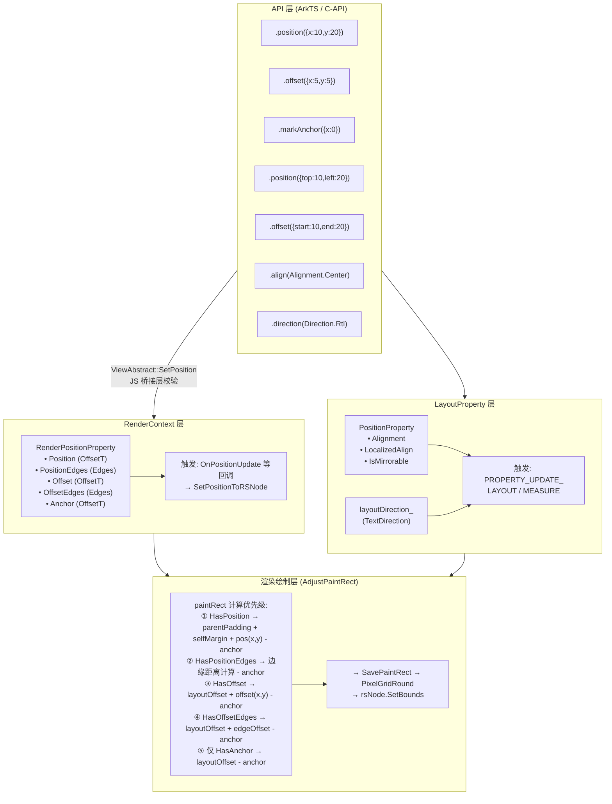

#### Flex 子项属性架构图（Feat-03）

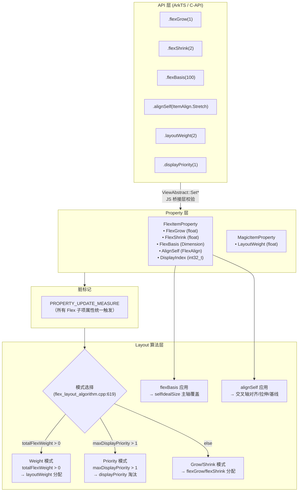

### 数据流/控制流

<!-- 展开 -->

| 步骤 | 调用方 | 被调用方 | 数据/接口 | 说明 |
|------|--------|----------|-----------|------|
| 1 | 开发者 ArkTS | JSViewAbstract::JsWidth | `Length value` | 桥接层解析参数、校验负值 |
| 2 | JSViewAbstract | ViewAbstract::SetWidth | `CalcLength width` | 创建 CalcLength，调用框架层 |
| 3 | ViewAbstract | LayoutProperty::UpdateUserDefinedIdealSize | `CalcSize(w, h)` | 存储到 calcLayoutConstraint_->selfIdealSize |
| 4 | LayoutProperty | PropertyChangeFlag | `PROPERTY_UPDATE_MEASURE` | 标记脏节点，触发下一帧 Measure |
| 5 | Pipeline | FrameNode::Measure | `parentConstraint` | 布局管线调度 |
| 6 | FrameNode | LayoutProperty::UpdateLayoutConstraint | `parentConstraint` | 开始构建本节点约束 |
| 7 | UpdateLayoutConstraint | SubtractMargin | `margin → maxSize, percentRef` | 从父约束扣除 margin |
| 8 | UpdateLayoutConstraint | CheckCalcLayoutConstraint | `CalcLength → px` | CalcLength 转像素，设置 min/max/selfIdealSize |
| 9 | UpdateLayoutConstraint | CheckSelfIdealSize | `Clamp(selfIdeal, min, max)` | 夹紧 selfIdealSize 到约束范围 |
| 10 | UpdateLayoutConstraint | CheckBorderAndPadding | `padding+border → minIdealSize` | 保证 selfIdealSize ≥ padding+border |
| 11 | LayoutProperty | UpdateContentConstraint | `layoutConstraint - padding - border` | 生成 contentConstraint |
| 12 | FrameNode | LayoutAlgorithm::MeasureContent | `contentConstraint` | 组件特定内容测量 |
| 13 | FrameNode | LayoutAlgorithm::Measure | `layoutWrapper` | 确定最终 frameSize |
| 14 | LayoutAlgorithm | GeometryNode::SetFrameSize | `SizeF` | 存储最终像素尺寸 |

### 时序设计

<!-- 展开 -->

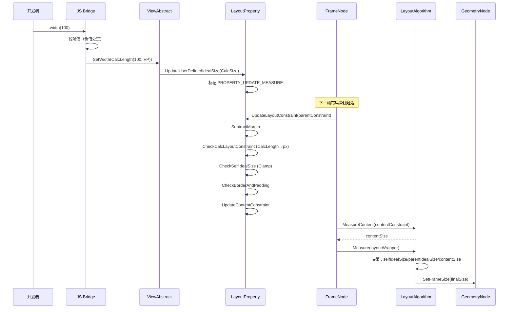

### 数据模型设计

<!-- 展开 -->

```typescript
// ArkTS API 层类型
type Length = string | number | Resource;

interface SizeOptions {
  width?: Length;
  height?: Length;
}

interface ConstraintSizeOptions {
  minWidth?: Length;
  maxWidth?: Length;
  minHeight?: Length;
  maxHeight?: Length;
}

type Padding = {
  top?: Length;
  right?: Length;
  bottom?: Length;
  left?: Length;
};

type Margin = {
  top?: Length;
  right?: Length;
  bottom?: Length;
  left?: Length;
};
```

```cpp
// C++ 框架层数据结构

// 基础单位类型
class Dimension {
    double value_;
    DimensionUnit unit_; // PX, VP, FP, LPX, PERCENT, AUTO, CALC, NONE
};

// 支持 calc() 表达式的长度
class CalcLength {
    Dimension dimension_;
    std::string calcValue_;
    // NormalizeToPx(vpScale, fpScale, lpxScale, parentLength, result) → bool
};

// 宽高对
struct CalcSize {
    std::optional<CalcLength> width_;
    std::optional<CalcLength> height_;
};

// 用户设置的尺寸约束（CalcLength 格式，未转换为像素）
struct MeasureProperty {
    std::optional<CalcSize> minSize;
    std::optional<CalcSize> maxSize;
    std::optional<CalcSize> selfIdealSize; // width()/height()/size() 存储于此
};

// 像素级约束（布局算法消费）
struct LayoutConstraintF {
    ScaleProperty scaleProperty;    // vpScale, fpScale, lpxScale
    SizeF minSize {0, 0};
    SizeF maxSize {Infinity, Infinity};
    SizeF percentReference;         // 百分比参照尺寸
    OptionalSizeF parentIdealSize;
    OptionalSizeF selfIdealSize;    // 从 MeasureProperty 转换而来
};
```

#### 位置属性数据模型（Feat-02）

```typescript
// ArkTS API 层类型
interface Position {
  x?: Length;
  y?: Length;
}

interface Edges {
  top?: Dimension;
  left?: Dimension;
  bottom?: Dimension;
  right?: Dimension;
}

interface LocalizedEdges {
  top?: LengthMetrics;
  start?: LengthMetrics;
  bottom?: LengthMetrics;
  end?: LengthMetrics;
}

interface LocalizedPosition {
  start?: LengthMetrics;
  top?: LengthMetrics;
}

enum Alignment {
  TOP_START = 0, TOP = 1, TOP_END = 2,
  START = 3, CENTER = 4, END = 5,
  BOTTOM_START = 6, BOTTOM = 7, BOTTOM_END = 8
}

enum Direction { Ltr, Rtl, Auto }
```

```cpp
// C++ 框架层数据结构

// 位置偏移对
template <typename T>
struct OffsetT {
    T x_;
    T y_;
};

// 边缘参数
struct EdgesParam {
    std::optional<Dimension> top;
    std::optional<Dimension> left;
    std::optional<Dimension> bottom;
    std::optional<Dimension> right;
    std::optional<Dimension> start;  // RTL 感知
    std::optional<Dimension> end;    // RTL 感知
};

// 渲染位置属性组（存储在 RenderContext）
struct RenderPositionProperty {
    std::optional<OffsetT<Dimension>> Position;     // position x/y
    std::optional<OffsetT<Dimension>> Offset;        // offset x/y
    std::optional<EdgesParam> PositionEdges;         // position edges
    std::optional<EdgesParam> OffsetEdges;           // offset edges
    std::optional<OffsetT<Dimension>> Anchor;        // markAnchor
};

// 布局位置属性组（存储在 LayoutProperty）
struct PositionProperty {
    std::optional<Alignment> Alignment;              // 对齐方式
    std::optional<Alignment> LayoutGravity;           // Stack 子组件重力
    std::optional<std::string> LocalizedAlignment;    // RTL 感知对齐
    std::optional<bool> IsMirrorable;                 // 是否 RTL 镜像
};
```

#### Flex 子项属性数据模型（Feat-03）

```typescript
// ArkTS API 层类型
enum ItemAlign {
  Auto = 0, Start = 1, Center = 2, End = 3,
  Stretch = 4, Baseline = 5
}
```

```cpp
// C++ 框架层数据结构

// Flex 子项属性组（存储在 LayoutProperty::flexItemProperty_）
class FlexItemProperty {
    // flex_property.h:256-260
    ACE_DEFINE_PROPERTY_GROUP_ITEM(FlexGrow, float);      // 默认 0.0
    ACE_DEFINE_PROPERTY_GROUP_ITEM(FlexShrink, float);    // 默认 Row/Column: 0, Flex: 1
    ACE_DEFINE_PROPERTY_GROUP_ITEM(AlignSelf, FlexAlign);  // 默认 AUTO
    ACE_DEFINE_PROPERTY_GROUP_ITEM(FlexBasis, Dimension);  // 默认 AUTO
    ACE_DEFINE_PROPERTY_GROUP_ITEM(DisplayIndex, int32_t); // 默认 1（优先级）
};

// 权重属性（存储在 LayoutProperty::magicItemProperty_）
struct MagicItemProperty {
    // magic_layout_property.h:27
    ACE_DEFINE_PROPERTY_GROUP_ITEM(LayoutWeight, float);  // 默认 0.0
};

// FlexAlign 枚举（C-API 使用）
enum class FlexAlign {
    AUTO = 0, FLEX_START = 1, CENTER = 2, FLEX_END = 3,
    STRETCH = 4, BASELINE = 5, SPACE_BETWEEN = 6,
    SPACE_AROUND = 7, SPACE_EVENLY = 8
};

// 布局算法内部累加结构
struct FlexItemProperties {
    // flex_layout_algorithm.h:27-32
    float totalGrow = 0.0f;
    float totalShrink = 0.0f;
};

// 权重布局节点包装
struct MagicLayoutNode {
    // flex_layout_algorithm.h:34-40
    RefPtr<LayoutWrapper> layoutWrapper;
    LayoutConstraintF layoutConstraint;
    float childLayoutWeight = 0.0f;
    bool needSecondMeasure = false;
};

// 基线属性
struct BaselineProperties {
    // flex_layout_algorithm.h:42-53
    float maxBaselineDistance = 0.0f;
    float maxDistanceAboveBaseline = 0.0f;
    float maxDistanceBelowBaseline = 0.0f;
};
```


## 详细设计

### 盒模型（Box Model）

ArkUI NG 采用 **border-box** 盒模型，与 CSS `box-sizing: border-box` 语义一致。组件的最终帧尺寸（frameSize）包含 content + padding + border 三部分，margin 在帧尺寸之外。

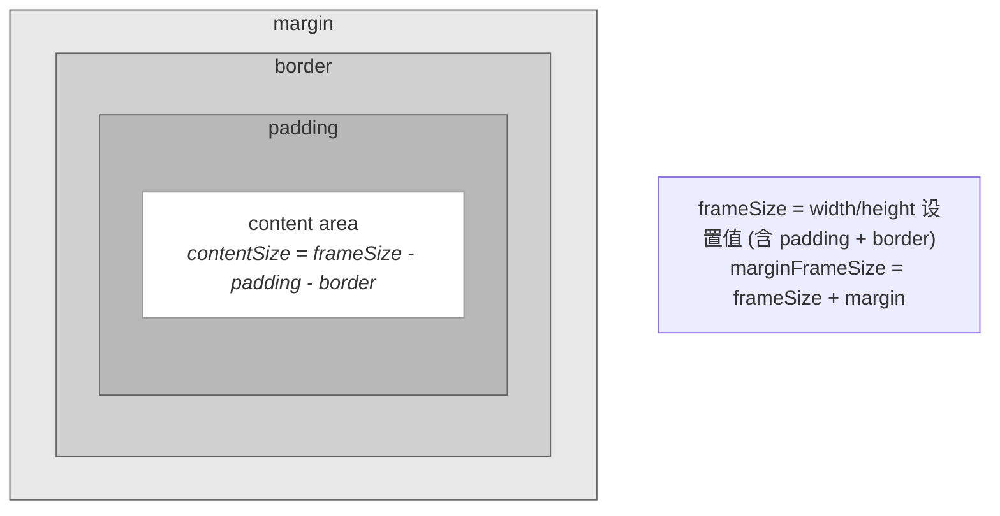

**关键公式：**

| 概念 | 公式 |
|------|------|
| contentSize | `frameSize - padding - border` |
| frameSize | `selfIdealSize`（border-box，已含 padding + border） |
| marginFrameSize | `frameSize + margin.left + margin.right, frameSize + margin.top + margin.bottom` |
| 可用内容宽度 | `selfIdealSize.Width - padding.left - padding.right - border.left - border.right` |
| 可用内容高度 | `selfIdealSize.Height - padding.top - padding.bottom - border.top - border.bottom` |

**CheckBorderAndPadding 保底规则：**

当用户设置的 `selfIdealSize` 小于 `padding + border` 之和时，`selfIdealSize` 被自动扩展为 `padding + border`，保证内容区域不出现负值。

```cpp
// layout_property.cpp — CheckBorderAndPadding 核心逻辑
void LayoutProperty::CheckBorderAndPadding(RefPtr<FrameNode>& host)
{
    auto selfWidth = layoutConstraint_->selfIdealSize.Width();
    auto selfHeight = layoutConstraint_->selfIdealSize.Height();
    if (!selfWidth && !selfHeight) return;

    auto paddingWithBorder = CreatePaddingAndBorderInner(host, true, true);
    auto deflateWidthF = paddingWithBorder.Width();   // padding.left + padding.right + border.left + border.right
    auto deflateHeightF = paddingWithBorder.Height();  // padding.top + padding.bottom + border.top + border.bottom

    // 如果 selfIdealSize 已经 >= padding+border，无需调整
    if (LessOrEqual(deflateWidthF, selfWidthFloat) && LessOrEqual(deflateHeightF, selfHeightFloat)) return;

    // 扩展 selfIdealSize 到至少等于 padding+border
    if (GreatNotEqual(deflateWidthF, selfWidthFloat)) {
        layoutConstraint_->selfIdealSize.SetWidth(deflateWidthF);
    }
    if (GreatNotEqual(deflateHeightF, selfHeightFloat)) {
        layoutConstraint_->selfIdealSize.SetHeight(deflateHeightF);
    }
}
```

**示例：**

| 输入 | 计算过程 | 最终 frameSize |
|------|----------|----------------|
| `width(100).padding(10)` | selfIdealSize=100, padding+border=20, 100≥20 | **100**（content=80） |
| `width(50).padding({left:30,right:30})` | selfIdealSize=50, padding+border=60, 50<60 → 扩展 | **60**（content=0） |
| `width(100).padding(10).border({width:5})` | selfIdealSize=100, padding+border=30, 100≥30 | **100**（content=70） |

### 布局约束管线（Constraint Pipeline）

布局约束管线是尺寸属性从用户设置到最终像素决策的核心转换流程。每次测量（Measure）阶段，约束管线按固定顺序执行以下步骤：

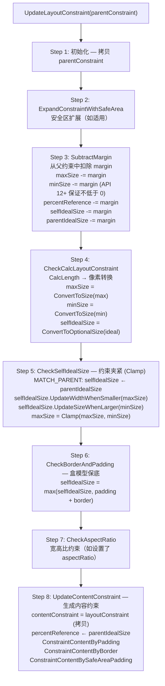

#### Step 3: SubtractMargin 详解

margin 从父约束中扣除后再传递给当前节点，确保当前节点不会超出父节点的可用区域：

```cpp
// layout_property.cpp — UpdateLayoutConstraint 中的 margin 处理
if (margin_) {
    auto margin = CreateMargin();
    if (GreatOrEqualTargetAPIVersion(PlatformVersion::VERSION_TWELVE)) {
        // API 12+: 扣除后保证不为负（NonNegative）
        MinusPaddingToNonNegativeSize(margin, layoutConstraint_->maxSize);
        MinusPaddingToNonNegativeSize(margin, layoutConstraint_->minSize);
        MinusPaddingToNonNegativeSize(margin, layoutConstraint_->percentReference);
    } else {
        // API 12 以前: 直接扣除，可能为负
        MinusPaddingToSize(margin, layoutConstraint_->maxSize);
        MinusPaddingToSize(margin, layoutConstraint_->minSize);
        MinusPaddingToSize(margin, layoutConstraint_->percentReference);
    }
    // selfIdealSize 和 parentIdealSize 直接扣除（已有非负保护）
    MinusPaddingToSize(margin, layoutConstraint_->selfIdealSize);
    MinusPaddingToSize(margin, layoutConstraint_->parentIdealSize);
}
```

**API 版本差异：**
- **API 12+**: `MinusPaddingToNonNegativeSize` 保证 `minSize`、`maxSize`、`percentReference` 扣除 margin 后不低于 0
- **API 12 以前**: `MinusPaddingToSize` 直接做减法，可能产生负值

#### Step 4: CheckCalcLayoutConstraint 详解

将用户设置的 CalcLength 格式约束（存储在 `calcLayoutConstraint_`/`MeasureProperty` 中）转换为像素级的 LayoutConstraintF 值：

```cpp
// layout_property.cpp — CheckCalcLayoutConstraint 核心逻辑
void LayoutProperty::CheckCalcLayoutConstraint(
    RefPtr<FrameNode>& host, const LayoutConstraintF& parentConstraint)
{
    if (!calcLayoutConstraint_) return;

    // maxSize: CalcLength → pixel，取与当前 maxSize 的较小值
    if (calcLayoutConstraint_->maxSize.has_value()) {
        layoutConstraint_->UpdateMaxSizeWithCheck(
            ConvertToSize(calcLayoutConstraint_->maxSize.value(),
                parentConstraint.scaleProperty,
                parentConstraint.percentReference));
    }

    // minSize: CalcLength → pixel，取与当前 minSize 的较大值
    if (calcLayoutConstraint_->minSize.has_value()) {
        layoutConstraint_->UpdateMinSizeWithCheck(
            ConvertToSize(calcLayoutConstraint_->minSize.value(),
                parentConstraint.scaleProperty,
                parentConstraint.percentReference));
    }

    // selfIdealSize: CalcLength → pixel
    if (calcLayoutConstraint_->selfIdealSize.has_value()) {
        layoutConstraint_->UpdateIllegalSelfIdealSizeWithCheck(
            ConvertToOptionalSize(calcLayoutConstraint_->selfIdealSize.value(),
                parentConstraint.scaleProperty,
                parentConstraint.percentReference));
    }
}
```

**关键要点：**
- `ConvertToSize` 使用 **parentConstraint** 的 `scaleProperty`（VP/FP/LPX 缩放系数）和 `percentReference`（百分比参照尺寸）进行转换
- `UpdateMaxSizeWithCheck` 取当前值和新值的**较小值**（约束只能收紧，不能放松）
- `UpdateMinSizeWithCheck` 取当前值和新值的**较大值**（下界只能抬高）
- `UpdateIllegalSelfIdealSizeWithCheck` 允许覆盖已有值（用户显式设置优先）

#### Step 5: CheckSelfIdealSize 详解

对 selfIdealSize 执行 Clamp 操作，确保其在 [minSize, maxSize] 范围内：

```cpp
// layout_property.cpp — CheckSelfIdealSize
void LayoutProperty::CheckSelfIdealSize(const SizeF& originMax)
{
    // MATCH_PARENT 模式：selfIdealSize 继承 parentIdealSize
    if (measureType_ == MeasureType::MATCH_PARENT) {
        layoutConstraint_->UpdateIllegalSelfIdealSizeWithCheck(
            layoutConstraint_->parentIdealSize);
    }
    if (!calcLayoutConstraint_) return;

    SizeF minSize(-1, -1), maxSize(-1, -1);
    // 重新转换 min/max 到像素（使用当前约束的 scaleProperty 和 percentReference）
    if (calcLayoutConstraint_->maxSize.has_value()) {
        maxSize = ConvertToSize(...);
    }
    if (calcLayoutConstraint_->minSize.has_value()) {
        minSize = ConvertToSize(...);
    }

    // Clamp: selfIdealSize 不超过 maxSize
    if (calcLayoutConstraint_->maxSize.has_value()) {
        layoutConstraint_->selfIdealSize.UpdateWidthWhenSmaller(maxSize);
        layoutConstraint_->selfIdealSize.UpdateHeightWhenSmaller(maxSize);
        // 同时更新 layoutConstraint 的 maxSize，保证 maxSize >= minSize
    }

    // Clamp: selfIdealSize 不低于 minSize
    layoutConstraint_->UpdateMinSizeWithCheck(minSize);
    layoutConstraint_->selfIdealSize.UpdateSizeWhenLarger(minSize);
}
```

**约束夹紧优先级示例：**

| 输入 | Clamp 过程 | 最终 selfIdealSize |
|------|-----------|-------------------|
| `width(100).constraintSize({maxWidth:50})` | 100 > 50 → 夹紧到 50 | **50** |
| `width(30).constraintSize({minWidth:50})` | 30 < 50 → 提升到 50 | **50** |
| `width(80).constraintSize({minWidth:50, maxWidth:100})` | 50 ≤ 80 ≤ 100 | **80** |
| `constraintSize({minWidth:100, maxWidth:50})` | minSize > maxSize → maxSize 被修正为 minSize | maxSize=**100** |

### 子节点约束传播（CreateChildConstraint）

父节点完成自身约束构建后，通过 `CreateChildConstraint` 为子节点生成约束：

```cpp
// layout_property.cpp — CreateChildConstraint
LayoutConstraintF LayoutProperty::CreateChildConstraint() const
{
    auto layoutConstraint = contentConstraint_.value();

    // 父节点的 selfIdealSize 成为子节点的 parentIdealSize
    layoutConstraint.parentIdealSize = layoutConstraint.selfIdealSize;

    // 如果父节点有确定的 idealSize，限制子节点的 maxSize 和 percentReference
    if (layoutConstraint.parentIdealSize.Width()) {
        layoutConstraint.maxSize.SetWidth(parentIdealSize.Width().value());
        layoutConstraint.percentReference.SetWidth(parentIdealSize.Width().value());
    }
    if (layoutConstraint.parentIdealSize.Height()) {
        layoutConstraint.maxSize.SetHeight(parentIdealSize.Height().value());
        layoutConstraint.percentReference.SetHeight(parentIdealSize.Height().value());
    }

    // 重置子节点的 selfIdealSize 和 minSize（子节点需自行设置）
    layoutConstraint.selfIdealSize.Reset();
    layoutConstraint.minSize.Reset();

    return layoutConstraint;
}
```

**传播规则：**

| 父节点属性 | 子节点约束影响 |
|-----------|-------------|
| `parentIdealSize` | ← 父节点 `contentConstraint.selfIdealSize` |
| `maxSize` | ← 父节点 `parentIdealSize`（有值时） |
| `percentReference` | ← 父节点 `parentIdealSize`（有值时） |
| `selfIdealSize` | 重置为空（由子节点自身属性决定） |
| `minSize` | 重置为 {0, 0} |

### 内容约束（UpdateContentConstraint）

内容约束是从布局约束中减去 padding + border + safeAreaPadding 后得到的约束，传递给 `LayoutAlgorithm::MeasureContent`：

```cpp
// layout_property.cpp — UpdateContentConstraint
void LayoutProperty::UpdateContentConstraint()
{
    contentConstraint_ = layoutConstraint_.value();

    // 更新 percentReference 为 parentIdealSize（有值时）
    if (contentConstraint_->parentIdealSize.Width()) {
        contentConstraint_->percentReference.SetWidth(parentIdealSize.Width().value());
    }
    if (contentConstraint_->parentIdealSize.Height()) {
        contentConstraint_->percentReference.SetHeight(parentIdealSize.Height().value());
    }

    // 依次扣除 padding → border → safeAreaPadding
    ConstraintContentByPadding();   // contentConstraint 各维度 -= padding
    ConstraintContentByBorder();    // contentConstraint 各维度 -= border
    ConstraintContentBySafeAreaPadding(); // contentConstraint 各维度 -= safeAreaPadding
}
```

**API 版本差异：**
- **API 12+**: 使用 `MinusPaddingToNonNegativeSize`，保证 `minSize`、`maxSize`、`percentReference` 扣除后不低于 0
- **API 12 以前**: 使用 `MinusPadding`，直接减法，可能产生负值

### 完整布局流程

完整的布局流程从 Pipeline 触发开始，经历 Measure（测量）和 Layout（布局）两个阶段：

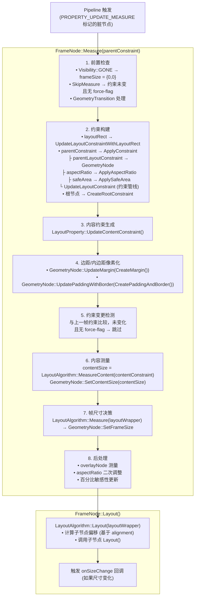

### 尺寸决策算法（BoxLayoutAlgorithm）

`BoxLayoutAlgorithm` 是默认布局算法，其 `PerformMeasureSelfWithChildList` 方法实现了核心尺寸决策逻辑：

```cpp
// box_layout_algorithm.cpp — 尺寸决策伪代码
OptionalSizeF frameSize;

// 优先级 1：使用 selfIdealSize（用户显式设置的 width/height）
frameSize.UpdateSizeWithCheck(layoutConstraint->selfIdealSize);
if (frameSize.IsValid()) → 完成

// 优先级 2：MATCH_PARENT 模式 → 使用 parentIdealSize
if (measureType == MeasureType::MATCH_PARENT) {
    frameSize.UpdateIllegalSizeWithCheck(layoutConstraint->parentIdealSize);
    if (frameSize.IsValid()) {
        frameSize.Constrain(minSize, maxSize);  → 完成
    }
}

// 优先级 3：使用内容尺寸（contentSize 或最大子节点尺寸）
if (content exists) {
    contentSize = content->GetRect().GetSize();
    contentSize += padding;
    frameSize.UpdateIllegalSizeWithCheck(contentSize);
} else {
    childFrame = max(child.GetMarginFrameSize() for each child);
    childFrame += padding;
    frameSize.UpdateIllegalSizeWithCheck(childFrame);
}

// 最终 Clamp 到 [minSize, maxSize]
frameSize.Constrain(minSize, maxSize);
frameSize.UpdateIllegalSizeWithCheck({0, 0});  // 保证不为负

// 写入 GeometryNode
layoutWrapper->GetGeometryNode()->SetFrameSize(frameSize.ConvertToSizeT());
```

**尺寸决策优先级总结：**

```
selfIdealSize（用户设置 width/height）
    > MATCH_PARENT（parentIdealSize）
        > contentSize / childMaxSize + padding
            > 最终 Clamp 到 [minSize, maxSize]
                > 保底 {0, 0}
```

**其中 `UpdateSizeWithCheck` 与 `UpdateIllegalSizeWithCheck` 的区别：**

| 方法 | 行为 | 用途 |
|------|------|------|
| `UpdateSizeWithCheck` | 仅当新值有效（非 NaN、非负）时更新 | 用于高优先级的确定值（selfIdealSize） |
| `UpdateIllegalSizeWithCheck` | 仅当当前值无效（未设置）时用新值填充 | 用于低优先级的 fallback 值 |

### 长度单位转换（CalcLength → Pixel）

CalcLength 到像素的转换发生在 `ConvertToSize`/`ConvertToOptionalSize` 中，使用 `scaleProperty` 和 `percentReference`：

| 单位 | 转换公式 | 说明 |
|------|----------|------|
| VP (默认) | `value × vpScale` | 虚拟像素，适配不同密度屏幕 |
| PX | `value`（不转换） | 物理像素 |
| FP | `value × fpScale` | 字体像素，受用户字体大小设置影响 |
| LPX | `value × lpxScale` | 逻辑像素 |
| PERCENT | `value × percentReference / 100` | 百分比，相对父节点内容区域 |
| CALC | 解析 `calc()` 表达式 | 支持混合运算，如 `calc(100% - 20vp)` |
| AUTO | 不转换，标记为自动 | 由布局算法决定 |

**百分比参照系传播链：**

```
根节点: percentReference = {rootWidth, rootHeight}
    ↓ CreateChildConstraint
父节点: percentReference = parentIdealSize（有确定尺寸时）
    ↓ CreateChildConstraint
子节点: percentReference = 父节点的 parentIdealSize
    ↓ CheckCalcLayoutConstraint
    50% → value × percentReference.Width / 100
```

### Margin 扣除与非负保护

Margin 的处理涉及两种策略，依 API 版本而异：

```cpp
// MinusPaddingToNonNegativeSize (API 12+):
//   minSize、maxSize、percentReference 保证不低于 0
//   parentIdealSize、selfIdealSize 直接减（已有其他保护）
void MinusPaddingToNonNegativeSize(left, right, top, bottom) {
    minSize.MinusPaddingToNonNegative(left, right, top, bottom);
    maxSize.MinusPaddingToNonNegative(left, right, top, bottom);
    parentIdealSize.MinusPadding(left, right, top, bottom);
    selfIdealSize.MinusPadding(left, right, top, bottom);
    percentReference.MinusPaddingToNonNegative(left, right, top, bottom);
}

// MinusPadding (API 12 以前):
//   所有字段直接减，可能产生负值
void MinusPadding(left, right, top, bottom) {
    minSize.MinusPadding(left, right, top, bottom);
    maxSize.MinusPadding(left, right, top, bottom);
    parentIdealSize.MinusPadding(left, right, top, bottom);
    selfIdealSize.MinusPadding(left, right, top, bottom);
    percentReference.MinusPadding(left, right, top, bottom);
}
```

**Margin 与 Padding 对比：**

| 特性 | Margin | Padding |
|------|--------|---------|
| 负值是否允许 | 允许（负 margin 可实现重叠效果） | 不允许（Clamp 到 0） |
| 扣除时机 | UpdateLayoutConstraint Step 3（约束管线早期） | UpdateContentConstraint（约束管线末期） |
| 影响对象 | 当前节点的全部约束维度 | 内容约束（contentConstraint） |
| 是否计入 frameSize | 否（frameSize 不含 margin） | 是（border-box 模型） |

### 负值与异常值处理

#### width/height 负值

```cpp
// js_view_abstract.cpp — JsWidth 负值处理
if (LessNotEqual(value.Value(), 0.0)) {
    if (GreatOrEqualTargetAPIVersion(PlatformVersion::VERSION_TWELVE)) {
        // API 12+: 负值 → 清除 width/height，恢复自适应
        ViewAbstractModel::GetInstance()->ClearWidthOrHeight(true);
    } else {
        // API 12 以前: 负值 → Clamp 到 0
        value.SetValue(0.0);
    }
}
```

#### undefined 处理

```cpp
// js_view_abstract.cpp — JsWidth undefined 处理
if (jsValue->IsUndefined()) {
    ViewAbstractModel::GetInstance()->UpdateLayoutPolicyProperty(LayoutCalPolicy::NO_MATCH, true);
    ViewAbstractModel::GetInstance()->ClearWidthOrHeight(true);
    return true;
}
```

#### constraintSize 无效值

```cpp
// js_view_abstract.cpp — JsConstraintSize
// 解析失败（非有效 Length）时，API 10+ 重置对应的 min/max
if (ParseJsDimensionVp(minWidthValue, minWidth)) {
    SetMinWidth(minWidth);
} else if (version10OrLarger) {
    ResetMinSize(true);  // 重置 minWidth
}
```

#### LayoutConstraintF::Constrain

最终尺寸的安全夹紧：

```cpp
// layout_constraint.cpp — Constrain
SizeF LayoutConstraintT<T>::Constrain(const SizeF& size) const
{
    SizeF constrainSize;
    constrainSize.SetWidth(std::clamp(size.Width(), minSize.Width(), maxSize.Width()));
    constrainSize.SetHeight(std::clamp(size.Height(), minSize.Height(), maxSize.Height()));
    return constrainSize;
}
```

### 根节点约束初始化

根节点（无父节点）通过 `CreateRootConstraint` 初始化约束：

```cpp
// layout_wrapper.cpp — CreateRootConstraint
void LayoutWrapper::CreateRootConstraint()
{
    LayoutConstraintF layoutConstraint;
    layoutConstraint.percentReference.SetWidth(PipelineContext::GetCurrentRootWidth());
    layoutConstraint.percentReference.SetHeight(PipelineContext::GetCurrentRootHeight());
    // maxSize 保持默认 {Infinity, Infinity}
    // minSize 保持默认 {0, 0}
    // selfIdealSize、parentIdealSize 均为空
    layoutProperty->UpdateLayoutConstraint(layoutConstraint);
}
```

根节点的 `percentReference` 等于屏幕/窗口尺寸，因此根节点下的百分比宽高相对于窗口尺寸。

### position/offset/markAnchor 绘制位置计算（AdjustPaintRect）

position/offset/markAnchor 不参与约束管线，而是在渲染阶段通过 `AdjustPaintRect` 计算最终绘制矩形（paintRect）。paintRect 决定了组件在屏幕上的实际绘制位置，与布局盒（frameRect）可能不同。

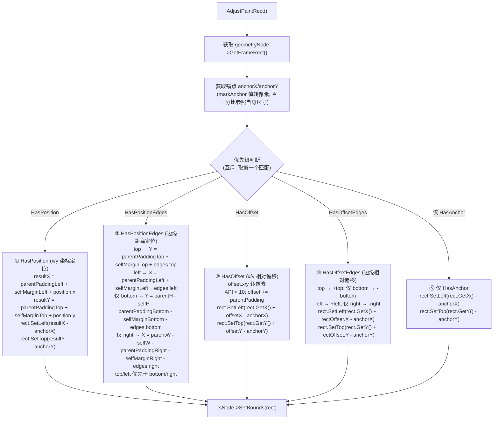

### align 布局消费流程

align 属性存储在 LayoutProperty::PositionProperty 中，在 Layout 阶段由 `BoxLayoutAlgorithm::PerformLayout` 消费，决定子组件在父容器内容区域中的对齐偏移。

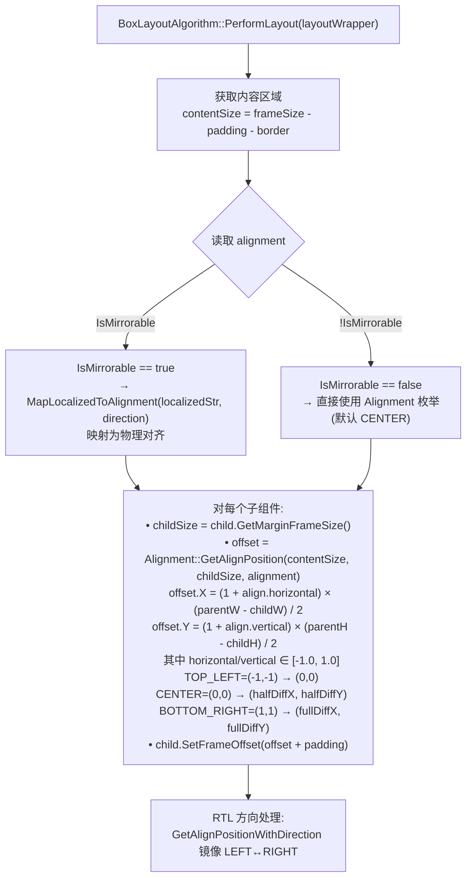

### Flex 子项属性布局模式选择（Feat-03）

FlexLayoutAlgorithm 在布局子组件时，根据属性设置选择不同的布局模式。模式选择具有互斥优先级：

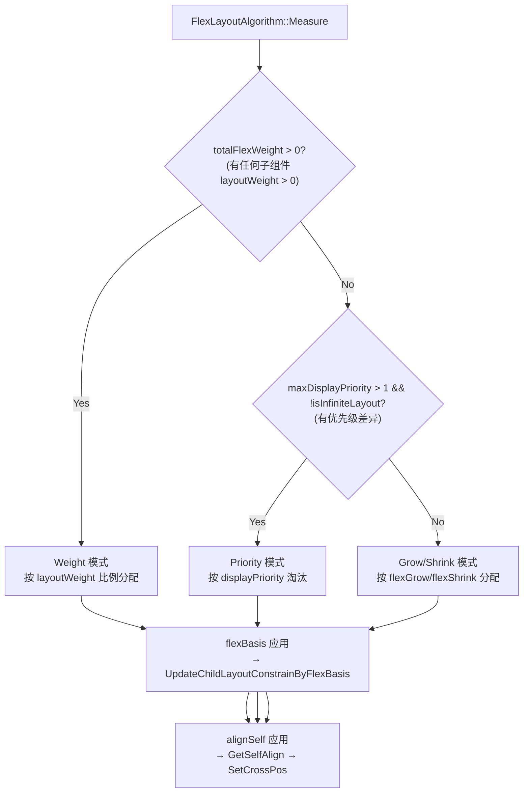

**模式选择源码**（`flex_layout_algorithm.cpp:619-629`）：

```cpp
if (GreatNotEqual(totalFlexWeight_, 0.0f)) {
    MeasureInWeightMode();
} else if (GreatNotEqual(maxDisplayPriority_, 1) && !isInfiniteLayout_) {
    MeasureInPriorityMode(flexItemProperties);
} else {
    // Standard grow/shrink mode
}
```

### flexGrow/flexShrink 空间分配（Feat-03）

#### Grow 模式（剩余空间 > 0）

```cpp
// flex_layout_algorithm.cpp — CheckIsGrowOrShrink (grow branch)
// spacePerFlex = remainSpace / totalGrow
// childExtra = spacePerFlex × childFlexGrow
```

**计算步骤：**
1. 计算 remainSpace = mainAxisSize - Σ(childMainAxisSize)
2. 累加 totalGrow = Σ(childFlexGrow)，跳过 ≤ 0 的值
3. spacePerFlex = remainSpace / totalGrow
4. 每个子组件：childNewSize = childOriginalSize + spacePerFlex × childFlexGrow

#### Shrink 模式（剩余空间 < 0）

```cpp
// flex_layout_algorithm.cpp — CheckIsGrowOrShrink (shrink branch)
// totalShrink = Σ(flexShrink × childMainAxisSize)
// spacePerFlex = overflowSpace / totalShrink
// childShrink = spacePerFlex × childFlexShrink × childMainAxisSize
```

**关键差异：** Shrink 模式下，收缩量与子组件自身尺寸成正比（加权收缩），与 CSS Flexbox 规范一致。

#### 默认值差异（`isLinearLayoutFeature_`）

```cpp
// flex_layout_algorithm.cpp:723
float flexShrink = isLinearLayoutFeature_ ? 0.0f : 1.0f;
```

| 容器类型 | 类 | isLinearLayoutFeature_ | flexShrink 默认值 |
|----------|-----|----------------------|------------------|
| Row/Column | LinearLayoutAlgorithm | true | 0.0（不收缩） |
| Flex | FlexLayoutAlgorithm | false | 1.0（按比例收缩） |

### flexBasis 主轴基础尺寸覆盖（Feat-03）

flexBasis 在测量阶段通过 `UpdateChildLayoutConstrainByFlexBasis` 将主轴 selfIdealSize 覆盖为 flexBasis 像素值：

```cpp
// flex_layout_algorithm.cpp:126-155
void UpdateChildLayoutConstrainByFlexBasis(
    FlexDirection direction, const RefPtr<LayoutWrapper>& child, LayoutConstraintF& layoutConstraint)
{
    const auto& flexBasis = flexItemProperty->GetFlexBasis();
    if (flexBasis->Unit() == DimensionUnit::AUTO || !flexBasis->IsValid()) {
        return; // AUTO: 使用内容尺寸
    }
    // Blank 组件特殊处理：selfIdealSize > flexBasis 时不覆盖
    if (child->GetHostTag() == V2::BLANK_ETS_TAG && selfIdealSize > flexBasis) {
        return;
    }
    if (IsHorizontal(direction)) {
        layoutConstraint.selfIdealSize.SetWidth(flexBasis->ConvertToPx());
    } else {
        layoutConstraint.selfIdealSize.SetHeight(flexBasis->ConvertToPx());
    }
}
```

### layoutWeight 权重分配（Feat-03）

layoutWeight 使用独立于 flexGrow/shrink 的权重模式，空间分配公式更简单：

```
spacePerWeight = remainedMainAxisSize / totalFlexWeight
childSize = max(spacePerWeight × childLayoutWeight, 0.0f)
```

**测量顺序**（`flex_layout_algorithm.cpp:414-548`）：

1. **FirstMeasureInWeightMode**: 测量 layoutWeight = 0 的子组件，累计 consumedSize
2. **SecondMeasureInWeightMode**: remainSpace = mainAxisSize - consumedSize，按权重分配给 layoutWeight > 0 的子组件
3. **FinalMeasureInWeightMode**: 最终确认测量结果

### alignSelf 交叉轴对齐覆盖（Feat-03）

alignSelf 在布局阶段通过 `GetSelfAlign` 解析，覆盖父容器的交叉轴对齐：

```cpp
// flex_layout_algorithm.cpp:1605-1616
FlexAlign GetSelfAlign(const RefPtr<LayoutWrapper>& layoutWrapper) const {
    FlexAlign crossAxisAlign = (crossAxisAlign_ == FlexAlign::AUTO)
        ? FlexAlign::FLEX_START : crossAxisAlign_;
    if (!flexItemProperty || !flexItemProperty->GetAlignSelf().has_value() ||
        flexItemProperty->GetAlignSelf().value() == FlexAlign::AUTO) {
        return crossAxisAlign;  // AUTO: 跟随父容器
    }
    return flexItemProperty->GetAlignSelf().value();
}
```

#### STRETCH 二次测量流程

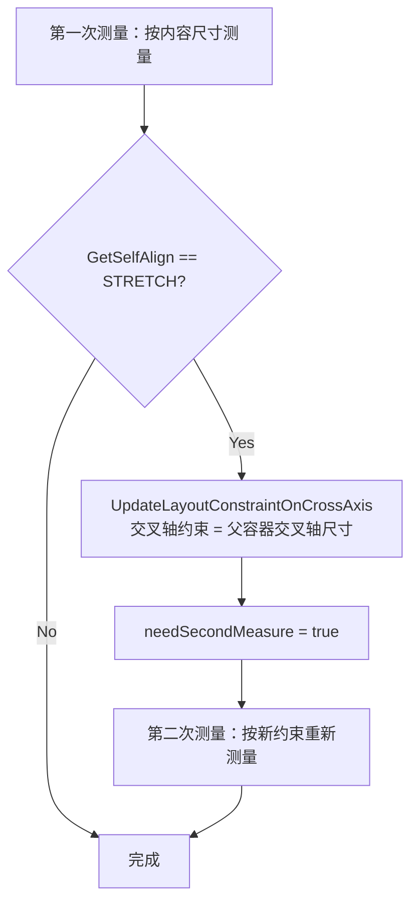

### displayPriority 优先级淘汰（Feat-03）

displayPriority（内部存储为 DisplayIndex）控制子组件的布局优先级：

```cpp
// flex_layout_algorithm.cpp:320
childDisplayPriority = childFlexItemProperty->GetDisplayIndex().value_or(1);
```

**淘汰机制**（`MeasureInPriorityMode`）：
1. 按 displayPriority 从高到低分组（`magicNodes_.rbegin()`）
2. 依次处理每个优先级组
3. 空间不足时，低优先级子组件被 `SetActive(false)`，`frameSize = {0, 0}`

---

## 风险和开放问题

| 项 | 类型 | 影响 | 处理方式 | Owner |
|----|------|------|----------|-------|
| API 12 负值行为变更 | 兼容性 | 中 | 需在规格中明确标注版本差异，旧版 Clamp 到 0，新版 Reset | ArkUI SIG |
| API 15 LayoutPolicy 重载 | API | 中 | width(Length \| LayoutPolicy) 新增重载，不破坏旧签名 | ArkUI SIG |
| 百分比在未定尺寸父节点中为 0 | 架构 | 低 | percentReference 依赖父节点 parentIdealSize，未设置时为 0，符合预期但易误解 | 文档 |
| NaN/Infinity 传入 CalcLength | 架构 | 低 | NaN 导致 NormalizeToPx 返回 false（值无效），Infinity 被接受。Dimension 有 ResetInvalidValue() 但非自动调用 | 标注 |
| CheckBorderAndPadding 扩展 selfIdealSize | 架构 | 低 | border-box 模型下 padding+border 超过 width 时自动扩展，可能不符合开发者预期 | 文档/标注 |
| position(undefined) API 版本行为差异 | 兼容性 | 高 | API ≥ 12: ResetPosition 清除属性，组件回到布局流；API < 12: SetPosition(0,0)，组件仍脱离布局流。行为差异大，需重点标注 | ArkUI SIG |
| direction(AUTO) 不继承父组件 | 架构 | 中 | AUTO 解析为系统语言环境而非父组件 direction，开发者可能预期继承行为。当前实现即规格，标注此差异 | 文档/标注 |
| position/offset 存储在 RenderContext 而非 LayoutProperty | 架构 | 低 | position/offset/markAnchor 存储在 RenderContext::RenderPositionProperty，align/direction 存储在 LayoutProperty。两类属性存储层次不同，影响脏标记传播路径 | 标注 |
| position(edges) 在 Flex 布局中不脱离布局流 | 兼容性 | 高 | `frame_node.cpp:3021` 创建 LayoutWrapper 时仅用 `HasPosition()` 设置 `outOfLayout_`，不含 `HasPositionEdges()`。但 `FrameNode::IsOutOfLayout()` 检查两者。Flex 算法使用 LayoutWrapper 路径，因此 position(edges) 子组件在 Flex/Row/Column 中仍参与布局流分配。这与开发者直觉（position 应脱离布局流）不符 | ArkUI SIG |
| offset API < 10 包含父 padding | 兼容性 | 中 | API < 10: offset 值自动叠加父组件 padding；API ≥ 10: offset 纯粹相对布局位置。存在版本行为差异 | ArkUI SIG |
| layoutWeight 与 flexGrow 互斥 | 架构 | 中 | layoutWeight 存储在 MagicItemProperty，flexGrow 存储在 FlexItemProperty，两者独立存储但布局消费互斥。混用时 layoutWeight 静默优先，开发者可能困惑 | 文档/标注 |
| flexShrink 默认值因父容器而异 | 兼容性 | 中 | Row/Column 默认 flexShrink=0 不收缩，Flex 默认 flexShrink=1 收缩。迁移容器类型时行为可能不符合预期 | ArkUI SIG |
| flexGrow/flexShrink undefined 行为不一致 | 架构 | 低 | flexGrow(undefined) 设值为 0，flexShrink(undefined) 触发 Reset。历史实现差异，当前实现即规格 | 标注 |
| layoutWeight API 12 float 升级 | 兼容性 | 低 | API < 12 解析为 int32（截断小数），API ≥ 12 解析为 float。迁移后权重精度变化可能影响布局 | ArkUI SIG |
| alignSelf:STRETCH 二次测量性能 | 性能 | 低 | STRETCH 和 BASELINE 触发二次测量（needSecondMeasure=true），大量子组件使用时增加测量开销 | 文档/标注 |
| displayPriority 隐藏组件不触发 onAreaChange | 架构 | 中 | 低优先级组件被 SetActive(false) 后 frameSize={0,0}，但不会触发 onAreaChange 回调。开发者可能依赖该回调感知组件状态 | 文档/标注 |
| WrapLayoutAlgorithm 不支持 flexShrink/layoutWeight | 架构 | 低 | FlexWrap 容器仅消费 flexGrow，不消费 flexShrink 和 layoutWeight。在 FlexWrap 中设置这些属性静默无效 | 文档/标注 |

---

## 设计审批

- [x] 需求基线已确认，设计覆盖 P0/P1 AC
- [x] 不涉及项已承接，N/A 和展开项都有结论
- [x] 涉及仓和模块职责清楚
- [x] 适用架构规则已识别并形成设计结论
- [x] 分层和子系统边界合规
- [x] API 变更有签名、权限、错误码和兼容性说明
- [x] BUILD.gn/bundle.json 影响明确
- [x] 设计输出和后续 Task 拆分明确
- [x] 关键设计决策有理由和影响说明
- [x] 风险和开放问题有 Owner

**结论:** 通过（已有实现补录）
