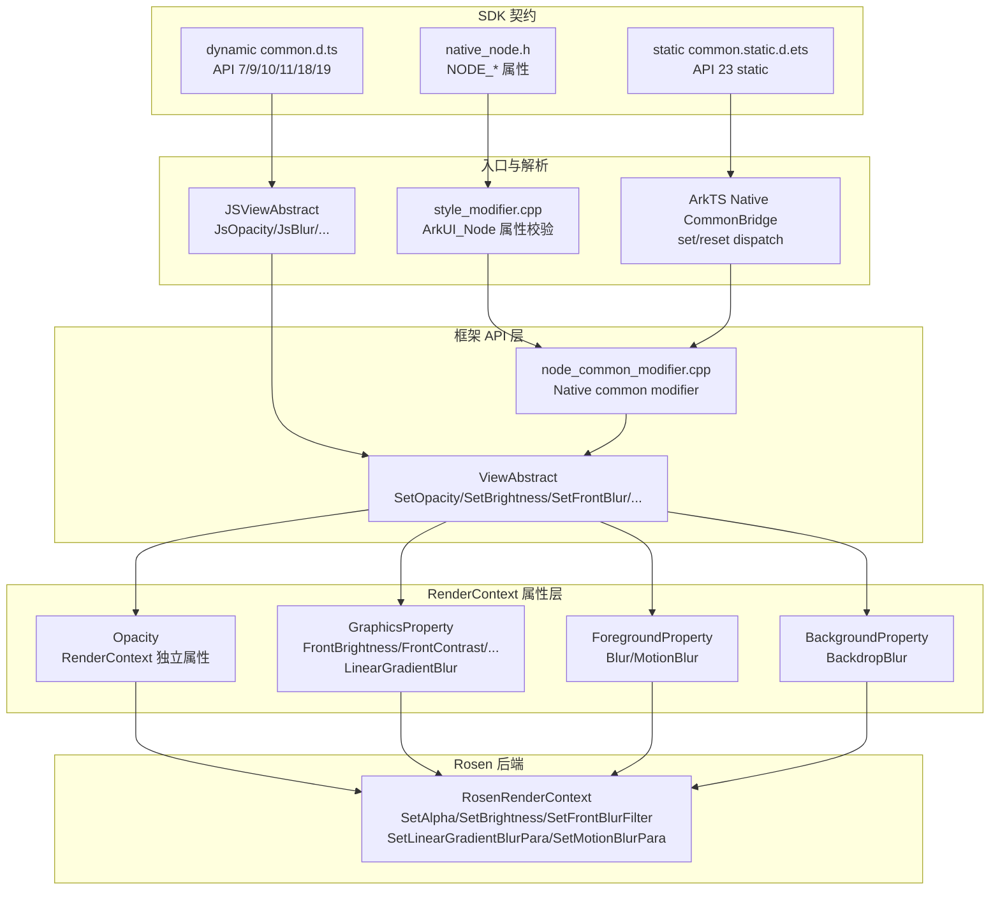
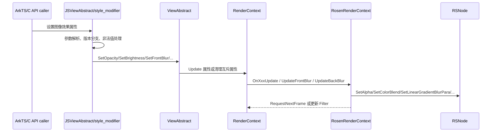
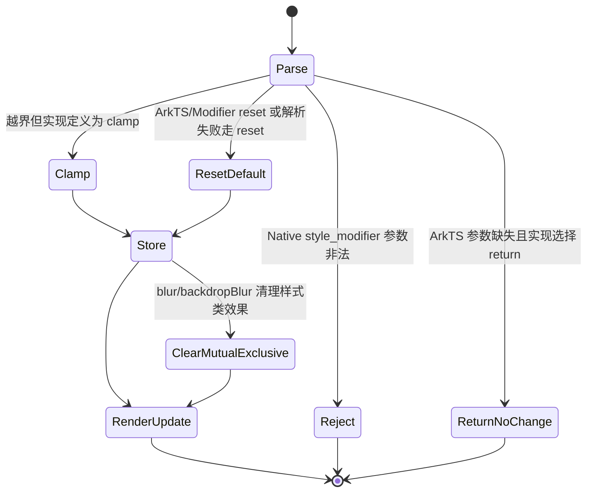

# 架构设计

> 视效属性功能域固化通用图像效果属性在 ArkTS、C API、RenderContext 与 Rosen 渲染后端之间的既有实现契约。

## 设计元数据

| 字段 | 内容 |
|------|------|
| Design ID | DESIGN-Func-04-03-02 |
| 关联需求 | 已有能力补录（无独立 requirement.md） |
| 关联 Epic | 无 |
| 目标 Feature | Feat-01 图像效果 |
| 复杂度 | 复杂 |
| 目标版本 | ArkTS dynamic API 7 起支持，API 11/12/18/19 有重载或行为差异；ArkTS static API 23 起支持；C API `NODE_BACKDROP_BLUR` API 15 起支持 |
| Owner | ArkUI SIG |
| 状态 | Baselined（已有实现补录） |

## 需求基线

| 项 | 补充说明（如需） |
|----|------------------|
| 问题陈述 | 开发者需要在所有继承通用属性的组件上声明透明度、基础图像滤镜和内容/背景模糊效果，并获得跨 ArkTS dynamic、ArkTS static、Native/C API 的稳定行为。 |
| 核心目标 | 固化 `opacity`、`brightness/contrast/grayscale/colorBlend/saturate/sepia/invert/hueRotate`、`blur/backdropBlur/linearGradientBlur/motionBlur` 的 API 签名、参数边界、reset 行为、版本差异、存储位置和 Rosen 更新路径。 |
| P0 AC | 属性设置必须落入对应 RenderContext 属性；无效输入按当前实现执行 clamp/reset/return/error code；背景模糊与样式类背景效果保持既有互斥清理；SDK 与源码存在差异时显式记录为风险。 |

## 上下文和现状

### 涉及仓和模块

| 仓库 | 模块路径 | 当前职责 | 本 Feature 影响 |
|------|----------|----------|-----------------|
| ace_engine | `frameworks/bridge/declarative_frontend/jsview/js_view_abstract.cpp` | ArkTS dynamic 通用属性注册和参数解析 | 入口注册、版本分支、输入 clamp/reset/return 规则 |
| ace_engine | `frameworks/bridge/declarative_frontend/engine/jsi/nativeModule/arkts_native_common_bridge.cpp` | ArkTS Modifier bridge 参数解析和 reset 分发 | ArkTS modifier 通道的 set/reset 行为 |
| ace_engine | `frameworks/core/components_ng/base/view_abstract.cpp` | 通用属性 API 层落点 | 写入 RenderContext，处理背景/前景模糊互斥 |
| ace_engine | `frameworks/core/components_ng/render/render_context.h` | RenderContext 基础属性定义 | `Opacity` 独立属性和渲染属性更新回调 |
| ace_engine | `frameworks/core/components_ng/render/render_property.h` | 渲染属性分组结构 | `GraphicsProperty`、`ForegroundProperty`、`BackgroundProperty` 存储图像效果 |
| ace_engine | `frameworks/core/components_ng/render/adapter/rosen_render_context.cpp` | Rosen 后端渲染属性应用 | 调用 RSNode 的 alpha/filter/color matrix/motion blur 接口 |
| ace_engine | `frameworks/core/interfaces/native/node/node_common_modifier.cpp` | Native modifier 内部 set/reset 实现 | C/NDK 通道到 ViewAbstract 的桥接 |
| ace_engine | `interfaces/native/node/style_modifier.cpp` | ArkUI_Node 通用属性对外入口 | 对 Native 属性入参做错误码校验 |
| ace_engine | `interfaces/native/native_node.h` | Native `NODE_*` 属性枚举与参数契约 | 公开 C API 属性面 |
| sdk-js | `api/@internal/component/ets/common.d.ts` | ArkTS dynamic API 契约 | `@since`、Optional 重载、参数类型和注释约束 |
| sdk-js | `api/arkui/component/common.static.d.ets` | ArkTS static API 契约 | static API 23 起统一签名 |

### 调用链层级分析

| 层 | 模块 | 职责 | 修改类型 |
|----|------|------|----------|
| ArkTS dynamic 入口 | `frameworks/bridge/declarative_frontend/jsview/js_view_abstract.cpp` | `JsOpacity/JsBlur/JsBackdropBlur/JsBrightness/JsContrast/JsGrayscale/JsSaturate/JsSepia/JsInvert/JsHueRotate/JsColorBlend/JsLinearGradientBlur/JsMotionBlur/JsSphericalEffect/JsLightUpEffect/JsPixelStretchEffect` 通用属性注册与参数解析，执行版本分支、clamp/reset/return 策略 | 存量——仅补录规格，不改动代码 |
| ArkTS Modifier bridge | `frameworks/bridge/declarative_frontend/engine/jsi/nativeModule/arkts_native_common_bridge.cpp` | ArkTS Modifier 通道 `SetOpacity/ResetOpacity`、`SetBrightness/ResetBrightness` 等 Set/Reset 对，将 ArkTS modifier 调用分发到 `node_common_modifier` | 存量——仅补录规格，不改动代码 |
| C API 公开入口 | `interfaces/native/node/style_modifier.cpp` | `ArkUI_Node` 通用属性对外入口；对 `NODE_OPACITY/NODE_BRIGHTNESS/NODE_SATURATION/NODE_BLUR/NODE_GRAY_SCALE/NODE_INVERT/NODE_SEPIA/NODE_CONTRAST/NODE_COLOR_BLEND/NODE_BACKDROP_BLUR` 执行参数个数与范围校验，非法时返回 `ERROR_CODE_PARAM_INVALID` | 存量——仅补录规格，不改动代码 |
| C API 属性枚举 | `interfaces/native/native_node.h` | 定义公开 `NODE_*` 属性枚举与参数契约；`hueRotate/linearGradientBlur/motionBlur/sphericalEffect/lightUpEffect/pixelStretchEffect` 无同级公开枚举 | 存量——仅补录规格，不改动代码 |
| Native common modifier | `frameworks/core/interfaces/native/node/node_common_modifier.cpp` | 内部 modifier 函数表入口，提供全部视效属性的 `SetXxx/ResetXxx`（含公开枚举未覆盖的 `SetHueRotate/SetLinearGradientBlur/SetMotionBlur/SetSphericalEffect/SetLightUpEffect/SetPixelStretchEffect`），桥接 C/NDK 和 ArkTS modifier 通道到 `ViewAbstract` | 存量——仅补录规格，不改动代码 |
| 框架 API 层 | `frameworks/core/components_ng/base/view_abstract.cpp` | `SetOpacity/SetBrightness/SetFrontGrayScale/SetFrontContrast/SetFrontSaturate/SetFrontSepia/SetFrontInvert/SetFrontHueRotate/SetFrontColorBlend/SetFrontBlur/SetBackdropBlur/SetLinearGradientBlur/SetMotionBlur/SetSphericalEffect/SetLightUpEffect/SetPixelStretchEffect`；通过 `ACE_UPDATE_NODE_RENDER_CONTEXT` 写入 RenderContext，处理背景/前景模糊互斥清理 | 存量——仅补录规格，不改动代码 |
| 属性存储——独立属性 | `frameworks/core/components_ng/render/render_context.h` | `ACE_DEFINE_PROPERTY_ITEM_FUNC_WITHOUT_GROUP(Opacity, double)` 为 RenderContext 独立属性 | 存量——仅补录规格，不改动代码 |
| 属性存储——GraphicsProperty | `frameworks/core/components_ng/render/render_property.h` | `GraphicsProperty` 存储 `FrontBrightness/FrontGrayScale/FrontContrast/FrontSaturate/FrontSepia/FrontInvert/FrontHueRotate/FrontColorBlend/LinearGradientBlur/SphericalEffect/LightUpEffect/PixelStretchEffect` | 存量——仅补录规格，不改动代码 |
| 属性存储——ForegroundProperty | `frameworks/core/components_ng/render/render_property.h` | `ForegroundProperty` 存储 `MotionBlur` 和 `propBlurRadius`（前景模糊半径）、`propSysOptionsForBlur` | 存量——仅补录规格，不改动代码 |
| 属性存储——BackgroundProperty | `frameworks/core/components_ng/render/render_property.h` | `BackgroundProperty` 存储 `BackdropBlur` 相关属性（背景模糊半径、灰度系数等） | 存量——仅补录规格，不改动代码 |
| Rosen 渲染后端 | `frameworks/core/components_ng/render/adapter/rosen_render_context.cpp` | `OnOpacityUpdate/OnFrontBrightnessUpdate/OnFrontGrayScaleUpdate/OnFrontContrastUpdate/OnFrontSaturateUpdate/OnFrontSepiaUpdate/OnFrontInvertUpdate/OnFrontHueRotateUpdate/OnFrontColorBlendUpdate/OnSphericalEffectUpdate/OnLightUpEffectUpdate/OnPixelStretchEffectUpdate/OnMotionBlurUpdate/UpdateFrontBlur/UpdateBackBlur/UpdateLinearGradientBlur` 回调，调用 RSNode 的 `SetAlpha/SetBrightness/SetGrayScale/SetContrast/SetSaturate/SetSepia/SetInvert/SetHueRotate/SetColorBlend/SetBack/FrontBlurFilter/SetLinearGradientBlurPara/SetMotionBlurPara` 等接口并请求下一帧 | 存量——仅补录规格，不改动代码 |

### 适用架构规则

| Rule ID | 适用原因 | 设计结论 | 验证方式 |
|---------|----------|----------|----------|
| OH-ARCH-LAYERING | 图像效果跨 API 层、Modifier 层、RenderContext 层和 Rosen 后端 | 调用方向保持 `ArkTS/C API -> ViewAbstract -> RenderContext -> RosenRenderContext`，无反向依赖 | 代码评审/依赖检查 |
| OH-ARCH-SUBSYSTEM | 视效属性使用 Rosen 渲染接口 | 仅在 `render/adapter/rosen_render_context.cpp` 适配 Rosen，核心属性层不新增跨子系统依赖 | 代码评审 |
| OH-ARCH-IPC-SAF | 本特性仅设置本进程 UI 节点属性 | 不涉及 IPC/SAF | 单测/代码评审 |
| OH-ARCH-API-LEVEL | dynamic/static/C API 均有版本契约 | API 签名以 SDK `.d.ts/.d.ets` 为准，源码行为差异写入兼容性风险 | API 评审/XTS |
| OH-ARCH-COMPONENT-BUILD | 现有通用属性能力补录 | 无 BUILD.gn/bundle.json 变更 | 构建验证 |
| OH-ARCH-ERROR-LOG | Native 属性入口存在错误码校验 | `style_modifier.cpp` 对非法参数返回 `ERROR_CODE_PARAM_INVALID`，ArkTS 链路保持当前 clamp/reset/return 行为 | C API 单测/XTS |

## 不涉及项承接

| 维度 | 设计结论 |
|------|----------|
| 布局测量 | 图像效果属性不参与 Measure/Layout 约束计算，主要触发渲染属性更新；模糊/滤镜最终由 RenderContext/Rosen 消费。 |
| 安全与权限 | 通用视效属性无额外权限要求，SDK SysCap 为 `SystemCapability.ArkUI.ArkUI.Full`。 |
| IPC/跨进程 | 不涉及跨进程调用。 |
| 构建与部件 | 不新增模块、target 或 bundle 依赖。 |
| 兼容性 | 需要记录 API 11/12/18/19、static 23、Native `NODE_BACKDROP_BLUR` API 15 的差异。 |

## 关键设计决策

| 决策 ID | 问题 | 推荐方案 | 探索过的替代方案 | 取舍理由 | 影响 |
|---------|------|----------|-----------------|----------|------|
| ADR-1 | 图像效果属性按什么粒度归档 | 一个 Feat 覆盖 `opacity`、基础滤镜和模糊特效 | 拆成多个 Feat | 三组属性共享 `JSViewAbstract -> ViewAbstract -> RenderContext -> Rosen` 链路，且用户指定合并覆盖 | 一个 spec 统一描述 API 版本、reset 和渲染存储 |
| ADR-2 | 属性存储如何分层 | `Opacity` 为 RenderContext 独立属性；基础滤镜和 `linearGradientBlur` 存 `GraphicsProperty`；`blur/motionBlur` 存 `ForegroundProperty`；`backdropBlur` 存 `BackgroundProperty` | 全部放入单一 GraphicsProperty | 现有代码按前景、背景、独立透明度区分更新路径，能减少不相关属性耦合 | spec 必须按存储层拆验收和风险 |
| ADR-3 | 版本差异如何表达 | 按 SDK dynamic/static/C API 和源码目标版本分支分别记录 | 只记录最新 API | `opacity`、`colorBlend`、`backdropBlur` 等存在实际版本分支，省略会导致兼容性回归 | 兼容性声明显式列出 API 11/12/18/19/23/15 |
| ADR-4 | 非法输入采用什么恢复语义 | ArkTS 保持 clamp/reset/return，Native `style_modifier` 对部分非法值返回错误码 | 统一为抛异常或统一 clamp | 当前实现即规格；跨入口行为不完全一致，不能在存量规格中改写 | 规格中分 ArkTS 与 C API 写异常/恢复契约 |
| ADR-5 | 模糊属性与样式类效果如何共存 | `backdropBlur` 设置时清理 `backgroundEffect/backgroundBlurStyle`；`blur` 设置时清理 `foregroundBlurStyle` | 同时保留多个背景/前景效果 | 现有 ViewAbstract 在设置具体半径模糊时清理样式类属性，避免多套背景/前景滤镜叠加歧义 | 作为互斥优先级写入 ADR、FR 和风险表 |
| ADR-6 | reset 默认值如何定义 | 按当前实现逐属性固化：`1` 表示无亮度/对比/饱和变化，`0` 表示无灰度/褐色/反色/色相/模糊，`Color::TRANSPARENT` 表示无混色 | 用统一 nullopt 清除 | RenderContext 多数属性使用具体无效果值恢复，兼容旧行为 | 验收标准逐属性验证 reset 值 |
| ADR-7 | SDK 与源码描述不一致时如何处理 | SDK 签名是外部 API 契约；源码偏差写入风险和兼容性声明 | 静默用源码覆盖 SDK | 技能要求 SDK 是外部 API 单一真源；实现偏差必须显式暴露 | `brightness(undefined)` 等条目进入风险表 |
| ADR-8 | Native 公开属性面如何说明 | 公开 `NODE_*` 属性按 `native_node.h` 记录；仅在内部 common modifier 出现但无公开枚举的能力标为“内部 modifier 覆盖” | 把内部函数表等同公开 C API | `native_node.h` 未找到 `NODE_HUE_ROTATE/NODE_LINEAR_GRADIENT_BLUR/NODE_MOTION_BLUR`，不能编造公开枚举 | API 表区分 Public C API 与 Internal modifier |

## 设计骨架

### 骨架范围

| 骨架项 | 目标 | 不包含 | 验证方式 |
|--------|------|--------|----------|
| ArkTS API 契约 | 固化 dynamic/static SDK 签名、`@since` 和参数类型 | 新增 API 或重命名 | SDK 类型定义检查 |
| JS/Modifier 参数解析 | 固化 `JSViewAbstract` 与 ArkTS native bridge 的解析、默认值和版本分支 | 修复 SDK/实现偏差 | 单测/XTS/源码审查 |
| RenderContext 存储 | 固化 `Opacity`、`GraphicsProperty`、`ForegroundProperty`、`BackgroundProperty` 分层 | LayoutProperty 改造 | 渲染属性单测/源码审查 |
| Rosen 后端应用 | 固化 RSNode 调用和 RequestNextFrame 行为 | Rosen 内部算法 | 渲染截图/单测 |
| Native C API | 固化公开 `NODE_*` 属性和 `style_modifier` 错误码行为 | 私有未公开枚举扩展 | C API 单测 |

### 骨架 Spec 拆分

| Task ID | 目标 | 受影响文件 | AC |
|---------|------|------------|-----|
| TASK-SKELETON-1 | 图像效果 API/参数/存储/渲染行为补录 | `Feat-01-image-effects-spec.md` | AC-1.1~AC-5.4 |

## 后续 Task 拆分

| Task ID | 目标 | 受影响文件 | 依赖 |
|---------|------|------------|------|
| Feat-01-image-effects-spec.md | 固化 opacity、基础滤镜、模糊特效的存量规格 | `js_view_abstract.cpp`, `view_abstract.cpp`, `render_property.h`, `rosen_render_context.cpp`, `node_common_modifier.cpp`, `style_modifier.cpp`, `native_node.h`, SDK `.d.ts/.d.ets` | 本 Design |

## API 签名、Kit 与权限

### 新增 API

| API 签名 | 类型 | d.ts 位置 | 权限要求 | SysCap |
|----------|------|-----------|----------|--------|
| `opacity(value: number \| Resource): T` / `opacity(opacity: Optional<number \| Resource>): T` | Public dynamic | `interface/sdk-js/api/@internal/component/ets/common.d.ts:25580`, `common.d.ts:25594` | 无 | `SystemCapability.ArkUI.ArkUI.Full` |
| `opacity(value: double \| Resource \| undefined): this` | Public static | `interface/sdk-js/api/arkui/component/common.static.d.ets:11853` | 无 | `SystemCapability.ArkUI.ArkUI.Full` |
| `brightness(value: number): T` / `brightness(brightness: Optional<number>): T` | Public dynamic | `common.d.ts:27016`, `common.d.ts:27040` | 无 | `SystemCapability.ArkUI.ArkUI.Full` |
| `brightness(value: double \| undefined): this` | Public static | `common.static.d.ets:12421` | 无 | `SystemCapability.ArkUI.ArkUI.Full` |
| `contrast(value: number): T` / `contrast(contrast: Optional<number>): T` | Public dynamic | `common.d.ts:27116`, `common.d.ts:27140` | 无 | `SystemCapability.ArkUI.ArkUI.Full` |
| `contrast(value: double \| undefined): this` | Public static | `common.static.d.ets:12439` | 无 | `SystemCapability.ArkUI.ArkUI.Full` |
| `grayscale(value: number): T` / `grayscale(grayscale: Optional<number>): T` | Public dynamic | `common.d.ts:27216`, `common.d.ts:27240` | 无 | `SystemCapability.ArkUI.ArkUI.Full` |
| `grayscale(value: double \| undefined): this` | Public static | `common.static.d.ets:12458` | 无 | `SystemCapability.ArkUI.ArkUI.Full` |
| `colorBlend(value: Color \| string \| Resource): T` / `colorBlend(color: Optional<Color \| string \| Resource>): T` | Public dynamic | `common.d.ts:27280`, `common.d.ts:27296` | 无 | `SystemCapability.ArkUI.ArkUI.Full` |
| `colorBlend(value: Color \| string \| Resource \| undefined): this` | Public static | `common.static.d.ets:12468` | 无 | `SystemCapability.ArkUI.ArkUI.Full` |
| `saturate(value: number): T` / `saturate(saturate: Optional<number>): T` | Public dynamic | `common.d.ts:27368`, `common.d.ts:27392` | 无 | `SystemCapability.ArkUI.ArkUI.Full` |
| `saturate(value: double \| undefined): this` | Public static | `common.static.d.ets:12486` | 无 | `SystemCapability.ArkUI.ArkUI.Full` |
| `sepia(value: number): T` / `sepia(sepia: Optional<number>): T` | Public dynamic | `common.d.ts:27440`, `common.d.ts:27458` | 无 | `SystemCapability.ArkUI.ArkUI.Full` |
| `sepia(value: double \| undefined): this` | Public static | `common.static.d.ets:12498` | 无 | `SystemCapability.ArkUI.ArkUI.Full` |
| `invert(value: number \| InvertOptions): T` / `invert(options: Optional<number \| InvertOptions>): T` | Public dynamic | `common.d.ts:27502`, `common.d.ts:27527` | 无 | `SystemCapability.ArkUI.ArkUI.Full` |
| `invert(value: double \| InvertOptions \| undefined): this` | Public static | `common.static.d.ets:12509` | 无 | `SystemCapability.ArkUI.ArkUI.Full` |
| `hueRotate(value: number \| string): T` / `hueRotate(rotation: Optional<number \| string>): T` | Public dynamic | `common.d.ts:27590`, `common.d.ts:27605` | 无 | `SystemCapability.ArkUI.ArkUI.Full` |
| `hueRotate(value: double \| string \| undefined): this` | Public static | `common.static.d.ets:12531` | 无 | `SystemCapability.ArkUI.ArkUI.Full` |
| `blur(value: number, options?: BlurOptions): T` / `blur(blurRadius: Optional<number>, options?: BlurOptions, sysOptions?: SystemAdaptiveOptions): T` | Public dynamic | `common.d.ts:26847`, `common.d.ts:26882` | 无 | `SystemCapability.ArkUI.ArkUI.Full` |
| `blur(blurRadius: double \| undefined, options?: BlurOptions, sysOptions?: SystemAdaptiveOptions): this` | Public static | `common.static.d.ets:12370` | 无 | `SystemCapability.ArkUI.ArkUI.Full` |
| `backdropBlur(value: number, options?: BlurOptions): T` / `backdropBlur(radius: Optional<number>, options?: BlurOptions, sysOptions?: SystemAdaptiveOptions): T` | Public dynamic | `common.d.ts:27813`, `common.d.ts:27846` | 无 | `SystemCapability.ArkUI.ArkUI.Full` |
| `backdropBlur(radius: double \| undefined, options?: BlurOptions, sysOptions?: SystemAdaptiveOptions): this` | Public static | `common.static.d.ets:12625` | 无 | `SystemCapability.ArkUI.ArkUI.Full` |
| `linearGradientBlur(value: number, options: LinearGradientBlurOptions): T` / `linearGradientBlur(blurRadius: Optional<number>, options: Optional<LinearGradientBlurOptions>): T` | Public dynamic | `common.d.ts:26896`, `common.d.ts:26910` | 无 | `SystemCapability.ArkUI.ArkUI.Full` |
| `linearGradientBlur(value: double \| undefined, options: LinearGradientBlurOptions \| undefined): this` | Public static | `common.static.d.ets:12382` | 无 | `SystemCapability.ArkUI.ArkUI.Full` |
| `motionBlur(value: MotionBlurOptions): T` / `motionBlur(motionBlur: Optional<MotionBlurOptions>): T` | Public dynamic | `common.d.ts:26935`, `common.d.ts:26948` | 无 | `SystemCapability.ArkUI.ArkUI.Full` |
| `motionBlur(value: MotionBlurOptions \| undefined): this` | Public static | `common.static.d.ets:12404` | 无 | `SystemCapability.ArkUI.ArkUI.Full` |
| `NODE_OPACITY`, `NODE_BRIGHTNESS`, `NODE_SATURATION`, `NODE_BLUR`, `NODE_GRAY_SCALE`, `NODE_INVERT`, `NODE_SEPIA`, `NODE_CONTRAST`, `NODE_COLOR_BLEND`, `NODE_BACKDROP_BLUR` | Public C API | `interfaces/native/native_node.h:365`, `native_node.h:376`, `native_node.h:389`, `native_node.h:439`, `native_node.h:1209`, `native_node.h:1222`, `native_node.h:1235`, `native_node.h:1247`, `native_node.h:1724`, `native_node.h:2001` | 无 | Native ArkUI |

### 变更/废弃 API

| 原有 API | 变更类型 | 新 API | 迁移说明 |
|----------|----------|--------|----------|
| dynamic 图像效果属性 | 变更 | API 18 起增加 `Optional<T>` 重载；API 19 起 `blur/backdropBlur` 增加 `SystemAdaptiveOptions` 重载 | 旧签名保留，新增重载允许 `undefined` 或系统自适应选项 |
| static 图像效果属性 | 变更 | API 23 static 引入 `common.static.d.ets` 对应签名 | static API 与 dynamic API 并行存在 |

## 构建系统影响

### BUILD.gn 变更

```text
无变更。图像效果属性为已有 ace_engine 通用属性能力，当前补录不新增 target、source_set 或依赖。
```

### bundle.json 变更

无变更。

## 可选设计扩展

### 架构图

<!-- 展开 -->



### 数据流/控制流

<!-- 展开 -->

| 步骤 | 调用方 | 被调用方 | 数据/接口 | 说明 |
|------|--------|----------|-----------|------|
| 1 | SDK 调用 | `JSViewAbstract` / ArkTS CommonBridge / `style_modifier.cpp` | `opacity`、滤镜、模糊参数 | dynamic、static、Native 入口分流 |
| 2 | 入口层 | `ViewAbstract` 或 `node_common_modifier.cpp` | clamp/reset/return/error code 后的参数 | ArkTS 与 C API 的非法输入策略不同 |
| 3 | `ViewAbstract` | `RenderContext` | `Opacity`、`GraphicsProperty`、`ForegroundProperty`、`BackgroundProperty` | 按存储分层写入 |
| 4 | `RenderContext` | `RosenRenderContext` | 属性更新回调 | 触发 RSNode 属性设置 |
| 5 | `RosenRenderContext` | RSNode | `SetAlpha`、`SetBrightness`、`SetBack/FrontBlurFilter` 等 | 请求下一帧或更新滤镜 |

### 时序设计

<!-- 展开 -->



### 数据模型设计

<!-- 展开 -->

```cpp
// frameworks/core/components_ng/render/render_context.h:681
ACE_DEFINE_PROPERTY_ITEM_FUNC_WITHOUT_GROUP(Opacity, double);

// frameworks/core/components_ng/render/render_property.h:122
struct ForegroundProperty {
    ACE_DEFINE_PROPERTY_GROUP_ITEM(MotionBlur, MotionBlurOption);
    std::optional<Dimension> propBlurRadius;
    std::optional<SysOptions> propSysOptionsForBlur;
};

// frameworks/core/components_ng/render/render_property.h:227
struct GraphicsProperty {
    ACE_DEFINE_PROPERTY_GROUP_ITEM(FrontBrightness, Dimension);
    ACE_DEFINE_PROPERTY_GROUP_ITEM(FrontGrayScale, Dimension);
    ACE_DEFINE_PROPERTY_GROUP_ITEM(FrontContrast, Dimension);
    ACE_DEFINE_PROPERTY_GROUP_ITEM(FrontSaturate, Dimension);
    ACE_DEFINE_PROPERTY_GROUP_ITEM(FrontSepia, Dimension);
    ACE_DEFINE_PROPERTY_GROUP_ITEM(FrontInvert, InvertVariant);
    ACE_DEFINE_PROPERTY_GROUP_ITEM(FrontHueRotate, float);
    ACE_DEFINE_PROPERTY_GROUP_ITEM(FrontColorBlend, Color);
    ACE_DEFINE_PROPERTY_GROUP_ITEM(LinearGradientBlur, NG::LinearGradientBlurPara);
};
```

### 算法与状态机

<!-- 展开 -->



### 测试性设计

<!-- 展开 -->

| 测试层级 | 测试目标 | Mock 策略 | 验证方式 |
|----------|----------|-----------|----------|
| SDK 类型检查 | dynamic/static 签名存在且版本标注正确 | 无 | d.ts/d.ets 静态检查 |
| JS bridge 单测 | 解析失败、越界、undefined、Resource | Mock JSVal/Container API target | 单测 |
| Native C API 单测 | 错误码、set/reset、公开 `NODE_*` 参数形态 | Mock ArkUI_NodeHandle | `linux_unittest_capi` |
| RenderContext 单测 | 属性分层和互斥清理 | Mock FrameNode/RenderContext | 单测 |
| 渲染集成 | RSNode 属性更新 | Rosen mock 或截图对比 | 集成/XTS |

### 异常传播时序图

<!-- 展开 -->

```mermaid
sequenceDiagram
    participant App
    participant Native as style_modifier.cpp
    participant Common as node_common_modifier.cpp
    participant View as ViewAbstract

    App->>Native: Set NODE_OPACITY(-0.1)
    Native-->>App: ERROR_CODE_PARAM_INVALID
    App->>Common: internal setOpacity(-0.1)
    Common->>Common: API < 11 => 1.0; API >= 11 => clamp 0.0
    Common->>View: SetOpacity(normalized)
```

### 资源所有权矩阵

<!-- 展开 -->

| 资源 | 创建方 | 持有方 | 销毁触发 | 实际释放 | 异常回收 |
|------|--------|--------|----------|----------|----------|
| `viewAbstract.opacity` ResourceObject | JS/Native 资源解析 | Pattern resource map | reset opacity 或新的资源对象覆盖 | Pattern 管理 | reset 时 `RemoveResObj` |
| `viewAbstract.colorBlend` ResourceObject | JS/Native 颜色资源解析 | Pattern resource map | reset colorBlend 或新的资源对象覆盖 | Pattern 管理 | reset 时 `RemoveResObj` |
| Rosen blur/filter 参数 | RosenRenderContext | RSNode | 属性重置为无效果值 | RSNode/渲染后端管理 | reset 调用设置 0 半径或默认参数 |

### 接口参数规约

<!-- 展开 -->

| 接口 | 参数 | 类型 | 合法范围 | 非法处理 | 边界说明 |
|------|------|------|----------|----------|----------|
| `opacity` | value | number/Resource | `[0,1]` | API >= 11 clamp；API < 11 越界为 `1.0`；Native public 入口非法返回错误码 | Resource 更新也按版本分支归一化 |
| `brightness` | value | number | SDK 推荐 `[0,2]`，实现至少处理负值 | dynamic JS 解析失败为 `1.0`；common modifier 负值 clamp `0`；Native public 入口负值错误码 | SDK dynamic Optional 说明与 JS 实现存在差异风险 |
| `contrast` | value | number | SDK 推荐 `[0,10)` | ArkTS 负值 clamp `0`；Native public 入口负值或 `>=10` 错误码 | reset 为 `1` |
| `grayscale` | value | number | `[0,1]` | ArkTS clamp；Native public 入口越界错误码 | reset 为 `0` |
| `colorBlend` | value | Color/string/Resource | 可解析颜色 | API >= 12 解析失败为透明；低版本解析失败 return | reset 为透明 |
| `saturate` | value | number | SDK 推荐 `[0,50)` | ArkTS 负值 clamp `0`；Native public 入口要求 `[0,50]` | reset 为 `1` |
| `sepia` | value | number | ArkTS `[0,+∞)`；Native public `[0,1]` | ArkTS 负值 clamp `0`；Native public 越界错误码 | reset 为 `0` |
| `invert` | value/options | number/InvertOptions | number `[0,1]`，options 字段 `[0,1]` | ArkTS clamp；Native public 越界错误码 | object 路径转 `SetAiInvert` |
| `hueRotate` | value | number/string | 任意角度 | 非 number/string reset `0`；实现按 360 取模 | 未找到同级公开 `NODE_HUE_ROTATE` |
| `blur` | radius/options/sysOptions | number/BlurOptions/SystemAdaptiveOptions | 半径非负 | JS 解析失败 return；common modifier 负值/0 为 0；Native public 未拒绝负值但 common modifier 转 0 | 前景模糊 |
| `backdropBlur` | radius/options/sysOptions | number/BlurOptions/SystemAdaptiveOptions | 半径非负；Native 灰度 `[0,127]` | API < 12 解析失败 return；API >= 12 以 0 继续；Native public 非法错误码 | 背景模糊并清理 backgroundEffect/backgroundBlurStyle |
| `linearGradientBlur` | radius/options | number/LinearGradientBlurOptions | stops 值 `[0,1]` 且位置递增 | stops 非法回默认 `[(0,0),(0,1)]`；direction 非法回 `BOTTOM` | 未找到同级公开 `NODE_LINEAR_GRADIENT_BLUR` |
| `motionBlur` | radius/anchor | MotionBlurOptions | radius 非负，anchor `[0,1]` | JS 非 object return；负 radius 为 0；anchor clamp | 未找到同级公开 `NODE_MOTION_BLUR` |

### 线程与并发模型

<!-- 展开 -->

| 操作 | 发起线程 | 回调线程 | 跨进程边界 | 线程安全 | 重入约束 |
|------|----------|----------|------------|----------|----------|
| ArkTS 属性设置 | UI/JS 线程 | UI 线程 | 无 | 依赖 UI 框架单线程属性更新 | 不建议在同帧频繁切换 motionBlur 半径，SDK 注释标明可能出现非预期结果 |
| Native 属性设置 | Native 调用线程进入 ArkUI 节点接口 | UI 框架调度线程 | 无 | 由节点接口入口校验 handle | 非法参数应在入口返回错误码 |
| Rosen 属性应用 | RenderContext 更新触发 | 渲染上下文线程/RS 调度 | 无直接 IPC | `FREE_RS_CONTEXT_CHECK_MULTI_THREAD` 分流多线程路径 | blur/filter 更新按现有 RenderContext 生命周期执行 |

## 详细设计

### opacity 透明度

`JSViewAbstract::JsOpacity` 先移除 `viewAbstract.opacity` 资源对象，解析 `number | Resource`；解析失败设置 `1.0f`；API target >= 11 时 clamp 到 `[0,1]`，低版本越界回退 `1.0`，最后调用 `SetOpacity`（`frameworks/bridge/declarative_frontend/jsview/js_view_abstract.cpp:2198`）。Native common modifier 使用相同 API 11 分支并在 reset 时移除资源对象、写回 `1.0f`（`frameworks/core/interfaces/native/node/node_common_modifier.cpp:2128`）。`ViewAbstract::SetOpacity(FrameNode*, double)` 通过 `ACE_UPDATE_NODE_RENDER_CONTEXT(Opacity, ...)` 写入 RenderContext（`frameworks/core/components_ng/base/view_abstract.cpp:7511`），`RosenRenderContext::OnOpacityUpdate` 对 RSNode 设置 alpha 并请求下一帧（`frameworks/core/components_ng/render/adapter/rosen_render_context.cpp:2285`）。

### 基础滤镜

`brightness/contrast/grayscale/saturate/sepia/invert/hueRotate/colorBlend` 均由 `JSViewAbstract` 注册为通用属性（`frameworks/bridge/declarative_frontend/jsview/js_view_abstract.cpp:10386`）。`brightness` 解析失败写 `1.0`（`js_view_abstract.cpp:9241`）；`contrast` 和 `saturate` 解析失败写 `1.0` 且负值 clamp 到 `0`（`js_view_abstract.cpp:9253`, `js_view_abstract.cpp:9269`）；`grayscale` clamp 到 `[0,1]`（`js_view_abstract.cpp:9221`）；`sepia` 负值 clamp 到 `0`（`js_view_abstract.cpp:9285`）；`invert` 支持 number 和 `InvertOptions`，各字段 clamp 到 `[0,1]`（`js_view_abstract.cpp:9301`, `js_view_abstract.cpp:9333`）；`hueRotate` 支持 number/string 并归一化到 `[0,360)`（`js_view_abstract.cpp:9353`）；`colorBlend` 在 undefined 或 API >= 12 解析失败时写透明色（`js_view_abstract.cpp:6181`）。这些属性经 `ViewAbstract` 写入 `GraphicsProperty`（`frameworks/core/components_ng/base/view_abstract.cpp:5809`, `frameworks/core/components_ng/render/render_property.h:227`），Rosen 后端分别调用 `SetBrightness/SetGrayScale/SetContrast/SetSaturate/SetSepia/SetInvert/SetAiInvert/SetHueRotate/SetColorBlend`（`frameworks/core/components_ng/render/adapter/rosen_render_context.cpp:5580`）。

### 模糊特效

`blur` 为前景内容模糊，`JSViewAbstract::JsBlur` 在无参数或解析失败时 return，成功后用 PX 半径调用 `SetFrontBlur`（`frameworks/bridge/declarative_frontend/jsview/js_view_abstract.cpp:6124`）。`backdropBlur` 为背景模糊，解析失败时 API target < 12 return，API target >= 12 继续以 `0` 半径设置（`js_view_abstract.cpp:6242`）。`ViewAbstract::SetBackdropBlur` 设置背景模糊前清理 `backgroundEffect`，设置后如存在 `BackBlurStyle` 则清理为 `std::nullopt`（`frameworks/core/components_ng/base/view_abstract.cpp:5101`）；`SetFrontBlur` 设置前景模糊后清理 `FrontBlurStyle`（`view_abstract.cpp:5192`）。`linearGradientBlur` 校验 stops，非法时回退 `[(0,0),(0,1)]` 和 `BOTTOM` 方向（`js_view_abstract.cpp:6271`, `js_view_abstract.cpp:6308`）。`motionBlur` 要求 object，半径负值或解析失败为 `0`，anchor clamp 到 `[0,1]`（`js_view_abstract.cpp:6150`）。Rosen 后端分别设置 back/front blur filter、linear gradient blur 参数和 motion blur 参数（`frameworks/core/components_ng/render/adapter/rosen_render_context.cpp:5337`, `rosen_render_context.cpp:5386`, `rosen_render_context.cpp:5659`, `rosen_render_context.cpp:5327`）。

### Native/C API 入口

公开 C API 属性面在 `interfaces/native/native_node.h` 中包含 `NODE_BRIGHTNESS`、`NODE_SATURATION`、`NODE_BLUR`、`NODE_OPACITY`、`NODE_GRAY_SCALE`、`NODE_INVERT`、`NODE_SEPIA`、`NODE_CONTRAST`、`NODE_COLOR_BLEND` 和 `NODE_BACKDROP_BLUR`（`interfaces/native/native_node.h:365`, `native_node.h:376`, `native_node.h:389`, `native_node.h:439`, `native_node.h:1209`, `native_node.h:1222`, `native_node.h:1235`, `native_node.h:1247`, `native_node.h:1724`, `native_node.h:2001`）。`style_modifier.cpp` 对 `opacity`、`backdropBlur`、`brightness`、`grayscale`、`invert`、`sepia`、`contrast` 等执行参数个数与范围校验，非法时返回 `ERROR_CODE_PARAM_INVALID`（`interfaces/native/node/style_modifier.cpp:1017`, `style_modifier.cpp:2038`, `style_modifier.cpp:2244`, `style_modifier.cpp:3996`, `style_modifier.cpp:4078`）。内部 `node_common_modifier.cpp` 仍提供 `SetHueRotate`、`SetLinearGradientBlur`、`SetMotionBlur` 等 common modifier 函数表入口（`frameworks/core/interfaces/native/node/node_common_modifier.cpp:2223`, `node_common_modifier.cpp:2805`, `node_common_modifier.cpp:4328`），但本轮未在 `native_node.h` 找到同级公开 `NODE_HUE_ROTATE/NODE_LINEAR_GRADIENT_BLUR/NODE_MOTION_BLUR`。

## 风险和开放问题

| 项 | 类型 | 影响 | 处理方式 | Owner |
|----|------|------|----------|-------|
| SDK dynamic `brightness(Optional<number>)` 注释称 undefined reset 到 `0`，当前 JS 动态实现解析失败写 `1.0` | API/兼容性 | 中 | 按 SDK 记录外部契约，同时在 spec 兼容性声明中显式标注源码偏差 | ArkUI SIG |
| ArkTS dynamic、ArkTS native bridge、Native public `style_modifier` 的非法输入处理不统一 | 兼容性 | 中 | 规格分入口描述，不合并为单一规则 | ArkUI SIG |
| `colorBlend` API target >= 12 无效输入写透明，低版本 return | 兼容性 | 中 | API 版本差异写入 AC 和兼容性声明 | ArkUI SIG |
| `backdropBlur` 解析失败 API target < 12 return，API target >= 12 以 0 半径继续 | 兼容性 | 中 | API 版本差异写入异常规则 | ArkUI SIG |
| 未找到 `NODE_HUE_ROTATE/NODE_LINEAR_GRADIENT_BLUR/NODE_MOTION_BLUR` 同级公开 C API 枚举 | API | 低 | 文档区分公开 Native 属性与内部 common modifier 函数表 | ArkUI SIG |
| 模糊类属性会清理样式类前景/背景效果 | 兼容性 | 中 | 作为互斥优先级写入 ADR 和功能规则 | ArkUI SIG |

## 设计审批

- [x] 需求基线已确认，设计覆盖 P0/P1 AC
- [x] 不涉及项已承接，N/A 和展开项都有结论
- [x] 涉及仓和模块职责清楚
- [x] 适用架构规则已识别并形成设计结论
- [x] 分层和子系统边界合规
- [x] API 变更有签名、权限、错误码和兼容性说明
- [x] BUILD.gn/bundle.json 影响明确
- [x] 设计输出和后续 Task 拆分明确
- [x] 关键设计决策有理由和影响说明
- [x] 风险和开放问题有 Owner

**结论:** 通过（已有实现补录）.
