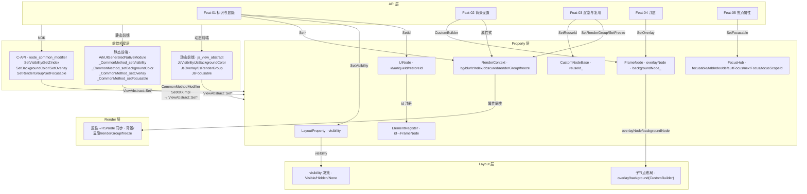
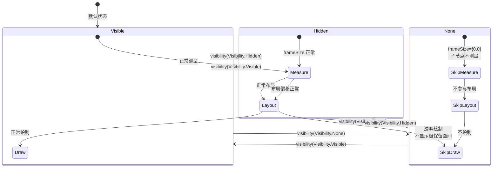
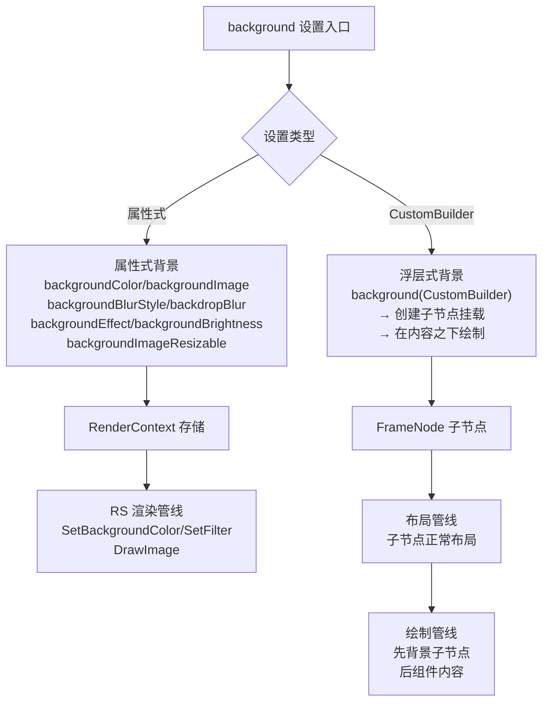
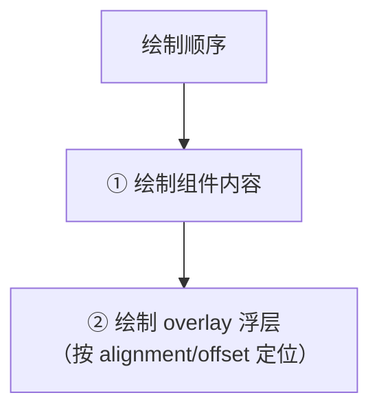

# 架构设计

> 基础属性功能域的架构设计文档，补录已有实现。

## 设计元数据

| 字段 | 内容 |
|------|------|
| Design ID | DESIGN-Func-04-03-03 |
| 关联需求 | 已有能力补录（无独立 requirement.md） |
| 关联 Epic | 无 |
| 目标 Feature | Feat-01 组件标识与显隐, Feat-02 背景设置, Feat-03 渲染与复用, Feat-04 浮层, Feat-05 焦点属性 |
| 复杂度 | 复杂 |
| 目标版本 | API 7 起支持，API 7~21 多版本行为变更 |
| Owner | ArkUI SIG |
| 状态 | Baselined（已有实现补录） |

## 需求基线

| 项 | 内容 |
|----|------|
| 问题陈述 | 开发者需要通过声明式 API 控制组件的标识、显隐、背景外观、浮层叠加、渲染行为复用控制、以及浮层叠加 |
| 核心目标 | （Feat-01）提供 id/key/restoreId/inspectorLabel/uniqueId 组件标识属性和 visibility/zIndex/obscured/allowForceDark/clickDistance/enableClickSoundEffect 显隐及辅助属性，支持组件定位、布局参与控制、隐私保护和无障碍交互；（Feat-02）提供 backgroundColor/backgroundImage/backgroundImageSize/backgroundImagePosition/backgroundBlurStyle/backdropBlur/backgroundEffect/backgroundBrightness/backgroundImageResizable/background(CustomBuilder) 背景设置属性，支持颜色/图像/模糊/亮度/可拉伸图/自定义浮层式背景；（Feat-03）提供 renderGroup/renderFit/freeze/useEffect/reuseId/reuse 渲染与复用属性，支持子树脏传播聚合、内容适配方式、RS 渲染冻结标记、动效开关和组件复用标识；（Feat-04）提供 overlay 浮层属性，支持在组件之上叠加自定义内容并控制对齐和偏移 |
| P0 AC | （Feat-01）id 可设置并通过 ElementRegister inspectorIdMap_ 查询；visibility 三态（Visible/Hidden/None）布局参与行为正确；zIndex 绘制层级生效；obscured 截图/录屏区域屏蔽；（Feat-02）backgroundColor 支持颜色和 ColorMetrics 动态颜色；backgroundImage 加载和位置/尺寸设置生效；background(CustomBuilder) 挂载子节点作为浮层式背景；（Feat-03）renderGroup 子树变更聚合为组级重绘；freeze 设置 RS 渲染侧冻结标记；reuseId 标记组件复用身份；（Feat-04）overlay 在组件之上叠加自定义内容，alignment/offset 定位生效 |

## 上下文和现状

### 涉及仓和模块

| 仓库 | 模块/路径 | 当前职责 | 本 Feature 影响 |
|------|-----------|----------|-----------------|
| ace_engine | `frameworks/core/components_ng/base/view_abstract.h/cpp` | API 入口，SetVisibility/SetBackgroundColor/SetOverlay/SetRenderGroup 等统一入口 | API 层 |
| ace_engine | `frameworks/core/components_ng/render/render_context.h/cpp` | RenderContext 存储背景属性（backgroundColor/backgroundImage/backgroundImageSize/backgroundImagePosition/backgroundBlurStyle/backdropBlur/backgroundEffect/backgroundBrightness）、显隐属性（visibility/zIndex）、obscured 等 | 核心数据结构（背景+显隐+隐私） |
| ace_engine | `frameworks/core/components_ng/base/frame_node.h/cpp` | FrameNode 存储 id/uniqueId/renderGroup/freeze/reuseId/overlayNode 等 | 核心数据结构（标识+渲染+复用+浮层） |
| ace_engine | `frameworks/core/components_ng/property/property.h` | Property 存储框架（ACE_DEFINE_PROPERTY_GROUP_ITEM 宏） | 属性存储基础设施 |
| ace_engine | `frameworks/bridge/declarative_frontend/jsview/js_view_abstract.cpp` | ArkTS 桥接层，参数解析与校验（JsVisibility/JsBackgroundColor/JsOverlay 等） | 输入校验 |
| ace_engine | `interfaces/native/node/node_common_modifier.cpp` | C-API 到框架层桥接（SetVisibility/SetZIndex/SetObscured/SetBackgroundColor 等） | 多语言入口 |
| ace_engine | `frameworks/core/pipeline/base/element_register.h` | ElementRegister 单例存储 id → FrameNode 映射（AddFrameNodeByInspectorId/GetAttachedFrameNodeById） | id 查找 |
| ace_engine | `frameworks/core/components_ng/render/adapter/rosen_render_context.cpp` | Rosen 渲染上下文实现，消费背景/显隐/zIndex 属性进行绘制 | 渲染绘制层 |
| ace_engine | `interfaces/native/native_node.h` | C-API (NDK) 接口定义 | NDK 枚举定义 |
| ace_engine | `frameworks/core/interfaces/native/implementation/common_method_modifier.cpp` | ArkTS 静态前端 ANI 函数指针实现（CommonMethodModifier::SetXXXImpl），注册到 GENERATED_ArkUICommonMethodModifier 函数指针表 | 静态前端桥接 |
| ace_engine | `frameworks/core/interfaces/native/generated/interface/arkoala_api_generated.h` | ArkTS 静态前端 C API 生成头文件（GENERATED_ArkUICommonMethodModifier struct 含 setBackgroundColor/setVisibility/setRenderGroup 等 400+ 函数指针字段） | 静态前端 API 定义 |
| ace_engine | `frameworks/bridge/arkts_frontend/koala_projects/arkoala-arkts/arkui-ohos/generated/framework/arkts/ArkUIGeneratedNativeModule.ets` | ArkTS 静态前端 ETS 侧 @ani.unsafe.Direct 原生方法声明（_CommonMethod_setXXX） | 静态前端 ETS 入口 |
| ace_engine | `frameworks/core/components_ng/pattern/shape/bridge/common_shape_static_modifier.cpp` | ArkTS 静态前端 CommonShape 方法 ANI 实现（SetAllowForceDarkImpl 等） | 静态前端 Shape 桥接 |
| sdk-js | `api/@internal/component/ets/common.d.ts` | ArkTS 接口声明 | 类型定义 |

### 调用链层级分析

| 层 | 模块 | 职责 | 修改类型 |
|----|------|------|----------|
| JS Bridge (动态前端) | `declarative_frontend/jsview/js_view_abstract` | 解析 ArkTS 属性调用（JsVisibility/JsBackgroundColor/JsOverlay/JsRenderGroup 等），参数校验、API 版本分支 | 存量分析 |
| ArkTS Static Bridge | `arkts_frontend/koala_projects ArkUIGeneratedNativeModule.ets` → `common_method_modifier.cpp` | 静态前端 ANI 函数指针桥接（_CommonMethod_setVisibility → SetVisibilityImpl → ViewAbstract::SetVisibility），无 JSI/NAPI 中间层 | 存量分析 |
| C-API 定义 | `interfaces/native/native_node.h` | 定义 NDK 属性枚举（NODE_VISIBILITY/NODE_Z_INDEX/NODE_BACKGROUND_COLOR/NODE_OBSCURED/NODE_RENDER_GROUP/NODE_OVERLAY 等） | 存量分析 |
| C-API 桥接 | `core/interfaces/native/node/node_common_modifier` | 将 C-API 调用转换为框架层 ViewAbstract::Set* 调用，执行参数单位转换 | 存量分析 |
| API 层 | `core/components_ng/base/view_abstract` | 框架属性设置统一入口（SetVisibility/SetBackgroundColor/SetOverlay/SetRenderGroup/SetFreeze 等），更新 RenderContext/FrameNode/Pattern | 存量分析 |
| Property 层 (显隐+背景) | `core/components_ng/render/render_context` | 存储 RenderContext 内所有背景和显隐属性，通过 Has* 查询和 Get* 读取，触发 OnPropertyUpdate 回调 | 存量分析 |
| Property 层 (标识+复用) | `core/components_ng/base/frame_node` | 存储 id/uniqueId/renderGroup_/freeze_/reuseId_/overlayNode_ 等，FrameNode 自身属性 | 存量分析 |
| id 查找 | `core/components_ng/base/element_register` | ElementRegister inspectorIdMap_ 存储 id → FrameNode 映射，AddFrameNodeByInspectorId/GetAttachedFrameNodeById 管理 | 存量分析 |
| 渲染绘制 | `core/components_ng/render/adapter/rosen_render_context` | Rosen 渲染上下文消费背景色/背景图/模糊/亮度/visibility/zIndex/obscured，设置到 RSNode | 存量分析 |
| 浮层挂载 | `core/components_ng/base/frame_node` | overlayNode 作为子节点挂载到 FrameNode，在布局/渲染阶段叠加绘制 | 存量分析 |
| 焦点属性 | `core/components_ng/event/focus_hub` + `focus_state` | FocusHub 管理 focusable/defaultFocus/focusScopeId；FocusState 管理 nextFocus/tabStop；FocusCallbackEvents 管理 tabIndex/focusOnTouch/groupDefaultFocus/事件回调 | 存量分析 |
| 渲染控制 | `core/components_ng/base/frame_node` | renderGroup 控制子树脏传播聚合，freeze 设置 RS 渲染侧冻结标记（rsNode_->SetFreeze） | 存量分析 |

### 适用架构规则

| Rule ID | 适用原因 | 设计结论 | 验证方式 |
|---------|----------|----------|----------|
| OH-ARCH-LAYERING | 基础属性涉及 JS Bridge → C-API → API 层 → Property 层 → Render 层单向调用 | JS Bridge/C-API(ViewAbstract) → Property(RenderContext/FrameNode/Pattern) → Render(RosenRenderContext)，严格单向 | 代码评审/依赖检查 |
| OH-ARCH-API-LEVEL | visibility/backgroundColor 等从 API 7 起支持，多版本行为变更 | 各 API 标注 @since 版本号，API 7/10/12/15/21 行为差异需标注 | API 评审/XTS |
| OH-ARCH-COMPONENT-BUILD | 基础属性属于 ace_core_ng，所有组件依赖 | 无需新增 BUILD.gn target，已在 ace_core_ng_source_set 中 | 构建验证 |

## 不涉及项承接

| 维度 | 需求阶段结论 | 设计阶段处理方式 | 设计结论 |
|------|---------|-------------|----------|
| IPC/跨进程 | N/A | 保持 N/A | 基础属性仅在 UI 线程内处理 |
| 安全与权限 | 涉及（obscured） | 展开设计 | obscured 涉及隐私保护（截图/录屏区域屏蔽），通过 ObscuredReasons 枚举区分场景，无权限要求 |
| 构建与部件 | N/A | 保持 N/A | 无新增部件或 target |
| 兼容性 | 涉及 | 展开设计 | API 版本行为差异：visibility None 布局参与、background(CustomBuilder) 双机制、renderGroup 聚合行为等需标注 |
| API/SDK | 涉及 | 展开设计 | CommonMethod 接口 + C-API 双通道 |

## 关键设计决策

| 决策 ID | 问题 | 推荐方案 | 探索过的替代方案 | 取舍理由 | 影响 |
|---------|------|----------|-----------------|------|------|
| ADR-1 | visibility None vs Hidden 布局参与差异 | 三态 Visible/Hidden/None，不同布局行为：Visible 正常参与布局，Hidden 不可见但保留空间（触发 Measure/Layout 但绘制透明），None 不可见且不参与布局（frameSize={0,0}、跳过子节点 Measure） | 方案A：Hidden 和 None 都不参与布局（Hidden 失去保留空间语义）；方案B：None 也参与布局（浪费计算资源） | 三态设计对齐 CSS visibility（visible/hidden）+ display（none）语义，兼顾开发者保留空间和节省性能两种需求 | visibility=Hidden 时 frameSize 正常但不可见；visibility=None/GONE 时 frameSize={0,0}，子节点不测量 |
| ADR-2 | background(CustomBuilder) 双机制架构 | 两套独立存储路径并存：属性式背景（backgroundColor/backgroundImage 等）存储在 RenderContext，CustomBuilder 浮层式背景作为子节点挂载在 FrameNode | 方案A：统一到 RenderContext（CustomBuilder 无法转换为渲染属性）；方案B：统一到子节点挂载（backgroundColor 等无法作为子节点） | 属性式背景适合简单颜色/图像场景（性能好、渲染管线统一），CustomBuilder 适合复杂动态背景（需要布局能力）。两套机制覆盖不同使用场景 | 属性式背景和 CustomBuilder 浮层式背景独立存储、独立生效、互不干扰 |
| ADR-3 | renderGroup 子树脏传播聚合 | 开启 renderGroup 时，子树任意节点变更聚合为组级重绘，整组重绘；关闭时恢复个体脏传播 | 方案A：始终个体传播（频繁微小变更时性能差）；方案B：始终组级传播（单个子节点变更浪费整组绘制） | renderGroup 为高频变更子树提供聚合绘制优化，适合列表项、卡片等频繁整体更新的场景 | renderGroup=true 时子树脏标记上溯到组根节点，统一重绘 |
| ADR-4 | obscured 安全隐私机制 | ObscuredReasons 枚举当前仅定义 PLACEHOLDER，设置后组件内容替换为占位显示（文本→密码圆点，图片→占位图）且截图/录屏时区域显示为遮罩色 | 方案A：布尔值开关（无法区分场景）；方案B：权限要求（增加开发者负担） | PLACEHOLDER 同时触发内容占位替换和截图/录屏拦截，不引入权限要求降低开发者使用门槛 | 截图/录屏区域显示遮罩色，开发者通过 ObscuredReasons.PLACEHOLDER 指定屏蔽 |
| ADR-5 | 背景设置与 04-03-02 范围重叠 | 04-03-03 按官方文档「基础属性 → 背景设置」分类覆盖 backgroundColor/backgroundImage/backgroundImageSize/backgroundImagePosition，04-03-02 后续调整范围以消除重叠 | 方案A：04-03-03 不覆盖重叠属性（官方分类不一致）；方案B：合并为单一功能域（破坏分类层级） | 官方文档将背景设置归入基础属性，按文档分类补录更准确。重叠属性在两个域交叉引用而非互斥 | backgroundColor 等在 04-03-03 和 04-03-02 中交叉引用 |
| ADR-6 | 基础属性双前端桥接架构 | 动态前端通过 JSI/NAPI (`js_view_abstract.cpp`) 桥接；静态前端通过 ANI 函数指针 (`ArkUIGeneratedNativeModule.ets` → `common_method_modifier.cpp`) 桥接；两路径在 `ViewAbstract::SetXXX` 汇合 | 方案A：仅动态前端（静态前端不覆盖基础属性）；方案B：统一为单桥接层（无法兼容两种运行时） | 动态/静态前端运行时架构不同（JSI vs ANI），必须在各自桥接层实现参数解析；汇合到 ViewAbstract 确保框架层行为一致 | 规格中每条规则/接口需标注双前端路径源码引用 |

## 设计骨架

### 骨架范围

| 骨架项 | 目标 | 不包含 | 验证方式 |
|--------|------|--------|----------|
| 标识与显隐属性存储 | id→ElementRegister + UINode::propInspectorId_, visibility→LayoutProperty, zIndex/obscured→RenderContext, uniqueId→UINode | id 冲突解决策略 | 编译通过 + 属性读取正确 |
| 背景属性存储 | backgroundColor/backgroundImage/blur/brightness→RenderContext, background(CustomBuilder)→FrameNode 子节点 | 背景图像解码/缓存机制 | 属性读取正确 |
| 浮层挂载机制 | overlay→FrameNode overlayNode_ 子节点 | overlay 布局算法内部细节 | overlay 内容正确叠加 |
| 焦点属性存储与导航 | focusable/tabIndex→FocusHub, nextFocus→FocusState, focusScopeId/Priority→FocusHub | 焦点域划分与导航算法 | 焦点可达性与导航正确 |
| 渲染控制属性 | renderGroup→FrameNode, freeze→FrameNode, reuseId→FrameNode | renderGroup 聚合绘制的 RS 层细节 | 脏标记传播正确 |

### 骨架 Spec 拆分

| Task ID | 目标 | 受影响文件 | AC |
|---------|------|------------|-----|
| TASK-SKELETON-1 | 标识与显隐属性存储与查找 | view_abstract.h, layout_property.h, render_context.h, frame_node.h, element_register.h | WHEN id 设置 THEN ElementRegister 可查询；WHEN visibility 设置 THEN 布局参与行为正确 |

## 后续 Task 拆分

| Spec | 目的 | 依赖 | 输出 |
|------|------|------|------|
| baseline-design | 基础属性功能域设计基线 | 无 | 本 design.md |
| Feat-01-component-id-visibility-spec.md | 固化 id/key/restoreId/inspectorLabel/uniqueId/visibility/zIndex/obscured/allowForceDark/clickDistance/enableClickSoundEffect 的行为规格 | 本 Design | 完整行为规格与 AC |
| Feat-02-background-setting-spec.md | 固化 backgroundColor/backgroundImage/backgroundImageSize/backgroundImagePosition/backgroundBlurStyle/backdropBlur/backgroundEffect/backgroundBrightness/backgroundImageResizable/background(CustomBuilder) 的行为规格 | 本 Design | 完整行为规格与 AC |
| Feat-03-render-reuse-spec.md | 固化 renderGroup/renderFit/freeze/useEffect/reuseId/reuse 的行为规格 | 本 Design | 完整行为规格与 AC |
| Feat-04-overlay-spec.md | 固化 overlay(alignment/offset) 的行为规格 | 本 Design | 完整行为规格与 AC |
| Feat-05-focus-attribute-spec.md | 固化 focusable/tabIndex/defaultFocus/groupDefaultFocus/focusOnTouch/tabStop/focusBox/nextFocus/focusScopeId/focusScopePriority/onFocus/onBlur/onKeyEvent 的行为规格 | 本 Design | 完整行为规格与 AC |

---

## API 签名、Kit 与权限

### 新增 API

| API 签名 | 类型 | d.ts 位置 | 权限要求 | SysCap |
|----------|------|-----------|----------|--------|
| N/A | — | — | — | — |

> 本功能域为已有实现补录，不新增 API。

### 变更/废弃 API

| 原有 API | 变更类型 | 新 API | 迁移说明 |
|----------|----------|--------|----------|
| — | — | — | 无变更/废弃 API |

## 构建系统影响

### BUILD.gn 变更

```
无变更。基础属性实现位于 ace_core_ng_source_set，已有构建配置覆盖。
```

### bundle.json 变更

无变更。

---

## 可选设计扩展

### 架构图



### 数据流/控制流

| 步骤 | 调用方 | 被调用方 | 数据/接口 | 说明 |
|------|--------|----------|-----------|------|
| 1 | 开发者 ArkTS（动态前端） | JSViewAbstract::JsVisibility | `VisibleType value` | 桥接层解析参数 |
| 1s | 开发者 ArkTS（静态前端） | ArkUIGeneratedNativeModule._CommonMethod_setVisibility | `VisibleType value` | ANI 函数指针直接调用（`ArkUIGeneratedNativeModule.ets:386` → `common_method_modifier.cpp:4369`） |
| 2 | JSViewAbstract / CommonMethodModifier | ViewAbstract::SetVisibility | `VisibleType` | 调用框架层（动态/静态前端在此汇合） |
| 3 | ViewAbstract | RenderContext::UpdateVisibility | `VisibleType` | 存储到 RenderContext，标记 PROPERTY_UPDATE |
| 4 | Pipeline | FrameNode::Measure | `parentConstraint` | 布局管线调度 |
| 5 | FrameNode | visibility 布局决策 | `GetVisibility()` | Visible→正常测量；Hidden→测量但透明绘制；None→frameSize={0,0} |
| 6 | FrameNode | RosenRenderContext::ApplyProperty | `RenderContext properties` | 将背景/显隐/zIndex 属性应用到 RSNode |
| 7 | 开发者 ArkTS（动态前端） | JSViewAbstract::JsBackgroundColor | `Color value` | 桥接层解析颜色参数 |
| 7s | 开发者 ArkTS（静态前端） | ArkUIGeneratedNativeModule._CommonMethod_setBackgroundColor | `Color value` | ANI 函数指针直接调用（`ArkUIGeneratedNativeModule.ets:236` → `common_method_modifier.cpp:2775`） |
| 8 | JSViewAbstract / CommonMethodModifier | ViewAbstract::SetBackgroundColor | `Color` | 调用框架层（动态/静态前端在此汇合） |
| 9 | ViewAbstract | RenderContext::UpdateBackgroundColor | `Color` | 存储到 RenderContext |
| 10 | RosenRenderContext | RSNode::SetBackgroundColor | `Color` | 渲染层绘制背景色 |
| 11 | 开发者 ArkTS（动态前端） | JSViewAbstract::JsOverlay | `OverlayOptions + builder` | 桥接层解析浮层参数 |
| 11s | 开发者 ArkTS（静态前端） | ArkUIGeneratedNativeModule._CommonMethod_setOverlay | `Opt_Union_String_CustomNodeBuilder_ComponentContent + Opt_OverlayOptions` | ANI 函数指针直接调用（`ArkUIGeneratedNativeModule.ets:598` → `common_method_modifier.cpp:6324`） |
| 12 | JSViewAbstract / CommonMethodModifier | ViewAbstract::SetOverlayBuilder | `builder + options` | 创建 overlay 子节点（动态/静态前端在此汇合） |
| 13 | ViewAbstract | FrameNode::SetOverlayNode | `RefPtr<FrameNode>` | overlayNode 作为子节点挂载 |
| 14 | 开发者 ArkTS（动态前端） | JSViewAbstract::JsRenderGroup | `bool value` | 桥接层解析参数 |
| 14s | 开发者 ArkTS（静态前端） | ArkUIGeneratedNativeModule._CommonMethod_setRenderGroup | `bool value` | ANI 函数指针直接调用（`ArkUIGeneratedNativeModule.ets:360` → `common_method_modifier.cpp:4079`） |
| 15 | JSViewAbstract / CommonMethodModifier | ViewAbstract::SetRenderGroup | `bool` | 设置子树脏传播聚合开关 |
| 16 | ViewAbstract | FrameNode::SetRenderGroup | `bool` | 存储到 FrameNode |

### 算法与状态机

#### visibility 状态机



## 详细设计

### 组件标识与显隐

#### id 存储与查找

组件 id 通过 `ViewAbstract::SetInspectorId` 设置，存储在 UINode 的 `propInspectorId_` 属性中，并通过 `ElementRegister` 单例注册 id → FrameNode 的映射关系（`ElementRegister::AddFrameNodeByInspectorId`）。查找通过 `ElementRegister::GetInstance()->GetAttachedFrameNodeById(id)` 完成。

```cpp
// view_abstract.cpp:5881 — id 设置入口
ViewAbstract::SetInspectorId(frameNode, id);

// element_register.h — id 注册与查找
ElementRegister::GetInstance()->AddFrameNodeByInspectorId(id, frameNode);
RefPtr<FrameNode> ElementRegister::GetInstance()->GetAttachedFrameNodeById(const std::string& id);
```

**关键标识属性：**

| 属性 | 存储位置 | 类型 | 说明 |
|------|----------|------|------|
| id | ElementRegister::inspectorIdMap_ | string | 开发者设置，通过 AddFrameNodeByInspectorId 注册，GetAttachedFrameNodeById 查找 |
| key | FrameNode | string | 回收逻辑唯一键 |
| restoreId | FrameNode | int32_t | 状态持久化恢复标识，默认值 -1 |
| uniqueId | FrameNode | int64_t | 框架自动生成的唯一 ID，不可由开发者设置 |
| inspectorLabel | FrameNode | string | API 12+，无障碍 inspector 标签 |

#### visibility 布局参与行为

visibility 的三种状态在布局管线中具有不同的行为：

| visibility 状态 | ArkTS 枚举 | 引擎内部 | Measure 行为 | Layout 行为 | Draw 行为 | frameSize |
|----------------|-----------|---------|-------------|------------|----------|-----------|
| Visible | Visibility.Visible | VisibleType::VISIBLE | 正常测量 | 正常布局 | 正常绘制 | 正常尺寸 |
| Hidden | Visibility.Hidden | VisibleType::INVISIBLE | 正常测量 | 正常布局 | 透明绘制 | 正常尺寸（保留空间） |
| None | Visibility.None | VisibleType::GONE | 跳过测量 | 跳过布局 | 跳过绘制 | {0, 0} |

```cpp
// frame_node.cpp — visibility 对布局的影响
if (visibility == VisibleType::GONE) {
    // frameSize = {0, 0}，子节点不测量
    geometryNode->SetFrameSize({0, 0});
    return;  // 跳过子节点 Measure/Layout
}
if (visibility == VisibleType::INVISIBLE) {
    // 正常 Measure/Layout，但绘制时透明
    // frameSize 保持正常尺寸
}
```

#### obscured 隐私保护

obscured 通过 `ObscuredReasons` 枚举指定屏蔽场景：

| ObscuredReasons | 场景 | 效果 |
|----------------|------|------|
| PLACEHOLDER | 输入框占位文本/敏感内容 | 内容替换为占位显示（文本→密码圆点，图片→占位图）；截图/录屏时区域显示遮罩色 |

```cpp
// view_abstract.cpp — SetObscured
void ViewAbstract::SetObscured(FrameNode* frameNode, const std::vector<ObscuredReasons>& reasons)
{
    auto renderContext = frameNode->GetRenderContext();
    renderContext->UpdateObscuredReasons(reasons);
    // 截图/录屏时，RS 层对该区域应用遮罩
}
```

### 背景设置

#### 双机制架构

背景设置存在两套独立机制：

1. **属性式背景**：backgroundColor/backgroundImage/backgroundImageSize/backgroundImagePosition/backgroundBlurStyle/backdropBlur/backgroundEffect/backgroundBrightness/backgroundImageResizable，存储在 `RenderContext`，通过 RS 渲染管线绘制
2. **浮层式背景**：background(CustomBuilder)，作为子节点挂载在 FrameNode，在组件内容之下绘制



**关键背景属性存储：**

| 属性 | 存储位置 | 类型 | 触发回调 |
|------|----------|------|----------|
| backgroundColor | RenderContext | Color / ColorMetrics | OnBackgroundColorUpdate |
| backgroundImage | RenderContext | ImageSourceInfo | OnBackgroundImageUpdate |
| backgroundImageSize | RenderContext | BackgroundImageSize | OnBackgroundImageSizeUpdate |
| backgroundImagePosition | RenderContext | BackgroundImagePosition | OnBackgroundImagePositionUpdate |
| backgroundBlurStyle | RenderContext | BlurStyleOption | OnBackgroundBlurStyleUpdate |
| backdropBlur | RenderContext | float (radius) | OnBackdropBlurUpdate |
| backgroundEffect | RenderContext | EffectOption | — |
| backgroundBrightness | RenderContext | BrightnessOption | — |
| backgroundImageResizable | RenderContext | ImageResizableSlice | — |
| background(CustomBuilder) | FrameNode 子节点 | CustomBuilder | 子节点创建/挂载 |

### 浮层

#### overlay 子节点挂载

overlay 通过 `ViewAbstract::SetOverlayBuilder` 将 CustomBuilder 创建的内容作为 overlayNode 子节点挂载到 FrameNode：

```cpp
// frame_node.h — overlayNode 存储
RefPtr<FrameNode> overlayNode_;

// view_abstract.cpp — SetOverlayBuilder
void ViewAbstract::SetOverlayBuilder(FrameNode* frameNode, ...)
{
    // 创建 overlay FrameNode
    auto overlayNode = FrameNode::CreateFrameNode(...);
    // 按 OverlayOptions 设置 alignment 和 offset
    // 挂载为 FrameNode 的子节点
    frameNode->SetOverlayNode(overlayNode, options);
}
```

**OverlayOptions 参数：**

| 参数 | 类型 | 说明 |
|------|------|------|
| alignment | Alignment | 浮层对齐方式（默认 TopStart） |
| offset | Position | 浮层偏移量 |

浮层在渲染时叠加在组件内容之上绘制：



### 渲染与复用

#### renderGroup 子树脏传播聚合

renderGroup 控制子树脏标记传播策略：

| renderGroup | 脏传播行为 | 适用场景 |
|-------------|----------|----------|
| false（默认） | 个体传播，每个子节点独立脏标记 | 静态或低频变更子树 |
| true | 聚合传播，子树任意变更聚合为组级重绘 | 高频整体变更的列表项/卡片 |

```cpp
// frame_node.cpp — renderGroup 聚合逻辑
// 当 renderGroup=true 时:
// 子节点标记脏 → 上溯到 renderGroup 根节点
// 根节点统一重绘整组子树
// 避免频繁的个体 RS 绘制命令
```

#### freeze RS 渲染侧冻结标记

freeze 是 `CommonMethod` 的通用属性 API，仅设置 `rsNode_->SetFreeze(bool)` 属性，由 RS 渲染系统决定冻结子树的绘制行为：

| freeze | 行为 | 适用场景 |
|--------|------|----------|
| false（默认） | RS 正常绘制 | 活动组件 |
| true | rsNode_->SetFreeze(true) 使 RS 侧跳过绘制 | 不可见/冻结的列表项 |

> **与 FrameNode::SetNodeFreeze 的关系**：本规格描述的 `CommonMethod.freeze()` 仅做 `rsNode_->SetFreeze` 属性设置，与 `FrameNode::SetNodeFreeze()` 内部路径无关。`FrameNode::SetNodeFreeze()` 是系统级冻结机制（受 `SystemProperties::IsPageTransitionFreeze()` 条件控制，仅在页面转场场景下生效），不属于通用属性的公开 API 范围。
>
> freeze 不阻塞 VSync 刷新，不影响 ACE 侧 Measure/Layout 管线。

#### reuseId 与 reuse

reuseId 标记组件的复用身份，配合 LazyForEach 的组件复用机制：

| 属性 | 类型 | 说明 |
|------|------|------|
| reuseId | string | 复用标识，相同 reuseId 的组件可互相复用节点树 |
| reuse | — | 组件复用触发入口（LazyForEach 场景） |

#### renderFit 内容适配

renderFit 控制组件内容在帧尺寸内的适配方式（对应 gravity 属性）：

| RenderFit 枚举值 | 行为 |
|-----------------|------|
| CENTER | 内容居中 |
| TOP | 内容顶部对齐 |
| BOTTOM | 内容底部对齐 |
| LEFT | 内容左对齐 |
| RIGHT | 内容右对齐 |
| ... | 其他 16 个枚举值覆盖各种对齐组合 |

> 注：RenderFit 枚举值实际 16 个，超出官方文档标注的 10 个，需文档同步。

---

## 风险和开放问题

| 项 | 类型 | 影响 | 处理方式 | Owner |
|----|------|------|----------|-------|
| 背景设置与 04-03-02 范围重叠 | 架构 | 中 | backgroundColor/backgroundImage 在 04-03-03 和 04-03-02 交叉引用，04-03-02 后续调整范围 | ArkUI SIG |
| RenderFit 枚举值 16 个超出官方文档标注 10 个 | API | 低 | 需文档同步，枚举值完整列表在规格中标注 | 文档 |
| freeze 仅设置 RS 渲染侧属性 | API | 低 | freeze 通过 rsNode_->SetFreeze 设置，ACE 侧 Measure/Layout 不受影响；NDK 场景受限 | 标注 |
| visibility None 布局参与行为与开发者直觉 | 兼容性 | 中 | None(GONE) 不参与布局（frameSize={0,0}），与 Hidden(INVISIBLE) 保留空间行为差异需明确标注 | ArkUI SIG |
| background(CustomBuilder) 与属性式背景并存 | 架构 | 低 | 两套独立存储路径并存，开发者可能困惑于两种机制的差异 | 文档/标注 |
| obscured ObscuredReasons 枚举扩展性 | API | 低 | 当前仅 PLACEHOLDER，未来可能新增枚举值（如 SENSITIVE_DATA）以支持纯截图拦截不替换内容的场景 | ArkUI SIG |
| renderGroup 聚合绘制的性能权衡 | 性能 | 低 | 开启后整组重绘，单个子节点变更时可能比个体传播更慢 | 标注 |

---

## 设计审批

- [x] 需求基线已确认，设计覆盖 P0/P1 AC
- [x] 不涉及项已承接，N/A 和展开项都有结论
- [x] 涉及仓和模块职责清楚
- [x] 调用链层级分析完整，每层覆盖到位
- [x] 适用架构规则已识别并形成设计结论
- [x] 分层和子系统边界合规
- [x] API 变更有签名、权限、错误码和兼容性说明
- [x] BUILD.gn/bundle.json 影响明确
- [x] 设计输出和后续 Task 拆分明确
- [x] 关键设计决策有理由和影响说明
- [x] 风险和开放问题有 Owner

**结论:** 通过（已有实现补录）
