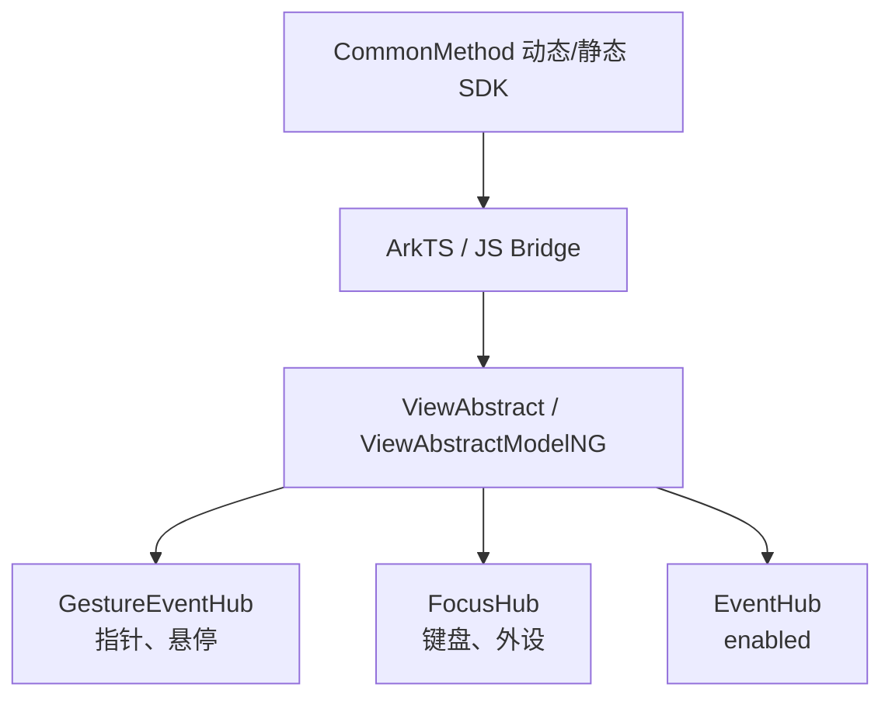

# 架构设计

> 通用交互属性把组件输入、可用性与反馈配置分派到 NG 事件、手势和焦点子系统；本文为已有实现补录的共享基线。

## 设计元数据

| 字段 | 内容 |
|------|------|
| Design ID | DESIGN-Func-04-03-04 |
| 关联需求 | 已有能力补录（无独立 requirement.md） |
| 关联 Epic | 无 |
| 目标 Feature | Feat-01、Feat-02、Feat-03 |
| 复杂度 | 标准 |
| 目标版本 | API 7 起，持续扩展至 API 24/26 |
| Owner | ArkUI SIG |
| 状态 | Baselined（已有实现补录） |

## 需求基线

| 项 | 补充说明 |
|----|----------|
| 通用输入 | 任意支持 CommonMethod 的组件应能注册指针、悬停、键盘与外设回调。 |
| 可用性 | `enabled` 必须同步事件处理与焦点可用性。 |
| 兼容性 | 动态、静态 ArkTS 的声明和 API 版本以 SDK 为准，规格显式保留差异。 |

## 上下文和现状

### 涉及仓和模块

| 仓库 | 补充架构说明 |
|------|----------------|
| ace_engine | `frameworks/bridge/declarative_frontend/engine/jsi/nativeModule/arkts_native_common_bridge.cpp` 提供动态 ArkTS 桥接。 |
| ace_engine | `frameworks/bridge/declarative_frontend/jsview/js_interactable_view.cpp` 提供兼容 JS 桥接。 |
| ace_engine | `frameworks/core/components_ng/base/view_abstract.cpp` 统一写入 EventHub、GestureEventHub、FocusHub。 |
| interface_sdk-js | `common.d.ts` 与 `common.static.d.ets` 是外部 API 契约。 |

### 调用链层级分析

| 层 | 模块 | 职责 | 修改类型 |
|----|------|------|----------|
| SDK | `common.d.ts:20146-20383,22281-22430` | 动态 API 与 since 声明 | 无修改（规格补录） |
| SDK | `common.static.d.ets:12072-12225,13025-13095` | 静态 API 声明 | 无修改（规格补录） |
| 动态桥 | `arkts_native_common_bridge.cpp:8932-9884,11527-11556` | 解析 ArkTS 回调并调用 ViewAbstract | 无修改（规格补录） |
| 兼容桥 | `js_interactable_view.cpp:75-368` | JS 回调注册 | 无修改（规格补录） |
| 通用属性 | `view_abstract.cpp:3199-3267,3329-3333` | 将输入、enabled、key 回调分派到 Hub | 无修改（规格补录） |
| 事件/手势/焦点 | `gesture_event_hub.cpp:781-1352`、`event_hub.cpp:1083-1089` | 保存手势回调和可用状态 | 无修改（规格补录） |

### 适用架构规则

| Rule ID | 适用原因 | 设计结论 | 验证方式 |
|---------|----------|----------|----------|
| OH-ARCH-LAYERING | 交互 API 跨 SDK、桥接和 NG Hub | 仅由桥接向 ViewAbstract 下行，不从 Hub 反向依赖前端 | 代码审查 |
| OH-ARCH-API-LEVEL | 公共 API 存在动态/静态及 since 差异 | 以 `common*.d.ts` 为契约，源实现差异写入风险 | SDK 对照 |
| OH-ARCH-ERROR-LOG | 回调和配置为可选 | 无回调时清除或不注册，空 Hub 早返回 | 单测/代码审查 |

## 不涉及项承接

| 维度 | 设计结论 |
|------|----------|
| 命中测试与手势仲裁 | 由 `04-04-06` 覆盖；本域不重复定义。 |
| 焦点属性 | 由既有焦点属性规格覆盖；本域只描述键盘回调对 FocusHub 的依赖。 |
| 拖拽、弹窗、模态 | 分别由 `04-04-07`、`04-03-05`、`04-03-06` 覆盖。 |
| 构建与部件 | 无变更，使用现有 ace_engine source set。 |

## 关键设计决策

| 决策 ID | 问题 | 推荐方案 | 探索过的替代方案 | 取舍理由 | 影响 |
|---------|------|----------|------------------|----------|------|
| ADR-1 | 输入回调存储位置 | 指针/悬停放 GestureEventHub，键盘放 FocusHub | 统一放 EventHub；组件各自保存 | 与事件分发职责及现有实现一致 | Feat-01、Feat-02 |
| ADR-2 | enabled 的作用面 | 同时设置 EventHub 和 FocusHub | 仅禁用点击；仅禁用焦点 | `ViewAbstract::SetEnabled` 已同步两者 | Feat-03 |
| ADR-3 | 前端契约冲突 | 动态/静态 API 分表声明 | 将两者抽象为同一签名 | SDK 声明实际存在重载与可空返回差异 | 全部 Feat |
| ADR-4 | 规格边界 | 引用相邻域、不复制命中/拖拽语义 | 合并所有交互 API | 保持 FuncID 职责单一 | 全部 Feat |

## 设计骨架

### 骨架范围

| 骨架项 | 目标 | 不包含 | 验证方式 |
|--------|------|--------|----------|
| 指针与悬停 | 注册回调和效果配置 | 命中测试算法 | SDK/源码审查 |
| 键盘与外设 | 保存 FocusHub 回调 | 焦点移动算法 | SDK/源码审查 |
| enabled 与反馈 | 事件、焦点、点击反馈 | 组件绘制实现 | SDK/源码审查 |

### 骨架 Spec 拆分

| Task ID | 目标 | 受影响文件 | AC |
|---------|------|--------------|----|
| TASK-SKELETON-1 | 指针、悬停和无障碍悬停 | `common.d.ts`、`view_abstract.cpp` | Feat-01 AC |
| TASK-SKELETON-2 | 键盘和外设事件 | `common.d.ts`、`view_abstract.cpp` | Feat-02 AC |
| TASK-SKELETON-3 | 可用性和点击反馈 | `common.d.ts`、`event_hub.cpp` | Feat-03 AC |

## 后续 Task 拆分

| Task ID | 目标 | 受影响文件 | 依赖 |
|---------|------|--------------|------|
| TASK-1 | 指针、悬停与无障碍悬停事件规格 | Feat-01 | 无 |
| TASK-2 | 键盘与外设输入事件规格 | Feat-02 | ADR-1 |
| TASK-3 | 组件可用性与点击反馈规格 | Feat-03 | ADR-2 |

## API 签名、Kit 与权限

### 新增 API

| API 签名 | 类型 | Kit | d.ts 位置 | 权限要求 | SysCap |
|----------|------|-----|-----------|----------|--------|
| `CommonMethod.onClick/onTouch/onHover/onMouse` | Public | ArkUI | `common.d.ts:20146-20281` | 无 | ArkUI |
| `CommonMethod.onKeyEvent/onAxisEvent` | Public | ArkUI | `common.d.ts:20293-20383` | 无 | ArkUI |
| `CommonMethod.enabled/clickEffect/enableClickSoundEffect` | Public | ArkUI | `common.d.ts:22281-22430` | 无 | ArkUI |

### 变更/废弃 API

| 原有 API | 变更类型 | 新 API | 迁移说明 |
|----------|----------|--------|----------|
| 动态 `onKeyEvent(event: KeyEvent => void)` | 版本扩展 | API 15 消费型重载 | 静态前端仅声明消费型回调。 |

## 构建系统影响

### BUILD.gn 变更

无变更，均为既有实现补录。

### bundle.json 变更

无变更。

## 可选设计扩展

### 架构图



### 数据流/控制流

| 步骤 | 调用方 | 被调用方 | 数据/接口 | 说明 |
|------|--------|----------|-----------|------|
| 1 | ArkTS | CommonBridge | 回调或配置值 | 解析 API 参数。 |
| 2 | Bridge | ViewAbstract | `SetOn*` / `SetEnabled` | 分派到对应 Hub。 |
| 3 | ViewAbstract | GestureEventHub/FocusHub/EventHub | 回调、布尔值 | Hub 保存供后续系统事件分发。 |

### 数据模型设计

```typescript
type PointerCallbacks = { onClick?: Callback<ClickEvent>; onTouch?: Callback<TouchEvent>; onHover?: Callback<HoverEvent> }
type InputCallbacks = { onKeyEvent?: Callback<KeyEvent, boolean>; onAxisEvent?: Callback<AxisEvent> }
```

### 测试性设计

| 测试层级 | 测试目标 | Mock 策略 | 验证方式 |
|----------|----------|-----------|----------|
| SDK 对照 | 重载、since 和动态/静态差异 | 不适用 | 声明审查 |
| 单元测试 | Hub 保存及 enabled 同步 | FrameNode/Hub mock | 既有 `view_abstract_*` 测试 |

## 详细设计

### 指针、悬停与无障碍悬停

`ViewAbstract::SetOnTouch/SetOnMouse/SetOnHover` 将回调交给 GestureEventHub；动态桥在 `arkts_native_common_bridge.cpp:9283-9884` 建立 ArkTS 包装回调。

### 键盘与外设

`ViewAbstract::SetOnKeyEvent` 和 `SetOnKeyEventDispatch` 取得 FocusHub 并保存回调，见 `view_abstract.cpp:3329-3333,10231-10243`。

### 可用性与点击反馈

`SetEnabled` 先写 EventHub 再写 FocusHub，见 `view_abstract.cpp:3255-3267`；点击反馈和声音由通用桥及 FrameNode 路径处理。

## 风险和开放问题

| 项 | 类型 | 影响 | 处理方式 | Owner |
|----|------|------|----------|-------|
| 动态/静态签名不对称 | API | 中 | 各 Feat 逐 API 标注而不推断统一语义 | ArkUI SIG |
| 相邻域重复覆盖 | 架构 | 中 | 规格采用边界引用 | ArkUI SIG |

## 设计审批

- [x] 需求基线已确认，设计覆盖 P0/P1 AC
- [x] 不涉及项已有结论
- [x] 涉及仓和模块职责清晰
- [x] 调用链层级分析完整
- [x] 适用架构规则已形成结论
- [x] 分层和子系统边界合规
- [x] API 签名、权限与兼容性已声明
- [x] BUILD.gn/bundle.json 影响明确
- [x] 后续 Task 拆分明确
- [x] 关键设计决策有理由和影响
- [x] 风险有 Owner

**结论:** 通过（已有实现补录）
