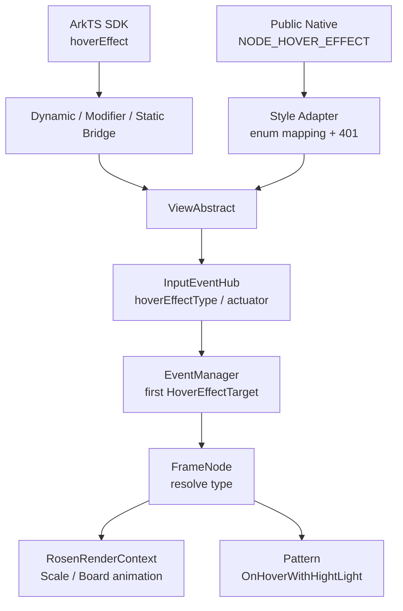
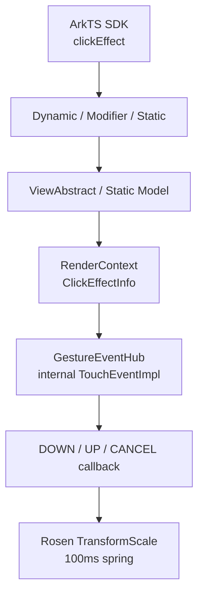
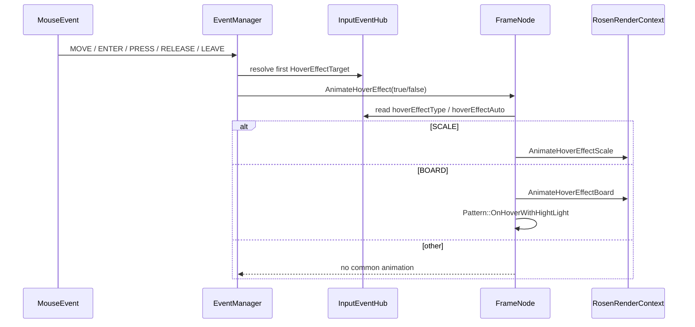
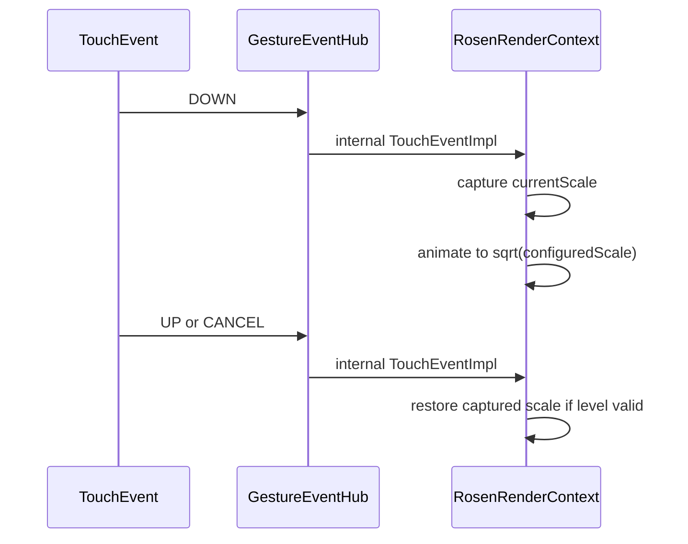
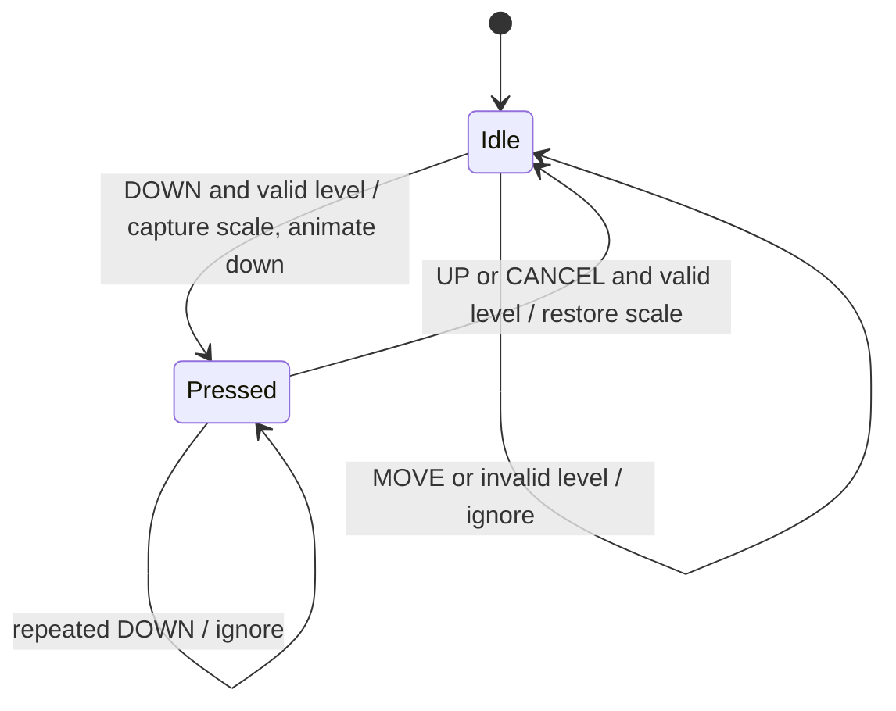
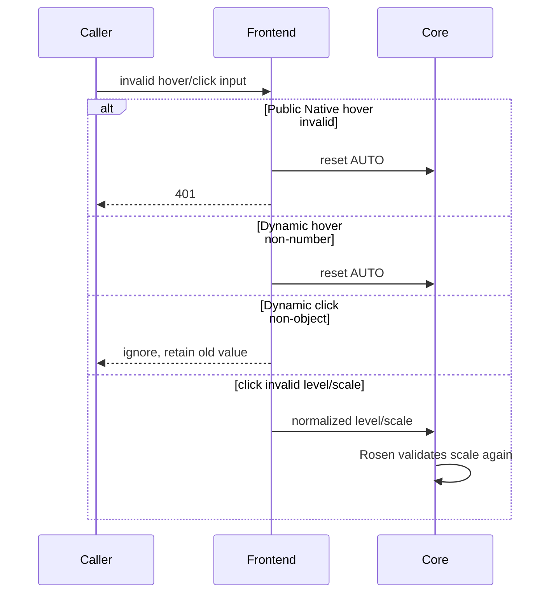

# 架构设计

> 确认交互属性 `hoverEffect` 与 `clickEffect` 的现有分层、状态存储、输入分发和渲染反馈设计。

## 设计元数据

| 属性 | 值 |
|------|-----|
| Design ID | DESIGN-Func-04-03-04 |
| 关联需求 | 已有能力补录（无独立 requirement.md） |
| 关联 Epic | 无 |
| 目标 Feature | Feat-01 悬停交互反馈，Feat-02 点击交互反馈 |
| 复杂度 | 标准 |
| 目标版本 | ArkTS API 8+（hoverEffect）、API 10+（clickEffect）；Public Native API 23+（hoverEffect） |
| Owner | ArkUI SIG |
| 状态 | Baselined |

## 需求基线

> 需求基线详见 proposal.md。以下仅列出设计阶段需要额外强调的要点。

| 项 | 补充说明（如需） |
|----|------------------|
| Feat-01 | 固化 `hoverEffect` 从 ArkTS/Native 属性设置、InputEventHub 存储、EventManager 鼠标命中分发到 Rosen 动画的完整链路，不包含 `onHover` |
| Feat-02 | 固化 `clickEffect` 从 ArkTS/Static 参数归一、RenderContext 状态存储、内部 TouchEvent 注册到按压/恢复动画的完整链路，不包含 `onClick` |
| 实现即规格 | 对非法值、多前端不一致、Legacy/TypedNode 缺口仅登记现状和风险，不在补录规格中提出实现修改 |

## 上下文和现状

### 涉及仓和模块

| 仓库 | 补充架构说明 |
|------|--------------|
| ace_engine | `frameworks/bridge/declarative_frontend/jsview/` 负责 Dynamic ArkTS 参数解析和 reset 语义 |
| ace_engine | `frameworks/bridge/declarative_frontend/ark_component/` 与 `arkts_native_common_bridge.cpp` 负责 Modifier 路径 |
| ace_engine | `frameworks/bridge/arkts_frontend/` 与 `frameworks/core/interfaces/native/implementation/` 负责 Static 生成链路 |
| ace_engine | `frameworks/core/components_ng/event/` 与 `frameworks/core/common/event_manager.cpp` 负责 hover 属性存储和鼠标命中分发 |
| ace_engine | `frameworks/core/components_ng/render/adapter/rosen_render_context.cpp` 负责 hover/click 动画和 click 触摸状态 |
| ace_engine | `interfaces/native/` 仅公开 API 23 `NODE_HOVER_EFFECT`；clickEffect 只有内部 modifier ABI |
| interface/sdk-js（外部 checkout） | 提供 Dynamic Public API 签名和 @since 核验；目标 checkout 缺少同基线 SDK |

### 调用链层级分析

| 层 | 模块 | 职责 | 修改类型 |
|----|------|------|----------|
| Public SDK | `interface/sdk-js/api/@internal/component/ets/common.d.ts`, `enums.d.ts` | 声明 hover/click API、枚举、版本和 SysCap | 存量分析；Feat-02 增加 Optional reset 版本差异 |
| ArkTS Dynamic | `js_view_abstract.cpp` | 类型检查、非法值归一和 reset | 存量分析 |
| ArkTS Modifier | `ArkComponent.ts`, `arkts_native_common_bridge.cpp` | keyed modifier、set/reset、参数归一 | 存量分析 |
| ArkTS Static | generated `common.ets`, `common_method_modifier.cpp` | 序列化、枚举转换、Static 默认值 | 存量分析；Feat-02 标注显式 scale 透传 |
| Common API | `view_abstract.cpp`, `view_abstract_model_static.cpp` | 将属性写入 InputEventHub 或 RenderContext | 存量分析 |
| 输入事件 | `input_event_hub.cpp`, `event_manager.cpp`, `gesture_event_hub.cpp` | hover 鼠标命中；click 内部 TouchEvent 注册和分发 | 存量分析 |
| 节点分派 | `frame_node.cpp` | hover 类型解析、组件 Pattern 高亮钩子、disabled/inactive TouchTest 门禁 | 存量分析 |
| 渲染 | `rosen_render_context.cpp` | hover 主题动画；click spring、scale 捕获和恢复 | 存量分析 |
| Public Native | `native_node.h`, `native_type.h`, `style_modifier.cpp` | Feat-01 公共 set/get/reset、枚举转换和 401 | 存量分析；Feat-02 无公共接口 |
| 测试 | `test/unittest/` | 分支、属性和少量动画状态验证 | 存量分析；多个 Static 和边界用例缺失/禁用 |

### 适用架构规则

| Rule ID | 适用原因 | 设计结论 | 验证方式 |
|---------|----------|----------|----------|
| OH-ARCH-LAYERING | 涉及 SDK→Bridge→Core→Event→Render | 保持单向调用；前端不直接操作 Rosen，事件层不解析 Public SDK 类型 | 架构评审/依赖检查 |
| OH-ARCH-SUBSYSTEM | 仅 ArkUI 子系统内部跨模块 | 不新增跨子系统依赖 | 代码评审 |
| OH-ARCH-IPC-SAF | 不跨进程/SA | N/A，无 IPC/SAF | 静态检查 |
| OH-ARCH-API-LEVEL | 同时存在 Public ArkTS、Public Native 与 InnerApi | 明确各入口开放范围，禁止把内部 click modifier 写成 Public Native | API 评审/XTS |
| OH-ARCH-COMPONENT-BUILD | 仅补录已有实现 | 不修改 BUILD.gn/bundle.json | 构建差异检查 |
| OH-ARCH-ERROR-LOG | Public Native hover 返回 401 | 参数错误沿公共 adapter 返回；ArkTS 非法值按各前端现状处理 | NativeNode UT/Bridge UT |

## 不涉及项承接

| 维度 | 设计结论 |
|------|----------|
| `onHover` / `onClick` 事件回调 | 不属于本 FuncID 两个 Feat；仅在说明“反馈不依赖回调”时作为边界引用 |
| 新增 API 或源码修改 | 不涉及；本轮只补录已有能力 |
| 权限、IPC、安全数据 | 不涉及；API 无权限、无跨进程数据 |
| 持久化和迁移 | 不涉及；属性和动画状态均为节点运行时内存 |
| 组件自定义状态样式 | 不涉及；`stateStyles`/`attributeModifier` 由其他 FuncID 规格承接 |

## 关键设计决策

| 决策 ID | 问题 | 推荐方案 | 探索过的替代方案 | 取舍理由 | 影响 |
|---------|------|----------|------------------|----------|------|
| ADR-1 | hoverEffect 应按事件还是样式属性建模 | 建模为 InputEventHub 上的交互属性，由 EventManager 鼠标命中驱动 | 建模为 RenderContext 静态样式；并入 onHover 事件 | 源码存储与触发链明确独立于回调，且需要命中状态机 | Feat-01 全部 AC |
| ADR-2 | Auto 是否等价于固定 Scale/Highlight | 记录为组件解析入口；只有解析为 SCALE/BOARD 才播放通用动画 | 统一解释为 Scale；统一解释为 Highlight | `hoverEffectAuto` 和组件 Pattern 决定实际行为，统一值会偏离实现 | AC-1.4 |
| ADR-3 | Public Native 与内部枚举如何描述 | 同时列出并强调显式转换，不复用数值 | 只写语义名；直接对齐数值 | 公共 AUTO=0，而内部 AUTO=4，忽略数值差异会误导实现 | AC-3.1~3.4 |
| ADR-4 | Dynamic/Static 非法枚举差异如何处理 | 分入口固化：Dynamic number 透传，Static 转换失败后 reset Auto | 统一为参数错误；统一为 reset | 实现即规格，不能静默抹平兼容差异 | AC-2.3~2.6 |
| ADR-F2-1 | clickEffect 是否依赖 onClick | 建模为独立内部 TouchEvent listener | 复用 ClickEventHub；仅 clickable 节点生效 | 源码不检查 IsClickable，普通节点也可播放反馈 | Feat-02 AC-2.4 |
| ADR-F2-2 | scale 的合法性由哪层保证 | 记录前端差异，并以 Rosen 的 [0,1] 最终回退为运行时下限 | 要求所有前端完全一致；只记录 SDK 约束 | Static 显式值可透传，但渲染层再次校验 | Feat-02 AC-1.4~1.6 |
| ADR-F2-3 | reset 后是否移除触摸 listener | 按现状保留 listener，以 UNDEFINED 跳过动画 | reset 时删除 listener；每次重设重新注册 | 源码 listener 只初始化一次，属性与监听生命周期分离 | Feat-02 AC-3.4~3.5 |
| ADR-F2-4 | clickEffect Native 能力如何定位 | 仅登记 InnerApi modifier，不声明 Public Native | 将内部函数指针作为 Public C API；仿照 hover 构造不存在的 Node 属性 | `native_node.h`/`native_type.h` 无 clickEffect 公共符号 | Feat-02 全部 AC |

## 设计骨架

### 骨架范围

| 骨架项 | 目标 | 不包含 | 验证方式 |
|--------|------|--------|----------|
| Hover 设置链 | 覆盖 Dynamic/Modifier/Static/Public Native → InputEventHub | onHover 回调 | Bridge/NativeNode UT |
| Hover 分发链 | 覆盖鼠标命中、PRESS/RELEASE/WINDOW_LEAVE 和首目标选择 | Pen/无障碍事件回调规格 | EventManager UT |
| Hover 渲染链 | 覆盖 SCALE/BOARD、主题参数和 Pattern 钩子 | 组件私有 hover 动画细节 | Rosen/组件 UT |
| Click 设置链 | 覆盖 Dynamic/Modifier/Static → RenderContext | Public Native（不存在） | Bridge/Static UT |
| Click 状态机 | 覆盖 DOWN/重复 DOWN/UP/CANCEL、disabled/inactive | onClick 业务回调 | Rosen/Gesture UT |

### 骨架 Spec 拆分

| Task ID | 目标 | 受影响文件 | AC |
|---------|------|------------|----|
| TASK-SKELETON-1 | 悬停交互反馈规格补录 | `Feat-01-hover-interaction-feedback-spec.md`, `design.md` | Feat-01 全部 AC |
| TASK-SKELETON-2 | 点击交互反馈规格补录 | `Feat-02-click-interaction-feedback-spec.md`, `design.md` | Feat-02 全部 AC |

## 后续 Task 拆分

| Task ID | 目标 | 受影响文件 | 依赖 |
|---------|------|------------|------|
| TASK-04-03-04-01 | 验证 hover 四类型、reset、非法输入、首命中节点和 Native 401 | 现有 hover Bridge/EventManager/Rosen/NativeNode 测试 | Feat-01 spec |
| TASK-04-03-04-02 | 验证 click 三档、scale 边界、触摸恢复、reset 和前端差异 | 现有 click Bridge/Static/Rosen/Gesture 测试 | Feat-02 spec；Feat-01 design 基线 |

## API 签名、Kit 与权限

### 新增 API

| API 签名 | 类型 | Kit | d.ts 位置 | 权限要求 | SysCap |
|----------|------|-----|----------|----------|--------|
| `hoverEffect(value: HoverEffect): T` | Public | ArkUI | `common.d.ts:20478-20505` | 无 | `SystemCapability.ArkUI.ArkUI.Full` |
| `clickEffect(value: ClickEffect \| null): T` | Public | ArkUI | `common.d.ts:23064-23083` | 无 | `SystemCapability.ArkUI.ArkUI.Full` |
| `clickEffect(effect: Optional<ClickEffect \| null>): T` | Public | ArkUI | `common.d.ts:23085-23095` | 无 | `SystemCapability.ArkUI.ArkUI.Full` |
| `NODE_HOVER_EFFECT` set/get/reset | Public Native | ArkUI NDK | `interfaces/native/native_node.h:9576-9590` | 无 | ArkUI Full |
| `ArkUICommonModifier::setClickEffect/resetClickEffect` | InnerApi | ArkUI Internal | `frameworks/core/interfaces/arkoala/arkoala_api.h:3520-3524` | 无 | 内部 ABI |

> Dynamic SDK 来自外部 checkout；目标仓缺少同基线 Static canonical SDK。Public 版本只采用可核验 SDK/Native 头文件声明。

### 变更/废弃 API

| 原有 API | 变更类型 | 新 API | 迁移说明 |
|----------|----------|--------|----------|
| — | — | — | 已有能力补录，无接口变更或废弃 |

## 构建系统影响

### BUILD.gn 变更

```text
文件路径: N/A
变更说明: 仅新增规格文档和注册信息，不修改产品源码与构建目标。
```

### bundle.json 变更

无新增 component、无依赖关系变化。

## 可选设计扩展

### 架构图



#### 点击交互反馈架构图（Feat-02）



### 数据流/控制流

| 步骤 | 调用方 | 被调用方 | 数据/接口 | 说明 |
|------|--------|----------|-----------|------|
| 1 | ArkTS/Native | Bridge/Adapter | HoverEffect 或 ClickEffect | 解析、reset、非法值归一 |
| 2 | Bridge/Adapter | ViewAbstract | 内部枚举、level、scale | 写节点运行时属性 |
| 3A | MouseEvent | EventManager | HoverEffectTarget 命中链 | 选择第一个通用 hover 目标 |
| 3B | TouchEvent | GestureEventHub | 内部 click listener | 与 onClick 解耦 |
| 4A | FrameNode | Rosen/Pattern | SCALE/BOARD + isHovered | 播放 hover 动画和高亮扩展 |
| 4B | Rosen listener | Rosen animation | level/scale/currentScale | 播放或恢复 click spring |

### 时序设计



#### 点击反馈时序（Feat-02）



### 数据模型设计

```cpp
// frameworks/core/components_ng/event/input_event_hub.h:92-103,358-359
HoverEffectType hoverEffectType_ = HoverEffectType::UNKNOWN;
HoverEffectType hoverEffectAuto_ = HoverEffectType::UNKNOWN;
RefPtr<HoverEffectActuator> hoverEffectActuator_;
```

| 数据 | 存储位置 | 生命周期 | 说明 |
|------|----------|----------|------|
| hoverEffectType/Auto | InputEventHub | 节点 EventHub 生命周期 | 通用 hover 类型与组件解析候选 |
| hover actuator | InputEventHub | 首次设置后随 Hub | 参与 TouchTest 命中收集 |
| isHoveredScale/Board | RosenRenderContext | RenderContext 生命周期 | 防止同状态重复动画 |

#### 点击交互反馈数据模型（Feat-02）

```cpp
// frameworks/core/components/common/properties/effect_option.h:28-40
enum class ClickEffectLevel { UNDEFINED = -1, LIGHT = 0, MIDDLE = 1, HEAVY = 2 };

// RenderContext property and Rosen runtime state
ClickEffectInfo clickEffectInfo;
RefPtr<TouchEventImpl> touchListener_;
VectorF currentScale_;
bool isTouchUpFinished_;
```

| 数据 | 存储位置 | 生命周期 | 说明 |
|------|----------|----------|------|
| ClickEffectInfo | RenderContext property | 节点 RenderContext 生命周期 | 保存 level 与配置 scale |
| touchListener | RosenRenderContext | 首次初始化后常驻 | reset 不移除 |
| currentScale | RosenRenderContext | 每次有效 DOWN→UP/CANCEL | 保存恢复目标 |
| isTouchUpFinished | RosenRenderContext | 触摸序列状态 | 防止重复 DOWN |

### 算法与状态机



### 测试性设计

| 测试层级 | 测试目标 | Mock 策略 | 验证方式 |
|----------|----------|-----------|----------|
| Bridge UT | undefined/null/非对象/非法枚举/scale 边界 | 构造 JS/RuntimeCallInfo | 断言 core setter 参数 |
| EventManager UT | hover 首目标、PRESS/RELEASE/WINDOW_LEAVE | 构造 TouchTestResult 和 MouseEvent | 断言进入/退出序列 |
| Rosen UT | hover 主题参数；click 三档和恢复 | Mock AppTheme/RenderService property | 断言 scale/color/状态 |
| NativeNode UT | hover set/get/reset/401 | 构造 ArkUI_AttributeItem | 断言返回码和 get 值 |
| 组件交互 | Button/TextField Auto 特例、无 onClick clickEffect | 测试组件与输入注入 | 视觉/属性断言 |

### 异常传播时序图



### 资源所有权矩阵

| 资源 | 创建方 | 持有方 | 销毁触发 | 实际释放 | 异常回收 |
|------|--------|--------|----------|----------|----------|
| HoverEffectActuator | InputEventHub::SetHoverEffect | InputEventHub | 节点/EventHub 销毁 | RefPtr 释放 | 无跨线程裸指针 |
| Click TouchEventImpl | RosenRenderContext 初始化 | RosenRenderContext/GestureEventHub | 节点销毁 | RefPtr 释放 | reset 不单独移除 |
| 动画状态 | RosenRenderContext | RosenRenderContext | 节点销毁 | 随对象释放 | WINDOW_LEAVE/UP/CANCEL 为正常恢复 |

### 接口参数规约

| 接口 | 参数 | 类型 | 合法范围 | 非法处理 | 边界说明 |
|------|------|------|----------|----------|----------|
| hoverEffect Dynamic | value | number/HoverEffect | Public 四值 | 非 number reset Auto；非法 number 透传 | 非法 number 最终无通用动画 |
| NODE_HOVER_EFFECT | value[0] | int32 | 0..3，size=1 | reset Auto + 401 | get 未知内部值返回 Auto |
| clickEffect Dynamic | level | number | 0..2 | 归一 LIGHT | 缺失同 LIGHT |
| clickEffect Dynamic | scale | number | [0,1] | 按档位默认 | 0/1 合法 |
| clickEffect Static | scale | number/optional | 入口不限制 | 渲染层回退 | Static canonical SDK 未核验 |

### 线程与并发模型

| 操作 | 发起线程 | 回调线程 | 跨进程边界 | 线程安全 | 重入约束 |
|------|----------|----------|------------|----------|----------|
| ArkTS 属性设置 | UI/ArkTS | UI | 无 | ViewAbstract 多线程路径可投递 UI 任务 | 属性写入按 UI 队列顺序 |
| Mouse hover 分发 | UI 输入线程语义 | UI | 无 | EventManager 串行维护 curr/last 节点 | 同状态由 Rosen 标志去重 |
| Touch click listener | UI 输入线程语义 | UI | 无 | 节点级 listener 和状态 | 未结束按压时重复 DOWN 忽略 |

## 详细设计

### 悬停属性设置与重置

Dynamic `JSViewAbstract::JsHoverEffect` 对非 number 调用 `SetHoverEffect(AUTO)`；number 直接转换为内部枚举，不做范围校验（`frameworks/bridge/declarative_frontend/jsview/js_view_abstract.cpp:11717-11728`）。Modifier 的删除/undefined 走 `resetHoverEffect`，底层同样写 AUTO（`frameworks/bridge/declarative_frontend/engine/jsi/nativeModule/arkts_native_common_bridge.cpp:7610-7634`; `frameworks/core/interfaces/native/node/node_common_modifier.cpp:5991-6005`）。

`InputEventHub::SetHoverEffect` 首次创建 actuator；类型变化时先按旧类型调用退出动画，再保存新值；相同值直接返回（`frameworks/core/components_ng/event/input_event_hub.cpp:31-46,140-150`）。

### 悬停命中与鼠标状态机

Hover actuator 在命中测试中加入 `HoverEffectTarget`。EventManager 遍历命中结果，只把首个 HoverEffectTarget 作为当前节点（`frameworks/core/components_ng/event/input_event.cpp:260-275`; `frameworks/core/common/event_manager.cpp:2006-2043`）。

鼠标进入或命中节点变化触发进入；PRESS 暂时退出；RELEASE 且仍命中时重新进入；WINDOW_LEAVE 清理当前与上一节点（`frameworks/core/common/event_manager.cpp:2196-2254`）。Pen 路径不收集 HoverEffectTarget，因此不触发通用效果（`frameworks/core/components_ng/event/input_event_hub.cpp:31-55,74-90`）。

### 悬停类型解析与动画

FrameNode 对 AUTO/UNKNOWN 尝试读取 `hoverEffectAuto`，只分派 SCALE 与 BOARD；NONE、OPACITY、未解析的 AUTO/UNKNOWN 不播放通用动画。BOARD 还调用 Pattern 高亮钩子（`frameworks/core/components_ng/base/frame_node.cpp:4594-4620`）。

AppTheme 默认定义 scale 1.0→1.05、hover 叠色 5% 黑和 250ms；Rosen 使用 cubic(0.2,0,0.2,1)，并用 `isHoveredScale_`/`isHoveredBoard_` 避免同状态重复动画（`frameworks/core/components/theme/app_theme.h:176-182`; `frameworks/core/components/theme/app_theme.cpp:37-50`; `frameworks/core/components_ng/render/adapter/rosen_render_context.cpp:5520-5583`）。

### Public Native 悬停属性

`NODE_HOVER_EFFECT` 自 API 23 开放。Style adapter 要求 item 非空、size=1、值域 0..3；非法输入先写 AUTO 再返回 401。公共枚举通过显式表映射到内部 AUTO/SCALE/BOARD/NONE，get 做反向映射，reset 写 AUTO（`interfaces/native/native_node.h:9576-9590`; `interfaces/native/native_type.h:1321-1335`; `interfaces/native/node/style_modifier.cpp:1744-1810`）。

### 点击属性解析与默认值

Dynamic 对 null/undefined 写 UNDEFINED+0.90；非 object 忽略；level 缺失/非 number/越界归一 LIGHT；scale 缺失或越界按档位取 0.90/0.95（`frameworks/bridge/declarative_frontend/jsview/js_view_abstract.cpp:12002-12045`）。

Static converter 对非法 level 生成空值/UNDEFINED，缺失 scale 按档位默认；显式 scale 不在 Static 层校验（`frameworks/core/interfaces/native/implementation/common_method_modifier.cpp:1982-2000,4671-4688`; `frameworks/core/components_ng/base/view_abstract_model_static.cpp:1917-1933`）。Rosen 在动画前再次校验 [0,1]，因此形成最终运行时保护（`frameworks/core/components_ng/render/adapter/rosen_render_context.cpp:7593-7601,7625-7662`）。

### 点击触摸监听与动画状态机

ClickEffectInfo 写入 RenderContext。首次更新或 OnModifyDone 初始化内部 TouchEventImpl 并注册到 GestureEventHub；该 listener 不依赖 onClick 或 `IsClickable`（`frameworks/core/components_ng/base/view_abstract.cpp:348-359,10002-10008`; `frameworks/core/components_ng/render/adapter/rosen_render_context.cpp:1843-1849,4035-4041,7569-7585`; `frameworks/core/components_ng/event/gesture_event_hub.cpp:342-360`）。

首次 DOWN 捕获当前 transform scale，并将目标绝对设置为 `sqrt(configuredScale)`；未 UP 前重复 DOWN 忽略。UP/CANCEL 在 level 有效时恢复捕获值，MOVE 等忽略。三档统一 duration 100ms，spring 参数和默认 scale 见 SDK/源码常量（`frameworks/core/components_ng/render/adapter/rosen_render_context.cpp:148-159,7587-7662`）。

reset 只把 level 写为 UNDEFINED，不移除 listener。若 reset 发生在 DOWN 与 UP/CANCEL 之间，恢复分支会因最新 level 为 UNDEFINED 而跳过；此行为作为风险记录（`frameworks/core/components_ng/render/adapter/rosen_render_context.cpp:7569-7622`; `frameworks/core/interfaces/native/node/node_common_modifier.cpp:6014-6027`）。

### 点击前端与平台差异

Static generated 接受 `ClickEffect | null | undefined`，但 inner_api 声明只含 `ClickEffect | undefined`（`frameworks/bridge/arkts_frontend/koala_projects/arkoala-arkts/arkui-ohos/generated/component/common.ets:5069-5079`; `frameworks/bridge/arkts_frontend/koala_projects/inner_api/arkui/component/common.d.ets:324,886`）。`ArkBaseNode.clickEffect` 当前直接返回且不调用 peer（`frameworks/bridge/arkts_frontend/koala_projects/arkoala-arkts/arkui-ohos/src/typedNode/ArkBaseNode.ets:450-452`）。Legacy `SetClickEffectLevel` 是空实现（`frameworks/bridge/declarative_frontend/jsview/models/view_abstract_model_impl.h:202-203`）。

## 风险和开放问题

| 项 | 类型 | 影响 | 处理方式 | Owner |
|----|------|------|----------|-------|
| 目标 checkout 缺少同基线 SDK 和 Static canonical 声明 | API | 中 | 只采用可核验 Dynamic SDK；Static 不推断 @since | ArkUI SIG |
| hover Auto 行为由组件 Pattern 决定，通用默认可能无动画 | API | 中 | Spec 限定通用解析语义，各组件规格补充私有覆盖 | ArkUI SIG |
| hover Scale 直接写主题 scale，可能覆盖用户 transform | 架构 | 中 | 按现状登记并要求组合场景测试 | ArkUI SIG |
| 悬停中禁用但无后续鼠标事件可能残留视觉状态 | 测试 | 中 | 增加 disabled/inactive 交互验证 | ArkUI SIG |
| Dynamic/Static hover 非法枚举处理不一致 | API | 中 | 分入口记录，禁止统一描述 | ArkUI SIG |
| click reset 发生在按下与恢复之间可能保留按下 scale | 架构 | 高 | 作为恢复边界固化并增加序列测试 | ArkUI SIG |
| click 按压期间外部 transform 修改会被旧缓存覆盖 | 架构 | 中 | 记录缓存恢复语义并增加组合测试 | ArkUI SIG |
| click 多指读取 touches 首项且无空列表保护 | 测试 | 中 | 增加多指与异常 payload 覆盖 | ArkUI SIG |
| ArkComponent null diff 访问、Static 类型面不一致 | API | 中 | 保留源码风险，补足前端单测 | ArkUI SIG |
| TypedNode clickEffect no-op、Legacy clickEffect 空实现 | API | 高 | 明确通道能力差异，不声明跨前端等价 | ArkUI SIG |
| Static hover/click 多个专项测试被禁用 | 测试 | 中 | 后续 Task 恢复并补充有效断言 | ArkUI SIG |
| clickEffect 没有 Public Native Node 属性 | API | 低 | 仅登记内部 ABI，不构造不存在的公共接口 | ArkUI SIG |

## 设计审批

- [x] 需求基线已确认，设计覆盖 P0/P1 AC
- [x] 不涉及项已承接，N/A 和展开项都有结论
- [x] 涉及仓和模块职责清楚
- [x] 调用链层级分析完整，每层覆盖到位
- [x] 适用架构规则已识别并形成设计结论
- [x] 分层和子系统边界合规
- [x] API 变更有签名、权限、错误码和兼容性说明
- [x] BUILD.gn/bundle.json 影响明确
- [x] 设计输出和后续 Task 拆分明确
- [x] 关键设计决策有理由和影响说明
- [x] 风险和开放问题有 Owner

**结论:** 通过（已有实现补录）。
