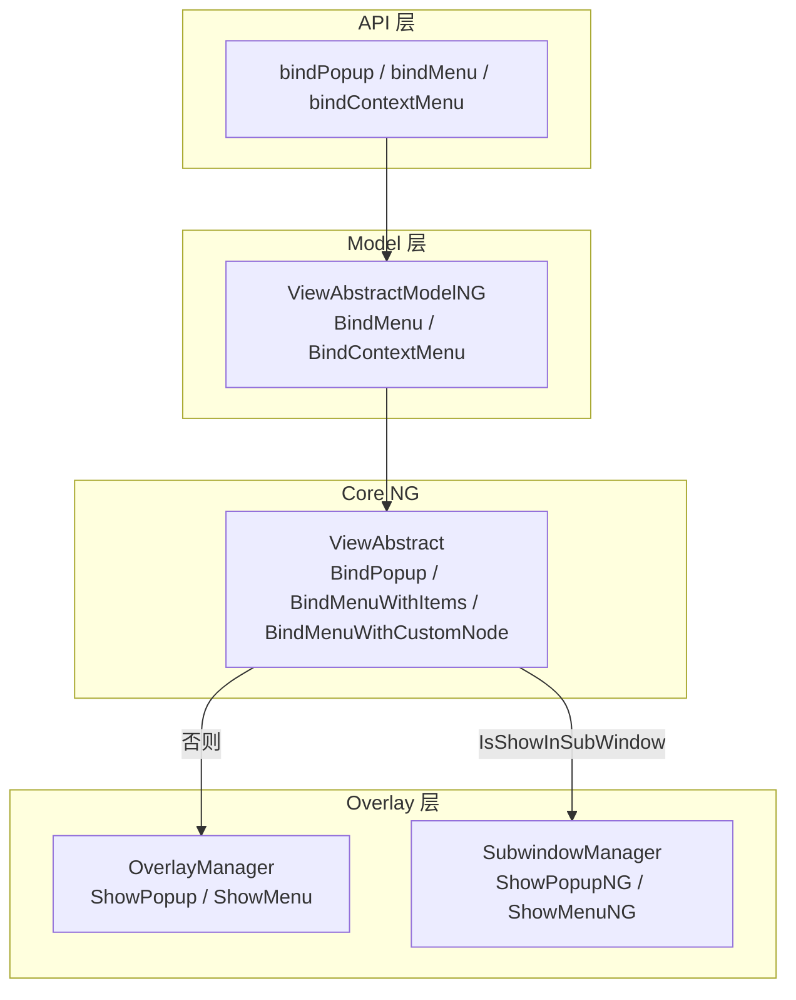

# 架构设计

> 弹窗类属性是 ArkUI 通用属性层中用于将 popup/menu/contextMenu 等浮层绑定到任意组件的通用属性方法集合。

## 设计元数据

| 字段 | 内容 |
|------|------|
| Design ID | DESIGN-Func-04-03-05 |
| 关联需求 | 已有能力补录（无独立 requirement.md） |
| 关联 Epic | 无 |
| 目标 Feature | Feat-01 弹窗类属性 |
| 复杂度 | 中等 |
| 目标版本 | API 7 起支持，API 12/23/26 持续扩展 |
| Owner | ArkUI SIG |
| 状态 | Baselined（已有实现补录） |

## 需求基线

| 字段 | 内容 |
|------|------|
| 问题陈述 | 任意组件需要以通用属性形式绑定 popup 气泡、menu 菜单、contextMenu 上下文菜单等浮层，并支持双向绑定与触发响应 |
| 核心目标 | （Feat-01）固化 bindPopup/bindMenu/bindContextMenu 及其变体的绑定、显示、子窗路由与布局避让行为 |
| P0 AC | AC-1.1~1.5（bindPopup）、AC-2.1~2.5（bindMenu）、AC-3.1~3.6（bindContextMenu） |

## 上下文和现状

### 涉及仓和模块

| 仓库 | 模块路径 | 当前职责 | 本 Feature 影响 |
|------|----------|----------|-----------------|
| ace_engine | `frameworks/core/components_ng/base/view_abstract.cpp` | BindPopup/BindMenuWithItems/BindMenuWithCustomNode 实现 | 全量涉及 |
| ace_engine | `frameworks/core/components_ng/base/view_abstract_model_ng.cpp` | NG Model 层 BindMenu/BindContextMenu 入口 | 全量涉及 |
| ace_engine | `frameworks/core/components_ng/pattern/overlay/overlay_manager.cpp` | ShowPopup/ShowMenu 挂载与显示 | 全量涉及 |
| ace_engine | `frameworks/bridge/declarative_frontend/jsview/js_popups.cpp` | JS 桥接 JsBindPopup/JsBindMenu/JsBindContextMenu | 全量涉及 |
| ace_engine | `frameworks/bridge/declarative_frontend/jsview/js_view_abstract.cpp` | 静态方法注册 | 全量涉及 |

### 调用链层级分析

| 层 | 模块 | 职责 | 修改类型 |
|----|------|------|----------|
| JS Bridge | `js_popups.cpp:2021-2072` | JsBindPopup 解析 show 与 popup 对象 | 无修改（规格补录） |
| JS Bridge | `js_popups.cpp:3293-3355` | JsBindMenu 解析 items/customBuilder/menuParam | 无修改（规格补录） |
| JS Bridge | `js_popups.cpp:2207-2382` | JsBindContextMenu 多变体分发 | 无修改（规格补录） |
| Model | `view_abstract_model_ng.cpp:276-326` | BindMenu 分发 items/customNode | 无修改（规格补录） |
| Model | `view_abstract_model_ng.cpp:894-988` | BindContextMenu 分发 CUSTOM_TYPE/RIGHT_CLICK/LONG_PRESS | 无修改（规格补录） |
| Core NG | `view_abstract.cpp:4615-4772` | BindPopup 创建/更新/显示/隐藏 | 无修改（规格补录） |
| Core NG | `view_abstract.cpp:5382-5478` | BindMenuWithItems/BindMenuWithCustomNode | 无修改（规格补录） |
| Overlay | `overlay_manager.cpp:946-974` | ShowPopup 挂载到 popupMap_ | 无修改（规格补录） |

### 适用架构规则

| 规则 ID | 设计结论 |
|---------|----------|
| OH-ARCH-01 | 弹窗属性以通用属性形式挂载到目标组件，通过 OverlayManager 集中管理 |
| OH-ARCH-02 | 子窗与 Overlay 双路径：IsShowInSubWindow 时走 SubwindowManager，否则走 OverlayManager |
| OH-ARCH-03 | 双向绑定通过 ParseDoubleBindCallback 解析 $value/changeEvent |

## 不涉及项承接

| 维度 | 结论 |
|------|------|
| 性能 | N/A — 绑定为一次性注册，显示走既有 Overlay 流程 |
| 安全与权限 | 展开 — contextMenu haptic 需 ohos.permission.VIBRATE |
| 兼容性 | 展开设计 — API 7/8/10/11/12/23/26 多版本变体需兼容性声明 |
| 构建与部件 | N/A — 源码已包含在既有 source set 中 |

## 关键设计决策

| 决策 ID | 问题 | 推荐方案 | 探索过的替代方案 | 取舍理由 | 影响 |
|---------|------|----------|------------------|----------|------|
| ADR-1 | popup 显示路径选择 | IsShowInSubWindow 走子窗，否则走 OverlayManager | 统一走 Overlay | 子窗可跨窗口显示 popup，避免被父容器裁剪 | 需两条显示/隐藏路径 |
| ADR-2 | menu 默认 placement | API>=10 BOTTOM_LEFT，API<10 不设置 | 统一 BOTTOM_LEFT | API 10 收敛到 BottomLeft 与触发点对齐 | 版本间默认值差异 |
| ADR-3 | contextMenu 触发范式 | 双范式：responseType(LongPress/RightClick) 与 isShown(CUSTOM_TYPE) | 仅 responseType | isShown 支持命令式控制，responseType 支持手势触发 | 两套注册路径与 placement 默认值不同 |
| ADR-4 | contextMenu WithResponse | CustomBuilderT<ResponseType> 同时注册 RIGHT_CLICK 与 LONG_PRESS | 分两次绑定 | 单次绑定覆盖两种触发，builder 内可按类型区分 | @since 23 新增 |
| ADR-5 | preview 与 arrow 互斥 | preview 为 IMAGE/CustomBuilder 时不显示 arrow | 允许同时 | preview 本身即视觉锚点，arrow 冗余 | enableArrow 被忽略 |

## 设计骨架

### 骨架范围

| 骨架项 | 目标 | 不包含 | 验证方式 |
|--------|------|--------|----------|
| BindPopup | show/popup 解析与显示 | popup 内部布局 | 代码审查 |
| BindMenu | items/customBuilder 分发 | menu 内部布局 | 代码审查 |
| BindContextMenu | 多变体分发 | menu 预览动画细节 | 代码审查 |

### 骨架 Spec 拆分

| Task ID | 目标 | 受影响文件 | AC |
|---------|------|------------|-----|
| TASK-1 | bindPopup 全量行为 | `view_abstract.cpp:4615-4772` | AC-1.1~1.5 |
| TASK-2 | bindMenu 全量行为 | `js_popups.cpp:3293-3355` | AC-2.1~2.5 |
| TASK-3 | bindContextMenu 全量行为 | `view_abstract_model_ng.cpp:894-988` | AC-3.1~3.6 |

## 后续 Task 拆分

| Task ID | 目标 | 受影响文件 | 依赖 |
|---------|------|------------|------|
| TASK-1 | 弹窗类属性全部行为规格 | Feat-01-popup-attributes-spec.md | 无 |

## API 签名、Kit 与权限

### 新增 API

| API 签名 | 类型 | d.ts 位置 | 权限要求 | SysCap |
|----------|------|-----------|----------|--------|
| `bindPopup(show: boolean, popup: PopupOptions \| CustomPopupOptions): T` | Public | `common.d.ts:23042` | - | ArkUI |
| `bindMenu(content: Array<MenuElement> \| CustomBuilder, options?: MenuOptions): T` | Public | `common.d.ts:23056` | - | ArkUI |
| `bindContextMenu(content: CustomBuilder, responseType: ResponseType, options?: ContextMenuOptions): T` | Public | `common.d.ts:23085` | haptic 需 VIBRATE | ArkUI |

### 变更/废弃 API

| 原有 API | 变更类型 | 新 API | 迁移说明 |
|----------|----------|--------|----------|
| — | — | — | 无变更/废弃 API |

## 构建系统影响

### BUILD.gn 变更

无变更。弹窗属性实现位于既有 ace_core_ng_source_set 中。

### bundle.json 变更

无变更。

## 可选设计扩展

### 架构图



### 数据流/控制流

| 步骤 | 调用方 | 被调用方 | 数据/接口 | 说明 |
|------|--------|----------|-----------|------|
| 1 | ArkTS | JsBindPopup | show + popup 对象 | 解析 PopupOptions/CustomPopupOptions |
| 2 | JsBindPopup | ViewAbstractModelNG::BindPopup | PopupParam + customNode | 创建/更新 popup 节点 |
| 3 | ViewAbstract | OverlayManager::ShowPopup | targetId + popupInfo | 挂载并显示 |
| 4 | ArkTS | JsBindMenu | items/builder + menuParam | 分发 BindMenuWithItems/BindMenuWithCustomNode |
| 5 | ViewAbstract | OverlayManager::ShowMenu | targetId + menu | 显示菜单 |
| 6 | ArkTS | JsBindContextMenu | responseType/builder + options | 分发 CUSTOM_TYPE/RIGHT_CLICK/LONG_PRESS |

### 数据模型设计

```typescript
interface PopupOptions { message: string | Resource; placement?: Placement; }
interface CustomPopupOptions { builder: CustomBuilder; }
interface MenuOptions extends ContextMenuOptions { }
interface ContextMenuOptions { offset?: Position; placement?: Placement; preview?: MenuPreviewMode; }
```

## 详细设计

### bindPopup 流程

**入口**: `ViewAbstract::BindPopup` (`view_abstract.cpp:4615-4772`)

1. 获取 overlayManager 与 popupInfo；检查 param IsShow/IsUseCustom/IsShowInSubWindow
2. 子窗路径：`SubwindowManager::GetInstance()->GetSubwindowByType(instanceId, TYPE_POPUP)`
3. 创建新 popup 节点：`NodeModifier::GetBubbleInnerModifier()->createPopupNode`
4. 更新已有 popup：`modifier->updatePopupNode`
5. 显示/隐藏：`overlayManager->ShowPopup`/`HidePopup` 或子窗 `ShowPopupNG`/`HidePopupNG`
6. 目标销毁回调：`PushDestroyCallbackWithTag`

### bindMenu 流程

**入口**: `ViewAbstractModelNG::BindMenu` (`view_abstract_model_ng.cpp:276-326`)

1. params 非空 → BindMenuWithItems（`view_abstract.cpp:5382-5426`）
2. params 为空 → BindMenuWithCustomNode（`view_abstract.cpp:5428-5478`）
3. 注册 BindMenuGesture（`view_abstract_model_ng.cpp:110-159`）+ BindMenuTouch
4. CONTEXT_MENU 始终走子窗；MENU 走 OverlayManager::ShowMenu
5. 默认 placement BOTTOM_LEFT（API>=10，`js_popups.cpp:3357-3362`）

### bindContextMenu 流程

**入口**: `ViewAbstractModelNG::BindContextMenu` (`view_abstract_model_ng.cpp:894-914`)

1. contextMenuRegisterType==CUSTOM_TYPE → BindContextMenuSingle（isShow 模式，placement BOTTOM_LEFT）
2. 否则按 responseType：RIGHT_CLICK→BindContextMenuWithRightClick；LONG_PRESS→BindContextMenuWithLongPress
3. WithResponse 变体（@since 23）同时注册 RIGHT_CLICK 与 LONG_PRESS
4. RegisterContextMenuKeyEvent（`view_abstract_model_ng.cpp:1158-1182`）：KEY_MENU/INTENTION_MENU 触发
5. MenuParam 携带 placement/enableArrow/previewMode/transition 等选项

## 风险和开放问题

| 项 | 类型 | 影响 | 处理方式 | Owner |
|----|------|------|----------|-------|
| bindPopup/bindMenu/bindContextMenu 无独立 C-API 常量 | 兼容性 | 中 | 在规格中标注 C-API 未实现 | ArkUI SIG |
| contextMenu LONG_PRESS 鼠标不支持 | 行为 | 低 | 在规格中明确说明 | ArkUI SIG |
| 多版本变体（@since 23/26）API 表面复杂 | 兼容性 | 中 | 在兼容性声明中按版本标注 | ArkUI SIG |
| preview 与 arrow 互斥未在 SDK 显式标注 | 文档 | 低 | 在规格风险表中记录 | ArkUI SIG |

## 设计审批

- [x] 需求基线已确认，设计覆盖 P0 AC
- [x] 不涉及项已承接
- [x] 涉及仓和模块职责清楚
- [x] 适用架构规则已识别
- [x] 分层和子系统边界合规
- [x] API 变更有签名、权限说明
- [x] BUILD.gn/bundle.json 影响明确
- [x] 关键设计决策有理由和影响说明
- [x] 风险和开放问题有 Owner

**结论:** 通过（已有实现补录）
