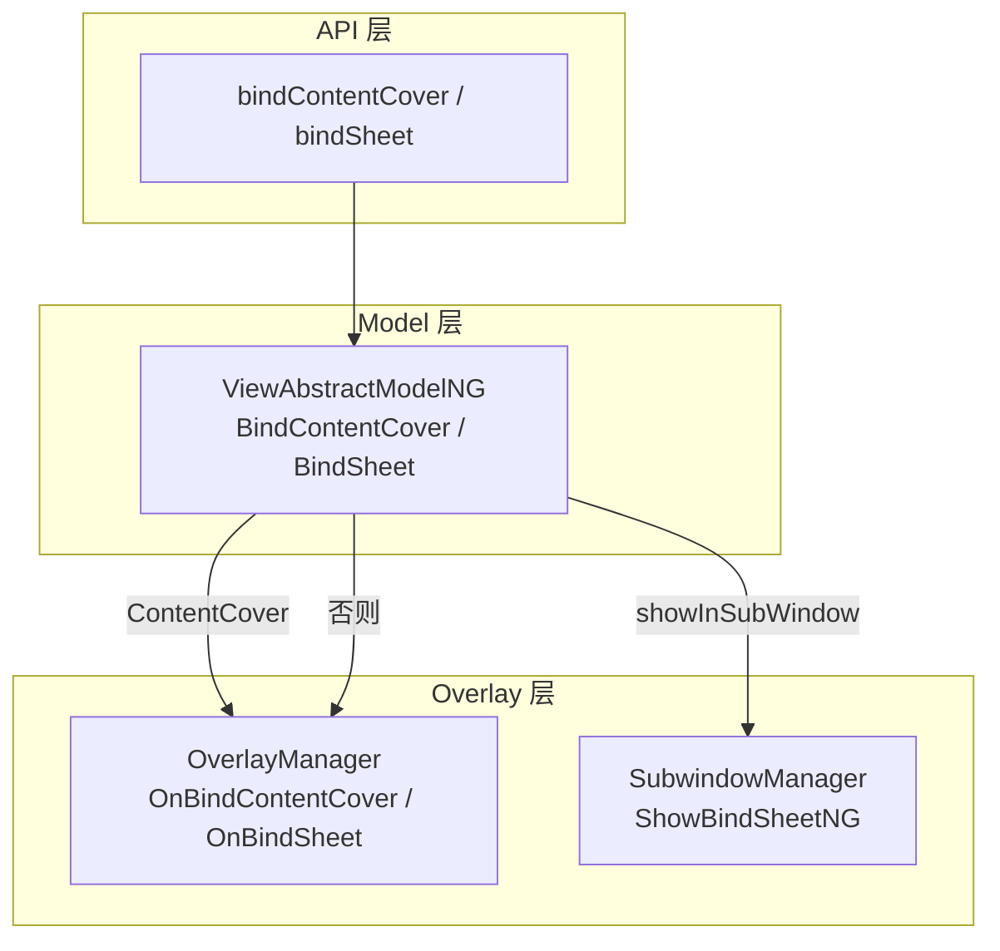

# 架构设计

> 模态属性是 ArkUI 通用属性层中用于将 bindSheet/bindContentCover 等模态浮层绑定到任意组件的通用属性方法集合。

## 设计元数据

| 字段 | 内容 |
|------|------|
| Design ID | DESIGN-Func-04-03-06 |
| 关联需求 | 已有能力补录（无独立 requirement.md） |
| 关联 Epic | 无 |
| 目标 Feature | Feat-01 模态属性 |
| 复杂度 | 中等 |
| 目标版本 | API 10 起支持，API 18/20 持续扩展 |
| Owner | ArkUI SIG |
| 状态 | Baselined（已有实现补录） |

## 需求基线

| 字段 | 内容 |
|------|------|
| 问题陈述 | 任意组件需要以通用属性形式绑定半模态(Sheet)与全模态(ContentCover)浮层，并支持双向 isShow 与过渡动画 |
| 核心目标 | （Feat-01）固化 bindSheet/bindContentCover 的通用属性绑定行为、双向 isShow、ModalTransition 选择与 attributeModifier 限制 |
| P0 AC | AC-1.1~1.5（bindContentCover）、AC-2.1~2.5（bindSheet） |

> 注：bindSheet 的完整组件行为详见 05-07-01，bindContentCover 的完整组件行为详见 05-07-02。本规格聚焦通用属性维度的绑定与约束。

## 上下文和现状

### 涉及仓和模块

| 仓库 | 模块路径 | 当前职责 | 本 Feature 影响 |
|------|----------|----------|-----------------|
| ace_engine | `frameworks/core/components_ng/base/view_abstract_model_ng.cpp` | BindContentCover/BindSheet Model 层 | 全量涉及 |
| ace_engine | `frameworks/core/components_ng/pattern/overlay/overlay_manager.cpp` | OnBindContentCover/OnBindSheet 挂载 | 全量涉及 |
| ace_engine | `frameworks/bridge/declarative_frontend/jsview/js_popups.cpp` | JsBindContentCover/JsBindSheet 桥接 | 全量涉及 |

### 调用链层级分析

| 层 | 模块 | 职责 | 修改类型 |
|----|------|------|----------|
| JS Bridge | `js_popups.cpp:2385-2435` | JsBindContentCover 解析 isShow/builder/options | 无修改（规格补录） |
| JS Bridge | `js_popups.cpp:2512-2559` | JsBindSheet 解析 isShow/builder/SheetStyle | 无修改（规格补录） |
| JS Bridge | `js_popups.cpp:2491-2510` | ParseSheetIsShow 双向绑定解析 | 无修改（规格补录） |
| Model | `view_abstract_model_ng.cpp:1125-1156` | BindContentCover 分发 | 无修改（规格补录） |
| Model | `view_abstract_model_ng.cpp:1226-1283` | BindSheet 分发与子窗路由 | 无修改（规格补录） |
| Overlay | `overlay_manager.cpp:3211-3259` | OnBindContentCover 创建/更新/弹出 | 无修改（规格补录） |
| Overlay | `overlay_manager.cpp:3591-3635` | BindSheet 延迟到下一帧执行 | 无修改（规格补录） |

### 适用架构规则

| 规则 ID | 设计结论 |
|---------|----------|
| OH-ARCH-01 | 模态属性以通用属性形式挂载，通过 OverlayManager modalStack_/sheetMap_ 集中管理 |
| OH-ARCH-02 | isShow 双向绑定支持 $ 与 !! (API>=18) |
| OH-ARCH-03 | attributeModifier 场景禁止调用 bindSheet/bindContentCover |

## 不涉及项承接

| 维度 | 结论 |
|------|------|
| 性能 | N/A — 绑定为一次性注册 |
| 安全与权限 | N/A |
| 兼容性 | 展开设计 — API 10/18/20 版本差异 |
| 构建与部件 | N/A |

## 关键设计决策

| 决策 ID | 问题 | 推荐方案 | 探索过的替代方案 | 取舍理由 | 影响 |
|---------|------|----------|------------------|----------|------|
| ADR-1 | isShow 双向绑定语法 | $ since 10, !! since 18 | 统一 $ | !! 支持非空断言更严格 | 版本间语法差异 |
| ADR-2 | ModalTransition 默认值 | DEFAULT(slide) | NONE | 默认提供过渡动画 | 可通过 options 覆盖 |
| ADR-3 | transition 与 modalTransition 优先级 | transition(TransitionEffect) 覆盖 modalTransition | 报错 | 允许自定义过渡 | 两者同时设置时 modalTransition 无效 |
| ADR-4 | bindSheet 执行时机 | 通过 AddAnimationClosure 延迟到下一帧 | 同步执行 | 确保 UI 状态稳定后再显示 | sheet 显示有延迟 |
| ADR-5 | attributeModifier 限制 | 禁止在 attributeModifier 中调用 | 允许 | attributeModifier 场景无 ViewStackProcessor 上下文 | 抛 100201 错误 |

## 设计骨架

### 骨架范围

| 骨架项 | 目标 | 不包含 | 验证方式 |
|--------|------|--------|----------|
| bindContentCover | isShow/builder/options 绑定 | ContentCover 内部布局 | 代码审查 |
| bindSheet | isShow/builder/SheetStyle 绑定 | Sheet 内部布局 | 代码审查 |
| 双向 isShow | $ 与 !! 解析 | — | 代码审查 |

### 骨架 Spec 拆分

| Task ID | 目标 | 受影响文件 | AC |
|---------|------|------------|-----|
| TASK-1 | bindContentCover 通用属性行为 | `view_abstract_model_ng.cpp:1125-1156` | AC-1.1~1.5 |
| TASK-2 | bindSheet 通用属性行为 | `view_abstract_model_ng.cpp:1226-1283` | AC-2.1~2.5 |

## 后续 Task 拆分

| Task ID | 目标 | 受影响文件 | 依赖 |
|---------|------|------------|------|
| TASK-1 | 模态属性全部行为规格 | Feat-01-modal-attributes-spec.md | 无 |

## API 签名、Kit 与权限

### 新增 API

| API 签名 | 类型 | d.ts 位置 | 权限要求 | SysCap |
|----------|------|-----------|----------|--------|
| `bindContentCover(isShow, builder, type?: ModalTransition): T` | Public | `common.d.ts:23199` | - | ArkUI |
| `bindContentCover(isShow, builder, options?: ContentCoverOptions): T` | Public | `common.d.ts:23218` | - | ArkUI |
| `bindSheet(isShow, builder, options?: SheetOptions): T` | Public | `common.d.ts:23239` | - | ArkUI |

### 变更/废弃 API

| 原有 API | 变更类型 | 新 API | 迁移说明 |
|----------|----------|--------|----------|
| — | — | — | 无变更/废弃 API |

## 构建系统影响

### BUILD.gn 变更

无变更。

### bundle.json 变更

无变更。

## 可选设计扩展

### 架构图



### 数据流/控制流

| 步骤 | 调用方 | 被调用方 | 数据/接口 | 说明 |
|------|--------|----------|-----------|------|
| 1 | ArkTS | JsBindContentCover | isShow + builder + options | ParseSheetIsShow 双向 |
| 2 | JsBindContentCover | ViewAbstractModelNG::BindContentCover | ModalStyle + callback | 创建/更新 modal 节点 |
| 3 | ViewAbstractModelNG | OverlayManager::BindContentCover | targetId + buildNodeFunc | 挂载到 modalStack_ |
| 4 | ArkTS | JsBindSheet | isShow + builder + SheetStyle | ParseSheetIsShow 双向 |
| 5 | JsBindSheet | ViewAbstractModelNG::BindSheet | SheetStyle + buildNodeFunc | 子窗或 Overlay 路由 |
| 6 | ViewAbstractModelNG | OverlayManager::BindSheet | bindSheetTask 闭包 | AddAnimationClosure 延迟执行 |

### 数据模型设计

```typescript
interface ContentCoverOptions extends BindOptions {
    modalTransition?: ModalTransition;  // DEFAULT
    onWillDismiss?: Callback<DismissContentCoverAction>;
    transition?: TransitionEffect;
    enableSafeArea?: boolean;  // false
}
interface SheetOptions extends BindOptions { /* 详见 05-07-01 */ }
```

## 详细设计

### bindContentCover 通用属性流程

**入口**: `ViewAbstractModelNG::BindContentCover` (`view_abstract_model_ng.cpp:1125-1156`)

1. 获取 targetNode from ViewStackProcessor
2. buildNodeFunc 通过 ScopedViewStackProcessor 构建
3. 注册销毁回调 overlayManager->DeleteModal(id) tagged V2::MODAL_PAGE_TAG
4. 分发 overlayManager->BindContentCover(targetId, isShow, buildNodeFunc, ...)

### bindSheet 通用属性流程

**入口**: `ViewAbstractModelNG::BindSheet` (`view_abstract_model_ng.cpp:1226-1283`)

1. 解析 instanceId（sheetStyle.instanceId 或 Container::CurrentId）
2. buildNodeFunc/buildTitleNodeFunc 通过 ScopedViewStackProcessor 构建
3. showInPage → sheetModifier->findPageNodeOverlay（嵌入式）
4. showInSubWindow → SubwindowManager::ShowBindSheetNG
5. 否则 → overlayManager->BindSheet（通过 AddAnimationClosure 延迟到下一帧）

### 双向 isShow 解析

**入口**: `ParseSheetIsShow` (`js_popups.cpp:2491-2510`)

1. boolean → isShow
2. object → changeEvent 双向绑定 或 $value (API>=18)

## 风险和开放问题

| 项 | 类型 | 影响 | 处理方式 | Owner |
|----|------|------|----------|-------|
| attributeModifier 禁止调用 | 行为 | 高 | 抛 100201 错误 | ArkUI SIG |
| transition 覆盖 modalTransition | 兼容性 | 中 | 在规格中标注 | ArkUI SIG |
| bindSheet 延迟执行 | 行为 | 中 | 文档化 AddAnimationClosure 延迟 | ArkUI SIG |
| !! 双向绑定 API>=18 | 兼容性 | 低 | 兼容性声明标注 | ArkUI SIG |

## 设计审批

- [x] 需求基线已确认
- [x] 不涉及项已承接
- [x] 涉及仓和模块职责清楚
- [x] 适用架构规则已识别
- [x] API 变更有签名说明
- [x] BUILD.gn/bundle.json 影响明确
- [x] 关键设计决策有理由和影响说明
- [x] 风险和开放问题有 Owner

**结论:** 通过（已有实现补录）
