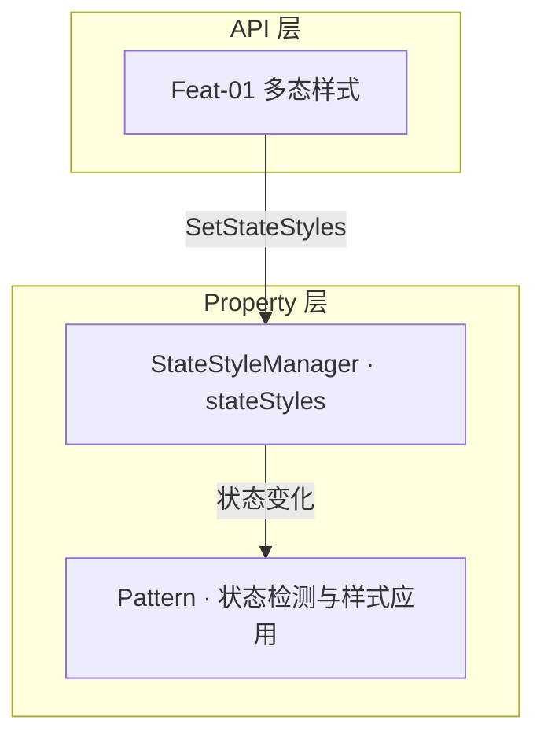
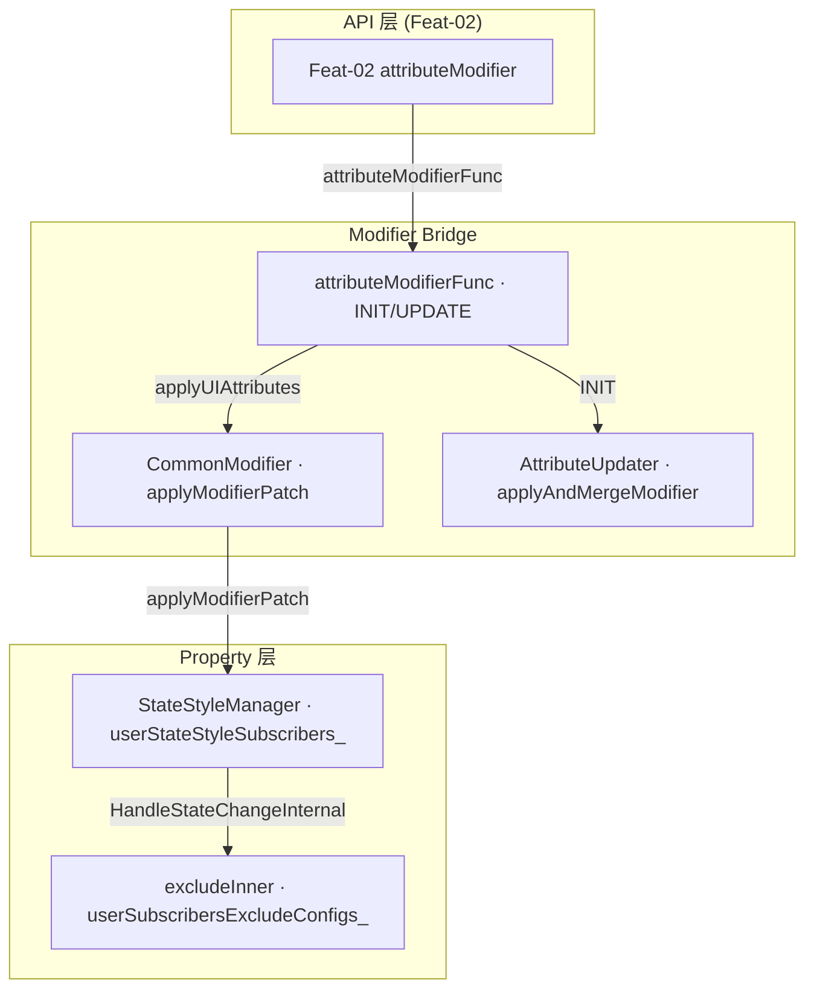
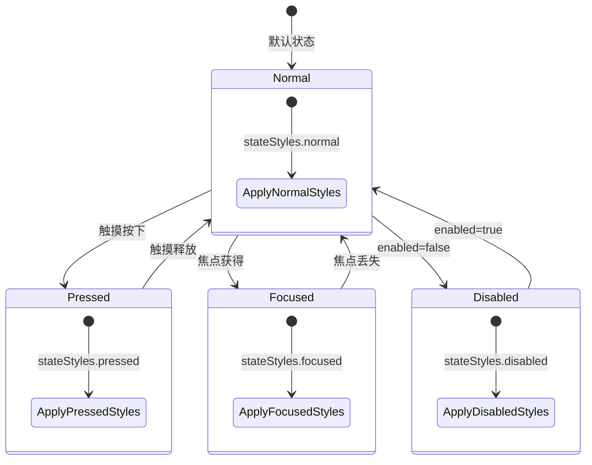

# 架构设计

> 样式属性功能域的架构设计文档，补录已有实现。

## 设计元数据

| 字段 | 内容 |
|------|------|
| Design ID | DESIGN-Func-04-03-07 |
| 关联需求 | 已有能力补录（无独立 requirement.md） |
| 关联 Epic | 无 |
| 目标 Feature | Feat-01 多态样式, Feat-02 动态属性设置（attributeModifier） |
| 复杂度 | 中等 |
| 目标版本 | API 8 起支持；Feat-02 的 C-API 扩展自 API 20 |
| Owner | ArkUI SIG |
| 状态 | Baselined |

## 需求基线

| 项 | 内容 |
|----|------|
| 问题陈述 | 开发者需要通过声明式 API 为组件的不同交互状态定义并切换属性组合 |
| 核心目标 | （Feat-01）提供 `stateStyles` 多态样式能力，支持 Normal/Pressed/Focused/Disabled/Selected/Hovered 状态样式；（Feat-02）提供 attributeModifier 动态属性设置能力 |
| P0 AC | （Feat-01）`stateStyles` 按状态应用样式覆盖；（Feat-02）attributeModifier 按状态回调修改属性，excludeInner 抑制系统默认样式 |

## 上下文和现状

### 涉及仓和模块

| 仓库 | 模块/路径 | 当前职责 | 本 Feature 影响 |
|------|-----------|----------|-----------------|
| ace_engine | `frameworks/core/components_ng/pattern/pattern.cpp` | Pattern 处理 stateStyles 状态切换和样式应用 | 多态样式管线 |
| ace_engine | `frameworks/core/components_ng/event/state_style_manager.h/cpp` | StateStyleManager 管理 stateStyles 状态回调，按组件状态切换样式 | 状态切换核心 |
| ace_engine | `frameworks/core/components_ng/base/view_abstract.h/cpp` | `stateStyles` 框架 API 入口 | API 层 |
| ace_engine | `frameworks/bridge/declarative_frontend/jsview/js_view_abstract.cpp` | ArkTS 桥接层，JsStateStyles 参数解析 | 输入校验 |
| ace_engine | `frameworks/bridge/declarative_frontend/ark_component/src/ArkComponent.ts` | attributeModifierFunc 生命周期管理 + applyUIAttributesInit 状态注册 | attributeModifier ArkTS 层 |
| ace_engine | `frameworks/bridge/declarative_frontend/ark_modifier/src/modifier_utilities.ts` | AttributeUpdater INIT/UPDATE 生命周期 + applyAndMergeModifier | attributeModifier 更新机制 |
| ace_engine | `frameworks/core/interfaces/native/node/node_api.cpp` | SetSupportedUIState/AddSupportedUIState C-API 入口 | C-API 状态注册 |
| ace_engine | `frameworks/core/interfaces/native/node/frame_node_modifier.cpp` | OH_ArkUI_AddSupportedUIStates C-API 桥接 | C-API 状态样式 |

### 调用链层级分析

| 层 | 模块 | 职责 | 修改类型 |
|----|------|------|----------|
| JS Bridge | `declarative_frontend/jsview/js_view_abstract` | 解析 ArkTS `stateStyles` 属性调用并校验参数 | 存量分析（Feat-01） |
| ArkTS Modifier Bridge | `declarative_frontend/ark_component/src/ArkComponent.ts` + `ark_modifier/src/modifier_utilities.ts` | attributeModifierFunc 生命周期管理；AttributeUpdater INIT/UPDATE；applyUIAttributesInit 注册 UIState 位掩码；applyModifierPatch 刷新到 native | 存量分析（Feat-02） |
| C-API Bridge | `core/interfaces/native/node/frame_node_modifier.cpp` + `node_api.cpp` | OH_ArkUI_AddSupportedUIStates 注册状态回调 + excludeInner 参数 | 存量分析（Feat-02） |
| API 层 | `core/components_ng/base/view_abstract` | `stateStyles` 框架属性设置入口，更新 Pattern/StateStyleManager | 存量分析（Feat-01） |
| Property 层 (状态) | `core/components_ng/event/state_style_manager` | StateStyleManager 管理 stateStyles 状态回调，按组件状态（normal/pressed/focused/disabled/selected/hovered）切换样式 | 存量分析 |

### 适用架构规则

| Rule ID | 适用原因 | 设计结论 | 验证方式 |
|---------|----------|----------|----------|
| OH-ARCH-LAYERING | 多态样式涉及 JS Bridge → API 层 → Property 层单向调用 | JS Bridge → Pattern/StateStyleManager，严格单向 | 代码评审 |

## 不涉及项承接

| 维度 | 需求阶段结论 | 设计阶段处理方式 | 设计结论 |
|------|---------|-------------|----------|
| IPC/跨进程 | N/A | 保持 N/A | 多态样式仅在 UI 线程内处理 |
| 安全与权限 | N/A | 保持 N/A | 无权限要求 |
| 构建与部件 | N/A | 保持 N/A | 无新增部件或 target |
| 兼容性 | 涉及 | 展开设计 | attributeModifier 与 stateStyles 在 ArkTS 层互斥 |
| API/SDK | 涉及 | 展开设计 | CommonMethod 接口 + C-API 双通道 |

## 关键设计决策

| 决策 ID | 问题 | 推荐方案 | 探索过的替代方案 | 取舍理由 | 影响 |
|---------|------|----------|-----------------|------|------|
| ADR-1 | stateStyles 状态样式覆盖链 | StateStyleManager 按组件状态（normal/pressed/focused/disabled/selected/hovered）切换样式，由 Pattern 负责状态检测 | 方案A：布尔值开关（无法区分状态）；方案B：直接属性覆盖（无法按状态分组） | 状态样式按 6 种状态分组覆盖，开发者可精确控制不同交互状态的视觉表现 | stateStyles 切换时样式覆盖生效 |
| ADR-F2-1 | attributeModifier 与 stateStyles 互斥 | ArkTS 层 attributeModifier 与 stateStyles 互斥（stateStyles 在 modifier 上下文抛 BusinessError）；C++ 层两条 subscriber 路径可并存 | 方案A：完全互斥（C++ 层也禁止）；方案B：完全不互斥（ArkTS 层允许共存） | ArkTS 层互斥避免开发者困惑于两套机制叠加；C++ 层并存允许 C-API 用户灵活组合 | attributeModifier 使用 userStateStyleSubscribers_ 路径，stateStyles 使用 frontendSubscribers_ 路径 |
| ADR-F2-2 | excludeInner 抑制系统默认样式 | C-API excludeInner 参数允许 user 回调跳过 inner 回调，避免默认样式与自定义样式叠加 | 方案A：始终叠加（开发者无法去除默认效果）；方案B：完全替换 inner（过度抑制） | excludeInner 按状态粒度控制，开发者可精确选择哪些状态抑制默认效果 | excludeInner=true 时 HandleStateChangeInternal 跳过 inner 回调 |

## 设计骨架

### 骨架范围

| 骨架项 | 目标 | 不包含 | 验证方式 |
|--------|------|--------|----------|
| 多态样式管线 | stateStyles→ViewStackProcessor/StateStyleManager→Pattern | 各状态样式的具体属性值 | 状态切换时样式覆盖正确 |
| attributeModifier 多态样式管线 | attributeModifierFunc→CommonModifier, AttributeUpdater→applyAndMergeModifier, excludeInner→StateStyleManager | 完整 Modifier 机制（非多态样式部分不在本 Feat 范围） | 状态回调正确，excludeInner 生效 |

### 骨架 Spec 拆分

| Task ID | 目标 | 受影响文件 | AC |
|---------|------|------------|-----|
| TASK-SKELETON-1 | 多态样式属性存储与切换 | view_abstract.h, state_style_manager.h, pattern.cpp | WHEN stateStyles 设置 THEN 状态切换时样式覆盖正确 |
| TASK-SKELETON-2 | attributeModifier 多态样式注册与回调 | ark_component.ts, modifier_utilities.ts, state_style_manager.h | WHEN attributeModifier 设置 THEN 状态回调正确，excludeInner 生效 |

## 后续 Task 拆分

| Spec | 目的 | 依赖 | 输出 |
|------|------|------|------|
| baseline-design | 样式属性功能域设计基线 | 无 | 本 design.md |
| Feat-01-state-effect-spec.md | 固化 `stateStyles` 多态样式行为规格；交互反馈由 Func-04-03-04 承接 | 本 Design | 完整行为规格与 AC |
| Feat-02-attribute-modifier-spec.md | 固化 attributeModifier 多态样式 API 行为规格（仅多态样式相关，不含完整 Modifier 机制） | 本 Design | 完整行为规格与 AC |

---

## API 签名、Kit 与权限

### 新增 API

| API 签名 | 类型 | d.ts 位置 | 权限要求 | SysCap |
|----------|------|-----------|----------|--------|
| N/A | — | — | — | — |

> 本功能域为已有实现补录，不新增 API。

---

## 构建系统影响

### BUILD.gn 变更

```
无变更。样式属性实现位于 ace_core_ng，已有构建配置覆盖。
```

### bundle.json 变更

无变更。

## 可选设计扩展

### 架构图



#### attributeModifier 架构图（Feat-02）



### 数据流/控制流

| 步骤 | 调用方 | 被调用方 | 数据/接口 | 说明 |
|------|--------|----------|-----------|------|
| 1 | 开发者 ArkTS | JSViewAbstract::JsStateStyles | `StateStyle object` | 桥接层解析状态样式 |
| 2 | JSViewAbstract | ViewAbstract::SetStateStyles | `StateStyle` | 调用框架层 |
| 3 | ViewAbstract | Pattern::SetStateStyles | `StateStyle` | Pattern 按当前状态应用样式 |
| 4 | ArkTS modifierFunc | attributeModifierFunc | `AttributeModifier<T>` | 创建 CommonModifier(ModifierType.STATE)，注册 UIState 位掩码 |
| 5 | attributeModifierFunc | applyUIAttributesInit | `UIState bitmask` | 注册 supportedStates_，设置 frontendSubscribers_ |
| 6 | attributeModifierFunc | applyModifierPatch | `dirty attrs` | 刷新属性到 native node |
| 7 | C-API | OH_ArkUI_AddSupportedUIStates | `state + handler + excludeInner` | AddSupportedUIStateWithCallback 注册 user 回调 + excludeInner 配置 |

### 算法与状态机

#### stateStyles 状态切换



## 详细设计

### 多态样式

#### stateStyles 状态样式覆盖链

stateStyles 提供六种状态下的样式覆盖：

| 状态 | 属性键 | 说明 |
|------|--------|------|
| normal | .normal | 默认状态样式 |
| pressed | .pressed | 按压状态样式 |
| focused | .focused | 焦点状态样式 |
| disabled | .disabled | 禁用状态样式 |
| selected | .selected | 选中状态样式 |
| hovered | .hovered | 悬停状态样式 |

stateStyles 在组件状态变化时自动切换样式，由 Pattern 负责状态检测和样式应用。`hoverEffect` 与 `clickEffect` 的输入分发和视觉反馈设计由 Func-04-03-04 承接，不属于本功能域。

### attributeModifier 多态样式（Feat-02）

#### attributeModifierFunc 生命周期

attributeModifierFunc 区分 AttributeUpdater（INIT/UPDATE）和普通 AttributeModifier 两种处理路径：

| 生命周期 | 调用链 | 说明 |
|----------|--------|------|
| INIT (首次) | initializeModifier → applyNormalAttribute → applyUIAttributesInit → applyModifierPatch | 注册 supportedStates_，初始属性设置 |
| UPDATE (动态) | onComponentChanged → applyNormalAttribute → applyUIAttributes → applyModifierPatch | 重新应用属性，刷新到 native |
| 普通 Modifier | applyNormalAttribute → applyUIAttributes → applyModifierPatch | 无生命周期管理 |

#### excludeInner 抑制机制

HandleStateChangeInternal 状态回调优先级链：

| 优先级 | subscriber 类型 | 条件 | 说明 |
|--------|----------------|------|------|
| 1 | inner | IsExcludeInner(state) == false | 系统默认状态样式 |
| 2 | frontend | skipFrontendForcibly == false | stateStyles ArkTS 重渲染 |
| 3 | user | 始终执行 | attributeModifier / C-API 回调 |

---

## 风险和开放问题

| 项 | 类型 | 影响 | 处理方式 | Owner |
|----|------|------|----------|-------|
| attributeModifier 与 stateStyles ArkTS 层互斥 | 行为 | 中 | stateStyles 在 modifier 上下文抛 BusinessError(100201)，C++ 层两条路径可并存 | ArkUI SIG |
| excludeInner=false 时 inner+user 效果叠加 | 行为 | 低 | 开发者可能期望仅自定义效果，需文档标注 | ArkUI SIG |

---

## 设计审批

- [ ] 需求基线已确认
- [ ] 涉及仓和模块职责清楚
- [ ] 调用链层级分析完整
- [ ] 适用架构规则已识别

**结论:** 待审批（Draft）
