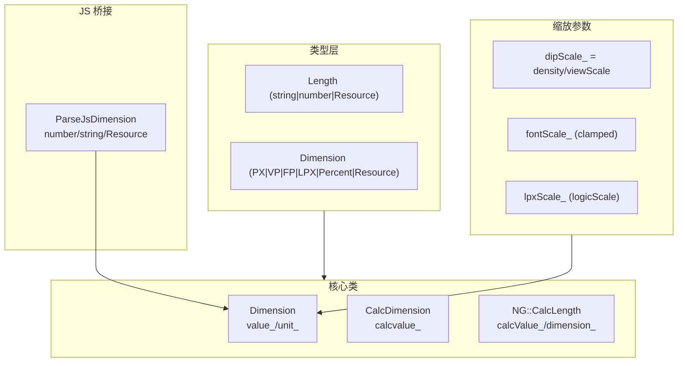

# 架构设计

> 基础单位是 ArkUI 通用属性层的度量单位体系，定义 vp/fp/px/lpx/percent/Dimension/Length/CalcDimension 类型与资源解析机制。

## 设计元数据

| 字段 | 内容 |
|------|------|
| Design ID | DESIGN-Func-04-03-08 |
| 关联需求 | 已有能力补录（无独立 requirement.md） |
| 关联 Epic | 无 |
| 目标 Feature | Feat-01 基础单位 |
| 复杂度 | 中等 |
| 目标版本 | API 7 起支持，API 10 模板字面量类型引入 |
| Owner | ArkUI SIG |
| 状态 | Baselined（已有实现补录） |

## 需求基线

| 字段 | 内容 |
|------|------|
| 问题陈述 | ArkUI 需要统一的度量单位体系，支持 vp/fp/px/lpx/percent 多单位与 $r 资源解析，并处理 DPI/字体缩放 |
| 核心目标 | （Feat-01）固化 Dimension/DimensionUnit 类型、单位换算公式、资源解析与字体缩放钳位行为 |
| P0 AC | AC-1.1~1.6（单位换算）、AC-2.1~2.4（Dimension 构造）、AC-3.1~3.4（资源解析）、AC-4.1~4.3（字体缩放）、AC-5.1~5.2（CalcDimension） |

## 上下文和现状

### 涉及仓和模块

| 仓库 | 模块路径 | 当前职责 | 本 Feature 影响 |
|------|----------|----------|-----------------|
| ace_engine | `interfaces/inner_api/ace_kit/include/ui/base/geometry/dimension.h` | Dimension 类与 DimensionUnit 枚举 | 全量涉及 |
| ace_engine | `frameworks/base/geometry/dimension.cpp` | 单位换算实现 | 全量涉及 |
| ace_engine | `interfaces/inner_api/ace_kit/include/ui/base/geometry/calc_dimension.h` | CalcDimension(CALC 表达式) | 全量涉及 |
| ace_engine | `interfaces/inner_api/ace_kit/include/ui/properties/ng/calc_length.h` | NG::CalcLength | 全量涉及 |
| ace_engine | `frameworks/core/pipeline/pipeline_base.h/.cpp` | DPI/字体缩放参数 | 全量涉及 |
| ace_engine | `frameworks/bridge/declarative_frontend/jsview/js_view_abstract.cpp` | ParseJsDimension 系列 | 全量涉及 |

### 调用链层级分析

| 层 | 模块 | 职责 | 修改类型 |
|----|------|------|----------|
| Inner API | `dimension.h:34-75` | DimensionUnit 枚举(INVALID/NONE/PX/VP/FP/PERCENT/LPX/AUTO/CALC) | 无修改（规格补录） |
| Inner API | `dimension.h:81-375` | Dimension 类(value_/unit_/ConvertToPx/Vp/Fp/NormalizeToPx/FromString) | 无修改（规格补录） |
| 实现 | `dimension.cpp:28-83` | CalcDimensionNone/Px/Percent/Vp/Fp/Lpx 换算 | 无修改（规格补录） |
| Inner API | `calc_dimension.h` | CalcDimension(calcvalue_ CALC 单位) | 无修改（规格补录） |
| Inner API | `calc_length.h:104` | NG::CalcLength(calcValue_/dimension_) | 无修改（规格补录） |
| Pipeline | `pipeline_base.h:1700-1705` | fontScale_/dipScale_/density_/viewScale_ | 无修改（规格补录） |
| Pipeline | `pipeline_base.cpp:552-561` | dipScale = density / viewScale | 无修改（规格补录） |
| JS Bridge | `js_view_abstract.cpp:6707-6878` | ParseJsDimension/ParseJsDimensionNG/ParseJsLengthNG/Vp/Fp/Px | 无修改（规格补录） |
| JS Bridge | `js_view_abstract.cpp:6439-6573` | ParseDollarResource/CompleteResourceObject | 无修改（规格补录） |

### 适用架构规则

| 规则 ID | 设计结论 |
|---------|----------|
| OH-ARCH-01 | 单位换算通过 Dimension::ConvertToPx/Vp/Fp 集中实现 |
| OH-ARCH-02 | DPI 缩放由 Pipeline 集中管理(dipScale/fontScale/viewScale) |
| OH-ARCH-03 | 资源解析通过 ParseJsDimension 系列统一处理 number/string/Resource |

## 不涉及项承接

| 维度 | 结论 |
|------|------|
| 性能 | N/A — 换算为 O(1) |
| 安全与权限 | N/A |
| 兼容性 | 展开设计 — API 7/10 版本差异(模板字面量类型) |
| 构建与部件 | N/A |

## 关键设计决策

| 决策 ID | 问题 | 推荐方案 | 探索过的替代方案 | 取舍理由 | 影响 |
|---------|------|----------|------------------|----------|------|
| ADR-1 | FP 换算公式 | value * fpScale * vpScale (FP = VP * fontScale) | value * fontScale | FP 同时受字体与密度影响 | 与 VP 换算结果不同 |
| ADR-2 | PERCENT 换算依赖 | value * parentLength | value / 100 | 需父容器尺寸上下文 | NormalizeToPx 需 parentLength 参数 |
| ADR-3 | 字体缩放钳位 | std::clamp(fontScale, 0, maxAppFontScale) | 不钳位 | 防止过大字体破坏布局 | maxAppFontScale 默认 INT32_MAX |
| ADR-4 | Dimension 默认单位 | PX (value=0.0, unit=PX) | VP | 与物理像素对齐 | FromString 默认 FP |
| ADR-5 | dipScale 计算 | density / viewScale | density | viewScale 适配预览器 | 预览器与设备一致 |
| ADR-6 | CALC 单位 | CalcDimension.calcvalue_ 存储表达式字符串 | 解析为数值 | 支持 calc() 表达式 | CalcLength::NormalizeToPx 支持 RPN |

## 设计骨架

### 骨架范围

| 骨架项 | 目标 | 不包含 | 验证方式 |
|--------|------|--------|----------|
| Dimension | value_/unit_ + ConvertToPx/Vp/Fp | 布局算法 | 代码审查 |
| DimensionUnit | 枚举 INVALID..CALC | — | 代码审查 |
| ParseJsDimension | number/string/Resource 解析 | 布局属性 | 代码审查 |

### 骨架 Spec 拆分

| Task ID | 目标 | 受影响文件 | AC |
|---------|------|------------|-----|
| TASK-1 | 单位换算 | `dimension.cpp:28-83` | AC-1.1~1.6 |
| TASK-2 | Dimension 构造与默认 | `dimension.h:81-375` | AC-2.1~2.4 |
| TASK-3 | 资源解析 | `js_view_abstract.cpp:6439-6573` | AC-3.1~3.4 |
| TASK-4 | 字体缩放 | `pipeline_base.h:1700-1705` | AC-4.1~4.3 |
| TASK-5 | CalcDimension/CalcLength | `calc_dimension.h`/`calc_length.h` | AC-5.1~5.2 |

## 后续 Task 拆分

| Task ID | 目标 | 受影响文件 | 依赖 |
|---------|------|------------|------|
| TASK-1 | 基础单位全部行为规格 | Feat-01-basic-units-spec.md | 无 |

## API 签名、Kit 与权限

### 新增 API

| API 签名 | 类型 | d.ts 位置 | 权限要求 | SysCap |
|----------|------|-----------|----------|--------|
| `type Length = string \| number \| Resource` | Public | `units.d.ts:94` | - | ArkUI |
| `type Dimension = PX \| VP \| FP \| LPX \| Percentage \| Resource` | Public | `units.d.ts:347` | - | ArkUI |
| `type VP = \`${number}vp\` \| number` | Public | `units.d.ts:172` | - | ArkUI |
| `type FP = \`${number}fp\`` | Public | `units.d.ts:211` | - | ArkUI |
| `type PX = \`${number}px\`` | Public | `units.d.ts:133` | - | ArkUI |
| `type LPX = \`${number}lpx\`` | Public | `units.d.ts:250` | - | ArkUI |

### 变更/废弃 API

| 原有 API | 变更类型 | 新 API | 迁移说明 |
|----------|----------|--------|----------|
| — | — | — | 无变更/废弃 API |

## 构建系统影响

### BUILD.gn 变更

无变更。

### bundle.json 变更

无变更。

## 可选设计扩展

### 架构图



### 数据流/控制流

| 步骤 | 调用方 | 被调用方 | 数据/接口 | 说明 |
|------|--------|----------|-----------|------|
| 1 | ArkTS | ParseJsDimension | number/string/Resource | 解析为 CalcDimension |
| 2 | Dimension | ConvertToPx | dipScale/fontScale/lpxScale | 按单位换算为 px |
| 3 | Dimension | NormalizeToPx | vpScale/fpScale/lpxScale/parentLength | 布局前归一化 |
| 4 | Pipeline | OnSurfaceDensityChanged | density | 更新 dipScale_ |

### 数据模型设计

```cpp
enum class DimensionUnit { INVALID=-2, NONE=-1, PX=0, VP, FP, PERCENT, LPX, AUTO, CALC };
class Dimension {
    double value_ = 0.0;
    DimensionUnit unit_ = DimensionUnit::PX;
    double ConvertToPx();   // VP→value*dipScale; FP→value*fontScale*dipScale; LPX→value*logicScale
    double ConvertToVp();
    double ConvertToFp();
};
class CalcDimension : public Dimension { std::string calcvalue_; };
class CalcLength { std::string calcValue_; Dimension dimension_; };
```

## 详细设计

### 单位换算公式

**入口**: `Dimension::ConvertToPx` (`dimension.h:209-230`) + `dimension.cpp:28-83`

| 单位 | 公式 | 说明 |
|------|------|------|
| PX / NONE | value (raw px) | 物理像素 |
| VP | value * dipScale | 密度无关像素 |
| FP | value * fpScale * vpScale | VP * fontScale (钳位) |
| LPX | value * lpxScale (logicScale) | 逻辑像素 |
| PERCENT | value * parentLength | 需父容器尺寸 |

### Dimension 默认值与构造

- `Dimension()` → value 0.0, unit PX (`dimension.h:94`)
- `FromString` 空字符串/未知单位 → 默认 FP (`dimension.h:428`)
- `%` 值除以 100 (`dimension.h:443`)

### 字体缩放钳位

**入口**: `pipeline_base.h:1700-1705`

- `fontScale_ = 1.0f` 默认
- `maxAppFontScale_ = INT32_MAX` 默认
- `std::clamp(fontScale, 0.0f, maxAppFontScale_)` (`dimension.cpp` 各 ConvertTo* 中)

### 资源解析

**入口**: `ParseJsDimension` (`js_view_abstract.cpp:6739-6782`)

1. Number → CalcDimension(num, defaultUnit)
2. String → StringUtils::StringToCalcDimension
3. Object → CompleteResourceObjectInner 解析 $r 资源

### CalcDimension 与 CalcLength

- CalcDimension (`calc_dimension.h`): calcvalue_ 存储 CALC 表达式
- CalcLength (`calc_length.h:104`): calcValue_ + dimension_，支持 RPN 表达式 NormalizeToPx

## 风险和开放问题

| 项 | 类型 | 影响 | 处理方式 | Owner |
|----|------|------|----------|-------|
| FromString 默认 FP 而非 PX | 兼容性 | 中 | 在规格中标注 | ArkUI SIG |
| ConvertTo* pipeline 为 null 返回 0.0 | 异常 | 中 | 在规格中标注 | ArkUI SIG |
| PERCENT 需 parentLength 上下文 | 架构 | 中 | NormalizeToPx 需显式传入 | ArkUI SIG |
| maxAppFontScale 默认 INT32_MAX | 行为 | 低 | 可被系统属性覆盖 | ArkUI SIG |

## 设计审批

- [x] 需求基线已确认
- [x] 不涉及项已承接
- [x] 涉及仓和模块职责清楚
- [x] 适用架构规则已识别
- [x] API 变更有签名说明
- [x] BUILD.gn/bundle.json 影响明确
- [x] 关键设计决策有理由和影响说明
- [x] 风险和开放问题有 Owner

**结论:** 通过（已有实现补录）
