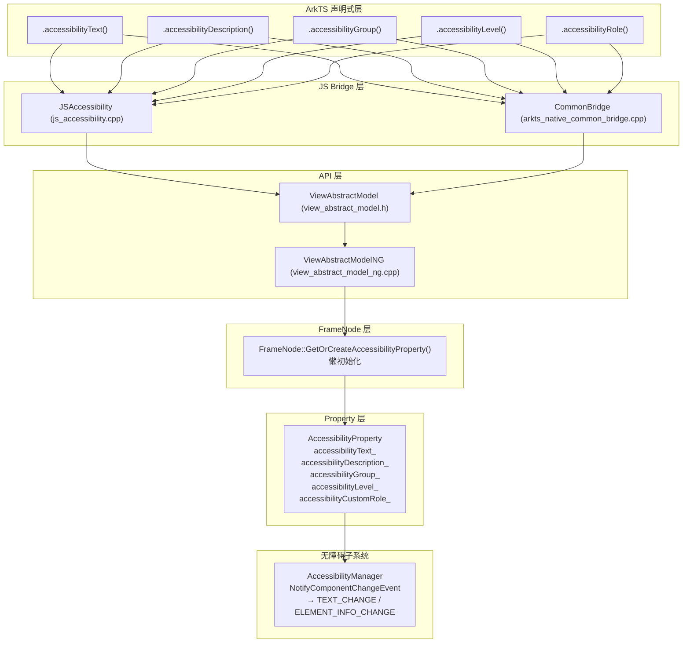

# 架构设计

> 无障碍属性功能域的架构设计文档，补录已有实现。

## 设计元数据

| 字段 | 内容 |
|------|------|
| Design ID | DESIGN-Func-04-03-09 |
| 关联需求 | 已有能力补录（无独立 requirement.md） |
| 关联 Epic | 无 |
| 目标 Feature | Feat-01 基础无障碍属性, Feat-02 无障碍焦点与导航, Feat-03 无障碍组选项与状态, Feat-04 无障碍动作与虚拟节点, Feat-05 Span无障碍与C-API |
| 复杂度 | 标准 |
| 目标版本 | API 10 (accessibilityText), API 12 (accessibilityGroup), API 18 (accessibilityRole) — Public Static 统一为 API 23 |
| Owner | ArkUI SIG |
| 状态 | Baselined（已有实现补录） |

## 需求基线

| 项 | 内容 |
|----|------|
| 问题陈述 | 开发者需要通过声明式 API 为组件设置无障碍属性，以便屏幕阅读器等无障碍服务能够正确识别和播报组件内容 |
| 核心目标 | （Feat-01）提供 accessibilityText/accessibilityDescription/accessibilityGroup/accessibilityLevel/accessibilityRole 五个核心无障碍属性，支持无障碍文本播报、描述补充、分组聚合、可见性控制和角色语义标注 |
| P0 AC | 所有组件均可设置无障碍属性；设置后无障碍服务能正确获取文本/描述/角色；分组后子组件文本正确聚合；级别控制正确影响无障碍树遍历 |

## 上下文和现状

### 涉及仓和模块

| 仓库 | 模块/路径 | 当前职责 | 本 Feature 影响 |
|------|-----------|----------|-----------------|
| ace_engine | `frameworks/core/components_ng/property/accessibility_property.h/cpp` | 存储所有无障碍属性值，事件通知机制 | 核心数据结构 |
| ace_engine | `frameworks/core/components_ng/base/frame_node.h/cpp` | FrameNode 持有 AccessibilityProperty 并懒初始化 | 属性持有者 |
| ace_engine | `frameworks/core/components_ng/base/view_abstract_model.h` | 抽象模型接口声明（SetAccessibility*） | API 接口 |
| ace_engine | `frameworks/core/components_ng/base/view_abstract_model_ng.h/cpp` | NG 模型实现，路由到 AccessibilityProperty | API 实现 |
| ace_engine | `frameworks/bridge/declarative_frontend/jsview/js_accessibility.cpp` | 声明式 JS 桥接，参数解析与校验 | 输入校验 |
| ace_engine | `frameworks/bridge/declarative_frontend/engine/jsi/nativeModule/arkts_native_common_bridge.cpp` | Native 桥接（Static API） | 多语言入口 |
| ace_engine | `frameworks/core/accessibility/accessibility_utils.cpp` | 角色枚举到字符串的映射 | 角色映射 |
| ace_engine | `interfaces/inner_api/ace_kit/include/ui/accessibility/accessibility_constants.h` | AccessibilityRoleType 枚举定义 | 类型定义 |
| interface_sdk-js | `api/arkui/component/common.static.d.ets` | Public Static API 类型定义 | 类型定义 |
| interface_sdk-js | `api/@internal/component/ets/common.d.ts` | Internal API 类型定义（含版本历史） | 类型定义 |

### 调用链层级分析

| 层 | 模块 | 职责 | 修改类型 |
|----|------|------|----------|
| JS Bridge (声明式) | `declarative_frontend/jsview/js_accessibility` | 解析 ArkTS 属性调用（JsAccessibilityText/JsAccessibilityDescription/JsAccessibilityGroup/JsAccessibilityLevel/JsAccessibilityRole），参数校验、JSON 侧信道解析、枚举值映射 | 存量分析 |
| JS Bridge (Native) | `declarative_frontend/engine/jsi/nativeModule/arkts_native_common_bridge` | Native 桥接，接收节点指针+参数值，调用 CommonModifier 设置属性 | 存量分析 |
| API 层 | `core/components_ng/base/view_abstract` | 框架属性设置统一入口（SetAccessibilityText/SetAccessibilityDescription/SetAccessibilityGroup/SetAccessibilityImportance/SetAccessibilityRole），路由到 AccessibilityProperty | 存量分析 |
| Property 层 | `core/components_ng/property/accessibility_property` | 存储无障碍属性值（accessibilityText_/accessibilityDescription_/accessibilityGroup_/accessibilityLevel_/accessibilityCustomRole_），值去重、白名单校验、事件通知 | 存量分析 |
| FrameNode 层 | `core/components_ng/base/frame_node` | 懒初始化 AccessibilityProperty（GetOrCreateAccessibilityProperty），通过 pattern_->CreateAccessibilityProperty() 创建子类实例 | 存量分析 |
| 无障碍子系统 | `core/accessibility/accessibility_manager` | 消费 AccessibilityProperty 值，构建无障碍树节点信息，与无障碍服务通信 | 存量分析 |

### 适用架构规则

| Rule ID | 适用原因 | 设计结论 | 验证方式 |
|---------|----------|----------|----------|
| OH-ARCH-LAYERING | 无障碍属性涉及 JS Bridge → API → Property → FrameNode → 无障碍子系统单向调用 | 严格单向调用，无障碍属性不参与布局/渲染管线 | 代码评审/依赖检查 |
| OH-ARCH-API-LEVEL | accessibilityText @since 10, accessibilityGroup @since 12, accessibilityRole @since 18；Public Static 统一 @since 23 | SDK 版本标注差异见兼容性声明 | API 评审 |
| OH-ARCH-COMPONENT-BUILD | 无障碍属性属于 ace_core_ng，所有组件依赖 | 无需新增 BUILD.gn target | 构建验证 |

## 不涉及项承接

| 维度 | 设计结论 |
|------|----------|
| 性能 | 无障碍属性不触发 PROPERTY_UPDATE_* 标志，不影响布局/测量/渲染管线；仅通过事件通知无障碍子系统 |
| 安全与权限 | 无障碍属性无权限要求，字符串内容为应用内部使用 |
| 兼容性 | API 版本差异（Internal vs Public Static SDK @since 版本不同）需在兼容性声明中标注 |
| 构建与部件 | 无新增部件或 target |

## 关键设计决策

| 决策 ID | 问题 | 推荐方案 | 探索过的替代方案 | 取舍理由 | 影响 |
|---------|------|----------|-----------------|------|------|
| ADR-1 | 无障碍属性如何融入现有属性体系 | 独立于标准属性管线，使用事件通知机制（NotifyComponentChangeEvent）而非 PROPERTY_UPDATE_* 脏标记 | 方案A：纳入 LayoutProperty（增加 LayoutProperty 复杂度，无障碍属性与布局无关）；方案B：纳入 RenderProperty（导致不必要的渲染刷新） | 无障碍属性不驱动布局/渲染重算，独立存储+事件通知是最小侵入方案 | 无障碍属性变更不影响测量/布局/渲染性能 |
| ADR-2 | accessibilityLevel 非法值如何处理 | 白名单校验：仅接受 "yes"/"no"/"no-hide-descendants"，其余值（包括 "auto"）静默转为 "auto" | 方案A：抛异常（破坏链式调用）；方案B：接受所有字符串（语义不明确，可能导致无障碍树紊乱） | 静默回退到 "auto" 是最安全的兜底策略，避免应用因拼写错误导致无障碍树不可用 | "auto" 既是默认值也是非法值回退目标 |
| ADR-3 | accessibilityDescription 的 JSON 侧信道是否需要统一 | 声明式桥接支持 JSON 解析 `{$accessibilityDescription, $autoEventParam}`，Native 桥接不支持 | 方案A：Native 桥接也支持 JSON 解析（增加 Native 桥接复杂度）；方案B：移除 JSON 解析（破坏已有声明式应用） | 保持现状：JSON 侧信道是声明式历史遗留，Native 桥接保持简洁 | 双范式行为不对称，需在 API 文档中标注 |
| ADR-4 | accessibilityGroup 与 accessibilityLevel 的嵌套交互 | ancestorGroupFlag 机制：父节点为 Group 时，仅 accessibilityLevel("yes") 的子节点保持独立可搜索，其余合并入父 Group | 方案A：Group 不影响子节点搜索（语义弱，不符合屏幕阅读器用户预期）；方案B：Group 完全隐藏所有子节点（丢失信息） | 折中方案：默认合并子节点信息，但允许子节点通过 "yes" 声明独立 | 嵌套规则复杂，需在 AC 中覆盖 |

## 设计骨架

### 骨架范围

| 骨架项 | 目标 | 不包含 | 验证方式 |
|--------|------|--------|----------|
| 属性存储 | AccessibilityProperty 存储 5 个核心属性值 | 组件专用 AccessibilityProperty 子类（后续 Feat 覆盖） | 单元测试 |
| 事件通知 | TEXT_CHANGE / ELEMENT_INFO_CHANGE 事件通知无障碍子系统 | 无障碍子系统内部处理 | 集成测试 |
| 值校验 | 去重、白名单校验、枚举映射 | 用户输入的安全性校验（JS 层已处理） | 单元测试 |
| 双范式接入 | 声明式 + Native 桥接双通道 | C-API 适配（后续 Feat 覆盖） | 单元测试 |

### 骨架 Spec 拆分

| Task ID | 目标 | 受影响文件 | AC |
|---------|------|-----------|-----|
| TASK-SKELETON-1 | 补录 5 个核心无障碍属性行为规格 | Feat-01-core-accessibility-attributes-spec.md | AC-1.1 ~ AC-5.5 |

## 后续 Task 拆分

| Task ID | 目标 | 受影响文件 | 依赖 |
|---------|------|-----------|------|
| Feat-01 | 基础无障碍属性规格 | Feat-01-core-accessibility-attributes-spec.md | 无 |
| Feat-02 | 无障碍焦点与导航 | Feat-02-accessibility-focus-navigation-spec.md (待生成) | Feat-01 |
| Feat-03 | 无障碍组选项与状态 | Feat-03-accessibility-group-options-state-spec.md (待生成) | Feat-01 |
| Feat-04 | 无障碍动作与虚拟节点 | Feat-04-accessibility-actions-virtual-node-spec.md (待生成) | Feat-01 |
| Feat-05 | Span无障碍与C-API | Feat-05-span-accessibility-c-api-spec.md (待生成) | Feat-01 |

## API 签名、Kit 与权限

### 新增 API

N/A — 本特性为已有实现补录，无新增 API。

以下为现有 API 签名汇总：

| API 签名 | 类型 | Kit | d.ts 位置 | 权限要求 | SysCap |
|----------|------|-----|-----------|----------|--------|
| `CommonMethod.accessibilityText(text: Resource \| string \| undefined): this` | Public | ArkUI | `common.static.d.ets:13924` | 无 | `SystemCapability.ArkUI.ArkUI.Full` |
| `CommonMethod.accessibilityDescription(description: Resource \| string \| undefined): this` | Public | ArkUI | `common.static.d.ets:13980` | 无 | `SystemCapability.ArkUI.ArkUI.Full` |
| `CommonMethod.accessibilityGroup(isGroup: boolean \| undefined, accessibilityOptions?: AccessibilityOptions): this` | Public | ArkUI | `common.static.d.ets:13862` | 无 | `SystemCapability.ArkUI.ArkUI.Full` |
| `CommonMethod.accessibilityLevel(value: string \| undefined): this` | Public | ArkUI | `common.static.d.ets:14004` | 无 | `SystemCapability.ArkUI.ArkUI.Full` |
| `CommonMethod.accessibilityRole(role: AccessibilityRoleType \| undefined): this` | Public | ArkUI | `common.static.d.ets:13934` | 无 | `SystemCapability.ArkUI.ArkUI.Full` |

### 变更/废弃 API

无。

## 构建系统影响

### BUILD.gn 变更

无 — 无障碍属性已在 `ace_core_ng_source_set` 的 `property/accessibility_property.cpp` 中，无需新增 target。

### bundle.json 变更

无。

## 可选设计扩展

### 架构图



### 数据模型设计

**C++ Property 层 (accessibility_property.h)**:

```cpp
class AccessibilityProperty {
    bool accessibilityGroup_ = false;
    std::optional<std::string> accessibilityText_;
    std::optional<std::string> accessibilityDescription_;
    std::optional<std::string> accessibilityLevel_;       // "yes"/"no"/"no-hide-descendants" or "auto"
    std::optional<std::string> accessibilityRole_;         // 系统自动判定
    std::optional<std::string> accessibilityCustomRole_;   // 用户设置
};
```

| 字段 | 类型 | 默认值 | 存储位置 | 说明 |
|------|------|--------|----------|------|
| accessibilityGroup_ | bool | false | accessibility_property.h:771 | 是否启用无障碍分组 |
| accessibilityText_ | optional\<string\> | nullopt → "" | accessibility_property.h:777 | 无障碍文本 |
| accessibilityDescription_ | optional\<string\> | nullopt → "" | accessibility_property.h:778 | 无障碍描述 |
| accessibilityLevel_ | optional\<string\> | nullopt → "auto" | accessibility_property.h:779 | 无障碍级别 |
| accessibilityCustomRole_ | optional\<string\> | nullopt → "" | accessibility_property.h:784 | 用户自定义角色 |

## 详细设计

### 基础无障碍属性设置流程

五个核心无障碍属性共享相同的设置流程：

1. **JS Bridge 层**: 解析参数 → 调用 Model 接口
2. **API 层**: ViewAbstractModelNG 获取 FrameNode → 获取 AccessibilityProperty
3. **Property 层**: 值去重 → 白名单校验（仅 accessibilityLevel）→ 存储 → 事件通知
4. **无障碍子系统**: 消费事件，更新无障碍树节点信息

**accessibilityLevel 白名单校验** (`accessibility_property.cpp:1599-1615`):

```
SetAccessibilityLevel(level):
  backup = accessibilityLevel_.value_or("")
  if level in {"yes", "no", "no-hide-descendants"}:
    accessibilityLevel_ = level
  else:
    accessibilityLevel_ = "auto"  // 包括 "auto" 本身也被视为非法值
  if backup != accessibilityLevel_.value_or(""):
    NotifyComponentChangeEvent(ELEMENT_INFO_CHANGE)
```

**accessibilityGroup + accessibilityLevel 交互** (`accessibility_property.cpp:949-974`):

```
GetSearchStrategy(ancestorGroupFlag):
  if level == "no-hide-descendants":
    shouldSearchSelf = false, shouldSearchChildren = false
  elif level == "no":
    shouldSearchSelf = false, shouldSearchChildren = true
  elif ancestorGroupFlag && level != "yes":
    shouldSearchSelf = false, shouldSearchChildren = true  // 合并入父 Group
  else:
    shouldSearchSelf = true, shouldSearchChildren = true
```

## 风险和开放问题

| 项 | 类型 | 影响 | 处理方式 | Owner |
|----|------|------|----------|-------|
| 声明式与Native桥接行为不对称 | API | 中 | JSON侧信道和AccessibilityOptions仅在声明式桥接支持，需在API文档中标注差异 | ArkUI SIG |
| Public Static SDK @since 版本统一为23 | API | 低 | Internal SDK 有更细粒度的版本历史，但 Public SDK 统一标记；不影响实际行为 | ArkUI SIG |
| accessibilityLevel 白名单校验静默回退 | 架构 | 低 | 传入 "auto" 或非法值均静默转为 "auto"，开发者可能不理解为何设置无效 | ArkUI SIG |

## 设计审批

- [x] 需求基线已确认，设计覆盖 P0/P1 AC
- [x] 不涉及项已承接，N/A 和展开项都有结论
- [x] 涉及仓和模块职责清楚
- [x] 调用链层级分析完整，每层覆盖到位
- [x] 适用架构规则已识别并形成设计结论
- [x] 分层和子系统边界合规
- [x] API 变更有签名、权限、错误码和兼容性说明
- [x] BUILD.gn/bundle.json 影响明确
- [x] 设计输出和后续 Task 拆分明确
- [x] 关键设计决策有理由和影响说明
- [x] 风险和开放问题有 Owner

**结论:** 通过（已有实现补录）