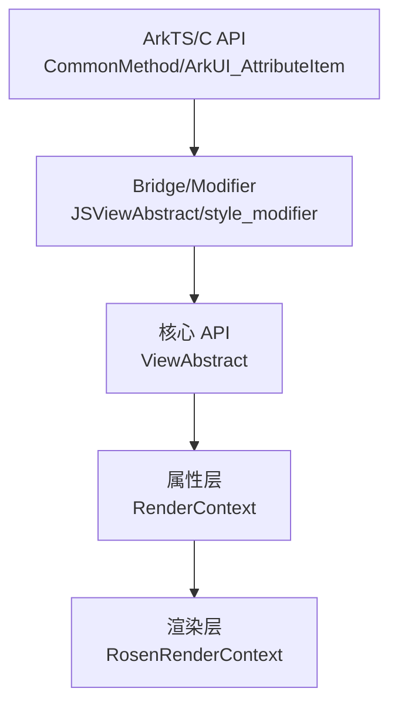
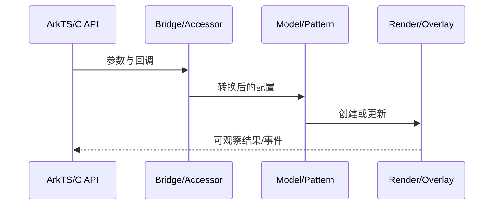
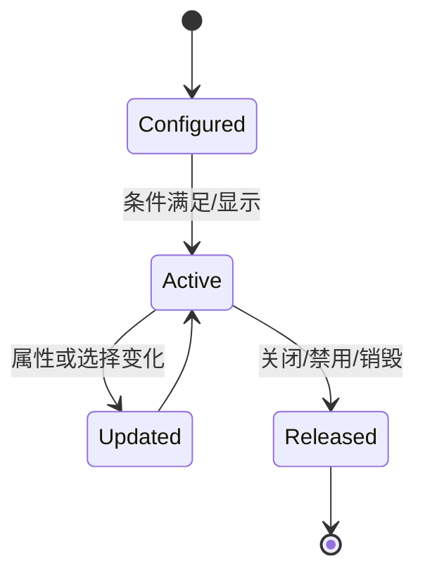
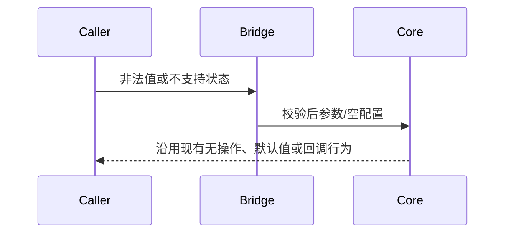

# 架构设计

> 确认目标仓和模块的架构约束、关键设计决策、Spec 拆分方向。

## 设计元数据

| 字段 | 内容 |
|---|---|
| Design ID | DESIGN-Func-04-03-10 |
| 关联需求 | 已有能力补录（无独立 requirement.md） |
| 关联 Epic | 无 |
| 目标 Feature | Feat-01 背景图片通用属性 |
| 复杂度 | 复杂 |
| 目标版本 | Dynamic 7+ / Static 23+ / Node C API |
| Owner | ArkUI SIG |
| 状态 | Baselined（已有实现补录） |

## 需求基线

> 本设计记录现有实现，不提出产品行为修改。

| 项 | 补充说明（如需） |
|---|---|
| 存储位置 | 背景图属性统一存入 RenderContext |
| 门控与重载 | visual-state、Pipeline 禁止标记和 ResourceObject 回调共同决定更新 |

## 上下文和现状

### 涉及仓和模块

| 仓库 | 补充架构说明 |
|---|---|
| interface/sdk-js/api | Dynamic/Static ArkTS 契约 |
| ace_engine/frameworks/bridge/declarative_frontend | Dynamic 参数解析 |
| ace_engine/frameworks/core/components_ng/base | ViewAbstract 属性更新 |
| ace_engine/interfaces/native | Node C API 属性 |
| ace_engine/frameworks/core/interfaces/native/node | modifier 到 ViewAbstract |

### 调用链层级分析

| 层 | 模块 | 职责 | 修改类型 |
|---|---|---|---|
| ArkTS/C API | CommonMethod/ArkUI_AttributeItem | 接收 src/repeat/size/position/slice | 文档补录 |
| Bridge/Modifier | JSViewAbstract/style_modifier | 解析类型和错误码 | 文档补录 |
| 核心 API | ViewAbstract | visual-state/Pipeline 门控、资源回调 | 文档补录 |
| 属性层 | RenderContext | 保存背景图相关属性 | 文档补录 |
| 渲染层 | RosenRenderContext | 加载和绘制背景图 | 文档补录 |

- [x] 调用链每一层都已覆盖
- [x] 每层职责边界清晰
- [x] 每层修改类型明确

### 适用架构规则

| Rule ID | 适用原因 | 设计结论 | 验证方式 |
|---|---|---|---|
| OH-ARCH-LAYERING | 涉及前端到渲染/弹窗链路 | 保持现有单向分层调用 | 架构评审/源码审查 |
| OH-ARCH-SUBSYSTEM | 实现位于 ArkUI 仓内 | 不新增跨子系统依赖 | 依赖检查 |
| OH-ARCH-IPC-SAF | 无新增 IPC/SA | N/A | 源码审查 |
| OH-ARCH-API-LEVEL | 涉及存量公开 API | SDK 声明为契约，内部 accessor 不扩展为 NDK | API 评审 |
| OH-ARCH-COMPONENT-BUILD | 不修改构建边界 | BUILD.gn/bundle.json 无变更 | 索引校验 |
| OH-ARCH-ERROR-LOG | 沿用现有返回/降级行为 | 不新增错误码 | 定向测试 |

## 不涉及项承接

| 维度 | 设计结论 |
|---|---|
| 权限/隐私 | 无新增权限；资源访问沿用 ImageSourceInfo |
| 持久化/迁移 | 不新增持久化数据和迁移逻辑 |
| 跨进程 | 不新增 IPC、SA 或跨进程协议 |

## 关键设计决策

| 决策 ID | 问题 | 推荐方案 | 探索过的替代方案 | 取舍理由 | 影响 |
|---|---|---|---|---|---|
| ADR-1 | 属性存储位置 | 继续使用 RenderContext 背景图属性 | 创建 Image 子节点、存 LayoutProperty | 背景图属于绘制上下文且适用于所有组件 | 全部 AC |
| ADR-2 | 资源配置变化 | Pattern 保存 ResourceObject 回调并重载 | 仅首次解析、全局资源监听 | 现有实现可按节点更新 | AC-1.3 |
| ADR-3 | 特殊 Pipeline 状态 | CheckNeedDisableUpdateBackgroundImage 时无操作 | 强制更新、调用方自行判断 | 避免不允许阶段更新背景图 | AC-1.2 |
| ADR-4 | C API 边界 | ArkUI_AttributeItem 校验后进入 common modifier | 公开内部函数指针、重复实现属性逻辑 | 保持统一错误码和核心实现 | AC-2.4 |

## 设计骨架

### 骨架范围

| 骨架项 | 目标 | 不包含 | 验证方式 |
|---|---|---|---|
| 规格补录 | 固定现有 API、边界和兼容行为 | 不修改产品实现 | spec 校验 + 源码审查 |
| 共享设计 | 同一 FuncID 的 Feat 共用 design.md | 不建立 Feat 独立 H2 | 章节检查 |

### 骨架 Spec 拆分

| Task ID | 目标 | 受影响文件 | AC |
|---|---|---|---|
| TASK-SKELETON-1 | Feat-01 背景图片通用属性 | Feat-01-background-image-attributes-spec.md | 见对应 spec |

## 后续 Task 拆分

| Task ID | 目标 | 受影响文件 | 依赖 |
|---|---|---|---|
| TASK-040310-01 | Feat-01 背景图片通用属性 | Feat-01-background-image-attributes-spec.md | 源码与 SDK 契约 |

## API 签名、Kit 与权限

### 新增 API

> 本次不新增 API；下表记录存量开放面。

| API 签名 | 类型 | Kit | d.ts 位置 | 权限要求 | SysCap |
|---|---|---|---|---|---|
| backgroundImage/backgroundImageSize/backgroundImagePosition/backgroundImageResizable | Public | ArkUI | interface/sdk-js/api/@internal/component/ets/common.d.ts | 无 | SystemCapability.ArkUI.ArkUI.Full |
| NODE_BACKGROUND_IMAGE* | Public C API | ArkUI Native | interfaces/native/native_node.h | 无 | ArkUI |

### 变更/废弃 API

| 原有 API | 变更类型 | 新 API | 迁移说明 |
|---|---|---|---|
| N/A | 无 | N/A | 无 |

## 构建系统影响

### BUILD.gn 变更

```text
无。本文档补录现有实现，不修改 BUILD.gn。
```

### bundle.json 变更

无新增 component 或依赖关系。

## 可选设计扩展

### 架构图



### 数据流/控制流

| 步骤 | 调用方 | 被调用方 | 数据/接口 | 说明 |
|---|---|---|---|---|
| 1 | CommonMethod/ArkUI_AttributeItem | JSViewAbstract/style_modifier | 接收 src/repeat/size/position/slice | 沿现有链路传递 |
| 2 | JSViewAbstract/style_modifier | ViewAbstract | 解析类型和错误码 | 沿现有链路传递 |
| 3 | ViewAbstract | RenderContext | visual-state/Pipeline 门控、资源回调 | 沿现有链路传递 |
| 4 | RenderContext | RosenRenderContext | 保存背景图相关属性 | 沿现有链路传递 |
| 5 | RosenRenderContext | 渲染结果/回调 | 加载和绘制背景图 | 沿现有链路传递 |

### 时序设计



### 数据模型设计

`RenderContext` 保存 `ImageSourceInfo`、`ImageRepeat`、`BackgroundImageSize`、`BackgroundImagePosition` 和 `ImageResizableSlice`；资源字段可携带 `ResourceObject` 回调。

### 算法与状态机



### 测试性设计

| 测试层级 | 测试目标 | Mock 策略 | 验证方式 |
|---|---|---|---|
| 源码契约 | SDK 与实现映射 | 无 | 路径和行号审查 |
| 组件/预览 | 主路径与边界条件 | 平台能力按现有 mock | 定向 UT 或 previewer 用例 |
| 兼容性 | API 版本差异 | 设置 target API | 版本矩阵审查 |

### 异常传播时序图



### 资源所有权矩阵

| 资源 | 创建方 | 持有方 | 销毁触发 | 实际释放 | 异常回收 |
|---|---|---|---|---|---|
| 背景图资源 | ArkTS/C API | RenderContext/Image loading | 属性重置或节点销毁 | 图像加载框架 | WeakClaim 回调避免悬挂 |
| ResourceObject 回调 | ViewAbstract | Pattern | 资源移除或 Pattern 销毁 | Pattern | 回调先 Upgrade FrameNode |

### 接口参数规约

| 接口 | 参数 | 类型 | 合法范围 | 非法处理 | 边界说明 |
|---|---|---|---|---|---|
| backgroundImage | src/repeat/options | ResourceStr|PixelMap | SDK 类型范围 | 无效值按 bridge 现有默认/重置 | Pipeline 可禁止更新 |
| Node attributes | ArkUI_AttributeItem | 结构体 | native_node.h 格式 | PARAM_INVALID | position API 21；slice API 19 |

### 线程与并发模型

| 操作 | 发起线程 | 回调线程 | 跨进程边界 | 线程安全 | 重入约束 |
|---|---|---|---|---|---|
| API 调用 | UI/ArkTS 线程 | UI/ArkTS 线程 | 无 | 沿用容器与 UI 线程约束 | 回调内修改配置按 SDK 生命周期说明生效 |

## 详细设计

### 图片源和重复

SetBackgroundImage 更新 RenderContext；Pipeline 可以阻止更新。

实现证据：`frameworks/core/components_ng/base/view_abstract.cpp:838`。
### 资源重载

媒体资源、尺寸、位置和 slice 分别注册重载回调。

实现证据：`frameworks/core/components_ng/base/view_abstract.cpp:853`。
### Native 节点接口

style_modifier 校验 AttributeItem 后调用 common modifier。

实现证据：`interfaces/native/node/style_modifier.cpp:1088`。

## 风险和开放问题

| 项 | 类型 | 影响 | 处理方式 | Owner |
|---|---|---|---|---|
| Pipeline 可静默阻止背景图更新 | 架构 | 中 | 规格和测试显式覆盖无操作路径 | ArkUI SIG |
| Dynamic/Static 可空性和版本不同 | API | 中 | 双 SDK 契约分别列出 | ArkUI SIG |
| 资源重载可能与初次设置路径不同 | 测试 | 中 | 配置变化用例覆盖 | ArkUI SIG |

## 设计审批

- [x] 需求基线已确认，设计覆盖 P0/P1 AC
- [x] 不涉及项已承接，N/A 和展开项都有结论
- [x] 涉及仓和模块职责清楚
- [x] 调用链层级分析完整，每层覆盖到位
- [x] 适用架构规则已识别并形成设计结论
- [x] 分层和子系统边界合规
- [x] API 变更有签名、权限、错误码和兼容性说明
- [x] BUILD.gn/bundle.json 影响明确
- [x] 设计输出和后续 Task 拆分明确
- [x] 关键设计决策有理由和影响说明
- [x] 风险和开放问题有 Owner

**结论:** 通过（已有实现补录）。
