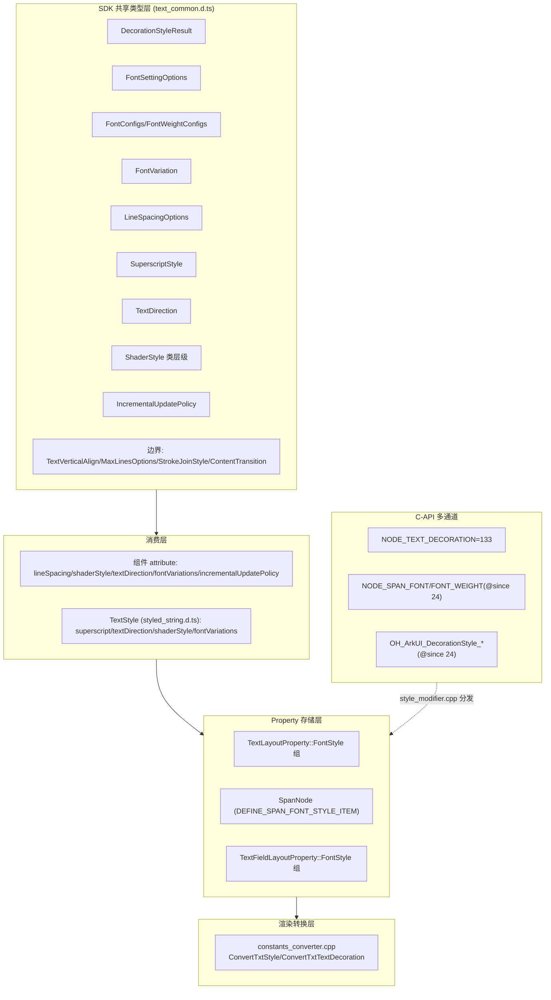

# 架构设计

> 文本通用属性功能域的架构设计文档，补录已有实现。本域范围严格对齐 `text_common.d.ts` 共享类型文件所定义的文本样式类型，仅覆盖该文件中声明的文本承载组件共享类型；核心字体属性 API（fontSize/fontColor/fontStyle/fontFamily/fontWeight 的直接方法）声明于各组件 `*.d.ts`（如 text.d.ts/button.d.ts），属组件级规格（参见 05-09-04 Text 组件规格），不在本域。

## 设计元数据

| 字段 | 内容 |
|------|------|
| Design ID | DESIGN-Func-04-03-11 |
| 关联需求 | 已有能力补录（无独立 requirement.md） |
| 关联 Epic | 无 |
| 目标 Feature | Feat-01 文本装饰 DecorationStyleResult（已 Baselined）, Feat-02 字体权重配置 FontSettingOptions/FontConfigs/FontWeightConfigs（已 Baselined）, Feat-03 字体变体 FontVariation/fontVariations（已 Baselined）, Feat-04 行间距 LineSpacingOptions（待补录）, Feat-05 上下标 SuperscriptStyle（待补录）, Feat-06 文本方向 TextDirection（待补录）, Feat-07 文本着色器 ShaderStyle 类层级（待补录）, Feat-08 增量更新策略 IncrementalUpdatePolicy（待补录）, Feat-09 边界对齐/溢出/线角/内容过渡类型（待归类补录） |
| 复杂度 | 复杂 |
| 目标版本 | API 12 起支持，API 20/22/23/24/26 有新增 |
| Owner | ArkUI SIG |
| 状态 | Baselined（已有实现补录） |

## 需求基线

| 项 | 内容 |
|----|------|
| 问题陈述 | 开发者需要通过 `text_common.d.ts` 声明的共享文本样式类型统一控制文本承载组件的装饰、字体权重配置、字体变体、行间距、上下标、文本方向、着色器、渲染增量更新等表现层样式 |
| 范围边界 | 本域仅覆盖 `text_common.d.ts` 中与"文本样式"相关的类型；selection/menu/edit/IME/measurement/accessibility/drag 等非样式类型归入各自功能域（04-14-01/03、04-13-02 等），核心字体属性 API 归入组件级规格 |
| P0 AC | Feat-01 DecorationStyleResult(thicknessScale) 生效；Feat-02 FontWeightConfigs(enableVariableFontWeight+enableDeviceFontWeightCategory，SDK 默认 true) 生效；Feat-03 FontVariation/fontVariations(@since 26) 生效 |

## 上下文和现状

### 涉及仓和模块

| 仓库 | 模块/路径 | 当前职责 | 本 Feature 影响 |
|------|-----------|----------|-----------------|
| ace_engine | `frameworks/core/components_ng/pattern/text/text_layout_property.h/cpp` | 文本通用属性核心存储：FontStyle/TextLineStyle 属性组（含 TextDecoration*/LineThicknessScale/FontVariations 等） | 核心数据结构 |
| ace_engine | `frameworks/core/components/font/constants_converter.cpp` | ConvertTxtStyle：FontWeight vs VariableFontWeight 互斥解析 + EnableDeviceFontWeightCategory 三态 + decoration 位 OR 合并 + px 转换 | 渲染转换层 |
| ace_engine | `frameworks/core/components_ng/pattern/text/text_styles.cpp` | CreateTextStyleUsingTheme：主题默认值合并 | 主题层 |
| ace_engine | `frameworks/core/components/text/text_theme.h/cpp` | 默认值（FontStyle=NORMAL, FontWeight=NORMAL, TextColor=BLACK@0.9, FontSize=text_font_size） | 主题层 |
| ace_engine | `interfaces/native/native_node.h` | C-API ArkUI_NodeAttributeType 枚举（NODE_TEXT_DECORATION/NODE_SPAN_FONT/FONT_WEIGHT 等） | C-API 定义 |
| ace_engine | `interfaces/native/node/style_modifier.cpp` | C-API 属性分发与转换（SetTextTextDecoration/SetSpanFont/SetSpanFontWeight 等） | C-API 桥接 |
| ace_engine | `interfaces/native/native_styled_string_descriptor.h` / `node/span_style_native_impl.cpp` | OH_ArkUI_DecorationStyle_* / OH_ArkUI_TextStyle_SetFont* 样式字符串 C-API (@since 24) | C-API 定义 |
| ace_engine | `interfaces/native/node_attributes/text.h` | OH_ArkUI_FontConfigs/OH_ArkUI_FontWeightConfigs option-object C-API (@since 24) | C-API 定义 |
| ace_engine | `frameworks/core/components_ng/pattern/span/span_node.cpp` | Span 并行存储（DEFINE_SPAN_FONT_STYLE_ITEM）+ 字体加载回调 | 数据结构 |
| ace_engine | `frameworks/core/components_ng/pattern/text_field/text_field_layout_property.h` | TextField 并行存储（FontStyle 组） | 数据结构 |
| sdk-js | `api/@internal/component/ets/text_common.d.ts` | **本域范围依据**：声明全部共享文本类型（见下表） | 类型定义 |
| sdk-js | `api/@internal/component/ets/styled_string.d.ts` | `TextStyle` 段落级样式载体：消费 `superscript?`/`textDirection?`/`shaderStyle?`/`fontVariations?` | 类型定义 |
| sdk-js | `api/@internal/component/ets/text.d.ts` / `search.d.ts` / `rich_editor.d.ts` / `symbolglyph.d.ts` | 组件 attribute 方法：`lineSpacing()`/`shaderStyle()`/`textDirection()`/`fontVariations()`/`incrementalUpdatePolicy()` | 类型定义 |

### text_common.d.ts 中本域覆盖的样式类型清单

| 类型 | @since | 消费方式 | 所属 Feat |
|------|--------|----------|-----------|
| `DecorationStyleResult`（type/color/style/thicknessScale） | 12（thicknessScale 20） | decoration() 参数/返回、styled-string OH_ArkUI_DecorationStyle_* | Feat-01 |
| `FontSettingOptions`（enableVariableFontWeight） | 12 | fontWeight(weight, options?) 第二重载入参 | Feat-02 |
| `FontConfigs`（fontWeightConfigs?） | 24 | NODE_SPAN_FONT `.object` 子对象 | Feat-02 |
| `FontWeightConfigs`（enableVariableFontWeight + enableDeviceFontWeightCategory，默认 **true**） | 24 | NODE_SPAN_FONT_WEIGHT `.object` 子对象；TextStyle | Feat-02 |
| `FontVariation`（类型重导出自 @ohos.graphics.text） | 26 | fontVariations(Array<FontVariation>) 入参类型 | Feat-03 |
| `LineSpacingOptions`（onlyBetweenLines，默认 false） | 20 | lineSpacing(value, options?) 第二重载入参 | Feat-04 |
| `SuperscriptStyle`（NORMAL/SUPERSCRIPT/SUBSCRIPT） | 20 | TextStyle.superscript?（styled_string.d.ts） | Feat-05 |
| `TextDirection`（LTR/RTL/DEFAULT/AUTO） | 22/23 | textDirection() attribute（Search/RichEditor）+ TextStyle.textDirection? | Feat-06 |
| `ShaderStyle`/`LinearGradientStyle`/`RadialGradientStyle`/`ColorShaderStyle` | 20 | shaderStyle() attribute（Search/RichEditor）+ SymbolGlyph shader + TextStyle.shaderStyle? | Feat-07 |
| `IncrementalUpdatePolicy`（NONE/PARAGRAPH_CACHE） | 26 | incrementalUpdatePolicy() attribute（Text） | Feat-08 |
| `TextVerticalAlign`（BASELINE/BOTTOM/CENTER/TOP） | 20 | 文本垂直对齐 | Feat-09（边界） |
| `TextContentAlign`（TOP/CENTER/BOTTOM） | 21 | 内容区垂直对齐 | Feat-09（边界） |
| `MaxLinesOptions`/`MaxLinesMode`（CLIP/SCROLL） | 20 | TextArea 超最大行数溢出 | Feat-09（边界） |
| `StrokeJoinStyle`（MITER/ROUND/BEVEL） | 26 | 线段角点样式 | Feat-09（边界） |
| `ContentTransition`/`NumericTextTransition`/`NumericTextTransitionOptions`/`FlipDirection` | 20 | 数值文本翻转动效 | Feat-09（边界） |

> 不在本域（属其他功能域）：`TextDataDetectorType`/`Config`、`TextRange`/`InsertValue`/`DeleteValue`/`TextDeleteDirection`、`MenuType`/`AutoCapitalizationMode`、`TextBaseController`/`TextEditControllerEx`/`StyledStringController`/`StyledStringChangedListener`/`StyledStringChangeValue`、`LayoutManager`/`PositionWithAffinity`/`LineMetrics`/`RectWidthStyle`/`RectHeightStyle`/`TextBox`/`Paragraph`/`TextLayoutOptions`、`CaretStyle`、`TextMenuItemId`/`TextMenuItem`/`EditMenuOptions`/`OnCreateMenuCallback`/`OnPrepareMenuCallback`、`TextChangeOptions`/`EditableTextChangeValue`/`TextChangeReason`、`TextMenuShowMode`/`TextMenuOptions`、`KeyboardAppearance`/`KeyboardAppearanceConfig`/`KeyboardGradientMode`/`KeyboardFluidLightMode`/`IMEClient`/`InputMethodExtraConfig`/`VoiceButtonOptions`、`AccessibilitySpanOptions`、`SelectedDragPreviewStyle`、`PreviewText`。

### 调用链层级分析

| 层 | 模块 | 职责 | 修改类型 |
|---------|----------|----------|----------|
| SDK 共享类型层 | `text_common.d.ts` | 声明本域全部样式类型 + @since/@default 标注 | 存量分析 |
| 组件 API 层 | `text.d.ts`/`search.d.ts`/`rich_editor.d.ts`/`symbolglyph.d.ts` | lineSpacing/shaderStyle/textDirection/fontVariations/incrementalUpdatePolicy attribute 方法 | 存量分析 |
| StyledString TextStyle 层 | `styled_string.d.ts` | 段落级 superscript/textDirection/shaderStyle/fontVariations 消费 | 存量分析 |
| Property 存储层 | `text_layout_property.h`（TextLayoutProperty FontStyle 组） + `span_node.cpp` + `text_field_layout_property.h` | 共享/并行存储 decoration/FontVariations/LineSpacing 等 | 存量分析 |
| 渲染转换层 | `constants_converter.cpp` | ConvertTxtStyle 互斥解析 + ConvertTxtTextDecoration 位 OR 合并 + px 转换 | 存量分析 |
| 主题默认值层 | `text_theme.h/cpp` + `text_styles.cpp` | 默认值初始化与主题回退合并 | 存量分析 |
| C-API 枚举层 | `native_node.h` | NODE_TEXT_DECORATION/NODE_SPAN_FONT/FONT_WEIGHT 等 | 存量分析 |
| C-API 转换层 | `style_modifier.cpp` | SetTextTextDecoration/SetSpanFont/SetSpanFontWeight | 存量分析 |
| 样式字符串 C-API | `native_styled_string_descriptor.h` + `span_style_native_impl.cpp` | OH_ArkUI_DecorationStyle_*/OH_ArkUI_TextStyle_SetFont* (@since 24) | 存量分析 |
| Option-object C-API | `node_attributes/text.h` | OH_ArkUI_FontConfigs/FontWeightConfigs 创建/设置/获取 (@since 24) | 存量分析 |

### 适用架构规则

| Rule ID | 适用原因 | 设计结论 | 验证方式 |
|---------|----------|----------|----------|
| OH-ARCH-LAYERING | 本域类型经 SDK → 组件 attribute/TextStyle → Property → 主题 → 渲染转换 单向调用 | 严格单向，渲染转换层为真正决策点 | 代码评审/依赖检查 |
| OH-ARCH-API-LEVEL | 类型 @since 12/20/22/23/24/26 分布 | 各类型标注 @since 版本号，新重载不破坏旧签名 | API 评审/XTS |
| OH-ARCH-COMPONENT-BUILD | 本域属 ace_core_ng + 各组件 pattern | 无需新增 BUILD.gn target | 构建验证 |
| OH-ARCH-ERROR-LOG | C-API 错误码 ARKUI_ERROR_CODE_PARAM_INVALID(401)/106102/106202 | C-API 入参校验失败返回 401，不支持节点返回 106102 | 单测/native_node_test.cpp |

## 不涉及项承接

| 维度 | 设计阶段处理方式 | 设计结论 |
|------|-------------|----------|
| 核心字体属性 API | 不涉及 | fontSize/fontColor/fontStyle/fontFamily/fontWeight 直接方法属组件级规格（05-09-04），本域仅覆盖其 options 对象层级（FontSettingOptions/FontWeightConfigs） |
| 文本间距数值属性 | 不涉及 | letterSpacing/lineHeight/baselineOffset 属组件级规格，本域仅覆盖 lineSpacing 的 LineSpacingOptions |
| 阴影与 OpenType 特性 | 不涉及 | textShadow/fontFeature 不在 text_common.d.ts，属组件级规格；本域仅覆盖 fontVariations 的 FontVariation 类型 |
| 自适应字号范围 | 不涉及 | minFontSize/maxFontSize/minFontScale/maxFontScale 不在 text_common.d.ts，属组件级规格 |
| 性能 | 展开设计 | FontStyle 组任一项变更触发 `propNeedReCreateParagraph_=true`，下一帧段落重建 |
| 安全与权限 | 保持 N/A | 本域类型无权限要求 |
| 兼容性 | 展开设计 | 需关注 @since 20/22/23/24/26 新增类型版本边界 |
| IPC/跨进程 | 保持 N/A | 本域仅在 UI 线程内处理 |
| 构建与部件 | 保持 N/A | 无新增部件或 target |

## 关键设计决策

| 决策 ID | 问题 | 推荐方案 | 探索过的替代方案 | 取舍理由 | 影响 |
|---------|------|----------|-----------------|------|------|
| ADR-1 | `DecorationStyleResult` 的 thicknessScale 是公开 API 还是内部？ | **是公开类型字段**（@since 20）；decoration() 参数对象 DecorationStyleInterface 与返回 DecorationStyleResult 均暴露 thicknessScale；lineThicknessScale 是 C++ 内部存储字段名（FontStyle::LineThicknessScale），公开表面为 thicknessScale 字段 | 方案A：暴露独立 lineThicknessScale() 方法（破坏 decoration 聚合语义）；方案B：重命名内部字段（无收益） | thicknessScale 作为 decoration 参数对象字段符合聚合语义 | 规格「接口规格」明确 lineThicknessScale 内部 vs thicknessScale 公开 |
| ADR-2 | `FontWeightConfigs.enableDeviceFontWeightCategory` SDK 默认 true 与 C++ FontStyle 三态不一致如何标注？ | 接受现状即规格：SDK `FontWeightConfigs`（text_common.d.ts）默认 **true**（自动同步设备字体权重设置）；且"传入 null/undefined 时不应用默认值，字体权重行为与父组件一致"。C++ `FontStyle::EnableDeviceFontWeightCategory` 仍为 `std::optional<bool>`（三态：未设置/true/false）。两层级语义不同 | 方案A：统一 SDK 与 C++ 默认（破坏任一层兼容）；方案B：仅文档标注 | 两层在不同版本/路径引入，统一破坏兼容；层级差异作为已知风险标注 | 规格「互斥规则」明确 SDK 默认 true vs C++ 三态；风险表标注跨层默认值不一致 |
| ADR-3 | `FontVariation` 类型为何重导出自 @ohos.graphics.text？ | 接受现状即规格：`FontVariation` 是 Graphics 子系统定义的通用字体变轴类型，text_common.d.ts 经 `import('../api/@ohos.graphics.text').default.FontVariation` 重导出供 ArkUI 消费；fontVariations(@since 26) 优先级高于 fontWeight | 方案A：在 text_common 本地重新定义（重复定义）；方案B：不经 text_common 直接引用 graphics | 重导出保证 ArkUI 与 Graphics 类型一致；fontVariations 提供任意轴控制（wght/wdth/ital/自定义） | 规格「接口规格」明确 @since 26 + 优先级 > fontWeight |
| ADR-4 | `LineSpacingOptions.onlyBetweenLines` 与 lineHeight 的关系？ | 接受现状即规格：lineSpacing 是行间额外距（区别于 lineHeight 行高绝对值）；onlyBetweenLines（@since 20，默认 false）控制额外距是否仅应用于行间（true 不在首行上方/末行下方加距，false 首末行也加） | 方案A：并入 lineHeight（语义不同）；方案B：仅 onlyBetweenLines 不含 value | lineSpacing + onlyBetweenLines 表达"行间额外距 + 边界控制"完整语义 | 规格「逐组件适用性」列出 lineSpacing；Feat-04 待补录 |
| ADR-5 | `SuperscriptStyle` 为何经 TextStyle 暴露而非 Text 组件直接 attribute？ | 接受现状即规格：SuperscriptStyle（@since 20）是 StyledString/TextStyle 属性（`TextStyle.superscript?`），非 Text 组件直接 attribute 方法；Text 组件通过 StyledString 间接消费 | 方案A：Text 组件暴露 superscript() 方法（与现状不符）；方案B：并入 decoration（上标非线装饰，语义不同） | 上下标是字形级样式，通过 TextStyle 暴露符合 styled-string 模型 | 规格「接口规格」列出 SuperscriptStyle + TextStyle.superscript；Feat-05 待补录 |
| ADR-6 | `TextDirection` 与布局 `Direction`（common.d.ts）区别？ | 接受现状即规格：TextDirection（@since 22/23）是文本 BiDi 布局方向（LTR/RTL/DEFAULT/AUTO），影响段落排版；DEFAULT 跟随组件布局方向，AUTO 跟随内容书写方向；区别于 common.d.ts 的布局 `Direction`（容器布局方向） | 方案A：统一为 Direction（丢失 BiDi 语义）；方案B：仅记录不补录 | 文本方向影响 BiDi 段落排版，属文本通用属性 | 规格「接口规格」列出 textDirection + TextDirection；Feat-06 待补录 |
| ADR-7 | `ShaderStyle` 类层级与 fontColor 关系？ | 接受现状即规格：fontColor 仍只接受 ResourceColor（不含渐变）；渐变色经独立 `shaderStyle(shader)` attribute（@since 20）设置，ShaderStyle 类层级（LinearGradientStyle/RadialGradientStyle/ColorShaderStyle）提供渐变/纯色 shader；SymbolGlyph `fontColor(Array<ResourceColor \| ColorMetrics>)` 是另一扩展路径 | 方案A：扩展 fontColor 接受 ShaderStyle（破坏 @since 7 已发布签名）；方案B：仅 SymbolGlyph 暴露 shader（Search/RichEditor 已有 shaderStyle） | fontColor 与 shaderStyle 分离保持 fontColor 签名稳定 | 规格「接口规格」列出 shaderStyle + ShaderStyle 类层级；Feat-07 待补录 |
| ADR-8 | `IncrementalUpdatePolicy` 属样式还是性能？ | 接受现状即规格：incrementalUpdatePolicy（@since 26）是文本渲染增量更新策略（NONE 全量/PARAGRAPH_CACHE 段落级缓存）；属渲染性能策略属性，在 text_common.d.ts 声明故纳入本域 | 方案A：并入自适应（语义不同）；方案B：作为非功能项不补录 | 增量更新策略影响渲染性能，在 text_common 声明故纳入 | 规格「接口规格」列出 incrementalUpdatePolicy；Feat-08 待补录 |
| ADR-9 | `TextVerticalAlign`/`TextContentAlign`/`MaxLinesOptions`/`StrokeJoinStyle`/`ContentTransition` 归属？ | 接受现状即规格：这些类型在 text_common.d.ts 声明，但语义边界模糊（对齐偏布局、溢出偏 TextArea、线角偏绘制、过渡偏动效）；归入 Feat-09 边界类型待归类补录 | 方案A：分别归入各自功能域（分散）；方案B：全部并入本域（过度扩张） | 边界类型暂聚 Feat-09，待各域规格补录时再迁移 | 规格「边界类型」章节列出；Feat-09 待补录 |

## 设计骨架

### 骨架范围

| 骨架项 | 目标 | 不包含 | 验证方式 |
|--------|------|--------|----------|
| decoration 结果类型 | DecorationStyleResult（type/color/style/thicknessScale）存储与渲染转换 | textCase（不在 text_common） | 编译通过 + 单测 |
| 字体权重配置 | FontSettingOptions/FontConfigs/FontWeightConfigs 互斥与三态解析 | fontWeight 直接 API（不在 text_common） | 单测 |
| 字体变体 | FontVariation/fontVariations @since 26 优先级 | textShadow/fontFeature（不在 text_common） | 单测 |
| 行间距 | LineSpacingOptions.onlyBetweenLines 边界控制 | letterSpacing/lineHeight/baselineOffset（不在 text_common） | 单测 |
| 新增类型 | SuperscriptStyle/TextDirection/ShaderStyle/IncrementalUpdatePolicy 路由 | — | 单测 + C-API 测试 |

### 骨架 Spec 拆分

| Task ID | 目标 | 受影响文件 | AC |
|---------|------|------------|-----|
| TASK-SKELETON-1 | decoration + fontWeight 配置 + fontVariation + lineSpacing 基线 | text_layout_property.h, constants_converter.cpp, text_styles.cpp, style_modifier.cpp, text.h | WHEN 相关类型任一项变更 THEN 触发 propNeedReCreateParagraph_=true |

## 后续 Task 拆分

| Spec | 目的 | 依赖 | 输出 |
|------|------|------|------|
| Feat-01-decoration-style-result-spec.md | 固化 DecorationStyleResult(type/color/style/thicknessScale) 的行为规格 | 本 Design | 完整行为规格与 AC |
| Feat-02-font-weight-configs-spec.md | 固化 FontSettingOptions/FontConfigs/FontWeightConfigs(enableVariableFontWeight+enableDeviceFontWeightCategory，SDK 默认 true) 的行为规格 | 本 Design | 完整行为规格与 AC |
| Feat-03-font-variation-spec.md | 固化 FontVariation/fontVariations(@since 26，优先级 > fontWeight) 的行为规格 | 本 Design | 完整行为规格与 AC |
| Feat-04-line-spacing-options-spec.md（待补录） | 固化 LineSpacingOptions(onlyBetweenLines) + lineSpacing 的行为规格（@since 12/20） | 本 Design | 完整行为规格与 AC |
| Feat-05-superscript-style-spec.md（待补录） | 固化 SuperscriptStyle 经 TextStyle.superscript 的行为规格（@since 20） | 本 Design | 完整行为规格与 AC |
| Feat-06-text-direction-spec.md（待补录） | 固化 TextDirection(LTR/RTL/DEFAULT/AUTO) 经 textDirection()/TextStyle 的行为规格（@since 22/23） | 本 Design | 完整行为规格与 AC |
| Feat-07-shader-style-spec.md（待补录） | 固化 ShaderStyle 类层级经 shaderStyle() 的行为规格（@since 20） | 本 Design | 完整行为规格与 AC |
| Feat-08-incremental-update-policy-spec.md（待补录） | 固化 IncrementalUpdatePolicy(NONE/PARAGRAPH_CACHE) 的行为规格（@since 26） | 本 Design | 完整行为规格与 AC |
| Feat-09-boundary-types-spec.md（待补录） | 归类 TextVerticalAlign/TextContentAlign/MaxLinesOptions/StrokeJoinStyle/ContentTransition 等边界类型 | 本 Design | 归类结论与 AC |

---

## API 签名、Kit 与权限

### 新增 API

> 本特性为已有实现补录，下表为 text_common.d.ts 声明的现存类型签名清单。逐组件签名变体详见各 Feat 规格的「接口规格」章节。

| API 签名 | 类型 | d.ts 位置 | 权限要求 | SysCap |
|----------|------|-----------|----------|--------|
| `decoration(DecorationStyleInterface)` / 返回 `DecorationStyleResult` (Text/Span/TextInput/TextArea/Search) | Public | `text.d.ts`/`span.d.ts`/`text_input.d.ts`/`text_area.d.ts`/`search.d.ts`（thicknessScale @since 20） | - | SystemCapability.ArkUI.ArkUI.Full |
| `fontWeight(weight, options?: FontSettingOptions)` 第二重载 (Text) | Public | `text.d.ts` (@since 12) | - | 同上 |
| `FontConfigs` / `FontWeightConfigs`（option-object 类型） | Public 类型 | `text_common.d.ts` (@since 24) | - | 同上 |
| `fontVariations(Array<FontVariation>)` (Text/Span) | Public | `text.d.ts` (@since 26) | - | 同上 |
| `FontVariation`（类型重导出自 @ohos.graphics.text） | Public 类型 | `text_common.d.ts` (@since 26) | - | 同上 |
| `lineSpacing(value: LengthMetrics, options?: LineSpacingOptions)` (Text) | Public | `text.d.ts` (@since 12 单参 / @since 20 带 options) | - | 同上 |
| `LineSpacingOptions`（onlyBetweenLines） | Public 类型 | `text_common.d.ts` (@since 20) | - | 同上 |
| `TextStyle.superscript?: SuperscriptStyle` (StyledString) | Public | `styled_string.d.ts` (@since 20) | - | 同上 |
| `SuperscriptStyle`（NORMAL/SUPERSCRIPT/SUBSCRIPT） | Public 类型 | `text_common.d.ts` (@since 20) | - | 同上 |
| `textDirection(direction: TextDirection \| undefined)` (Search/RichEditor) + `TextStyle.textDirection?` | Public | `search.d.ts`/`rich_editor.d.ts`/`styled_string.d.ts` (@since 22/23) | - | 同上 |
| `TextDirection`（LTR/RTL/DEFAULT/AUTO） | Public 类型 | `text_common.d.ts` (@since 22/23) | - | 同上 |
| `shaderStyle(shader: ShaderStyle \| undefined)` (Search/RichEditor) + SymbolGlyph `shader` + `TextStyle.shaderStyle?` | Public | `search.d.ts`/`rich_editor.d.ts`/`symbolglyph.d.ts`/`styled_string.d.ts` (@since 20) | - | 同上 |
| `ShaderStyle`/`LinearGradientStyle`/`RadialGradientStyle`/`ColorShaderStyle` | Public 类型 | `text_common.d.ts` (@since 20) | - | 同上 |
| `incrementalUpdatePolicy(policy: IncrementalUpdatePolicy \| undefined)` (Text) | Public | `text.d.ts` (@since 26) | - | 同上 |
| `IncrementalUpdatePolicy`（NONE/PARAGRAPH_CACHE） | Public 类型 | `text_common.d.ts` (@since 26) | - | 同上 |
| `TextVerticalAlign`/`TextContentAlign`/`MaxLinesOptions`/`MaxLinesMode`/`StrokeJoinStyle`/`ContentTransition`/`NumericTextTransition` | Public 类型（边界） | `text_common.d.ts` (@since 20/21/26) | - | 同上 |

**C-API (NDK) 接口：**

| 属性枚举 | 值格式 | 功能 | @since |
|----------|--------|------|--------|
| `NODE_TEXT_DECORATION = 133` | value[0].i32 type + value[1]?.u32 color + value[2]?.i32 style + value[3]?.f32 thickness (@since 22/23) | 设置 decoration（TEXT/SPAN） | 12 |
| `NODE_TEXT_INPUT_DECORATION = 7050` | .object = OH_ArkUI_DecorationStyleOptions* | 设置 TextInput decoration | 26 |
| `NODE_TEXT_AREA_DECORATION = 8047` | .object = OH_ArkUI_DecorationStyleOptions* | 设置 TextArea decoration | 26 |
| `NODE_SPAN_FONT = 2003` | 复合（含可选 OH_ArkUI_FontConfigs object） | Span 字体属性聚合 | 24 |
| `NODE_SPAN_FONT_WEIGHT = 2004` | .value[0].i32 (数字 100..900) + 可选 OH_ArkUI_FontWeightConfigs object | Span fontWeight + 变体配置 | 24 |

**样式字符串 C-API (@since 24)：**

| 函数 | 签名 | 用途 |
|------|------|------|
| `OH_ArkUI_DecorationStyle_SetType/Color/Style/ThicknessScale` | `(OH_ArkUI_DecorationStyle*, ...)` | 设置样式字符串装饰 |

**Option-object C-API (@since 24)：**

| 函数 | 签名 | 用途 |
|------|------|------|
| `OH_ArkUI_FontConfigs_Create` | `() -> OH_ArkUI_FontConfigs*` | 创建字体配置对象 |
| `OH_ArkUI_FontWeightConfigs_Create` | `() -> OH_ArkUI_FontWeightConfigs*` | 创建字体权重配置对象 |
| `OH_ArkUI_FontWeightConfigs_SetEnableVariableFontWeight` | `(option, bool) -> void` | 设置变体字体权重开关 |
| `OH_ArkUI_FontWeightConfigs_SetEnableDeviceFontWeightCategory` | `(option, bool) -> void` | 设置设备字体权重分类开关 |

### 变更/废弃 API

无新增变更。核心字体属性 API（fontSize/fontColor/fontStyle/fontFamily）的逐组件签名变体与废弃项（如 Menu.fontSize @deprecated since 10）属组件级规格，不在本域。

## 构建系统影响

### BUILD.gn 变更

```
无变更。本域类型实现位于 ace_core_ng_source_set 与各组件 pattern source_set，已有构建配置覆盖。
```

### bundle.json 变更

无变更。

---

## 可选设计扩展

### 架构图



## 风险和开放问题

| 项 | 类型 | 影响 | 处理方式 | Owner |
|----|------|------|----------|-------|
| `FontWeightConfigs.enableDeviceFontWeightCategory` SDK 默认 true vs C++ 三态跨层不一致 | API | 中 | 规格「互斥规则」明确层级差异；下游跨层读取须注意 | ArkUI SIG |
| `FontVariation` 重导出自 Graphics 子系统，类型演进依赖 Graphics | 架构 | 低 | 文档明确边界：fontVariations 类型定义在 Graphics | ArkUI SIG |
| `SuperscriptStyle`/`TextDirection`/`ShaderStyle`/`IncrementalUpdatePolicy` 待补录 Feat-04~08 spec | 设计 | 中 | 本设计已注册 Feat 占位，TASK 跟踪 | ArkUI SIG |
| `TextVerticalAlign`/`MaxLinesOptions`/`StrokeJoinStyle`/`ContentTransition` 边界归属待定 | 设计 | 中 | Feat-09 待归类补录 | ArkUI SIG |
| C-API decoration SPAN 忽略 thickness、负值处理三路不同 | API | 低 | 已在 Feat-01 规格风险表标注 | ArkUI SIG |

## 设计审批

- [x] 需求基线已确认，设计覆盖 P0/P1 AC
- [x] 不涉及项已承接，N/A 和展开项都有结论
- [x] 涉及仓和模块职责清楚
- [x] 调用链层级分析完整
- [x] 适用架构规则已识别并形成设计结论
- [x] 分层和子系统边界合规
- [x] API 变更有签名、权限、错误码和兼容性说明
- [x] BUILD.gn/bundle.json 影响明确（无新增变更）
- [x] 设计输出和后续 Task 拆分明确（Feat-01~09）
- [x] 关键设计决策有理由和影响说明（ADR-1 至 ADR-9）
- [x] 风险和开放问题有 Owner

**结论:** 通过（已有实现补录，范围严格对齐 text_common.d.ts）
