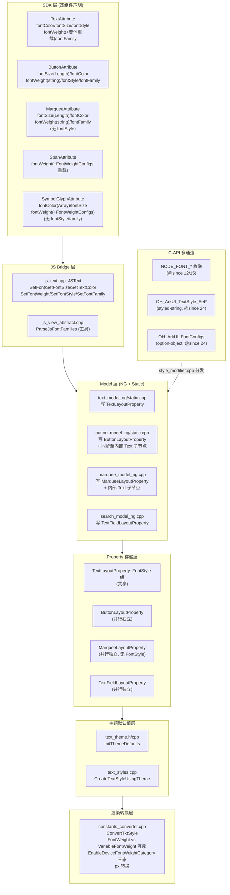
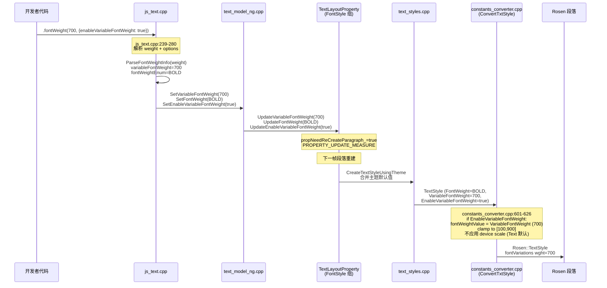
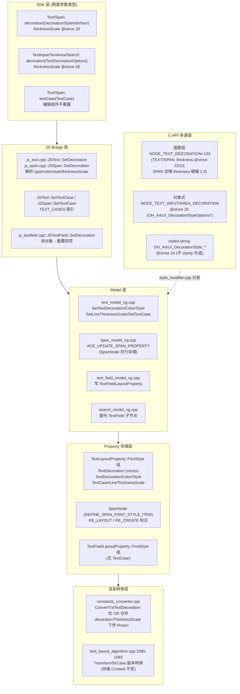
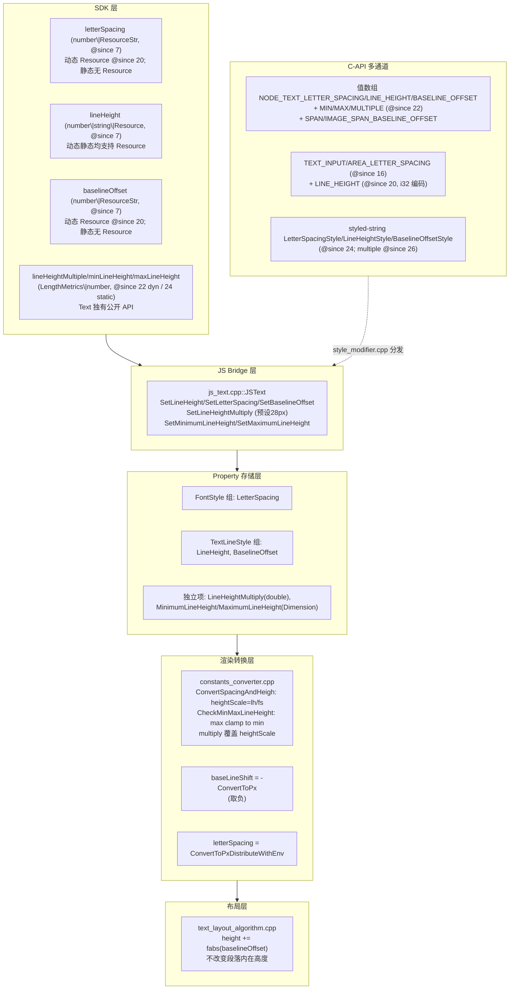
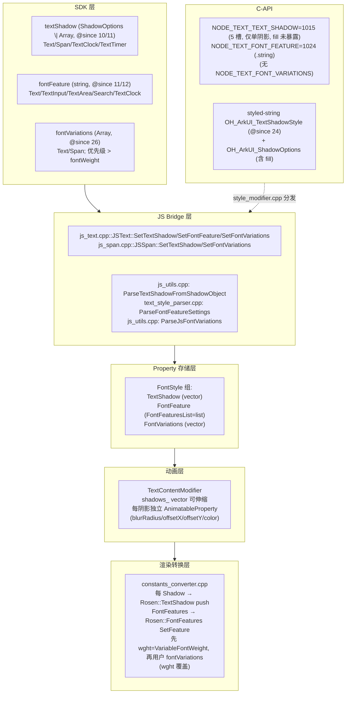
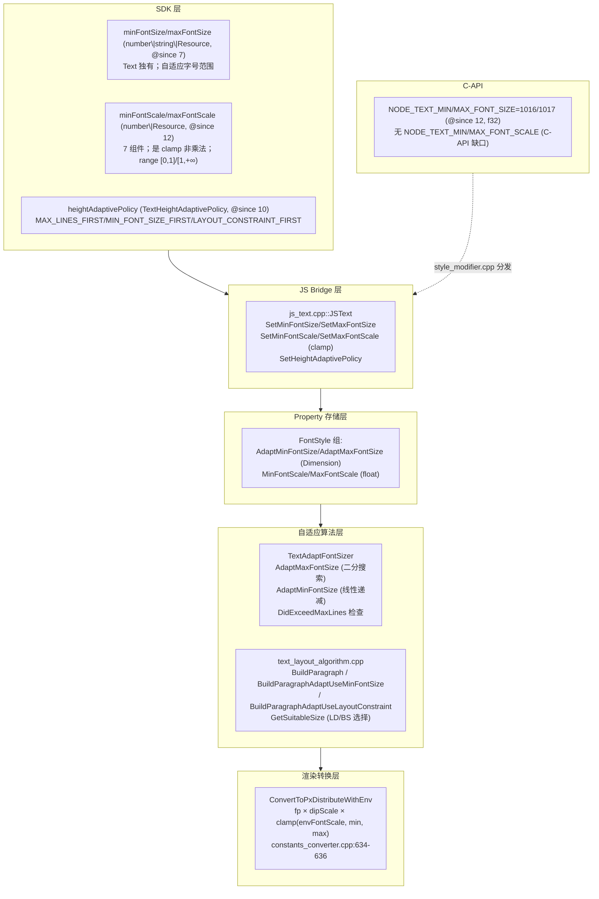

# 架构设计

> 文本通用属性功能域的架构设计文档，补录已有实现。本域覆盖所有文本承载组件共享的字体/装饰/间距/阴影/自适应属性，区别于 05-09-04 Text 组件自身的属性规格。

## 设计元数据

| 字段 | 内容 |
|------|------|
| Design ID | DESIGN-Func-04-03-11 |
| 关联需求 | 已有能力补录（无独立 requirement.md） |
| 关联 Epic | 无 |
| 目标 Feature | Feat-01 核心字体属性（已 Baselined）, Feat-02 文本装饰与大小写（已 Baselined）, Feat-03 文本间距与度量（已 Baselined）, Feat-04 文本阴影与 OpenType 特性（已 Baselined）, Feat-05 自适应字体缩放（已 Baselined） |
| 复杂度 | 复杂 |
| 目标版本 | API 7 起支持，API 10/11/12/14/15/20/24 有行为变更或新增 |
| Owner | ArkUI SIG |
| 状态 | Baselined（已有实现补录） |

## 需求基线

| 项 | 内容 |
|----|------|
| 问题陈述 | 开发者需要通过声明式通用属性 API 统一控制文本承载组件（Text/Button/Span/TextInput/TextClock/TextTimer/Marquee/SymbolGlyph/SecurityComponent 等）的字体、装饰、间距、阴影、自适应缩放等表现层文本样式 |
| 核心目标 | （Feat-01）提供 fontSize/fontColor/fontWeight(+变体字体重载)/fontStyle/fontFamily 五项核心字体属性；（Feat-02）提供 decoration（类型/颜色/样式/厚度比例）与 textCase；（Feat-03）提供 letterSpacing/lineHeight(+min/max/multiple)/baselineOffset；（Feat-04）提供 textShadow(多阴影)/fontFeature/fontVariations；（Feat-05）提供 minFontSize/maxFontSize/minFontScale/maxFontScale/enableVariableFontWeight/enableDeviceFontWeightCategory |
| P0 AC | （Feat-01）所有文本承载组件均可设置核心字体属性；fontWeight 变体字体重载 (@since 12) 仅 TextAttribute 拥有；EnableVariableFontWeight 控制静态 FontWeight 与 VariableFontWeight 的互斥优先级；（Feat-02）decoration 类型/颜色/样式/厚度比例生效；textCase 大小写转换生效；（Feat-03）letterSpacing/lineHeight/baselineOffset 生效；（Feat-04）多阴影与 OpenType 特性生效；（Feat-05）自适应字体缩放与设备字体权重分类生效 |

## 上下文和现状

### 涉及仓和模块

| 仓库 | 模块/路径 | 当前职责 | 本 Feature 影响 |
|------|-----------|----------|-----------------|
| ace_engine | `frameworks/core/components_ng/pattern/text/text_layout_property.h/cpp` | 文本通用属性的核心存储：FontStyle/TextLineStyle 属性组 + 独立项 | 核心数据结构 |
| ace_engine | `frameworks/core/components_ng/pattern/text/text_model_ng.cpp` | Text 组件字体属性设置入口（NG） | API 层 |
| ace_engine | `frameworks/core/components_ng/pattern/text/text_model_static.cpp` | Text 组件字体属性设置入口（Static） | API 层 |
| ace_engine | `frameworks/core/components_ng/pattern/button/button_model_ng.cpp` / `button_layout_property.h` | Button 组件独立字体存储 + 同步至内部 Text 子节点 | API 层 + 数据结构 |
| ace_engine | `frameworks/core/components_ng/pattern/marquee/marquee_model_ng.cpp` / `marquee_layout_property.h` | Marquee 独立字体存储（无 fontStyle）+ 内部 Text 子节点 | API 层 + 数据结构 |
| ace_engine | `frameworks/core/components_ng/pattern/search/search_model_ng.cpp` | Search 组件字体存储于 TextFieldLayoutProperty | API 层 |
| ace_engine | `frameworks/core/components_ng/pattern/symbol/symbol_model_ng.cpp` | SymbolGlyph 直接写入 TextLayoutProperty | API 层 |
| ace_engine | `frameworks/bridge/declarative_frontend/jsview/js_text.cpp` | ArkTS 桥接层：JSText::SetFont/SetFontSize/SetTextColor/SetFontWeight/SetFontStyle/SetFontFamily | JS Bridge |
| ace_engine | `frameworks/bridge/declarative_frontend/jsview/js_view_abstract.cpp` | ParseJsFontFamilies 工具（无字体 setter） | 工具层 |
| ace_engine | `frameworks/core/components/common/properties/text_style.cpp` | ParseFontWeight/ConvertStrToFontWeight/GetFontWeightNumericValue | 解析层 |
| ace_engine | `frameworks/bridge/common/utils/utils.h` | ConvertStrToFontFamilies 逗号切分 | 解析层 |
| ace_engine | `frameworks/core/components/font/constants_converter.cpp` | ConvertTxtStyle：FontWeight vs VariableFontWeight 互斥解析 + EnableDeviceFontWeightCategory 设备缩放 | 渲染转换层 |
| ace_engine | `frameworks/core/components_ng/pattern/text/text_styles.cpp` | CreateTextStyleUsingTheme：主题默认值合并 | 主题层 |
| ace_engine | `frameworks/core/components/text/text_theme.h/cpp` | 默认值（FontStyle=NORMAL, FontWeight=NORMAL, TextColor=BLACK@0.9, FontSize=text_font_size） | 主题层 |
| ace_engine | `interfaces/native/native_node.h` | C-API ArkUI_NodeAttributeType 枚举（NODE_FONT_*/NODE_TEXT_*） | C-API 定义 |
| ace_engine | `interfaces/native/node/style_modifier.cpp` | C-API 属性分发与转换（SetFontColor/SetFontSize/SetFontStyle/SetFontWeight/SetTextFontFamily 等） | C-API 桥接 |
| ace_engine | `interfaces/native/native_styled_string_descriptor.h` / `node/span_style_native_impl.cpp` | OH_ArkUI_TextStyle_SetFont* 样式字符串 C-API (@since 24) | C-API 定义 |
| ace_engine | `interfaces/native/node_attributes/text.h` | OH_ArkUI_FontConfigs/ OH_ArkUI_FontWeightConfigs option-object C-API (@since 24) | C-API 定义 |
| sdk-js | `api/@internal/component/ets/text.d.ts` | TextAttribute 动态 API 声明 | 类型定义 |
| sdk-js | `api/arkui/component/text.static.d.ets` | TextAttribute 静态 API 声明 | 类型定义 |
| sdk-js | `api/@internal/component/ets/common.d.ts` / `enums.d.ts` / `units.d.ts` / `text_common.d.ts` | FontWeight/FontStyle 枚举、ResourceColor/ResourceStr/FontSettingOptions 类型 | 类型定义 |

### 调用链层级分析

| 层 | 模块 | 职责 | 修改类型 |
|----|------|------|----------|
| SDK 动态 API | `interface/sdk-js/api/@internal/component/ets/text.d.ts` 等 | 逐组件声明 fontColor/fontSize/fontStyle/fontWeight/fontFamily 等方法及 @since 版本 | 存量分析 |
| SDK 静态 API | `interface/sdk-js/api/arkui/component/text.static.d.ets` 等 | 静态范式 TextAttribute（@since 23 static），合并 fontWeight 重载 | 存量分析 |
| JS Bridge | `frameworks/bridge/declarative_frontend/jsview/js_text.cpp` 等 | JSText::SetFont/SetFontSize/SetTextColor/SetFontWeight/SetFontStyle/SetFontFamily 参数解析与 Resource 注册 | 存量分析 |
| 解析工具层 | `frameworks/core/components/common/properties/text_style.cpp` + `frameworks/bridge/common/utils/utils.h` + `js_view_abstract.cpp::ParseJsFontFamilies` | FontWeight 字符串到枚举/数字转换、FontFamily 逗号切分、Resource 包装 | 存量分析 |
| Model 层 (NG) | `frameworks/core/components_ng/pattern/text/text_model_ng.cpp` 等 | 各组件 NG 模型 setter，写入对应 LayoutProperty 的 FontStyle 组 | 存量分析 |
| Model 层 (Static) | `text_model_static.cpp` / `button_model_static.cpp` 等 | 各组件静态范式 setter | 存量分析 |
| Property 存储层 (共享) | `frameworks/core/components_ng/pattern/text/text_layout_property.h` | TextLayoutProperty::FontStyle/TextLineStyle 属性组 + 独立项（LineHeightMultiply 等） | 存量分析 |
| Property 存储层 (并行) | `button_layout_property.h` / `marquee_layout_property.h` / `search_model_ng.cpp(TextFieldLayoutProperty)` / `span_node.cpp(SpanItem FontStyle)` | 各组件独立存储，运行期同步至内部 Text 子节点的 TextLayoutProperty | 存量分析 |
| 主题默认值层 | `frameworks/core/components/text/text_theme.h/cpp` + `text_styles.cpp::CreateTextStyleUsingTheme` | 默认值初始化与主题回退合并 | 存量分析 |
| 渲染转换层 | `frameworks/core/components/font/constants_converter.cpp::ConvertTxtStyle` | FontWeight vs VariableFontWeight 互斥解析 + EnableDeviceFontWeightCategory 设备字体权重缩放 + 最终 px 转换 | 存量分析 |
| 段落重建触发层 | `text_layout_property.h` (ACE_DEFINE_TEXT_PROPERTY_ITEM_WITH_GROUP 内的 `propNeedReCreateParagraph_ = true`) | FontStyle 组任一项变更触发段落重建 | 存量分析 |
| C-API 枚举层 | `interfaces/native/native_node.h` | NODE_FONT_COLOR/SIZE/STYLE/WEIGHT/FAMILY + NODE_IMMUTABLE_FONT_WEIGHT(@since 15) + NODE_SPAN_FONT/FONT_WEIGHT(@since 24) | 存量分析 |
| C-API 转换层 | `interfaces/native/node/style_modifier.cpp` | SetFontColor/SetFontSize/SetFontStyle/SetFontWeight/SetTextFontFamily + SetImmutableFontWeight + SetSpanFont/SetSpanFontWeight | 存量分析 |
| 样式字符串 C-API | `interfaces/native/native_styled_string_descriptor.h` + `node/span_style_native_impl.cpp` | OH_ArkUI_TextStyle_SetFontColor/Family/Size/Weight/Style (@since 24) | 存量分析 |
| Option-object C-API | `interfaces/native/node_attributes/text.h` | OH_ArkUI_FontConfigs/_FontWeightConfigs 创建/设置/获取 (@since 24) | 存量分析 |

### 适用架构规则

| Rule ID | 适用原因 | 设计结论 | 验证方式 |
|---------|----------|----------|----------|
| OH-ARCH-LAYERING | 文本通用属性涉及 SDK → JS Bridge → Model → Property → 主题 → 渲染转换 单向调用 | SDK API → JS Bridge → Model(NG/Static) → LayoutProperty.FontStyle → CreateTextStyleUsingTheme → ConvertTxtStyle → Rosen，严格单向 | 代码评审/依赖检查 |
| OH-ARCH-API-LEVEL | 5 项核心字体属性从 API 7 起支持，fontWeight 变体字体重载 @since 12，param 类型 ResourceStr @since 20，C-API @since 12，styled-string @since 24，option-object @since 24 | 各 API 标注 @since 版本号，新重载不破坏旧签名 | API 评审/XTS |
| OH-ARCH-COMPONENT-BUILD | 文本通用属性属于 ace_core_ng + 各组件 pattern，所有文本承载组件依赖 | 无需新增 BUILD.gn target，已在 ace_core_ng_source_set + 各组件 source_set 中 | 构建验证 |
| OH-ARCH-ERROR-LOG | C-API 错误码 ARKUI_ERROR_CODE_PARAM_INVALID (401) / ARKUI_ERROR_CODE_ATTRIBUTE_OR_EVENT_NOT_SUPPORTED (106102) / ARKUI_ERROR_CODE_BUFFER_SIZE_ERROR (106202) | C-API 入参校验失败返回 401，不支持节点类型返回 106102，buffer 不足返回 106202 | 单测/native_node_test.cpp |

## 不涉及项承接

| 维度 | 设计阶段处理方式 | 设计结论 |
|------|-------------|----------|
| 性能 | 展开设计 | FontStyle 组任一项变更触发 `propNeedReCreateParagraph_ = true`，下一帧段落重建；多个字体属性同时设置时仅触发一次段落重建 |
| 安全与权限 | 保持 N/A | 文本通用属性无权限要求 |
| 兼容性 | 展开设计 | API 11 FontWeight/FontStyle 枚举 @since 11 dynamic；API 12 变体字体重载 + Resource 类型演进；API 20 fontWeight/letterSpacing/baselineOffset 参数增加 Resource 类型；API 24 styled-string + option-object C-API；需关注逐组件签名差异（Button.fontSize 取 Length、Marquee 无 fontStyle、Menu.fontSize @deprecated since 10） |
| API/SDK | 展开设计 | 动态 API 逐组件声明 + 静态 API @since 23 + C-API 枚举 + styled-string C-API + option-object C-API 多通道 |
| IPC/跨进程 | 保持 N/A | 文本通用属性仅在 UI 线程内处理 |
| 构建与部件 | 保持 N/A | 无新增部件或 target |

## 关键设计决策

| 决策 ID | 问题 | 推荐方案 | 探索过的替代方案 | 取舍理由 | 影响 |
|---------|------|----------|-----------------|------|------|
| ADR-1 | 「文本通用属性」的承载方式：放在 ViewAbstract 公共基类，还是逐组件声明共享存储？ | 逐组件声明（SDK 层 TextAttribute/ButtonAttribute/…各自声明），共享存储于 TextLayoutProperty::FontStyle 属性组；Button/Marquee/Search 等拥有并行独立存储，运行期同步至内部 Text 子节点的 TextLayoutProperty | 方案A：所有方法放 ViewAbstract 公共基类（与现状不符，且各组件签名不同无法统一）；方案B：每组件独立存储无共享（重复代码） | 现状即规格：SDK 层逐组件声明以适配各组件签名差异（Button.fontSize 取 Length、Marquee 无 fontStyle 等），共享存储减少重复，并行存储支持组件特定行为（Button 自带默认 FontColor） | 「通用」体现在共享 FontStyle 属性组，而非公共方法。规格须列出逐组件适用性矩阵 |
| ADR-2 | fontWeight 静态枚举与 VariableFontWeight(int 100-900) 的互斥优先级如何决定？ | 二者共存于 FontStyle 组；运行期由 `EnableVariableFontWeight` 标志在 `ConvertTxtStyle` (constants_converter.cpp:601-626) 决定胜者：true 时 VariableFontWeight（clamp 到 [100,900]）覆盖静态 FontWeight 派生的数字值；false 时使用静态 FontWeight 转换的数字值。JS 层 (`js_text.cpp:263-264`) 调用 fontWeight() 时总是同时设置两者 | 方案A：仅保留静态 FontWeight（无法支持变体字体精细控制）；方案B：仅保留 VariableFontWeight（破坏旧版兼容） | 双路径共存 + 运行期解析支持向后兼容（旧代码用静态枚举）同时提供变体字体精细控制（新代码用 VariableFontWeight + EnableVariableFontWeight=true） | 规格须明确互斥规则、JS 层总是同时设置两者的副作用、以及渲染转换层才是真正的决策点 |
| ADR-3 | 变体字体重载（fontWeight 第二重载 + FontSettingOptions）为何仅 TextAttribute 拥有？Span/SymbolGlyph/SymbolSpan 使用 FontWeightConfigs 又是什么？ | TextAttribute 独有 `fontWeight(weight, options?: FontSettingOptions)` 重载 (@since 12)，FontSettingOptions 仅含 `enableVariableFontWeight?: boolean`；Span/SymbolGlyph/SymbolSpan 的第二重载使用另一个类型 `FontWeightConfigs`（含 enableVariableFontWeight + enableDeviceFontWeightCategory） | 方案A：统一使用 FontSettingOptions（无法表达 Span 的 device font weight category）；方案B：全部使用 FontWeightConfigs（Text 旧重载无法向后兼容） | Text 与 Span 对变体字体的控制粒度不同：Text 仅控制变量字体权重开关，Span 还需控制设备字体权重分类。两类型并存以适配不同组件能力 | 规格「逐组件适用性」章节须列出 FontSettingOptions vs FontWeightConfigs 的差异；混用时类型不兼容 |
| ADR-4 | C-API fontWeight 编码不一致：NODE_FONT_WEIGHT 使用 ArkUI_FontWeight 枚举(0..14)，NODE_SPAN_FONT_WEIGHT 与 OH_ArkUI_TextStyle_SetFontWeight 使用数字 100..900，如何处理？ | 接受现状即规格。NODE_FONT_WEIGHT 的 ArkUI_AttributeItem.value[0].i32 取 ArkUI_FontWeight 枚举（0..14，含 W100..W900+BOLD/NORMAL/BOLDER/LIGHTER/MEDIUM/REGULAR）；NODE_SPAN_FONT_WEIGHT 与 OH_ArkUI_TextStyle_SetFontWeight 取数字 100..900 | 方案A：统一改为枚举（破坏 @since 24 新 API）；方案B：统一改为数字（破坏 @since 12 旧 API） | 两套 C-API 在不同版本引入（@since 12 vs @since 24），统一会破坏向后兼容。接受不一致并在规格与风险表中明确标注 | 规格 C-API 章节须列出两套编码；风险表标注「合同背离」，下游 SDD 消费者必须区分使用 |
| ADR-5 | C-API 节点支持缺口与非对称：NODE_FONT_FAMILY reset 不覆盖 SPAN；NODE_FONT_STYLE 不支持 BUTTON；NODE_IMMUTABLE_FONT_WEIGHT set 仅 TEXT 但 get/reset 覆盖更广，如何标注？ | 接受现状即规格，在规格风险表与兼容性声明列出全部缺口与非对称 | 方案A：补齐所有缺口（破坏 ABI 兼容，且部分缺口是有意的——如 Button 不暴露 fontStyle 因为 ButtonLayoutProperty 虽有 FontStyle 但 SDK ButtonAttribute 确实有 fontStyle，C-API 缺失属遗漏而非设计） | 当前实现即规格，不能在补录规格中提议修复；标注以提醒未来 C-API 增强时优先补齐 | 规格风险表至少列出 5 条缺口；下游 C-API 增强任务可作为后续 Task |
| ADR-6 | EnableDeviceFontWeightCategory 存为可选 bool，未设置(has_value()==false) 与显式 set true 行为不同，如何描述？ | 未设置（Text 组件默认）走「缩放静态 FontWeight 派生的数字值，除非 EnableVariableFontWeight 启用」路径（constants_converter.cpp:621-623）；显式 set true（Span/styledString）走「即使 EnableVariableFontWeight 启用也按 GetFontWeightScale() 缩放」路径；set false 不缩放 | 方案A：统一为非可选 bool（丢失「未设置」语义，破坏 Text 默认行为）；方案B：未设置等价于 true（Span 无法独立控制变量字体+设备缩放） | Text 默认希望设备字体权重分类对静态权重生效，但当用户启用变体字体时通常希望直接使用 VariableFontWeight 数值不被缩放；Span/styledString 希望显式控制两者关系。可选 bool 表达三态语义 | 规格须明确三态：未设置/true/false 的行为差异；互斥规则章节列出 EnableVariableFontWeight + EnableDeviceFontWeightCategory 的组合矩阵 |
| ADR-7 | 逐组件签名差异（Button.fontSize 取 Length、SecurityComponent 取 Dimension、Marquee 无 fontStyle、Menu.fontSize @deprecated since 10）与 ResourceColor 实际定义（Color\|number\|string\|Resource，不含 LinearGradient）如何列？ | 规格「接口规格」章节逐 API 列出每组件签名变体；ResourceColor 实际定义在 units.d.ts:1947 为 `Color \| number \| string \| Resource` 四种形式，不含 SolidColor/LinearGradient（SymbolGlyph 的 `Array<ResourceColor \| ColorMetrics>` 是扩展） | 方案A：规格只写 Text 的签名（丢失逐组件差异，下游误用）；方案B：规格写一个统一签名（不存在，各组件确实不同） | 逐组件签名差异是公共契约的一部分，下游 SDD 消费者必须知道在 Button 上 fontSize 取 Length 而非 number\|string\|Resource；ResourceColor 实际定义必须明确以避免误以为支持 LinearGradient | 规格「接口规格」表逐组件列签名变体；风险表标注「ResourceColor 不含渐变色」与「SymbolGlyph 扩展 ColorMetrics」 |
| ADR-F2-1 | Text/Span 与 TextInput/TextArea/Search 使用两套不同的 decoration 参数类型，如何描述？ | Text/Span 用 `DecorationStyleInterface`（thicknessScale @since 20 dynamic，静态范式无此字段）；TextInput/TextArea/Search 用 `TextDecorationOptions`（thicknessScale @since 26 dynamic / 26 static） | 方案A：统一为 DecorationStyleInterface（破坏 TextInput/TextArea/Search 旧签名）；方案B：统一为 TextDecorationOptions（破坏 Text/Span 旧签名 + 丢失静态范式信息） | 两套类型在不同版本演进，统一会破坏兼容；接受现状即规格，在规格「逐组件适用性矩阵」列出两套类型与版本边界 | 规格「接口规格」逐组件列参数类型；版本差异章节标注 @since 20 vs @since 26 |
| ADR-F2-2 | lineThicknessScale 是内部变量名，无公开方法；公开通过 decoration() 参数对象的 thicknessScale 字段设置，如何描述？ | 接受现状即规格：lineThicknessScale 是 C++ 内部存储字段名（FontStyle::LineThicknessScale）；公开 ArkTS/C-API 表面是 `thicknessScale` 字段（DecorationStyleInterface.thicknessScale / TextDecorationOptions.thicknessScale / OH_ArkUI_DecorationStyle_SetThicknessScale） | 方案A：暴露独立 lineThicknessScale() 方法（破坏 decoration 聚合语义，且静态范式无对应字段）；方案B：重命名内部字段为 thicknessScale（无实际收益，仅命名一致） | thicknessScale 作为 decoration 参数对象字段符合聚合语义；静态 DecorationStyleInterface 缺失 thicknessScale 是已知缺口，下游 SDD 增强时应补齐 | 规格「接口规格」明确 lineThicknessScale 内部 vs thicknessScale 公开；风险表标注静态范式缺口 |
| ADR-F2-3 | textCase 为何仅 Text/Span 暴露，TextInput/TextArea/Search 不可用？ | 接受现状即规格：textCase 仅在展示型组件（Text/Span）暴露；编辑型组件（TextInput/TextArea/Search）不暴露，因编辑场景下大小写转换会干扰用户输入语义 | 方案A：全部组件暴露 textCase（编辑组件输入大小写会被强制转换，破坏输入体验）；方案B：仅编辑组件暴露（展示组件无法转换，丢失能力） | 展示型组件转换显示文本不影响用户输入；编辑型组件强制转换会干扰 IME 与用户预期。逐组件能力差异是设计意图 | 规格「逐组件适用性矩阵」列出 textCase 仅 Text/Span；行为场景标注编辑组件不支持 |
| ADR-F2-4 | Button 不是 Feat-02 消费者（ButtonLayoutProperty 无 decoration/textCase/LineThicknessScale），真正的并行存储消费者是谁？ | 接受现状即规格：Button 不暴露 Feat-02 属性；真正并行存储消费者是 Span（SpanNode DEFINE_SPAN_FONT_STYLE_ITEM，span_node.h:1054-1073）与 TextField（TextFieldLayoutProperty FontStyle 组，text_field_layout_property.h:232-235）+ Search（经 TextField 子节点委托） | 方案A：让 Button 暴露 decoration（破坏 Button 简化语义，且 ButtonLayoutProperty 需新增字段）；方案B：移除并行存储全部走 TextLayoutProperty（破坏 Span/TextField 独立模式） | Button 定位为简单按钮，不需要装饰；Span/TextField 有独立段落级样式需求。逐组件存储差异是设计意图 | 规格「逐组件适用性矩阵」列出 Button 不支持；风险表标注并行存储消费者 |
| ADR-F2-5 | 多 TextDecoration 可共存（vector + 位 OR 合并），但公开 JS API 每次 decoration() 调用仅设单值，如何描述？ | 接受现状即规格：C++ 存储为 `vector<TextDecoration>` 支持多值共存（ConvertTxtTextDecoration 位 OR 合并，constants_converter.cpp:316-343）；但公开 JS/C-API bridge 每次调用包装为 `{value}` 单值 vector，不暴露多值设置 | 方案A：公开 API 支持多值（破坏 decoration 聚合对象语义，需新增字段）；方案B：移除 vector 存储改单值（丢失多装饰共存能力，破坏下游 span/styled-string 场景） | vector 存储支持 styled-string/SpanStyle 场景的多装饰共存；公开 API 单值设置简化常见场景。两路径并存 | 规格「行为场景」标注多装饰共存但 API 单值；风险表标注 vector 存储与 API 单值的不对称 |
| ADR-F2-6 | textCase 仅转换显示副本，不转换存储的 Content（std::u16string），如何描述？ | 接受现状即规格：textCase 在渲染/布局时对 content 副本执行 StringUtils::TransformStrCase（text_layout_algorithm.cpp:1080-1083 等拷贝路径）；存储 Content 不变，保留复制/选择语义 | 方案A：直接转换存储 Content（破坏复制/选择语义，用户复制得到转换后文本）；方案B：转换显示与存储（同 A） | 显示转换 + 存储保留支持「显示大写但复制原始小写」语义，符合开发者预期；副本转换避免数据丢失 | 规格「行为场景」明确 textCase 仅转显示；风险表标注存储不变 |
| ADR-F2-7 | C-API 两套装饰表面（值数组 NODE_TEXT_DECORATION=133 vs 对象式 NODE_TEXT_INPUT_DECORATION=7050/NODE_TEXT_AREA_DECORATION=8047 @since 26）+ thickness @since 22 vs API 23 门槛 + SPAN 忽略 thickness + 负值处理三路不同，如何标注？ | 接受现状即规格，在规格风险表与兼容性声明列出全部不一致 | 方案A：统一为对象式（破坏 @since 12 旧值数组 API）；方案B：统一为值数组（无法表达 TextInput/TextArea 装饰对象语义）；方案C：补齐 SPAN thickness 支持（破坏 ABI） | 两套 C-API 在不同版本引入，统一会破坏兼容；文档 @since 22 vs 运行 API 23 差异是历史遗留；SPAN 忽略 thickness 是简化；负值处理三路不同是历史实现差异。当前实现即规格 | 规格「风险表」至少列出 5 条 C-API 不一致；下游 C-API 增强时优先统一 |
| ADR-F3-1 | minLineHeight/maxLineHeight/lineHeightMultiple 是公开 API 还是内部？ | **是公开 API**（与 lineThicknessScale 内部不同）；TextAttribute 独有，@since 22 dynamic / @since 24 static；Span/TextInput/TextArea/Search/Button 不暴露 | 方案A：内部化（丢失公开能力，下游无法设置）；方案B：全部组件暴露（破坏 Text 独有语义，编辑组件无行高范围需求） | min/max/multiple 是 Text 排版精细控制能力，仅展示型组件需要；lineThicknessScale 内部是因为通过 decoration.thicknessScale 字段设置，而 min/max/multiple 没有聚合字段载体，需独立方法 | 规格「逐组件适用性矩阵」列出 Text 独有；接口规格明确 @since 22/24 |
| ADR-F3-2 | lineHeightMultiple 与 lineHeight 同时设置时谁优先？ | 设置 multiple 时 JS bridge/静态/C-API 三层都**同时预设** LineHeight=DEFAULT_LINE_HEIGHT(28px)（js_text.cpp:647, text_model_static.cpp:538, style_modifier.cpp:14145-14147）；Rosen 层 multiply 覆盖 lineHeight 派生的 heightScale（constants_converter.cpp:541-543）；**仅 lineHeightMultiple 生效** | 方案A：lineHeight 优先（违反 SDK JSDoc 明示）；方案B：两者叠加（双重行高，不合理）；方案C：不预设 28px（lineHeight 残留可能导致 Rosen 计算异常） | SDK JSDoc 明示 multiple 优先；28px 预设是避免 lineHeight 残留干扰 Rosen 的工程妥协；Reset multiple 不还原 lineHeight 是已知行为 | 规格「互斥规则」明确 multiple 优先 + 28px 副作用；风险表标注 Reset 不还原 |
| ADR-F3-3 | maxLineHeight < minLineHeight 时如何处理？ | max 被 clamp 上调到 min（constants_converter.cpp:529）；实际按行 clamp 由 Rosen 引擎执行，ace_engine 仅计算并转发 bounds | 方案A：报错（破坏声明式语义）；方案B：忽略 max（丢失上限约束） | min 优先符合「最小行高保证」语义；max < min 时 max 无意义，clamp 到 min 保证下限 | 规格「行为场景」明确 clamp；接口规格标注 min 优先 |
| ADR-F3-4 | baselineOffset 如何影响 Rosen 与 ace 测量高度？ | Rosen baseLineShift = -ConvertToPxDistributeWithEnv(...)（取负，constants_converter.cpp:655-657）；ace 语义正数上移 = Rosen 负 baseLineShift；ace_engine 额外把 fabs(baselineOffset) 加到测量高度（text_layout_algorithm.cpp:230），**不改变段落内在高度** | 方案A：不取负（Rosen 符号约定冲突）；方案B：改变段落内在高度（破坏布局流，兄弟组件重排） | 取负匹配 Rosen 符号约定（Rosen 负=上移）；高度扩展保证绘制不裁剪但不干扰布局流（兄弟组件按原段落高度布局） | 规格「行为场景」明确取负 + 高度扩展；架构约束章节标注 |
| ADR-F3-5 | letterSpacing/baselineOffset param @since 20 加 ResourceStr，为何仅动态有？静态 API 不含 Resource？ | 接受现状即规格：动态 API param-level @since 20 加 ResourceStr 类型；静态 API（@since 23 static）letterSpacing/baselineOffset 仅 double\|string\|undefined，**不含 Resource 重载**；lineHeight 动态静态均支持 Resource | 方案A：静态也加 Resource（破坏 @since 23 静态签名）；方案B：动态移除 Resource（破坏 @since 20 已发布 API） | 动态 API 在 API 20 演进加 Resource；静态 API 在 API 23 才发布，发布时未包含 Resource 重载是已知缺口；下游静态范式增强时应补齐 | 规格「接口规格」明确静态缺口；风险表标注静态增强应补齐 |
| ADR-F3-6 | C-API NODE_TEXT_INPUT/AREA_LINE_HEIGHT 用 i32，NODE_TEXT_LINE_HEIGHT 用 f32，如何标注？ | 接受现状即规格：NODE_TEXT_INPUT_LINE_HEIGHT(7037)/NODE_TEXT_AREA_LINE_HEIGHT(8031) 用 i32（@since 20）；共享 NODE_TEXT_LINE_HEIGHT(1005) 用 f32（@since 12）；内部 cast 到 f32 调同一 modifier | 方案A：统一为 f32（破坏 @since 20 i32 已发布）；方案B：统一为 i32（破坏 @since 12 f32） | 两套 C-API 在不同版本引入（@since 12 vs @since 20），编码不一致是历史遗留；当前实现即规格 | 规格 C-API 章节明确两套编码；风险表标注 i32 vs f32 不一致 |
| ADR-F3-7 | C-API SetBaseLineOffset 非节点严格 + Span 重用 TEXT 枚举 + ResetLetterSpacing TextArea 缺 break，如何标注？ | 接受现状即规格：SetBaseLineOffset else 分支对非 Span 节点调 getTextModifier()->setTextBaselineOffset（TextInput/TextArea 可能静默 no-op）；Span 无独立 letterSpacing/lineHeight 枚举，重用 TEXT 枚举经 SPAN_ATTRIBUTES_MAP；ResetLetterSpacing TextArea case 缺 break（功能正常但潜在 bug） | 方案A：补齐节点严格（破坏 ABI）；方案B：Span 独立枚举（重复定义）；方案C：补 break（功能无变化，可后续修复） | 当前实现即规格，不能在补录规格中提议修复；标注以提醒未来 C-API 增强 | 规格「风险表」列出 3 条；下游 C-API 增强时优先补齐 |
| ADR-F4-1 | fontVariations 是公开 API 还是内部？ | **是公开 API**（@since 26.0.0，非内部）；TextAttribute/SpanAttribute 暴露 Array<FontVariation>；StyledString 也作为属性；**优先级高于 fontWeight**（styled_string.d.ts:750） | 方案A：内部化（丢失公开能力）；方案B：仅通过 VariableFontWeight 控制 wght（丢失多轴能力） | fontVariations 提供任意轴控制（wght/wdth/ital/自定义），VariableFontWeight 仅 wght 便利；@since 26 公开是变体字体精细控制的演进 | 规格「接口规格」明确 @since 26 公开 + 优先级；风险表标注优先级 > fontWeight |
| ADR-F4-2 | fontFeature 字符串格式如何描述？ | OpenType 4 字符 tag 包在双引号内（key length=6 = 4 字符 + 2 引号），可选 on/off/1/0，逗号分隔；"normal" 返回空 list；key 长度 ≠ 6 静默拒绝 | 方案A：JSON 对象格式（破坏字符串简洁性）；方案B：放宽 key 长度（不符合 OpenType 4 字符规范） | 字符串格式贴近 CSS font-feature-settings 规范，4 字符 tag 是 OpenType 标准；key length 6 校验保证格式正确 | 规格「接口规格」明确格式 + key length 6；行为场景标注 normal 与非法 key |
| ADR-F4-3 | TextShadow 多阴影如何存储与动画？ | vector<Shadow> 有序存储；TextContentModifier 内部 shadows_ vector 可伸缩，每阴影独立 AnimatableProperty（blurRadius/offsetX/offsetY/color 各自）；渲染时按顺序 push 到 Rosen::TextStyle::shadows | 方案A：单阴影存储（丢失多阴影能力）；方案B：整体动画（无法独立控制每阴影） | 多阴影支持光晕+阴影叠加效果；独立动画支持每阴影渐变 | 规格「行为场景」明确多阴影 + 逐阴影动画；架构约束章节标注 |
| ADR-F4-4 | fontVariations 与 VariableFontWeight 的 wght 轴覆盖关系？ | VariableFontWeight 仅控制 wght 轴（便利）；FontVariations 是通用机制（任意轴）；渲染时先设 wght=VariableFontWeight 派生值，再应用用户 fontVariations 各轴；**若用户供应 wght，覆盖 VariableFontWeight 派生值**（在之后应用，constants_converter.cpp:627-632） | 方案A：VariableFontWeight 优先（违反 SDK JSDoc 明示 fontVariations 优先级高）；方案B：两者叠加（wght 双重设置，不合理） | SDK JSDoc 明示 fontVariations 优先级 > fontWeight；VariableFontWeight 是 fontWeight 的变体扩展，fontVariations 是更通用机制；覆盖语义符合「用户显式 > 框架派生」 | 规格「互斥规则」明确 wght 覆盖 + 优先级；风险表标注 |
| ADR-F4-5 | C-API NODE_TEXT_TEXT_SHADOW 仅支持单阴影，fill 未暴露，如何标注？ | 接受现状即规格：C-API NODE_TEXT_TEXT_SHADOW 用 5 槽 value[]（radius/type/color/offsetX/offsetY），**仅单阴影**（converter 硬编 1 元素 vector）；内部 ArkUITextShadowStruct 有 fill 字段但 converter 仅填 5 槽（**fill 未暴露**）；多阴影须用 styled-string OH_ArkUI_TextShadowStyle (@since 24) | 方案A：C-API 支持多阴影（破坏 @since 12 ABI）；方案B：暴露 fill（破坏 ABI） | C-API @since 12 早于多阴影需求；fill 对 textShadow 不生效（common.d.ts:8904）所以未暴露；多阴影通过 styled-string @since 24 补齐 | 规格「C-API 章节」明确单阴影 + fill 未暴露；风险表标注多阴影须用 styled-string |
| ADR-F4-6 | C-API 无 NODE_TEXT_FONT_VARIATIONS 枚举，fontVariations 是 ArkTS 独有，如何标注？ | 接受现状即规格：NDK 枚举中**无 NODE_TEXT_FONT_VARIATIONS**（确认缺失）；fontVariations 仅通过 ArkTS API 设置；C-API 消费者无法设置 fontVariations | 方案A：新增 C-API 枚举（破坏 ABI，且 @since 26 才公开）；方案B：通过 NODE_SPAN_FONT object 间接设置（已部分支持） | fontVariations @since 26 才公开，C-API 暂未补齐；下游 C-API 增强时应新增枚举或扩展 NODE_SPAN_FONT | 规格「风险表」标注 C-API 缺口；下游 C-API 增强优先补齐 |
| ADR-F4-7 | C-API 静默 no-op + GetTextShadow 文档-代码差异 + 逐组件适用性矩阵，如何标注？ | 接受现状即规格：SetTextShadow/SetFontFeature 在不支持节点返回 NO_ERROR（静默 no-op，CheckIfAttributeLegal 非节点严格）；GetTextShadow 缓冲不足 header 说 BUFFER_SIZE_ERROR (106202) 但 impl 返 PARAM_INVALID (401)；逐组件适用性矩阵 textShadow/fontFeature/fontVariations 不同 | 方案A：补齐节点严格（破坏 ABI）；方案B：修正文档-代码差异（修正 header 或 impl） | 当前实现即规格；文档-代码差异是历史遗留，下游应修正 | 规格「风险表」列出 3 条；下游 C-API 增强优先统一 |
| ADR-F5-1 | minFontScale/maxFontScale 是公开 API 还是内部？ | **是公开 API**（非内部）；@since 12 dynamic / @since 23 static；7 组件暴露（Text/TextInput/TextArea/Search/Button/SecurityComponent/SymbolGlyph）；range [0,1] / [1,+∞) | 方案A：内部化（丢失公开能力）；方案B：仅系统设置控制（丢失应用级约束） | 公开 API 支持应用级字体缩放约束，防止大字体场景下文本过大；与 min/maxFontSize（自适应范围）互补 | 规格「接口规格」明确 @since 12 公开 + 7 组件；逐组件矩阵 |
| ADR-F5-2 | 自适应算法在 fitting 期间覆写 fontSize，如何描述？ | 接受现状即规格：自适应生效时（min/max 均设置且 max≥min 且 min>0），算法在 [min,max] 范围内调用 textStyle.SetFontSize 覆写显式 fontSize（text_adapt_font_sizer.cpp:35,48,61,79）；未设置 min/max 时直接使用 fontSize | 方案A：不覆写（自适应失效）；方案B：fontSize 优先（违反自适应语义） | 自适应的目的是在范围内找最佳字号，覆写是必然；显式 fontSize 在自适应生效时仅作为初始参考 | 规格「行为场景」明确覆写；接口规格标注 |
| ADR-F5-3 | min/max font size 必须配对，如何描述？ | 接受现状即规格：max < min 或 min ≤ 0 跳过自适应（text_adapt_font_sizer.cpp:25,71）；text_style.h:944/957 注释 "Must use with"；仅设一个不生效 | 方案A：自动补全另一个（语义不明确）；方案B：报错（破坏声明式链式） | 配对使用符合自适应范围语义；开发者须显式设置两端 | 规格「接口规格」明确配对要求；行为场景标注 |
| ADR-F5-4 | HeightAdaptivePolicy 3 策略如何描述算法差异？ | MAX_LINES_FIRST（默认，AdaptMinTextSize 线性递减从 max 到 min）；MIN_FONT_SIZE_FIRST（AdaptMaxFontSize 二分搜索先试 min 再增长）；LAYOUT_CONSTRAINT_FIRST（先缩到 min 仍溢出则递减 maxLines 删除溢出行） | 方案A：统一为单一策略（丢失场景适配）；方案B：更多策略（增加复杂度） | 3 策略覆盖主流场景：maxLines 优先（多行文本）、minFontSize 优先（单行增长）、布局约束优先（容器受限） | 规格「行为场景」明确 3 策略算法；架构图标注分发 |
| ADR-F5-5 | minFontScale/maxFontScale 是 clamp 非乘法因子，如何描述？ | 接受现状即规格：fontScale 是 fp→px 转换的 clamp（约束系统/环境字体缩放比例），非直接乘 fontSize；公式：fp × dipScale × clamp(envOrSystemFontScale, minFontScale, maxFontScale)（dimension.cpp:362-369） | 方案A：直接乘 fontSize（语义错误，fontSize 已是 fp） | clamp 语义：fontScale 约束的是系统字体缩放（如大字体 2.0x），不是字号本身；fp 单位本身已含 dipScale | 规格「行为场景」明确 clamp 公式；架构约束章节标注 |
| ADR-F5-6 | C-API NODE_TEXT_MIN/MAX_FONT_SIZE 存在但 NODE_TEXT_MIN/MAX_FONT_SCALE 不存在，如何标注？ | 接受现状即规格：C-API 有 NODE_TEXT_MIN/MAX_FONT_SIZE（@since 12, value[0].f32 fp, 支持 TEXT/TEXT_INPUT/TEXT_AREA）；但 **无 NODE_TEXT_MIN/MAX_FONT_SCALE**（C-API 缺口；仅 Button 有 NODE_BUTTON_MIN/MAX_FONT_SCALE @since 18） | 方案A：新增 C-API fontScale 枚举（破坏 ABI）；方案B：通过 min/maxFontSize 间接控制（语义不同） | fontScale 是 ArkTS 独有公开 API，C-API 暂未补齐；下游 C-API 增强时应新增 | 规格「C-API 章节」明确缺口；风险表标注 |
| ADR-F5-7 | styled-string C-API 无自适应 + GetTextMinFontSize stale 风险，如何标注？ | 接受现状即规格：styled-string C-API（OH_ARKUI_STYLEDSTRINGKEY）无自适应字号键（FONT key 仅固定字号）；GetTextMinFontSize/GetTextMaxFontSize 对不支持节点返回 stale 值（无 null guard，g_numberValues 残留） | 方案A：补齐 styled-string 自适应键（破坏 ABI）；方案B：补 null guard（行为变更） | 自适应字号是组件级能力，styled-string 场景不需要；Get stale 是实现缺陷但当前即规格 | 规格「风险表」列出 2 条；下游增强优先补 null guard |

## 设计骨架

### 骨架范围

| 骨架项 | 目标 | 不包含 | 验证方式 |
|--------|------|--------|----------|
| FontStyle 属性组 | TextLayoutProperty::FontStyle 组（FontSize/TextColor/FontWeight/VariableFontWeight/ItalicFontStyle/FontFamily/EnableVariableFontWeight/EnableDeviceFontWeightCategory/LineThicknessScale + AdaptMin/MaxFontSize + LetterSpacing + TextDecoration*/TextCase + TextShadow + FontFeature/FontVariations + MinFontScale/MaxFontScale） | TextLineStyle 组（LineHeight/BaselineOffset 等，归属 Feat-03 但同在 TextLayoutProperty） | 编译通过 + 单测 |
| 逐组件存储模型 | Text 直接写 TextLayoutProperty；Button/Marquee/Search/Span 并行独立存储 + 同步至内部 Text 子节点 | 各组件业务逻辑 | 数据结构单测 |
| 渲染转换层 | ConvertTxtStyle 中 FontWeight vs VariableFontWeight 互斥 + EnableDeviceFontWeightCategory 三态解析 + px 转换 | Rosen 内部字体加载 | 单测 |
| C-API 多通道 | NODE_FONT_* 枚举 + styled-string + option-object | C-API 高级用法（自定义段落等） | native_node_test.cpp |

### 骨架 Spec 拆分

| Task ID | 目标 | 受影响文件 | AC |
|---------|------|------------|-----|
| TASK-SKELETON-1 | FontStyle 属性组与渲染转换层基线 | text_layout_property.h, constants_converter.cpp, text_styles.cpp | WHEN FontStyle 任一项变更 THEN 触发 propNeedReCreateParagraph_=true 且下帧段落重建 |

## 后续 Task 拆分

| Spec | 目的 | 依赖 | 输出 |
|------|------|------|------|
| Feat-01-core-font-attributes-spec.md | 固化 fontSize/fontColor/fontWeight(+变体重载)/fontStyle/fontFamily 的行为规格 | 本 Design | 完整行为规格与 AC |
| Feat-02-text-decoration-case-spec.md | 固化 decoration（类型/颜色/样式/厚度比例）与 textCase 的行为规格 | 本 Design | 完整行为规格与 AC |
| Feat-03-text-spacing-metrics-spec.md | 固化 letterSpacing/lineHeight(+min/max/multiple)/baselineOffset 的行为规格 | 本 Design | 完整行为规格与 AC |
| Feat-04-text-shadow-opentype-spec.md | 固化 textShadow（多阴影）/fontFeature/fontVariations 的行为规格 | 本 Design | 完整行为规格与 AC |
| Feat-05-adaptive-font-scaling-spec.md | 固化 minFontSize/maxFontSize/minFontScale/maxFontScale/enableVariableFontWeight/enableDeviceFontWeightCategory 的行为规格 | 本 Design | 完整行为规格与 AC |

---

## API 签名、Kit 与权限

### 新增 API

> 本特性为已有实现补录，下表为现存 API 的签名清单。逐组件签名变体详见各 Feat 规格的「接口规格」章节。

| API 签名 | 类型 | d.ts 位置 | 权限要求 | SysCap |
|----------|------|-----------|----------|--------|
| `fontColor(value: ResourceColor): TextAttribute` | Public | `text.d.ts:140` | - | SystemCapability.ArkUI.ArkUI.Full |
| `fontSize(value: number \| string \| Resource): TextAttribute` | Public | `text.d.ts:155` | - | 同上 |
| `fontStyle(value: FontStyle): TextAttribute` | Public | `text.d.ts:253` | - | 同上 |
| `fontWeight(value: number \| FontWeight \| ResourceStr): TextAttribute` | Public | `text.d.ts:277` | - | 同上 |
| `fontWeight(weight: number \| FontWeight \| ResourceStr, options?: FontSettingOptions): TextAttribute` | Public | `text.d.ts:308` (@since 12) | - | 同上 |
| `fontFamily(value: string \| Resource): TextAttribute` | Public | `text.d.ts:538` | - | 同上 |
| `font(value: Font): T` | Public | `common.d.ts` (各组件通过 font 聚合设置) | - | 同上 |
| `decoration(value: DecorationStyleInterface): TextAttribute` (Text/Span) | Public | `text.d.ts:606`, `span.d.ts:302` (@since 7; thicknessScale @since 20) | - | 同上 |
| `decoration(value: TextDecorationOptions): TextInputAttribute` (TextInput/TextArea/Search) | Public | `text_input.d.ts:1986` 等 (@since 12; thicknessScale @since 26) | - | 同上 |
| `textCase(value: TextCase): TextAttribute` (Text/Span) | Public | `text.d.ts:642`, `span.d.ts:333` (@since 7) | - | 同上 |
| `letterSpacing(value: number \| ResourceStr): TextAttribute` (Text/Span) | Public | `text.d.ts:629` (@since 7; ResourceStr @since 20 仅动态) | - | 同上 |
| `lineHeight(value: number \| string \| Resource): TextAttribute` (Text) | Public | `text.d.ts:478` (@since 7) | - | 同上 |
| `baselineOffset(value: number \| ResourceStr): TextAttribute` (Text/Span) | Public | `text.d.ts:662` (@since 7; ResourceStr @since 20 仅动态) | - | 同上 |
| `lineHeightMultiple(value: number \| undefined): TextAttribute` (Text 独有) | Public | `text.d.ts:379` (@since 22) | - | 同上 |
| `minLineHeight(value: LengthMetrics \| undefined): TextAttribute` (Text 独有) | Public | `text.d.ts:337` (@since 22) | - | 同上 |
| `maxLineHeight(value: LengthMetrics \| undefined): TextAttribute` (Text 独有) | Public | `text.d.ts:357` (@since 22) | - | 同上 |
| `textShadow(value: ShadowOptions \| Array<ShadowOptions>): TextAttribute` (Text/Span/TextClock/TextTimer) | Public | `text.d.ts:735` (@since 10, array @since 11) | - | 同上 |
| `fontFeature(value: string): TextAttribute` (Text/TextInput/TextArea/Search/TextClock) | Public | `text.d.ts:1114` (@since 12; TextClock @since 11) | - | 同上 |
| `fontVariations(fontVariations: Array<FontVariation>): TextAttribute` (Text/Span) | Public | `text.d.ts:1418` (@since 26) | - | 同上 |
| `minFontSize(value: number \| string \| Resource): TextAttribute` (Text 独有) | Public | `text.d.ts:183` (@since 7) | - | 同上 |
| `maxFontSize(value: number \| string \| Resource): TextAttribute` (Text 独有) | Public | `text.d.ts:211` (@since 7) | - | 同上 |
| `minFontScale(scale: number \| Resource): TextAttribute` (7 组件) | Public | `text.d.ts:226` (@since 12) | - | 同上 |
| `maxFontScale(scale: number \| Resource): TextAttribute` (7 组件) | Public | `text.d.ts:240` (@since 12) | - | 同上 |
| `heightAdaptivePolicy(value: TextHeightAdaptivePolicy): TextAttribute` (Text) | Public | `text.d.ts:764` (@since 10) | - | 同上 |

**C-API (NDK) 接口：**

| 属性枚举 | 值格式 | 功能 | @since |
|----------|--------|------|--------|
| `NODE_FONT_COLOR = 1001` | `.value[0].u32` (0xARGB) | 设置 fontColor | 12 |
| `NODE_FONT_SIZE = 1002` | `.value[0].f32` (fp) | 设置 fontSize | 12 |
| `NODE_FONT_STYLE = 1003` | `.value[0].i32` (ArkUI_FontStyle) | 设置 fontStyle | 12 |
| `NODE_FONT_WEIGHT = 1004` | `.value[0].i32` (ArkUI_FontWeight 0..14) | 设置 fontWeight | 12 |
| `NODE_FONT_FAMILY = 1012` | `.string` (逗号分隔) | 设置 fontFamily | 12 |
| `NODE_IMMUTABLE_FONT_WEIGHT = 1030` | `.value[0].i32` (ArkUI_FontWeight) | 设置不受系统字体权重设置影响的 fontWeight（仅 TEXT） | 15 |
| `NODE_SPAN_FONT = 2003` | 复合（size f32 + weight i32 + style i32 + family string + 可选 OH_ArkUI_FontConfigs object） | Span 字体属性聚合 | 24 |
| `NODE_SPAN_FONT_WEIGHT = 2004` | `.value[0].i32` (数字 100..900) + 可选 OH_ArkUI_FontWeightConfigs object | Span fontWeight + 变体配置 | 24 |
| `NODE_TEXT_DECORATION = 133` | value[0].i32 type + value[1]?.u32 color + value[2]?.i32 style + value[3]?.f32 thickness (@since 22/23) | 设置 decoration（TEXT/SPAN） | 12 |
| `NODE_TEXT_CASE = 134` | value[0].i32 (ArkUI_TextCase 0..2) | 设置 textCase（TEXT/SPAN） | 12 |
| `NODE_TEXT_INPUT_DECORATION = 7050` | .object = OH_ArkUI_DecorationStyleOptions* | 设置 TextInput decoration | 26 |
| `NODE_TEXT_AREA_DECORATION = 8047` | .object = OH_ArkUI_DecorationStyleOptions* | 设置 TextArea decoration | 26 |
| `NODE_TEXT_LINE_HEIGHT = 1005` | `.value[0].f32` (fp) | 设置 lineHeight（TEXT/SPAN/TEXT_INPUT/TEXT_AREA） | 12 |
| `NODE_TEXT_LETTER_SPACING = 1008` | `.value[0].f32` (fp) | 设置 letterSpacing（TEXT/SPAN/TEXT_INPUT/TEXT_AREA） | 12 |
| `NODE_TEXT_BASELINE_OFFSET = 1014` | `.value[0].f32` (fp) | 设置 baselineOffset（TEXT；SPAN 用 2002） | 12 |
| `NODE_TEXT_MIN_LINE_HEIGHT = 1040` | `.value[0].f32` | 设置 minLineHeight（仅 TEXT） | 22 |
| `NODE_TEXT_MAX_LINE_HEIGHT = 1041` | `.value[0].f32` | 设置 maxLineHeight（仅 TEXT） | 22 |
| `NODE_TEXT_LINE_HEIGHT_MULTIPLE = 1042` | `.value[0].f32` | 设置 lineHeightMultiple（仅 TEXT） | 22 |
| `NODE_SPAN_BASELINE_OFFSET = 2002` | `.value[0].f32` (fp) | 设置 Span baselineOffset | 12 |
| `NODE_IMAGE_SPAN_BASELINE_OFFSET = 3003` | `.value[0].f32` (fp) | 设置 ImageSpan baselineOffset | 12 |
| `NODE_TEXT_INPUT_LETTER_SPACING = 7032` | `.value[0].f32` | 设置 TextInput letterSpacing | 16 |
| `NODE_TEXT_INPUT_LINE_HEIGHT = 7037` | `.value[0].i32` (i32 编码) | 设置 TextInput lineHeight | 20 |
| `NODE_TEXT_AREA_LETTER_SPACING = 8023` | `.value[0].f32` | 设置 TextArea letterSpacing | 16 |
| `NODE_TEXT_AREA_LINE_HEIGHT = 8031` | `.value[0].i32` (i32 编码) | 设置 TextArea lineHeight | 20 |
| `NODE_TEXT_TEXT_SHADOW = 1015` | value[0].f32 radius + value[1].i32 type + value[2].u32 color + value[3].f32 offsetX + value[4].f32 offsetY（仅单阴影） | 设置 textShadow（TEXT/SPAN） | 12 |
| `NODE_TEXT_FONT_FEATURE = 1024` | `.string` (OpenType 特性字符串) | 设置 fontFeature（TEXT/TEXT_INPUT/TEXT_AREA） | 12 |
| `NODE_TEXT_MIN_FONT_SIZE = 1016` | `.value[0].f32` (fp) | 设置 minFontSize（TEXT/TEXT_INPUT/TEXT_AREA） | 12 |
| `NODE_TEXT_MAX_FONT_SIZE = 1017` | `.value[0].f32` (fp) | 设置 maxFontSize（TEXT/TEXT_INPUT/TEXT_AREA） | 12 |

**样式字符串 C-API (@since 24)：**

| 函数 | 签名 | 用途 |
|------|------|------|
| `OH_ArkUI_TextStyle_SetFontColor` | `(OH_ArkUI_TextStyle*, uint32_t fontColor) -> ArkUI_ErrorCode` | 设置样式字符串字体颜色 |
| `OH_ArkUI_TextStyle_SetFontFamily` | `(OH_ArkUI_TextStyle*, const char* fontFamily) -> ArkUI_ErrorCode` | 设置样式字符串字体族 |
| `OH_ArkUI_TextStyle_SetFontSize` | `(OH_ArkUI_TextStyle*, float fontSize) -> ArkUI_ErrorCode` | 设置样式字符串字号 |
| `OH_ArkUI_TextStyle_SetFontWeight` | `(OH_ArkUI_TextStyle*, uint32_t fontWeight) -> ArkUI_ErrorCode` | 设置样式字符串字体权重（数字 100..900） |
| `OH_ArkUI_TextStyle_SetFontStyle` | `(OH_ArkUI_TextStyle*, ArkUI_FontStyle fontStyle) -> ArkUI_ErrorCode` | 设置样式字符串字体样式 |

**Option-object C-API (@since 24)：**

| 函数 | 签名 | 用途 |
|------|------|------|
| `OH_ArkUI_FontWeightConfigs_Create` | `() -> OH_ArkUI_FontWeightConfigs*` | 创建字体权重配置对象 |
| `OH_ArkUI_FontWeightConfigs_SetEnableVariableFontWeight` | `(option, bool enable) -> void` | 设置变体字体权重开关 |
| `OH_ArkUI_FontWeightConfigs_SetEnableDeviceFontWeightCategory` | `(option, bool enable) -> void` | 设置设备字体权重分类开关 |
| `OH_ArkUI_FontConfigs_Create` | `() -> OH_ArkUI_FontConfigs*` | 创建字体配置对象 |
| `OH_ArkUI_FontConfigs_SetFontWeightConfigs` | `(option, OH_ArkUI_FontWeightConfigs*) -> void` | 关联权重配置子对象 |

### 变更/废弃 API

| 原有 API | 变更类型 | 新 API | 迁移说明 |
|----------|----------|--------|----------|
| `MenuAttribute.fontSize(value: Length)` | 废弃 (@deprecated since 10, @useinstead font) | `font(value: Font)` | Menu 的字体属性统一通过 `font()` 聚合设置，单独的 fontSize 已废弃 |

## 构建系统影响

### BUILD.gn 变更

```
无变更。文本通用属性实现位于 ace_core_ng_source_set 与各组件 pattern source_set，已有构建配置覆盖。
```

### bundle.json 变更

无变更。

---

## 可选设计扩展

### 架构图



#### 数据流：fontWeight 设置到渲染



#### 文本装饰与大小写架构图（Feat-02）



#### 文本间距与度量架构图（Feat-03）



#### 文本阴影与 OpenType 特性架构图（Feat-04）



#### 自适应字体缩放架构图（Feat-05）



### 数据模型设计

#### FontStyle 属性组（TextLayoutProperty::FontStyle）

| Property | C++ Type | Update Flag | Default | 用途 |
|----------|----------|-------------|---------|------|
| FontSize | `Dimension` | PROPERTY_UPDATE_MEASURE | theme `text_font_size`, fallback `0.0_vp` | 字号 |
| TextColor | `Color` | PROPERTY_UPDATE_MEASURE_SELF | BLACK @ 0.9 opacity | 字色（fontColor） |
| TextShadow | `std::vector<Shadow>` | PROPERTY_UPDATE_MEASURE | 空 | 文本阴影（Feat-04） |
| ItalicFontStyle | `Ace::FontStyle` | PROPERTY_UPDATE_MEASURE | NORMAL | 斜体（fontStyle） |
| FontWeight | `FontWeight` | PROPERTY_UPDATE_MEASURE | NORMAL | 静态字重枚举 |
| VariableFontWeight | `int32_t` | PROPERTY_UPDATE_MEASURE | 400 | 变体字重数值（Feat-01/05） |
| FontFamily | `std::vector<std::string>` | PROPERTY_UPDATE_MEASURE | theme `GetFontFamilies()` | 字体族 |
| FontFeature | `FontFeaturesList` | PROPERTY_UPDATE_MEASURE | 空 | OpenType 特性（Feat-04） |
| FontVariations | `FONT_VARIATIONS_LIST` | PROPERTY_UPDATE_MEASURE | 空 | 字体变体（Feat-04） |
| TextDecoration | `std::vector<TextDecoration>` | PROPERTY_UPDATE_MEASURE | 空 | 装饰类型（Feat-02） |
| TextDecorationColor | `Color` | PROPERTY_UPDATE_MEASURE | 空 | 装饰颜色（Feat-02） |
| TextDecorationStyle | `TextDecorationStyle` | PROPERTY_UPDATE_MEASURE | 空 | 装饰样式（Feat-02） |
| TextCase | `TextCase` | PROPERTY_UPDATE_MEASURE | 空 | 大小写（Feat-02） |
| AdaptMinFontSize | `Dimension` | PROPERTY_UPDATE_MEASURE | 空 | 自适应最小字号（Feat-05） |
| AdaptMaxFontSize | `Dimension` | PROPERTY_UPDATE_MEASURE | 空 | 自适应最大字号（Feat-05） |
| LetterSpacing | `Dimension` | PROPERTY_UPDATE_MEASURE | 空 | 字间距（Feat-03） |
| EnableVariableFontWeight | `bool` | PROPERTY_UPDATE_MEASURE | false | 变体字重开关（Feat-01/05） |
| EnableDeviceFontWeightCategory | `bool` (optional) | PROPERTY_UPDATE_MEASURE | unset (has_value==false) | 设备字重分类开关（Feat-01/05） |
| LineThicknessScale | `float` | PROPERTY_UPDATE_MEASURE | 1.0f | 装饰厚度比例（Feat-02） |
| MinFontScale | `float` | PROPERTY_UPDATE_MEASURE | 空 | 最小字重缩放（Feat-05） |
| MaxFontScale | `float` | PROPERTY_UPDATE_MEASURE | 空 | 最大字重缩放（Feat-05） |

#### TextLineStyle 属性组 + 独立项（Feat-03 覆盖）

| Property | C++ Type | Update Flag | Default | 用途 |
|----------|----------|-------------|---------|------|
| LineHeight | `Dimension` | PROPERTY_UPDATE_MEASURE | 空 | 行高（Feat-03） |
| BaselineOffset | `Dimension` | PROPERTY_UPDATE_MEASURE | 空 | 基线偏移（Feat-03） |
| LineHeightMultiply (standalone) | `double` | PROPERTY_UPDATE_MEASURE | 空 | 行高倍数（Feat-03） |
| MinimumLineHeight (standalone) | `Dimension` | PROPERTY_UPDATE_MEASURE | 空 | 最小行高（Feat-03） |
| MaximumLineHeight (standalone) | `Dimension` | PROPERTY_UPDATE_MEASURE | 空 | 最大行高（Feat-03） |

#### 并行独立存储（不消费 TextLayoutProperty::FontStyle 组）

| 组件 | 存储类 | 字段 | 差异 |
|------|--------|------|------|
| Button | ButtonLayoutProperty | FontSize/FontWeight/FontColor/FontFamily/FontStyle/FontColorFlagByUser/FontColorSetByUser | 全 PROPERTY_UPDATE_NORMAL（非 MEASURE）；运行期同步至内部 Text 子节点 |
| Marquee | MarqueeLayoutProperty | FontSize/FontWeight/FontColor/FontFamily | 无 FontStyle；运行期同步至内部 Text 子节点 |
| Search | TextFieldLayoutProperty | PlaceholderFontSize/PlaceholderItalicFontStyle/PlaceholderFontWeight/PlaceholderFontFamily + 主文本 FontStyle 组 | 自有 Placeholder 字段 |
| Span | SpanItem | FontStyle 组（同类型但挂在 SpanItem 上） | 由 span_node.cpp 读写 |

### 接口参数规约

#### ArkTS API 参数约束

| 接口 | 参数 | 类型 | 合法范围 | 非法处理 | 边界说明 |
|------|------|------|----------|----------|----------|
| `fontSize(value)` | value | number \| string \| Resource | number > 0；string 带单位后缀；Resource 解析为 Dimension | 负值或解析失败 → 重置为 theme `text_font_size` | Text: @since 7；Button: 取 Length；SecurityComponent: 取 Dimension |
| `fontColor(value)` | value | ResourceColor = Color \| number \| string \| Resource | Color 枚举 12 色；number 0xARGB；string 颜色字符串；Resource 颜色资源 | 解析失败 → ResetTextColor | 不含 LinearGradient/SolidColor |
| `fontWeight(value)` | value | number \| FontWeight \| ResourceStr (since 20) | number [100,900]；FontWeight 枚举 6 命名 + W100..W900；string "bold"/"normal" 等 | 解析失败 → 默认 400 (NORMAL) | 同时设置 VariableFontWeight + FontWeight |
| `fontWeight(weight, options?)` | weight | 同上 | 同上 | 同上 | 仅 TextAttribute；@since 12；options.enableVariableFontWeight 默认 false |
| `fontStyle(value)` | value | FontStyle (Normal/Italic) | 0=Normal, 1=Italic | 越界：API < 12 静默返回；API ≥ 12 clamp 到 0 | Marquee 无此属性 |
| `fontFamily(value)` | value | string \| Resource | string 逗号分隔多字体；Resource 解析为字符串 | 空字符串 → 默认 theme fontFamilies | 多字体按优先级应用 |

#### C-API 参数约束

| 接口 | 参数 | 类型 | 合法范围 | 非法处理 | 边界说明 |
|------|------|------|----------|----------|----------|
| `setAttribute(NODE_FONT_COLOR, item)` | item.value[0].u32 | uint32 | 0xARGB 颜色值 | item.size==0 → PARAM_INVALID (401)；不支持节点 → PARAM_INVALID | 支持 TEXT/SPAN/TEXT_INPUT/TEXT_AREA/BUTTON；不支持 TEXT_EDITOR |
| `setAttribute(NODE_FONT_SIZE, item)` | item.value[0].f32 | float | > 0 (fp 单位) | ≤ 0 → PARAM_INVALID；不支持节点 → PARAM_INVALID | 同上支持节点 |
| `setAttribute(NODE_FONT_STYLE, item)` | item.value[0].i32 | int32 | 0..ARKUI_FONT_STYLE_ITALIC | 越界 → PARAM_INVALID；不支持节点 → PARAM_INVALID | **不支持 BUTTON**（缺口） |
| `setAttribute(NODE_FONT_WEIGHT, item)` | item.value[0].i32 | int32 | 0..ARKUI_FONT_WEIGHT_REGULAR (14) | 越界 → PARAM_INVALID；不支持节点 → PARAM_INVALID | 编码为枚举，区别于 SPAN 的数字 |
| `setAttribute(NODE_IMMUTABLE_FONT_WEIGHT, item)` | item.value[0].i32 | int32 | 0..14 | 越界 → PARAM_INVALID；非 TEXT → PARAM_INVALID | @since 15；set 仅 TEXT，get/reset 复用 FontWeight 处理器覆盖更广（非对称） |
| `setAttribute(NODE_FONT_FAMILY, item)` | item.string | char* | 逗号分隔字体名 | nullptr → PARAM_INVALID；BUTTON 静默 no-op（缺口）；SPAN reset 不覆盖（缺口） | TextArea 传 raw string，其它传切分数组 |
| `setAttribute(NODE_SPAN_FONT_WEIGHT, item)` | item.value[0].i32 | int32 | **100..900** (数字) | 越界 → PARAM_INVALID | @since 24；编码为数字，区别于 NODE_FONT_WEIGHT 的枚举 |
| `OH_ArkUI_TextStyle_SetFontWeight(ptr, w)` | w | uint32 | 数字（建议 100..900） | ptr null → PARAM_INVALID | @since 24；JSDoc 未明确范围 |

## 详细设计

### 核心字体属性（Feat-01 基线）

#### 1. FontSize 设置与解析

**ArkTS 入口**：`fontSize(value: number | string | Resource)` (`text.d.ts:155`, @since 7)

**JS Bridge**（`js_text.cpp:215-237` `JSText::SetFontSize`）：
1. `UnRegisterResource("FontSize")` 清除旧 Resource 注册
2. `ParseJsDimensionFpNG(args, fontSize, resObj, false)` 解析为 `CalcDimension`（FP 单位）
3. 解析失败或负值 → 回退 `TextTheme::GetTextStyle().GetFontSize()` 调用 SetFontSize
4. `TextModel::GetInstance()->SetFontSize(fontSize)` 写入 TextLayoutProperty
5. 若 `ConfigChangePerform() && resObj` → `RegisterResource<CalcDimension>("FontSize", resObj, fontSize)` 注册配置变更监听

**Model 层**（`text_model_ng.cpp:135-155`）：
- `ACE_UPDATE_LAYOUT_PROPERTY(TextLayoutProperty, FontSize, value)` 写入 FontStyle 组
- 同步设置 `LPX_FONT_SIZE` attribute
- 无效值 → 重置为 `Dimension()`

**默认值**：theme `text_font_size` 模式属性（fallback `0.0_vp`，依赖 Rosen/scale）；穿戴 `15fp`

#### 2. FontColor 设置与解析

**ArkTS 入口**：`fontColor(value: ResourceColor)` (`text.d.ts:140`, @since 7)

**ResourceColor 实际定义**（`units.d.ts:1947`）：`Color | number | string | Resource`（**不含 LinearGradient/SolidColor**）

**JS Bridge**（`js_text.cpp:326-344` `JSText::SetTextColor`）：
1. `UnRegisterResource("TextColor")` 清除
2. `ParseJsColorForMaterial(args, textColor, resourceObject)` 解析（含 Material 资源策略）
3. 失败 → `TextModel::GetInstance()->ResetTextColor()`
4. `ConfigChangePerform() && resourceObject` → `RegisterResource<Color>("TextColor", resourceObject, textColor, true)` (第 4 参 `true` 表示 isMaterial)
5. `TextModel::GetInstance()->SetTextColor(textColor)`

**Model 层**（`text_model_ng.cpp:157-200`）：
- `UpdateTextColorByRender` 仅触发 `PROPERTY_UPDATE_RENDER`（不触发 MEASURE，性能优化）
- 同时更新 `RenderContext::ForegroundColor`
- 设置 `TextColorFlagByUser = true` 标记用户显式设置
- 调用 `textPattern->UpdateFontColor(value)` 通知 Pattern

**默认值**：`Color::BLACK` 混合 0.9 opacity（`text_theme.cpp:32-33`）；穿戴 `#c5ffffff`

#### 3. FontWeight 设置与变体字重双路径

**ArkTS 入口**：
- 静态重载：`fontWeight(value: number | FontWeight | ResourceStr): TextAttribute` (`text.d.ts:277`, @since 7；param ResourceStr @since 20)
- 变体重载：`fontWeight(weight: number | FontWeight | ResourceStr, options?: FontSettingOptions): TextAttribute` (`text.d.ts:308`, @since 12)

**FontWeight 枚举**（`enums.d.ts:5393`）：Lighter(0)/Normal(1)/Regular(2)/Medium(3)/Bold(4)/Bolder(5)；Normal≡400, Bold≡700

**FontSettingOptions**（`text_common.d.ts:1525`，@since 12）：仅 `enableVariableFontWeight?: boolean`（默认 false）

**JS Bridge**（`js_text.cpp:239-280` `JSText::SetFontWeight`）：
1. 默认 `variableFontWeight = 400`, `fontWeightEnum = NORMAL`
2. number 输入 → `variableFontWeight = number; fontWeight = to_string(number); fontWeightEnum = ConvertStrToFontWeight(fontWeight)`
3. string 输入 → `parseResult = ParseFontWeight(weight)`；匹配命名 → `variableFontWeight = GetFontWeightNumericValue(fontWeightEnum)`；否则 → `variableFontWeight = IsNumber(weight) ? StringToInt(weight, 400) : 400`
4. **关键副作用**：总是同时设置 `SetVariableFontWeight(variableFontWeight)` **和** `SetFontWeight(fontWeightEnum)`，运行期由 `EnableVariableFontWeight` 决定胜者
5. 可选 2nd arg `enableVariableFontWeight` → `SetEnableVariableFontWeight(true/false)`

**Model 层**（`text_model_ng.cpp:249-262`）：直接 `ACE_UPDATE_LAYOUT_PROPERTY` 写入 FontWeight/VariableFontWeight/EnableVariableFontWeight 三项

**渲染转换期互斥解析**（`constants_converter.cpp:601-626` `ConvertTxtStyle`）：
```
1. txtStyle.fontWeight = ConvertTxtFontWeight(textStyle.GetFontWeight())  // 静态枚举 → Rosen
2. fontWeightValue = (ConvertTxtFontWeight(GetFontWeight()) + 1) * 100   // 静态派生数字 100..900
3. if (GetEnableVariableFontWeight()):
     fontWeightValue = GetVariableFontWeight()
     if (fontWeightValue < 100 || > 900): fontWeightValue = 400  // clamp
4. if (GetEnableDeviceFontWeightCategory().has_value()):  // Span/styledString 显式设置
     if (value == true): fontWeightValue *= GetFontWeightScale()
   else:  // Text 默认未设置
     if (!GetEnableVariableFontWeight()): fontWeightValue *= GetFontWeightScale()
5. txtStyle.fontVariations.SetAxisValue("wght", fontWeightValue)
```

**默认值**：FontWeight=NORMAL (W400)；VariableFontWeight=400；EnableVariableFontWeight=false；EnableDeviceFontWeightCategory=unset

#### 4. FontStyle 设置

**ArkTS 入口**：`fontStyle(value: FontStyle)` (`text.d.ts:253`, @since 7)

**FontStyle 枚举**（`enums.d.ts:5293`）：Normal(0)/Italic(1)

**JS Bridge**（`js_text.cpp:549-558` `JSText::SetFontStyle`）：
- int32 索引到 `FONT_STYLES = {NORMAL, ITALIC}` 数组
- 越界：API < 12 静默返回；API ≥ 12 clamp 到 0
- `SetItalicFontStyle(FONT_STYLES[value])`

**Model 层**（`text_model_ng.cpp:239-247`）：`ACE_UPDATE_LAYOUT_PROPERTY(TextLayoutProperty, ItalicFontStyle, value)`

**默认值**：`FontStyle::NORMAL` (`text_theme.h:58`)

#### 5. FontFamily 设置与解析

**ArkTS 入口**：`fontFamily(value: string | Resource)` (`text.d.ts:538`, @since 7)

**JS Bridge**（`js_text.cpp:718-729` `JSText::SetFontFamily`）：
1. `UnRegisterResource("FontFamily")`
2. `ParseJsFontFamilies(args, fontFamilies, resObj)` (`js_view_abstract.cpp:7637-7682`)
   - string → `ConvertStrToFontFamilies(jsValue->ToString())` (`utils.h:322-331` 逗号切分)
   - object → Resource 包装 → `resourceWrapper->GetString(resIdNum)` / `GetStringByName`
3. `ConfigChangePerform() && resObj` → `RegisterResource<std::vector<std::string>>("FontFamily", resObj, fontFamilies)`
4. `TextModel::GetInstance()->SetFontFamily(fontFamilies)`

**Model 层**（`text_model_ng.cpp:815-818, 310-313`）：`ACE_UPDATE_LAYOUT_PROPERTY(TextLayoutProperty, FontFamily, value)` 写入 `std::vector<std::string>`

**默认值**：theme `GetFontFamilies()`；非标准系统 `"sans-serif"` (`text_styles.cpp:175-176`)；默认字体 `'HarmonyOS Sans'`

### 段落重建触发机制（共享基线）

FontStyle 组的属性项使用本地宏 `ACE_DEFINE_TEXT_PROPERTY_ITEM_WITH_GROUP`（`text_layout_property.h:35-46`），其 `UpdateXxx()` 在更新值并设置 `PROPERTY_UPDATE_MEASURE` 标志后，**总是设置 `propNeedReCreateParagraph_ = true`**。这意味着：

- 任意 FontStyle 组项变更 → 触发段落重建
- 多个字体属性同时设置 → 仅一次段落重建（同一帧内合并）
- 段落重建发生在下一帧 Layout 阶段，由 `TextPattern::OnModifyDone` 检测 `propNeedReCreateParagraph_` 标志后调用 `CreateParagraph` 重建

`Reset()` 级联（`text_layout_property.h:93-110`）：调用 `ResetFontStyle()` 重置 FontStyle 组所有项，同时设置 `propNeedReCreateParagraph_ = true`。

### 文本装饰与大小写（Feat-02）

#### 1. decoration 聚合接口解析

**ArkTS 入口**（Text/Span）: `decoration(value: DecorationStyleInterface)` (`text.d.ts:606`, @since 7；thicknessScale @since 20)
**ArkTS 入口**（TextInput/TextArea/Search）: `decoration(value: TextDecorationOptions)` (`text_input.d.ts:1986`, @since 12；thicknessScale @since 26)

**JS Bridge**（`js_text.cpp:830-885` `JSText::SetDecoration`）：
1. `UnRegisterResource("TextDecorationColor")` 清除旧资源
2. `info[0]` undefined → `SetTextDecoration(TextDecoration::NONE)` 返回
3. 非对象 → 直接返回
4. 解析 type/color/style/thicknessScale 四字段：
   - type: number → `static_cast<TextDecoration>`；缺失 → theme `GetTextDecoration()`
   - color: `ParseJsColor`；失败 → 深色模式用 theme GetTextColor，否则用 GetTextDecorationColor；Resource 注册
   - style: number → `static_cast<TextDecorationStyle>`；缺失 → `DEFAULT_TEXT_DECORATION_STYLE` (SOLID)
   - thicknessScale: number → `ToNumber<float>()`；负数 clamp 到 1.0f；缺失 → 1.0f
5. 分发 SetTextDecoration/SetTextDecorationColor/SetTextDecorationStyle/SetLineThicknessScale

**Span 路径**（`js_span.cpp:415-474`）：类似但有 RegisterDecorationColorResource 独立 helper；越界 textCase 不 clamp（与 JSText 差异）

**TextField 路径**（`js_textfield.cpp:2131-2179`）：非对象参数→重置四项 setter（含 SetLineThicknessScale(DEFAULT)）；theme 用 TextFieldTheme

#### 2. textCase 转换语义

**关键设计**：textCase **不转换存储的 Content (std::u16string)**，仅在渲染/布局时对副本执行 `StringUtils::TransformStrCase`：
- `text_layout_algorithm.cpp:1080-1083` (单字符串路径)：`auto value = content; StringUtils::TransformStrCase(value, ...); paragraph->AddText(value);`
- `span_node.cpp:1265-1277` (Span 路径)：`auto displayText = content;` 然后转换副本
- `text_field_layout_algorithm.cpp:1128,1180,1204,1225` (TextField 路径)：同样副本转换
- `span_string.cpp:206-207` (styled-string 路径)：副本转换

**Unicode 支持**：`string_utils.cpp:761-780` u16string 特化版本用 `std::towlower`/`std::towupper`（é→É 等）

**Span TextCase 用 RE_CREATE 标志**（`span_node.h:1060`）：因大小写改变字形需段落重建

#### 3. 多 TextDecoration 共存机制

**存储**：`std::vector<TextDecoration>` 支持多值共存
**合并**：`ConvertTxtTextDecoration(vector)` (`constants_converter.cpp:316-343`) 遍历 vector 对 `Rosen::TextDecoration` 位 OR 合并；NONE 不贡献位
**渲染路径**：`ToRSTextDecoration(vector)` (`drawing_prop_convertor.cpp:196-220`) 同样位 OR
**公开 API 限制**：JS bridge 将单个 type 包装为 `{value}` vector（`js_text.cpp:849-856`），每次调用仅设单值；多值共存仅通过 styled-string/SpanStyle 场景可达
**Inspector 序列化**：`utils.h:321-332` 用逗号连接，如 "TextDecorationType.Underline,TextDecorationType.LineThrough"

#### 4. LineThicknessScale 渲染消费

**Model 层**：`text_model_ng.cpp:553-561` SetLineThicknessScale 写入 FontStyle::LineThicknessScale
**布局层**：`multiple_paragraph_layout_algorithm.cpp:175-176` 读取并设置到 TextStyle
**渲染转换层**：`constants_converter.cpp:666` `txtStyle.decorationThicknessScale = static_cast<double>(textStyle.GetLineThicknessScale())` 下传 Rosen
**Hit-test 扩展**：`text_pattern.cpp:6716-6722` 当 thickness > 1.0 时 `boundsHeight += thickness`
**默认值**：1.0f（多处 `value_or(1.0f)`）；负数 JS bridge clamp 到 1.0f

#### 5. 并行存储消费者

- **SpanNode**（`span_node.h:1054-1073` `DEFINE_SPAN_FONT_STYLE_ITEM`）：TextDecoration/Color/Style 用 RE_LAYOUT；TextCase 用 RE_CREATE；LineThicknessScale 用 RE_LAYOUT
- **TextFieldLayoutProperty**（`text_field_layout_property.h:232-235`）：TextDecoration/Color/Style/LineThicknessScale（**无 TextCase**）
- **Search**：经 TextField 子节点委托（`search_model_ng.cpp:2070-2181`）
- **Button**：**不消费** Feat-02 属性（ButtonLayoutProperty 无对应字段）

### 文本间距与度量（Feat-03）

#### 1. letterSpacing 设置与渲染

**ArkTS 入口**：`letterSpacing(value: number | ResourceStr)` (`text.d.ts:629`, @since 7；ResourceStr @since 20 仅动态)

**JS Bridge**（`js_text.cpp:785-800` `JSText::SetLetterSpacing`）：`ParseJsDimensionFpNG(args, value, resObj, false)`（4th arg `false` = 允许负值）；解析失败/百分比/0 → 回退默认；Resource 注册。

**渲染转换**（`constants_converter.cpp:652-654`）：`txtStyle.letterSpacing = textStyle.GetLetterSpacing().ConvertToPxDistributeWithEnv(...)` 下传 Rosen；负值压缩，正值展开。

#### 2. lineHeight 设置与 heightScale 计算

**ArkTS 入口**：`lineHeight(value: number | string | Resource)` (`text.d.ts:478`, @since 7；动态静态均支持 Resource)

**JS Bridge**（`js_text.cpp:613-632` `JSText::SetLineHeight`）：`ParseJsDimensionFpNG`；负值 `value.Reset()`（不允许）。

**渲染转换**（`constants_converter.cpp:461-510` `ConvertSpacingAndHeigh`）：
- 百分比：`heightOnly=true, heightScale=Value()`（比例）
- 绝对值：`heightScale = lineHeight_px / fontSize_px`；`lineHeight ≈ fontSize` 或 `==0` → `heightOnly=false`（向后兼容）
- 与 lineSpacing 同时：`heightScale = lineHeightScale + lineSpacingScale`

#### 3. lineHeightMultiple 覆盖机制（API 22+）

**关键副作用**：设置 lineHeightMultiple 时**同时预设 LineHeight=DEFAULT_LINE_HEIGHT(28px)**（`js_text.cpp:647`, `text_model_static.cpp:538`, `style_modifier.cpp:14145-14147`）。

**Rosen 层覆盖**（`constants_converter.cpp:541-543`）：`LineHeightMultiply` 存在且 `>0` 时，`txtStyle.heightScale = info.lineHeightMultiply`（覆盖 lineHeight 派生值），`txtStyle.lineHeightStyle = kFontHeight`，`heightOnly=true`。

**Reset 不还原**：`ResetLineHeightMultiply` 不恢复原 LineHeight 值，28px 预设保留。

#### 4. min/maxLineHeight clamp 机制（API 22+）

**渲染转换**（`constants_converter.cpp:512-545` `CheckMinMaxLineHeight`）：
- MinimumLineHeight `>0` → `txtStyle.minLineHeight = minimumLineHeight`
- MaximumLineHeight `>0` → 若 `max < min`，`max = max(max, min)`（clamp 上调到 min）；`txtStyle.maxLineHeight = max`
- 实际按行 clamp 由 Rosen 引擎执行，ace_engine 仅转发 bounds

#### 5. baselineOffset 取负与高度扩展

**渲染转换**（`constants_converter.cpp:655-657`）：`txtStyle.baseLineShift = -textStyle.GetBaselineOffset().ConvertToPxDistributeWithEnv(...)`（**取负**，ace 正数上移 = Rosen 负 baseLineShift）。

**布局层高度扩展**（`text_layout_algorithm.cpp:207-231`）：`baselineOffset_ = textStyle_.GetBaselineOffset().ConvertToPxDistributeWithEnv(...)`；`heightFinal = height + std::fabs(baselineOffset_)`；**不改变段落内在高度**，仅扩展绘制盒以避免裁剪。

**Selection overlay**：`TextPattern::GetBaselineOffset()` 缓存值供 text_select_overlay.cpp / text_content_modifier.cpp 使用。

### 文本阴影与 OpenType 特性（Feat-04）

#### 1. textShadow 多阴影存储与动画

**存储**：`FontStyle::TextShadow` 为 `std::vector<Shadow>`（text_layout_property.h:122），有序 vector，支持多阴影共存。

**JS Bridge**（`js_text.cpp:346-355` `JSText::SetTextShadow` → `js_utils.cpp:255-278` `ParseTextShadowFromShadowObject`）：
- 单对象 → 1 元素 vector；数组 → 遍历每元素调 `ParseTextShadowProps`
- 数组元素解析失败 `continue` 跳过
- `ParseShadowPropsInner`（`js_view_abstract.cpp:11104-11153`）读 radius/offsetX/offsetY/color/type/fill
- 每阴影注册独立 resObj key "shadow_"+index（`text_model_ng.cpp:837-857`），支持每阴影 Resource 独立重载

**动画**（`text_content_modifier.cpp:1307-1329` `SetTextShadow`）：内部 `shadows_` vector 可伸缩；每阴影的 blurRadius/offsetX/offsetY/color 各自 `AnimatableProperty`，支持独立动画。

**渲染**（`constants_converter.cpp:404-411, 693-700`）：每 Shadow 转 `Rosen::TextShadow{color, offset, blurRadius}` push 到 `txtStyle.shadows`。

**fill 不生效**：`common.d.ts:8904` 明示 fill 对 textShadow 不生效（仅对 view shadow 有效）。

**逐组件适用**：Text(@since 10)/Span/TextClock/TextTimer(@since 11) 支持；TextInput/TextArea/Search 不支持。

#### 2. fontFeature 字符串解析

**存储**：`FontStyle::FontFeature` 为 `FontFeaturesList = std::list<std::pair<std::string, int32_t>>`（text_layout_property.h:127）。

**解析**（`text_style_parser.cpp:305-354` `ParseFontFeatureSettings`）：
- 格式：`normal | <feature-tag-value>`，feature-tag-value = `<string> [on|off|1|0]`，多特性逗号分隔
- "normal" → 空 list
- 每 segment 调 `ParseFontFeatureSetting`：split by space，key 长度必须 6（4 字符 OpenType tag + 2 引号），否则静默拒绝
- 1 token → 默认 on=1；2 token → ParseFontFeatureParameters（"on"/1→1, 否则 0）

**渲染**（`constants_converter.cpp:434-441, 716-723`）：FontFeaturesList 转 `Rosen::FontFeatures`，每 (tag, value) 调 `features.SetFeature`。

**逐组件适用**：Text(@since 12)/TextInput/TextArea/Search 支持；TextClock(@since 11) 早于 Text；Span JS API 不暴露（仅 StyledString/SpanObject 可达，span_node.h:1059 存储）。

#### 3. fontVariations 公开 API（@since 26）与 wght 覆盖

**存储**：`FontStyle::FontVariations` 为 `FONT_VARIATIONS_LIST = std::vector<FontVariation>`（text_layout_property.h:128）；`FontVariation{axis:string, value:float, isNormalized?:bool}`（text_style.h:90-99）。

**公开 API**（@since 26.0.0）：`fontVariations(fontVariations: Array<FontVariation>)` 在 TextAttribute/SpanAttribute 暴露；StyledString 也作为属性；**优先级高于 fontWeight**（styled_string.d.ts:750）。

**解析**（`js_utils.cpp:280-306` `ParseJsFontVariations`）：非数组 → 失败 Reset；每元素须对象含 axis(string)+value(number)，isNormalized 可选；跳过非法元素。

**wght 覆盖机制**（`constants_converter.cpp:626-632`）：渲染时**先**设 `txtStyle.fontVariations.SetAxisValue("wght", fontWeightValue)`（fontWeightValue 由 VariableFontWeight/FontWeight 派生），**再**应用用户 fontVariations 各轴 `SetAxisValue(axis, value, isNormalized)`。若用户供应 wght 轴，**覆盖** VariableFontWeight 派生值。

**与 VariableFontWeight 关系**：VariableFontWeight 仅控制 wght 轴（便利）；FontVariations 通用机制（任意轴 wght/wdth/ital/自定义）；两者独立存储（FontStyle 组不同 slot）。

**逐组件适用**：仅 Text/Span 支持（@since 26）；TextInput/TextArea/Search/TextClock/TextTimer 不支持。

#### 4. C-API 限制

- `NODE_TEXT_TEXT_SHADOW`（1015）：5 槽 value[]（radius/type/color/offsetX/offsetY），**仅单阴影**（converter 硬编 1 元素 vector）；**fill 未暴露**；支持 TEXT/SPAN
- `NODE_TEXT_FONT_FEATURE`（1024）：.string 格式；支持 TEXT/TEXT_INPUT/TEXT_AREA；SPAN 被 SPAN_ATTRIBUTES_MAP 拒绝
- **无 NODE_TEXT_FONT_VARIATIONS**：fontVariations 是 ArkTS 独有，无 C-API 对应
- 多阴影须用 styled-string `OH_ArkUI_TextShadowStyle`（@since 24）+ `OH_ArkUI_ShadowOptions`（含 fill）
- GetTextShadow 缓冲不足：header 文档说 BUFFER_SIZE_ERROR (106202)，impl 返 PARAM_INVALID (401)（文档-代码差异）

### 自适应字体缩放（Feat-05）

#### 1. minFontSize/maxFontSize 自适应字号范围

**ArkTS 入口**：`minFontSize(value)`/`maxFontSize(value)` (`text.d.ts:183,211`, @since 7，Text 独有)

**JS Bridge**（`js_text.cpp:731-783`）：`ParseJsDimensionFpNG`；负值回退 theme 默认；Resource 注册 key "AdaptMinFontSize"/"AdaptMaxFontSize"。

**存储**：`FontStyle::AdaptMinFontSize`/`AdaptMaxFontSize` (Dimension, PROPERTY_UPDATE_MEASURE, text_layout_property.h:134-135)。

**配对要求**：max < min 或 min ≤ 0 跳过自适应（text_adapt_font_sizer.cpp:25,71）；text_style.h:944/957 注释 "Must use with"。

**fontSize 覆写**：自适应生效时，算法在 [min,max] 范围内调 `textStyle.SetFontSize` 覆写显式 fontSize（text_adapt_font_sizer.cpp:35,48,61,79）。

**Button 同步**：Button 写入 ButtonLayoutProperty::MinFontSize/MaxFontSize（PROPERTY_UPDATE_NORMAL），同步至内部 Text 子节点 AdaptMin/MaxFontSize（button_pattern.cpp:461-466）。

**API 18+**：min/max font size 也适用于子组件/styled strings（text.d.ts:178）。

#### 2. minFontScale/maxFontScale 缩放范围（公开 API @since 12）

**ArkTS 入口**：`minFontScale(scale)`/`maxFontScale(scale)` (`text.d.ts:226,240`, @since 12 dynamic / @since 23 static；**公开 API，非内部**；7 组件暴露)

**JS Bridge**（`js_text.cpp:282-310`）：`ParseJsDouble`；minFontScale clamp [0,1]（<0→0, >1→1）；maxFontScale floor [1,+∞)（<1→1）。

**存储**：`FontStyle::MinFontScale`/`MaxFontScale` (float, PROPERTY_UPDATE_MEASURE, text_layout_property.h:240-241)。

**clamp 非乘法**：fontScale 是 fp→px 转换的 clamp（约束系统/环境字体缩放比例），非直接乘 fontSize；公式：`fp × dipScale × clamp(envOrSystemFontScale, minFontScale, maxFontScale)`（dimension.cpp:362-369, ConvertToPxDistributeWithEnv）。maxFontScale 未设置时上限回退 `pipeline->GetMaxAppFontScale()`（dimension.cpp:375）。

#### 3. HeightAdaptivePolicy 3 策略（@since 10）

**ArkTS 入口**：`heightAdaptivePolicy(value: TextHeightAdaptivePolicy)` (`text.d.ts:764`, @since 10；默认 MAX_LINES_FIRST)

**枚举**（enums.d.ts:6230, @since 11）：MAX_LINES_FIRST(0) / MIN_FONT_SIZE_FIRST(1) / LAYOUT_CONSTRAINT_FIRST(2)

**分发**（`text_layout_algorithm.cpp:266-279`）：
- **MAX_LINES_FIRST** → `BuildParagraph` → `AdaptMinTextSize`（线性递减：从 maxFontSize 每次减 stepSize，直到不超 maxLines 或到 minFontSize，text_adapt_font_sizer.cpp:65-89）
- **MIN_FONT_SIZE_FIRST** → `BuildParagraphAdaptUseMinFontSize` → `AdaptMaxFontSize`（二分搜索：先试 minFontSize 一行能否放下，能则二分 [min,max] 找最大，text_adapt_font_sizer.cpp:19-63）
- **LAYOUT_CONSTRAINT_FIRST** → `BuildParagraphAdaptUseLayoutConstraint`（先 BuildParagraph，若 maxLines==UINT32_MAX 用 GetAdaptedMaxLines 估算，循环递减 maxLines 重试直到高度 ≤ maxSize.Height()，text_layout_algorithm.cpp:1155-1208）

#### 4. 自适应算法核心

**DidExceedMaxLines 检查**（text_adapt_font_sizer.cpp:121-129）：`paragraph->DidExceedMaxLines() || height > maxSize.Height() || longestLine > maxSize.Width()`

**stepSize 默认** 1.0_vp（text_adapt_font_sizer.cpp:102-112）。

**LD vs BS 选择**（text_layout_algorithm.cpp:947）：step 非 px 且 `exp2(stepCount/2 - 1) < stepCount` 用 LD（线性），否则 BS（二分）。

**px 转换**：AdaptMin/MaxFontSize + stepSize 均通过 `ConvertToPxDistributeWithEnv(MinFontScale, MaxFontScale, AllowScale, EnvFontScale)` 转 px（text_adapt_font_sizer.cpp:94-100, 102-112）。

#### 5. enableVariableFontWeight/enableDeviceFontWeightCategory 交叉引用 Feat-01

存储于 FontStyle 组（text_layout_property.h:137-138），与自适应字号属性同组。详见 Feat-01 ADR-2/ADR-6：

- **EnableVariableFontWeight=true** → 渲染时 fontWeightValue=VariableFontWeight 覆盖静态派生值（constants_converter.cpp:606-611）
- **EnableDeviceFontWeightCategory 三态**：未设置（Text 默认，不缩放 variable）；set true（Span，即使 variable 启用也缩放）；set false（不缩放）（constants_converter.cpp:613-624）
- **非独立公开方法**：是 FontSettingOptions/FontWeightConfigs 字段（详见 Feat-01 规格）

#### 6. C-API 限制

- `NODE_TEXT_MIN_FONT_SIZE`（1016, @since 12, value[0].f32 fp, 支持 TEXT/TEXT_INPUT/TEXT_AREA）
- `NODE_TEXT_MAX_FONT_SIZE`（1017, @since 12, value[0].f32 fp, 支持 TEXT/TEXT_INPUT/TEXT_AREA）
- **无 NODE_TEXT_MIN/MAX_FONT_SCALE**：fontScale 是 ArkTS 独有，无 C-API 对应（仅 Button 有 NODE_BUTTON_MIN/MAX_FONT_SCALE @since 18）
- styled-string C-API（OH_ARKUI_STYLEDSTRINGKEY）无自适应字号键（FONT key 仅固定字号）
- GetTextMinFontSize/GetTextMaxFontSize 对不支持节点返回 stale 值（无 null guard，g_numberValues 残留）

## 风险和开放问题

| 项 | 类型 | 影响 | 处理方式 | Owner |
|----|------|------|----------|-------|
| 共享存储 + 逐组件声明架构易被误解为 ViewAbstract 公共方法 | 架构 | 中 | 规格 ADR-1 + 架构图明确「通用」是存储层共享而非方法层共享；下游 SDD 消费者须区分 | ArkUI SIG |
| fontWeight 双路径运行期才决定胜者 | 架构 | 中 | 规格 ADR-2 + 渲染转换层伪代码明确；JS 层总是同时设置两者的副作用在规格中标注 | ArkUI SIG |
| 变体字体重载仅 TextAttribute 拥有；Span/SymbolGlyph 用 FontWeightConfigs | 兼容性 | 中 | 规格「逐组件适用性」章节列出 FontSettingOptions vs FontWeightConfigs 差异；混用类型不兼容 | ArkUI SIG |
| C-API fontWeight 编码不一致（枚举 0..14 vs 数字 100..900） | API | 高 | 规格 C-API 章节明确两套编码；风险表标注「合同背离」；下游 C-API 增强不可混用 | ArkUI SIG |
| NODE_FONT_FAMILY reset 不覆盖 SPAN（静默 no-op） | API | 中 | 规格风险表列出；下游 C-API 增强时应补齐 | ArkUI SIG |
| NODE_FONT_STYLE 不支持 BUTTON | API | 中 | 规格风险表列出；Button SDK 有 fontStyle 但 C-API 缺失属遗漏 | ArkUI SIG |
| NODE_IMMUTABLE_FONT_WEIGHT set 仅 TEXT 但 get/reset 覆盖更广 | API | 中 | 规格风险表列出 set/get 非对称；下游使用须注意 set 失败但 get 返回值 | ArkUI SIG |
| NODE_FONT_FAMILY set 对 BUTTON 静默 no-op 无错误返回 | API | 中 | 规格风险表列出；下游 C-API 增强时应返回 PARAM_INVALID | ArkUI SIG |
| OH_ArkUI_TextStyle_* 实际 @since 24（文件头 @since 14 误导） | 兼容性 | 中 | 规格明确 @since 24；下游使用须 API 24+ | ArkUI SIG |
| EnableDeviceFontWeightCategory 三态语义（未设置/true/false）复杂 | 架构 | 中 | 规格 ADR-6 + 互斥规则矩阵明确；下游 SDD 增强须保留三态 | ArkUI SIG |
| ResourceColor 不含 LinearGradient/SolidColor | API | 中 | 规格 ADR-7 + 接口规格表明确；SymbolGlyph 扩展 ColorMetrics 须单独标注 | ArkUI SIG |
| MenuAttribute.fontSize @deprecated since 10 | 兼容性 | 低 | 规格变更/废弃 API 表列出；迁移至 font() 聚合 | ArkUI SIG |
| 逐组件 fontSize 签名差异（Length vs number\|string\|Resource vs Dimension） | API | 中 | 规格接口规格表逐组件列出；下游 SDD 不可假设统一签名 | ArkUI SIG |
| Marquee 无 fontStyle 属性 | API | 低 | 规格逐组件适用性矩阵列出；下游迁移至 Marquee 须移除 fontStyle | ArkUI SIG |
| JS 层 fontWeight 总同时设置 VariableFontWeight + FontWeight 副作用 | 架构 | 低 | 规格 ADR-2 + 行为场景明确；开发者读取 FontWeight 可能与渲染时不一致 | ArkUI SIG |
| C-API Get 返回 thread_local 单缓冲（多次 Get 须先复制） | API | 低 | 规格 C-API 章节标注；下游使用须立即复制 | ArkUI SIG |
| Text/Span 与 TextInput/TextArea/Search 两套 decoration 参数类型与版本边界 | 兼容性 | 中 | 规格 ADR-F2-1 + 逐组件适用性矩阵；下游 SDD 不可假设统一类型 | ArkUI SIG |
| lineThicknessScale 内部 vs thicknessScale 公开；静态范式缺口 | API | 中 | 规格 ADR-F2-2；静态 DecorationStyleInterface 缺 thicknessScale，下游静态范式增强时应补齐 | ArkUI SIG |
| textCase 仅 Text/Span 暴露，编辑组件不支持 | API | 低 | 规格 ADR-F2-3 + 逐组件矩阵；下游 SDD 不可在 TextInput 上调用 textCase | ArkUI SIG |
| Button 非 Feat-02 消费者；并行存储消费者是 Span/TextField/Search | 架构 | 中 | 规格 ADR-F2-4 + 风险表；下游 SDD 增强 Button 装饰时须新增 ButtonLayoutProperty 字段 | ArkUI SIG |
| 多 TextDecoration 可共存但公开 API 单值设置 | 架构 | 低 | 规格 ADR-F2-5 + 行为场景；下游多装饰场景须用 styled-string | ArkUI SIG |
| textCase 仅转显示不转存储 Content | 架构 | 中 | 规格 ADR-F2-6 + 行为场景；复制/选择语义保留，下游 SDD 增强不可破坏 | ArkUI SIG |
| C-API 两套装饰表面 + thickness @since 22 vs API 23 门槛 + SPAN 忽略 thickness + 负值三路不同 | API | 高 | 规格 ADR-F2-7 + 风险表；下游 C-API 增强优先统一；文档-代码差异需修正 | ArkUI SIG |
| NODE_TEXT_DECORATION header 重复 @brief 块（文档缺陷） | 文档 | 低 | native_node.h:2444-2478 重复；下游文档维护应清理 | ArkUI SIG |
| 对象式 Get返回 thread_local 单缓冲（OH_ArkUI_DecorationStyleOptions） | API | 低 | style_modifier.cpp:13576-13581 static thread_local；下游使用须先复制 | ArkUI SIG |
| min/max/multiple 是公开 API 但 Text 独有；非内部如 lineThicknessScale | API | 中 | 规格 ADR-F3-1 + 逐组件矩阵；下游 SDD 不可假设全组件可用 | ArkUI SIG |
| lineHeightMultiple 设置时预设 LineHeight=28px 副作用；Reset 不还原 | 架构 | 中 | 规格 ADR-F3-2 + 行为场景；下游 SDD 增强须保留 28px 预设或提供还原机制 | ArkUI SIG |
| maxLineHeight < minLineHeight 时 max clamp 上调到 min | 架构 | 低 | 规格 ADR-F3-3 + 行为场景；min 优先语义 | ArkUI SIG |
| baselineOffset 取负下传 Rosen + ace 加 fabs 到测量高度 | 架构 | 中 | 规格 ADR-F3-4 + 架构约束；下游 SDD 增强不可破坏取负/高度扩展机制 | ArkUI SIG |
| letterSpacing/baselineOffset param @since 20 ResourceStr 仅动态；静态 API 不含 Resource 重载 | 兼容性 | 中 | 规格 ADR-F3-5 + 接口规格；静态范式增强时应补齐 Resource 重载 | ArkUI SIG |
| C-API NODE_TEXT_INPUT/AREA_LINE_HEIGHT 用 i32；NODE_TEXT_LINE_HEIGHT 用 f32 | API | 中 | 规格 ADR-F3-6 + 风险表；下游 C-API 增强优先统一编码 | ArkUI SIG |
| C-API SetBaseLineOffset 非节点严格；Span 重用 TEXT 枚举；ResetLetterSpacing TextArea 缺 break | API | 中 | 规格 ADR-F3-7 + 风险表；下游 C-API 增强优先补齐；ResetLetterSpacing break 可后续修复 | ArkUI SIG |
| OH_ArkUI_SpanStyle_GetLineHeightStyle 不返回 lineHeightMultiple（缺口） | API | 低 | span_style_native_impl.cpp:1069-1077；下游增强应补齐 | ArkUI SIG |
| styled-string lineHeightMultiple 负值静默丢弃 | API | 低 | span_style_native_impl.cpp:255 ConvertToOriginLineHeightStyle；下游文档应标注 | ArkUI SIG |
| fontVariations 是公开 API @since 26，优先级 > fontWeight | API | 中 | 规格 ADR-F4-1 + 接口规格；下游 SDD 不可假设内部 | ArkUI SIG |
| fontFeature tag key 长度 ≠ 6 静默拒绝 | API | 低 | text_style_parser.cpp:320；下游文档应标注 4 字符 OpenType tag 规范 | ArkUI SIG |
| TextShadow 多阴影 vector + 逐阴影独立动画 | 架构 | 低 | 规格 ADR-F4-3 + 行为场景；下游 SDD 增强须保留独立动画能力 | ArkUI SIG |
| fontVariations wght 覆盖 VariableFontWeight 派生值 | 架构 | 中 | 规格 ADR-F4-4 + 互斥规则；下游 SDD 增强须保留覆盖语义 | ArkUI SIG |
| C-API NODE_TEXT_TEXT_SHADOW 仅单阴影 + fill 未暴露 | API | 中 | 规格 ADR-F4-5 + C-API 章节；多阴影须用 styled-string @since 24 | ArkUI SIG |
| C-API 无 NODE_TEXT_FONT_VARIATIONS（ArkTS 独有） | API | 中 | 规格 ADR-F4-6 + 风险表；下游 C-API 增强应新增枚举或扩展 NODE_SPAN_FONT | ArkUI SIG |
| C-API 静默 no-op + GetTextShadow 文档-代码差异（header 106202 vs impl 401） | API | 中 | 规格 ADR-F4-7 + 风险表；下游应修正文档-代码差异 | ArkUI SIG |
| Span JS API 不暴露 fontFeature（仅 StyledString 可达） | API | 低 | 规格 逐组件矩阵；下游 Span 增强可考虑暴露 | ArkUI SIG |
| minFontScale/maxFontScale 是公开 API @since 12（非内部）；7 组件暴露 | API | 中 | 规格 ADR-F5-1 + 接口规格；下游 SDD 不可假设内部 | ArkUI SIG |
| 自适应算法覆写显式 fontSize | 架构 | 中 | 规格 ADR-F5-2 + 行为场景；下游 SDD 增强须保留覆写语义 | ArkUI SIG |
| min/max font size 必须配对（max<min 或 min≤0 跳过） | 架构 | 低 | 规格 ADR-F5-3 + 接口规格；下游文档应标注配对要求 | ArkUI SIG |
| HeightAdaptivePolicy 3 策略算法差异 | 架构 | 中 | 规格 ADR-F5-4 + 行为场景；下游 SDD 增强须保留 3 策略 | ArkUI SIG |
| fontScale 是 clamp 非乘法因子 | 架构 | 中 | 规格 ADR-F5-5 + 行为场景；下游 SDD 增强不可改为乘法 | ArkUI SIG |
| C-API 无 NODE_TEXT_MIN/MAX_FONT_SCALE（fontScale ArkTS 独有） | API | 中 | 规格 ADR-F5-6 + C-API 章节；下游 C-API 增强应新增枚举 | ArkUI SIG |
| styled-string C-API 无自适应字号键 + Get stale 风险 | API | 中 | 规格 ADR-F5-7 + 风险表；下游增强优先补 null guard | ArkUI SIG |

## 设计审批

- [x] 需求基线已确认，设计覆盖 P0/P1 AC
- [x] 不涉及项已承接，N/A 和展开项都有结论
- [x] 涉及仓和模块职责清楚
- [x] 调用链层级分析完整，每层覆盖到位
- [x] 适用架构规则已识别并形成设计结论
- [x] 分层和子系统边界合规
- [x] API 变更有签名、权限、错误码和兼容性说明
- [x] BUILD.gn/bundle.json 影响明确
- [x] 设计输出和后续 Task 拆分明确
- [x] 关键设计决策有理由和影响说明
- [x] 风险和开放问题有 Owner

**结论:** 通过（已有实现补录）
